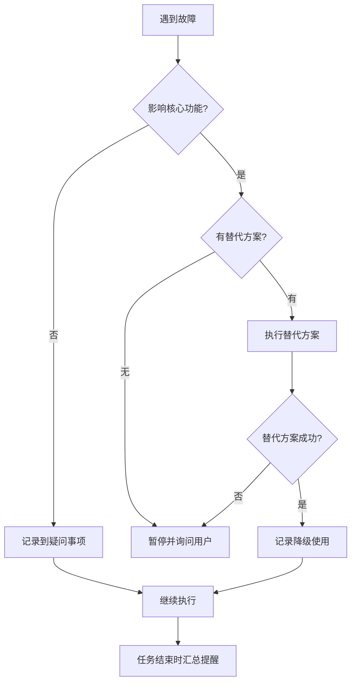

# AI Documentation Framework - Entry Point

> **AI 专用入口文档**  
> **用途**: AI 读取此文件即可理解整个框架，自主决策生成流程  
> **版本**: v2.1  
> **最后更新**: 2025-11-27
>
> ---
>
> **📌 重要说明**:
>
> - ✅ **对用户**: 这是您唯一需要关心的入口文档，将此文档发送给 AI 即可
> - ✅ **对 AI**: 本文档包含所有决策逻辑，其他文档是内部参考文件，按需读取
> - ✅ **其他文档**: 仅在 AI 自主决策时内部使用，用户无需阅读
> - ⚠️ **补充规范**: 必须同时阅读 [`AI_ENTRY_POINT_SUPPLEMENT.md`](./AI_ENTRY_POINT_SUPPLEMENT.md) 了解完整规范

---

## 🎯 框架核心信息

### 设计理念

1. **方案优先** - 先生成分析方案，人工审核后再执行
2. **问题发现** - 分析时记录问题和疑问，不臆测
3. **分层文档** - 主文档（索引）→ 子文档（详细）→ 知识库（经验）
4. **进度可控** - 大型项目分批执行，系统化完成

### 框架能力

- ✅ 支持 9 种编程语言（Python/Java/Go/Rust/PHP/Ruby/C++/JS/TS）
- ✅ 支持 11 种项目类型（前端/后端/全栈/CLI/库/脚本/移动/桌面/Serverless/容器化/数据科学）
- ✅ 涵盖 25+主流框架,支持自动识别其他框架
- ✅ 自动发现代码问题和技术债务
- ✅ 提供完整的进度跟踪机制

---

## 📁 框架文件索引

### 核心文档

| 文件                | 用途              | AI 何时读取      |
| ------------------- | ----------------- | ---------------- |
| `AI_ENTRY_POINT.md` | AI 入口（本文档） | **首次使用必读** |
| `INTRODUCTION.md`   | 人类入门指南      | 无需读取         |

### 指导文档 (`guides/`)

| 文件                            | 用途         | AI 何时读取                 |
| ------------------------------- | ------------ | --------------------------- |
| `guides/quick_start.md`         | 快速开始     | 需要了解使用流程时          |
| `guides/project_types.md`       | 项目类型适配 | **决策子文档清单时必读**    |
| `guides/language_support.md`    | 多语言分析   | **分析非 JS/TS 项目时必读** |
| `guides/generation_workflow.md` | 详细生成流程 | 需要详细步骤时              |

### 模板文档 (`templates/`)

| 文件                                            | 用途               | AI 何时使用             |
| ----------------------------------------------- | ------------------ | ----------------------- |
| `templates/GENERATION_PLAN_TEMPLATE.md`         | 分析方案模板       | **生成方案时必用**      |
| `templates/PROJECT_ANALYSIS_REPORT_TEMPLATE.md` | 问题报告模板       | **生成问题报告时必用**  |
| `templates/PROGRESS_TEMPLATE.md`                | 进度跟踪模板       | **生成过程中必用**      |
| `templates/AI_RULES_TEMPLATE.md`                | AI Rules 模板      | **文档生成完成后必用**  |
| `templates/AI_Coding_Context_TEMPLATE.md`       | 主文档模板         | 生成主文档时参考        |
| `templates/testing_guide_TEMPLATE.md`           | 测试文档模板       | 生成测试文档时使用      |
| `templates/deployment_guide_TEMPLATE.md`        | 部署文档模板       | 生成部署文档时使用      |
| `templates/plans_README_TEMPLATE.md`            | Plans 目录模板     | 创建 plans/时使用       |
| `templates/knowledge_README_TEMPLATE.md`        | Knowledge 目录模板 | 创建 knowledge/时使用   |
| `templates/PLAN_TEMPLATE.md`                    | 方案文档模板       | 创建功能/Bug 方案时使用 |

### 参考文档 (`reference/`)

**跨平台检测命令**:

```bash
# Linux/Mac检测
which cloc && echo "✅ cloc可用" || echo "❌ cloc未安装"
which tokei && echo "✅ tokei可用" || echo "❌ tokei未安装"
which fd && echo "✅ fd可用" || echo "❌ fd未安装"

# Windows PowerShell检测
where.exe cloc
where.exe tokei
where.exe fd

# 如果都未安装，使用基础命令验证
# Windows
powershell -Command "Get-Command Get-ChildItem"
# Linux/Mac
which find
```

#### 0.2 工具选择策略

**优先级排序**:

1. **tokei** (推荐) ⭐⭐⭐
   - 优点: 最快，自动排除.gitignore，跨平台
   - 安装: `cargo install tokei` 或 [下载预编译版](https://github.com/XAMPPRocky/tokei/releases)
2. **cloc** (通用) ⭐⭐

   - 优点: 功能全面，准确
   - 缺点: 需手动配置排除规则
   - 安装:
     ```bash
     # Mac
     brew install cloc
     # Ubuntu
     sudo apt install cloc
     # Windows
     choco install cloc
     ```

3. **fd** (快速查找) ⭐⭐

   - 优点: 比 find 更快，自动排除.gitignore
   - 用途: 配合 wc 统计文件数
   - 安装: `cargo install fd-find` 或包管理器

4. **基础命令** (降级方案) ⭐
   - Windows: `Get-ChildItem` (PowerShell)
   - Linux/Mac: `find` + `wc`
   - 缺点: 速度慢，需手动排除

#### 0.3 自动选择逻辑

```markdown
AI 自动选择流程:

1. 优先使用 tokei（如果可用）
2. 其次使用 cloc（如果可用）
3. 再次使用 fd + wc（如果可用）
4. 最后降级到基础命令
```

**⚠️ 如果所有工具都不可用**:

- 记录到疑问事项
- 建议用户手动提供项目信息
- 或提供工具安装指南

---

### 步骤 1: 项目检测（自动）

#### 1.1 准备排除规则

**⚠️ 重要**: 统计前必须排除依赖目录，否则会严重影响项目规模判断！

**优先使用.gitignore 规则**:

```bash
# 检查项目是否有.gitignore文件
if [ -f ".gitignore" ]; then
    echo "✅ 检测到.gitignore，将应用其排除规则"
fi
```

**通用排除目录**（无论是否有.gitignore 都要排除）:

- Node.js: `node_modules/`, `dist/`, `build/`, `.next/`, `.nuxt/`
- Python: `.venv/`, `venv/`, `__pycache__/`, `*.pyc`, `.pytest_cache/`
- Java: `target/`, `build/`, `.gradle/`
- Go: `vendor/`
- Rust: `target/`
- PHP: `vendor/`
- Ruby: `vendor/`
- C++: `build/`, `cmake-build-*/`
- 通用: `.git/`, `.idea/`, `.vscode/`, `.DS_Store`

---

#### 1.2 检测编程语言

**跨平台命令**:

```bash
# 方案1: 使用fd（推荐，跨平台）
fd -e py | wc -l    # Python
fd -e js -e ts | wc -l  # JavaScript/TypeScript
fd -e java | wc -l  # Java
fd -e go | wc -l    # Go

# 方案2: Linux/Mac - 使用find
find . -name "*.py" -not -path "*/.*" -not -path "*/.venv/*" -not -path "*/venv/*" | wc -l

# 方案3: Windows PowerShell
(Get-ChildItem -Recurse -Filter "*.py" -Exclude node_modules,venv,.venv | Measure-Object).Count
(Get-ChildItem -Recurse -Include *.js,*.ts -Exclude node_modules,dist | Measure-Object).Count
(Get-ChildItem -Recurse -Filter "*.java" -Exclude target,build | Measure-Object).Count
```

---

#### 1.3 统计项目规模

**方案 1: 使用 tokei**（推荐，最快，跨平台）:

```bash
tokei
# tokei自动排除.gitignore中的文件
# 跨平台支持：Windows/Linux/Mac
```

**方案 2: 使用 cloc**:

```bash
# 跨平台命令（Windows/Linux/Mac）
cloc . --exclude-dir=node_modules,dist,vendor,.venv,venv,build,target
```

**方案 3: 基础命令**（降级方案）:

```bash
# Linux/Mac
find . -name "*.py" -o -name "*.js" -o -name "*.ts" | xargs wc -l

# Windows PowerShell
Get-ChildItem -Recurse -Include *.py,*.js,*.ts -Exclude node_modules,dist |
  Get-Content | Measure-Object -Line
```

---

#### 1.4 检测项目类型特征

**跨平台命令**:

```bash
# Linux/Mac
ls package.json 2>/dev/null && echo "检测到Node.js项目"
ls requirements.txt pyproject.toml 2>/dev/null && echo "检测到Python项目"
ls pom.xml build.gradle 2>/dev/null && echo "检测到Java项目"
ls go.mod 2>/dev/null && echo "检测到Go项目"

# Windows PowerShell
Test-Path package.json
Test-Path requirements.txt
Test-Path pom.xml
Test-Path go.mod
```

---

#### 1.5 填写检测结果

```markdown
- 主要语言: [Python/Java/JavaScript/...]
- 项目类型: [前端/后端/全栈/...]
- 项目规模: [小型/中型/大型/超大型]
- 统计范围:
  - 总文件数: [X 个] （不包括依赖）
  - 总代码行: [X 行] （不包括依赖）
  - 排除目录: [列出实际排除的目录]
  - 是否应用.gitignore: [是/否]
```

**⚠️ 再次强调**: 所有统计数据必须明确**排除依赖目录**！

---

### 步骤 2: 策略决策（自动）

**根据项目规模自动决定策略**：

| 检测到的规模（排除依赖后） | 自动选择策略      | 执行方式                   |
| -------------------------- | ----------------- | -------------------------- |
| < 50 文件, < 5K 行         | 🟢 小型项目策略   | 一次性完成（2-4 小时）     |
| 50-200 文件, 5K-20K 行     | 🟡 中型项目策略   | 分 2-3 批（8-12 小时）     |
| 200-500 文件, 20K-50K 行   | 🔴 大型项目策略   | 分 5-8 批（1-2 天）        |
| > 500 文件, > 50K 行       | 🟣 超大型项目策略 | 分 10+批，按模块（1-2 周） |

> **注**: 请确保统计数据已排除依赖目录（node_modules、vendor 等）和.gitignore 中的文件

**⚠️ 重要**: 无论项目规模大小，都必须使用进度记录机制（见下文）！

---

### 步骤 3: 确定子文档清单（自动）

**必读**: `guides/project_types.md`

**根据检测到的项目类型，自动确定子文档清单**：

**示例 - 如果检测到 Vue 3 前端项目**：

```markdown
必需子文档（P0）:

- architecture_overview.md
- api_layer.md
- state_management.md

推荐子文档（P1）:

- routing_guide.md
- component_guide.md
- testing_guide.md

可选子文档（P2）:

- styling_guide.md
- form_validation.md
```

---

#### 3.1 复杂度因子调整（新增 v2.1）

**目的**: 基于项目复杂度特征，智能调整策略级别

**检测复杂度因素**:

**1. Monorepo 检测 (+1 级)**

特征识别:

- 存在 `pnpm-workspace.yaml` 或 `lerna.json`
- package.json 中有 `workspaces` 字段
- 存在 `packages/` 或 `apps/` 目录结构

检测命令（跨平台）:

```bash
# Linux/Mac
test -f pnpm-workspace.yaml && echo "✅ Monorepo"
grep -q "workspaces" package.json 2>/dev/null && echo "✅ Workspaces"

# Windows PowerShell
Test-Path pnpm-workspace.yaml
Select-String -Path package.json -Pattern "workspaces" -Quiet
```

**2. 微服务架构检测 (+1 级)**

特征识别:

- Docker Compose 配置多个服务
- 多个独立服务目录
- Kubernetes 配置文件

检测命令（跨平台）:

```bash
# Linux/Mac
test -f docker-compose.yml && grep -c "services:" docker-compose.yml
find . -name "Dockerfile" | wc -l

# Windows PowerShell
Test-Path docker-compose.yml
(Get-ChildItem -Recurse -Filter "Dockerfile").Count
```

**3. 混合语言检测 (+0.5 级)**

检测逻辑:

```markdown
语言数 ≥ 3 种 → +0.5 级

示例: 同时检测到:

- package.json (Node.js)
- requirements.txt (Python)
- go.mod (Go)
  → 混合语言项目
```

**4. 多租户架构检测 (+0.5 级)**

特征识别:

- 代码中有 `tenant` / `multi-tenant` 关键词
- 配置多品牌/多租户目录

检测命令:

```bash
# 搜索关键词（仅示例，不强制执行）
grep -r "tenant" src/ --include="*.ts" --include="*.js" | wc -l
```

**复杂度调整计算**:

```markdown
最终策略 = 基础策略 + 复杂度因子

级别对应:

- 小型 (0 级)
- 中型 (1 级)
- 大型 (2 级)
- 超大型 (3 级)

示例 1: 中型项目 + Monorepo

- 基础: 中型 (1 级)
- 调整: +1 级 (Monorepo)
- 最终: 2 级 = 大型项目策略

示例 2: 小型项目 + Monorepo + 微服务

- 基础: 小型 (0 级)
- 调整: +1+1 = +2 级
- 最终: 2 级 = 大型项目策略

示例 3: 中型 + 混合语言 + 多租户

- 基础: 中型 (1 级)
- 调整: +0.5+0.5 = +1 级
- 最终: 2 级 = 大型项目策略
```

**调整后输出示例**:

```markdown
📊 项目分析结果:

基础规模: 中型（150 个文件，12K 行代码）

复杂度因素检测:
✅ Monorepo 结构检测 → pnpm-workspace.yaml (+1 级)
✅ 微服务架构检测 → 4 个 Dockerfile (+1 级)
❌ 混合语言检测 → 仅 1 种语言
❌ 多租户架构检测 → 未检测到

复杂度调整: +2 级
最终策略: 大型项目策略（分 5-8 批执行）
```

---

### 步骤 4: 生成分析方案（AI 执行）

**使用模板**：

1. `templates/GENERATION_PLAN_TEMPLATE.md` - 分析方案
2. `templates/PROJECT_ANALYSIS_REPORT_TEMPLATE.md` - 问题报告

**生成位置**：

- `dev_docs/_analysis/generation_plan.md`
- `dev_docs/_analysis/project_analysis_report.md`

**方案必须包含**：

```markdown
## 项目检测结果

- 语言: [自动检测]
- 类型: [自动检测]
- 规模: [自动检测]
- 选择策略: [自动决策]

## 数据验证

- 所有数据提供验证命令
- 所有代码示例提供文件路径+行号
- 所有架构特点提供代码依据

## 子文档清单

[基于 project_types.md 自动决定]

## 发现的问题

🔴 严重问题: [列表]
🟡 警告问题: [列表]
🔵 疑问事项: [列表]
💡 优化建议: [列表]
```

---

### 步骤 5: 等待人工审核

**生成方案后，必须输出**：

```markdown
✅ 已完成项目分析和方案生成！

📊 项目信息：

- 语言: [X]
- 类型: [X]
- 规模: [X] (X 个文件, X 行代码)
- 策略: [X]

📋 生成的文档：

1. dev_docs/\_analysis/generation_plan.md
2. dev_docs/\_analysis/project_analysis_report.md

⚠️ 发现的问题：

- 🔴 严重问题: X 个
- 🟡 警告问题: X 个
- 🔵 疑问事项: X 个

🔍 请审核以下内容：

1. 方案文档中的数据是否准确
2. 问题报告中的问题是否合理
3. 疑问事项需要你确认

审核通过后，请告诉我"方案审核通过"，我将开始生成文档体系。
```

**⏸️ 暂停执行，等待用户确认**

---

## 📊 进度记录机制（必需）

### 为什么需要进度记录？（v2.1 增强说明）

**价值 1: 会话中断恢复** ⭐⭐⭐

- ⚠️ AI 会话可能随时中断（网络问题、超时、手动刷新等）
- ✅ 记录进度后，可从上次位置继续，避免重复劳动

**价值 2: 便于用户审核** ⭐⭐⭐

- ✅ 用户可随时查看 generation_progress.md 了解当前进度
- ✅ 清晰知道已完成哪些文档、正在生成哪些
- ✅ 预估剩余工作量和完成时间

**价值 3: 质量保证** ⭐⭐

- ✅ 强制 AI 按顺序完成，避免遗漏
- ✅ 每个文档都有明确的状态标记
- ✅ 便于发现和修复生成过程中的问题

**价值 4: 协作友好** ⭐

- ✅ 多人可通过进度文件了解生成状态
- ✅ 接手他人工作时快速了解进度

**因此**: ⚠️ **无论项目规模大小，都必须使用进度记录！**

### 进度记录方式

**无论项目规模**，在生成过程中必须创建:  
`dev_docs/_analysis/generation_progress.md`

**使用模板**: `templates/PROGRESS_TEMPLATE.md`

### AI 生成时的行为

1. **开始生成前**:

   ```markdown
   ✅ 创建进度记录: dev_docs/\_analysis/generation_progress.md
   ```

2. **每完成一个文档后**:

   ```markdown
   ✅ 更新进度记录: 标记 XX 文档为已完成
   ```

3. **所有文档生成完毕**:

   ```markdown
   ✅ 更新进度记录: 当前状态 = 已完成
   ✅ 生成完成报告
   ```

4. **如果会话中断，用户恢复时**:

   ```markdown
   用户: "继续生成文档"
   AI:

   1. 读取 dev_docs/\_analysis/generation_progress.md
   2. 识别未完成的部分
   3. 输出: "检测到进度记录，上次完成到 XX，现在从 YY 继续"
   4. 继续生成未完成的部分
   ```

---

### 步骤 6: 执行文档生成（用户确认后）

**用户确认后，执行生成**：

根据策略执行：

- **小型项目**: 一次性生成所有文档
- **中型项目**: 分 2-3 批，每批生成部分文档
- **大型项目**: 分 5-8 批，使用进度跟踪
- **超大型项目**: 按模块分批，详细进度跟踪

**生成顺序**：

1. 主文档 `dev_docs/AI_Coding_Context.md`
2. 高优先级子文档（3 个）
3. 中优先级子文档（按批次）
4. 可选子文档（按需求）
5. `plans/` 和 `knowledge/` 目录结构
6. **AI Rules 文件** `dev_docs/AI_RULES.md` ⭐ **新增**

---

### AI 自检项

生成方案时：

- [ ] 所有统计数据都有验证命令
- [ ] 所有代码示例都有文件路径和行号
- [ ] 所有架构特点都有代码依据
- [ ] 不确定的地方都记录到疑问事项
- [ ] 发现的问题都分类记录
- [ ] 没有使用占位符
- [ ] 没有臆测架构特点

生成文档时：

- [ ] 严格按照审核通过的方案执行
- [ ] 所有数据来自方案中标注的实际代码
- [ ] 文档结构符合模板要求
- [ ] 代码示例完整可用
- [ ] 如偏离方案，先说明原因

---

## �️ 故障降级决策机制（新增 v2.1）

**设计原则**: AI 自主处理故障，能继续则继续，结束时汇总提醒用户

### 降级决策树



### 故障分类与处理

**1. 非致命故障（继续执行）**

| 故障类型         | 处理方式       | 记录级别 |
| ---------------- | -------------- | -------- |
| 统计工具不可用   | 降级到基础命令 | 🟡 警告  |
| 部分文件无法访问 | 跳过并记录     | 🟡 警告  |
| 可选功能检测失败 | 记录到疑问事项 | 🔵 疑问  |

**2. 可降级故障（使用替代方案）**

| 故障类型       | 首选方案   | 降级方案         | 记录级别 |
| -------------- | ---------- | ---------------- | -------- |
| tokei 不可用   | tokei      | cloc → fd → find | 🟡 警告  |
| 复杂度检测失败 | 自动检测   | 使用基础规模     | 🔵 疑问  |
| 特定命令失败   | 跨平台命令 | 手动输入         | 🟡 警告  |

**3. 致命故障（必须暂停）**

| 故障类型         | 处理方式     | 记录级别 |
| ---------------- | ------------ | -------- |
| 无法访问项目目录 | 询问用户     | 🔴 严重  |
| 所有统计工具失败 | 请求手动提供 | 🔴 严重  |
| 无法识别项目类型 | 询问用户确认 | 🔴 严重  |

### 故障记录机制

**故障追踪表** (自动维护):

```markdown
## 生成过程中的故障记录

### 🟡 警告 (已自动处理)

1. [时间] tokei 不可用 → 已降级使用 cloc
2. [时间] Windows 命令失败 → 已使用 Linux 等价命令

### 🔵 疑问 (需确认)

1. [时间] 无法确定是否 Monorepo → 请手动确认
2. [时间] 部分配置文件无法读取 → 请检查权限

### 🔴 严重 (需立即处理)

无
```

### 任务结束时的汇总提醒

**AI 输出模板**:

```markdown
✅ 文档生成完成！

📋 生成的文档:

- dev_docs/AI_Coding_Context.md
- dev_docs/architecture_overview.md
- ... (共 X 个文档)

⚠️ 生成过程中遇到的问题:

🟡 **警告事项** (已自动处理，建议检查):

1. 统计工具 tokei 不可用，已降级使用 cloc
   - 建议: 安装 tokei 以获得更快的统计速度
2. 复杂度检测部分失败
   - Monorepo 检测: ✅ 成功
   - 微服务检测: ❌ docker-compose.yml 无法读取
   - 建议: 手动确认是否为微服务架构

🔵 **疑问事项** (需要您确认):

1. 无法确定主要编程语言（检测到 Python 和 JavaScript 文件数相近）

   - 建议: 在 generation_plan.md 中确认主要语言

2. 项目类型推断为"全栈"，但缺少典型特征文件
   - 建议: 确认项目类型是否准确

🔴 **严重问题**: 无

💡 **建议操作**:

1. 安装推荐的统计工具：`cargo install tokei`
2. 检查并确认上述疑问事项
3. 如发现问题报告有误，请提供反馈
```

### AI 行为规范

**遇到故障时应该**:

1. ✅ 优先尝试替代方案
2. ✅ 记录故障详情和使用的降级方案
3. ✅ 仅在确实无法继续时才询问用户
4. ✅ 在任务结束时汇总所有问题

**遇到故障时不应该**:

1. ❌ 静默忽略问题
2. ❌ 频繁打断用户
3. ❌ 臆测数据继续
4. ❌ 不记录问题就继续

---

## �🔧 特殊场景处理

### 场景 1: 多语言项目

**检测**: 发现多种语言文件  
**处理**: 识别主要语言和次要语言，分别说明

### 场景 2: Monorepo 项目（v2.1 增强）

**检测特征**:

- 存在 workspace 配置文件（pnpm-workspace.yaml / lerna.json）
- package.json 中有 workspaces 字段
- 多个 packages/apps 目录

**处理策略**:

**策略 1: 全局文档（推荐）** ⭐⭐⭐

适用场景: 所有子项目使用相同技术栈

```markdown
生成结构:
dev_docs/
├── AI_Coding_Context.md # 总览文档
│ ├── Monorepo 整体架构
│ ├── 各子项目职责
│ └── 子项目间依赖关系
├── packages/
│ ├── package-a/
│ │ └── README.md # 子项目简介
│ └── package-b/
│ └── README.md
└── knowledge/ # 共享知识库

输出示例:
✅ 检测到 Monorepo 结构（pnpm workspace）
📦 子项目清单:

- packages/web-app (Vue 3 前端)
- packages/mobile-app (React Native)
- packages/shared-utils (共享工具)

策略选择: 全局文档策略
理由: 所有子项目共享相同的开发规范
```

**策略 2: 独立文档**

适用场景: 子项目技术栈差异大

```markdown
生成结构:
packages/
├── web-app/
│ └── dev_docs/ # 独立文档体系
│ ├── AI_Coding_Context.md
│ └── ...
└── api-server/
└── dev_docs/ # 独立文档体系
├── AI_Coding_Context.md
└── ...

输出示例:
✅ 检测到 Monorepo 结构
📦 子项目技术栈差异:

- web-app: Vue 3 + TypeScript
- api-server: Node.js + Express
- worker: Python + Celery

策略选择: 独立文档策略
理由: 技术栈差异大，分开生成更合适
```

**⚠️ 询问用户**:

```markdown
检测到 Monorepo 项目结构，包含以下子项目：

1. packages/web (Vue 3)
2. packages/api (Node.js)
3. packages/shared (TypeScript 工具库)

请选择文档生成策略：
A. 生成全局文档（推荐，适合技术栈统一）
B. 为每个子项目生成独立文档
C. 仅为特定子项目生成（请指定）

请回复 A / B / C-[项目名]
```

### 场景 3: 未识别框架

**检测**: 统计命令执行失败或无法识别项目类型  
**处理**:

1. 列出发现的文件类型
2. 询问用户项目类型
3. 不要臆测，记录到疑问事项

### 场景 4: 遗留代码项目

**检测**: 代码年代久远或技术栈过时  
**处理**:

1. 在问题报告中标注技术栈过时
2. 建议技术升级路径
3. 继续生成文档，但标注风险

---

## 🚀 快速开始模板

**用户首次使用时，你应该这样回复**：

```markdown
你好！我已阅读文档框架的设计。

我将为你的项目自动生成文档体系，请稍候...

## 🔍 正在检测项目...

[执行检测命令...]

## 📊 检测结果

- 主要语言: [X]
- 项目类型: [X]
- 项目规模: [X] ([X]个文件, [X]行代码)
- 自动选择策略: [X]

## 📋 将生成的子文档

基于项目类型，我建议生成以下文档：
[列出推荐的子文档清单]

## ⏭️ 下一步

我将开始生成分析方案（包含问题报告）。
生成完成后需要你审核，审核通过后我将开始生成文档体系。

请确认是否开始？
```

---

## � 故障处理指南

### 场景 1: 项目检测失败

**症状**: 统计命令返回错误或无法执行

**可能原因**:

- 操作系统差异（Windows/Mac/Linux 命令不同）
- 工具未安装（cloc、tokei、fd 等）
- 权限问题

**解决方案**:

1. **Windows 用户**:

   ```powershell
   # 使用PowerShell替代命令
   (Get-ChildItem -Recurse -Filter "*.py" | Measure-Object).Count
   ```

2. **工具未安装**:

   - 询问用户是否安装了统计工具
   - 如没有，提供安装指南或使用基础命令
   - 最后手段：请用户手动提供项目信息

3. **输出到疑问事项**:
   ```markdown
   🔵 疑问: 无法执行统计命令，已请用户手动确认项目规模
   ```

---

### 场景 2: 无法识别项目类型

**症状**: 没有找到典型的依赖文件（package.json、requirements.txt 等）

**解决方案**:

1. 列出发现的文件类型:

   ```markdown
   检测到以下文件类型:

   - .py 文件: 50 个
   - .sh 文件: 10 个
   - .md 文件: 5 个
   ```

2. 询问用户项目类型:

   ```markdown
   🔵 疑问: 无法自动识别项目类型，请确认：

   - 这是什么类型的项目？（脚本/CLI 工具/库/其他）
   - 主要用途是什么？
   ```

3. **禁止臆测**: 不要假设项目类型，必须等待用户确认

---

### 场景 3: 统计数据异常

**症状**: 文件数远超预期（例如小项目显示几千个文件）

**可能原因**: 统计包含了依赖目录（node_modules、vendor 等）

**解决方案**:

1. 检查是否正确排除依赖目录
2. 使用更严格的排除规则:
   ```bash
   cloc . --exclude-dir=node_modules,dist,vendor,.venv,venv,build,target,.git
   ```
3. 向用户确认:
   ```markdown
   🔵 疑问: 检测到[X]个文件，这个数字是否合理？
   如果不合理，可能包含了依赖目录。
   ```

---

### 场景 4: 混合项目类型

**症状**: 发现多种项目类型特征（如同时有 package.json 和 requirements.txt）

**解决方案**:  
⚠️ **不支持混合项目类型**

**输出**:

```markdown
❌ 检测到混合项目类型:

- 前端项目特征: package.json
- 后端项目特征: requirements.txt

🛑 **框架限制**: 此框架仅支持单一项目类型。

💡 **建议**:
如果这是 Monorepo 或前后端混合项目，建议：

1. 在各自子目录单独使用此框架
2. 或选择主要部分（前端/后端）生成文档

请确认您希望为哪部分生成文档？
```

**暂停执行，等待用户确认**

---

### 场景 5: AI 会话中断

**症状**: 生成过程中会话断开、超时、或需要重启

**解决方案**:  
✅ **依赖进度记录机制**（见上文"进度记录机制"）

**恢复步骤**:

1. 检查是否存在 `dev_docs/_analysis/generation_progress.md`
2. 如果存在:

   ```markdown
   ✅ 检测到进度记录
   上次生成进度:

   - 已完成: XX、YY、ZZ
   - 未完成: AA、BB

   现在从 AA 继续生成，是否确认？
   ```

3. 如果不存在:
   ```markdown
   ⚠️ 未检测到进度记录
   建议重新开始生成流程，以确保完整性
   ```

---

### 处理原则

1. ✅ **永远不要臆测** - 不确定的内容记录到疑问事项
2. ✅ **提供验证命令** - 让用户可以自行验证
3. ✅ **优雅降级** - 工具不可用时提供替代方案
4. ✅ **明确限制** - 不支持的场景要清晰告知
5. ✅ **记录问题** - 所有异常都记录到方案的"风险点"章节

---

## �📌 重要提醒

### 禁止事项

1. ❌ **不要跳过方案生成** - 即使是小项目
2. ❌ **不要臆测架构特点** - 必须有代码依据
3. ❌ **不要虚构代码示例** - 必须来自实际文件
4. ❌ **不要跳过问题报告** - 必须记录发现的问题
5. ❌ **不要未经审核就生成** - 必须等待用户确认

### 强制要求

1. ✅ **必须先检测再决策** - 基于实际情况选择策略
2. ✅ **必须生成问题报告** - 记录所有疑问和问题
3. ✅ **必须等待审核** - 方案审核通过后才执行
4. ✅ **必须提供验证** - 所有数据都可验证
5. ✅ **必须记录进度** - 大型项目使用进度跟踪

---

## 🎯 成功标志

**方案阶段成功**：

- ✅ 准确检测项目信息
- ✅ 合理选择生成策略
- ✅ 生成可验证的方案
- ✅ 发现并记录问题
- ✅ 获得用户审核通过

**文档生成成功**：

- ✅ 按方案准确执行
- ✅ 文档结构完整
- ✅ 代码示例真实
- ✅ 数据准确可验证
- ✅ 用户确认满意

---

**AI，你现在可以开始了！** 🚀

根据上述流程，自主完成项目检测、策略决策、方案生成，然后等待用户审核确认。
