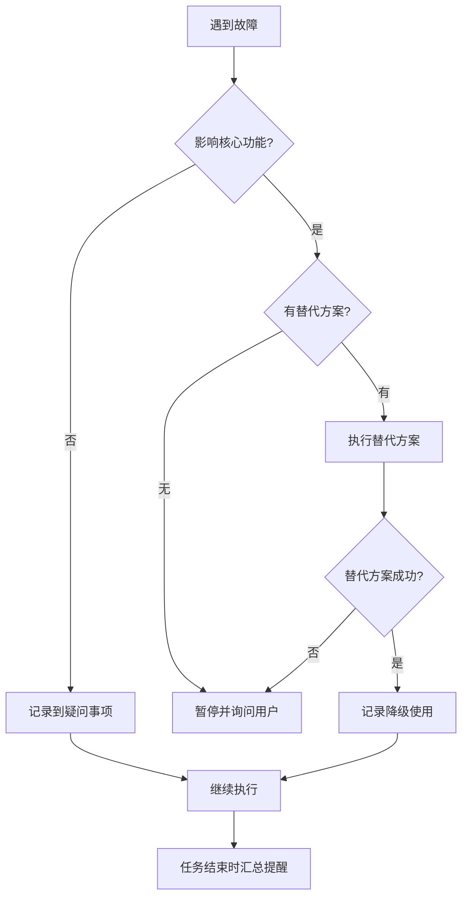

# AI Coding Context - Entry Point

> **AI 专用入口文档**  
> **用途**: AI 读取此文件即可理解整个框架，自主决策生成流程  
> **版本**: v2.3  
> **最后更新**: 2025-11-28
>
> ---
>
> **📌 重要说明**:
>
> - ✅ **对用户**: 这是您唯一需要关心的入口文档，将此文档发送给 AI 即可
> - ✅ **对 AI**: 本文档包含所有决策逻辑，其他文档是内部参考文件，按需读取
> - ✅ **其他文档**: 仅在 AI 自主决策时内部使用，用户无需阅读
>
> **📚 必读核心规范** (优先阅读):
>
> 1. [语言规范](./core/language_rules.md) - 确定文档生成语言
> 2. [安全规范](./core/security_rules.md) - 敏感信息脱敏
> 3. [项目类型规范](./core/project_types.md) - 项目类型识别与处理

---

## 🎯 框架核心信息

### 设计理念

1. **方案优先** - 先生成分析方案，人工审核后再执行
2. **基于代码** - 一切分析以实际代码为依据，禁止臆测
3. **问题发现** - 分析时记录问题和疑问，不确定时标注
4. **分层文档** - 主文档（索引）→ 子文档（详细）→ 知识库（经验）
5. **进度可控** - 大型项目分批执行，系统化完成

### 框架能力

- ✅ 支持 9 种编程语言（Python/Java/Go/Rust/PHP/Ruby/C++/JS/TS）
- ✅ 支持 11 种项目类型（前端/后端/全栈/CLI/库/脚本/移动/桌面/Serverless/容器化/数据科学）
- ✅ 涵盖 25+主流框架,支持自动识别其他框架
- ✅ 自动发现代码问题和技术债务
- ✅ 提供完整的进度跟踪机制
- ✅ 提供标准化的专业 AI 角色库 (Agent Library)

---

## 📁 框架文件索引

### 核心文档

| 文件                | 用途              | AI 何时读取      |
| ------------------- | ----------------- | ---------------- |
| `AI_ENTRY_POINT.md` | AI 入口（本文档） | **首次使用必读** |
| `INTRODUCTION.md`   | 人类入门指南      | 无需读取         |

### 核心规范 (`core/`) **[v2.2 新增]**

| 文件                      | 用途               | AI 何时读取            |
| ------------------------- | ------------------ | ---------------------- |
| `core/language_rules.md`  | 文档语言确认       | **开始前必读**         |
| `core/security_rules.md`  | 敏感信息脱敏规范   | **生成文档时必读**     |
| `core/project_types.md`   | 项目类型识别与处理 | **决策子文档清单必读** |
| `core/update_triggers.md` | 文档更新触发机制   | 生成完成后阅读         |

### AI 角色库 (`agents/`) **[v3.0 新增]**

| 文件                            | 用途         | AI 何时读取            |
| ------------------------------- | ------------ | ---------------------- |
| `agents/README.md`              | 角色库索引   | **需要使用特定角色时** |
| `agents/runtime/*.md`           | 运行时角色   | 自动审查/测试/优化时   |
| `agents/development/*.md`       | 开发时角色   | 架构设计/数据库设计时  |
| `agents/language_specific/*.md` | 语言专属角色 | 特定语言开发时         |
| `agents/workflows/*.md`         | 协作工作流   | 执行复杂任务时         |

### 流程文档 (`workflows/`) **[v2.2 新增]**

| 文件                                       | 用途              | AI 何时读取                     |
| ------------------------------------------ | ----------------- | ------------------------------- |
| `workflows/detection_workflow.md`          | 项目检测详细流程  | 执行步骤 0-1 时参考             |
| `workflows/decision_workflow.md`           | 策略决策详细流程  | 执行步骤 2-3 时参考             |
| `workflows/generation_workflow.md`         | 文档生成详细流程  | 执行步骤 4-6 时参考             |
| `workflows/progress_tracking.md`           | 进度记录机制      | 了解进度管理时参考              |
| `workflows/incremental_update_workflow.md` | 增量更新流程      | 执行增量更新时参考 (v2.3)       |
| `workflows/monorepo_workflow.md`           | Monorepo 处理流程 | **Monorepo 项目必读** (v2.3)    |
| `workflows/document_health_check.md`       | 文档健康度检查    | **检测到现有文档时必读** (v2.3) |
| `workflows/create_custom_tool_workflow.md` | 自定义工具创建    | **需要创建新工具时必读** (v3.0) |

### 实用工具库 (`tools/`) **[v3.0 新增]**

| 文件                  | 用途             | AI 何时使用             |
| --------------------- | ---------------- | ----------------------- |
| `tools/README.md`     | 工具库使用指南   | **需要使用工具时必读**  |
| `tools/py/*.py`       | Python 工具脚本  | 环境预检/项目检测时调用 |
| `tools/js/*.js`       | Node.js 工具脚本 | Python 不可用时调用     |
| `tools/fallback/*.md` | 降级命令速查     | 无运行时环境时参考      |

### 指导文档 (`guides/`)

| 文件                                 | 用途              | AI 何时读取                 |
| ------------------------------------ | ----------------- | --------------------------- |
| `guides/quick_start.md`              | 快速开始          | 需要了解使用流程时          |
| `guides/project_types.md`            | 项目类型适配      | **决策子文档清单时必读**    |
| `guides/language_support.md`         | 多语言分析        | **分析非 JS/TS 项目时必读** |
| `guides/ai_rules_maintenance.md`     | AI Rules 维护指南 | **生成完成后阅读** (v2.3)   |
| `guides/configuration_management.md` | 配置管理最佳实践  | 了解配置方案时参考 (v2.3)   |

### 模板文档 (`templates/`)

| 文件                                            | 用途               | AI 何时使用             |
| ----------------------------------------------- | ------------------ | ----------------------- |
| `templates/GENERATION_PLAN_TEMPLATE.md`         | 分析方案模板       | **生成方案时必用**      |
| `templates/PROJECT_ANALYSIS_REPORT_TEMPLATE.md` | 问题报告模板       | **生成问题报告时必用**  |
| `templates/PROGRESS_TEMPLATE.md`                | 进度跟踪模板       | **生成过程中必用**      |
| `templates/AI_RULES_TEMPLATE.md`                | AI Rules 模板      | **文档生成完成后必用**  |
| `templates/AI_Coding_Context_TEMPLATE.md`       | 主文档模板         | 生成主文档时参考        |
| `templates/testing_guide_TEMPLATE.md`           | 测试文档模板       | 生成测试文档时使用      |
| `templates/deployment_guide_TEMPLATE.md`        | 部署文档模板       | 生成部署文档时使用      |
| `templates/plans_README_TEMPLATE.md`            | Plans 目录模板     | 创建 plans/时使用       |
| `templates/knowledge_README_TEMPLATE.md`        | Knowledge 目录模板 | 创建 knowledge/时使用   |
| `templates/PLAN_TEMPLATE.md`                    | 方案文档模板       | 创建功能/Bug 方案时使用 |

### 参考文档 (`reference/`)

| 文件                            | 用途         | AI 何时参考    |
| ------------------------------- | ------------ | -------------- |
| `reference/design_decisions.md` | 设计决策说明 | 了解设计理由时 |
| `reference/framework_spec.md`   | 文档体系规范 | 生成任意文档时 |

---

## 🔀 智能工作流分流 (v2.3)

### 首次使用自动检测

AI 读取本文档后，应**首先执行以下检测**，根据项目状态选择合适的工作流：

**步骤-1: 检测现有文档体系**

```bash
# 检测dev_docs目录是否存在
if [ -d "dev_docs" ]; then
    # 检测主文档是否存在
    if [ -f "dev_docs/AI_Coding_Context.md" ]; then
        echo "✅ 检测到现有文档体系"
        # → 进入场景4: 文档健康度检查
    else
        echo "⚠️ dev_docs存在但文档不完整"
        # → 询问用户：修复还是重新生成
    fi
else
    echo "📝 未检测到文档体系"
    # → 进入首次生成流程（步骤0-6）
fi
```

**跨平台命令**:

```bash
# Linux/Mac
test -f dev_docs/AI_Coding_Context.md && echo "文档存在" || echo "文档不存在"

# Windows PowerShell
Test-Path dev_docs/AI_Coding_Context.md
```

---

### 分流决策逻辑

| 检测结果                   | AI 行为    | 进入流程         |
| -------------------------- | ---------- | ---------------- |
| dev_docs/不存在            | 首次生成   | 步骤 0-6（下方） |
| dev_docs/存在 + 主文档存在 | 健康度检查 | 场景 4（下方）   |
| dev_docs/存在但文档不完整  | 询问用户   | 修复 or 重新生成 |

---

### 分流输出示例

#### 情况 1: 检测到现有文档

```markdown
✅ 检测到现有文档体系！

📁 发现的文档:

- dev_docs/AI_Coding_Context.md ✅
- dev_docs/\_analysis/generation_plan.md ✅
- dev_docs/\_analysis/generation_progress.md ✅

📅 文档元数据:

- 生成日期: 2025-09-15
- 距今: 74 天
- 文档版本: v1.0

💡 建议操作:
A. 执行文档健康度检查（推荐）- 评估是否需要更新
B. 直接进行增量更新 - 如果确定代码有变更
C. 重新生成文档 - 如果需要完全重建

请选择: A / B / C
```

#### 情况 2: 未检测到文档

```markdown
📝 未检测到文档体系

将执行首次生成流程:

- 步骤 0: 环境预检
- 步骤 1: 项目检测
- 步骤 2-6: 生成执行

继续执行...
```

#### 情况 3: 文档不完整

```markdown
⚠️ 检测到 dev_docs/目录，但文档不完整

发现的文件:

- dev_docs/\_analysis/generation_plan.md ✅
- dev_docs/AI_Coding_Context.md ❌ 缺失

💡 可能原因:

- 上次生成未完成
- 文档被误删除
- 目录结构不正确

建议操作:
A. 修复文档（尝试恢复或补全）
B. 重新生成文档（推荐）

请选择: A / B
```

---

## 🚀 文档生成流程

### 步骤 0: 环境预检（自动）

**使用统一工具检查环境**：

```bash
# 优先尝试 Python 版本
python tools/py/env_diagnosis.py

# 如果失败，尝试 Node.js 版本
node tools/js/env_diagnosis.js

# 如果都失败，使用 Fallback 命令
# Windows: tools/fallback/commands_win.md
# Unix: tools/fallback/commands_unix.md
```

**详细操作**: 参见 [检测流程](./workflows/detection_workflow.md#环境预检)

---

### 步骤 1: 项目检测（自动）

**使用项目扫描器获取结构化数据**：

```bash
# Python 版本 (推荐)
python tools/py/project_scanner.py --max-files 2000

# Node.js 版本
node tools/js/project_scanner.js --max-files 2000
```

**检测内容**：

1. **项目结构**: 完整的目录树 (JSON/Tree)
2. **项目规模**: 精确的文件数和目录数
3. **忽略规则**: 自动遵守 `.gitignore`

**检测结果示例**：

```json
{
  "structure": { ... },
  "stats": {
    "files": 150,
    "dirs": 25
  }
}
```

**⚠️ 再次强调**: 工具会自动排除 `.gitignore` 中的文件，无需手动过滤！

---

### 步骤 2: 策略决策（自动）

**根据扫描器返回的 `stats.files` 自动决定策略**：

| 检测到的规模 (文件数) | 自动选择策略      | 执行方式                   |
| --------------------- | ----------------- | -------------------------- |
| < 50 文件             | 🟢 小型项目策略   | 一次性完成（2-4 小时）     |
| 50-200 文件           | 🟡 中型项目策略   | 分 2-3 批（8-12 小时）     |
| 200-500 文件          | 🔴 大型项目策略   | 分 5-8 批（1-2 天）        |
| > 500 文件            | 🟣 超大型项目策略 | 分 10+批，按模块（1-2 周） |

> **注**: `project_scanner` 已自动排除忽略文件，直接使用其统计结果即可。

**⚠️ 重要**: 无论项目规模大小，都必须使用进度记录机制（见下文）！

---

### 步骤 3: 确定子文档清单（自动）

**必读**: `guides/project_types.md`

**根据检测到的项目类型，自动确定子文档清单**：

**示例 - 如果检测到 Vue 3 前端项目**：

```markdown
必需子文档（P0）:

- architecture_overview.md
- api_layer.md
- state_management.md

推荐子文档（P1）:

- routing_guide.md
- component_guide.md
- testing_guide.md

可选子文档（P2）:

- styling_guide.md
- form_validation.md
```

---

#### 3.1 复杂度因子调整（新增 v2.1）

**目的**: 基于项目复杂度特征，智能调整策略级别

**复杂度因素**:

| 因素       | 影响  | 识别特征                    |
| ---------- | ----- | --------------------------- |
| Monorepo   | +1 级 | workspace 配置、多包目录    |
| 微服务架构 | +1 级 | Docker Compose、多服务      |
| 混合语言   | +0.5  | ≥3 种编程语言               |
| 多租户架构 | +0.5  | tenant 相关代码、多品牌配置 |

**详细检测方法**: 参见 [决策流程](./workflows/decision_workflow.md#复杂度检测)

**计算公式**:

```
最终策略级别 = 基础级别 + 复杂度因子之和

级别对应:
- 小型 (0 级)
- 中型 (1 级)
- 大型 (2 级)
- 超大型 (3 级)
```

**示例**:

```markdown
中型项目 (1 级) + Monorepo (+1) + 混合语言 (+0.5)
= 2.5 级 → 大型项目策略
```

---

### 步骤 4: 生成分析方案（AI 执行）

**使用模板**：

1. `templates/GENERATION_PLAN_TEMPLATE.md` - 分析方案
2. `templates/PROJECT_ANALYSIS_REPORT_TEMPLATE.md` - 问题报告

**生成位置**：

- `dev_docs/_analysis/generation_plan.md`
- `dev_docs/_analysis/project_analysis_report.md`

**方案必须包含**：

```markdown
## 项目检测结果

- 语言: [自动检测]
- 类型: [自动检测]
- 规模: [自动检测]
- 选择策略: [自动决策]

## 数据验证

- **使用 `tools/content_searcher` 进行精准验证**
- 所有数据提供验证命令
- 所有代码示例提供文件路径+行号
- 所有架构特点提供代码依据

## 子文档清单

[基于 project_types.md 自动决定]

## 发现的问题

🔴 严重问题: [列表]
🟡 警告问题: [列表]
🔵 疑问事项: [列表]
💡 优化建议: [列表]
```

---

### 步骤 5: 等待人工审核

**生成方案后，必须输出**：

```markdown
✅ 已完成项目分析和方案生成！

📊 项目信息：

- 语言: [X]
- 类型: [X]
- 规模: [X] (X 个文件, X 行代码)
- 策略: [X]

📋 生成的文档：

1. dev_docs/\_analysis/generation_plan.md
2. dev_docs/\_analysis/project_analysis_report.md

⚠️ 发现的问题：

- 🔴 严重问题: X 个
- 🟡 警告问题: X 个
- 🔵 疑问事项: X 个

🔍 请审核以下内容：

1. 方案文档中的数据是否准确
2. 问题报告中的问题是否合理
3. 疑问事项需要你确认

审核通过后，请告诉我"方案审核通过"，我将开始生成文档体系。
```

**⏸️ 暂停执行，等待用户确认**

---

## 📊 进度记录机制（必需）

⚠️ **无论项目规模大小，都必须使用进度记录！**

### 为什么需要？

| 价值                | 说明                                 |
| ------------------- | ------------------------------------ |
| 会话中断恢复 ⭐⭐⭐ | AI 会话可能随时中断,记录进度避免重复 |
| 便于用户审核 ⭐⭐⭐ | 随时了解当前进度,预估剩余工作量      |
| 质量保证 ⭐⭐       | 强制按顺序完成,避免遗漏              |
| 协作友好 ⭐         | 多人协作或交接工作时快速了解进度     |

### 如何记录？

**固定路径**: `dev_docs/_analysis/generation_progress.md`  
**使用模板**: `templates/PROGRESS_TEMPLATE.md`

**详细说明**: 参见 [进度记录机制](./workflows/progress_tracking.md)

---

### 步骤 6: 执行文档生成（用户确认后）

**用户确认后，执行生成**：

根据策略执行：

- **小型项目**: 一次性生成所有文档
- **中型项目**: 分 2-3 批，每批生成部分文档
- **大型项目**: 分 5-8 批，使用进度跟踪
- **超大型项目**: 按模块分批，详细进度跟踪

**生成顺序**：

1. 主文档 `dev_docs/AI_Coding_Context.md`
2. 高优先级子文档（3 个）
3. 中优先级子文档（按批次）
4. 可选子文档（按需求）
5. `plans/` 和 `knowledge/` 目录结构
6. **AI Rules 文件** `dev_docs/AI_RULES.md` ⭐ **新增**

---

### AI 自检项

生成方案时：

- [ ] 所有统计数据都有验证命令
- [ ] 所有代码示例都有文件路径和行号
- [ ] 所有架构特点都有代码依据
- [ ] 不确定的地方都记录到疑问事项
- [ ] 发现的问题都分类记录
- [ ] 没有使用占位符
- [ ] 没有臆测架构特点

生成文档时：

- [ ] 严格按照审核通过的方案执行
- [ ] 所有数据来自方案中标注的实际代码
- [ ] 文档结构符合模板要求
- [ ] 代码示例完整可用
- [ ] 如偏离方案，先说明原因

---

## �️ 故障降级决策机制（新增 v2.1）

**设计原则**: AI 自主处理故障，能继续则继续，结束时汇总提醒用户

### 降级决策树



### 故障分类与处理

**1. 非致命故障（继续执行）**

| 故障类型         | 处理方式       | 记录级别 |
| ---------------- | -------------- | -------- |
| 统计工具不可用   | 降级到基础命令 | 🟡 警告  |
| 部分文件无法访问 | 跳过并记录     | 🟡 警告  |
| 可选功能检测失败 | 记录到疑问事项 | 🔵 疑问  |

**2. 可降级故障（使用替代方案）**

| 故障类型       | 首选方案   | 降级方案         | 记录级别 |
| -------------- | ---------- | ---------------- | -------- |
| tokei 不可用   | tokei      | cloc → fd → find | 🟡 警告  |
| 复杂度检测失败 | 自动检测   | 使用基础规模     | 🔵 疑问  |
| 特定命令失败   | 跨平台命令 | 手动输入         | 🟡 警告  |

**3. 致命故障（必须暂停）**

| 故障类型         | 处理方式     | 记录级别 |
| ---------------- | ------------ | -------- |
| 无法访问项目目录 | 询问用户     | 🔴 严重  |
| 所有统计工具失败 | 请求手动提供 | 🔴 严重  |
| 无法识别项目类型 | 询问用户确认 | 🔴 严重  |

### 故障记录机制

**故障追踪表** (自动维护):

```markdown
## 生成过程中的故障记录

### 🟡 警告 (已自动处理)

1. [时间] tokei 不可用 → 已降级使用 cloc
2. [时间] Windows 命令失败 → 已使用 Linux 等价命令

### 🔵 疑问 (需确认)

1. [时间] 无法确定是否 Monorepo → 请手动确认
2. [时间] 部分配置文件无法读取 → 请检查权限

### 🔴 严重 (需立即处理)

无
```

### 任务结束时的汇总提醒

**AI 输出模板**:

```markdown
✅ 文档生成完成！

📋 生成的文档:

- dev_docs/AI_Coding_Context.md
- dev_docs/architecture_overview.md
- ... (共 X 个文档)

⚠️ 生成过程中遇到的问题:

🟡 **警告事项** (已自动处理，建议检查):

1. 统计工具 tokei 不可用，已降级使用 cloc
   - 建议: 安装 tokei 以获得更快的统计速度
2. 复杂度检测部分失败
   - Monorepo 检测: ✅ 成功
   - 微服务检测: ❌ docker-compose.yml 无法读取
   - 建议: 手动确认是否为微服务架构

🔵 **疑问事项** (需要您确认):

1. 无法确定主要编程语言（检测到 Python 和 JavaScript 文件数相近）

   - 建议: 在 generation_plan.md 中确认主要语言

2. 项目类型推断为"全栈"，但缺少典型特征文件
   - 建议: 确认项目类型是否准确

🔴 **严重问题**: 无

💡 **建议操作**:

1. 安装推荐的统计工具：`cargo install tokei`
2. 检查并确认上述疑问事项
3. 如发现问题报告有误，请提供反馈
```

### AI 行为规范

**遇到故障时应该**:

1. ✅ 优先尝试替代方案
2. ✅ 记录故障详情和使用的降级方案
3. ✅ 仅在确实无法继续时才询问用户
4. ✅ 在任务结束时汇总所有问题

**遇到高频操作时应该**:

1. ✅ **主动识别**: 在当前会话中，若发现重复执行的复杂操作或者预测到该操作可能在别的场景中重复使用
2. ✅ **建议沉淀**: 建议用户将其封装为通用工具
3. ✅ **参考流程**: 引导用户参考 `workflows/create_custom_tool_workflow.md`
4. ✅ **未来展望**: (V3.1) 将引入配置系统自动追踪跨会话的高频操作，将这一步内化为框架的自主行为

**遇到故障时不应该**:

1. ❌ 静默忽略问题
2. ❌ 频繁打断用户
3. ❌ 臆测数据继续
4. ❌ 不记录问题就继续

---

## �🔧 特殊场景处理

### 场景 1: 多语言项目

**检测**: 发现多种语言文件  
**处理**: 识别主要语言和次要语言，分别说明

### 场景 2: Monorepo 项目（v2.1 增强）

**检测特征**:

- 存在 workspace 配置文件（pnpm-workspace.yaml / lerna.json）
- package.json 中有 workspaces 字段
- 多个 packages/apps 目录

**处理策略**:

**策略 1: 全局文档（推荐）** ⭐⭐⭐

适用场景: 所有子项目使用相同技术栈

```markdown
生成结构:
dev_docs/
├── AI_Coding_Context.md # 总览文档
│ ├── Monorepo 整体架构
│ ├── 各子项目职责
│ └── 子项目间依赖关系
├── packages/
│ ├── package-a/
│ │ └── README.md # 子项目简介
│ └── package-b/
│ └── README.md
└── knowledge/ # 共享知识库

输出示例:
✅ 检测到 Monorepo 结构（pnpm workspace）
📦 子项目清单:

- packages/web-app (Vue 3 前端)
- packages/mobile-app (React Native)
- packages/shared-utils (共享工具)

策略选择: 全局文档策略
理由: 所有子项目共享相同的开发规范
```

**策略 2: 独立文档**

适用场景: 子项目技术栈差异大

```markdown
生成结构:
packages/
├── web-app/
│ └── dev_docs/ # 独立文档体系
│ ├── AI_Coding_Context.md
│ └── ...
└── api-server/
└── dev_docs/ # 独立文档体系
├── AI_Coding_Context.md
└── ...

输出示例:
✅ 检测到 Monorepo 结构
📦 子项目技术栈差异:

- web-app: Vue 3 + TypeScript
- api-server: Node.js + Express
- worker: Python + Celery

策略选择: 独立文档策略
理由: 技术栈差异大，分开生成更合适
```

**策略 2 详细执行步骤**: 参见 [Monorepo 工作流](./workflows/monorepo_workflow.md)

**要点概述**:

1. 检测子项目清单（跨平台命令）
2. 用户确认生成范围（全部/部分/自定义）
3. 逐个子项目执行完整生成流程
4. 生成根目录 README 索引文档
5. 完成汇总和使用提示

**详细操作流程**: 请查阅 [workflows/monorepo_workflow.md](./workflows/monorepo_workflow.md)

**⚠️ 询问用户**:

```markdown
检测到 Monorepo 项目结构，包含以下子项目：

1. packages/web (Vue 3)
2. packages/api (Node.js)
3. packages/shared (TypeScript 工具库)

请选择文档生成策略：

A. 生成全局文档（推荐，适合技术栈统一）

- 一个主文档包含所有子项目
- 共享知识库
- 适合: 所有子项目使用相同技术栈

B. 为每个子项目生成独立文档

- 每个子项目有完整的 dev_docs/
- 独立的 AI_Coding_Context.md
- 根目录生成索引 README
- 适合: 技术栈差异大

C. 仅为特定子项目生成（部分生成）

- 手动选择需要生成的子项目
- 可多选，例如: C-web,api (生成 web 和 api)
- 根目录生成包含选中项目的 README
- 适合: 只关注部分子项目

请回复 A / B / C-[项目名,项目名] (例如: C-web,api)
```

### 场景 3: 未识别框架

**检测**: 统计命令执行失败或无法识别项目类型  
**处理**:

1. 列出发现的文件类型
2. 询问用户项目类型
3. 不要臆测，记录到疑问事项

### 场景 4: 文档健康度检查 (v2.3)

**触发条件**:

- 检测到现有`dev_docs/`文档体系
- 距上次文档生成已有一段时间
- 用户不确定文档是否仍然准确

**检查模式**: 参见 [文档健康度检查流程](./workflows/document_health_check.md)

**三种检查模式**:

| 模式                | 时长       | Token 消耗  | 适用场景               |
| ------------------- | ---------- | ----------- | ---------------------- |
| 模式 1: 快速扫描 ⚡ | 1 分钟     | ~50 tokens  | 快速评估               |
| 模式 2: 标准检查 ⭐ | 3-5 分钟   | ~250 tokens | 常规评估（推荐）       |
| 模式 3: 深度分析 🔍 | 10-15 分钟 | ~900 tokens | 长期未更新或重大变更后 |

> 注意：上方表格“Token 消耗”列中的数据，仅作为量级参考，并非实际 tokens 消耗。

**默认行为**:

1. 自动执行快速扫描（无需询问用户）
2. 输出评估卡片
3. 给出选项让用户选择（A/B/C/D/E）

**健康度评分**: 百分制，分 5 级（优秀/良好/一般/较差/极差）

**降级策略**: Git diff → 文件时间对比（双向）→ 用户提供 → 仅时间

**详细说明**: [workflows/document_health_check.md](./workflows/document_health_check.md)

### 场景 5: 遗留代码项目

**检测**: 代码年代久远或技术栈过时  
**处理**:

1. 在问题报告中标注技术栈过时
2. 建议技术升级路径
3. 继续生成文档，但标注风险

---

## 🚀 快速开始模板

**用户首次使用时，你应该这样回复**：

```markdown
你好！我已阅读文档框架的设计。

我将为你的项目自动生成文档体系，请稍候...

## 🔍 正在检测项目...

[执行检测命令...]

## 📊 检测结果

- 主要语言: [X]
- 项目类型: [X]
- 项目规模: [X] ([X]个文件, [X]行代码)
- 自动选择策略: [X]

## 📋 将生成的子文档

基于项目类型，我建议生成以下文档：
[列出推荐的子文档清单]

## ⏭️ 下一步

我将开始生成分析方案（包含问题报告）。
生成完成后需要你审核，审核通过后我将开始生成文档体系。

请确认是否开始？
```

---

## 🛠️ 故障处理指南

### 降级决策原则

**设计理念**: AI 自主处理故障,能继续则继续,结束时汇总提醒用户

**故障分类**:

| 类型   | 处理方式     | 示例                        |
| ------ | ------------ | --------------------------- |
| 非致命 | 降级继续     | 统计工具不可用 → 用基础命令 |
| 可降级 | 使用替代方案 | tokei→cloc→fd→find          |
| 致命   | 暂停询问用户 | 无法访问项目目录            |

**详细降级机制**: 参见 AI_ENTRY_POINT.md 第 420-540 行（故障降级决策机制）

### 处理原则

1. ✅ **永远不要臆测** - 不确定的内容记录到疑问事项
2. ✅ **提供验证命令** - 让用户可以自行验证
3. ✅ **优雅降级** - 工具不可用时提供替代方案
4. ❌ **不要跳过问题报告** - 必须记录发现的问题
5. ❌ **不要未经审核就生成** - 必须等待用户确认

### 强制要求

1. ✅ **必须先检测再决策** - 基于实际情况选择策略
2. ✅ **必须生成问题报告** - 记录所有疑问和问题
3. ✅ **必须等待审核** - 方案审核通过后才执行
4. ✅ **必须提供验证** - 所有数据都可验证
5. ✅ **必须记录进度** - 大型项目使用进度跟踪

---

## 🎯 成功标志

**方案阶段成功**：

- ✅ 准确检测项目信息
- ✅ 合理选择生成策略
- ✅ 生成可验证的方案
- ✅ 发现并记录问题
- ✅ 获得用户审核通过

**文档生成成功**：

- ✅ 按方案准确执行
- ✅ 文档结构完整
- ✅ 代码示例真实
- ✅ 数据准确可验证
- ✅ 用户确认满意

---

**AI，你现在可以开始了！** 🚀

根据上述流程，自主完成项目检测、策略决策、方案生成，然后等待用户审核确认。
