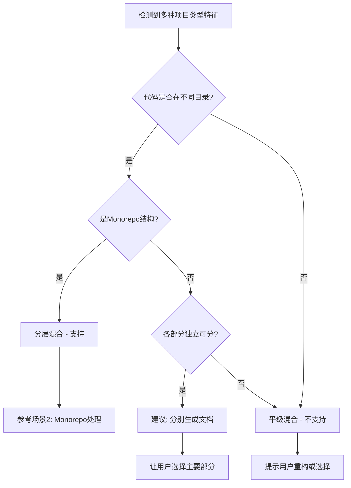

# AI Documentation Framework - 补充规范 (v2.1.1)

> **重要**: 本文档补充`AI_ENTRY_POINT.md`中未包含的重要规范  
> **版本**: v2.1.1  
> **最后更新**: 2025-11-27

---

## 🌍 文档语言确认 (必须)

**在开始任何检测前,AI 必须先询问用户文档语言偏好**:

```markdown
📝 在开始生成文档体系前,请确认:

**您希望生成的文档使用什么语言?**

A. 中文 (推荐,默认)
B. 英文  
C. 其他语言 (请指定)

请回复 A / B / C-[语言名]
```

**处理规则**:

- 如果用户没有明确选择,**默认使用中文**
- 所有生成的文档(AI_Coding_Context.md、子文档、knowledge/、plans/等)都使用用户选择的语言
- 代码示例中的注释也使用相应语言
- AI_RULES.md 中的规则描述也使用相应语言

**注意事项**:

- ✅ 询问放在最开始(步骤 0 之前),避免重复工作
- ✅ 语言选择影响所有后续生成的文档
- ✅ 不要假设用户偏好,必须明确询问

---

## 🔒 敏感信息处理规范 (必须遵守)

**在生成任何文档时都必须遵守以下脱敏规则**:

### 脱敏规则

1. **API 密钥** → 替换为 `sk-xxx...xxx` (保留前后各 3 位)
2. **数据库密码** → 替换为 `********`
3. **私钥文件内容** → 替换为 `[REDACTED]`
4. **真实域名** → 替换为 `example.com` 或 `yourdomain.com`
5. **真实 IP 地址** → 替换为 `192.168.x.x` 或 `10.0.x.x`
6. **个人身份信息** → 替换为 `[PII_REDACTED]`
7. **JWT Token** → 替换为 `eyJxxx...xxx`(保留前后各 3 个字符)

### 示例

❌ **错误**:

```javascript
const apiKey = "sk-1234567890abcdefghijklmn";
const dbPassword = "MyS3cr3tP@ssw0rd";
const dbHost = "db.mycompany.com";
```

✅ **正确**:

```javascript
const apiKey = process.env.API_KEY; // sk-123...lmn
const dbPassword = process.env.DB_PASSWORD; // ********
const dbHost = process.env.DB_HOST; // example.com
```

### 环境变量处理

**推荐做法**:

- 在文档中始终使用 `process.env.XXX` 或 `os.getenv('XXX')` 形式
- 在注释中可以展示脱敏后的示例值

**示例**:

```python
# 正确方式
API_KEY = os.getenv('API_KEY')  # sk-abc...xyz

# 错误方式 - 不要直接写真实值
API_KEY = "sk-1234567890abcdefghijklmn"
```

### 生成后自检清单

每生成一个文档后,AI 必须自检:

- [ ] 是否包含真实 API 密钥?
- [ ] 是否包含真实密码?
- [ ] 是否包含真实域名/IP?
- [ ] 是否包含个人身份信息?
- [ ] 所有敏感配置是否使用环境变量?

---

## 🔀 混合项目类型处理规范

### 定义澄清

**平级混合** (❌ 不支持):

- 前端和后端代码混在同一目录层级
- 例如: 根目录同时有 `package.json` 和 `requirements.txt`,且代码未分离
- 无明确的目录分离

**分层混合** (✅ 支持):

- 代码按模块/功能清晰分层
- 例如: Monorepo 结构 (`packages/frontend`, `packages/backend`)
- 有明确的目录分离

### 判断流程



### 处理策略

#### 如检测到平级混合

**输出模板**:

```markdown
❌ 检测到平级混合项目类型:

- 前端特征: package.json
- 后端特征: requirements.txt
- 位置: 都在根目录,代码未分离

🛑 **框架限制**: 本框架不支持平级混合项目类型。

💡 **建议**:

1. **重构项目结构** (推荐):
```

project/
├── frontend/ # 前端代码
│ └── package.json
├── backend/ # 后端代码
│ └── requirements.txt
└── README.md

```
重构后可为每个部分分别生成文档。

2. **选择主要部分**:
如果一部分是主要的,另一部分是辅助的,
请告诉我您希望为哪部分生成文档?

请确认您希望采用哪种方式?
```

**暂停执行,等待用户选择**

#### 如检测到分层混合(Monorepo)

**输出模板**:

```markdown
✅ 检测到分层混合(Monorepo)结构

📦 子项目检测:

- packages/frontend (Vue 3)
- packages/backend (Node.js + Express)
- packages/shared (TypeScript 工具库)

💡 **建议策略**: 全局文档策略
理由: 可以在主文档中说明整体架构,
在子目录中添加各自的详细说明。

是否采用此策略? (是/否/选择其他)
```

**参考**: AI_ENTRY_POINT.md 中的"场景 2: Monorepo 项目"

---

## 🔄 文档更新触发机制

### 何时应该更新文档?

**必须更新 (P0)** - 影响 AI 理解和开发效率:

- ✅ 新增核心功能模块
- ✅ 架构重大变更 (如引入新的设计模式)
- ✅ 数据库 schema 变更
- ✅ API 接口重大变更 (新增/删除端点, 参数变化)
- ✅ 开发规范变更 (如状态管理方案改变)

**建议更新 (P1)** - 有助于保持文档准确性:

- ✅ 修复影响理解的重大 Bug
- ✅ 新增重要配置项
- ✅ 第三方依赖大版本升级
- ✅ 新增重要的最佳实践

**可选更新 (P2)** - 不影响理解但可记录:

- 小功能优化
- 代码重构(无功能变更)
- 文档错别字修正

### 更新方式

**小范围更新**:

- 仅更新相关的子文档
- 在子文档开头注明"最后更新"时间

**大范围更新**:

- 重新运行框架生成流程
- AI 会检测已有文档,增量更新

### AI_RULES 中的更新触发规则

在生成的`AI_RULES.md`中,应包含以下规则:

```markdown
## 📝 文档更新触发器

当你完成以下类型的工作后,应提醒用户更新 AI 文档:

**立即更新**:

- 新增核心模块或功能
- 修改数据库 schema
- 修改 API 接口

**建议更新**:

- 修改开发规范
- 重大重构完成

**更新命令**:
请用户将最新的 AI_Coding_Context.md 发送给你,
并告诉你"文档需要更新"。
你将分析变更,增量更新相关文档。
```

---

## 📝 设计选择说明

### 为什么选择 Markdown?

**相比 JSON/YAML 的优势**:

1. **人类可读性** ⭐⭐⭐

   - 开发者可以直接阅读和理解
   - 便于代码审核
   - 降低学习成本

2. **编辑友好性** ⭐⭐⭐

   - 任何文本编辑器都可以编辑
   - 支持预览(VSCode/Typora 等)
   - 版本控制友好(可读的 diff)

3. **AI 解析友好** ⭐⭐⭐

   - 语义清晰,容易理解
   - 支持代码块、表格等结构化内容
   - 可以包含详细说明和示例

4. **功能丰富** ⭐⭐
   - 支持代码高亮
   - 支持表格、列表
   - 支持链接、图片
   - 支持 Mermaid 图表

**JSON/YAML 的劣势**:

- ❌ 不适合长文本说明
- ❌ 代码示例需要转义
- ❌ 人类阅读体验差
- ❌ 不支持富文本格式

**结论**: Markdown 是平衡人类可读性和机器可解析性的最佳选择。

---

## 🔧 AI_RULES 与 IDE Rules 的关系

### 明确说明

`AI_RULES.md`生成后的内容**就是**IDE 的`.cursorrules`文件内容,可以直接复制使用,无需转换。

### 使用流程

1. **自动生成**: AI 在完成文档体系生成后,会自动生成`dev_docs/rules/combined/AI_RULES.md`

2. **复制到 IDE**:

   ```bash
   # Cursor用户
   cp dev_docs/rules/combined/AI_RULES.md .cursorrules

   # Windsurf用户
   # 打开Windsurf设置 -> Custom Rules -> 粘贴内容
   ```

3. **生效**: IDE 重启后自动应用规则

### 规则内容

AI_RULES.md 包含:

- 核心开发规范
- 代码风格要求
- API 调用规范
- 状态管理规则
- 触发器(何时查阅文档)
- 约束条件

所有内容都针对项目实际情况定制,确保 AI 能准确理解和遵守项目规范。

---

## 📋 总结

本补充规范补充了以下关键内容:

1. ✅ **文档语言确认** - 默认中文,但必须询问用户
2. ✅ **敏感信息脱敏** - 7 类敏感信息的处理规则
3. ✅ **混合项目处理** - 平级混合 vs 分层混合的明确定义
4. ✅ **文档更新触发** - 何时更新、如何更新
5. ✅ **Markdown 选择理由** - 设计决策的背景说明
6. ✅ **AI_RULES 关系** - 与 IDE 规则的关系澄清

**使用时机**: AI 在阅读`AI_ENTRY_POINT.md`后,应同时阅读本补充规范,确保遵守所有规则。

---

**版本**: v2.1.1  
**下一步**: 将本补充规范纳入 v2.2 正式版
