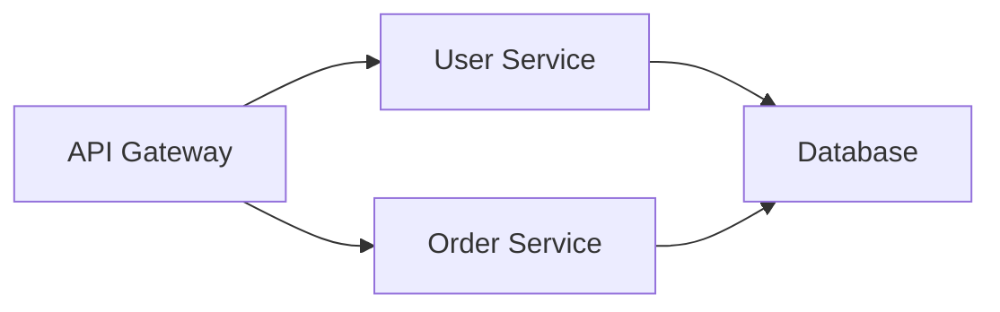

# 框架扩展指南 (CONTRIBUTING)

> **版本**: v2.3  
> **创建日期**: 2025-11-28  
> **用途**: 指导如何为 AI Coding Context 贡献新功能或扩展

---

## 📋 概述

AI Coding Context 是一个模块化的文档生成框架。本指南说明如何扩展框架以支持：

- 新的编程语言
- 新的项目类型
- 新的文档模板
- 新的核心规范

---

## 🎯 扩展原则

### 设计原则

1. **模块化** - 每个扩展应该是独立的模块
2. **向后兼容** - 不破坏现有功能
3. **文档完整** - 所有扩展都有详细文档
4. **可测试** - 提供验证方法

### 文件组织

```
ai_documentation_framework/
├── core/           # 核心规范（添加新规范）
├── workflows/      # 流程文档（添加新流程）
├── tools/          # 实用工具（添加新脚本）
├── guides/         # 指导文档（添加新指南）
├── templates/      # 文档模板（添加新模板）
├── config/         # 配置管理（添加新配置项）
└── agents/         # 角色库（添加新角色）
```

---

## 📝 如何添加新语言支持

### 步骤 1: 更新语言清单

**文件**: `guides/language_support.md`

**操作**: 在对应语言族的章节添加新语言

**示例**: 添加 Kotlin 支持

`````markdown
### JVM 语言

#### Java

[现有内容...]

#### Kotlin (v2.3 新增)

**适用场景**:

- Android 开发
- 服务端应用
- 跨平台应用

**主流框架**:

- Spring Boot (Kotlin)
- Ktor
- Compose Multiplatform

**检测特征**:

- 文件扩展名: `.kt`, `.kts`
- 配置文件: `build.gradle.kts`
- 依赖管理: Gradle (Kotlin DSL)

**统计命令**:

```bash
# 统计Kotlin代码行数
tokei --languages Kotlin
fd -e kt | wc -l
```

**示例项目结构**:

```
src/
├── main/kotlin/
│   └── com/example/
│       ├── Application.kt
│       ├── controllers/
│       └── services/
└── test/kotlin/
```

---

### 步骤 2: 更新检测流程

**文件**: `workflows/detection_workflow.md`

**操作**: 在"1.2 检测编程语言"章节添加检测逻辑

**示例**:

````markdown
### Kotlin 项目检测

**特征文件**:

- `build.gradle.kts` - Gradle Kotlin DSL
- `settings.gradle.kts`
- `.kt` 文件

**检测命令**:

```bash
# 检查是否为Kotlin项目
if [ -f "build.gradle.kts" ]; then
    echo "检测到Kotlin项目 (Gradle)"
fi

# 统计Kotlin文件
fd -e kt | wc -l
```
````

---

### 步骤 3: 更新决策流程

**文件**: `workflows/decision_workflow.md`

**操作**: 在多语言判断中包含新语言

**示例**:

```markdown
**JVM 语言优先级**:

1. Kotlin - 现代、简洁
2. Java - 稳定、成熟
3. Scala - 函数式、复杂
```

---

### 步骤 4: 更新 README

**文件**: `README.md`

**操作**: 更新语言支持数量

```markdown
- **编程语言**: Python / Java / Go / Rust / PHP / Ruby / C++ / JS / TS / Kotlin (10 种)
```

---

### 步骤 5: 创建语言特定示例

**文件**: `examples/kotlin-backend/` (可选)

**内容**:

```
examples/kotlin-backend/
├── src/main/kotlin/
│   └── com/example/Application.kt
├── build.gradle.kts
└── dev_docs/  # 已生成的文档示例
    ├── AI_Coding_Context.md
    └── ...
```

---

### 验证清单

- [ ] `guides/language_support.md` 已更新
- [ ] `workflows/detection_workflow.md` 已更新
- [ ] `README.md` 语言数量已更新
- [ ] 检测命令已测试
- [ ] （可选）示例项目已创建

---

## 🗂️ 如何添加新项目类型

### 步骤 1: 定义项目类型

**文件**: `core/project_types.md`

**操作**: 添加新的项目类型章节

**示例**: 添加"游戏开发"类型

````markdown
## 🎮 游戏开发项目 (v2.3 新增)

### 适用框架

Unity / Unreal Engine / Godot / Cocos

### 推荐子文档清单

| 优先级 | 文档名称                      | 用途         |
| ------ | ----------------------------- | ------------ |
| 🔴 高  | `game_architecture.md`        | 游戏架构说明 |
| 🔴 高  | `scene_management.md`         | 场景管理     |
| 🔴 高  | `asset_pipeline.md`           | 资源管线     |
| 🟡 中  | `gameplay_systems.md`         | 游戏玩法系统 |
| 🟡 中  | `multiplayer.md`              | 多人游戏     |
| 🟢 低  | `performance_optimization.md` | 性能优化     |

### 特殊关注点

- 游戏引擎版本
- 目标平台（PC/Console/Mobile）
- 物理引擎使用
- 网络同步机制
- 资源加载策略

### 核心代码模式

**Unity C# 示例**:

```csharp
// GameObject组件模式
public class PlayerController : MonoBehaviour
{
    void Start() { }
    void Update() { }
    void FixedUpdate() { }
}

// ScriptableObject配置
[CreateAssetMenu]
public class GameConfig : ScriptableObject
{
    public int maxPlayers = 4;
}
```
````
`````

### 检测特征

**Unity 项目**:

- `Assets/` 目录
- `ProjectSettings/` 目录
- `.unity` 场景文件

**Unreal 项目**:

- `.uproject` 文件
- `Content/` 目录
- `Source/` 目录

**检测命令**:

```bash
# Unity
if [ -d "Assets" ] && [ -d "ProjectSettings" ]; then
    echo "Unity项目"
fi

# Unreal
if ls *.uproject 1> /dev/null 2>&1; then
    echo "Unreal Engine项目"
fi
```

````

---

### 步骤2: 添加到决策表

**文件**: `AI_ENTRY_POINT.md`

**操作**: 在步骤3的项目类型示例中添加

```markdown
**示例 - 如果检测到Unity游戏项目**:

必需子文档（P0）:
- game_architecture.md
- scene_management.md
- asset_pipeline.md

推荐子文档（P1）:
- gameplay_systems.md
- multiplayer.md

可选子文档（P2）:
- performance_optimization.md
````

---

### 步骤 3: 创建文档模板

**文件**: `templates/game_architecture_TEMPLATE.md` (可选)

**内容**:

```markdown
# 游戏架构文档

## 引擎信息

**游戏引擎**: [Unity/Unreal/Godot]  
**版本**: [版本号]  
**目标平台**: [PC/Mobile/Console]

## 项目结构
```

Assets/
├── Scripts/
│ ├── Core/
│ ├── Gameplay/
│ └── UI/
├── Prefabs/
├── Scenes/
└── Resources/

```

## 核心系统

### 1. 输入系统
[描述输入处理机制]

### 2. 游戏状态管理
[描述状态机实现]

...
```

---

### 步骤 4: 更新 README

**文件**: `README.md`

```markdown
| **项目类型** | 前端 / 后端 / 全栈 / CLI / 库 / 脚本 / 移动 / 桌面 / Serverless / 容器化 / 数据科学 / 游戏开发 |
```

---

### 验证清单

- [ ] `core/project_types.md` 已添加新类型
- [ ] 推荐子文档清单已定义
- [ ] 检测特征已说明
- [ ] 检测命令已测试
- [ ] `README.md` 类型数量已更新
- [ ] （可选）模板已创建

---

## 📄 如何创建新文档模板

### 步骤 1: 确定模板用途

**问题清单**:

- 这个模板用于哪种项目类型？
- 解决什么文档需求？
- 是核心模板还是可选模板？

**示例**: 创建微服务架构模板

**用途**:

- 项目类型: 后端 API（微服务架构）
- 文档需求: 说明各个服务的职责和交互
- 优先级: 中（微服务项目的 P1 模板）

---

### 步骤 2: 创建模板文件

**文件**: `templates/microservices_architecture_TEMPLATE.md`

**内容结构**:

````markdown
# 微服务架构文档

> **文档信息**  
> **类型**: 架构说明  
> **适用**: 微服务架构项目  
> **目的**: 说明服务拆分、交互和部署

---

## 📋 必需：YAML Frontmatter (v3.0)

所有文档模板必须包含标准化的 YAML 摘要头：

```yaml
---
title: [文档标题]
summary: [文档概述]
keywords: [关键词1] | [关键词2]
scope: [文档范围]
related_files: [关联代码文件]
dependencies: [依赖文档]
verified_at: [YYYY-MM-DD]
---
```

详见: `core/SUMMARY_FORMAT_SPEC.md`

---

## 📋 服务清单

### 服务概览

| 服务名称 | 职责       | 技术栈   | 端口   |
| -------- | ---------- | -------- | ------ |
| [服务 1] | [职责描述] | [技术栈] | [端口] |
| [服务 2] | [职责描述] | [技术栈] | [端口] |

---

## 🔗 服务依赖关系

**Mermaid 图** (AI 生成时填充):


````

---

## 📡 服务间通信

### 同步通信（HTTP/gRPC）

**示例**:

```http
User Service → Order Service
POST /internal/api/v1/validate-user
```

### 异步通信（消息队列）

**示例**:

```
Order Created Event → [RabbitMQ] → Notification Service
```

---

## 🗄️ 数据存储策略

| 服务     | 数据库类型 | 说明   |
| -------- | ---------- | ------ |
| [服务名] | [数据库]   | [说明] |

---

## 🚀 部署架构

**容器化**:

```yaml
# docker-compose.yml 概览
services:
  api-gateway:
  user-service:
  order-service:
  database:
  redis:
```

---

## ✅ AI 填写指导

**生成此文档时**:

1. 扫描所有服务目录
2. 识别服务间的调用关系（HTTP client, 消息队列）
3. 检测数据库配置
4. 分析 docker-compose.yml 或 K8s 配置

**代码依据**:

- 服务清单: 检查项目根目录或 services/目录
- API 调用: 搜索 HTTP client 代码
- 消息队列: 检查消息发送/接收代码

````

---

### 步骤3: 添加到模板索引

**文件**: `AI_ENTRY_POINT.md`

**操作**: 在模板文档表中添加

```markdown
### 模板文档 (`templates/`)

| 文件                                       | 用途               | AI 何时使用             |
| ------------------------------------------ | ------------------ | ----------------------- |
| ...现有模板...                             |                    |                         |
| `templates/microservices_architecture_TEMPLATE.md` | 微服务架构模板     | 检测到微服务架构时使用   |
````

---

### 步骤 4: 在项目类型中引用

**文件**: `core/project_types.md`

**操作**: 在后端 API 项目的 Monorepo/微服务章节引用

```markdown
## 后端 API 项目

### 特殊架构：微服务

**推荐子文档**:

- `microservices_architecture.md` (使用模板: `templates/microservices_architecture_TEMPLATE.md`)
- ...
```

---

### 步骤 5: 测试模板

**创建测试文档**:

```bash
cd examples/microservices-backend/
mkdir -p dev_docs

# 手动测试：基于模板创建文档
cp ../../templates/microservices_architecture_TEMPLATE.md \
   dev_docs/microservices_architecture.md

# 填充实际内容，验证模板是否好用
```

---

### 验证清单

- [ ] 模板文件已创建
- [ ] 模板结构清晰，有 AI 填写指导
- [ ] 已添加到`AI_ENTRY_POINT.md`模板索引
- [ ] 在相应项目类型中引用
- [ ] 已测试模板实用性

- [ ] 已测试模板实用性

---

## 🛠️ 如何添加新实用工具

### 步骤 1: 识别需求

参考 `workflows/create_custom_tool_workflow.md` 中的触发条件（复杂性、安全性、通用性、用户指令）。

### 步骤 2: 开发工具

1. **双模开发**: 尽量同时提供 Python (`tools/py/`) 和 Node.js (`tools/js/`) 版本。
2. **零依赖**: 仅使用标准库。
3. **JSON 输出**: 确保输出格式为 JSON，便于 AI 解析。

### 步骤 3: 更新文档

**文件**: `tools/README.md`

**操作**: 在工具清单中添加新工具说明。

### 验证清单

- [ ] Python 版本已实现且通过测试
- [ ] Node.js 版本已实现且通过测试
- [ ] `tools/README.md` 已更新
- [ ] 代码符合零依赖和 JSON 输出规范

---

## 🔧 如何添加新核心规范

### 步骤 1: 确定规范内容

**示例**: 添加"性能规范"

**目的**: 指导 AI 在生成文档时关注性能相关内容

**内容**:

- 何时记录性能指标
- 如何描述性能优化
- 性能测试要求

---

### 步骤 2: 创建规范文件

**文件**: `core/performance_rules.md`

**内容**:

````markdown
# 性能规范

> **上级文档**: [AI_ENTRY_POINT.md](AI_ENTRY_POINT.md)  
> **版本**: v2.3  
> **最后更新**: 2025-11-28

---

## 🎯 核心原则

**在生成文档时，AI 应该关注并记录性能相关信息**

---

## 📋 性能关注点

### 1. API 响应时间

**何时记录**:

- 检测到 API 端点定义时
- 有性能测试代码时

**记录格式**:

```markdown
### GET /api/v1/users

**预期性能**:

- 平均响应时间: < 100ms
- P95: < 200ms
- P99: < 500ms

**性能依据**: [基准测试文件路径]
```
````

### 2. 数据库查询优化

**何时记录**:

- 检测到复杂查询时
- 有索引定义时

**记录内容**:

- 查询复杂度
- 索引使用
- 分页策略

### 3. 缓存策略

**何时记录**:

- 检测到缓存代码（Redis, Memcached）
- 有缓存配置时

**记录内容**:

- 缓存类型
- 过期时间
- 失效策略

---

## ✅ AI 检查清单

生成文档时，检查：

- [ ] 是否有性能测试代码？
- [ ] 是否有性能相关注释？
- [ ] 是否有缓存使用？
- [ ] 是否有索引定义？
- [ ] 是否有性能优化相关 TODO？

如果有，在对应章节记录。

---

**版本**: v2.3  
**路径**: `core/performance_rules.md`

````

---

### 步骤3: 添加到AI_ENTRY_POINT索引

**文件**: `AI_ENTRY_POINT.md`

**操作**: 在核心规范表中添加

```markdown
### 核心规范 (`core/`) **[v2.2 新增]**

| 文件                        | 用途             | AI 何时读取        |
| --------------------------- | ---------------- | ------------------ |
| ...现有规范...              |                  |                    |
| `core/performance_rules.md` | 性能关注规范     | 生成技术文档时参考 |
````

---

### 步骤 4: 在相关文档中引用

**文件**: `workflows/generation_workflow.md`

**操作**: 在生成流程中提及

```markdown
## 生成阶段注意事项

**核心规范检查**:

- [ ] 已遵守`core/security_rules.md`（敏感信息脱敏）
- [ ] 已遵守`core/performance_rules.md`（性能信息记录）
- [ ] ...
```

---

### 验证清单

- [ ] 规范文件已创建（`core/`目录）
- [ ] 规范内容清晰，有具体指导
- [ ] 已添加到`AI_ENTRY_POINT.md`索引
- [ ] 在相关流程中引用
- [ ] 有 AI 检查清单

---

## ⚙️ 如何添加新配置项 (v3.0)

### 步骤 1: 确定配置项需求

**问题清单**:

- 这个配置项属于哪个类别?(核心配置/功能开关/用户偏好)
- 配置项的默认值是什么?
- 有哪些可选值?
- 影响框架的哪些模块?

**示例**: 添加代码风格检查配置

**需求分析**:

- 类别: 功能开关
- 默认值: `false`
- 可选值: `true` / `false`
- 影响模块: 文档生成流程,需要检查代码风格工具

---

### 步骤 2: 更新配置模板

**文件**: `config/CONFIG_TEMPLATE.md`

**操作 2.1**: 在 YAML frontmatter 中添加配置项

```yaml
---
# ... 现有配置项 ...

# 代码质量 (v3.1新增示例)
enableCodeStyleCheck: false
```

**操作 2.2**: 在文档正文中添加详细说明

````markdown
## 🎨 代码风格检查

**YAML 字段**: `enableCodeStyleCheck`  
**当前值**: `false`  
**版本**: v3.1 新增

**说明**: 启用后,AI 会在生成文档时检查代码风格并记录问题

**可选值**:

- `true` - 启用
  - 自动检测代码风格工具(ESLint/Prettier/Black 等)
  - 在文档中记录代码风格问题
  - 提供改进建议
- `false` - 禁用(默认)
  - 不检查代码风格
  - 减少文档生成时间

**使用场景**:

```yaml
# 团队项目,需要统一代码风格
enableCodeStyleCheck: true

# 个人项目,不关注代码风格
enableCodeStyleCheck: false
```

**配置示例**:

```yaml
---
enableCodeStyleCheck: true
---
```

---
````

---

### 步骤 3: 更新配置说明文档

**文件**: `config/README.md`

**操作**: 在"配置项说明"章节添加新配置项

```markdown
### 代码质量

- `enableCodeStyleCheck` - 代码风格检查(v3.1 新增)
```

---

### 步骤 4: 更新框架工作流

根据配置项影响的模块,更新相应的工作流文档。

**示例**: 如果配置影响文档生成流程

**文件**: `workflows/generation_workflow.md`

**操作**: 在生成流程中添加配置检查

````markdown
## 生成前检查

**读取配置**:

```
if config.enableCodeStyleCheck:
    检测代码风格工具
    扫描代码风格问题
    记录到问题报告中
```
````

---

### 步骤 5: 更新配置版本号

**文件**: `config/CONFIG_TEMPLATE.md`

**操作**: 更新 frontmatter 中的 `configVersion`

```yaml
---
configVersion: "3.1" # 从3.0更新到3.1
frameworkVersion: v3.1
lastUpdated: 2025-12-02
# ...
---
```

---

### 步骤 6: 文档关联

如果新配置项对应某个优化点,在优化点文档中说明配置项。

**文件**: `(详见开发分支中的 dev/V3.0/ 目录)`

**操作**: 添加配置项章节

````markdown
## ⚙️ 配置项

**配置字段**: `enableCodeStyleCheck`  
**配置文件**: `config/user_config.md`

**如何启用**:

1. 打开 `config/user_config.md`
2. 修改 frontmatter:
   ```yaml
   enableCodeStyleCheck: true
   ```
````

3. 保存文件,下次运行生效

**相关文档**: [config/CONFIG_TEMPLATE.md](./config/CONFIG_TEMPLATE.md)

````

---

### 步骤 7: 更新变更日志(可选)

**文件**: `(详见开发分支中的变更日志)`

**操作**: 记录新增配置项

```markdown
### v3.1 配置项变更

**新增**:
- `enableCodeStyleCheck` - 代码风格检查开关
````

---

### 验证清单

- [ ] `config/CONFIG_TEMPLATE.md` frontmatter 已添加配置项
- [ ] `config/CONFIG_TEMPLATE.md` 正文已添加详细说明
  - [ ] 配置项说明
  - [ ] 可选值说明
  - [ ] 使用场景
  - [ ] 配置示例
- [ ] `config/README.md` 配置项列表已更新
- [ ] 相关工作流已更新(如需要)
- [ ] `configVersion` 已更新
- [ ] 优化点文档已添加配置项章节(如适用)
- [ ] 变更日志已更新(如大版本)

---

### 配置项命名规范

**命名约定**:

- 使用 camelCase 命名
- 布尔值用 `enable` 或 `disable` 前缀
- 枚举值用描述性名词
- 避免缩写,保持可读性

**示例**:

✅ 好的命名:

- `enableMutualReview`
- `dangerousCommandGuard`
- `defaultHealthCheckMode`

❌ 不好的命名:

- `mutualRev` (缩写不清晰)
- `guardLevel` (不明确)
- `mode` (太泛化)

---

### 配置项类型

**1. 布尔开关**:

```yaml
enableFeature: true/false
```

**2. 枚举值**:

```yaml
guardLevel: strict/moderate/permissive
```

**3. 列表**:

```yaml
preferredRoles:
  - role1
  - role2
```

**4. 字符串**:

```yaml
documentLanguage: zh-CN
```

---

## 🧪 测试框架扩展

### 测试方法

#### 1. 语言支持测试

**创建测试项目**:

```bash
# 创建Kotlin测试项目
mkdir -p /tmp/test-kotlin-project
cd /tmp/test-kotlin-project

# 创建基本文件
touch build.gradle.kts
mkdir -p src/main/kotlin/com/example
echo 'package com.example\n\nfun main() {}' > src/main/kotlin/com/example/Main.kt
```

**运行检测**:

```markdown
发送给 AI:
"请检测 /tmp/test-kotlin-project 的编程语言"

预期结果:

- 检测到: Kotlin
- 项目类型: 后端/CLI
- 统计数据: 正确
```

---

#### 2. 项目类型测试

**创建测试项目**:

```bash
# 创建Unity测试项目
mkdir -p /tmp/test-unity-project
cd /tmp/test-unity-project
mkdir -p Assets ProjectSettings
touch Assets/test.cs
```

**运行检测**:

```markdown
发送给 AI:
"请为 /tmp/test-unity-project 生成文档"

检查:

- [ ] 识别为游戏开发项目
- [ ] 推荐的子文档包含 game_architecture.md
- [ ] 使用了正确的模板
```

---

#### 3. 模板测试

**手动验证**:

1. 基于新模板创建文档
2. 检查所有章节是否有意义
3. AI 是否能正确填充内容
4. 格式是否统一

**自动化测试**:

```bash
# 检查模板格式
grep -E "^##|^###" templates/your_template.md

# 检查是否有AI填写指导
grep "AI填写指导" templates/your_template.md
```

---

## 📝 提交变更

### Git 提交规范

**提交消息格式**:

```
<type>(<scope>): <subject>

<body>

<footer>
```

**Type 类型**:

- `feat`: 新功能（语言、类型、模板）
- `docs`: 文档更新
- `fix`: 修复错误
- `refactor`: 重构
- `test`: 测试

**示例**:

```
feat(language): 添加Kotlin语言支持

- 更新 guides/language_support.md
- 更新 workflows/detection_workflow.md
- 更新 README.md 语言数量
- 添加 Kotlin 检测命令和示例

Closes #42
```

---

### Pull Request 检查清单

创建 PR 时，确保：

- [ ] 所有相关文档已更新
- [ ] README 已更新（如适用）
- [ ] 已添加测试或验证方法
- [ ] 代码示例实际可用
- [ ] Markdown 格式正确
- [ ] 没有破坏向后兼容性
- [ ] 提交消息符合规范

---

## 🔗 相关文档

- [README.md](README.md) - 框架概览
- [AI_ENTRY_POINT.md](AI_ENTRY_POINT.md) - AI 入口文档
- [core/design_decisions.md](core/design_decisions.md) - 设计决策记录

---

## 💡 扩展建议

### 优先级排序

**高优先级**:

1. 主流编程语言（使用广泛）
2. 通用项目类型（适用场景多）
3. 核心文档模板（必需文档）

**中优先级**:

1. 小众但流行的语言
2. 特定领域项目类型
3. 可选文档模板

**低优先级**:

1. 实验性语言
2. 极其专业的项目类型
3. 装饰性模板

### 社区贡献

欢迎贡献：

- 新语言支持
- 新项目类型
- 文档模板改进
- 检测逻辑优化
- 错误修复

**联系方式**: [提供联系方式或 Issue 链接]

---

**版本**: v2.3  
**最后更新**: 2025-11-28  
**路径**: `CONTRIBUTING.md`

---

## 📝 框架文档贡献规范

框架自身的文档质量保证体系位于 `dev/quality/`（仅 dev 分支可见）。当你为框架新增或修改文档（workflow、guide、core 规范等）时：

1. 切换到 dev 分支
2. 阅读 `dev/quality/README.md` 了解审查体系总览
3. 遵循 `dev/quality/standards/COMMON_STANDARDS.md` 与 `QUALITY_CHECKLIST.md` 的质量标准
4. 单文档变更走 `dev/quality/AUDIT_WORKFLOW.md`；全框架审查走 `dev/quality/Framework_Review_Guidelines.md`
5. 新文档需配套生成审查上下文（参见 `dev/quality/HOW_TO_GENERATE_CONTEXTS.md`）
