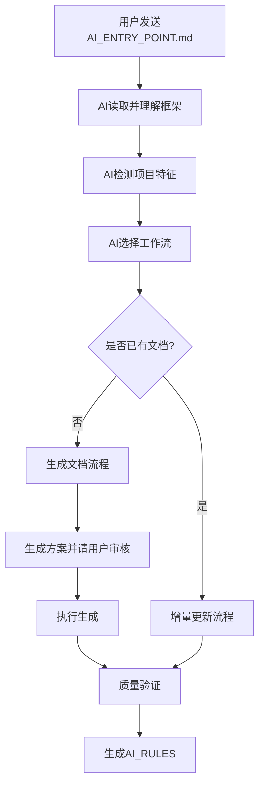

# AI 文档框架 - 文档优化指南

> **用途**: 指导 AI 逐一优化框架中的每份文档  
> **使用方式**:
>
> - 每次新会话开始时，先发送**第一部分（全局上下文）**
> - 然后发送**第二部分（当前文档上下文）**中对应的文档信息  
>   **版本**: v1.0  
>   **创建时间**: 2025-11-29

---

# 第一部分：全局上下文（每次会话必读）

## 📋 框架总体介绍

### 框架名称

**AI 辅助编程文档生成框架** (AI Coding Context)

### ## 💡 使用建议

这是一个帮助开发团队为项目生成 AI 辅助编程文档的完整框架体系，旨在让 AI 能够快速理解项目代码结构、技术栈和开发规范，从而高效协助开发工作。

### 设计理念

1. **方案优先** - 先生成分析方案，人工审核后再执行
2. **基于代码** - 一切分析以实际代码为依据，禁止臆测
3. **问题发现** - 分析时记录问题和疑问，不确定时标注
4. **分层文档** - 主文档（索引）→ 子文档（详细）→ 知识库（经验）
5. **进度可控** - 大型项目分批执行，系统化完成

### 框架能力

- ✅ 支持 9 种编程语言（Python/Java/Go/Rust/PHP/Ruby/C++/JS/TS）
- ✅ 支持 11 种项目类型（前端/后端/全栈/CLI/库/脚本/移动/桌面/Serverless/容器化/数据科学）
- ✅ 涵盖 25+主流框架，支持自动识别其他框架
- ✅ 自动发现代码问题和技术债务
- ✅ 提供完整的进度跟踪机制
- ✅ 包含 V3 最佳实践（复杂度评估、交互策略、质量检查等）

### 核心工作流程



### 文档分类体系

框架文档按用途分为以下几类：

| 分类           | 目录       | 用途                | 示例                                          |
| :------------- | :--------- | :------------------ | :-------------------------------------------- |
| **入口文档**   | 根目录     | AI 总入口、用户入门 | AI_ENTRY_POINT.md, INTRODUCTION.md            |
| **核心规范**   | core/      | 必须遵守的核心规则  | language_rules.md, security_rules.md          |
| **工作流文档** | workflows/ | 详细的执行流程指导  | generation_workflow.md, detection_workflow.md |
| **指导文档**   | guides/    | 通用指导和最佳实践  | quick_start.md, documentation_maintenance.md  |
| **模板文档**   | templates/ | 可复用的文档模板    | GENERATION_PLAN_TEMPLATE.md                   |
| **参考文档**   | reference/ | 技术参考和示例      | 各种示例方案                                  |

### 最新升级（V3 最佳实践集成）

框架已完成基于 V3 方案的全面升级，新增以下能力：

1. **复杂度评估体系**: AI 可系统评估项目复杂度（1-5 星）并预估工作量
2. **交互策略制定**: AI 能主动规划与用户的交互节奏
3. **4 维度质量检查**: 准确性/完整性/可用性/一致性
4. **8 种风险应对**: 大文件/复杂依赖/缺少注释等
5. **8 个最佳实践**: 大文件处理/模块依赖可视化/代码示例标注等
6. **完整维护策略**: 更新触发机制/维护周期/版本控制

### 当前优化任务

**目标**: 对框架中的每份文档进行最细颗粒度的文本优化

**优化原则**:

1. **准确性**: 信息准确无误，无歧义
2. **完整性**: 覆盖所有关键要点，无遗漏
3. **一致性**: 术语统一，风格一致
4. **可读性**: 结构清晰，易于理解
5. **可操作性**: 指导明确，可直接执行

**优化重点**:

- 消除模糊表述，使用明确的指令
- 统一术语和格式
- 补充缺失的重要信息
- 优化文档结构和层次
- 增强示例的完整性和准确性
- 确保文档间引用正确

---

# 第二部分：单个文档上下文

## 入口文档

### AI_ENTRY_POINT.md

**文件路径**: `AI_ENTRY_POINT.md`

**设计原理**:

- 这是 AI 读取框架的**唯一入口**
- 提供完整的框架索引和决策逻辑
- 包含所有文档的使用时机说明

**用途**:

- 让 AI 理解整个框架结构
- 指导 AI 根据项目情况选择正确的工作流
- 提供所有文档的快速索引

**目标受众**: AI（主要）和开发者（参考）

**核心内容**:

1. 框架核心信息（设计理念、能力）
2. 文件索引（何时读取每个文档）
3. 智能工作流分派逻辑
4. 项目检测机制
5. 策略决策流程
6. 执行步骤概览

**优化目标**:

- 确保索引表格完整准确
- "AI 何时读取"列必须明确无歧义
- 删除过时或重复信息
- 确保与其他文档的引用正确

**关联文档**（修改后需要检查）:

- 所有被索引的文档
- INTRODUCTION.md（人类版本的入门指南）

**质量检查点**:

- [ ] 所有文档都在索引中
- [ ] 每个文档的"何时读取"描述明确
- [ ] 工作流分派逻辑清晰
- [ ] 链接全部有效

---

### INTRODUCTION.md

**文件路径**: `INTRODUCTION.md`

**设计原理**:

- 面向**人类开发者**的入门文档
- 解释框架的设计思想和使用方法
- 与 AI_ENTRY_POINT.md 形成互补

**用途**:

- 帮助开发者理解框架价值
- 指导开发者如何使用框架
- 说明框架的设计理念和特色

**目标受众**: 人类开发者（主要）

**核心内容**:

1. 框架简介和设计理念
2. 核心特性和优势
3. 使用流程说明
4. 目录结构介绍
5. 常见问题 FAQ
6. V2.2/V2.3 改进说明

**优化目标**:

- 语言通俗易懂，避免过于技术化
- 突出框架价值和实际效果
- 提供清晰的使用步骤
- 补充典型使用场景示例

**关联文档**:

- AI_ENTRY_POINT.md（对应的 AI 版本）
- README.md（项目说明）

---

## 核心规范文档（core/）

### core/language_rules.md

**文件路径**: `core/language_rules.md`

**设计原理**:

- 在生成任何文档前，AI 必须先确认文档语言
- 避免语言混乱和用户体验不一致
- 支持中文和英文两种主要语言

**用途**:

- 指导 AI 询问用户文档语言偏好
- 定义不同语言的文档规范
- 确保文档语言一致性

**目标受众**: AI

**核心内容**:

1. 语言确认流程
2. 默认语言策略
3. 中文文档规范
4. 英文文档规范
5. 混合项目处理

**优化目标**:

- 确认流程必须明确且简洁
- 规范说明要具体可执行
- 补充典型场景示例

**关联文档**:

- AI_ENTRY_POINT.md（引用此规范）
- 所有模板文档（需使用对应语言）

---

### core/security_rules.md

**文件路径**: `core/security_rules.md`

**设计原理**:

- 防止敏感信息泄露到文档中
- 明确哪些信息需要脱敏
- 提供具体的脱敏方法

**用途**:

- 指导 AI 识别敏感信息
- 规范敏感信息的处理方式
- 确保生成的文档安全

**目标受众**: AI

**核心内容**:

1. 敏感信息类型清单
2. 脱敏处理方法
3. 提示用户补充的时机
4. 安全检查清单

**优化目标**:

- 敏感信息分类要全面
- 脱敏方法要具体可操作
- 补充实际示例

**关联文档**:

- AI_ENTRY_POINT.md
- 所有模板文档（需应用安全规范）

---

### core/project_types.md

**文件路径**: `core/project_types.md`

**设计原理**:

- 定义 11 种项目类型的特征和检测方法
- 为每种类型指定必需和推荐的子文档
- 支持混合类型项目处理

**用途**:

- 指导 AI 准确识别项目类型
- 决定需要生成哪些子文档
- 处理复杂的混合项目

**目标受众**: AI

**核心内容**:

1. 项目类型定义（11 种）
2. 类型识别特征
3. 每种类型的子文档清单
4. 混合类型处理策略

**优化目标**:

- 类型特征要具体可检测
- 子文档清单要完整
- 补充混合类型的实际案例

**关联文档**:

- AI_ENTRY_POINT.md
- guides/project_types.md（更详细的版本）
- workflows/detection_workflow.md

---

### core/update_triggers.md

**文件路径**: `core/update_triggers.md`

**设计原理**:

- 定义何时需要更新 AI 文档
- 按优先级分类（P0/P1/P2）
- 提供详细的变更类型映射表

**用途**:

- 指导 AI 判断是否需要更新文档
- 明确不同变更对应的文档更新范围
- 支持增量更新工作流

**目标受众**: AI

**核心内容**:

1. 更新触发分级（P0/P1/P2）
2. 变更类型映射表（前端/后端/全栈）
3. 特殊场景指导
4. 更新方式说明

**优化目标**:

- 触发条件要明确
- 映射表要完整覆盖常见场景
- 补充具体示例

**关联文档**:

- guides/documentation_maintenance.md（详细维护策略）
- workflows/incremental_update_workflow.md

---

## 工作流文档（workflows/）

### workflows/generation_workflow.md

**文件路径**: `workflows/generation_workflow.md`

**设计原理**:

- 提供文档生成的详细步骤指导
- 包含 AI 指令模板和预期输出
- 整合 V3 最佳实践

**用途**:

- 指导 AI 执行步骤 4-6（文档生成）
- 提供详细的 AI 指令模板
- 明确每个步骤的产出物

**目标受众**: AI

**核心内容**:

1. 阶段 1: 项目分析（5+2 步骤，包含复杂度评估和交互策略）
2. 阶段 2: 文档生成（主文档+子文档）
3. 阶段 3: 验证优化
4. 不同项目类型策略
5. 质量验证标准
6. V3 最佳实践参考（8 个模式）

**优化目标**:

- AI 指令模板要完整可直接使用
- 预期输出要明确
- 步骤逻辑要清晰
- V3 最佳实践要具体可操作

**关联文档**:

- AI_ENTRY_POINT.md（引用此文档）
- templates/GENERATION_PLAN_TEMPLATE.md
- guides/generation_workflow.md（已废弃，内容已合并）

---

### workflows/detection_workflow.md

**文件路径**: `workflows/detection_workflow.md`

**设计原理**:

- 详细说明项目检测的步骤
- 提供各种检测命令和方法
- 支持跨平台检测

**用途**:

- 指导 AI 执行步骤 0-1（项目检测）
- 自动识别项目类型、技术栈、规模
- 生成项目特征报告

**目标受众**: AI

**核心内容**:

1. 语言检测方法
2. 框架识别策略
3. 项目规模统计
4. 特殊架构识别
5. 跨平台命令方案

**优化目标**:

- 检测方法要全面
- 命令要跨平台兼容
- 补充常见框架的识别特征

**关联文档**:

- AI_ENTRY_POINT.md
- core/project_types.md

---

### workflows/decision_workflow.md

**文件路径**: `workflows/decision_workflow.md`

**设计原理**:

- 指导 AI 根据项目特征做出策略决策
- 考虑项目规模、复杂度、团队需求
- 提供灵活的策略选择

**用途**:

- 指导 AI 执行步骤 2-3（策略决策）
- 决定生成哪些文档
- 规划执行策略

**目标受众**: AI

**核心内容**:

1. 策略决策因素
2. 文档清单决策
3. 优先级判断
4. 执行策略规划

**优化目标**:

- 决策逻辑要清晰
- 提供决策树/流程图
- 补充典型场景的决策示例

**关联文档**:

- AI_ENTRY_POINT.md
- core/project_types.md

---

### workflows/progress_tracking.md

**文件路径**: `workflows/progress_tracking.md`

**设计原理**:

- 定义进度记录机制
- 使用 templates/PROGRESS_TEMPLATE.md
- 支持大型项目的分批执行

**用途**:

- 指导 AI 记录执行进度
- 提供进度查询方法
- 支持任务中断和恢复

**目标受众**: AI

**核心内容**:

1. 进度文件位置和格式
2. 记录时机和内容
3. 进度查询方法
4. 任务恢复机制

**优化目标**:

- 记录时机要明确
- 格式要统一
- 补充实际示例

**关联文档**:

- templates/PROGRESS_TEMPLATE.md
- AI_ENTRY_POINT.md

---

### workflows/incremental_update_workflow.md

**文件路径**: `workflows/incremental_update_workflow.md`

**设计原理**:

- 支持增量更新已有文档
- 避免全量重新生成
- 检测文档健康度

**用途**:

- 指导 AI 执行增量更新
- 识别需要更新的部分
- 保持文档与代码同步

**目标受众**: AI

**核心内容**:

1. 增量更新触发条件
2. 变更检测方法
3. 更新策略
4. 文档健康度检查

**优化目标**:

- 变更检测方法要具体
- 更新策略要高效
- 补充实际案例

**关联文档**:

- core/update_triggers.md
- workflows/document_health_check.md

---

### workflows/monorepo_workflow.md

**文件路径**: `workflows/monorepo_workflow.md`

**设计原理**:

- 专门处理 Monorepo 架构
- 支持 package 级文档生成
- 处理跨 package 依赖

**用途**:

- 指导 AI 处理 Monorepo 项目
- 生成 package 级和仓库级文档
- 管理复杂的依赖关系

**目标受众**: AI

**核心内容**:

1. Monorepo 检测特征
2. Package 检测和分类
3. 文档生成策略
4. 依赖关系可视化

**优化目标**:

- Monorepo 特征要全面
- 策略要适应不同工具（Lerna/Nx/Turborepo）
- 补充典型案例

**关联文档**:

- workflows/detection_workflow.md
- core/project_types.md

---

### workflows/document_health_check.md

**文件路径**: `workflows/document_health_check.md`

**设计原理**:

- 评估已有文档的健康度
- 发现过时或不准确的内容
- 提供修复建议

**用途**:

- 检测已有 AI 文档质量
- 识别需要更新的文档
- 生成健康度报告

**目标受众**: AI

**核心内容**:

1. 健康度检查维度
2. 检查方法和工具
3. 评分标准
4. 修复建议生成

**优化目标**:

- 检查维度要全面
- 评分标准要客观
- 修复建议要可操作

**关联文档**:

- workflows/incremental_update_workflow.md

---

## 指导文档（guides/）

### guides/quick_start.md

**文件路径**: `guides/quick_start.md`

**设计原理**:

- 提供快速上手指导
- 简化的使用流程
- 面向新用户

**用途**:

- 5 分钟快速了解框架
- 快速生成第一份文档
- 了解基本概念

**目标受众**: 人类开发者

**核心内容**:

1. 3 步快速开始
2. 关键命令模板
3. 常见问题
4. 进阶指引

**优化目标**:

- 步骤要简洁明了
- 命令要可直接复制使用
- 补充实际效果展示

**关联文档**:

- INTRODUCTION.md
- AI_ENTRY_POINT.md

---

### guides/project_types.md

**文件路径**: `guides/project_types.md`

**设计原理**:

- 详细说明 11 种项目类型
- 提供每种类型的详细适配方案
- 补充 core/project_types.md

**用途**:

- 深入了解项目类型适配
- 查看每种类型的文档建议
- 理解类型识别逻辑

**目标受众**: AI + 人类开发者

**核心内容**:

1. 每种项目类型的详细说明
2. 类型特征和识别方法
3. 推荐的子文档清单
4. 特殊注意事项

**优化目标**:

- 每种类型的说明要详细
- 识别特征要具体
- 补充实际项目案例

**关联文档**:

- core/project_types.md（核心版本）
- workflows/detection_workflow.md

---

### guides/language_support.md

**文件路径**: `guides/language_support.md`

**设计原理**:

- 详细说明 9 种编程语言的支持
- 提供语言特定的分析方法
- 处理多语言项目

**用途**:

- 指导 AI 分析非 JS/TS 项目
- 了解不同语言的特点
- 处理多语言混合项目

**目标受众**: AI

**核心内容**:

1. 9 种语言的详细支持说明
2. 语言检测方法
3. 语言特定的分析策略
4. 多语言项目处理

**优化目标**:

- 每种语言的说明要完整
- 分析方法要具体
- 补充实际示例

**关联文档**:

- workflows/detection_workflow.md

---

### guides/documentation_maintenance.md

**文件路径**: `guides/documentation_maintenance.md`

**设计原理**:

- 提供完整的文档维护策略
- 定义更新触发条件和维护周期
- 包含团队协作规范

**用途**:

- 指导文档的长期维护
- 明确更新时机和方法
- 支持团队协作

**目标受众**: 人类开发者 + AI

**核心内容**:

1. 更新触发条件详表
2. 维护周期建议（周/月/季度）
3. 更新流程
4. 版本控制策略
5. 质量保证机制
6. 团队协作规范

**优化目标**:

- 触发条件表要完整
- 维护周期清单要详细可执行
- 补充实际维护案例

**关联文档**:

- core/update_triggers.md
- workflows/incremental_update_workflow.md

---

### guides/ai_rules_maintenance.md

**文件路径**: `guides/ai_rules_maintenance.md`

**设计原理**:

- 指导维护生成的 AI_RULES 文件
- 支持规则的模块化管理
- 定义规则更新策略

**用途**:

- 维护项目的 AI_RULES
- 管理规则模块
- 更新规则内容

**目标受众**: 人类开发者

**核心内容**:

1. AI_RULES 结构说明
2. 规则模块管理
3. 更新和同步策略
4. IDE 配置方法

**优化目标**:

- 结构说明要清晰
- 配置步骤要详细
- 补充实际案例

**关联文档**:

- templates/AI_RULES_TEMPLATE.md

---

### guides/configuration_management.md

**文件路径**: `guides/configuration_management.md`

**设计原理**:

- 说明配置方案的最佳实践
- 处理复杂配置系统
- 支持多环境/多租户

**用途**:

- 文档化复杂配置系统
- 处理配置覆盖逻辑
- 理解配置最佳实践

**目标受众**: AI + 人类开发者

**核心内容**:

1. 配置系统分类
2. 配置文档化方法
3. 多环境处理
4. 配置覆盖流程可视化

**优化目标**:

- 方法要具体可操作
- 补充复杂配置系统的实际案例
- 提供 Mermaid 流程图示例

**关联文档**:

- workflows/generation_workflow.md（V3 最佳实践第 3 点）

---

## 模板文档（templates/）

### templates/GENERATION_PLAN_TEMPLATE.md

**文件路径**: `templates/GENERATION_PLAN_TEMPLATE.md`

**设计原理**:

- 标准化方案文档格式
- 强制 AI 进行深度思考
- 集成 V3 最佳实践

**用途**:

- AI 生成方案时必用的模板
- 确保方案质量和完整性
- 统一方案格式

**目标受众**: AI

**核心内容**:

1. 方案元信息
2. 任务复杂度评估（V3 新增）
3. 交互策略（V3 新增）
4. 文档生成原则（V3 新增）
5. 项目分析章节
6. 文档清单
7. 执行计划
8. 风险应对预案（V3 新增）
9. 质量检查清单（V3 新增）

**优化目标**:

- 模板要完整覆盖所有必需章节
- 示例要具体可参考
- 说明要清晰
- V3 新增内容要详细

**关联文档**:

- workflows/generation_workflow.md
- AI_ENTRY_POINT.md

---

### templates/PROJECT_ANALYSIS_REPORT_TEMPLATE.md

**文件路径**: `templates/PROJECT_ANALYSIS_REPORT_TEMPLATE.md`

**设计原理**:

- 标准化项目分析报告格式
- 记录项目发现的问题
- 支持问题追踪

**用途**:

- 生成项目问题报告
- 记录技术债务
- 提供优化建议

**目标受众**: AI

**核心内容**:

1. 项目基本信息
2. 发现的问题列表
3. 技术债务分析
4. 优化建议
5. 风险评估

**优化目标**:

- 问题分类要清晰
- 评估标准要明确
- 补充示例

**关联文档**:

- workflows/detection_workflow.md

---

### templates/PROGRESS_TEMPLATE.md

**文件路径**: `templates/PROGRESS_TEMPLATE.md`

**设计原理**:

- 标准化进度记录格式
- 支持任务恢复
- 提供进度查询

**用途**:

- 记录文档生成进度
- 支持中断和恢复
- 查询当前状态

**目标受众**: AI

**核心内容**:

1. 任务基本信息
2. 当前进度
3. 已完成项
4. 待完成项
5. 遇到的问题

**优化目标**:

- 格式要规范
- 状态要明确
- 补充示例

**关联文档**:

- workflows/progress_tracking.md

---

### templates/AI_RULES_TEMPLATE.md

**文件路径**: `templates/AI_RULES_TEMPLATE.md`

**设计原理**:

- 标准化 AI_RULES 文件格式
- 支持模块化规则管理
- 提供合并策略

**用途**:

- 生成项目的 AI_RULES
- 组织规则模块
- 支持 IDE 集成

**目标受众**: AI

**核心内容**:

1. 规则文件结构
2. 核心规则模块
3. 工作流规则
4. 触发器规则
5. 约束规则

**优化目标**:

- 结构要清晰
- 模块要完整
- 补充使用说明

**关联文档**:

- guides/ai_rules_maintenance.md

---

### templates/AI_Coding_Context_TEMPLATE.md

**文件路径**: `templates/AI_Coding_Context_TEMPLATE.md`

**设计原理**:

- 标准化主文档格式
- 提供完整的章节结构
- 确保主文档质量

**用途**:

- 生成 AI_Coding_Context.md 主文档
- 统一主文档格式
- 确保核心信息完整

**目标受众**: AI

**核心内容**:

1. 文档定位说明
2. 项目概览
3. 关键目录速查
4. 场景快速导航
5. 文档索引
6. 核心代码模式
7. 开发流程规范
8. 命名规范
9. 业务模块映射
10. AI 编码禁忌
11. 常见任务速查

**优化目标**:

- 章节要完整
- 说明要清晰
- 示例要丰富

**关联文档**:

- workflows/generation_workflow.md

---

### 其他模板文档

**testing_guide_TEMPLATE.md**: 测试文档模板  
**deployment_guide_TEMPLATE.md**: 部署文档模板  
**plans_README_TEMPLATE.md**: Plans 目录说明模板  
**knowledge_README_TEMPLATE.md**: Knowledge 目录说明模板  
**PLAN_TEMPLATE.md**: 功能/Bug 方案模板

（这些模板的详细说明可根据需要补充）

---

## 其他重要文档

### README.md

**文件路径**: `README.md`

**设计原理**:

- 项目的 GitHub 首页说明
- 吸引用户使用框架
- 提供完整的快速开始

**用途**:

- 介绍框架
- 引导新用户
- 展示特性和优势

**目标受众**: 潜在用户

**核心内容**:

1. 框架简介
2. 核心特性
3. 快速开始
4. 目录结构
5. 文档索引
6. 贡献指南

**优化目标**:

- 突出框架价值
- 快速开始要简洁
- 补充实际效果展示
- 添加示例项目链接

**关联文档**:

- INTRODUCTION.md
- CONTRIBUTING.md

---

### CONTRIBUTING.md

**文件路径**: `CONTRIBUTING.md`

**设计原理**:

- 引导社区贡献
- 规范贡献流程
- 降低贡献门槛

**用途**:

- 指导贡献者
- 规范 PR 和 Issue
- 建设社区

**目标受众**: 开源贡献者

**核心内容**:

1. 贡献方式
2. 开发环境搭建
3. PR 规范
4. Issue 规范
5. 代码规范

**优化目标**:

- 流程要清晰
- 规范要明确
- 降低贡献门槛

---

### V3_PLAN_EVALUATION_AND_EXECUTION.md

**文件路径**: `V3_PLAN_EVALUATION_AND_EXECUTION.md`

**设计原理**:

- 记录 V3 方案评估过程
- 文档化优化方案执行情况
- 作为框架升级的参考

**用途**:

- 了解 V3 升级过程
- 查看执行状态
- 参考优化方案

**目标受众**: 框架维护者

**核心内容**:

1. V3 方案评估
2. 框架能力分析
3. 优化方案详述
4. 执行总结

**优化目标**:

- 保持更新
- 记录完整
- 作为历史参考

---

## 附录：文档优化通用检查清单

每次优化文档时，都应检查以下项：

### 内容质量

- [ ] 信息准确无误
- [ ] 无歧义表述
- [ ] 覆盖所有关键点
- [ ] 示例完整可用
- [ ] 无过时信息

### 结构 clarity

- [ ] 章节逻辑清晰
- [ ] 标题层级正确
- [ ] TOC 完整准确
- [ ] 重点突出

### 一致性

- [ ] 术语统一
- [ ] 格式统一
- [ ] 风格一致
- [ ] 链接有效

### 可操作性

- [ ] 指令明确
- [ ] 步骤完整
- [ ] 示例具体
- [ ] 可直接执行

### 引用正确性

- [ ] 文档间引用正确
- [ ] 文件路径准确
- [ ] 行号引用有效
- [ ] 无断链

---

## 使用建议

### 会话开始模板

```
我正在优化"AI辅助编程文档生成框架"的文档。

【第一部分：全局上下文】
[粘贴第一部分内容]

【第二部分：当前文档】
我现在要优化的文档是：[文档名称]
[粘贴对应文档的上下文信息]

请帮我对这份文档进行最细颗粒度的优化，重点检查：
1. 内容准确性和完整性
2. 表述的清晰性和可操作性
3. 术语和格式的一致性
4. 示例的完整性和正确性
5. 文档间引用的正确性

请先通读文档，然后给出具体的优化建议。
```

### 优化流程建议

1. **准备阶段**: 打开要优化的文档和相关联文档
2. **发送上下文**: 发送全局上下文+当前文档上下文
3. **AI 分析**: 让 AI 通读并给出优化建议
4. **逐项优化**: 根据建议逐项优化
5. **交叉检查**: 检查关联文档是否需要同步更新
6. **最终验证**: 对照检查清单进行最终验证

---

**文档版本**: v1.0  
**创建时间**: 2025-11-29  
**维护者**: Framework Team
