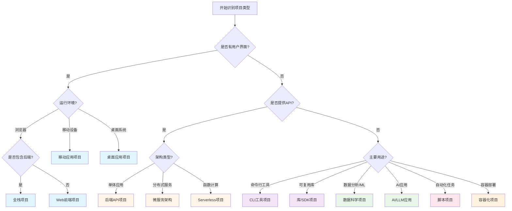
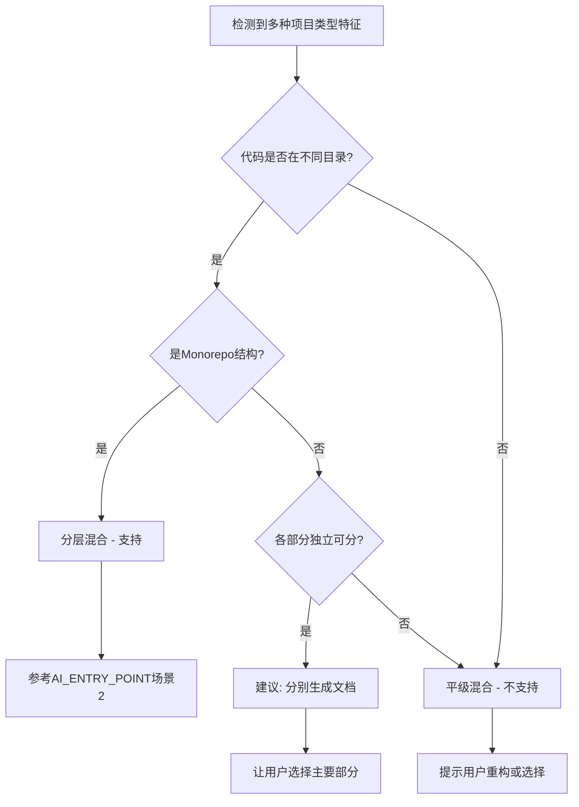

# 项目类型索引与决策树

> **用途**: 快速识别项目类型并按需加载对应的详细配置  
> **版本**: v3.0  
> **最后更新**: 2026-01-21

---

## 📋 概述

本框架支持 **13 种项目类型**，每种类型都有独立的详细配置文档。

### 🎯 使用流程

1. **使用决策树** → 快速识别项目类型
2. **按需加载** → 只读取对应的1个配置文档（节省70% Token）
3. **生成文档** → 根据配置生成子文档清单

---

## 🗂️ 项目类型列表

### 前端与全栈

- [Web 前端项目](./project_types/web_frontend.md) - Vue.js / React / Angular / Svelte
- [全栈项目](./project_types/fullstack.md) - Next.js / Nuxt / Remix / SvelteKit
- [移动应用项目](./project_types/mobile_app.md) - React Native / Flutter / 原生开发
- [桌面应用项目](./project_types/desktop_app.md) - Electron / Tauri / Qt

### 后端与服务

- [后端 API 项目](./project_types/backend_api.md) - Express / FastAPI / Spring Boot / Gin
- [微服务架构](./project_types/microservices.md) - 分布式服务架构（新增）
- [Serverless 项目](./project_types/serverless.md) - AWS Lambda / Cloud Functions
- [容器化项目](./project_types/containerized.md) - Docker / Kubernetes

### 工具与库

- [CLI 工具项目](./project_types/cli_tool.md) - 命令行工具
- [库/SDK 项目](./project_types/library_sdk.md) - npm 包 / PyPI 包
- [脚本项目](./project_types/script.md) - Python 脚本 / Shell 脚本

### 数据与 AI

- [数据科学项目](./project_types/data_science.md) - Jupyter / 机器学习
- [AI/LLM 应用](./project_types/ai_llm_app.md) - RAG / Prompt 工程（新增）

---

## 🔀 快速决策树



---

## 🎯 项目规模考量

根据项目规模调整子文档清单：

### 小型项目（< 10 个文件）
- 只生成 🔴 高优先级文档
- 简化架构说明
- 合并相关主题

### 中型项目（10-50 个文件）
- 生成 🔴 高 + 🟡 中优先级文档
- 完整的架构说明
- 独立的模块文档

### 大型项目（> 50 个文件）
- 生成所有优先级文档
- 详细的架构图
- 模块化的文档结构
- 考虑 Monorepo 结构

---

## 🔄 混合项目类型处理规范

### 定义澄清

**平级混合** (❌ 不支持):
- 前端和后端代码混在同一目录层级
- 例如: 根目录同时有 `package.json` 和 `requirements.txt`，且代码未分离
- 无明确的目录分离

**分层混合** (✅ 支持):
- 代码按模块/功能清晰分层
- 例如: Monorepo 结构 (`packages/frontend`, `packages/backend`)
- 有明确的目录分离

### 判断流程



### 处理策略

#### 如检测到平级混合

**输出模板**:

```markdown
❌ 检测到平级混合项目类型:

- 前端特征: package.json
- 后端特征: requirements.txt
- 位置: 都在根目录，代码未分离

🛑 **框架限制**: 本框架不支持平级混合项目类型。

💡 **建议**:

1. **重构项目结构** (推荐):
   ```
   project/
   ├── frontend/        # 前端代码
   │   └── package.json
   ├── backend/         # 后端代码
   │   └── requirements.txt
   └── README.md
   ```
   重构后可为每个部分分别生成文档。

2. **选择主要部分**:
   如果一部分是主要的，另一部分是辅助的，
   请告诉我您希望为哪部分生成文档?

请确认您希望采用哪种方式?
```

**暂停执行，等待用户选择**

#### 如检测到分层混合(Monorepo)

**输出模板**:

```markdown
✅ 检测到分层混合(Monorepo)结构

📦 子项目检测:
- packages/frontend (Vue 3)
- packages/backend (Node.js + Express)
- packages/shared (TypeScript 工具库)

💡 **建议策略**: 全局文档策略
理由: 可以在主文档中说明整体架构，
在子目录中添加各自的详细说明。

是否采用此策略? (是/否/选择其他)
```

**参考**: AI_ENTRY_POINT.md 中的"场景 2: Monorepo 项目"

---

## ⚠️ 常见错误与避免

### 错误 1: 一次性加载所有项目类型配置

❌ **错误做法**:
```
读取 core/project_types.md（包含所有13种类型的详细配置）
```

✅ **正确做法**:
```
1. 读取 core/project_types.md（索引文档，约200行）
2. 使用决策树识别项目类型
3. 只读取对应的1个配置文档（如 core/project_types/web_frontend.md）
```

### 错误 2: 忽略项目规模

❌ **错误做法**: 为小型脚本项目生成完整的企业级文档清单

✅ **正确做法**: 根据项目规模调整文档清单（参考"项目规模考量"章节）

### 错误 3: 混淆项目类型

❌ **错误做法**: 将 Next.js 项目识别为"Web 前端项目"

✅ **正确做法**: Next.js 是"全栈项目"，包含前后端逻辑

---

## 📝 AI 使用指南

### Step 1: 读取索引文档

```
读取 core/project_types.md（本文档）
```

### Step 2: 识别项目类型

使用决策树或检查项目特征：

- **package.json** + **pages/** → 可能是全栈项目（Next.js/Nuxt）
- **package.json** + **src/components/** → 可能是 Web 前端
- **requirements.txt** + **app.py** → 可能是后端 API（Flask/FastAPI）
- **Cargo.toml** → 可能是 Rust 项目（CLI/后端/库）

### Step 3: 按需加载配置

```
# 示例：识别为 Web 前端项目
读取 core/project_types/web_frontend.md
```

**关键**: 只读取1个配置文档，不读取其他12个

### Step 4: 生成子文档清单

从配置文档中提取"推荐子文档清单"，根据项目规模调整

---

## 🚫 不支持的项目类型

以下项目类型暂不支持，建议选择最接近的类型：

- **游戏开发** → 建议选择"桌面应用"或"移动应用"
- **嵌入式系统** → 建议选择"脚本项目"或自定义
- **区块链/智能合约** → 建议选择"后端 API"
- **浏览器扩展** → 建议选择"Web 前端"

---

## 📚 版本兼容性

本索引文档符合框架 **V3.0** 规范：

- ✅ YAML Frontmatter 格式
- ✅ 按需加载机制
- ✅ 统一的文档结构
- ✅ 清晰的决策树

---

## 🔗 相关文档

- [AI_ENTRY_POINT.md](../AI_ENTRY_POINT.md) - 框架入口文档
- [workflows/path_a_first_generation.md](../workflows/path_a_first_generation.md) - 首次生成工作流
- [project_types/README.md](./project_types/README.md) - 项目类型配置索引

---

**版本**: v3.0  
**路径**: `core/project_types.md`  
**最后更新**: 2026-01-21
