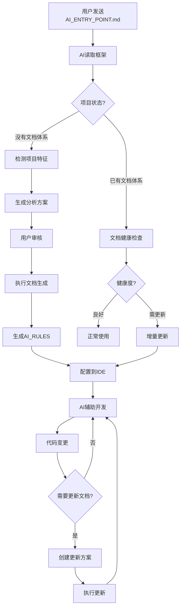

**当前框架版本**: V3.0 (2026-05)
**框架状态**: 稳定运行，核心基础设施（P0/P1）已全部落位。

**V3.0 核心能力全景**：

- **P0 核心基础设施**（✅ 全部交付）：001 角色库 / 003 设计思维 / 012 文档摘要 / 013 AI 互审 / 016 配置 / 017 工具库 / 018 commit-guided
- **P1 高价值能力**（✅ 全部交付）：004 ADR 系统 / 005 复杂度仪表盘 / 006 自动审查报告 / 011 文档谬误修复 / 014 文档阅读习惯
- **V3.0+ 增益**（✅ 已集成）：019 系统化文档审核框架、Git 安全规范整合

> **SSOT 提示**：V3.0 开发周期的详细过程文档（README/PROGRESS）已在版本交付后归档清理。当前框架能力的单一真相源分布在 `core/`, `agents/`, `config/`, `tools/` 等各功能目录的 README 中。


---

## 📋 第一部分：框架本质

### 1.1 框架是什么？

**AI 辅助编程文档生成框架** (AI Coding Context) 是一个帮助开发团队为项目生成 AI 辅助编程文档的完整体系。

**核心定位**: 不是简单的"文档生成器"，而是**AI 辅助编程的知识管理系统**。

### 1.2 解决什么问题？

#### 问题 1: AI 理解项目困难

- 每次新会话都要重新解释项目结构
- AI 不了解项目规范和禁忌
- 代码上下文理解成本高

#### 问题 2: 知识传承困难

- 新人上手周期长（1-2 周）
- 人员流动导致知识丢失
- 隐性知识无法传递

#### 问题 3: Vibe Coding 的技术债

- AI 快速编程导致复杂性累积
- 战术式编程（能跑就行）成为常态
- 文档与代码不同步

**框架解决方案**: 系统化文档 + AI 自动遵守 + 持续维护 = 高质量 AI 辅助编程

### 1.3 核心设计理念

#### 理念 1: 方案优先 (Plan First)

```
传统: 用户需求 → AI直接编码 → 问题频出
框架: 用户需求 → AI生成方案 → 人工审核 → 执行编码
```

**价值**: 避免 50%返工，提前发现问题

#### 理念 2: 基于代码 (Code-Based)

```
❌ 禁止臆测: AI不能猜测项目结构
✅ 必须分析: 所有结论必须基于实际代码
✅ 标注来源: 代码示例必须注明文件路径
```

**价值**: 确保文档准确性

#### 理念 3: 分层文档 (Layered Documentation)

```
主文档 (AI_Coding_Context.md)
  ↓ 索引和快速导航
子文档 (dev_docs/*.md)
  ↓ 详细规范和示例
知识库 (knowledge/)
  ↓ 经验沉淀
```

**价值**: 降低认知负荷，精准定位信息

#### 理念 4: 进度可控 (Trackable Progress)

```
大型项目 → 分批执行 → 记录进度 → 可中断恢复
```

**价值**: 控制复杂度，降低风险

#### 理念 5: 持续维护 (Continuous Maintenance)

```
代码变更 → 触发更新 → 文档同步 → 保持一致
```

**价值**: 避免文档腐化

### 1.4 核心工作流程



**关键节点说明**:

1. **智能分派**: 根据项目状态自动选择工作流
2. **方案驱动**: 不直接执行，先生成方案
3. **健康检查**: 已有文档自动评估质量
4. **持续维护**: 代码变更触发文档更新

---

## 📊 第二部分：V3.0 当前能力与演进背景（含 V2.3→V3.0 的限制溯源）

### 2.1 核心能力清单

**支持的编程语言**: JavaScript/TypeScript, Python, Java, Go, Rust, PHP, Ruby, C/C++ (9 种)

**支持的项目类型**: 前端、后端、全栈、CLI、库/SDK、脚本、移动应用、桌面应用、Serverless、容器化、数据科学 (11 种)

**支持的框架**: Vue 3, React, Angular, Next.js, Express, Django, Flask, Spring Boot 等 25+主流框架

### 2.2 已实现的核心功能

#### 功能 1: 智能项目检测

- 自动识别项目类型
- 技术栈分析
- 规模评估
- 复杂度判断

#### 功能 2: 文档生成

- 主文档生成 (AI_Coding_Context.md)
- 子文档生成（根据项目类型）
- AI_RULES 生成
- 代码示例自动提取

#### 功能 3: 增量更新

- 文档健康度检查（3 种模式）
- 变更检测
- 增量更新工作流
- 更新触发机制 (P0/P1/P2)

#### 功能 4: 特殊架构支持

- Monorepo 支持
- 微服务架构
- 多语言混合项目

#### 功能 5: 质量保证

- 安全信息脱敏
- 问题发现记录
- 质量检查清单
- 进度追踪

#### 功能 6: AI 角色库 (V3.0) ⭐

- 标准化 AI 角色定义
- 框架运行时角色支持 (文档生成器、审查员等)
- 用户开发时角色支持 (前端/后端/DevOps 专家等)
- 自定义角色支持
- 降低 Prompt 编写门槛 90%

#### 功能 7: 配置管理系统 (V3.0) ⭐

- 用户偏好持久化 (语言、详细程度等)
- 团队配置共享
- V3.0 功能开关管理
- Markdown + YAML Frontmatter 格式
- 智能配置推荐系统

#### 功能 8: 实用脚本工具库 (V3.0) ⭐

- 跨平台项目分析脚本 (Python/Node.js)
- 消除 AI 命令行操作的不确定性
- 结构扫描、代码统计等标准工具
- 智能降级机制
- 提升分析准确性和效率
- **Python 命令兼容性**：系统自动检测并支持 python 或 python3 命令，解决不同环境下的命令差异问题

#### 功能 9: 强制文档摘要机制 (V3.0) ⭐

- 标准化 YAML Frontmatter 摘要
- 智能文档推荐基础
- 自动化关联文件检测
- 节省 Token 消耗 30-50%
- 降低认知负荷

#### 功能 10: AI 互审机制 (V3.0) ⭐

- 分级审查机制 (Trivial/Simple/Complex/Critical)
- 对抗式编程 (生成者 vs 审查者)
- 可靠性驱动决策
- 标准化审查清单和流程
- 问题发现率提升 30-50%

#### 功能 11: 设计思维引导 (V3.0) ⭐

- 5 步引导流程 (5 Why、方案对比、风险评估、反思整合、最终决策)
- 专家团队模式 (引导者、产品经理、架构师、QA)
- 混合触发机制 (用户指令 + 自动复杂度评估)
- 将 AI 从"代码生成器"转变为"思考伙伴"
- 返工率降低 50%

#### 功能 12: Commit-Guided Documentation (V3.0) ⭐

- 基于结构化 Commit 信息的自动化文档更新系统
- 整合 Git 安全规范 (git_safety_workflow)
- 形成"设计 → 实施 → 验证"完整闭环
- 显著降低主分支污染风险，提升更新准确率

### 2.3 V2.3 的限制（为什么需要 V3.0）

#### 限制 1: 被动防护

```
V2.3: 规范写在文档里，AI遵守
问题: 流程缺乏强制性，且无法识别隐性变更
V3.0: 基于 Commit 驱动的自动化更新与 Git 安全规范（P0 已完成）
```

#### 限制 2: 单一 AI 视角

```
V2.3: AI生成 → 人工审核
问题: 单一AI可能有盲点
V3.0: AI生成 → AI审查 → 人工审核（P0 已完成）
```

#### 限制 3: 缺少设计引导

```
V2.3: 方案驱动，但不引导思考
问题: 用户可能跳过深度思考
V3.0: 5 Why + 多方案对比 + 边界定义（P0 已完成）
```

#### 限制 4: 复杂度不可见

```
V2.3: 文档记录复杂度
问题: 无实时监控
V3.0: 复杂度仪表盘 + 实时告警（P1 已交付）
```

#### 限制 5: 架构演进不可追溯

```
V2.3: 没有系统化架构决策记录
问题: "未知的未知"
V3.0: ADR系统 + 演进历史（P1 已交付）
```

---

## 🏗️ 第三部分：架构和概念

### 3.1 目录结构详解

#### 3.1.1 框架仓库结构（ai_coding_context/）

```text
# [master / dev 分支]——结构相同的产品树，面向最终用户，零开发内容
ai_coding_context/
│  ├── AI_ENTRY_POINT.md         # AI 入口（AI 读这个）
│  ├── README.md                 # 对人类的框架介绍
│  ├── CONTRIBUTING.md           # 贡献指南（含「分支模型与框架文档贡献规范」权威说明）
│  ├── core/                     # 核心规范（语言/安全/项目类型/更新触发/摘要规范/设计决策）
│  ├── agents/                   # AI 角色库（runtime/development/language_specific/workflows 等）
│  ├── config/                   # 配置管理系统（user_config + CONFIG_TEMPLATE）
│  ├── tools/                    # 实用脚本工具库（project_scanner, content_searcher, summary_* 等）
│  ├── workflows/                # 核心工作流（生成/检查/互审/Git 安全等）
│  ├── guides/                   # 使用与适配指南（含 commit_guided_* 等）
│  └── templates/                # 各类文档模板

# [internal 分支]——孤儿分支，与 master/dev 无共同历史、永不参与其合并；
# 本目录（dev/）只存在于此分支，本地通过 `git worktree add _internal internal` 挂载
dev/                                  # 框架自身开发工作区（仅 internal 分支）
├── FRAMEWORK_CONTEXT.md          # 本文档（全局上下文）
├── architecture/                 # 架构产物（dogfood ADR 系统）
│   ├── adr-template.md           # ADR 模板
│   ├── evolution.md              # ADR 演进图谱
│   └── decisions/                # 已接受 ADR（001 markdown / 002 layered）
├── complexity/                   # 复杂度仪表盘运行时（config + dashboard + data）
├── quality/                      # 文档质量保证体系（标准 + 审查 SOP + contexts）
├── reference/                    # 开发参考资料（理论分析、外部案例研究等）
├── case_skillatlas_review/       # SkillAtlas 项目审查案例（019 ADR 来源）
└── plan/                         # 框架迭代的长期计划与蓝图
```

**⚠️ 分支隔离机制（权威说明见 `CONTRIBUTING.md` §分支模型 与 `internal` 分支根 `README.md`）**：`dev/`、`FRAMEWORK_REVIEW*.md`、`framework_improvement_*.md` 等开发过程元数据**只存在于 `internal` 孤儿分支**，`master` 与 `dev` 结构相同且都不含这些内容。因此二者合并永远是干净 fast-forward，不会泄漏开发内容给用户。**切勿**把上述内容加回 `dev` 或 `master`。本地开发用 `git worktree add _internal internal` 挂载 internal 分支（`_internal/` 已被忽略）。

#### 3.1.2 典型用户项目结构（复制框架后的目标形态）

```text
project_root/
├── agents/                        # 🆕 AI 角色库 (V3.0)
│   ├── runtime/                   # 框架运行时角色
│   ├── development/               # 用户开发时角色
│   ├── language_specific/         # 语言专属角色
│   └── examples/                  # 角色使用示例
│
├── tools/                         # 🆕 实用脚本工具库 (V3.0)
│   ├── py/                        # Python 脚本
│   ├── js/                        # Node.js 脚本
│   ├── fallback/                  # 降级方案
│   └── README.md                  # 工具使用文档
│
├── AI_Coding_Context.md           # 主文档（唯一入口，面向当前业务项目）
│
├── dev_docs/                      # AI 文档目录
│   ├── _analysis/                 # 分析数据
│   │   └── generation_progress.md
│   │
│   ├── configuration.md           # ✅ 项目配置文档（必需）
│   ├── api_layer.md               # API 规范（前端）
│   ├── state_management.md        # 状态管理（前端）
│   ├── database_schema.md         # 数据库（后端）
│   ├── authentication.md          # 认证（后端）
│   │
│   ├── plans/                     # 方案文档
│   │   ├── active/                # 待审核、已确认或实施中的方案
│   │   ├── done/                  # 已实施、验证并完成同步的方案
│   │   └── archive/               # 废弃、搁置或被替代的方案
│   │
│   ├── memos/                     # 延后想法、外部依赖、阻塞项和待验证假设
│   │
│   ├── knowledge/                 # 知识库
│   │   ├── troubleshooting/       # 问题解决
│   │   ├── patterns/              # 架构模式
│   │   └── performance/           # 性能优化
│   │
│   └── review/                    # 🆕 系统化文档审核体系 (V3.0)
│       ├── sys_review_plan.md     # 审核规程（执行流程 + Prompt 模板）
│       ├── sys_review_principles.md # 审核原则（双目标、红线、验收标准）
│       ├── REVIEW_LOG.md          # 全局进度总索引
│       └── rounds/                # 审核轮次归档（每轮一个子目录）
│
└── AI_RULES.md                    # AI 规则（用于 IDE 集成）
```

**⚠️ 重要说明 - 配置目录**:

> **框架配置 vs 项目配置**
>
> 1. **框架配置** (`ai_coding_context/config/`)
>
>    - 位置: 仅在框架仓库中
>    - 用途: 控制框架行为（语言偏好、功能开关等）
>    - **不复制到用户项目**
>
> 2. **项目配置文档** (`dev_docs/configuration.md`)
>    - 位置: 用户项目的 dev_docs/ 目录
>    - 用途: 说明项目如何管理配置（环境变量、配置文件等）
>    - **作为子文档生成**

**注意事项**:

1. 框架配置（`ai_coding_context/config/`）保留在框架仓库，不复制到项目
2. 项目配置通过 `dev_docs/configuration.md` 文档说明（非配置文件）
3. `configuration.md` 是必需的子文档，记录项目的配置管理方式

### 3.2 核心概念

#### 概念 1: 主文档 (AI_Coding_Context.md)

**定位**: 唯一入口，索引中心

**包含**:

- 项目基本信息
- 快速导航（场景 → 文档）
- 子文档索引
- 核心代码模式
- AI 编码禁忌

**特点**: 只有一个、高密度信息、链接丰富

#### 概念 2: 子文档 (dev_docs/\*.md)

**定位**: 详细规范，分类管理

**类型**:

- 技术规范类: api_layer.md, database_schema.md
- 工作流类: deployment.md, testing.md
- 架构类: architecture.md, modules.md

**特点**: 按需创建、独立维护、互相链接

#### 概念 3: AI_RULES

**定位**: IDE 集成规则

**用途**: 配置到 IDE，AI 自动遵守

**生成流程**: 生成文档 → 提取规范 → 生成 AI_RULES → 配置 IDE

#### 概念 4: 方案文档 (plans/)

**定位**: 方案先行机制

**生命周期**:

1. 创建方案 (`plans/active/YYYY-MM-DD_<type>_<short-name>.md`)
2. 人工审核
3. 执行编码
4. 完成后移动到 `plans/done/`；废弃、搁置或被替代时移动到 `plans/archive/`

**价值**: 避免冲动编码

#### 概念 5: 知识库 (knowledge/)

**定位**: 经验沉淀

**内容**:

- troubleshooting/: 已解决的问题
- patterns/: 验证过的架构模式
- performance/: 性能优化经验

**用途**: 避免重复踩坑

#### 概念 6: AI 角色库 (agents/) - V3.0 ⭐

**定位**: 标准化专业 AI 角色定义库

**内容**:

- 框架运行时角色 (document_generator, plan_reviewer 等)
- 开发时角色 (frontend_expert, backend_expert, devops_expert 等)
- 自定义角色支持 (用户可定义项目特定角色)

**价值**: 提升 AI 输出质量的稳定性，显著降低 Prompt 编写门槛

#### 概念 7: 配置系统 (config/) - V3.0 ⭐

**定位**: 统一配置管理中心

**特点**:

- 用户偏好记忆 (语言、详细程度等)
- 团队配置共享
- 功能开关控制 (V3.0 特性)
- 人类可读的 Markdown + YAML 格式

**用途**: 消除重复询问, 个性化框架行为

#### 概念 8: 工具库 (tools/) - V3.0 ⭐

**定位**: 标准化分析脚本集合

**价值**:

- 替代 AI 不稳定的命令行操作
- 跨平台一致性 (Python/Node.js)
- 可靠的项目分析数据
- 自动降级到最佳可用工具

### 3.3 文档生命周期

```
阶段 1: 生成
  输入: 项目代码
  过程: 分析 → 方案 → 审核 → 生成
  输出: 主文档 + 子文档 + AI_RULES

阶段 2: 使用
  使用者: AI + 人类开发者
  频率: 每次编码都参考
  工具: IDE 集成 AI_RULES

阶段 3: 维护
  触发: 代码变更（P0/P1/P2）
  方式: 增量更新
  周期: 即时 / 每周 / 每月 / 每季度

阶段 4: 演进
  场景: 架构升级、技术栈变更
  方法: 重大更新或重新生成
  记录: 版本控制 + ADR（V3.0+）
```

### 3.4 在质量审查工作流中的使用方式

> 本节面向 AI 和框架维护者，说明在 `quality/` 体系下如何使用本文件。

- 在审查任意核心文档之前：
  - **先加载本文件**（`dev/FRAMEWORK_CONTEXT.md`），构建对 AICC 框架的全局模型：
    - 顶层目录与职责
    - V2.3 能力与 V3.0 基础设施
    - 质量体系与摘要机制的大致结构
- 然后根据被审查的目标文档，按 `quality/HOW_TO_GENERATE_CONTEXTS.md` 在审查时**即时生成**对应的审查上下文：
  - `quality/contexts/` 下仅有 `_template.md`，各文档的专属上下文按需现场生成，而非加载预先存在的逐文档文件
  - 例如审查 `AI_ENTRY_POINT.md` 时，依据该指南即时生成其审查上下文，不要去加载并不存在的 `quality/contexts/AI_ENTRY_POINT.md`
- 审查过程中，如涉及以下内容，再按需展开：
  - 配置行为 → 查阅 `config/README.md`
  - 工具使用与性能 → 查阅 `tools/README.md`
  - AI 角色行为与职责 → 查阅 `agents/README.md`
  - 摘要格式与校验规则 → 查阅 `core/SUMMARY_FORMAT_SPEC.md`
  - 设计理念与权衡 → 查阅 `core/design_decisions.md`
- 若本文件与其他文档在“目录结构 / 模块角色”方面出现冲突：
  - **以本文件为全局结构与职责划分的最终裁决**，并在审查报告中记录该冲突，后续修正文档。

---

## 📖 第四部分：术语表

### 4.1 编程范式

**战术式编程 (Tactical Programming)**

- 定义: "能跑就行，越快越好"
- 特征: 短视，引入不必要复杂性
- 结果: 快速积累技术债

**战略式编程 (Strategic Programming)**

- 定义: 产出卓越设计，确保有效工作
- 方法: 持续投入 10-20% 时间进行设计改进
- 结果: 短期投入，长期回报

### 4.2 Vibe Coding 概念

**Vibe Coding**

- 定义: AI 快速编程模式
- 特点: 过程压缩，速度极快
- 问题: 本质是向大模型借的技术债

**复杂性三症状**

1. **变更放大** (Change Amplification): 简单变更需要在多个层级修改
2. **认知负荷** (Cognitive Load): 需要大量时间掌握正确的上下文
3. **未知的未知** (Unknown Unknowns): 新 session 不知道 "雷区"

### 4.3 优先级和状态

**优先级**:

- P0 (必须): 不更新会导致严重问题（API 变更、Schema 变更）
- P1 (推荐): 不更新会影响效率（新增模块、流程调整）
- P2 (可选): 优化性改进（性能优化、代码重构）

**状态标识**:

- 🟡 待讨论 / 🟢 已确认 / 🔵 开发中 / ✅ 已完成 / 🔴 已阻塞 / ⚪ 未开始

---

## 🎯 第五部分：设计决策

### 5.1 为什么选择 Markdown？

**决策**: 所有文档使用 Markdown 格式

**理由**:

1. AI 友好 - 大模型训练数据中 Markdown 占比高
2. 人类可读 - 无需特殊工具
3. 版本控制 - Git 可以轻松 diff
4. 通用性 - 跨平台、跨工具
5. 可扩展 - 支持 Mermaid 图表、代码高亮

### 5.2 为什么方案优先？

**决策**: 强制 AI 先生成方案，人工审核后再编码

**理由**:

1. 避免返工 - 提前发现问题，减少 50% 返工
2. 引导思考 - 强制用户和 AI 深度思考
3. 风险控制 - 重大变更提前评估影响
4. 知识沉淀 - 方案本身就是知识

**数据支撑**:

- 无方案: 返工率 50%, 平均返工 2.5 次
- 有方案: 返工率 20%, 平均返工 1.0 次
- 投入 10 分钟方案，节省 2 小时返工

### 5.3 为什么分层文档？

**决策**: 主文档 + 子文档分层结构

**理由**:

1. 降低认知负荷 - 不是一次性看完所有文档
2. 按需加载 - 只看需要的部分
3. 易于维护 - 小文件更新容易
4. 职责分离 - 每个文档职责单一

**对比**:

- 单文件: 5000+ 行，查找困难，更新成本高
- 分层: 主文档 500 行，子文档 200-300 行，3 秒定位，更新成本低

### 5.4 为什么要进度记录？

**决策**: 大型项目强制记录进度

**理由**:

1. 可中断恢复 - Token 限制导致必须分批
2. 复杂度控制 - 大项目分阶段完成
3. 透明度 - 用户知道进展
4. 问题追溯 - 记录遇到的问题

### 5.5 为什么要问题发现？

**决策**: AI 必须记录发现的问题

**理由**:

1. 真实反馈 - 代码可能有问题
2. 技术债可见 - 量化技术债
3. 优先级排序 - 知道最紧急的问题
4. 知识沉淀 - 积累到 troubleshooting/

**原则**: 基于代码、明确严重性、提供建议、不能臆断

---

## 📚 第六部分：定位对比

### 与主流方案对比

| 维度            | Cursor/Copilot | 上下文工程  | 规范驱动  | 本框架        |
| --------------- | -------------- | ----------- | --------- | ------------- |
| **核心思路**    | AI 代码补全    | 优化 Prompt | 代码规范  | 文档沉淀+维护 |
| **知识传承**    | ❌             | ❌          | ⚠️        | ✅            |
| **AI 理解深度** | ⚠️ 浅层        | ⚠️ 临时     | ⚠️ 规范层 | ✅ 深度       |
| **长期价值**    | ⚠️ 有限        | ⚠️ 有限     | ⚠️ 中等   | ✅ 高         |
| **技术债控制**  | ❌             | ❌          | ⚠️        | ✅            |

**组合建议**: 本框架 + Cursor/Copilot = 最佳实践

- 本框架: 项目理解、规范定义、知识沉淀
- Cursor/Copilot: 代码补全、快速编码

---

## 📜 第七部分：版本演进简史

### V1.0 (2024-Q1) - 起源

- 核心: 基础文档生成
- 限制: 无维护机制

### V2.0 (2024-Q3) - 增强

- 核心: 工作流完善
- 新增: 方案驱动、进度追踪、知识库

### V2.3 (2025-11) - 当前稳定版

- 核心: 智能化升级
- 新增: 智能工作流分派、文档健康度检查、Monorepo 支持、增量更新
- 限制: 被动式、单一 AI、缺设计引导、复杂度不可见、无 ADR

### V3.0 (2026-05) - 战略式编程增强（当前稳定版）

- **核心成就**: 实现了从“代码生成”向“思考伙伴”的跨越，核心基础设施 P0/P1 全部交付。
- **交付项**:
  - ✅ **AI 角色库**：标准化专业角色，降低 Prompt 门槛。
  - ✅ **设计思维引导**：5 Why + 方案对比，降低 50% 返工率。
  - ✅ **互审机制**：对抗式编程，提升问题发现率。
  - ✅ **Commit-Guided**：自动化文档同步，闭环设计与实施。
  - ✅ **复杂度仪表盘**：量化技术债，让架构风险可见。
  - ✅ **ADR 系统**：结构化记录重大设计决策。
  - ✅ **工具/配置/摘要**：标准化框架底层交互，节省 30%+ Token。
- **状态**: 已合并至主分支，进入持续维护与长效计划（`dev/plan/`）迭代阶段。


---

## 🔗 第八部分：重要文档索引

### 用户文档

- [README.md](../README.md) - GitHub 首页 & 用户入门指南
- [CONTRIBUTING.md](../CONTRIBUTING.md) - 贡献指南

### AI 使用文档

- [AI_ENTRY_POINT.md](../AI_ENTRY_POINT.md) - AI 使用框架的入口

### 开发文档

- [dev/FRAMEWORK_CONTEXT.md](./FRAMEWORK_CONTEXT.md) - 本文档（全局上下文）
- [dev/plan/](./plan/) - 框架长期迭代计划与蓝图（active）；已完成/已取代的计划归档于 [dev/plan/done/](./plan/done/)


### 参考文档

- [dev/reference/AI 编程的现状.md](./reference/AI编程的现状.md) - V3.0 理论基础
- [dev/reference/AI_PROGRAMMING_ANALYSIS.md](./reference/AI_PROGRAMMING_ANALYSIS.md) - V3.0 方案分析
- [core/design_decisions.md](../core/design_decisions.md) - 框架设计决策说明
- [core/SUMMARY_FORMAT_SPEC.md](../core/SUMMARY_FORMAT_SPEC.md) - 文档摘要格式规范
- [quality/README.md](./quality/README.md) - 文档质量保证体系与审查工作流

---

**文档版本**: v2.1（更新 V3.0 P1 优化点进度）
**最后更新**: 2026-05-29
**维护者**: Framework Team  
**反馈**: 欢迎在 internal 分支 dev/plan/ 下记录改进提案
