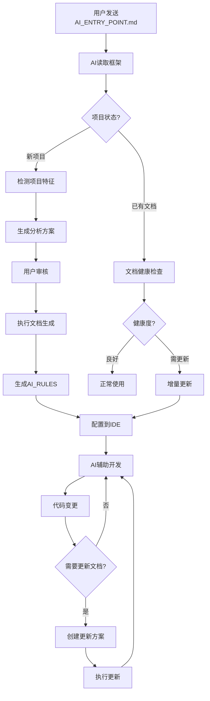

**当前框架版本**: V2.3

---

## 📋 第一部分：框架本质

### 1.1 框架是什么？

**AI 辅助编程文档生成框架** (AI Coding Context) 是一个帮助开发团队为项目生成 AI 辅助编程文档的完整体系。

**核心定位**: 不是简单的"文档生成器"，而是**AI 辅助编程的知识管理系统**。

### 1.2 解决什么问题？

#### 问题 1: AI 理解项目困难

- 每次新会话都要重新解释项目结构
- AI 不了解项目规范和禁忌
- 代码上下文理解成本高

#### 问题 2: 知识传承困难

- 新人上手周期长（1-2 周）
- 人员流动导致知识丢失
- 隐性知识无法传递

#### 问题 3: Vibe Coding 的技术债

- AI 快速编程导致复杂性累积
- 战术式编程（能跑就行）成为常态
- 文档与代码不同步

**框架解决方案**: 系统化文档 + AI 自动遵守 + 持续维护 = 高质量 AI 辅助编程

### 1.3 核心设计理念

#### 理念 1: 方案优先 (Plan First)

```
传统: 用户需求 → AI直接编码 → 问题频出
框架: 用户需求 → AI生成方案 → 人工审核 → 执行编码
```

**价值**: 避免 50%返工，提前发现问题

#### 理念 2: 基于代码 (Code-Based)

```
❌ 禁止臆测: AI不能猜测项目结构
✅ 必须分析: 所有结论必须基于实际代码
✅ 标注来源: 代码示例必须注明文件路径
```

**价值**: 确保文档准确性

#### 理念 3: 分层文档 (Layered Documentation)

```
主文档 (AI_Coding_Context.md)
  ↓ 索引和快速导航
子文档 (dev_docs/*.md)
  ↓ 详细规范和示例
知识库 (knowledge/)
  ↓ 经验沉淀
```

**价值**: 降低认知负荷，精准定位信息

#### 理念 4: 进度可控 (Trackable Progress)

```
大型项目 → 分批执行 → 记录进度 → 可中断恢复
```

**价值**: 控制复杂度，降低风险

#### 理念 5: 持续维护 (Continuous Maintenance)

```
代码变更 → 触发更新 → 文档同步 → 保持一致
```

**价值**: 避免文档腐化

### 1.4 核心工作流程



**关键节点说明**:

1. **智能分派**: 根据项目状态自动选择工作流
2. **方案驱动**: 不直接执行，先生成方案
3. **健康检查**: 已有文档自动评估质量
4. **持续维护**: 代码变更触发文档更新

---

## 📊 第二部分：V2.3 当前状态

### 2.1 核心能力清单

**支持的编程语言**: JavaScript/TypeScript, Python, Java, Go, Rust, PHP, Ruby, C/C++ (9 种)

**支持的项目类型**: 前端、后端、全栈、CLI、库/SDK、脚本、移动应用、桌面应用、Serverless、容器化、数据科学 (11 种)

**支持的框架**: Vue 3, React, Angular, Next.js, Express, Django, Flask, Spring Boot 等 25+主流框架

### 2.2 已实现的核心功能

#### 功能 1: 智能项目检测

- 自动识别项目类型
- 技术栈分析
- 规模评估
- 复杂度判断

#### 功能 2: 文档生成

- 主文档生成 (AI_Coding_Context.md)
- 子文档生成（根据项目类型）
- AI_RULES 生成
- 代码示例自动提取

#### 功能 3: 增量更新

- 文档健康度检查（3 种模式）
- 变更检测
- 增量更新工作流
- 更新触发机制 (P0/P1/P2)

#### 功能 4: 特殊架构支持

- Monorepo 支持
- 微服务架构
- 多语言混合项目

#### 功能 5: 质量保证

- 安全信息脱敏
- 问题发现记录
- 质量检查清单
- 进度追踪

### 2.3 V2.3 的限制（为什么需要 V3.0）

#### 限制 1: 被动防护

```
V2.3: 规范写在文档里，AI遵守
问题: 人类危险指令仍可绕过
V3.0: 主动拦截危险指令
```

#### 限制 2: 单一 AI 视角

```
V2.3: AI生成 → 人工审核
问题: 单一AI可能有盲点
V3.0: AI生成 → AI审查 → 人工审核
```

#### 限制 3: 缺少设计引导

```
V2.3: 方案驱动，但不引导思考
问题: 用户可能跳过深度思考
V3.0: 5 Why + 多方案对比 + 边界定义
```

#### 限制 4: 复杂度不可见

```
V2.3: 文档记录复杂度
问题: 无实时监控
V3.0: 复杂度仪表盘 + 实时告警
```

#### 限制 5: 架构演进不可追溯

```
V2.3: 没有系统化架构决策记录
问题: "未知的未知"
V3.0: ADR系统 + 演进历史
```

---

## 🏗️ 第三部分：架构和概念

### 3.1 目录结构详解

```
project_root/
├── AI_Coding_Context.md          # 主文档（唯一入口）
│
├── dev_docs/                      # AI文档目录
│   ├── _analysis/                 # 分析数据
│   │   └── generation_progress.md
│   │
│   ├── api_layer.md               # API规范（前端）
│   ├── state_management.md        # 状态管理（前端）
│   ├── database_schema.md         # 数据库（后端）
│   ├── authentication.md          # 认证（后端）
│   │
│   ├── plans/                     # 方案文档
│   │   ├── features/              # 功能方案
│   │   └── bugs/                  # Bug修复方案
│   │
│   └── knowledge/                 # 知识库
│       ├── troubleshooting/       # 问题解决
│       ├── patterns/              # 架构模式
│       └── performance/           # 性能优化
│
└── AI_RULES.md                    # AI规则（IDE集成）
```

### 3.2 核心概念

#### 概念 1: 主文档 (AI_Coding_Context.md)

**定位**: 唯一入口，索引中心

**包含**:

- 项目基本信息
- 快速导航（场景 → 文档）
- 子文档索引
- 核心代码模式
- AI 编码禁忌

**特点**: 只有一个、高密度信息、链接丰富

#### 概念 2: 子文档 (dev_docs/\*.md)

**定位**: 详细规范，分类管理

**类型**:

- 技术规范类: api_layer.md, database_schema.md
- 工作流类: deployment.md, testing.md
- 架构类: architecture.md, modules.md

**特点**: 按需创建、独立维护、互相链接

#### 概念 3: AI_RULES

**定位**: IDE 集成规则

**用途**: 配置到 IDE，AI 自动遵守

**生成流程**: 生成文档 → 提取规范 → 生成 AI_RULES → 配置 IDE

#### 概念 4: 方案文档 (plans/)

**定位**: 方案先行机制

**生命周期**:

1. 创建方案 (plans/features/xxx.md)
2. 人工审核
3. 执行编码
4. 归档或删除

**价值**: 避免冲动编码

#### 概念 5: 知识库 (knowledge/)

**定位**: 经验沉淀

**内容**:

- troubleshooting/: 已解决的问题
- patterns/: 验证过的架构模式
- performance/: 性能优化经验

**用途**: 避免重复踩坑

### 3.3 文档生命周期

```
阶段1: 生成
  输入: 项目代码
  过程: 分析 → 方案 → 审核 → 生成
  输出: 主文档 + 子文档 + AI_RULES

阶段2: 使用
  使用者: AI + 人类开发者
  频率: 每次编码都参考
  工具: IDE集成AI_RULES

阶段3: 维护
  触发: 代码变更（P0/P1/P2）
  方式: 增量更新
  周期: 即时/每周/每月/每季度

阶段4: 演进
  场景: 架构升级、技术栈变更
  方法: 重大更新或重新生成
  记录: 版本控制 + ADR（V3.0+）
```

---

## 📖 第四部分：术语表

### 4.1 编程范式

**战术式编程 (Tactical Programming)**

- 定义: "能跑就行，越快越好"
- 特征: 短视，引入不必要复杂性
- 结果: 快速积累技术债

**战略式编程 (Strategic Programming)**

- 定义: 产出卓越设计，确保有效工作
- 方法: 持续投入 10-20%时间进行设计改进
- 结果: 短期投入，长期回报

### 4.2 Vibe Coding 概念

**Vibe Coding**

- 定义: AI 快速编程模式
- 特点: 过程压缩，速度极快
- 问题: 本质是向大模型借的技术债

**复杂性三症状**

1. **变更放大** (Change Amplification): 简单变更需要在多个层级修改
2. **认知负荷** (Cognitive Load): 需要大量时间掌握正确的上下文
3. **未知的未知** (Unknown Unknowns): 新 session 不知道"雷区"

### 4.3 优先级和状态

**优先级**:

- P0 (必须): 不更新会导致严重问题（API 变更、Schema 变更）
- P1 (推荐): 不更新会影响效率（新增模块、流程调整）
- P2 (可选): 优化性改进（性能优化、代码重构）

**状态标识**:

- 🟡 待讨论 / 🟢 已确认 / 🔵 开发中 / ✅ 已完成 / 🔴 已阻塞 / ⚪ 未开始

---

## 🎯 第五部分：设计决策

### 5.1 为什么选择 Markdown？

**决策**: 所有文档使用 Markdown 格式

**理由**:

1. AI 友好 - 大模型训练数据中 Markdown 占比高
2. 人类可读 - 无需特殊工具
3. 版本控制 - Git 可以轻松 diff
4. 通用性 - 跨平台、跨工具
5. 可扩展 - 支持 Mermaid 图表、代码高亮

### 5.2 为什么方案优先？

**决策**: 强制 AI 先生成方案，人工审核后再编码

**理由**:

1. 避免返工 - 提前发现问题，减少 50%返工
2. 引导思考 - 强制用户和 AI 深度思考
3. 风险控制 - 重大变更提前评估影响
4. 知识沉淀 - 方案本身就是知识

**数据支撑**:

- 无方案: 返工率 50%, 平均返工 2.5 次
- 有方案: 返工率 20%, 平均返工 1.0 次
- 投入 10 分钟方案，节省 2 小时返工

### 5.3 为什么分层文档？

**决策**: 主文档+子文档分层结构

**理由**:

1. 降低认知负荷 - 不是一次性看完所有文档
2. 按需加载 - 只看需要的部分
3. 易于维护 - 小文件更新容易
4. 职责分离 - 每个文档职责单一

**对比**:

- 单文件: 5000+行，查找困难，更新成本高
- 分层: 主文档 500 行，子文档 200-300 行，3 秒定位，更新成本低

### 5.4 为什么要进度记录？

**决策**: 大型项目强制记录进度

**理由**:

1. 可中断恢复 - Token 限制导致必须分批
2. 复杂度控制 - 大项目分阶段完成
3. 透明度 - 用户知道进展
4. 问题追溯 - 记录遇到的问题

### 5.5 为什么要问题发现？

**决策**: AI 必须记录发现的问题

**理由**:

1. 真实反馈 - 代码可能有问题
2. 技术债可见 - 量化技术债
3. 优先级排序 - 知道最紧急的问题
4. 知识沉淀 - 积累到 troubleshooting/

**原则**: 基于代码、明确严重性、提供建议、不能臆断

---

## 📚 第六部分：定位对比

### 与主流方案对比

| 维度            | Cursor/Copilot | 上下文工程  | 规范驱动  | 本框架        |
| --------------- | -------------- | ----------- | --------- | ------------- |
| **核心思路**    | AI 代码补全    | 优化 Prompt | 代码规范  | 文档沉淀+维护 |
| **知识传承**    | ❌             | ❌          | ⚠️        | ✅            |
| **AI 理解深度** | ⚠️ 浅层        | ⚠️ 临时     | ⚠️ 规范层 | ✅ 深度       |
| **长期价值**    | ⚠️ 有限        | ⚠️ 有限     | ⚠️ 中等   | ✅ 高         |
| **技术债控制**  | ❌             | ❌          | ⚠️        | ✅            |

**组合建议**: 本框架 + Cursor/Copilot = 最佳实践

- 本框架: 项目理解、规范定义、知识沉淀
- Cursor/Copilot: 代码补全、快速编码

---

## 📜 第七部分：版本演进简史

### V1.0 (2024-Q1) - 起源

- 核心: 基础文档生成
- 限制: 无维护机制

### V2.0 (2024-Q3) - 增强

- 核心: 工作流完善
- 新增: 方案驱动、进度追踪、知识库

### V2.3 (2025-11) - 当前稳定版

- 核心: 智能化升级
- 新增: 智能工作流分派、文档健康度检查、Monorepo 支持、增量更新
- 限制: 被动式、单一 AI、缺设计引导、复杂度不可见、无 ADR

### V3.0 (规划中) - 战略式编程增强

- 核心: 从"工具"到"系统"
- 理论基础: 《AI 编程的现状.md》+ 《软件设计哲学》
- P0 功能: AI 互审、危险指令拦截、设计思维引导
- P1 功能: ADR 系统、复杂度仪表盘、自动审查报告
- P2 功能: 学习曲线追踪、AI 能力分级、文档自修复、跨项目知识复用

**详见**: `dev/V3.0/README.md` 和 `dev/VERSION_HISTORY.md`

---

## 🔗 第八部分：重要文档索引

### 用户文档

- [README.md](../README.md) - GitHub 首页
- [INTRODUCTION.md](../INTRODUCTION.md) - 用户入门指南
- [CONTRIBUTING.md](../CONTRIBUTING.md) - 贡献指南

### AI 使用文档

- [AI_ENTRY_POINT.md](../AI_ENTRY_POINT.md) - AI 使用框架的入口

### 开发文档

- [dev/FRAMEWORK_CONTEXT.md](./FRAMEWORK_CONTEXT.md) - 本文档（全局上下文）
- [dev/VERSION_HISTORY.md](./VERSION_HISTORY.md) - 详细版本历史
- [dev/V3.0/](./V3.0/) - V3.0 规划

### 参考文档

- [dev/reference/AI 编程的现状.md](./reference/AI编程的现状.md) - V3.0 理论基础
- [dev/reference/AI_PROGRAMMING_ANALYSIS.md](./reference/AI_PROGRAMMING_ANALYSIS.md) - V3.0 方案分析
- [DOCUMENT_OPTIMIZATION_GUIDE.md](../DOCUMENT_OPTIMIZATION_GUIDE.md) - 文档优化指南

---

**文档版本**: v1.1  
**最后更新**: 2025-11-29  
**维护者**: Framework Team  
**反馈**: 欢迎在 dev/discussions/提出改进建议
