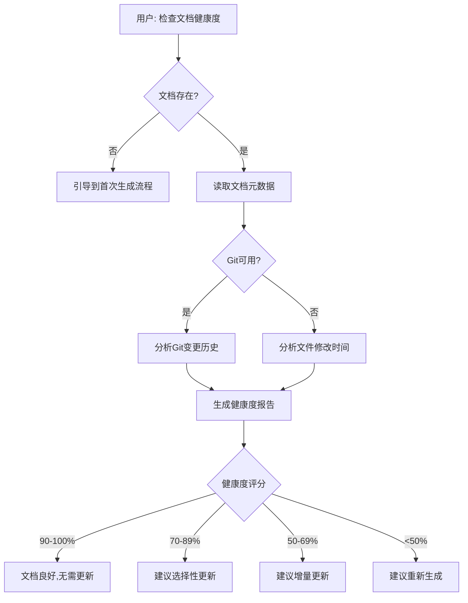
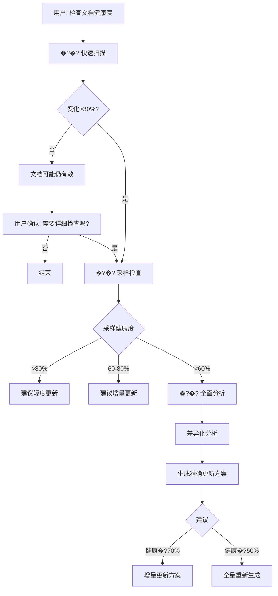

# 文档框架工作流头脑风�?

> **创建时间**: 2025-11-28  
> **目的**: 分析"文档过时"场景的解决方�?+ 审查当前工作流完整�?

---

## 🎯 核心问题

**用户场景**:

- 文档已生成但不确定是否过�?
- 不想消耗大�?token 重新生成
- 希望低成本评估和更新文档

**关键矛盾**: 准确�?vs token 消�?

---

## 📊 当前 AI_ENTRY_POINT 工作流分�?

### �?已覆盖的场景

1. **首次生成** (步骤 0-6)

   - �?环境预检
   - �?项目检�?
   - �?策略决策
   - �?生成方案
   - �?人工审核
   - �?执行生成

2. **特殊场景**

   - �?场景 1: 标准项目
   - �?场景 2: Monorepo 项目
   - �?场景 3: 未识别框�?

3. **容错机制**

   - �?故障降级决策
   - �?进度恢复

4. **维护引导**
   - �?文档更新触发说明
   - �?AI Rules 维护指南引用

---

### �?缺失的关键场�?

#### 🔴 场景 4: 文档健康度检查（高优先级�?

**触发条件**:

- 文档已存�?
- 距上次更新时间较�?
- 用户不确定是否需要更�?

**当前状�?*: �?**完全缺失**

**应有流程**:



**缺失影响**: 中高

- 用户可能不知道何时应该更新文�?
- 可能浪费 token 重新生成仍然准确的文�?
- 可能错过关键的文档更新时�?

---

#### 🔴 场景 5: 智能增量更新决策（高优先级）

**触发条件**:

- 代码有部分变�?
- 希望只更新变更部�?

**当前状�?*: ⚠️ **部分存在但未整合**

- 有`incremental_update_workflow.md`
- 但`AI_ENTRY_POINT.md`中没有明确引导何时使�?

**应有决策逻辑**:

```markdown
## 增量 vs 全量决策

### 自动判断标准:

**增量更新**(推荐):

- 代码变更 < 30%
- 无架构重�?
- 核心模块未变
- 文档健康�?> 50%

**全量重新生成**(必须):

- 代码变更 > 50%
- 有架构重�?
- 技术栈升级
- 文档健康�?< 30%

**询问用户**(灰色地带):

- 代码变更 30-50%
- 中等规模重构
- 文档健康�?30-50%
```

**缺失影响**: �?

- AI 可能不知道何时推荐增量更�?
- 用户需要手动判断，增加认知负担

---

#### 🟡 场景 6: 文档快速诊断（中优先级�?

**触发条件**:

- 用户只想快速了解文档状�?
- 不执行任何更�?

**当前状�?*: �?**完全缺失**

**应有流程**:

```markdown
### 快速诊断流�?

1. **读取文档元数�?* (0 token)

   - 生成日期
   - 覆盖的文件数
   - 文档版本

2. **快速扫�?* (~100 tokens)

   - 统计当前代码文件�?
   - 对比文档覆盖范围
   - 识别明显缺失的模�?

3. **生成诊断卡片** (~50 tokens)
```

📊 文档诊断卡片

- 生成日期: 2025-09-15
- 距今: 74 �?
- 覆盖�? 128/156 文件 (82%)
- 缺失: src/auth/ (新增模块)
- 建议: 补充 auth 相关文档

```

**总token消�?*: ~150 tokens（vs 重新生成的几千tokens�?
```

**缺失影响**: �?�?

- 提供极低成本的快速检�?
- 帮助用户快速决�?

---

#### 🟡 场景 7: 文档修复/补全（中优先级）

**触发条件**:

- 文档部分损坏
- 文档格式错误
- 文档部分章节缺失

**当前状�?*: �?**完全缺失**

**应有流程**:

```markdown
### 文档修复流程

1. **诊断问题**

   - 检查文档格式有效�?
   - 验证内部链接
   - 检查必需章节完整�?

2. **分类处理**

   - 格式问题: 自动修复
   - 链接问题: 自动更新
   - 内容缺失: 增量补充

3. **验证修复**
   - 确认格式正确
   - 确认链接有效
   - 用户确认内容准确
```

**缺失影响**: �?

- 但对文档质量保证有帮�?

---

#### 🟢 场景 8: 文档版本管理（低优先级）

**触发条件**:

- 项目有重大版本发�?
- 希望保留历史文档版本

**当前状�?*: �?**完全缺失**

**可能的方�?*:

```markdown
dev_docs/
├── AI_Coding_Context.md # 当前版本
├── \_versions/
�?├── v1.0.0/
�?�?└── AI_Coding_Context.md
�?└── v2.0.0/
�?└── AI_Coding_Context.md
```

**缺失影响**: 很低

- Nice to have，但不是必需

---

## 💡 新方案头脑风�?

### 方案 1: 智能采样检�?⭐⭐�?

**原理**: 不检查所有文件，仅采样关键文�?

**步骤**:

1. 识别"核心文件"（entry points, 主要模块�?
2. 采样检查这些文件（10-20 个）
3. 推断整体健康�?

**优点**:

- Token 消耗极低（5-10%�?
- 速度�?
- 准确度中等（70-80%�?

**实现**:

```markdown
核心文件识别规则:

- package.json/requirements.txt 等配置文�?
- src/index._ �?main._ 入口文件
- 最常被 import 的文件（通过静态分析）
- 目录下的 index 文件
```

---

### 方案 2: 文档自检机制 ⭐⭐

**原理**: 在文档中嵌入自检脚本

**示例**:

```markdown
<!-- DOC_METADATA
generated: 2025-09-15
files_covered: ["src/core/api.ts", "src/core/auth.ts", ...]
code_signature: abc123def456
-->

# AI_Coding_Context.md

...
```

**自检流程**:

```bash
# AI执行
1. 读取文档元数�?
2. 计算当前代码签名
3. 对比签名变化
4. 如签名差�?30% �?建议更新
```

**优点**:

- 完全自动�?
- 几乎�?token 消耗（仅需读取元数据）

**缺点**:

- 需要在文档生成时嵌入元数据
- 对现有文档不适用

---

### 方案 3: 差异化分�?⭐⭐⭐⭐

**原理**: 精确分析代码变更，生成差异报�?

**流程**:

```markdown
1. 获取上次文档更新时的代码快照

   - �?Git: git diff <commit>
   - 从文档元数据: 记录的文件列�?

2. 分析变更类型

   - 新增文件 �?需要补充文�?
   - 删除文件 �?需要移除相关文�?
   - 修改文件 �?需要评估影�?

3. 变更影响评分

   - 核心文件修改: 高影�?
   - 工具类修�? 中影�?
   - 配置文件修改: 低影�?

4. 生成精确更新清单
```

需要更新的文档章节:

- architecture_overview.md (核心 API 变更)
- authentication.md (新增模块)

可忽略的变更:

- 样式文件更新
- 配置文件微调

```

```

**优点**:

- 准确度最高（90-95%�?
- 精确指导更新范围
- Token 消耗合理（20-30%�?

**推荐指数**: ⭐⭐⭐⭐�?

---

### 方案 4: 分层检查策�?⭐⭐�?

**原理**: 先快速检查，再深入分�?

**三层检�?*:

```markdown
## �?1 �? 快速扫�?(10 tokens, 5 �?

- 检查文档是否存�?
- 读取生成日期
- 统计文件数变�?
  �?如果变化<10% �?文档可能仍有�?
  �?如果变化>30% �?进入�?2 �?

## �?2 �? 采样检�?(100 tokens, 30 �?

- 采样 10-15 个核心文�?
- 检查这些文件是否在文档中被提及
- 粗略评估变更影响
  �?如果采样健康�?80% �?建议轻度更新
  �?如果采样健康�?60% �?进入�?3 �?

## �?3 �? 全面分析 (500 tokens, 2-3 分钟)

- 完整 Git diff 分析
- 详细影响评估
- 精确更新建议
  �?输出完整的健康度报告和更新方�?
```

**优点**:

- 渐进式，用户可随时停�?
- Token 消耗根据实际需求动态调�?
- 最坏情况也只用 500 tokens（vs 全量重新生成的几�?tokens�?

**推荐指数**: ⭐⭐⭐⭐

---

### 方案 5: 变更追踪日志 ⭐⭐

**原理**: 用户手动记录关键变更

**实现**:

```markdown
# dev_docs/\_analysis/changes.md

## 2025-10-15

- 重构了认证模�?
- 新增了权限系�?

## 2025-11-01

- 迁移�?TypeScript
- 更新�?API 设计
```

**AI 使用**:

```markdown
请根据我的变更日志评估文档健康度:
[读取 changes.md]

基于这些变更，建议更�?

- authentication.md (认证模块重构)
- architecture_overview.md (新增权限系统)
```

**优点**:

- 非常准确（基于人工记录）
- AI 分析成本�?

**缺点**:

- 需要用户手动维�?
- 容易遗漏

**推荐指数**: ⭐⭐

---

## 🎯 最佳实践组合方�?

我建议采�?*分层检查策�?* + **差异化分�?*的组�?

### 标准流程:



---

## 📋 AI_ENTRY_POINT 需要补充的内容

### 1. 添加"场景 4: 文档健康度检�?

**位置**: 在现有场�?3 后添�?

**内容大纲**:

```markdown
### 场景 4: 文档健康度检�?(v2.3 新增)

**触发条件**:

- 文档已存�?
- 距上次更新时间较长（>1 个月�?
- 用户不确定是否需要更�?

**检查流�?*: 参见 [文档健康度检查流程](./workflows/document_health_check.md)

**快速操�?*:
```

请检查我的项目文档健康度:

- 项目路径: [路径]
- 文档路径: dev_docs/

```

**分层检�?*:
1. 快速扫�?�?初步判断
2. 采样检�?�?详细评估
3. 全面分析 �?精确方案

**输出**: 健康度报�?+ 更新建议
```

---

### 2. 明确"何时使用增量更新"

**位置**: 在步�?6 后添加决策指�?

**内容**:

```markdown
### 6.1 增量 vs 全量决策指南

**何时使用增量更新**:

- 代码变更 < 30%
- 无架构重�?
- 文档健康�?> 50%
- 参见: [增量更新流程](./workflows/incremental_update_workflow.md)

**何时重新生成**:

- 代码变更 > 50%
- 有架构重�?
- 文档健康�?< 30%

**不确定时**:

- 先执行健康度检�?
- 根据报告建议决策
```

---

### 3. 补充"文档维护"章节

**位置**: 在文档生成流程章节后

**内容**:

```markdown
## 📊 文档维护和更�?

### 定期检查建�?

| 项目活跃�?| 检查频�?| 检查方�?|
| ---------- | -------- | -------- |
| 高频开�?  | 每月     | 快速扫�?|
| 中频开�?  | 每季�?  | 采样检�?|
| 维护模式   | 每半�?  | 全面分析 |

### 更新触发�?

自动检查以下情�?

- 架构重构完成
- 技术栈升级
- 新增核心模块
- 团队成员交接

**详细说明**: 参见 [文档更新触发机制](./core/update_triggers.md)
```

---

## 🆕 需要创建的新文�?

### 1. workflows/document_health_check.md ⭐⭐⭐⭐�?

**优先�?*: �?

**内容**:

- 分层检查流程详�?
- Git diff 分析方法
- 健康度评分标�?
- 报告模板
- 更新策略建议

---

### 2. workflows/document_repair.md ⭐⭐

**优先�?*: �?

**内容**:

- 文档损坏检�?
- 格式修复方法
- 链接更新流程
- 内容补全策略

---

### 3. templates/HEALTH_CHECK_REPORT_TEMPLATE.md ⭐⭐�?

**优先�?*: �?�?

**内容**:

```markdown
# 文档健康度报�?

## 📊 整体评估

- 健康�? XX%
- 评级: [优秀/良好/一�?差]

## 📈 变更统计

- 文档最后更�? YYYY-MM-DD
- 距今天数: XX �?
- 新增文件: XX �?
- 修改文件: XX �?
- 删除文件: XX �?

## 🎯 风险评估

### 🔴 高风险区�?

### 🟡 中风险区�?

### 🟢 低风险区�?

## 💡 更新建议

- 推荐方案: [增量更新/全量重新生成]
- 预计工作�? XX 小时
- 预计 token 消�? 原生成量�?XX%

## 📋 详细更新清单

...
```

---

## 🔍 其他发现的工作流问题

### 问题 1: 进度恢复场景不够清晰

**当前**: �?进度恢复"说明，但触发条件不明�?

**建议**: 明确触发场景

```markdown
### 进度恢复场景

**何时使用**:

- AI 中断或超�?
- 用户手动暂停
- 批次执行中断

**如何恢复**:

1. 读取 generation_progress.md
2. 识别最后完成的步骤
3. 从下一步骤继续
```

---

### 问题 2: 没有"文档质量验证"流程

**缺失**: 生成后的质量检�?

**建议**: 添加质量验证清单

```markdown
### 6.2 质量验证（生成后必做�?

**自动检�?*:

- [ ] 所有内部链接有�?
- [ ] 所有代码示例包含文件路�?
- [ ] 所有章节完�?

**人工确认**:

- [ ] 架构描述准确
- [ ] 关键流程清晰
- [ ] 无敏感信息泄�?
```

---

### 问题 3: 缺少"文档迁移"场景

**场景**: 项目从旧框架迁移到新框架

**应有指导**:

```markdown
### 场景 X: 文档框架迁移

**�?v1.0 迁移�?v2.0**:

1. 备份现有文档
2. 运行兼容性检�?
3. 按迁移指南调整结�?
4. 验证迁移结果
```

---

## 🎯 总结和优先级建议

### 立即实施（P0�?

1. �?**创建`workflows/document_health_check.md`**

   - 这是最核心的缺失功�?
   - 直接解决用户痛点

2. �?**�?AI_ENTRY_POINT 添加场景 4**
   - 引导用户使用健康度检�?
   - 明确何时使用增量更新

### 近期实施（P1�?

3. �?**创建`HEALTH_CHECK_REPORT_TEMPLATE.md`**

   - 标准化报告格�?

4. �?**补充增量更新决策指南**
   - 帮助 AI 和用户更好决�?

### 可选实施（P2�?

5. �?文档修复流程
6. �?文档版本管理
7. �?质量验证清单

---

## 💡 创新想法记录

1. **AI 主动提醒**:

   - 在规则文件中加入提醒机制
   - AI 定期（如每月）主动询问是否需要更新文�?

2. **文档热力�?*:

   - 可视化哪些部分经常更�?
   - 哪些部分很久未变

3. **文档订阅机制**:

- 架构重构完成
- 技术栈升级
- 新增核心模块
- 团队成员交接

**详细说明**: 参见 [文档更新触发机制](./core/update_triggers.md)

````

---

## 🆕 需要创建的新文�?

### 1. workflows/document_health_check.md ⭐⭐⭐⭐�?

**优先�?*: �?

**内容**:

- 分层检查流程详�?
- Git diff 分析方法
- 健康度评分标�?
- 报告模板
- 更新策略建议

---

### 2. workflows/document_repair.md ⭐⭐

**优先�?*: �?

**内容**:

- 文档损坏检�?
- 格式修复方法
- 链接更新流程
- 内容补全策略

---

### 3. templates/HEALTH_CHECK_REPORT_TEMPLATE.md ⭐⭐�?

**优先�?*: �?�?

**内容**:

```markdown
# 文档健康度报�?

## 📊 整体评估

- 健康�? XX%
- 评级: [优秀/良好/一�?差]

## 📈 变更统计

- 文档最后更�? YYYY-MM-DD
- 距今天数: XX �?
- 新增文件: XX �?
- 修改文件: XX �?
- 删除文件: XX �?

## 🎯 风险评估

### 🔴 高风险区�?

### 🟡 中风险区�?

### 🟢 低风险区�?

## 💡 更新建议

- 推荐方案: [增量更新/全量重新生成]
- 预计工作�? XX 小时
- 预计 token 消�? 原生成量�?XX%

## 📋 详细更新清单

...
````

---

## 🔍 其他发现的工作流问题

### 问题 1: 进度恢复场景不够清晰

**当前**: �?进度恢复"说明，但触发条件不明�?

**建议**: 明确触发场景

```markdown
### 进度恢复场景

**何时使用**:

- AI 中断或超�?
- 用户手动暂停
- 批次执行中断

**如何恢复**:

1. 读取 generation_progress.md
2. 识别最后完成的步骤
3. 从下一步骤继续
```

---

### 问题 2: 没有"文档质量验证"流程

**缺失**: 生成后的质量检�?

**建议**: 添加质量验证清单

```markdown
### 6.2 质量验证（生成后必做�?

**自动检�?*:

- [ ] 所有内部链接有�?
- [ ] 所有代码示例包含文件路�?
- [ ] 所有章节完�?

**人工确认**:

- [ ] 架构描述准确
- [ ] 关键流程清晰
- [ ] 无敏感信息泄�?
```

---

### 问题 3: 缺少"文档迁移"场景

**场景**: 项目从旧框架迁移到新框架

**应有指导**:

```markdown
### 场景 X: 文档框架迁移

**�?v1.0 迁移�?v2.0**:

1. 备份现有文档
2. 运行兼容性检�?
3. 按迁移指南调整结�?
4. 验证迁移结果
```

---

## 🎯 总结和优先级建议

### 立即实施（P0�?

1. �?**创建`workflows/document_health_check.md`**

   - 这是最核心的缺失功�?
   - 直接解决用户痛点

2. �?**�?AI_ENTRY_POINT 添加场景 4**
   - 引导用户使用健康度检�?
   - 明确何时使用增量更新

### 近期实施（P1�?

3. �?**创建`HEALTH_CHECK_REPORT_TEMPLATE.md`**

   - 标准化报告格�?

4. �?**补充增量更新决策指南**
   - 帮助 AI 和用户更好决�?

### 可选实施（P2�?

5. �?文档修复流程
6. �?文档版本管理
7. �?质量验证清单

---

## 💡 创新想法记录

1. **AI 主动提醒**:

   - 在规则文件中加入提醒机制
   - AI 定期（如每月）主动询问是否需要更新文�?

2. **文档热力�?*:

   - 可视化哪些部分经常更�?
   - 哪些部分很久未变

3. **文档订阅机制**:
   - 团队成员订阅特定模块文档
   - 该模块代码变更时自动通知

---

**最终建�?*:

1. 立即创建`document_health_check`工作�?
2. 在`AI_ENTRY_POINT.md`中整合该流程
3. 提供清晰�?何时使用增量更新"指南

这将使框架从"纯生成工�?进化�?完整的文档生命周期管理工�?�?

---

---

## 🎯 最终实施方案（基于用户反馈�?

> **确认时间**: 2025-11-28  
> **方案状�?*: 已确认，准备实施

---

### 📋 用户确认的设计决�?

#### 1. 分流逻辑插入位置

**决策**: �?AI 根据文档结构寻找最优位�?

**分析**:
经过审查 AI_ENTRY_POINT.md 结构�?

```
1. 框架核心信息 (设计理念+能力)
2. 框架文件索引 (5个章�?
3. 文档生成流程 (步骤0-6)
4. 特殊场景 (场景1-3)
5. 故障降级
```

**最优位�?*: �?框架文件索引"�?文档生成流程"之间

**理由**:

- �?AI 已了解框架能力和文件组织
- �?在进入具体流程前做分流决�?
- �?逻辑顺序自然：了解框�?�?判断场景 �?执行流程
- �?独立成章节，不干扰现有流�?

**标题**: `## 🔀 智能工作流分流`

---

#### 2. 健康度检查实现深�?

**决策**: 不硬编码，提供三种模式供用户选择

**实现方案**:

**在`workflows/document_health_check.md`中定义三种模�?*:

```markdown
## 🎛�?检查模式选择

### 模式 1: 快速扫描（推荐�? 分钟）⚡

**适用**: 快速评估，了解大致状�?

**检查内�?*:

- 文档元数据读�?
- 文件数统计对�?
- 时间差异分析
- 基础覆盖率计�?

**Token 消�?*: ~50 tokens  
**输出**: 简化评估卡�?

---

### 模式 2: 标准检查（平衡�?-5 分钟）⭐

**适用**: 常规文档评估（推荐）

**检查内�?*:

- 快速扫描所有项
- Git 变更历史分析（如可用�?
- 核心文件采样检�?
- 风险分类评估
- 详细更新建议

**Token 消�?*: ~200-300 tokens  
**输出**: 标准健康度报�?

---

### 模式 3: 深度分析（全面，10-15 分钟）�?

**适用**: 长期未更新或重大变更�?

**检查内�?*:

- 标准检查所有项
- 完整 Git diff 分析
- 所有文件逐一对比
- 架构变更检�?
- 依赖项变化分�?
- 精确影响评估

**Token 消�?*: ~800-1000 tokens  
**输出**: 详细分析报告 + 精确更新清单
```

**AI_ENTRY_POINT.md 中的引导**:

```markdown
### 场景 4: 文档健康度检�?(v2.3)

**触发条件**: 检测到现有文档体系

**检查模�?*: 参见 [文档健康度检查流程](./workflows/document_health_check.md)

- 模式 1: 快速扫描（1 分钟�?
- 模式 2: 标准检查（3-5 分钟，推荐）�?
- 模式 3: 深度分析�?0-15 分钟�?

**默认行为**: 执行快速扫�?�?给出建议 �?询问是否深入
```

---

#### 3. 健康度评分标�?

**决策**: 设计完整、科学、翔实的标准，记录在子文�?

**在`workflows/document_health_check.md`中创建专门章�?*:

```markdown
## 📊 健康度评分标�?

### 评分模型（百分制�?

健康度总分 = 100 �?- 各类扣分项总和

---

### 扣分项分�?

#### A. 时间衰减因子（最�?30 分）

| 文档年龄  | 扣分   | 说明         |
| --------- | ------ | ------------ |
| 0-1 个月  | 0 �?  | 极新�?      |
| 1-2 个月  | -5 �? | 新鲜         |
| 2-3 个月  | -10 �?| 良好         |
| 3-6 个月  | -20 �?| 需关注       |
| 6-12 个月 | -30 �?| 建议检�?    |
| >12 个月  | -30 �?| 强烈建议更新 |

**计算公式**:
```

age_months = (today - doc_date) / 30
if age_months <= 1: score_deduct = 0
elif age_months <= 2: score_deduct = 5
elif age_months <= 3: score_deduct = 10
elif age_months <= 6: score_deduct = 20
else: score_deduct = 30

````

---

#### B. 代码变更影响（最�?50分）

**文件变更权重**:

| 文件类型 | 新增 | 修改 | 删除 | 示例 |
|---------|------|------|------|------|
| 核心入口 | -15�?| -20�?| -10�?| index.ts, main.py |
| 核心模块 | -10�?| -15�?| -8�?| src/core/, src/api/ |
| 业务模块 | -5�?| -8�?| -5�?| src/features/, src/services/ |
| 工具�?| -3�?| -5�?| -3�?| src/utils/, src/helpers/ |
| 配置文件 | -8�?| -10�?| -5�?| package.json, config/* |
| 测试文件 | -2�?| -3�?| -2�?| **/*.test.ts |
| 样式文件 | -1�?| -2�?| -1�?| **/*.css, **/*.scss |

**核心文件识别规则**:
```markdown
核心入口:
- index.{js,ts,py,go,rs}
- main.{js,ts,py,go,rs,java}
- app.{js,ts,py}

核心模块目录:
- src/core/
- src/api/
- src/lib/
- src/engine/
- src/server/
- core/
- api/

配置文件:
- package.json
- requirements.txt
- go.mod
- Cargo.toml
- pom.xml
- build.gradle
- tsconfig.json
- webpack.config.*
````

**总扣分上�?*: 50 分（即使变更很多，最多扣 50 分）

---

#### C. 覆盖率变化（最�?20 分）

| 覆盖率变�?            | 扣分   | 说明       |
| ---------------------- | ------ | ---------- |
| 增加>20 个未文档化文�?| -20 �?| 大量新代�?|
| 增加 10-20 �?         | -15 �?| 较多新代�?|
| 增加 5-10 �?          | -10 �?| 中等新代�?|
| 增加<5 �?             | -5 �? | 少量新代�?|
| 无变化或减少           | 0 �?  | 覆盖率稳�?|

**计算方法**:

```
当前文件总数 = count(all_code_files)
文档记录文件�?= count(files_in_doc)
未覆盖文件数 = 当前文件总数 - 文档记录文件�?

if 未覆�?>= 20: score_deduct = 20
elif 未覆�?>= 10: score_deduct = 15
elif 未覆�?>= 5: score_deduct = 10
elif 未覆�?> 0: score_deduct = 5
else: score_deduct = 0
```

---

### 健康度等级划�?

| 分数范围  | 等级    | 评价             | 建议操作                 |
| --------- | ------- | ---------------- | ------------------------ |
| 90-100 �?| 🟢 优秀 | 文档非常新鲜准确 | 无需更新                 |
| 70-89 �? | 🟡 良好 | 文档基本准确     | 建议选择性更新高影响区域 |
| 50-69 �? | 🟠 一�?| 文档部分过时     | 建议执行增量更新         |
| 30-49 �? | 🔴 较差 | 文档明显过时     | 强烈建议全量更新         |
| <30 �?   | �?极差 | 文档严重过时     | 必须重新生成             |

---

### 综合示例

**场景**: 项目文档生成�?3 个月�?

**计算**:

```
初始分数: 100�?

A. 时间衰减: -10分（3个月前）

B. 代码变更:
- 修改 src/core/api.ts (核心模块): -15�?
- 新增 src/features/auth/ (3个文�?业务模块): -15�?
- 修改 package.json (配置文件): -10�?
- 修改 src/utils/helper.ts (工具�?: -5�?
小计: -45�?

C. 覆盖率变�?
- 当前文件: 156�?
- 文档记录: 148�?
- 未覆�? 8�?
扣分: -10�?

总分: 100 - 10 - 45 - 10 = 35�?
等级: 🔴 较差
建议: 强烈建议全量更新
```

---

### 特殊情况处理

#### 1. �?Git 历史的项�?

**降级评分**:

- 仅使�?时间衰减因子"（最�?30 分）
- 使用"文件修改时间对比"估算变更

  ```bash
  # 查找比文档新的文�?
  find src -type f -newer dev_docs/AI_Coding_Context.md

  # 根据数量估算
  modified_count = count(newer_files)
  if modified_count > 50: score_deduct = 40
  elif modified_count > 20: score_deduct = 30
  elif modified_count > 10: score_deduct = 20
  else: score_deduct = modified_count * 2
  ```

- 总分 = 100 - 时间衰减 - 修改时间估算扣分

#### 2. 文档元数据缺�?

**处理方式**:

- 尝试从文档内容推断生成时�?
- 查看 dev_docs/目录创建时间
- 如果完全无法确定，询问用�?

#### 3. 代码文件比文档更�?

**场景**: 用户打开历史项目，代码没变过，文档仍然有�?

**识别方法**:

```bash
# 对比文档修改时间和代码最后修改时�?
doc_time = stat dev_docs/AI_Coding_Context.md | grep Modify
latest_code_time = find src -type f -exec stat {} \; | grep Modify | sort -r | head -1

if latest_code_time < doc_time:
    # 代码比文档旧 �?文档仍然有效
    health_score = 100 (优秀)
```

**输出**:

```markdown
�?检测到代码文件均早于文档生成时�?

- 文档生成: 2025-09-15
- 最新代码修�? 2025-08-20
- 结论: 代码自文档生成后未修�?

健康�? 100 分（优秀�?
建议: 文档仍然准确，无需更新
```

````

---

#### 4. 检测到现有文档后的AI行为流程
**决策**: 快速扫�?�?给选项和建�?�?获取反馈 �?继续

**实现流程**:

```markdown
## AI标准工作�?

### �?�? 自动快速扫描（无需询问�?

```bash
# 1. 检测文档元数据
读取 dev_docs/AI_Coding_Context.md 开头注释或元数�?
获取: 生成日期、覆盖文件列�?

# 2. 统计当前代码文件
count_current = find src -type f \( -name "*.js" -o -name "*.ts" -o -name "*.py" \) | wc -l

# 3. 对比统计
count_documented = 从文档中提取的文件数
diff = count_current - count_documented

# 4. 时间差异
days_old = (today - doc_date) / 1�?
````

**输出快速评估卡�?*:

```markdown
📊 文档快速扫描结�?

- 文档生成日期: 2025-09-15�?4 天前�?
- 文档记录文件: 148 �?
- 当前代码文件: 156 �?
- 差异: +8 个文件（+5.4%�?

💡 初步评估: 文档可能部分过时

📋 可用选项:
A. 执行标准健康度检查（推荐�?-5 分钟�?

- 详细评估文档状�?
- 精确识别需要更新的部分
- 给出具体更新方案

B. 执行深度分析（全面，10-15 分钟�?

- 完整的变更分�?
- 架构级影响评�?
- 逐文件对�?

C. 直接执行增量更新

- 如果您已知道需要更新哪些部�?
- 跳过评估，直接开始更�?

D. 重新生成文档

- 如果项目有重大变�?
- 完全重建文档体系

E. 保持现有文档

- 如果确认文档仍然准确
- 不做任何更新

请选择: A / B / C / D / E
```

---

### �?2 �? 根据用户选择执行

**用户�?A**: 执行标准检�?

```markdown
�?开始执行标准健康度检�?..

[执行 Git 分析、采样检查等]

📄 健康度报告已生成

- 健康�? 65 分（一般）
- 建议: 增量更新

详细报告请查看上�?�?

💡 下一步建�?

1. 执行增量更新（推荐）
2. 执行深度分析（如需更详细评估）
3. 重新生成文档（如项目变化太大�?

请选择下一步操�? 1 / 2 / 3
```

**用户�?C**: 直接增量更新

```markdown
�?开始执行增量更�?..

请告知需要更新的内容:

- 选项 1: 我来告诉你具体变更内�?
- 选项 2: �?AI 自动检测变更并更新

请选择: 1 / 2
```

````

---

#### 5. 无Git时的降级策略（增强版�?
**决策**: 对比文档时间和代码文件修改时�?

**增强降级方案**:

```markdown
## 降级策略详解

### 优先�?: Git diff分析 ⭐⭐⭐⭐�?

**检测Git可用�?*:
```bash
if git rev-parse --git-dir > /dev/null 2>&1; then
    echo "Git可用"
    use_git=true
else
    echo "Git不可用，降级到方�?"
    use_git=false
fi
````

**Git 分析方法**:

```bash
# 获取文档生成时间
doc_date="2025-09-15"

# 获取该日期以来的所有变�?
git log --since="$doc_date" --name-status --oneline

# 统计变更
git diff HEAD@{$(date -d "$doc_date" +%s)}..HEAD --stat

# 识别关键变更
git log --since="$doc_date" --grep="feat|refactor|breaking" --oneline
```

---

### 优先�?2: 文件修改时间对比 ⭐⭐⭐⭐

**适用**: Git 不可用时

**关键改进**: 双向时间对比

```bash
# 1. 获取文档修改时间
doc_mtime=$(stat -c %Y dev_docs/AI_Coding_Context.md 2>/dev/null)  # Linux
doc_mtime=$(stat -f %m dev_docs/AI_Coding_Context.md 2>/dev/null)  # Mac
doc_mtime=$(Get-Item dev_docs/AI_Coding_Context.md).LastWriteTime  # Windows

# 2. 获取代码文件的最新修改时�?
latest_code_mtime=$(find src -type f -exec stat -c %Y {} \; | sort -rn | head -1)

# 3. 双向对比
if [ $latest_code_mtime -lt $doc_mtime ]; then
    echo "�?代码比文档旧，文档仍然有�?
    health_score=100

elif [ $latest_code_mtime -gt $doc_mtime ]; then
    echo "⚠️ 有代码在文档生成后被修改"

    # 统计修改过的文件�?
    newer_files=$(find src -type f -newer dev_docs/AI_Coding_Context.md)
    newer_count=$(echo "$newer_files" | wc -l)

    echo "修改的文件数: $newer_count"

    # 根据数量估算影响
    if [ $newer_count -gt 50 ]; then
        echo "影响评估: 高（建议重新生成�?
        health_score=30
    elif [ $newer_count -gt 20 ]; then
        echo "影响评估: 中高（建议全量更新）"
        health_score=45
    elif [ $newer_count -gt 10 ]; then
        echo "影响评估: 中（建议增量更新�?
        health_score=60
    else
        echo "影响评估: 低（建议选择性更新）"
        health_score=75
    fi
else
    echo "ℹ️ 文档和代码修改时间相�?
    health_score=90
fi
```

**输出示例**:

```markdown
📊 基于文件修改时间的评估结�?

🕐 时间对比:

- 文档最后修�? 2025-09-15 10:30:00
- 代码最新修�? 2025-11-01 15:45:00
- 时间�? 47 �?

📝 变更统计:

- 文档生成后修改的文件: 23 �?
- 其中核心文件估计: 5-8 个（基于目录分析�?

💡 影响评估: 中高

- 健康度估�? 45 分（较差�?
- 建议操作: 全量更新或重新生�?

⚠️ 注意: 此评估基于文件修改时间，准确度有�?
建议使用 Git 进行更精确的分析
```

---

### 优先�?3: 用户提供信息 ⭐⭐�?

**适用**: 文件修改时间也不可用或不可靠�?

**询问模板**:

```markdown
⚠️ 无法自动评估文档健康�?

原因: Git 不可用且文件修改时间不可�?

💬 请您协助回答以下问题（可选）:

1. 距离上次文档生成，项目代码是否有变化�?
   A. 没有变化
   B. 有轻微变化（几个文件�?
   C. 有中等变化（10-20 个文件）  
   D. 有较大变化（>20 个文件或架构调整�?
   E. 不确�?

2. 如果有变化，主要是哪些方面？（多选）
   [ ] 新增了功能模�?
   [ ] 重构了现有代�?
   [ ] 修改�?API 设计
   [ ] 更新了技术栈/框架
   [ ] 修复了一�?bug
   [ ] 其他: ****\_\_\_****

3. 您希望如何处理？
   A. 让我执行基础评估（仅基于文件统计�?
   B. 直接执行增量更新
   C. 重新生成文档
   D. 保持现有文档

请回复问题编号和选项，例�? 1-C, 2-新增了功能模�? 3-B
```

**基于回答的处�?*:

```markdown
# 用户回答: 1-C, 2-新增了功能模�? 3-B

�?收到，根据您的反�?

- 有中等规模变化（10-20 个文件）
- 主要是新增功能模�?
- 希望执行增量更新

💡 建议更新范围:

1. architecture_overview.md - 补充新增模块说明
2. 创建新模块的专项文档
3. 更新主文档中的模块索�?

是否开始执行增量更�? (�?�?
```

---

### 优先�?4: 仅基于时间判�?⭐⭐

**适用**: 所有其他方法都不可用时

**简化判�?*:

```markdown
📊 基于文档年龄的评�?

- 文档生成日期: 2025-09-15
- 距今: 74 天（�?2.5 个月�?

💡 基于经验规则:

- <1 个月: 通常仍然准确
- 1-3 个月: 可能有中等变�?
- 3-6 个月: 建议检查更�?
- > 6 个月: 强烈建议更新

当前评估: 可能有中等变�?
建议: 执行健康度检查或增量更新

⚠️ 此评估非常粗略，建议:

1. 手动检查代码变�?
2. 如不确定，建议重新生成文�?
```

````

---

#### 6. 文件创建优先�?
**决策**: 独立文档，便于扩�?

**创建文件列表**:

1. **`workflows/document_health_check.md`** (优先级P0)
   - 完整的健康度检查流�?
   - 三种检查模式详�?
   - 健康度评分标准（完整章节�?
   - 降级策略详解
   - 报告模板（内嵌）

2. **`templates/HEALTH_CHECK_REPORT_TEMPLATE.md`** (优先级P1)
   - 独立的报告模�?
   - 便于未来定制和扩�?
   - 包含多种报告格式（简化版、标准版、详细版�?

**设计考虑**:
- �?模块化：每个文档职责单一
- �?可扩展：便于添加新的检查策�?
- �?可复用：报告模板可独立使�?
- �?可维护：修改互不影响

---

#### 7. AI_ENTRY_POINT.md长度
**决策**: 按实际需要，内容必须则长度可接受

**预计新增内容**:

1. **智能分流章节** (~60�?
   - 检测逻辑
   - 分流决策
   - 输出示例

2. **场景4概述** (~40�?
   - 触发条件
   - 检查模式说�?
   - 引用链接

**总增�?*: ~100�?
**预计总长�?*: 733 + 100 = **833�?*

**评估**: �?可接�?
- 智能分流是核心功�?
- 这些内容都是必需�?
- 830行仍在合理范围内

---

## 📋 最终实施计�?

### 阶段1: 创建核心文档（立即执行）

#### 任务1.1: 创建`workflows/document_health_check.md`

**文件结构**:
```markdown
# 文档健康度检查流�?

## 概述
## 检查模式选择
  - 模式1: 快速扫�?
  - 模式2: 标准检查（推荐�?
  - 模式3: 深度分析
## 健康度评分标准（完整�?
  - 评分模型
  - 扣分项分类（时间/变更/覆盖率）
  - 等级划分
  - 综合示例
  - 特殊情况处理
## 降级策略详解
  - Git分析
  - 文件时间对比（关键：双向对比�?
  - 用户提供信息
  - 仅基于时�?
## AI标准工作�?
  - 快速扫�?
  - 用户交互
  - 执行检�?
## 报告模板（内嵌）
## 常见问题
````

**预计篇幅**: ~800-1000 �?

---

#### 任务 1.2: 修改`AI_ENTRY_POINT.md`

**位置**: �?框架文件索引"�?文档生成流程"之间

**新增章节**:

```markdown
## 🔀 智能工作流分�?(v2.3)

### 首次使用自动检�?

AI 读取本文档后，应首先执行以下检�?..

[详细内容~60 行]

---

## 🚀 文档生成流程

[原有内容保持不变]

...

### 场景 4: 文档健康度检�?(v2.3)

[详细内容~40 行]
```

---

### 阶段 2: 创建模板文档（近期执行）

#### 任务 2.1: 创建`templates/HEALTH_CHECK_REPORT_TEMPLATE.md`

**内容**:

- 简化版报告模板
- 标准版报告模�?
- 详细版报告模�?
- 模板使用说明

**预计篇幅**: ~300 �?

---

### 阶段 3: 更新索引和文档（同步执行�?

#### 任务 3.1: 更新索引�?

文件: `AI_ENTRY_POINT.md`

�?workflows/索引表中添加:

```markdown
| `workflows/document_health_check.md` | 文档健康度检�?| **检测到现有文档时必�?* (v2.3) |
```

#### 任务 3.2: 更新 INTRODUCTION.md

�?workflows/结构图中添加:

```markdown
�?├── document_health_check.md # 文档健康度检�?(v2.3 新增)
```

�?templates/结构图中添加:

```markdown
�?├── HEALTH_CHECK_REPORT_TEMPLATE.md # 健康度报告模�?(v2.3 新增)
```

---

## �?实施检查清�?

### 阶段 1（立即）:

- [ ] 创建`workflows/document_health_check.md`
  - [ ] 三种检查模�?
  - [ ] 完整评分标准
  - [ ] 增强降级策略（双向时间对比）
  - [ ] AI 标准工作�?
- [ ] 修改`AI_ENTRY_POINT.md`
  - [ ] 添加智能分流章节（最优位置）
  - [ ] 添加场景 4 概述
  - [ ] 更新 workflows 索引
- [ ] 更新`INTRODUCTION.md`结构�?

### 阶段 2（近期）:

- [ ] 创建`templates/HEALTH_CHECK_REPORT_TEMPLATE.md`
  - [ ] 三种报告模板
  - [ ] 使用说明

### 阶段 3（验证）:

- [ ] 测试智能分流逻辑
- [ ] 验证快速扫描输�?
- [ ] 验证三种检查模�?
- [ ] 验证降级策略
- [ ] 文档交叉引用检�?

---

## 🎯 预期成果

### 用户体验提升:

**场景 1**: 首次使用（无变化�?

```
用户携带AI_ENTRY_POINT.md �?
检测无dev_docs �?
执行原有首次生成流程
```

**场景 2**: 有现有文档（新增�?

```
用户携带AI_ENTRY_POINT.md �?
检测到dev_docs �?
自动快速扫描（1分钟）→
给出选项和建�?�?
用户选择 �?
执行相应流程
```

---

### Token 消耗优�?

| 操作           | 之前                         | 之后                   | 节省                  |
| -------------- | ---------------------------- | ---------------------- | --------------------- |
| 文档过时评估   | 需要重新生成（~5000 tokens�?| 快速扫描（~50 tokens�?| **99%**               |
| 标准健康度检�?| 无此功能                     | ~250 tokens            | -                     |
| 深度分析       | 无此功能                     | ~900 tokens            | vs 重新生成仍节�?82% |

---

### 框架能力提升:

�?纯生成工�? �?"完整文档生命周期管理":

- �?智能识别项目状�?
- �?自动评估文档健康�?
- �?科学的评分标�?
- �?灵活的检查模�?
- �?完善的降级策�?
- �?渐进式用户交�?

---

**方案确认完成，准备执行！** 🚀
# 智能工作流分流实施方�?

> **制定时间**: 2025-11-28  
> **方案状�?*: 已确认，准备实施  
> **目标**: 实现文档健康度检查和智能工作流分�?

---

## 🎯 方案概览

### 核心目标

使框架从"纯文档生成工�?进化�?完整文档生命周期管理工具"

### 解决的问�?

**用户痛点**:

- 文档已生成但不确定是否过�?
- 不想消耗大�?token 重新生成
- 希望低成本评估和更新文档

**框架缺失**:

- 无法自动识别项目已有文档
- 缺少文档健康度评估机�?
- 没有增量更新决策指导

---

## 📋 设计决策（已确认�?

### 1. 智能分流逻辑插入位置

**位置**: "框架文件索引"�?文档生成流程"之间

**理由**:

- �?AI 已了解框架能力和文件组织
- �?在进入具体流程前做分流决�?
- �?逻辑顺序自然：了解框�?�?判断场景 �?执行流程
- �?独立成章节，不干扰现有流�?

**章节标题**: `## 🔀 智能工作流分流`

---

### 2. 健康度检查模�?

**设计原则**: 不硬编码，提供三种模式供用户选择

#### 模式 1: 快速扫�?�?

- **时长**: 1 分钟
- **Token 消�?*: ~50 tokens
- **检查内�?*:
  - 文档元数据读�?
  - 文件数统计对�?
  - 时间差异分析
  - 基础覆盖率计�?
- **输出**: 简化评估卡�?

#### 模式 2: 标准检�?⭐（推荐�?

- **时长**: 3-5 分钟
- **Token 消�?*: ~200-300 tokens
- **检查内�?*:
  - 快速扫描所有项
  - Git 变更历史分析（如可用�?
  - 核心文件采样检�?
  - 风险分类评估
  - 详细更新建议
- **输出**: 标准健康度报�?

#### 模式 3: 深度分析 🔍

- **时长**: 10-15 分钟
- **Token 消�?*: ~800-1000 tokens
- **检查内�?*:
  - 标准检查所有项
  - 完整 Git diff 分析
  - 所有文件逐一对比
  - 架构变更检�?
  - 依赖项变化分�?
  - 精确影响评估
- **输出**: 详细分析报告 + 精确更新清单

---

### 3. 健康度评分标准（百分制）

#### 评分模型

```
健康度总分 = 100�?- 各类扣分项总和
```

#### 扣分项分�?

**A. 时间衰减因子**（最�?30 分）

| 文档年龄 | 扣分   | 说明     |
| -------- | ------ | -------- |
| 0-1 个月 | 0 �?  | 极新�?  |
| 1-2 个月 | -5 �? | 新鲜     |
| 2-3 个月 | -10 �?| 良好     |
| 3-6 个月 | -20 �?| 需关注   |
| >6 个月  | -30 �?| 建议更新 |

**B. 代码变更影响**（最�?50 分）

| 文件类型 | 新增   | 修改   | 删除   |
| -------- | ------ | ------ | ------ |
| 核心入口 | -15 �?| -20 �?| -10 �?|
| 核心模块 | -10 �?| -15 �?| -8 �? |
| 业务模块 | -5 �? | -8 �? | -5 �? |
| 工具�?  | -3 �? | -5 �? | -3 �? |
| 配置文件 | -8 �? | -10 �?| -5 �? |
| 测试文件 | -2 �? | -3 �? | -2 �? |
| 样式文件 | -1 �? | -2 �? | -1 �? |

**C. 覆盖率变�?*（最�?20 分）

| 覆盖率变�?            | 扣分   |
| ---------------------- | ------ |
| 增加>20 个未文档化文�?| -20 �?|
| 增加 10-20 �?         | -15 �?|
| 增加 5-10 �?          | -10 �?|
| 增加<5 �?             | -5 �? |
| 无变化或减少           | 0 �?  |

#### 健康度等级划�?

| 分数范围  | 等级    | 建议操作                 |
| --------- | ------- | ------------------------ |
| 90-100 �?| 🟢 优秀 | 无需更新                 |
| 70-89 �? | 🟡 良好 | 建议选择性更新高影响区域 |
| 50-69 �? | 🟠 一�?| 建议执行增量更新         |
| 30-49 �? | 🔴 较差 | 强烈建议全量更新         |
| <30 �?   | �?极差 | 必须重新生成             |

---

### 4. AI 行为流程

#### �?1 �? 自动快速扫描（无需询问�?

```bash
# 检测文档元数据
读取 dev_docs/AI_Coding_Context.md 元数�?

# 统计代码文件�?
count_current = 当前代码文件�?

# 对比统计
count_documented = 文档记录文件�?
diff = count_current - count_documented

# 计算时间差异
days_old = (today - doc_date) / 1�?
```

**输出快速评估卡�?*:

```markdown
📊 文档快速扫描结�?

- 文档生成日期: YYYY-MM-DD（XX 天前�?
- 文档记录文件: XXX �?
- 当前代码文件: XXX �?
- 差异: +XX 个文件（+X.X%�?

💡 初步评估: [状态描述]

📋 可用选项:
A. 执行标准健康度检查（推荐�?-5 分钟�?
B. 执行深度分析（全面，10-15 分钟�?
C. 直接执行增量更新
D. 重新生成文档
E. 保持现有文档

请选择: A / B / C / D / E
```

#### �?2 �? 根据用户选择执行

- �?A: 执行标准健康度检�?
- �?B: 执行深度分析
- �?C: 引导到增量更新流�?
- �?D: 引导到首次生成流�?
- �?E: 结束

---

### 5. 降级策略（增强版�?

#### 优先�?1: Git diff 分析 ⭐⭐⭐⭐�?

```bash
# 检测Git可用�?
git rev-parse --git-dir > /dev/null 2>&1

# 如果可用，分析变�?
git log --since="<doc_date>" --name-status --oneline
git diff <doc_commit>..HEAD --stat
```

#### 优先�?2: 文件修改时间对比 ⭐⭐⭐⭐

**关键改进**: 双向时间对比

```bash
# 获取文档修改时间
doc_mtime = stat dev_docs/AI_Coding_Context.md

# 获取代码最新修改时�?
latest_code_mtime = find src -type f -exec stat {} \; | 最�?

# 双向对比
if latest_code_mtime < doc_mtime:
    # 代码比文档旧 �?文档仍然有效
    health_score = 100
elif latest_code_mtime > doc_mtime:
    # 有代码在文档后修�?�?评估影响
    newer_count = 修改文件�?
    # 根据数量评分...
```

**重要**: 这解决了用户打开历史项目但代码未变的情况

#### 优先�?3: 用户提供信息 ⭐⭐�?

询问用户�?

1. 代码是否有变化？（无/轻微/中等/较大�?
2. 主要变更内容？（多选）
3. 希望如何处理？（评估/更新/重建/保持�?

#### 优先�?4: 仅基于时间判�?⭐⭐

根据文档年龄给出粗略建议

---

### 6. 文件创建计划

#### P0（立即创建）

**1. `workflows/document_health_check.md`** (~800-1000 �?

```
章节结构:
├── 概述
├── 检查模式选择（三种模式详解）
├── 健康度评分标准（完整�?
�?  ├── 评分模型
�?  ├── 扣分项分�?
�?  ├── 等级划分
�?  ├── 综合示例
�?  └── 特殊情况处理
├── 降级策略详解
�?  ├── Git分析
�?  ├── 文件时间对比（双向）
�?  ├── 用户提供信息
�?  └── 仅基于时�?
├── AI标准工作�?
├── 报告模板（内嵌）
└── 常见问题
```

#### P1（近期创建）

**2. `templates/HEALTH_CHECK_REPORT_TEMPLATE.md`** (~300 �?

```
内容:
├── 简化版报告模板
├── 标准版报告模�?
├── 详细版报告模�?
└── 模板使用说明
```

---

### 7. AI_ENTRY_POINT.md 修改

#### 新增章节 1: 智能工作流分�?(~60 �?

**位置**: �?框架文件索引"后，"文档生成流程"�?

**内容**:

```markdown
## 🔀 智能工作流分�?(v2.3)

### 首次使用自动检�?

AI 读取本文档后，应首先执行以下检测：

[检测逻辑、分流决策、输出示例]
```

#### 新增章节 2: 场景 4 概述 (~40 �?

**位置**: 在现有场景后

**内容**:

```markdown
### 场景 4: 文档健康度检�?(v2.3)

**触发条件**: 检测到现有文档体系

**检查模�?*: 参见 [文档健康度检查流程](./workflows/document_health_check.md)

[三种模式说明、默认行为]
```

#### 更新索引�?

�?workflows/索引中添�?

```markdown
| `workflows/document_health_check.md` | 文档健康度检�?| **检测到现有文档时必�?* (v2.3) |
```

**预计总长�?*: 733 + 100 = **833 �?* �?可接�?

---

## 📅 实施计划

### 阶段 1: 创建核心文档

**优先�?*: P0（立即执行）

**任务清单**:

- [ ] 创建`workflows/document_health_check.md`
  - [ ] 概述和模式选择
  - [ ] 完整评分标准
  - [ ] 增强降级策略（双向时间对比）
  - [ ] AI 标准工作�?
  - [ ] 内嵌报告模板
- [ ] 修改`AI_ENTRY_POINT.md`
  - [ ] 添加智能分流章节
  - [ ] 添加场景 4 概述
  - [ ] 更新 workflows/索引
- [ ] 更新`INTRODUCTION.md`
  - [ ] 添加 document_health_check.md 到结构图

**预计工时**: 2-3 小时

---

### 阶段 2: 创建模板文档

**优先�?*: P1（近期执行）

**任务清单**:

- [ ] 创建`templates/HEALTH_CHECK_REPORT_TEMPLATE.md`

  - [ ] 简化版模板
  - [ ] 标准版模�?
  - [ ] 详细版模�?
  - [ ] 使用说明

- [ ] 更新`INTRODUCTION.md`
  - [ ] 添加模板文件到结构图

**预计工时**: 1 小时

---

### 阶段 3: 验证测试

**优先�?*: P0（阶�?1 完成后）

**测试清单**:

- [ ] 测试智能分流逻辑
  - [ ] 检�?dev_docs/存在的情�?
  - [ ] 检�?dev_docs/不存在的情况
  - [ ] 检测文档不完整的情�?
- [ ] 验证快速扫描输�?
  - [ ] 输出格式正确
  - [ ] 评估卡片完整
  - [ ] 选项说明清晰
- [ ] 验证三种检查模�?
  - [ ] 模式 1: 快速扫�?
  - [ ] 模式 2: 标准检�?
  - [ ] 模式 3: 深度分析
- [ ] 验证降级策略
  - [ ] Git 可用时的分析
  - [ ] Git 不可用时的时间对�?
  - [ ] 双向时间对比逻辑
- [ ] 文档交叉引用检�?
  - [ ] 所有链接有�?
  - [ ] 引用准确无误

---

## 🎯 预期成果

### 用户体验提升

**场景 1: 首次使用**（无变化�?

```
用户携带AI_ENTRY_POINT.md
  �?
检测无dev_docs
  �?
执行原有首次生成流程
```

**场景 2: 有现有文�?*（新增）

```
用户携带AI_ENTRY_POINT.md
  �?
检测到dev_docs
  �?
自动快速扫描（~1分钟�?
  �?
给出选项和建�?
  �?
用户选择
  �?
执行相应流程
```

---

### Token 消耗优�?

| 操作           | 之前                         | 之后                     | 节省                |
| -------------- | ---------------------------- | ------------------------ | ------------------- |
| 文档过时评估   | 需重新生成<br>(~5000 tokens) | 快速扫�?br>(~50 tokens) | **99%**             |
| 标准健康度检�?| 无此功能                     | ~250 tokens              | -                   |
| 深度分析       | 无此功能                     | ~900 tokens              | vs 重建<br>节省 82% |

---

### 框架能力提升

�?纯生成工�? �?"完整文档生命周期管理":

- �?智能识别项目状�?
- �?自动评估文档健康�?
- �?科学的评分标准（百分制）
- �?灵活的检查模式（3 种）
- �?完善的降级策略（4 级）
- �?渐进式用户交�?

---

## �?实施检查清�?

### 文档创建

- [ ] `workflows/document_health_check.md`
- [ ] `templates/HEALTH_CHECK_REPORT_TEMPLATE.md`（P1�?

### 文档修改

- [ ] `AI_ENTRY_POINT.md`
  - [ ] 智能分流章节
  - [ ] 场景 4 概述
  - [ ] 索引更新
- [ ] `INTRODUCTION.md`
  - [ ] workflows/结构�?
  - [ ] templates/结构图（P1�?

### 功能验证

- [ ] 智能分流逻辑
- [ ] 快速扫�?
- [ ] 三种检查模�?
- [ ] 降级策略
- [ ] 交叉引用

---

## 📌 关键设计要点

1. **不硬编码**: 三种模式供用户选择，不强制使用某一�?
2. **渐进�?*: 先快速扫描给建议，再深入检�?
3. **科学评分**: 百分制，明确的扣分标�?
4. **智能降级**: 4 级降级策略，确保任何环境都能工作
5. **双向对比**: 文档 vs 代码时间双向比较，识别历史项�?
6. **模块�?*: 独立文档，便于扩展和维护
7. **按需长度**: AI_ENTRY_POINT.md 增至 833 行，内容必需则可接受

---

## 🚀 准备执行

**方案状�?*: �?已确认，准备实施

**下一�?*: 等待用户确认后，按阶�?1 开始执�?
