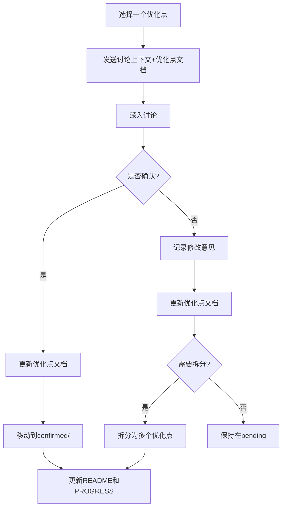
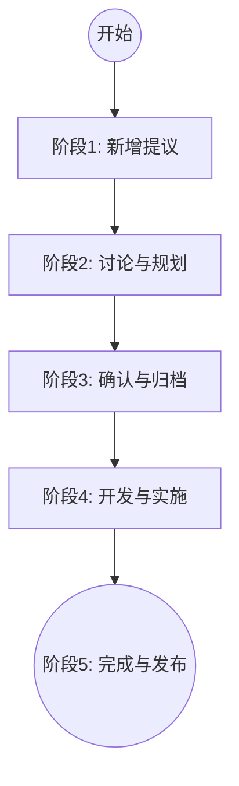

- **当前稳定版本**: V2.3
- **规划版本**: V3.0
- **规划状态**: P0 核心已完成，进入 P1/P2 规划与实施
- **最后更新**: 2026-04-06

### V3.0 定位

**核心使命**: 将框架从"文档生成工具"升级为"战略式编程强制执行系统"

**理论基础**:

1. 《AI 编程的现状.md》- Vibe Coding 的问题诊断
2. 《软件设计哲学》- 战术式 vs 战略式编程
3. V2.3 实践经验总结

---

## 🎯 优化点来源与分类

### 来源文档

1. **《AI 编程的现状.md》**

   - 方法 1: 对抗式编程（AI 照镜子）
   - 方法 2: 自动化代码审查
   - 方法 3: AI 作为思考工具
   - 关键洞察: "人类危险指令是最大风险源"

2. **《AI_PROGRAMMING_ANALYSIS.md》**

   - 提出 V3.0 演进方案
   - P0: AI 互审、设计思维引导、Commit 驱动更新
   - P1: ADR 系统、复杂度仪表盘、自动审查报告
   - P2: 架构演进可视化、CI/CD 集成、IDE 插件

3. **《AI_PROGRAMMING_ANALYSIS_REVIEW.md》**
   - 补充创新方向
   - 学习曲线追踪系统
   - AI 能力分级使用
   - 文档自动修复
   - 跨项目知识复用

### 当前 17 个优化点

| #   | 名称                      | 优先级 | 来源                                | 状态   |
| --- | ------------------------- | ------ | ----------------------------------- | ------ |
| 001 | AI 角色库                 | P0     | 用户洞察 + 专业化分工需求           | 已完成 |
| 003 | 设计思维引导              | P0     | ANALYSIS §3.3.1 + 现状.md 方法 3    | 已完成 |
| 004 | ADR 系统                  | P1     | ANALYSIS §3.3.2                     | 已完成 |
| 005 | 复杂度仪表盘              | P1     | ANALYSIS §3.1.2                     | 已完成 |
| 006 | 自动审查报告              | P1     | ANALYSIS §3.2.1 + 现状.md 方法 2    | 已完成 |
| 007 | 学习曲线追踪              | P2     | REVIEW §3.2.1                       | 已归档 |
| 008 | AI 能力分级               | P2     | REVIEW §3.2.2                       | 已归档 |
| 010 | 跨项目知识复用            | P2     | REVIEW §3.2.4                       | 已确认 |
| 011 | 文档谬误修复工作流        | P1     | 用户洞察 + V2.3 扩展                | 已确认 |
| 012 | 强制文档摘要机制          | P0     | 用户洞察 + Token 优化需求           | 已完成 |
| 013 | AI 互审机制               | P0     | ANALYSIS §3.1.1                     | 已完成 |
| 014 | 文档阅读习惯引导机制      | P1     | 用户洞察 + Vibe Coding 分析         | 已确认 |
| 016 | 配置管理系统              | P0     | 基础设施需求                        | 已完成 |
| 017 | 实用脚本工具库            | P0     | 用户提议                            | 已完成 |
| 018 | Commit-Guided 文档更新    | P0     | 用户提议 + Git Commit as Prompt     | 已完成 |

**已归档的优化点**:

| #   | 名称                      | 优先级 | 来源                                | 状态   |
| --- | ------------------------- | ------ | ----------------------------------- | ------ |
| 002 | 危险指令拦截(含 Git 安全) | P0     | ANALYSIS §3.2.2 + 用户 Git 安全需求 | 已归档 |
| 015 | 质量保证体系              | P1     | 框架演进需求                        | 已归档（被 019 覆盖） |
| 009 | 文档自动修复              | P2     | REVIEW §3.2.3                       | 已归档（被 018+011 覆盖） |
| 007 | 学习曲线追踪              | P2     | REVIEW §3.2.1                       | 已归档 |
| 008 | AI 能力分级               | P2     | REVIEW §3.2.2                       | 已归档 |

---

## 📁 V3.0 目录结构

```
dev/V3.0/
├── README.md                    # 总索引（V3.0使命、优化方向、路线图）
├── PROGRESS.md                  # 进度跟踪（里程碑、统计）
├── DISCUSSION_CONTEXT.md        # 本文档（讨论上下文）
├── confirmed/                   # 已确认的优化点
│   ├── 001-ai-agent-library/    # AI 角色库 (已完成)
│   ├── 003-design-thinking-guide/ # 设计思维引导 (已完成)
│   ├── 004-adr-system.md/       # ADR 系统 (已完成)
│   ├── 005-complexity-dashboard.md/ # 复杂度仪表盘 (已完成)
│   ├── 006-auto-review-report.md/ # 自动审查报告 (已完成)
│   ├── 010-cross-project-knowledge/ # 跨项目知识复用 (已确认)
│   ├── 011-doc-error-fix-workflow/ # 文档谬误修复工作流 (已确认)
│   ├── 012-mandatory-doc-summary/ # 强制文档摘要 (已完成)
│   ├── 013-ai-mutual-review/    # AI 互审机制 (已完成)
│   ├── 014-doc-reading-habit-guide/ # 文档阅读习惯引导 (已确认)
│   ├── 016-unified-config-system/ # 配置管理系统 (已完成)
│   ├── 017-utility-script-library/ # 实用脚本工具库 (已完成)
│   └── 003-commit-guided-documentation/ # Commit 驱动更新 (已完成)
├── pending/                     # 待讨论的优化点
└── archived/                    # 已归档的优化点
    ├── 002-dangerous-command-guard.md
    ├── 007-learning-curve-tracking.md
    ├── 008-ai-capability-tiering.md
    ├── 009-doc-auto-repair.md
    └── 015-quality-assurance-system.md
```

---

## 🔄 工作流程说明

### 当前阶段: 规划与讨论

**目标**: 将 pending/中的所有优化点逐一讨论并确认

**迭代式开发模式 (Iterative Workflow)**:

> 🚀 **确认即开发**: 不需要等待所有优化点都确认。任何一个优化点一旦进入 `confirmed` 状态，即可立即开始实施。实施过程中的发现应实时反馈修改后续计划。

**单个优化点的讨论流程**:



### 状态流转规则

1.  **并行执行**: 讨论(Planning)和开发(Execution)可以并行。
    - 例如：`011` 正在讨论中，同时可以开发已确认的 P1 功能。
2.  **动态调整**: 后续优化点的设计应基于前序优化点的实施结果进行调整。
3.  **双脚本模式要求**: 所有工具脚本必须同时提供 Python 和 Node.js 两个版本，以最大化环境兼容性。
    - 双模实现: 同时提供 Python (`tools/py/`) 和 Node.js (`tools/js/`) 版本
    - 零依赖: 仅使用标准库，严禁引入需要 `pip install` or `npm install` 的第三方依赖
    - 详细注释: 所有脚本必须在文件顶部添加详细文档注释

---

## 📝 优化点全生命周期 management 流程

为了确保 V3.0 开发的有序进行，所有优化点需遵循以下生命周期：



### 阶段 1-5: 核心流程说明 (同前)
... [此处保持原有的流程描述文字不变] ...

---

**文档版本**: v1.1
**最后更新**: 2026-04-06
**维护者**: Framework Team
