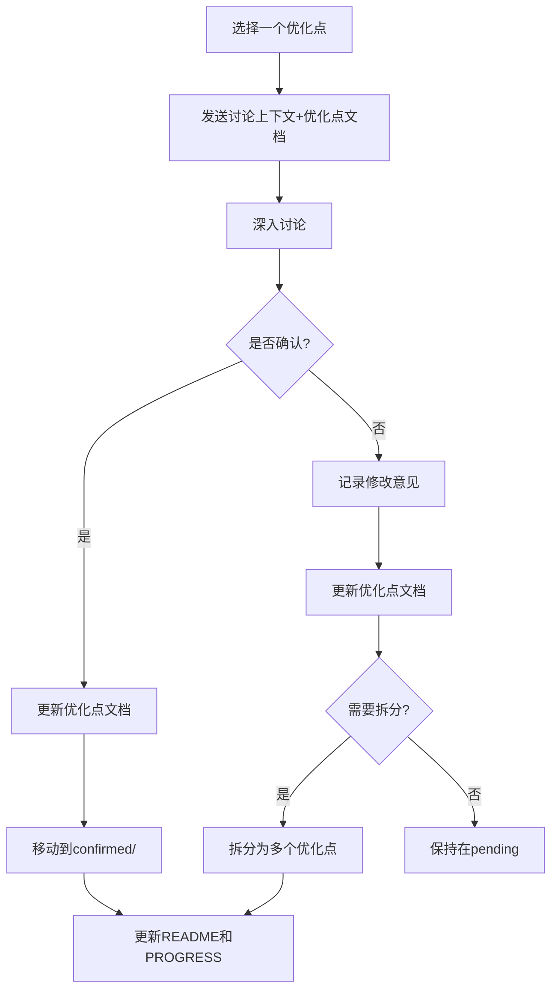
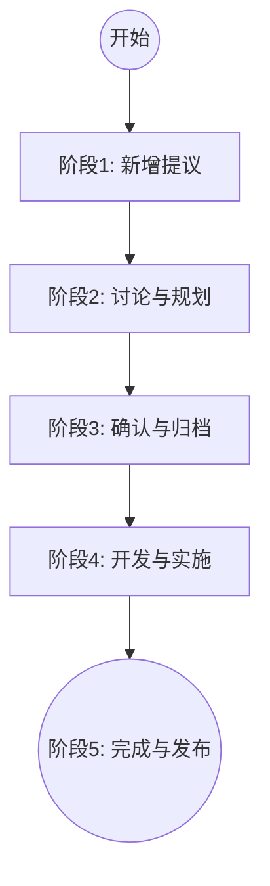

- **当前稳定版本**: V2.3
- **规划版本**: V3.0
- **规划状态**: 需求确认阶段

### V3.0 定位

**核心使命**: 将框架从"文档生成工具"升级为"战略式编程强制执行系统"

**理论基础**:

1. 《AI 编程的现状.md》- Vibe Coding 的问题诊断
2. 《软件设计哲学》- 战术式 vs 战略式编程
3. V2.3 实践经验总结

---

## 🎯 优化点来源与分类

### 来源文档

1. **《AI 编程的现状.md》**

   - 方法 1: 对抗式编程（AI 照镜子）
   - 方法 2: 自动化代码审查
   - 方法 3: AI 作为思考工具
   - 关键洞察: "人类危险指令是最大风险源"

2. **《AI_PROGRAMMING_ANALYSIS.md》**

   - 提出 V3.0 演进方案
   - P0: AI 互审、危险指令拦截、设计思维引导
   - P1: ADR 系统、复杂度仪表盘、自动审查报告
   - P2: 架构演进可视化、CI/CD 集成、IDE 插件

3. **《AI_PROGRAMMING_ANALYSIS_REVIEW.md》**
   - 补充创新方向
   - 学习曲线追踪系统
   - AI 能力分级使用
   - 文档自动修复
   - 跨项目知识复用

### 当前 17 个优化点

| #   | 名称                 | 优先级 | 来源                             | 状态   |
| --- | -------------------- | ------ | -------------------------------- | ------ |
| 001 | AI 角色库            | P0     | 用户洞察 + 专业化分工需求        | 已完成 |
| 002 | 危险指令拦截         | P0     | ANALYSIS §3.2.2 + 现状.md        | 待讨论 |
| 003 | 设计思维引导         | P0     | ANALYSIS §3.3.1 + 现状.md 方法 3 | 待讨论 |
| 004 | ADR 系统             | P1     | ANALYSIS §3.3.2                  | 待讨论 |
| 005 | 复杂度仪表盘         | P1     | ANALYSIS §3.1.2                  | 待讨论 |
| 006 | 自动审查报告         | P1     | ANALYSIS §3.2.1 + 现状.md 方法 2 | 待讨论 |
| 007 | 学习曲线追踪         | P2     | REVIEW §3.2.1                    | 待讨论 |
| 008 | AI 能力分级          | P2     | REVIEW §3.2.2                    | 待讨论 |
| 009 | 文档自动修复         | P2     | REVIEW §3.2.3                    | 待讨论 |
| 010 | 跨项目知识复用       | P2     | REVIEW §3.2.4                    | 待讨论 |
| 011 | 文档谬误修复工作流   | P1     | 用户洞察 + V2.3 扩展             | 待讨论 |
| 012 | 强制文档摘要机制     | P0     | 用户洞察 + Token 优化需求        | 待讨论 |
| 013 | AI 互审机制          | P0     | ANALYSIS §3.1.1                  | 待讨论 |
| 014 | 文档阅读习惯引导机制 | P1     | 用户洞察 + Vibe Coding 分析      | 待讨论 |
| 015 | 质量保证体系         | P1     | 框架演进需求                     | 待讨论 |
| 016 | 配置管理系统         | P1     | 基础设施需求                     | 待讨论 |
| 017 | 实用脚本工具库       | P1     | 用户提议                         | 待讨论 |

---

## 📁 V3.0 目录结构

```
dev/V3.0/
├── README.md                    # 总索引（V3.0使命、优化方向、路线图）
├── PROGRESS.md                  # 进度跟踪（里程碑、统计）
├── DISCUSSION_CONTEXT.md        # 本文档（讨论上下文）
├── confirmed/                   # 已确认的优化点
│   └── 001-ai-agent-library/    # AI 角色库 (已完成)
└── pending/                     # 待讨论的优化点
    ├── 002-dangerous-command-guard.md
    ├── 003-design-thinking-guide.md
    ├── 004-adr-system.md
    ├── 005-complexity-dashboard.md
    ├── 006-auto-review-report.md
    ├── 007-learning-curve-tracking.md
    ├── 008-ai-capability-tiering.md
    ├── 009-doc-auto-repair.md
    ├── 010-cross-project-knowledge.md
    ├── 011-doc-error-fix-workflow.md
    ├── 012-mandatory-doc-summary.md
    ├── 013-ai-mutual-review.md
    ├── 014-doc-reading-habit-guide.md
    ├── 015-quality-assurance-system.md
    ├── 016-config-management-system.md
    └── 017-utility-script-library.md
```

---

## 🔄 工作流程说明

### 当前阶段: 规划与讨论

**目标**: 将 pending/中的所有优化点逐一讨论并确认

**迭代式开发模式 (Iterative Workflow)**:

> 🚀 **确认即开发**: 不需要等待所有优化点都确认。任何一个优化点一旦进入 `confirmed` 状态，即可立即开始实施。实施过程中的发现应实时反馈修改后续计划。

**单个优化点的讨论流程**:



### 状态流转规则

1.  **并行执行**: 讨论(Planning)和开发(Execution)可以并行。
    - 例如：`001` 正在开发中，同时可以讨论 `013`。
2.  **动态调整**: 后续优化点的设计应基于前序优化点的实施结果进行调整。
    - 例如：`001` 实施中发现 Token 消耗过大，则需修改 `012` (强制摘要) 的设计。

---

## 📝 优化点全生命周期管理流程

为了确保 V3.0 开发的有序进行，所有优化点需遵循以下生命周期：



### 阶段 1: 新增提议 (Proposal)

当发现新的优化需求时：

1.  **创建文档**: 在 `dev/V3.0/pending/` 下创建 `XXX-name.md` (XXX 从 017 开始递增)。
2.  **更新索引**: 在 `dev/V3.0/README.md` 的 "待讨论" 列表中添加条目。
3.  **更新进度**: 在 `dev/V3.0/PROGRESS.md` 中添加新行并更新统计数据。

### 阶段 2: 讨论与规划 (Discussion)

见上文 "单个优化点的讨论流程"。重点评估价值、成本和技术可行性。

### 阶段 3: 确认与归档 (Confirmation)

当优化点方案确定后：

1.  **状态更新**: 将文档内状态改为 `🟢 已确认`。
2.  **文件移动**: 将文件从 `pending/` 移动到 `confirmed/XXX-name/` (建议为每个确认的点创建子目录，便于存放相关附件)。
3.  **索引更新**:
    - `dev/V3.0/README.md`: 移动到 "已确认的优化点" 章节。
    - `dev/V3.0/PROGRESS.md`: 更新状态为 "已确认"。

### 阶段 4: 开发与实施 (Implementation)

开发过程中：

1.  **实施方案**: 在 `confirmed/XXX-name/` 下创建 `implementation.md`。
2.  **代码实现**: 进行具体的代码编写和测试。
3.  **进度同步**: 定期更新 `dev/V3.0/PROGRESS.md` 中的完成度。

### 阶段 5: 完成与发布 (Completion)

开发完成并验收通过后，需要同步更新以下文档：

1.  **自身状态**:

    - `dev/V3.0/confirmed/XXX-name/XXX-name.md`: 状态改为 `🟢 已完成`。
    - `dev/V3.0/PROGRESS.md`: 状态改为 `🟢 已完成`，进度 100%。

2.  **框架核心文档** (视具体功能而定):

    - `AI_ENTRY_POINT.md`: 如果涉及核心工作流变更。
    - `AI_Coding_Context.md`: 如果引入了新概念或工具。
    - `AI_RULES.md`: 如果引入了新规则。
    - `workflows/`: 如果新增或修改了工作流。

3.  **发布记录**:
    - `dev/V3.0/README.md`: 更新整体完成度。

---

## 📝 添加新优化点的详细操作指引

### 步骤 1: 创建优化点文档

**位置**: `dev/V3.0/pending/XXX-{name}.md`

**命名规范**:

- 序号: 从 011 开始递增
- 名称: 简短英文名（小写+连字符）
- 示例: `011-context-auto-refresh.md`

**文档模板**:

```markdown
# XXX - 优化点名称

**优先级**: P0/P1/P2  
**状态**: 🟡 待讨论  
**预估工作量**: X 天/周  
**来源**: [具体来源]

---

## 📋 问题描述

### 核心痛点

[描述当前存在的问题]

### V2.3 现状

[框架当前状态]

---

## 💡 解决方案

### 方案设计

[具体技术方案]

### 实现方式

[代码示例/流程图]

---

## 📊 价值评估

[预期效果]

---

## ⚠️ 风险与疑问

1. ❓ [需要讨论的问题 1]
2. ❓ [需要讨论的问题 2]

---

**创建日期**: YYYY-MM-DD  
**讨论进度**: 0%
```

### 步骤 2: 更新 README.md

在待讨论的优化点列表中添加新条目：

```markdown
#### XX. 优化点名称

- **文件**: [XXX-name.md](./pending/XXX-name.md)
- **描述**: 简要说明
- **价值**: 核心价值
- **工作量**: 预估
```

### 步骤 3: 更新 PROGRESS.md

```markdown
### pending/ 目录 (XX 个)

| #   | 优化点   | 状态      | 讨论进度 | 预估工作量 |
| --- | -------- | --------- | -------- | ---------- |
| ... | ...      | ...       | ...      | ...        |
| XXX | 新优化点 | 🟡 待讨论 | 0%       | X 天       |
```

同时更新统计：

```markdown
总优化点: XX 个（+1）
```

---

## ✅ 优化点确认后的流程

### 步骤 1: 更新优化点文档

修改状态：

```markdown
**状态**: 🟢 已确认  
**讨论进度**: 100%  
**确认日期**: YYYY-MM-DD
```

可选添加：

```markdown
## 📝 讨论记录

**讨论日期**: YYYY-MM-DD
**关键决策**:

1. [决策 1]
2. [决策 2]

**修改点**:

- [修改 1]
- [修改 2]
```

### 步骤 2: 移动文件

```bash
# 从pending移动到confirmed
move dev/V3.0/pending/XXX-name.md dev/V3.0/confirmed/
```

### 步骤 3: 更新 README.md

**从"待讨论的优化点"部分移除**，**添加到"已确认的优化点"部分**：

```markdown
## 📁 已确认的优化点 (confirmed/)

### PX - 分类名称

#### XX. 优化点名称

- **文件**: [XXX-name.md](./confirmed/XXX-name.md)
- **描述**: 简要说明
- **确认日期**: YYYY-MM-DD
- **实施优先级**: PX
```

### 步骤 4: 更新 PROGRESS.md

**更新统计**:

```markdown
总优化点: XX 个
├── 已确认 (confirmed/): X 个 (+1)
├── 待讨论 (pending/): X 个 (-1)
```

**更新详细进度表**:

```markdown
### confirmed/ 目录 (X 个)

| #   | 优化点     | 确认日期   | 实施优先级 | 预估工作量 |
| --- | ---------- | ---------- | ---------- | ---------- |
| XXX | 优化点名称 | YYYY-MM-DD | PX         | X 天       |
```

**更新里程碑进度**:

```markdown
### 里程碑 1: 需求确认（当前）

**进度**: X / XX (XX%)

**任务**:

- [x] 讨论 XXX-name.md ✅ YYYY-MM-DD
```

### 步骤 5: 可选-创建讨论记录

如果讨论过程有价值，可在`dev/V3.0/discussions/`目录下创建记录：

```markdown
# XXX-name 讨论记录

**日期**: YYYY-MM-DD
**参与者**: [名单]
**文档**: [XXX-name.md](../confirmed/XXX-name.md)

## 讨论要点

### 初始方案

[...]

### 讨论过程

[...]

### 最终决策

[...]

### 遗留问题

[...]
```

---

## 🔗 需要同步更新的文档

### 添加新优化点时

1. ✅ **必须更新**:

   - `dev/V3.0/pending/XXX-name.md` (创建)
   - `dev/V3.0/README.md` (添加索引)
   - `dev/V3.0/PROGRESS.md` (更新统计和进度表)

2. ⚪ **无需更新**:
   - confirmed/ 目录下的文档
   - 框架其他文档（V3.0 确认后才更新）

### confirmed 后

1. ✅ **必须更新**:

   - 优化点文档本身 (更新状态)
   - `dev/V3.0/README.md` (移动索引)
   - `dev/V3.0/PROGRESS.md` (更新统计和里程碑)

2. ⚪ **无需更新**:
   - 框架其他文档（等所有优化点 confirmed 后统一更新）

### 所有优化点 confirmed 后（进入实施阶段）

进入实施阶段后，重点转向代码开发和框架文档更新。

**开发完成后必须检查的文档清单**:

1.  **核心入口**: `AI_ENTRY_POINT.md` (是否需要注册新功能？)
2.  **上下文**: `AI_Coding_Context.md` (AI 是否需要知道这个新能力？)
3.  **规则**: `AI_RULES.md` (是否有新的约束？)
4.  **用户指南**: `INTRODUCTION.md` (用户是否需要知道这个新功能？)

---

## 💡 讨论建议

### 讨论重点

1. **问题定义是否准确**

   - 是否真实存在？
   - 是否足够重要？
   - V2.3 是否已解决？

2. **解决方案是否可行**

   - 技术可行性
   - 实施复杂度
   - Token 成本
   - 与现有机制的集成

3. **价值评估是否合理**

   - 预期效果是否可达成
   - ROI 是否足够
   - 是否有副作用

4. **优先级是否合适**

   - P0: 必须实现
   - P1: 高价值
   - P2: 锦上添花

5. **是否需要拆分/合并**
   - 单个优化点是否过大
   - 多个优化点是否重复

### 常见疑问类型

1. **技术疑问**

   - 如何实现？
   - 依赖什么技术？
   - 兼容性如何？

2. **设计疑问**

   - 方案 A vs 方案 B？
   - 哪种更适合？
   - 如何扩展？

3. **实施疑问**

   - 工作量是否合理？
   - 是否需要分阶段？
   - 向后兼容吗？

4. **价值疑问**
   - ROI 如何计算？
   - 是否过度设计？
   - 用例是什么？

---

## 📚 相关文档快速链接

### 源文档

- [AI 编程的现状.md](../../dev/reference/AI编程的现状.md)
- [AI_PROGRAMMING_ANALYSIS.md](../../dev/reference/AI_PROGRAMMING_ANALYSIS.md)
- [AI_PROGRAMMING_ANALYSIS_REVIEW.md](../../dev/reference/AI_PROGRAMMING_ANALYSIS_REVIEW.md)

### V3.0 文档

- [V3.0 README](./README.md)
- [V3.0 PROGRESS](./PROGRESS.md)
- [pending/ 目录](./pending/)
- [confirmed/ 目录](./confirmed/)

### 框架文档

- [AI_ENTRY_POINT.md](../../AI_ENTRY_POINT.md)
- [INTRODUCTION.md](../../INTRODUCTION.md)
- [V2.3 实现](../../dev/V2.3/)

---

## 🎬 最佳实践：如何开始讨论

### 1. 推荐姿势：新开会话 (New Session)

为了避免上下文干扰，**强烈建议**为每个优化点的讨论开启一个新的 AI 会话。

### 2. 必备上下文 (Context Loading)

在新会话中，请务必携带以下文件作为上下文（通过 `@文件名` 或粘贴内容）：

1.  **规则与背景 (必须)**:

    - `dev/V3.0/DISCUSSION_CONTEXT.md`
    - _作用: 让 AI 知道当前的开发阶段、讨论流程和输出规范。_

2.  **讨论对象 (必须)**:

    - `dev/V3.0/pending/XXX-name.md` (你想要讨论的那个文件)
    - _作用: 提供具体的讨论靶子。_

3.  **全局索引 (可选)**:

    - `dev/V3.0/README.md`
    - _作用: 如果需要确认与其他优化点的依赖关系时携带。_

4.  **全项目上下文 (推荐)**:
    - `dev/FRAMEWORK_CONTEXT.md`
    - _作用: 包含 V2.3 核心架构、设计理念和目录结构。对于涉及核心机制修改的优化点（如配置系统、核心工作流），强烈建议携带。_

### 3. 启动 Prompt 示例

```text
@dev/V3.0/DISCUSSION_CONTEXT.md
@dev/FRAMEWORK_CONTEXT.md (可选，但推荐)
@dev/V3.0/pending/001-ai-mutual-review.md (替换为你关注的文件)

你好，我准备开始讨论 "001-AI互审机制" 这个优化点。
请根据 DISCUSSION_CONTEXT.md 中的流程，先帮我分析一下当前文档的问题定义和解决方案是否完善。
```

---

**文档版本**: v1.0  
**最后更新**: 2025-11-29  
**维护者**: Framework Team
