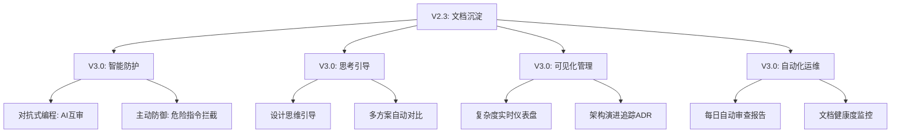

# V3.0 版本规划：战略式编程增强

**版本号**: V3.0  
**规划日期**: 2025-11-29  
**当前框架版本**: V2.3  
**理论基础**: 《AI 编程的现状.md》+ 《软件设计哲学》  
**状态**: 🟢 开发中 (In Development)

---

## 📋 背景与动机

### 核心问题

Vibe Coding（AI 快速编程）本质上是一种**向大模型借的技术债**：

> 在一开始进度会很快，但是越到后面越力不从心。如果最终不花费大量时间去重构清理，整个系统会因为累积的复杂性沦为难以维护的"屎山"。

### 三种复杂性症状

1. **变更放大** (Change Amplification)  
   简单的变更需要在多个不同层级的地方修改

2. **认知负荷** (Cognitive Load)  
   开发者需要花费更多的时间掌握正确的上下文信息

3. **未知的未知** (Unknown Unknowns)  
   新 session 不知道某些"雷区"，直到触发错误

### 根本原因

> 生成式 AI 编程最大的优势是过程压缩。然而在过程压缩的前提下，软件系统本身的复杂性并没有降低，甚至在同样的时间里 AI 编程带来的复杂性远远超过人类编程——因为人类思考、决策、敲代码的速度远比不过代码生成的速度。

### V2.3 的应对

当前框架 V2.3 已经在以下方面提供了解决方案：

- ✅ 分层文档体系（解决变更放大）
- ✅ 单一入口设计（降低认知负荷）
- ✅ AI 编码禁忌（减少未知的未知）
- ✅ 进度记录机制（知识沉淀）
- ✅ 更新触发机制（持续维护）

**但这还不够。**

---

## 🎯 V3.0 的使命

### 核心定位

将框架从**"文档生成工具"**升级为**"战略式编程强制执行系统"**

### 战略式 vs 战术式编程

| 维度       | 战术式编程         | 战略式编程         | V2.3 支持 | V3.0 目标  |
| ---------- | ------------------ | ------------------ | --------- | ---------- |
| 目标       | 能跑就行，越快越好 | 卓越设计，长期回报 | ⭐⭐⭐    | ⭐⭐⭐⭐⭐ |
| 时间分配   | 100%编码           | 80%编码 + 20%设计  | ⭐⭐⭐    | ⭐⭐⭐⭐⭐ |
| 复杂性管理 | 被动应对           | 主动预防           | ⭐⭐⭐⭐  | ⭐⭐⭐⭐⭐ |
| AI 角色    | 代码生成器         | 思考伙伴           | ⭐⭐⭐    | ⭐⭐⭐⭐⭐ |
| 质量保证   | 事后发现           | 事前预防           | ⭐⭐⭐    | ⭐⭐⭐⭐⭐ |

### 核心能力升级

---

## 🗺️ 优化方向

### 方向 1: 对抗式编程（AI 照镜子）

**原文方法**:

> 把一个独立的第三方带入到 1V1 的 AI 编程流程中去，时刻地去监管和反馈。这个第三方一般来说要么是一个资深的开发者，要么是另一个同样智能等级的生成式 AI。

**V3.0 实现**:

- AI 互审机制（生成者 vs 审查者）
- 自动化双重检查
- 问题发现率提升 30-50%

### 方向 2: 主动防御（人类危险指令防护）

**原文洞察**:

> 人类自身发出的危险指令才是整个开发过程中最容易让 AI 越界的元凶（比如不管三七二十一让 AI 去实现一个功能或者修复某个错误）。

**V3.0 原计划实现**:

- 危险指令模式识别
- 实时拦截与建议
- 强制遵守框架规范

**当前状态**: 该功能(002-危险指令拦截)已被移至 archived/目录，暂时不实现

### 方向 3: 思考工具（设计优先）

**原文方法**:

> 不要仅仅把 AI 当作生产工具，而是要把它当作思考工具，来持续降低开发者对当前任务和整个体系的理解门槛。

**V3.0 实现**:

- 5 Why 分析法
- 多方案自动对比
- 边界定义助手
- 成功标准量化

### 方向 4: 复杂度可视化

**V3.0 实现**:

- 实时复杂度仪表盘
- 代码增长率监控
- 依赖关系可视化
- 技术债热力图

### 方向 5: 架构演进追踪

**V3.0 实现**:

- ADR 架构决策记录
- 演进历史时间线
- 决策影响分析
- 复盘与学习

### 方向 6: 自动化审查

**原文方法**:

> 自动化局部 vs 全局的代码审查，比如一天一次。这能最大程度上在早期就发现每次增量修改产生的代码冗余和依赖叠加。

**V3.0 实现**:

- 每日自动生成审查报告
- 精准识别风险
- 明确优先级
- CI/CD 深度集成

---

## 📊 优化点总览

> ℹ️ **流程说明**: 关于如何新增、讨论和确认优化点，以及开发完成后的文档更新规范，请详细阅读 [DISCUSSION_CONTEXT.md](./DISCUSSION_CONTEXT.md#📝-优化点全生命周期管理流程)。

### 统计

- **总计**: 17 个
- **已确认** (confirmed/): 7 个
- **已完成**: 7 个 (001, 003, 012, 013, 016, 017, 018)
- **待讨论** (pending/): 10 个
- **已归档** (archived/): 1 个 (002)

### 优先级分布

- **P0** (必须实现): 5 个 (含 018，全部已完成)
- **P1** (高价值): 8 个
- **P2** (增强功能): 4 个

---

## 📁 已确认的优化点 (confirmed/)

### P0 - 基础设施

#### 1. AI 角色库 ⭐ [001]

- **文件**: [001-ai-agent-library.md](./confirmed/001-ai-agent-library/001-ai-agent-library.md)
- **描述**: 标准化的专业 AI 角色定义库，支持框架运行时和用户开发时双重用途
- **价值**: 降低 Prompt 编写门槛 90%，提升输出质量稳定性 29%
- **确认日期**: 2025-11-29
- **状态**: ✅ 已完成
- **产物**: `/agents` 目录

#### 16. 配置管理系统 ⭐ [016]

- **文件**: [016-unified-config-system.md](./confirmed/016-unified-config-system/016-unified-config-system.md)
- **描述**: 统一的配置管理系统，支持用户偏好持久化、团队配置、V3.0 功能开关
- **价值**: 消除重复询问，支持多个优化点的配置需求，为 V3.0 铺路
- **确认日期**: 2025-12-01
- **完成日期**: 2025-12-02
- **状态**: ✅ 已完成
- **产物**: `/config` 目录 (README.md, CONFIG_TEMPLATE.md, MIGRATION_GUIDE.md, .gitignore)

#### 17. 实用脚本工具库 ⭐ [017]

- **文件**: [017-utility-script-library.md](./confirmed/017-utility-script-library/017-utility-script-library.md)
- **描述**: 提供跨平台的 Python/Node 脚本（如结构扫描、代码统计），供 AI 运行时调用
- **价值**: 消除命令幻觉，提升分析准确性和效率
- **确认日期**: 2025-12-01
- **状态**: ✅ 已完成
- **产物**: `/tools` 目录 (py/, js/, fallback/, README.md)

### P0 - 核心防护

#### 2. AI 互审机制 (工作流编排器) [013]

- **文件**: [013-ai-mutual-review.md](./confirmed/013-ai-mutual-review/013-ai-mutual-review.md)
- **描述**: 引入分级审查机制（参考 Claude Code），实现对抗式编程
- **价值**: 消除单一 AI 盲点，问题发现率提升 30-50%
- **确认日期**: 2025-12-02
- **完成日期**: 2025-12-02
- **状态**: ✅ 已完成
- **产物**: `/confirmed/013-ai-mutual-review/` 目录, `workflows/review_standards/`, `workflows/013-review-workflow.md`

#### 3. Commit-Guided Documentation ⭐ [018] 🆕

- **文件**: [018-commit-guided-documentation.md](./confirmed/018-commit-guided-documentation/018-commit-guided-documentation.md)
- **描述**: 基于结构化 Commit 信息的自动化文档更新系统,整合 Git 安全规范
- **价值**: 节省 80%解释工作,95%主分支污染风险降低,形成"设计 → 实施 → 验证"完整闭环
- **确认日期**: 2025-12-11
- **完成日期**: 2025-12-18
- **状态**: ✅ 已完成
- **产物**: tools/目录下的 commit 相关工具, agents/runtime/commit_analyst.md, workflows/commit_guided_update.md 和 git_safety_workflow.md
- **依赖**: 001 (AI 角色库) - 需要 `commit_analyst` 角色

### P0 - 智能引导

#### 4. 设计思维引导模式 [003]

- **文件**: [003-design-thinking-guide.md](./confirmed/003-design-thinking-guide/003-design-thinking-guide.md)
- **描述**: AI 作为思考伙伴，引导深度设计讨论(5 Why 分析、多方案对比、风险评估)
- **价值**: 将 AI 从"代码生成器"转变为"架构思考伙伴"，返工率降低 50%
- **确认日期**: 2025-12-02
- **完成日期**: 2025-12-03
- **状态**: ✅ 已完成
- **产物**: `/confirmed/003-design-thinking-guide/` 目录, 新增角色(`design_facilitator`, `product_manager`), 5 个 Prompt 模板, 框架集成

#### 5. 强制文档摘要机制 ⭐ [012]

- **文件**: [012-mandatory-doc-summary.md](./confirmed/012-mandatory-doc-summary/012-mandatory-doc-summary.md)
- **描述**: 所有文档强制包含标准化摘要，支持智能文档推荐
- **价值**: 节省 30-50% Token，降低认知负荷 62%
- **确认日期**: 2025-12-03
- **完成日期**: 2025-12-03
- **状态**: ✅ 已完成
- **产物**: `/confirmed/012-mandatory-doc-summary/` 目录, `tools/py/summary_*.py`, `tools/js/summary_*.js`
- **依赖**: 001 (AI 角色库) - 需要 `summary_generator` 角色

### P1 - 高价值功能

**注**: 016-配置管理系统已升级为 P0 基础设施并完成实施,见上方"P0 - 基础设施"部分

---

## 📁 待讨论的优化点 (pending/)

### P0 - 核心功能（必须实现）

#### 1. AI 角色库 ⭐ (基础设施) [001]

- **文件**: [001-ai-agent-library.md](./confirmed/001-ai-agent-library/001-ai-agent-library.md)
- **描述**: 标准化的专业 AI 角色定义库，支持框架运行时和用户开发时双重用途
- **价值**: 降低 Prompt 编写门槛 90%，提升输出质量稳定性 29%
- **工作量**: 约 8-12 天
- **被依赖**: 013, 011, 012 优化点都需要角色库支持
- **实施顺序**: 最优先实现

### P1 - 高价值功能

#### 4. ADR 架构决策记录系统

- **文件**: [004-adr-system.md](./pending/004-adr-system.md)
- **描述**: 标准化架构决策记录，追踪演进历史
- **价值**: 解决"未知的未知"，支持架构复盘
- **工作量**: 约 5 天

#### 5. 复杂度实时仪表盘

- **文件**: [005-complexity-dashboard.md](./pending/005-complexity-dashboard.md)
- **描述**: 可视化项目复杂度，实时监控技术债
- **价值**: 数据驱动决策，早期发现问题
- **工作量**: 约 1 周

#### 6. 自动化审查报告

- **文件**: [006-auto-review-report.md](./pending/006-auto-review-report.md)
- **描述**: 每日自动生成代码审查报告
- **价值**: 解放人力，提升审查频率
- **工作量**: 约 3 天

### P2 - 增强功能（锦上添花）

#### 7. 学习曲线追踪系统

- **文件**: [007-learning-curve-tracking.md](./pending/007-learning-curve-tracking.md)
- **描述**: 可视化新人学习进度，个性化学习路径
- **价值**: 加速新人上手
- **工作量**: 约 1 周

#### 8. AI 能力分级使用机制

- **文件**: [008-ai-capability-tiering.md](./pending/008-ai-capability-tiering.md)
- **描述**: 根据任务复杂度选择不同级别 AI 模型
- **价值**: 成本优化 30-50%
- **工作量**: 约 5 天

#### 9. 文档自动修复系统

- **文件**: [009-doc-auto-repair.md](./pending/009-doc-auto-repair.md)
- **描述**: 代码变更后自动生成文档 patch
- **价值**: 减少 90%文档同步工作量
- **工作量**: 约 1 周

#### 10. 跨项目知识复用

- **文件**: [010-cross-project-knowledge.md](./pending/010-cross-project-knowledge.md)
- **描述**: 企业级知识库联邦机制
- **价值**: 避免重复造轮子
- **工作量**: 约 1 周

#### 11. 文档谬误修复工作流

- **文件**: [011-doc-error-fix-workflow.md](./pending/011-doc-error-fix-workflow.md)
- **描述**: AI 辅助的文档错误修复机制，支持关联文档自动检测和批量修复
- **价值**: 防止错误传播，提升修复效率 75%，减少遗漏风险 83%
- **工作量**: 约 5-7 天
- **依赖**: 001 (AI 角色库) - 需要 `doc_fixer` 角色

#### 12. AI 角色库 (已移至 P0 - 001)

- **文件**: [001-ai-agent-library.md](./confirmed/001-ai-agent-library/001-ai-agent-library.md)
- **描述**: 标准化的专业 AI 角色定义库，支持框架运行时和用户开发时双重用途
- **价值**: 降低 Prompt 编写门槛 90%，提升输出质量稳定性 29%，知识复用
- **工作量**: 约 8-12 天

#### 13. 文档阅读习惯引导机制

- **文件**: [014-doc-reading-habit-guide.md](./pending/014-doc-reading-habit-guide.md)
- **描述**: 系统化引导用户主动阅读文档，对抗 Vibe Coding 的"速度 > 理解"陷阱
- **价值**: 文档阅读率提升 200%，返工率降低 60%，深度理解提升 100%
- **工作量**: 约 3-5 天

#### 15. 质量保证体系

- **文件**: [015-quality-assurance-system.md](./pending/015-quality-assurance-system.md)
- **描述**: 建立系统化的文档质量保证体系，包括质量标准、审查工作流、上下文管理
- **价值**: 审查效率提升 83%，质量评分提升 29%，支持 V3.0 持续演进
- **工作量**: 约 5-7 天
- **状态**: 🟢 已确认，基础设施已完成

#### 16. 配置管理系统 ⭐ (基础设施)

- **文件**: [016-config-management-system.md](./pending/016-config-management-system.md)
- **描述**: 统一的配置管理系统，支持用户偏好持久化、团队配置、V3.0 功能开关
- **价值**: 消除重复询问，支持多个优化点的配置需求，为 V3.0 铺路
- **工作量**: 约 3 天
- **依赖**: 无（基础设施）
- **被依赖**: 013、003、004、008、001 等多个优化点

#### 18. Commit-Guided Documentation (基于 Commit 的文档更新) ⭐ 🆕

- **文件**: [018-commit-guided-documentation.md](./pending/018-commit-guided-documentation.md)
- **描述**: 利用 Git Commit as Prompt 理念,通过 WHAT/WHY/HOW 结构化 commit 自动检测文档更新需求
- **价值**: 减少 80%解释工作,自动分析影响范围,形成 commit→ 文档 →ADR 知识闭环
- **工作量**: 约 5-7 天
- **依赖**: 001 (AI 角色库) - 需要 `commit_analyst` 角色
- **协同**: 与 003/012/013/004 形成完美协同

---

## 🛣️ 实施路线图

### 阶段 1: 规划与讨论（当前阶段）

**目标**: 所有优化点 confirmed

**时间**: 2025-11 ~ 2025-12

**里程碑**:

- [ ] 逐一讨论 pending 中的 10 个优化点
- [ ] 补充新发现的优化点
- [ ] 所有优化点 confirmed
- [ ] 制定详细实施计划

### 阶段 2: 迭代开发 (Iterative Development)

> 🚀 **执行策略**: 确认一个 -> 实施一个 -> 验收一个。无需等待所有规划完成。

#### 里程碑 1: 基础设施 (已完成)

- [x] **001-AI 角色库** (已完成)
  - 状态: ✅ 已部署到 `/agents`
  - 价值: 提供标准化角色支持
- [x] **016-配置管理系统** (已完成)
  - 状态: ✅ 已部署到 `/config`
  - 价值: 统一配置管理，支持 V3.0 所有功能开关
- [x] **017-实用脚本工具库** (已完成)
  - 状态: ✅ 已部署到 `/tools`
  - 价值: 消除命令幻觉，提升分析准确性

#### 里程碑 2: 核心防护 (计划中)

- [ ] **013-AI 互审机制** (依赖 001)

#### 里程碑 3: 智能引导 (计划中)

- [ ] **003-设计思维引导**
- [ ] **012-强制文档摘要**

### 阶段 3: P1 功能开发

**时间**: 预计 2026-02

**目标**:

- [ ] ADR 系统
- [ ] 复杂度仪表盘
- [ ] 自动审查报告

### 阶段 4: P2 功能开发

**时间**: 预计 2026-Q2

**目标**:

- [ ] 学习曲线追踪
- [ ] AI 能力分级
- [ ] 文档自动修复
- [ ] 跨项目知识复用

### 阶段 5: 发布与优化

**时间**: 2026-Q2

**目标**:

- [ ] 集成测试
- [ ] 文档更新
- [ ] 正式发布 V3.0
- [ ] 收集反馈
- [ ] 迭代优化

---

## 📈 预期成效

### 技术债管理

- 技术债累积速度降低 **50-70%**
- 复杂度可见化和量化
- 早期问题发现率提升 **30-50%**

### 开发效率

- 返工减少 **50%**
- Bug 率降低 **20-30%**
- AI 效率提升 **30-50%**

### 团队协作

- 新人上手时间: 1-2 周 → **半天**
- Code Review 时间减少 **30%**
- 架构决策透明化

### AI 能力提升

- AI 从"代码生成器"→"思考伙伴"

| 维度       | V2.3         | V3.0               |
| ---------- | ------------ | ------------------ |
| 核心定位   | 文档生成工具 | 战略式编程执行系统 |
| AI 角色    | 辅助工具     | 思考伙伴           |
| 防护机制   | 被动规范     | 主动拦截           |
| 质量保证   | 事后检查     | 事前预防           |
| 复杂度管理 | 文档记录     | 实时监控           |
| 架构决策   | 无系统化     | ADR 标准化         |

**为何跳跃到 V3.0？**

V3.0 代表架构和理念的重大升级：

- 从"工具"到"系统"
- 从"被动"到"主动"
- 从"记录"到"防护"

这不是小版本迭代，而是质的飞跃。

---

**文档版本**: v1.0  
**最后更新**: 2025-11-29  
**维护者**: Framework Team
