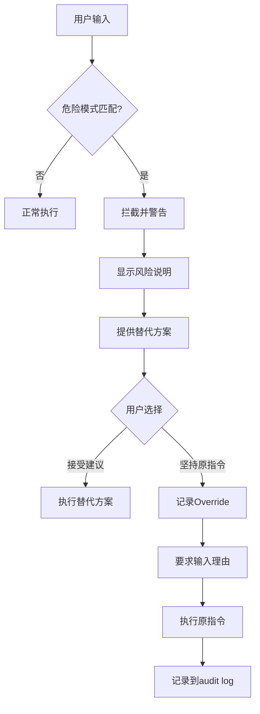
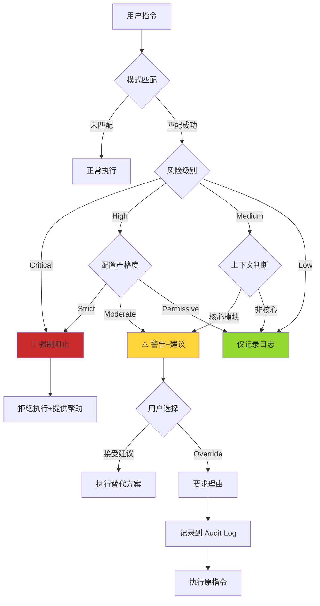
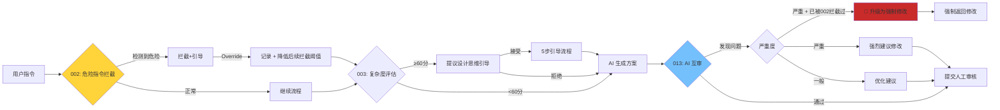

# 002 - 危险指令拦截系统 (含 Git 安全规范)

**优先级**: P0  
**状态**: 🟡 待讨论  
**预估工作量**: 2-3 周  
**来源**: 《AI 编程的现状.md》洞察 + 《AI_PROGRAMMING_ANALYSIS.md》 + 用户 Git 安全需求  
**依赖**: 001 (AI 角色库), 013 (AI 互审), 018 (Commit-Guided)

---

## 📋 问题描述

### 原文关键洞察

> "人类自身发出的危险指令才是整个开发过程中最容易让 AI 越界的元凶（比如不管三七二十一让 AI 去实现一个功能或者修复某个错误）。"

### 核心痛点

**典型危险指令**:

1. "不管三七二十一，实现这个功能"
2. "快速修复这个 bug，不用管其他"
3. "直接复制那段代码就行"
4. "不用写文档，先让功能跑起来"
5. "跳过方案，直接开始写代码"

**后果**:

- 绕过框架规范
- 积累技术债
- 引入复杂性
- 文档不同步

---

## 🔍 深度分析：遗漏点与优化方向

### 遗漏点分析

#### 1. 拦截时机的框架集成问题

**发现**: 当前设计未明确拦截发生在框架工作流的哪个阶段。

**分析**:

框架有两大使用阶段：

- **阶段 A**: 文档体系初始化（步骤 0-6）
- **阶段 B**: 日常开发使用（功能开发、Bug 修复）

危险指令可能出现在**任何阶段**：

- 阶段 A: "跳过方案，直接生成文档"
- 阶段 B: "不管三七二十一，快速实现"
- Git 操作: "直接 merge 到 main"

**需要明确**: 每个拦截点在工作流中的精确位置、触发条件和严格程度。

---

#### 2. 配置系统集成缺失

**发现**: V3.0 已有配置管理系统，但未说明 002 如何集成。

**问题**:

- 配置项 `dangerousCommandGuard` 的具体选项未定义
- 用户自定义危险模式的机制未说明
- 配置优先级（系统/团队/用户）未明确

**需要设计**: 完整的配置结构和加载逻辑。

---

#### 3. 与 AI 互审机制的协同策略

**发现**: 002（危险指令拦截）和 013（AI 互审）都是防御机制，但未明确协同逻辑。

**冲突场景**:

```
用户: "不管三七二十一，实现付费功能"
  ↓
002 拦截: "检测到跳过设计，建议生成方案"
  ↓ 用户 Override
AI 生成方案（仓促，质量低）
  ↓
013 互审: "发现方案缺乏深度思考，建议重新设计"
  ↓
再次拦截? 还是放行?
```

**需要明确**: 两道防线的协调策略和问题升级机制。

---

#### 4. 设计思维引导的触发冲突

**发现**: 003（设计思维引导）也会主动提议，可能与 002 产生重复干预。

**冲突场景**:

```
用户: "快速修复登录 bug"
  ↓ 同时触发
002: "检测到临时修复，建议评估长期影响"
003: "登录是核心模块，建议设计思维引导"
  ↓
用户收到两次提示？体验混乱
```

**需要设计**: 多重防御机制的优先级和融合策略。

---

#### 5. 跨会话学习能力缺失

**发现**: 当前设计仅记录 Override 到 Audit Log，但未说明如何跨会话学习。

**问题**:

- 如果用户经常 Override 某类模式 → 可能是误判或特殊需求
- 缺少 Override 频次统计
- 缺少自动调整机制

**需要设计**: 基于 Override 数据的模式库优化机制。

---

#### 6. Git 安全工具实现细节不足

**发现**: 文档提到 `tools/py/git_safety.py`，但未说明：

- **如何拦截**: AI 提议 Git 命令 vs 执行 Git 命令
- **拦截时机**: 提议前检查 vs 执行前检查
- **用户绕过**: 用户直接在终端执行危险命令无法拦截

**需要明确**: 拦截机制如何作用于 AI 建议的命令。

---

## 💡 解决方案

### 危险模式库设计

#### 设计原则

**A. 分层架构**

```yaml
# 三层模式库
1. 系统级模式 (System Patterns)
   - 框架内置，不可修改
   - 覆盖通用危险场景
   位置: 硬编码于框架逻辑中

2. 团队级模式 (Team Patterns)
   - 团队管理员配置
   - 覆盖项目特定风险
   位置: config/.system/team_patterns.yaml

3. 用户级模式 (User Patterns)
   - 个人自定义
   - 优先级最高，可覆盖系统模式
   位置: config/user_config.md 中的 custom_patterns
```

**B. 模式结构标准化**

```python
# 完整模式定义结构
{
    "id": "skip-design-001",  # 唯一标识符
    "pattern": r"不管.*实现",  # 正则表达式
    "risk": "high",  # critical/high/medium/low

    # 上下文感知（可选）
    "context_filter": {
        "workflow_stage": ["step3", "step4"],  # 仅在这些阶段触发
        "complexity_min": 40,  # 仅在复杂度>40时触发
        "exclude_scenarios": ["hotfix", "prototype"]  # 排除场景
    },

    # 分级响应
    "response": {
        "strict": "强制拦截并要求理由",
        "moderate": "温和提醒并提供建议",
        "permissive": "仅记录日志"
    },

    # 提示信息
    "message": "检测到跳过设计指令。遵循'方案优先'可减少50%返工。",
    "suggestion": "让我先创建方案文档(dev_docs/plans/),讨论技术选型和风险。",

    # 关联功能
    "related_features": ["003-design-thinking"],
    "related_rules": ["AI_RULES.md: 方案优先规范"],

    # 学习能力（自动维护）
    "override_count": 0,  # Override 次数
    "accept_count": 0,    # 接受建议次数
    "false_positive_rate": 0.0,  # 误判率
    "auto_adjust": true  # 是否自动调整
}
```

---

#### 完整模式库

**类别 1: 流程跳过类**

```python
DANGEROUS_PATTERNS = [
    {
        "pattern": r"不管.*实现",
        "risk": "high",
        "message": "检测到跳过设计指令。建议先创建方案文档(plans/)。",
        "suggestion": "让我先为你生成一个方案，讨论技术选型和实施步骤。"
    },
    {
        "pattern": r"快速修复.*不用管",
        "risk": "high",
        "message": "检测到临时修复指令。建议评估长期影响。",
        "suggestion": "这个修复可能影响其他模块，让我先做影响分析。"
    },
    {
        "pattern": r"直接复制.*就行",
        "risk": "medium",
        "message": "检测到代码复制指令。建议提取公共函数。",
        "suggestion": "考虑提取为可复用函数，避免代码重复。"
    },
    {
        "pattern": r"不用.*(文档|更新)",
        "risk": "high",
        "message": "检测到跳过文档指令。违反框架规范。",
        "suggestion": "文档同步是框架规范，我会在编码后自动更新相关文档。"
    },
    {
        "pattern": r"跳过.*直接",
        "risk": "high",
        "message": "检测到跳过流程指令。",
        "suggestion": "遵循框架流程能减少50%的返工，让我们按标准流程来。"
    }
]
```

### 工作流程



### 拦截响应模板

```markdown
⚠️ **危险指令检测**

我注意到您的指令可能绕过框架规范:
"{用户原始指令}"

**风险**: {风险等级} - {风险说明}

**建议替代方案**:
{具体建议}

**如果您坚持**:
请输入 override 理由，我会记录到 audit log 并执行。
但这可能导致:

- 技术债累积
- 文档不同步
- 未来难以维护

您的选择: [接受建议] / [坚持原指令+理由]
```

---

## 📊 价值评估

**解决的痛点**:

- 阻止最大风险源（人为失误）
- 强制遵守框架规范
- 引导战略式思维

**预期效果**:

- 危险指令拦截率: 80%+
- 技术债减少: 30-40%
- 文档同步率: 从 75% → 95%

---

## ⚠️ 风险与疑问（已解答）

### 1. 如何避免"狼来了"效应？

**问题**: 拦截过于频繁导致用户总是 Override，机制失效。

**解决方案**:

- **上下文感知拦截** - 根据工作流阶段和任务复杂度动态调整
- **合理边界** - 可接受拦截率 15-25%，Override 率 < 30%
- **分级响应** - Critical/High/Medium/Low 四级，不是所有都强制拦截
- **监控与学习** - 跟踪 Override 率，自动调整误判模式

**监控指标**:

```yaml
health_metrics:
  拦截率: 20% # 正常范围 15-25%
  Override率: 25% # 低于 30% 健康
  False Positive率: 15% # 误判率，目标 < 20%
```

---

### 2. Override 理由是否需要人工审核？

**答案**: **不需要实时人工审核，但需要记录和事后分析**

**理由**:

- 实时审核会打断工作流，违背"AI 自主处理"原则
- 记录到 Audit Log 供事后复盘
- 团队 Lead 可定期（周/月）查看 Audit Log，评估团队风险

**Audit Log 用途**:

1. 统计 Override 频次
2. 识别高风险操作模式
3. 发现模式库误判
4. 团队技术债追溯

---

### 3. 模式库如何持续更新？

**答案**: **三层更新机制**

**A. 自动学习更新**（V3.0）:

```python
# 基于 Override 频次自动降级
if pattern.override_count >= 3 and pattern.false_positive_rate > 0.6:
    downgrade_pattern(pattern.id)  # High → Medium
```

**B. 用户主动更新**:

- 在 `user_config.md` 中添加自定义模式
- 禁用误判模式

**C. 框架版本更新**（未来）:

- V3.1+ 可能基于跨用户数据优化系统级模式库
- 社区贡献模式（如危险的特定框架操作）

---

### 4. 是否支持用户自定义危险模式？

**答案**: **完全支持**

**实现方式**: 见"配置系统集成"章节

**示例**:

```yaml
custom_patterns:
  - id: "deploy-to-prod"
    pattern: "部署到生产"
    risk: critical
    message: "生产部署需要 CTO 审批"
    suggestion: "请先提交上线申请"
```

**优先级**: 用户自定义模式 > 团队级模式 > 系统级模式

---

### 5. Git 拦截如何处理用户直接在终端执行的命令？

**答案**: **框架无法拦截用户直接操作，但可通过教育和工具提醒**

**框架能做的**:

1. **AI 建议阶段拦截** - AI 不会建议危险 Git 命令
2. **Pre-commit Hook（可选）** - 建议项目配置 Git Hooks
3. **文档同步检测** - 事后检测到危险操作时提醒补救

**不能做的**:

- 无法阻止用户在终端直接执行 `git push --force`

**补偿措施**:

- 在 `AI_RULES.md` 中明确禁止规则
- 在文档体系初始化时，提供 Pre-commit Hook 模板
- 团队协作规范（Code Review、PR 流程）

---

## 📊 价值评估（更新）

### 解决的痛点

| 痛点           | V2.3 现状         | V3.0 002 方案              |
| -------------- | ----------------- | -------------------------- |
| 人为危险指令   | 被动依赖 AI_RULES | **主动拦截**，实时提醒     |
| Git 误操作风险 | 无防护            | **强制阻止 Critical 操作** |
| 技术债累积     | 事后发现          | **事前预防**，拦截源头     |
| 文档不同步     | 需要人工维护      | **拦截跳过文档指令**       |
| 多重规范冲突   | 无协调            | **002/003/013 协同防御**   |

---

### 预期效果

**定量目标**:

- **危险指令拦截率**: 80%+（拦截 8/10 次危险指令）
- **技术债减少**: 30-40%（基于拦截跳过设计、文档）
- **文档同步率**: 从 75% → 95%
- **主分支污染风险**: -95%（Git 安全强制阻止）
- **代码误删风险**: -70%（阻止 `git reset --hard` 等）
- **Override 率**: < 30%（说明拦截合理，非"狼来了"）

**定性价值**:

- 引导战略式编程思维
- 培养"方案优先"习惯
- 保护团队协作规范
- 降低新人误操作风险

---

### ROI 分析

**投入**:

- 开发成本: 2-3 周
- 用户学习成本: 首次遇到拦截需 5 分钟理解

**回报**:

- 避免每次返工节省: 2-8 小时
- 避免 Git 误操作恢复成本: 0.5-4 小时
- 技术债利息降低: 长期复利

**示例**:

```
假设团队 5 人，每人每周遇到 1 次危险指令
无拦截: 1 次 × 50% 返工率 × 4 小时 = 2 小时/人/周
有拦截: 1 次 × 20% 返工率 × 4 小时 = 0.8 小时/人/周

节省: 1.2 小时/人/周 × 5 人 = 6 小时/周 = 24 小时/月
相当于每月节省约 3 个工作日
```

---

## 🎯 总结与下一步行动

### 核心设计决策

1. **分层拦截** - Critical/High/Medium/Low 四级，平衡严格度与体验
2. **上下文感知** - 根据工作流阶段动态调整
3. **多重防御协调** - 002/003/013 形成完整防御体系
4. **Git 安全无 Override** - Critical 操作强制阻止，保护主分支
5. **配置驱动** - 高度可定制，适配不同团队
6. **学习能力** - 基于 Override 数据自动优化

---

### 关键文件清单

**需要创建的文件**:

1. `tools/py/git_safety.py` - Git 安全检查工具
2. `tools/py/dangerous_git_ops.py` - 危险 Git 操作拦截器（可选）
3. `dev_docs/_analysis/audit_log.md` - Override 审计日志
4. `config/.system/team_patterns.yaml` - 团队级模式库模板（可选）

**需要更新的文件**:

1. `config/CONFIG_TEMPLATE.md` - 添加 `dangerous_command_guard` 配置项
2. `AI_ENTRY_POINT.md` - 集成拦截点到工作流说明
3. `AI_RULES.md` (或 `templates/AI_RULES_TEMPLATE.md`) - 添加 Git 安全规范
4. `workflows/` - 可能需要新增 `002-dangerous-command-workflow.md`

---

### 实施优先级

**P0（核心功能）**:

- 基础拦截框架（模式匹配 + 分级响应）
- Git 安全检查工具（`git_safety.py`）
- 配置系统集成（`user_config.md`）
- 与 013 的协同逻辑

**P1（增强功能）**:

- Audit Log 系统
- Override 学习机制
- 场景白名单
- 多语言模式库

**P2（未来优化）**:

- 跨会话智能学习
- 团队级配置支持
- 可视化 Dashboard（拦截率统计）

---

### 与其他优化点的依赖

| 优化点                | 依赖关系   | 说明                             |
| --------------------- | ---------- | -------------------------------- |
| **001 角色库**        | 可选依赖   | 安全审查员角色可增强拦截提示质量 |
| **013 互审**          | **强依赖** | 协同防御，问题升级机制           |
| **018 Commit-Guided** | **强依赖** | Git 工作流完整闭环               |
| **003 设计思维**      | 弱依赖     | 需协调多重提示                   |
| **016 配置系统**      | **强依赖** | 拦截行为完全由配置驱动           |

---

### 待确认问题

1. **Audit Log 格式** - Markdown vs JSON？
2. **Override 阈值** - 默认值 3 次是否合适？
3. **Pre-commit Hook** - 是否作为可选工具提供？
4. **团队级配置** - V3.0 实现还是 V3.1？

---

## 📝 讨论记录

**讨论日期**: 2025-12-03  
**参与者**: 用户 + AI  
**讨论时长**: 约 1 小时

**关键决策**:

1. 确认拦截时机与工作流紧密集成
2. Git Critical 操作无 Override，其他分级处理
3. 002/013 形成两道防线，问题升级机制
4. 配置系统驱动，高度可定制
5. Audit Log 记录但不实时审核

**遗留问题**: 见上方"待确认问题"

---

---

## 🔄 与框架工作流的集成

### 框架使用流程概览

**阶段 A: 文档体系初始化（一次性）**

```
步骤-1: 读取配置
步骤0-1: 环境预检、项目检测
步骤2-3: 策略决策、确定子文档清单
步骤3.5: 设计思维引导（可选）
步骤4: 生成分析方案
步骤4.5: AI 互审（可选）
步骤5: 人工审核
步骤6: 执行文档生成
```

**阶段 B: 日常开发使用（持续）**

```
B1: 携带主文档开始任务
B2: 生成实施方案
B3: AI 互审（可选）
B4: 实施开发
B5: Git 提交（AI 执行 commit+push）
B6: 文档更新（触发 018 工作流）
B7: 提示用户创建 PR（人工 merge）
B8: 方案归档
```

---

### 拦截时机映射表

| 阶段       | 用户可能的危险指令           | 拦截点 | 风险等级     | 响应策略                 |
| ---------- | ---------------------------- | ------ | ------------ | ------------------------ |
| **A3**     | "跳过方案，直接生成文档"     | ✅ #1  | High         | 拦截，解释"方案优先"价值 |
| **A4**     | "不用那么多文档，只要主文档" | ⚠️     | Medium       | 提醒但不强制             |
| **B1**     | "不管三七二十一，实现 XXX"   | ✅ #2  | High         | 拦截，建议生成方案       |
| **B2**     | "跳过审核，直接开始"         | ✅ #3  | High         | 拦截，强调互审价值       |
| **B4**     | "不用测试，快速完成"         | ✅ #5  | Medium       | 提醒测试重要性           |
| **B5 Git** | "直接 commit 到 main"        | ✅ #4  | **Critical** | **强制阻止**             |
| **B5 Git** | "帮我 merge 到 main"         | ✅ #6  | **Critical** | **强制阻止**             |
| **B5 Git** | "git push --force"           | ✅ #6  | **Critical** | **强制阻止**             |
| **B6**     | "不用更新文档"               | ✅     | High         | 拦截，文档同步是规范     |

**拦截严格度与工作流阶段的关系**:

| 配置级别       | 阶段 A 拦截             | 阶段 B 拦截            | Git 安全    |
| -------------- | ----------------------- | ---------------------- | ----------- |
| **Strict**     | 强制拦截所有 High+      | 强制拦截所有 High+     | 无 Override |
| **Moderate**   | High 拦截，Medium 提醒  | High 拦截，Medium 提醒 | 无 Override |
| **Permissive** | Critical 拦截，其他提醒 | High+ 拦截，其他提醒   | 无 Override |
| **Off**        | 仅 Critical             | 仅 Critical            | 无 Override |

> 注意：无论配置级别，**Git Critical 操作始终强制阻止，无 Override 选项**。

---

### 拦截响应流程图



---

### 多重防御机制协调

**002、003、013 的协同策略**:



**协调规则**:

1. **002 是第一道防线** - 在输入端拦截垃圾指令
2. **003 是思考引导** - 主动激发深度思考
3. **013 是质量审查** - 在输出端确保方案质量

**问题升级机制**:

- 若用户 Override 002 拦截 **且** 013 发现严重问题 → **升级为强制修改**
- 若两道防线都发现问题 → **记录到 Audit Log，标记为高风险操作**

---

## ⚙️ 配置系统集成

### 配置文件位置

```
config/
├── CONFIG_TEMPLATE.md       # 系统默认配置
├── user_config.md           # 用户个人配置
└── .system/
    └── team_patterns.yaml   # 团队级危险模式（可选）
```

---

### 配置结构设计

**在 `config/user_config.md` 的 YAML Frontmatter 中**:

```yaml
---
dangerous_command_guard:
  # 总开关
  enabled: true

  # 拦截严格度
  strictness: moderate # strict/moderate/permissive/off

  # 阶段 A 配置（文档体系初始化）
  phase_a:
    allow_skip_plan_review: false # 是否允许跳过方案审核
    min_subdocs: 3 # 最少子文档数量

  # 阶段 B 配置（日常开发）
  phase_b:
    require_plan_for_features: true # 新功能必须有方案
    require_plan_for_bugs:
      critical: true # P0 bug 必须有方案
      normal: false # 普通 bug 可直接修
    allow_skip_tests: false # 是否允许跳过测试

  # Git 安全配置
  git_safety:
    enabled: true # Git 安全检查总开关（强烈建议保持 true）
    protected_branches:
      - main
      - master
      - production
      - "release/*"
    block_force_push: true # 阻止 --force（无 Override）
    block_merge: true # 阻止 AI 执行 merge（无 Override）
    enforce_branch_naming: true # 强制分支命名规范
    branch_name_pattern: "^(feature|fix|hotfix|refactor)/[a-z0-9-]+$"

  # 自定义危险模式
  custom_patterns:
    - id: "my-pattern-001"
      pattern: "立即上线"
      risk: critical
      message: "我们的项目需要严格的上线审批流程"
      suggestion: "请先提交上线申请单到 Jira"

  # 禁用的系统模式
  disabled_patterns:
    - "skip-doc-001" # 我在原型阶段，允许跳过文档

  # 场景白名单
  whitelist_scenarios:
    - scenario: "hotfix"
      description: "紧急修复生产 bug"
      降级: "High → Medium, Medium → Low"
    - scenario: "prototype"
      description: "原型开发阶段"
      降级: "所有拦截降低一级"

  # Override 学习
  auto_adjust: true # 根据 Override 频次自动调整
  override_threshold: 3 # 同一模式 Override 3 次后降级

  # Audit Log
  audit_log:
    enabled: true
    path: "dev_docs/_analysis/audit_log.md"
    retention_days: 90 # 日志保留天数
---
```

---

### 配置加载逻辑

```python
# 伪代码
def load_dangerous_command_config():
    """加载危险指令拦截配置"""

    # 1. 读取系统默认配置
    default_config = parse_yaml_frontmatter("config/CONFIG_TEMPLATE.md")

    # 2. 读取用户配置
    if file_exists("config/user_config.md"):
        user_config = parse_yaml_frontmatter("config/user_config.md")
        # 合并配置（用户配置覆盖默认配置）
        final_config = deep_merge(default_config, user_config)
    else:
        final_config = default_config

    # 3. 读取团队级模式（如果存在）
    if file_exists("config/.system/team_patterns.yaml"):
        team_patterns = load_yaml("config/.system/team_patterns.yaml")
        final_config["team_patterns"] = team_patterns

    # 4. 验证配置
    validate_config(final_config)

    return final_config

def validate_config(config):
    """验证配置有效性"""
    # 检查 strictness 值
    valid_strictness = ["strict", "moderate", "permissive", "off"]
    if config["strictness"] not in valid_strictness:
        log_warning(f"无效的 strictness 值，使用默认值 'moderate'")
        config["strictness"] = "moderate"

    # 检查 branch_name_pattern 正则有效性
    try:
        re.compile(config["git_safety"]["branch_name_pattern"])
    except re.error:
        log_warning("分支命名正则无效，使用默认模式")
        config["git_safety"]["branch_name_pattern"] = "^(feature|fix)/[a-z0-9-]+$"
```

---

### 配置优先级

**加载顺序**（后者覆盖前者）:

1. **系统默认** (`CONFIG_TEMPLATE.md`)
2. **团队配置** (`.system/team_patterns.yaml`)
3. **用户配置** (`user_config.md`)

**模式库优先级**:

1. **用户自定义模式** - 最高优先级
2. **团队级模式** - 中等优先级
3. **系统级模式** - 基础优先级

**禁用机制**:

- 用户可在 `disabled_patterns` 中禁用任何系统级或团队级模式
- **Critical 级别的 Git 安全模式无法禁用**

---

### 场景白名单机制

**用途**: 在特定场景下降低拦截严格度

**触发方式**:

```markdown
用户指令: "@hotfix 修复登录超时问题"
↓
检测到场景标识符 @hotfix
↓
应用白名单规则: High → Medium, Medium → Low
↓
降低拦截级别，加快处理速度
```

**内置场景**:

- `@hotfix` - 紧急修复
- `@prototype` - 原型开发
- `@experiment` - 实验性功能

**要求**: 使用场景标识符时，必须在 Audit Log 中记录理由。

---

## 🛡️ Git 操作安全规范

### 背景

AI 编程具有危险性,可能误删代码或引入 bug。需要制定 AI 操作 Git 的安全红线。

### 安全红线定义

#### 绝对禁止区 (RED ZONE) ⛔

**AI 绝对不能执行的 Git 操作**:

1. **保护分支操作**:

   - ⛔ 在 `main`, `master`, `production`, `release/*` 分支 commit/push
   - ⛔ 从保护分支直接创建 feature 分支

2. **危险的历史重写**:

   - ⛔ `git reset --hard`
   - ⛔ `git rebase`
   - ⛔ `git push --force`

3. **合并操作**:

   - ⛔ `git merge` (除了 `git merge --abort`)
   - ⛔ 用户必须手动处理所有合并

4. **分支删除和标签操作**:
   - ⛔ `git branch -D` (强制删除)
   - ⛔ 创建/删除/修改标签

#### 受限操作区 (YELLOW ZONE) ⚠️

**需明确授权的操作**:

- `git checkout -b [feature-branch]` - 需确认分支名
- `git commit` - 需审核 commit message
- `git push origin [feature-branch]` - 需确认推送分支

### 推荐 Git 工作流

#### Feature Branch Workflow

**标准流程**:

```
main/master (保护) → dev → feature/xxx (AI开发) → PR (用户合并) → dev → main
```

**职责分工**:

- **AI**: 创建 feature 分支、开发代码、提交和推送
- **用户**: 合并 PR、解决冲突、发布 tag

**示例流程**:

```bash
# Step 1: AI创建feature分支
git checkout -b feature/user-points-system

# Step 2: AI开发并提交
git commit -m "prompt(feature): 新增用户积分系统"
git push origin feature/user-points-system

# Step 3: 用户手动合并 (关键!)
# 在GitHub/GitLab创建PR并审核
# 由用户点击Merge按钮
```

### 技术实现

**新增工具**:

- `tools/py/git_safety.py` - 分支检测和安全检查
- `tools/py/dangerous_git_ops.py` - 危险操作拦截

**AI Rules 集成**:

```markdown
## Git 操作安全规范

你**绝对不能**执行以下操作:

1. 在保护分支(main/master/production)操作
2. git reset --hard, git rebase, git push --force
3. git merge (用户必须手动合并)
4. 删除分支或标签

推荐工作流:

- 创建 feature 分支进行开发
- 在 feature 分支 commit 和 push
- 提醒用户手动创建 PR 并合并
```

### 与 018 的协同

**完美闭环**:

```
用户需求 → AI创建feature分支 → AI开发
    → AI使用Commit-as-Prompt提交(WHAT/WHY/HOW)
    → AI推送并自动检测文档更新
    → 提示用户创建PR → 用户手动合并
```

---

## 📊 价值评估 (更新)

**解决的痛点**:

- 阻止最大风险源（人为失误 + Git 误操作）
- 强制遵守框架规范
- 引导战略式思维
- **保护主分支和生产环境** ⭐ 新增

**预期效果**:

- 危险指令拦截率: 80%+
- 技术债减少: 30-40%
- 文档同步率: 从 75% → 95%
- **主分支污染风险: -95%** ⭐ 新增
- **代码误删风险: -70%** ⭐ 新增

---

**创建日期**: 2025-11-29  
**更新日期**: 2025-12-03 (深度讨论完成)  
**讨论进度**: 100%
