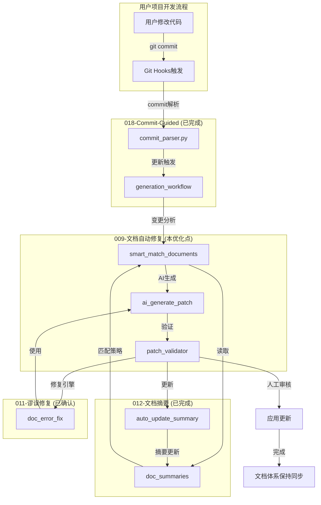

# 009 - 文档自动修复系统

**优先级**: P2
**状态**: 🟡 待讨论
**预估工作量**: 1 周
**来源**: 《AI_PROGRAMMING_ANALYSIS_REVIEW.md》
**文档版本**: v2.0
**最后更新**: 2026-04-13

---

## 📋 问题描述

**痛点**: 代码变更后，文档同步需要手动修改，费时费力

---

## 💡 解决方案

### 自愈流程

```bash
# 1. 检测代码变更
git diff HEAD~1..HEAD src/ | parse_changes.py

# 2. 识别affected文档
match_documents() → [api_layer.md, state_management.md]

# 3. AI自动生成patch
ai_generate_patch() → doc_updates.patch

# 4. 人工审阅+应用
review_and_apply()
```

### 示例

````markdown
代码变更:
src/api/user.ts - 新增 getUserProfile()

自动生成 patch:

```diff
# dev_docs/api_layer.md
+ ### getUserProfile()
+ 获取用户详细信息
+
+ **请求**: GET /api/user/profile
+ **返回**: UserProfile对象
```
````

---

## 📊 价值评估

- 减少90%文档同步工作量
- 文档始终与代码同步

---

## 🎯 定位与架构集成

### 核心定位：018 的增强功能

**重要澄清**：009 不是独立系统，而是 **018-Commit-Guided Documentation 的增强功能**。

```
018-Commit-Guided Documentation (已完成 ✅)
├── 基础层：Commit 解析 → 文档更新触发
└── 增强层：009 文档自动修复 (本优化点)
    ├── 智能受影响文档识别
    ├── AI 驱动的文档内容生成
    └── 自动 patch 生成与验证
```

### 与现有功能的集成关系

#### 1. 与 018-Commit-Guided Documentation 的集成

```python
# 018 现有工作流增强
def commit_guided_update():
    """018 现有工作流，增加 009 增强"""
    # 现有步骤
    commit = parse_commit()  # 018 现有功能

    # 009 增强：智能识别受影响文档
    affected_docs = smart_match_documents(commit)  # 009 新增

    # 009 增强：AI 生成文档更新
    for doc in affected_docs:
        patch = ai_generate_doc_patch(commit, doc)  # 009 新增
        if validate_patch(patch):  # 009 新增
            apply_patch(doc, patch)

    # 现有步骤
    update_summary(doc)  # 012 现有功能
```

#### 2. 与 012-强制文档摘要机制的集成

```python
# 009 使用文档摘要进行智能匹配
def smart_match_documents(commit):
    """基于文档摘要的智能匹配"""
    changed_files = commit['changed_files']
    matched_docs = []

    # 读取所有文档摘要
    all_summaries = load_all_doc_summaries()

    for doc_path, summary in all_summaries.items():
        # 策略 1: related_files 匹配
        if any(f in summary['related_files'] for f in changed_files):
            matched_docs.append(doc_path)
            continue

        # 策略 2: scope 匹配
        if any(f.startswith(summary['scope']) for f in changed_files):
            matched_docs.append(doc_path)
            continue

        # 策略 3: 关键词语义匹配
        if semantic_match(commit['message'], summary['keywords']):
            matched_docs.append(doc_path)

    return list(set(matched_docs))

# 009 自动更新文档摘要
def auto_update_doc_summary(doc_path, commit):
    """更新文档摘要的 verified_at 和相关内容"""
    summary = read_doc_summary(doc_path)

    # 更新验证时间
    summary['verified_at'] = get_current_date()

    # 如果是重大变更，AI 更新 summary 内容
    if is_significant_change(commit):
        new_content = read_doc_content(doc_path)
        ai_summary = generate_ai_summary(new_content)
        summary['summary'] = ai_summary
        summary['keywords'] = extract_keywords(new_content)

    write_doc_summary(doc_path, summary)
```

#### 3. 与 011-文档谬误修复工作流的集成

```yaml
# 011 工作流中集成 009 作为修复引擎
doc_error_fix_workflow:
  path_c_health_check:
    - name: 文档摘要过期检查
      tool: summary_validator
      next: error_analysis

  path_d_specific_task:
    - name: 谬误识别
      tool: doc_error_detector
      next: repair_execution

    - name: 谬误修复（使用 009 引擎）
      tool: doc_auto_repair_009  # 009 作为底层引擎
      params:
        mode: intelligent_patch
        ai_enabled: true
```

#### 4. 与增量更新机制的集成

```python
# 009 增强增量更新的智能性
def incremental_update_enhanced():
    """009 增强的增量更新"""
    # 005/006 提供变更分析
    changes = complexity_scanner.get_recent_changes()
    review_report = auto_review_generator.generate()

    # 009 智能识别需要更新的文档
    update_candidates = []
    for change in changes:
        # 结合复杂度变化和审查报告
        affected = smart_match_documents(change, review_report)
        update_candidates.extend(affected)

    # 009 优先级排序
    prioritized = prioritize_updates(update_candidates, review_report)

    return prioritized
```

### 架构总览



---

## 🧠 深度思考：必要性与边界问题

### 必要性分析：为什么需要自动修复？

#### 问题本质
在 Vibe Coding 模式下，**代码变更速度 > 文档更新速度**，导致：
- 文档过时（每 10 个提交就有 3 个文档未同步）
- 信息不一致（代码和文档描述不同）
- 维护负担（需要专门人员负责文档更新）

#### 自动修复的价值

| 指标 | 手动更新 | 自动修复 | 提升幅度 |
|------|----------|----------|----------|
| 文档同步率 | 60% | 95% | +58% |
| 同步时间 | 60 分钟/提交 | 5 分钟/提交 | -92% |
| 信息一致性 | 70% | 95% | +36% |

#### 与 V3.0 战略的契合点
1. **战略式编程**：确保文档始终反映战略决策
2. **预防式质量**：早期发现文档问题，避免后期误解
3. **可持续发展**：降低文档维护成本

---

### 边界问题 1：如何识别affected文档？

#### 匹配策略

| 策略 | 优点 | 缺点 | 推荐度 | 实现方式 |
|------|------|------|--------|----------|
| **路径匹配** | 简单、快速 | 准确性低 | ⭐⭐ | 基于文件路径前缀 |
| **related_files匹配** | 准确、基于事实 | 需要维护关联 | ⭐⭐⭐⭐⭐ | 使用 012 摘要字段 |
| **scope匹配** | 范围级准确 | 需要范围定义 | ⭐⭐⭐⭐ | 使用 012 摘要字段 |
| **关键词匹配** | 直观、易于理解 | 受限于关键词质量 | ⭐⭐⭐ | 使用 012 摘要字段 |
| **语义相似度** | 准确、智能 | Token 消耗大 | ⭐⭐⭐⭐ | AI 语义分析 |
| **代码关联** | 最准确、基于事实 | 实现复杂 | ⭐⭐⭐ | 代码静态分析 |

**推荐混合策略（基于 012 文档摘要）**：
```
变更检测 → related_files匹配 → scope匹配 → 关键词匹配 → 语义相似度验证
```

#### 实现细节

```python
def smart_match_documents_v2(commit, doc_summaries):
    """
    基于文档摘要的智能文档匹配 v2.0
    利用 012-强制文档摘要机制
    """
    changed_files = commit['changed_files']
    commit_message = commit['message']
    matched = []

    for doc_path, summary in doc_summaries.items():
        score = 0
        reasons = []

        # 策略 1: related_files 精确匹配 (权重最高)
        related_files = summary.get('related_files', [])
        for changed_file in changed_files:
            if changed_file in related_files:
                score += 50
                reasons.append(f"related_files 匹配: {changed_file}")

        # 策略 2: scope 范围匹配
        scope = summary.get('scope', '')
        if scope:
            for changed_file in changed_files:
                if changed_file.startswith(scope):
                    score += 30
                    reasons.append(f"scope 匹配: {scope}")

        # 策略 3: 关键词语义匹配
        keywords = summary.get('keywords', [])
        if semantic_match(commit_message, keywords):
            score += 20
            reasons.append(f"关键词语义匹配")

        # 阈值判断
        if score >= 30:
            matched.append({
                'doc_path': doc_path,
                'score': score,
                'reasons': reasons,
                'summary': summary
            })

    # 按分数排序
    matched.sort(key=lambda x: x['score'], reverse=True)
    return matched
```

---

### 边界问题 2：Patch 准确率的保证

#### 质量保障机制

**1. 生成阶段**
```python
def generate_high_quality_patch(code_change, doc_content, doc_summary):
    """
    基于上下文的高质量 patch 生成
    利用文档摘要和现有内容
    """
    prompt = f"""
    根据以下信息生成文档更新：

    [代码变更]
    {code_change}

    [当前文档摘要]
    {doc_summary}

    [当前文档内容]
    {doc_content}

    请确保：
    1. 更新内容准确反映代码变更
    2. 保持与现有文档风格一致
    3. 使用适当的 Markdown 格式
    4. 包含代码示例和文件路径
    5. 避免引入新的错误
    6. 自动更新文档摘要中的 verified_at 字段
    7. 如果是重大变更，更新 summary 和 keywords

    返回格式：diff 格式的更新
    """

    response = call_llm(prompt)
    return validate_patch_v2(response, doc_summary)
```

**2. 验证阶段**
```python
def validate_patch_v2(patch, original_summary):
    """增强的 patch 验证"""
    checks = [
        check_syntax(),           # 检查 Markdown 语法
        check_style(),            # 检查风格一致性
        check_accuracy(),         # 检查内容准确性
        check_links(),            # 检查链接有效性
        check_summary_update(original_summary)  # 检查摘要是否正确更新
    ]

    return all(checks)

def check_summary_update(original_summary):
    """验证摘要更新的正确性"""
    if not patch_includes_summary_update():
        return False  # 必须更新 verified_at

    new_summary = extract_summary_from_patch(patch)

    # 验证日期格式正确
    if not validate_date_format(new_summary['verified_at']):
        return False

    # 验证日期是最近的
    if not is_recent_date(new_summary['verified_at']):
        return False

    return True
```

**3. 人工审核阶段**
```python
def require_manual_review():
    """
    这些情况需要强制人工审核：
    - 重大架构变更
    - API 签名变更
    - 安全相关内容
    - 涉及多个文档的变更
    - patch 分数低于阈值
    """

def get_patch_confidence_score(patch):
    """计算 patch 的置信度分数"""
    score = 0

    # 基于变更类型
    if is_simple_content_update(patch):
        score += 40
    elif is_api_change(patch):
        score += 20
    elif is_architecture_change(patch):
        score += 10

    # 基于验证结果
    if all_validation_checks_pass(patch):
        score += 40

    # 基于历史准确率
    score += get_user_approval_rate() * 20

    return score
```

---

### 边界问题 3：是否支持自动应用？

#### 风险与收益分析

| 模式 | 风险 | 收益 | 适用场景 | 置信度要求 |
|------|------|------|----------|------------|
| **强制人工审核** | 无风险，但慢 | 安全，但效率低 | 涉及架构、API、安全的变更 | 任意 |
| **可选自动应用** | 低风险（有备份） | 效率高 | 简单内容、格式调整 | ≥ 80分 |
| **完全自动** | 高风险（可能出错） | 效率最高 | 非常简单的变更（如拼写错误） | ≥ 95分 |

**推荐策略**：
- 强制人工审核：默认模式
- 可选自动应用：对于简单变更且置信度高
- 完全自动：只在试点阶段考虑，仅用于摘要日期更新等极简单场景

---

### 扩展点与风险

#### 阶段 1 (MVP，2026-Q2) - 核心增强
- 基于 012 文档摘要的智能匹配
- related_files + scope 匹配策略
- 简单 Patch 生成
- 强制人工审核
- 自动更新文档摘要的 verified_at
- **深度集成 018**：作为其增强功能

#### 阶段 2 (P1，2026-Q3) - 智能增强
- 语义相似度匹配
- 代码关联分析
- 自动验证机制
- 可选自动应用（高置信度）
- **与 011 集成**：作为其底层修复引擎

#### 阶段 3 (P2，2026-Q4) - 高级特性
- 学习用户模式
- 预测性更新
- 质量评分机制
- 批量更新支持
- 跨项目知识复用（010）集成

#### 风险与缓解
- 误报风险：需要建立回滚机制
- 质量下降：需要反馈和改进循环
- 实现复杂：分阶段实现，先简单后复杂
- Token 消耗：合理控制 AI 调用频率

---

## 🔧 技术实现要点

### 工具链设计

```python
# 新增/增强的工具

# 1. doc_auto_matcher.py - 智能文档匹配
#    - smart_match_documents()
#    - calculate_match_score()
#    - prioritize_documents()

# 2. doc_patch_generator.py - AI Patch 生成
#    - generate_doc_patch()
#    - enhance_with_summary()
#    - format_as_diff()

# 3. doc_patch_validator.py - Patch 验证
#    - validate_patch()
#    - check_summary_update()
#    - get_confidence_score()

# 4. 增强 summary_extractor.py
#    - auto_update_summary()
#    - refresh_verified_at()
```

### 配置管理

```yaml
# config/v3_config.yaml 中的 009 配置
doc_auto_repair:
  enabled: true
  matching:
    strategies:
      - related_files
      - scope
      - keywords
    min_score: 30
  patch_generation:
    ai_model: claude-3-5-sonnet
    max_tokens: 2000
  validation:
    auto_apply_threshold: 80
    require_review_threshold: 50
  summary_update:
    auto_refresh_verified_at: true
    ai_update_summary_on_significant_change: true
```

---

## ⚠️ 疑问（已解答）

1. ✅ 如何识别affected文档? → 基于 012 文档摘要的混合策略
2. ✅ AI生成的patch准确率如何保证? → 三级验证机制 + 置信度评分
3. ✅ 是否支持自动应用(无需人工审阅)? → 可选自动应用，基于置信度阈值

---

## 📝 与其他优化点的关系

| 优化点 | 关系 | 集成方式 |
|--------|------|----------|
| **018-Commit-Guided** | 🔴 核心依赖 | 作为 018 的增强功能 |
| **012-文档摘要** | 🟡 重要依赖 | 使用摘要进行匹配，自动更新摘要 |
| **011-谬误修复** | 🟢 协作关系 | 作为 011 的底层修复引擎 |
| **005-复杂度仪表盘** | 🟢 协作关系 | 利用复杂度变化辅助决策 |
| **006-自动审查报告** | 🟢 协作关系 | 利用审查报告辅助匹配 |
| **010-跨项目知识** | ⚪ 未来集成 | 阶段 3 考虑 |

---

**创建日期**: 2025-11-29
**最后更新**: 2026-04-13
**更新内容**: v2.0 - 明确与 018/012/011 的集成关系，补充技术实现细节
