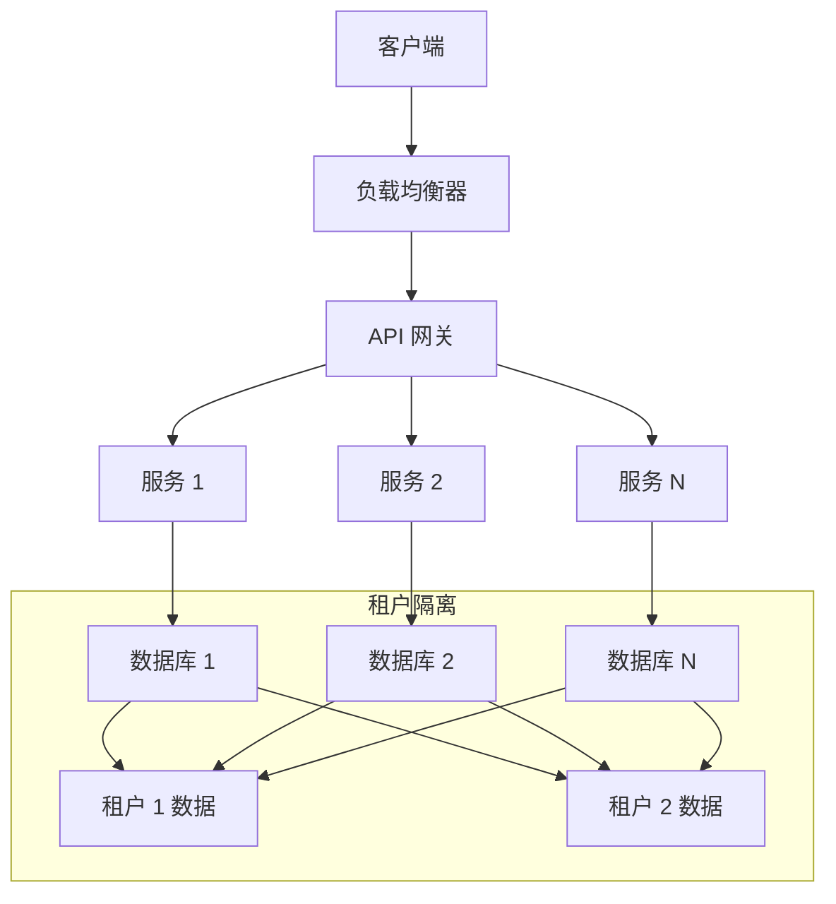
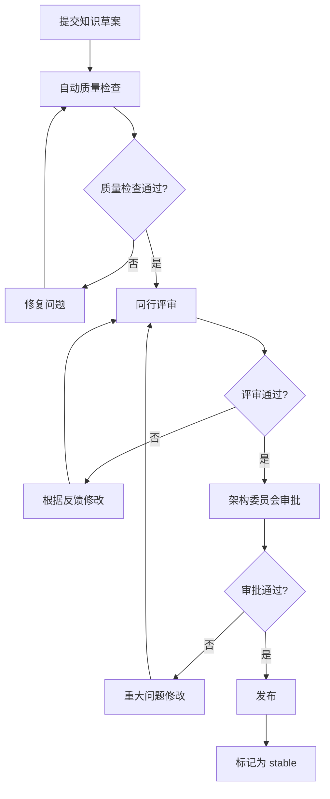

# 010 - 跨项目知识复用：知识仓库架构设计

**文档类型**: 架构设计文档
**相关优化点**: 010-cross-project-knowledge.md
**创建日期**: 2026-04-13
**最后更新**: 2026-04-13
**状态**: 🟢 已确认

---

## 📋 概述

本文档详细描述了跨项目知识复用的核心架构设计——**四层知识仓库架构**。该架构旨在解决不同项目间知识重复创建、难以维护和不一致性的问题，通过标准化结构和智能关联实现知识的高效复用。

## 🎯 知识类型分析

### 1. 知识性质分类

```
知识类型图谱：
├── 规范性知识（Prescriptive Knowledge）
│   ├── 架构模式（如何设计系统）
│   ├── 编码规范（如何写代码）
│   ├── 流程规范（如何做事情）
│   └── 质量标准（如何验收）
│
├── 问题解决型知识（Problem-Solving Knowledge）
│   ├── 常见错误（已知的坑）
│   ├── 调试方法（如何排错）
│   ├── 性能优化（如何提升性能）
│   └── 安全加固（如何保障安全）
│
├── 决策型知识（Decision-Making Knowledge）
│   ├── 技术选型（为什么选 A 不选 B）
│   ├── 架构决策（为什么这样设计）
│   └── 权衡分析（各种方案的优缺点）
│
└── 经验型知识（Experiential Knowledge）
    ├── 最佳实践（验证过的好方法）
    ├── 反模式（验证过的坏方法）
    ├── 经验教训（踩过的坑和学到的）
    └── 案例研究（完整的项目经验）
```

### 2. 技术领域分类

```
技术领域维度：
├── 前端
│   ├── UI 组件模式
│   ├── 状态管理策略
│   ├── 路由设计
│   ├── 性能优化
│   └── 构建配置
│
├── 后端
│   ├── API 设计
│   ├── 数据库设计
│   ├── 认证授权
│   ├── 缓存策略
│   └── 消息队列
│
├── DevOps
│   ├── CI/CD 流程
│   ├── 容器编排
│   ├── 监控告警
│   ├── 部署策略
│   └── 灾难恢复
│
├── 数据
│   ├── 数据建模
│   ├── ETL 流程
│   ├── 数据分析
│   └── 数据可视化
│
└── 安全
    ├── 认证授权
    ├── 数据加密
    ├── 漏洞防护
    └── 安全审计
```

### 3. 项目类型分类

```
项目类型维度：
├── Web 应用
├── 移动端应用
├── 桌面应用
├── CLI 工具
├── 库/SDK
├── 数据科学项目
├── 机器学习项目
└── IoT 项目
```

---

## 🏗️ 四层架构设计

### 1. 第 0 层：基础设施层（Infrastructure Layer）

```
knowledge-repo/
├── .aicc/
│   ├── metadata.json           # 仓库元数据
│   ├── schema/                 # 知识结构定义
│   │   ├── pattern.schema.json
│   │   ├── problem.schema.json
│   │   ├── decision.schema.json
│   │   └── experience.schema.json
│   ├── taxonomies/             # 分类体系定义
│   │   ├── domain-taxonomy.json
│   │   ├── pattern-taxonomy.json
│   │   └── tech-stack-taxonomy.json
│   ├── rules/                  # 质量检查规则
│   │   ├── completeness.json
│   │   ├── clarity.json
│   │   └── consistency.json
│   └── templates/              # 知识模板
│       ├── pattern-template.md
│       ├── problem-template.md
│       └── decision-template.md
└── assets/                     # 静态资源
    ├── diagrams/
    └── examples/
```

#### 1.1 元数据规范

```json
// .aicc/metadata.json
{
  "id": "shared-knowledge-repo",
  "name": "共享知识仓库",
  "version": "1.0.0",
  "description": "跨项目知识复用的共享知识库",
  "contributors": ["@framework-team"],
  "createdAt": "2026-04-13",
  "updatedAt": "2026-04-13",
  "license": "MIT",
  "languages": ["javascript", "python", "java"],
  "tags": ["knowledge", "reuse", "architecture"],
  "compatibility": ["aicc-v3.0"]
}
```

#### 1.2 知识结构定义示例

---

#### 1.3 知识库创建与发布流程

```
知识库创建流程：
┌─────────────────────────────────────────────────────────────┐
│ 阶段 1: 初始化本地知识库                                      │
│  ├─ 检查本地 knowledge 目录结构                              │
│  ├─ 验证知识内容符合标准格式                                  │
│  ├─ 创建 .aicc/ 配置目录和元数据文件                          │
│  ├─ 初始化 Git 仓库（git init）                              │
│  └─ 配置 .gitignore 文件                                     │
├─────────────────────────────────────────────────────────────┤
│ 阶段 2: 本地知识库优化                                      │
│  ├─ 执行自动质量检查                                        │
│  ├─ 修复知识结构问题                                        │
│  ├─ 补充缺失的元数据                                        │
│  └─ 优化知识分类体系                                        │
├─────────────────────────────────────────────────────────────┤
│ 阶段 3: 发布到云端仓库                                      │
│  ├─ 添加远程仓库地址（git remote add）                       │
│  ├─ 验证本地仓库状态（无未提交变更）                           │
│  ├─ 执行首次推送（git push -u）                              │
│  └─ 验证远程仓库内容与本地一致                                │
├─────────────────────────────────────────────────────────────┤
│ 阶段 4: 云端仓库配置                                        │
│  ├─ 配置仓库可见性（公开/私有）                               │
│  ├─ 邀请协作者（可选）                                       │
│  └─ 配置分支保护规则（可选）                                 │
└─────────────────────────────────────────────────────────────┘
```

**关键检查点**：
- 知识完整性检查（每个条目至少包含标题、内容、标签）
- 结构一致性检查（目录结构符合标准）
- 格式验证（Markdown 语法、代码示例）
- 元数据完整性检查（创建时间、贡献者、标签）

```json
// .aicc/schema/pattern.schema.json
{
  "id": "pattern.schema",
  "version": "1.0",
  "type": "object",
  "required": ["title", "description", "problem", "solution", "code-examples"],
  "properties": {
    "title": { "type": "string", "minLength": 10, "maxLength": 100 },
    "description": { "type": "string", "minLength": 50 },
    "problem": { "type": "string", "minLength": 100 },
    "solution": { "type": "string", "minLength": 200 },
    "code-examples": {
      "type": "array",
      "minItems": 1,
      "items": {
        "type": "object",
        "required": ["language", "code"],
        "properties": {
          "language": { "type": "string" },
          "code": { "type": "string", "minLength": 20 },
          "description": { "type": "string" }
        }
      }
    },
    "pros": { "type": "array", "items": { "type": "string" }, "minItems": 2 },
    "cons": { "type": "array", "items": { "type": "string" }, "minItems": 1 },
    "tags": { "type": "array", "items": { "type": "string" }, "minItems": 3 },
    "related-patterns": { "type": "array", "items": { "type": "string" } },
    "createdAt": { "type": "string", "format": "date-time" },
    "updatedAt": { "type": "string", "format": "date-time" },
    "maintainers": { "type": "array", "items": { "type": "string" } }
  }
}
```

---

### 2. 第 1 层：核心知识层（Core Knowledge Layer）

```
knowledge-repo/
├── fundamentals/               # 基础知识（语言无关、通用原则）
│   ├── design-principles/      # 设计原则（SOLID、DRY 等）
│   ├── architecture-patterns/  # 架构模式（MVC、微服务等）
│   ├── quality-attributes/     # 质量属性（性能、安全、可维护性等）
│   └── tradeoffs/              # 权衡分析框架
└── cross-cutting/              # 横切关注点
    ├── security/
    ├── performance/
    ├── observability/
    └── testing/
```

#### 2.1 设计原则示例

```markdown
# SOLID 原则

## 单一职责原则（SRP）

**问题场景**: 一个类承担太多职责，导致变更时影响范围过大。

**解决方案**: 每个类只负责一个职责领域的工作。

**代码示例 (JavaScript)**:
```javascript
// 违反原则
class UserManager {
  fetchUser() { /* 获取用户数据 */ }
  validateUser() { /* 验证用户数据 */ }
  saveUser() { /* 保存用户 */ }
  sendWelcomeEmail() { /* 发送欢迎邮件 */ } // 不属于用户管理职责
}

// 遵循原则
class UserManager {
  fetchUser() { /* 获取用户数据 */ }
  validateUser() { /* 验证用户数据 */ }
  saveUser() { /* 保存用户 */ }
}

class EmailService {
  sendWelcomeEmail() { /* 发送欢迎邮件 */ }
}
```

## 优点与缺点

### 优点
- ✅ 提高类的内聚性
- ✅ 降低类的复杂性
- ✅ 减少变更的影响范围
- ✅ 提高代码的可维护性

### 缺点
- ❌ 可能导致类的数量增加
- ❌ 需要更多的架构设计思考
```

---

### 3. 第 2 层：技术特定层（Technology-Specific Layer）

```
knowledge-repo/
├── languages/                  # 编程语言特定知识
│   ├── javascript/
│   │   ├── patterns/
│   │   ├── best-practices/
│   │   ├── pitfalls/
│   │   └── tooling/
│   ├── python/
│   ├── java/
│   └── ...
├── frameworks/                 # 框架特定知识
│   ├── react/
│   ├── vue/
│   ├── django/
│   ├── spring/
│   └── ...
├── platforms/                  # 平台特定知识
│   ├── aws/
│   ├── gcp/
│   ├── kubernetes/
│   └── ...
└── databases/                  # 数据库特定知识
    ├── postgresql/
    ├── mongodb/
    ├── redis/
    └── ...
```

#### 3.1 JavaScript 最佳实践示例

```markdown
# JavaScript 最佳实践：错误处理

## 同步代码错误处理

**推荐做法**: 使用 try-catch 捕获错误，并提供有意义的错误信息。

```javascript
// 好的做法
function parseJSON(data) {
  try {
    return JSON.parse(data);
  } catch (error) {
    throw new Error(`JSON 解析失败: ${error.message}`, { cause: error });
  }
}

// 使用
try {
  const result = parseJSON(invalidData);
} catch (error) {
  console.error('数据解析错误:', error.message);
  // 记录错误日志
  logger.error('Parse error:', error);
  // 向用户显示友好信息
  showError('数据格式错误，请检查输入');
}
```

## 异步代码错误处理

**推荐做法**: 对 async/await 使用 try-catch，或者在 Promise 链中使用 catch。

```javascript
// 好的做法
async function fetchData(url) {
  try {
    const response = await fetch(url);
    if (!response.ok) {
      throw new Error(`请求失败: ${response.status} ${response.statusText}`);
    }
    return await response.json();
  } catch (error) {
    if (error.name === 'TypeError') {
      throw new Error('网络连接失败');
    }
    throw error;
  }
}

// 使用
fetchData('https://api.example.com/data')
  .then(data => console.log('数据:', data))
  .catch(error => {
    console.error('请求失败:', error.message);
  });
```
```

---

### 4. 第 3 层：应用场景层（Application Scenario Layer）

```
knowledge-repo/
├── project-types/              # 项目类型场景
│   ├── web-app/
│   ├── mobile-app/
│   ├── cli-tool/
│   └── ...
├── use-cases/                  # 具体使用场景
│   ├── e-commerce/
│   ├── social-media/
│   ├── saas-platform/
│   └── ...
└── case-studies/               # 完整案例研究
    ├── [case-1]/
    │   ├── overview.md
    │   ├── architecture.md
    │   ├── decisions.md
    │   └── lessons-learned.md
    └── ...
```

#### 4.1 SaaS 平台架构场景示例

```markdown
# SaaS 平台架构模式

## 多租户架构

**问题场景**: 为多个租户提供服务，需要隔离数据和资源。

**解决方案**: 采用数据库级别的租户隔离。

## 架构设计



## 实现方案（Node.js/PostgreSQL）

```javascript
// 获取租户连接
function getTenantConnection(tenantId) {
  return new Promise((resolve, reject) => {
    const connection = {
      host: process.env.DB_HOST,
      port: process.env.DB_PORT,
      database: `app_${tenantId}`,
      user: process.env.DB_USER,
      password: process.env.DB_PASSWORD
    };

    pg.connect(connection, (err, client) => {
      if (err) return reject(err);
      resolve(client);
    });
  });
}

// 租户数据访问层
class TenantRepository {
  constructor(tenantId) {
    this.tenantId = tenantId;
  }

  async findUser(id) {
    const client = await getTenantConnection(this.tenantId);
    return await client.query('SELECT * FROM users WHERE id = $1', [id]);
  }
}
```

## 优缺点分析

### 优点
- ✅ 数据隔离性强
- ✅ 性能优化潜力大
- ✅ 故障隔离
- ✅ 扩展灵活

### 缺点
- ❌ 部署和维护成本高
- ❌ 跨租户查询困难
- ❌ 数据迁移复杂
```

---

## 🔗 知识关联与知识图谱

### 1. 关联类型

```
知识关联类型：
├── is-a 关系（继承）
├── depends-on 关系（依赖）
├── alternative-to 关系（替代）
├── complements 关系（互补）
├── references 关系（引用）
└── similar-to 关系（相似）
```

### 2. 知识图谱示例

```json
{
  "nodes": [
    {
      "id": "pattern-rest-api",
      "type": "pattern",
      "title": "RESTful API 设计模式",
      "tags": ["api", "rest"],
      "domain": "backend"
    },
    {
      "id": "pattern-graphql-api",
      "type": "pattern",
      "title": "GraphQL API 设计模式",
      "tags": ["api", "graphql"],
      "domain": "backend"
    },
    {
      "id": "fundamental-http",
      "type": "fundamental",
      "title": "HTTP 协议基础",
      "tags": ["http", "protocol"],
      "domain": "network"
    }
  ],
  "edges": [
    {
      "source": "pattern-rest-api",
      "target": "pattern-graphql-api",
      "type": "alternative-to",
      "weight": 0.8,
      "description": "REST 和 GraphQL 都是 API 设计模式，可互相替代"
    },
    {
      "source": "pattern-rest-api",
      "target": "fundamental-http",
      "type": "depends-on",
      "weight": 1.0,
      "description": "REST API 依赖 HTTP 协议"
    }
  ]
}
```

---

## 📊 质量评估与审核

### 1. 质量评估维度

```
质量评分系统（0-5 分）：
├── 完整性（Completeness）：内容是否完整，是否有充分的示例
├── 清晰度（Clarity）：描述是否清晰易懂，结构是否逻辑清晰
├── 准确性（Accuracy）：内容是否经过验证，是否有实际案例支持
├── 实用性（Practicality）：是否在实际项目中验证过，是否有可复用的代码示例
└── 时效性（Timeliness）：是否反映最新的技术趋势
```

### 2. 审核流程



---

## 🚀 搜索与推荐系统

### 1. 多维度搜索

```
搜索维度：
├── 关键词搜索（标题、内容、标签）
├── 分类筛选（知识类型、技术领域、编程语言、项目类型）
├── 质量筛选（质量评分、审核状态、采用率）
├── 关系搜索（查找相关知识、依赖知识、可替代知识）
└── 场景匹配（根据项目特征、问题症状、技术栈推荐）
```

### 2. 智能推荐算法

```javascript
function recommendKnowledge(projectContext, currentProblem) {
  const recommendations = [];

  // 1. 根据技术栈推荐
  recommendations.push(matchByTechStack(projectContext.techStack));

  // 2. 根据问题症状推荐
  if (currentProblem) {
    recommendations.push(matchBySymptoms(currentProblem.symptoms));
  }

  // 3. 根据项目类型推荐
  recommendations.push(matchByProjectType(projectContext.projectType));

  // 4. 根据知识图谱推荐
  recommendations.push(matchByKnowledgeGraph(projectContext));

  // 5. 根据使用统计推荐
  recommendations.push(matchByAdoptionStats(projectContext));

  return rankRecommendations(recommendations);
}
```

---

## 📝 维护与演进

### 1. 版本管理

```
版本格式：MAJOR.MINOR.PATCH
- MAJOR：不兼容的变更（需要重新评估使用）
- MINOR：向后兼容的功能新增
- PATCH：向后兼容的问题修复
```

### 2. 变更日志示例

```markdown
## 框架变更日志

### v1.0.1.0 (2026-04-13)

#### 扩充内容
- ✨ 新增：添加 "边缘计算" 分类到技术领域
- ✨ 新增：添加 "serverless" 标签分类
- ✨ 新增：添加 IoT 项目类型模板

#### 触发原因
- 连续 5 次提交 IoT 相关知识无法完全适配
- 必要性评估得分 0.82（高）

#### 影响范围
- 无需重新适配现有知识
- 新提交的 IoT 知识可以更好地结构化

#### 审核状态
- ✅ 架构委员会审核通过
- ✅ 自动验证通过
```

---

## 📋 验收标准

### 1. 功能验收

- ✅ 支持通过 Git 仓库地址引入共享知识
- ✅ 实现知识匹配和引用机制
- ✅ 提供知识贡献引导
- ✅ 支持知识版本管理
- ✅ 实现本地缓存和离线使用

### 2. 性能验收

- ✅ 知识仓库拉取时间 < 30 秒（10MB 以下仓库）
- ✅ 知识匹配和引用速度 < 5 秒
- ✅ 内存消耗 < 512MB
- ✅ CPU 使用率 < 20%（单线程）

### 3. 质量验收

- ✅ 知识引用准确率 > 90%
- ✅ 版本兼容性检查准确率 > 85%
- ✅ 知识匹配召回率 > 80%
- ✅ 用户满意度评分 > 4.0（5分制）