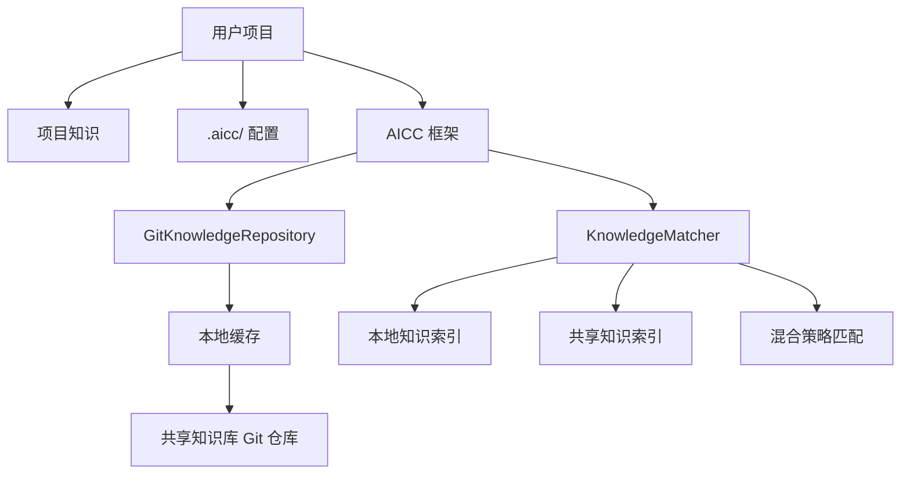

# 010 - 跨项目知识复用：实施方案

**文档类型**: 实施计划
**相关优化点**: 010-cross-project-knowledge.md
**创建日期**: 2026-04-13
**状态**: 🟢 已确认

---

## 📋 概述

本文档是 010 跨项目知识复用优化点的详细实施方案，包括实施目标、技术架构、开发步骤、时间表、资源需求和风险评估。

## 🎯 实施目标

### 1. 核心目标
- 实现知识仓库的独立 Git 仓库管理
- 支持通过云端地址引入共享知识库
- 实现知识在不同项目间的自动匹配和引用
- 提供完整的知识库管理 CLI 工具
- 支持知识仓库的自进化和自适应

### 2. 量化目标
- **开发时间**: 8 周
- **知识引用准确率**: > 90%
- **知识匹配召回率**: > 80%
- **仓库拉取时间**: < 30 秒（10MB 以下仓库）
- **用户学习曲线**: 新用户使用时间 < 10 分钟

---

## 🏗️ 技术架构

### 1. 整体系统架构



### 2. 核心模块设计

#### 知识仓库管理模块
```python
# 知识仓库管理类
class GitKnowledgeRepository:
    def __init__(self, config):
        self.config = config

    # 仓库操作
    def clone_repo(self, repo_url, branch='main'):

    def pull_repo(self):

    def get_latest_commit(self):

    # 知识读取
    def get_knowledge(self, path):

    def list_knowledge(self, category=None):

    # 索引管理
    def build_index(self):

    def update_index(self):
```

#### 知识匹配与引用模块
```python
# 知识匹配器
class KnowledgeMatcher:
    def __init__(self, project_context):
        self.project_context = project_context

    # 匹配策略
    def match_local_first(self, query):

    def match_shared_first(self, query):

    def match_hybrid(self, query):

    # 知识相似度计算
    def calculate_similarity(self, doc1, doc2):

    # 上下文匹配
    def match_context(self, context):
```

#### 配置管理模块
```python
# 配置管理器
class KnowledgeConfigManager:
    @staticmethod
    def load_config():

    @staticmethod
    def save_config(config):

    @staticmethod
    def validate_config(config):

    # 自动配置
    def auto_configure():

    # 配置向导
    def configuration_wizard():
```

---

## 🚀 实施步骤

### 阶段 1：基础设施建设（第 1-2 周）

#### 任务 1.1：配置系统实现
- 创建 `KnowledgeConfigManager` 类
- 实现配置文件读取和保存
- 开发配置向导
- 支持 .aicc/config.yml 文件格式

#### 任务 1.2：Git 仓库管理
- 实现 `GitKnowledgeRepository` 类
- 支持仓库克隆、拉取、更新操作
- 实现本地缓存管理
- 开发错误处理和重试机制

#### 任务 1.3：目录结构创建
- 实现项目知识目录初始化
- 支持共享知识仓库标准结构
- 创建默认的 .gitignore 配置

---

### 阶段 2：核心功能开发（第 3-5 周）

#### 任务 2.1：知识索引系统
- 实现知识元数据提取
- 开发全文搜索功能
- 支持标签和分类索引
- 实现索引更新机制

#### 任务 2.2：知识匹配引擎
- 实现 `KnowledgeMatcher` 类
- 开发本地知识优先策略
- 开发共享知识优先策略
- 实现混合策略匹配

#### 任务 2.3：知识引用机制
- 实现知识嵌入功能
- 支持模板引擎语法
- 开发版本控制检查
- 实现引用验证

---

### 阶段 3：CLI 工具开发（第 6-7 周）

#### 任务 3.1：命令行接口
- 创建 `knowledge_cli.py` 和 `knowledge_cli.js`
- 实现 `status` 命令
- 实现 `config` 命令
- 实现 `update-shared` 命令
- 实现 `strategy` 命令
- 实现 `enable-shared` 和 `disable-shared` 命令
- 实现 `init` 命令（初始化共享知识库）
- 实现 `publish` 命令（发布到云端仓库）

#### 任务 3.2：用户交互
- 开发配置向导
- 实现进度显示
- 支持彩色输出
- 实现错误提示和帮助

---

### 阶段 4：测试与优化（第 8 周）

#### 任务 4.1：功能测试
- 单元测试核心功能
- 集成测试完整流程
- 边界条件测试
- 性能测试

#### 任务 4.2：优化改进
- 性能优化
- 内存使用优化
- 用户体验优化
- 错误处理优化

#### 任务 4.3：文档完善
- 更新实施文档
- 编写用户指南
- 创建示例项目
- 开发入门教程

---

## 📅 时间表

| 阶段 | 开始时间 | 结束时间 | 任务 |
|------|---------|---------|------|
| 1. 基础设施 | 第 1 周 | 第 2 周 | 配置系统、Git 管理、目录结构 |
| 2. 核心功能 | 第 3 周 | 第 5 周 | 索引系统、匹配引擎、引用机制 |
| 3. CLI 工具 | 第 6 周 | 第 7 周 | 命令行接口、用户交互 |
| 4. 测试优化 | 第 8 周 | 第 8 周 | 功能测试、性能优化、文档完善 |

**总时长**: 8 周

---

## 🛠️ 资源需求

### 1. 开发环境
- **操作系统**: macOS 11+, Windows 10+, Linux (Ubuntu 20.04+)
- **Python**: 3.10+
- **Node.js**: 18.0+
- **Git**: 2.30+
- **依赖**: 无额外第三方依赖，仅使用标准库

### 2. 开发团队
- **项目经理**: 1 人（负责整体协调和进度管理）
- **架构师**: 1 人（负责系统架构设计）
- **开发工程师**: 2 人（负责 Python 和 JavaScript 实现）
- **测试工程师**: 1 人（负责功能和性能测试）
- **文档工程师**: 1 人（负责用户文档和教程）

### 3. 开发工具
- **代码编辑器**: VS Code, PyCharm 等
- **版本控制**: GitHub/GitLab
- **任务管理**: Jira, Trello 等
- **CI/CD**: GitHub Actions, GitLab CI 等
- **代码质量**: SonarQube, CodeClimate 等

---

## 📊 风险评估与缓解

### 1. 技术风险

#### 风险：Git 操作失败
- **影响**: 无法克隆、更新或访问共享知识库
- **概率**: 中低
- **缓解措施**:
  - 实现重试机制
  - 提供离线模式支持
  - 开发缓存管理策略

#### 风险：知识匹配准确性低
- **影响**: 无法找到相关的共享知识
- **概率**: 中
- **缓解措施**:
  - 持续优化匹配算法
  - 支持多种匹配策略
  - 提供手动调整选项

### 2. 项目风险

#### 风险：开发进度滞后
- **影响**: 无法按时完成项目
- **概率**: 中
- **缓解措施**:
  - 分阶段实施，有明确的交付节点
  - 定期进度检查和调整
  - 敏捷开发方法，适应变更

#### 风险：团队成员流动
- **影响**: 开发经验流失，进度受阻
- **概率**: 低
- **缓解措施**:
  - 完善文档和代码注释
  - 定期知识分享
  - 代码审查和结对编程

---

## 🎯 验收标准

### 1. 功能验收

#### 1.1 配置管理
- ✅ 支持通过 CLI 配置共享知识库地址
- ✅ 支持自动检测和添加到 .gitignore
- ✅ 配置文件格式验证
- ✅ 配置错误处理

#### 1.2 Git 仓库操作
- ✅ 支持仓库克隆、拉取和更新
- ✅ 支持分支和深度配置
- ✅ 错误处理和重试机制
- ✅ 本地缓存管理

#### 1.3 知识匹配与引用
- ✅ 支持本地知识优先策略
- ✅ 支持共享知识优先策略
- ✅ 支持混合策略匹配
- ✅ 知识嵌入和引用验证

#### 1.4 命令行接口
- ✅ 所有命令（status, config, update-shared, strategy, enable/disable-shared）功能正常
- ✅ 命令行参数解析正确
- ✅ 帮助信息和使用示例
- ✅ 输出格式化和着色

### 2. 性能验收

#### 2.1 响应时间
- ✅ 知识仓库拉取时间 < 30 秒（10MB 以下仓库）
- ✅ 知识匹配和引用速度 < 5 秒
- ✅ 索引更新时间 < 10 秒（100 个文件）

#### 2.2 资源使用
- ✅ 内存消耗 < 512MB
- ✅ CPU 使用率 < 20%（单线程）
- ✅ 磁盘空间使用合理

### 3. 质量验收

#### 3.1 代码质量
- ✅ 代码覆盖率 > 80%
- ✅ 符合 PEP8（Python）和 ESLint（JavaScript）规范
- ✅ 代码审查通过
- ✅ 单元测试和集成测试通过

#### 3.2 文档质量
- ✅ 实施文档完整
- ✅ 用户指南详细
- ✅ 示例项目可运行
- ✅ 错误处理和故障排除指南

---

## 🔗 相关文档

- [010 - 跨项目知识复用主文档](./010-cross-project-knowledge.md)
- [知识仓库架构设计](./architecture-design.md)
- [框架自进化系统](./self-evolution-system.md)
- [CLI 命令参考](./cli-commands.md)

---

## 📝 变更记录

### 2026-04-13
- 初始版本发布
- 定义了 8 周的实施计划
- 详细描述了技术架构和核心模块
- 包含了完整的验收标准和风险评估

---

**文档状态**: 🟢 已确认
**最后更新**: 2026-04-13
**负责人**: Framework Team