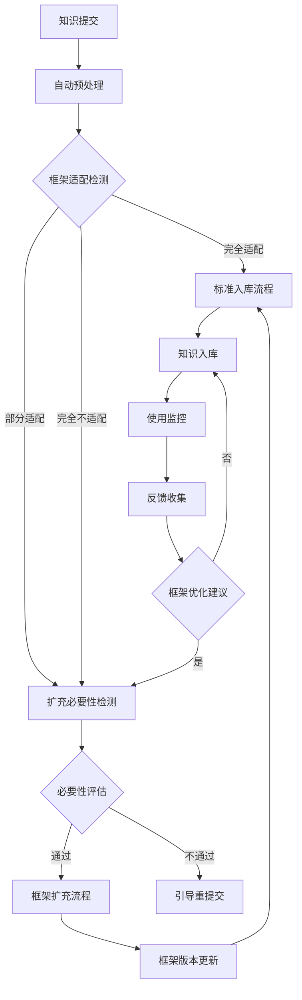

# 010 - 跨项目知识复用：框架自进化系统

**文档类型**: 架构设计文档
**相关优化点**: 010-cross-project-knowledge.md
**创建日期**: 2026-04-13
**最后更新**: 2026-04-13
**状态**: 🟢 已确认

---

## 📋 概述

本文档详细描述了知识仓库架构的自进化、自迭代系统。该系统通过自动检测新知识的适配性、评估框架扩充的必要性，并在严格控制下自动更新框架架构，实现知识仓库的持续优化和适应能力。

## 🎯 核心思想

### 1. 问题分析

传统知识仓库的挑战：
- **框架僵化**: 固定的知识分类体系难以适应新技术和场景
- **维护负担**: 人工更新框架需要大量时间和精力
- **不完整性**: 新的技术领域和问题类型无法快速纳入框架
- **知识孤岛**: 新知识无法与现有知识建立关联

### 2. 解决方案

**自进化系统核心原理**：
```
新知识提交 → 自动适配检测 → 必要性评估 → 自动框架扩充 → 知识入库
```

### 3. 设计理念

```
自进化系统特征：
├── 智能检测：自动识别知识类型和适用场景
├── 严格评估：多维度评估框架扩充的必要性
├── 渐进式进化：从微小调整到重大变更的分级处理
├── 安全可控：关键节点人工审核机制
├── 反馈闭环：使用数据驱动持续优化
```

---

## 🏗️ 系统架构

### 1. 系统层次结构

```
knowledge-evolution-system/
├── 🔷 接入层（Ingestion Layer）
│   ├── 知识提交接口
│   ├── 预处理模块
│   └── 格式验证器
│
├── 🔷 分析层（Analysis Layer）
│   ├── 内容语义分析
│   ├── 框架适配检测
│   ├── 必要性评估器
│   └── 知识关联分析
│
├── 🔷 执行层（Execution Layer）
│   ├── 框架变更执行器
│   ├── 知识迁移工具
│   └── 影响分析模块
│
├── 🔷 验证层（Validation Layer）
│   ├── 人工审核接口
│   ├── 框架一致性检查
│   └── 知识质量验证
│
└── 🔷 监控层（Monitoring Layer）
    ├── 使用数据分析
    ├── 反馈收集系统
    └── 框架健康检查
```

### 2. 核心模块设计

#### 2.1 预处理模块

```javascript
// 预处理模块接口
interface Preprocessor {
  preprocess(content: string, metadata: any): Promise<PreprocessedKnowledge>;
}

// 预处理结果类型
interface PreprocessedKnowledge {
  id: string;
  title: string;
  content: string;
  structuredContent: any;
  metadata: PreprocessedMetadata;
  semanticTags: string[];
  similarKnowledge: SimilarKnowledge[];
  qualityScore: number;
}

// 元数据预处理结果
interface PreprocessedMetadata {
  raw: any;
  normalized: any;
  type: KnowledgeType;
  domain: string;
  subDomain: string;
  language: string;
  tags: string[];
}
```

#### 2.2 框架适配检测器

```javascript
// 框架适配检测器
class FrameworkAdapter {
  async checkAdaptation(preprocessed: PreprocessedKnowledge): Promise<AdaptationResult> {
    const results = {
      taxonomyAdaptation: await this.checkTaxonomyAdaptation(preprocessed),
      tagAdaptation: await this.checkTagAdaptation(preprocessed),
      templateAdaptation: await this.checkTemplateAdaptation(preprocessed),
      graphAdaptation: await this.checkGraphAdaptation(preprocessed),
      metadataAdaptation: await this.checkMetadataAdaptation(preprocessed)
    };

    results.overallScore = this.calculateOverallScore(results);
    results.adaptationLevel = this.determineAdaptationLevel(results);

    return results;
  }

  determineAdaptationLevel(results: any): AdaptationLevel {
    if (results.overallScore >= 0.9) return 'FULLY_ADAPTED';
    if (results.overallScore >= 0.6) return 'PARTIALLY_ADAPTED';
    return 'NOT_ADAPTED';
  }
}

// 适配结果类型
interface AdaptationResult {
  overallScore: number;
  adaptationLevel: AdaptationLevel;
  taxonomyAdaptation: Score;
  tagAdaptation: Score;
  templateAdaptation: Score;
  graphAdaptation: Score;
  metadataAdaptation: Score;
  issues: AdaptationIssue[];
  recommendations: AdaptationRecommendation[];
}
```

#### 2.3 必要性评估器

```javascript
// 必要性评估器
class NecessityEvaluator {
  async evaluateNecessity(
    preprocessed: PreprocessedKnowledge,
    adaptationResult: AdaptationResult
  ): Promise<NecessityEvaluation> {
    const evaluation = {
      frequencyScore: await this.analyzeFrequency(preprocessed),
      importanceScore: this.evaluateImportance(preprocessed),
      substitutabilityScore: this.checkSubstitutability(preprocessed, adaptationResult),
      longTermValue: this.evaluateLongTermValue(preprocessed),
      maintenanceCost: this.estimateMaintenanceCost(preprocessed)
    };

    evaluation.overallNecessity = this.calculateNecessityScore(evaluation);
    evaluation.recommendation = this.makeRecommendation(evaluation);

    return evaluation;
  }

  makeRecommendation(evaluation: any): NecessityRecommendation {
    if (evaluation.overallNecessity >= 0.7) {
      return { action: 'EXPAND', confidence: 'HIGH' };
    }
    if (evaluation.overallNecessity >= 0.4) {
      return { action: 'EXPAND', confidence: 'MEDIUM', requiresReview: true };
    }
    return { action: 'REJECT', reason: '必要性不足' };
  }
}

// 必要性评估结果
interface NecessityEvaluation {
  frequencyScore: number;
  importanceScore: number;
  substitutabilityScore: number;
  longTermValue: number;
  maintenanceCost: number;
  overallNecessity: number;
  recommendation: NecessityRecommendation;
}
```

#### 2.4 框架变更执行器

```javascript
// 框架变更执行器
class FrameworkExpander {
  async executeExpansion(
    expansionPlan: ExpansionPlan,
    submission: PreprocessedKnowledge
  ): Promise<ExpansionResult> {
    const execution = {
      plan: expansionPlan,
      steps: [],
      result: null
    };

    try {
      execution.steps.push(await this.createBranch(expansionPlan));

      for (const change of expansionPlan.changes) {
        execution.steps.push(await this.applyChange(change));
      }

      execution.steps.push(await this.validateFramework());
      execution.result = await this.generateReport(expansionPlan);
      execution.steps.push(await this.markForReview());

      return execution;
    } catch (error) {
      execution.error = error;
      execution.steps.push(await this.rollback());
      throw error;
    }
  }
}

// 框架变更计划
interface ExpansionPlan {
  id: string;
  type: ExpansionType;
  severity: Severity;
  changes: ExpansionChange[];
  estimatedImpact: ImpactAssessment;
  recommendedActions: string[];
  requiresReview: boolean;
}
```

---

## 🚀 工作流程

### 1. 完整处理流程



### 2. 关键决策点

#### 2.1 框架适配检测阈值

```javascript
// 适配检测决策逻辑
const AdaptationThresholds = {
  FULLY_ADAPTED: 0.9,  // 90% 以上适配性
  PARTIALLY_ADAPTED: 0.6,  // 60-89% 适配性
  NOT_ADAPTED: 0.5,  // 59% 以下适配性
};

const AdaptationRules = {
  taxonomy: {
    requiredCoverage: 0.8,
    similarityThreshold: 0.7
  },
  tags: {
    requiredCoverage: 0.6,
    newTagRatio: 0.3
  },
  structure: {
    templateMatch: 0.7,
    metadataMatch: 0.8
  }
};
```

#### 2.2 必要性评估权重

```javascript
// 必要性评估权重配置
const NecessityWeights = {
  frequencyScore: 0.25,      // 出现频率（25%）
  importanceScore: 0.25,     // 战略重要性（25%）
  substitutabilityScore: 0.20, // 可替代性（20%）
  longTermValue: 0.20,       // 长期价值（20%）
  maintenanceCost: 0.10      // 维护成本（10%）
};

const NecessityThresholds = {
  HIGH_CONFIDENCE: 0.7,      // 70% 以上：自动执行
  MEDIUM_CONFIDENCE: 0.4,    // 40-69%：人工审核
  LOW_CONFIDENCE: 0.3       // 40% 以下：拒绝
};
```

#### 2.3 人工审核触发条件

```javascript
// 人工审核触发器配置
const HumanReviewTriggers = {
  // 高风险变更类型
  HIGH_RISK_EXPANSION: ['taxonomy_reorganize', 'layer_add', 'layer_modify'],

  // 中等置信度评估结果
  MEDIUM_CONFIDENCE_NECESSITY: true,

  // 版本升级要求
  FRAMEWORK_VERSION_BUMP: {
    'MAJOR': true,    // 主版本升级必须审核
    'MINOR': true,    // 次版本升级必须审核
    'PATCH': false    // 补丁版本可自动通过
  },

  // 使用统计异常
  USAGE_ANOMALY: {
    suddenDrop: 0.3,  // 使用率突然下降 30%
    suddenSpike: 2.0   // 提交量突然增长 200%
  }
};
```

---

## 🔄 框架变更类型

### 1. 变更分类

```javascript
// 框架变更类型枚举
const FrameworkExpansionTypes = {
  // 1. 分类体系变更
  TAXONOMY_ADD: 'taxonomy_add',           // 新增分类
  TAXONOMY_MODIFY: 'taxonomy_modify',     // 修改分类
  TAXONOMY_REORGANIZE: 'taxonomy_reorganize', // 重组分类

  // 2. 标签体系变更
  TAG_ADD: 'tag_add',                     // 新增标签
  TAG_CATEGORY: 'tag_category',           // 新增标签分类

  // 3. 结构模板变更
  TEMPLATE_ADD: 'template_add',           // 新增模板
  TEMPLATE_MODIFY: 'template_modify',     // 修改模板

  // 4. 知识图谱变更
  RELATION_TYPE_ADD: 'relation_type_add', // 新增关联类型

  // 5. 元数据字段变更
  METADATA_FIELD_ADD: 'metadata_field_add', // 新增元数据字段

  // 6. 架构层变更（重大变更）
  LAYER_ADD: 'layer_add',                 // 新增架构层
  LAYER_MODIFY: 'layer_modify'            // 修改架构层
};
```

### 2. 变更影响分析

```javascript
// 变更影响评估
class ImpactAnalyzer {
  async analyzeImpact(expansionPlan: ExpansionPlan): Promise<ImpactAssessment> {
    const affectedKnowledge = await this.findAffectedKnowledge(expansionPlan);

    return {
      severity: this.calculateSeverity(expansionPlan, affectedKnowledge),
      affectedCount: affectedKnowledge.length,
      migrationEffort: this.estimateMigrationEffort(expansionPlan),
      expectedBenefit: this.estimateBenefit(expansionPlan),
      risks: await this.identifyRisks(expansionPlan, affectedKnowledge)
    };
  }

  calculateSeverity(plan: ExpansionPlan, affected: Knowledge[]): ImpactSeverity {
    const changeType = plan.type;
    const affectedCount = affected.length;

    if (['layer_add', 'taxonomy_reorganize'].includes(changeType)) {
      return 'CRITICAL';
    }
    if (['taxonomy_add', 'template_add'].includes(changeType) && affectedCount > 100) {
      return 'HIGH';
    }
    if (['tag_add', 'metadata_field_add'].includes(changeType)) {
      return 'LOW';
    }
    return 'MEDIUM';
  }
}
```

---

## 📊 监控与优化

### 1. 使用数据分析

```javascript
// 使用数据分析器
class UsageAnalyzer {
  async analyzeUsage(): Promise<UsageAnalysis> {
    return {
      taxonomyUsage: await this.analyzeTaxonomyUsage(),
      tagUsage: await this.analyzeTagUsage(),
      adaptationTrend: await this.analyzeAdaptationTrend(),
      knowledgeHeatmap: await this.generateHeatmap(),
      optimizationSuggestions: await this.generateSuggestions()
    };
  }

  async generateSuggestions(): Promise<OptimizationSuggestion[]> {
    const suggestions = [];

    // 1. 检测低使用率分类
    const lowUsageTaxonomies = this.findLowUsageTaxonomies();
    for (const taxonomy of lowUsageTaxonomies) {
      suggestions.push({
        type: 'TAXONOMY_DEPRECATE',
        target: taxonomy,
        reason: '使用率低于 1%，持续 3 个月'
      });
    }

    // 2. 检测适配失败热点
    const adaptationHotspots = this.findAdaptationHotspots();
    for (const hotspot of adaptationHotspots) {
      suggestions.push({
        type: 'FRAMEWORK_EXPAND',
        target: hotspot,
        reason: `适配失败率 ${hotspot.failureRate}%，高于阈值 30%`
      });
    }

    // 3. 检测标签聚类
    const tagClusters = this.findTagClusters();
    for (const cluster of tagClusters) {
      suggestions.push({
        type: 'TAG_CATEGORY_ADD',
        target: cluster,
        reason: `发现 ${cluster.size} 个相关标签，建议新增分类`
      });
    }

    return suggestions;
  }
}
```

### 2. 框架健康检查

```javascript
// 框架健康检查器
class FrameworkHealthChecker {
  async runHealthCheck(): Promise<HealthCheckResult> {
    const categories = ['completeness', 'consistency', 'quality', 'performance'];
    const results = {};

    for (const category of categories) {
      results[category] = await this.runCategoryCheck(category);
    }

    return {
      overallScore: this.calculateOverallScore(results),
      categories: results,
      issues: this.identifyIssues(results),
      recommendations: this.generateRecommendations(results)
    };
  }

  async runCategoryCheck(category: string): Promise<HealthCheckCategory> {
    switch (category) {
      case 'completeness':
        return await this.checkCompleteness();
      case 'consistency':
        return await this.checkConsistency();
      case 'quality':
        return await this.checkQuality();
      case 'performance':
        return await this.checkPerformance();
      default:
        throw new Error(`Unknown health category: ${category}`);
    }
  }
}

// 健康检查结果类型
interface HealthCheckCategory {
  score: number;
  issues: string[];
  recommendations: string[];
}

interface HealthCheckResult {
  overallScore: number;
  categories: { [key: string]: HealthCheckCategory };
  issues: string[];
  recommendations: string[];
}
```

---

## 🛡️ 安全与控制

### 1. 变更安全机制

```javascript
// 安全控制配置
const SafetyControls = {
  // 变更可逆性
  CHANGE_REVERSIBILITY: true,

  // 回滚策略
  ROLLBACK_STRATEGY: 'point-in-time',

  // 变更锁定
  CHANGE_LOCKING: {
    concurrentChanges: 3,
    timeout: '1h'
  },

  // 影响评估
  IMPACT_ANALYSIS: {
    required: true,
    threshold: 'HIGH'
  },

  // 审计日志
  AUDIT_LOGGING: {
    enabled: true,
    retention: '90d'
  }
};

// 变更可逆性实现
class ChangeReversibility {
  async createReversibleOperation(change: ExpansionChange): Promise<ReversibleChange> {
    return {
      operation: change,
      rollbackScript: await this.generateRollbackScript(change),
      timestamp: new Date(),
      author: 'system'
    };
  }

  async rollbackChange(reversibleChange: ReversibleChange): Promise<boolean> {
    try {
      await this.executeRollbackScript(reversibleChange.rollbackScript);
      return true;
    } catch (error) {
      console.error('Rollback failed:', error);
      return false;
    }
  }
}
```

### 2. 权限控制

```javascript
// 权限管理系统
const AccessControl = {
  roles: {
    'contributor': {
      permissions: ['submit-knowledge', 'view-framework', 'suggest-changes']
    },
    'reviewer': {
      permissions: ['review-knowledge', 'approve-changes', 'reject-changes']
    },
    'architect': {
      permissions: ['manage-framework', 'approve-major-changes', 'rollback-changes']
    },
    'admin': {
      permissions: ['*']
    }
  },

  policies: {
    'knowledge-submission': {
      subject: 'contributor',
      resource: 'knowledge',
      action: 'create'
    },
    'major-framework-change': {
      subject: 'architect',
      resource: 'framework',
      action: 'modify'
    },
    'change-review': {
      subject: 'reviewer',
      resource: 'change-proposal',
      action: 'approve'
    }
  }
};
```

---

## 🚀 性能优化

### 1. 处理效率优化

```javascript
// 性能优化策略
const PerformanceOptimizations = {
  // 异步处理
  ASYNCHRONOUS_PROCESSING: true,

  // 缓存策略
  CACHING: {
    enabled: true,
    ttl: '1h',
    strategies: ['memory', 'redis']
  },

  // 增量处理
  INCREMENTAL_PROCESSING: {
    enabled: true,
    checksumComparison: true
  },

  // 并发控制
  CONCURRENCY_CONTROL: {
    maxConcurrent: 5,
    queueSize: 100,
    backoffStrategy: 'exponential'
  }
};

// 异步处理实现
class AsyncProcessor {
  async processSubmission(submission: KnowledgeSubmission): Promise<ProcessResult> {
    // 创建任务并放入队列
    const taskId = await this.queue.add({
      type: 'knowledge-processing',
      data: submission
    });

    // 异步处理
    const result = await this.queue.process(taskId, async (job) => {
      return await this.processInWorker(job.data);
    });

    return result;
  }
}
```

### 2. 资源管理

```javascript
// 资源管理配置
const ResourceManagement = {
  // 处理限制
  PROCESSING_LIMITS: {
    cpu: 0.8,
    memory: '4gb',
    disk: '10gb'
  },

  // 超时设置
  TIMEOUTS: {
    short: '30s',
    medium: '5m',
    long: '1h'
  },

  // 资源清理
  RESOURCE_CLEANUP: {
    temporaryFiles: '1h',
    cacheEntries: '24h',
    processingLogs: '7d'
  }
};
```

---

## 📝 测试与验证

### 1. 系统测试策略

```javascript
// 测试配置
const TestConfiguration = {
  // 单元测试
  UNIT_TESTS: {
    coverage: 0.9,
    runOnCommit: true
  },

  // 集成测试
  INTEGRATION_TESTS: {
    environments: ['local', 'staging'],
    timeout: '30m'
  },

  // 性能测试
  PERFORMANCE_TESTS: {
    load: '100 submissions/minute',
    duration: '10m'
  },

  // 安全测试
  SECURITY_TESTS: {
    penetrationTesting: true,
    vulnerabilityScanning: true,
    securityAudit: 'monthly'
  },

  // 监控测试
  MONITORING_TESTS: {
    metricsValidation: true,
    alertingTests: true,
    reliabilityTests: '24h'
  }
};
```

### 2. 验证指标

```javascript
// 系统验证指标
const ValidationMetrics = {
  // 处理准确率
  ACCURACY: {
    adaptationDetection: 0.95,
    necessityEvaluation: 0.85,
    changeExecution: 0.98
  },

  // 处理速度
  PERFORMANCE: {
    averageProcessingTime: '30s',
    peakThroughput: '100 submissions/minute',
    responseTime: '5s'
  },

  // 系统可用性
  AVAILABILITY: {
    uptime: '99.9%',
    meanTimeToRecovery: '1h'
  },

  // 资源使用
  RESOURCES: {
    cpuUsage: 0.3,
    memoryUsage: '2gb',
    diskUsage: '5gb'
  }
};
```

---

## 📋 部署与运维

### 1. 部署架构

```
knowledge-evolution-system/
├── 🔷 开发环境（Development）
│   ├── 本地开发服务器
│   ├── 模拟知识库
│   └── 调试工具
│
├── 🔷 测试环境（Testing）
│   ├── 集成测试平台
│   ├── 压力测试工具
│   └── 日志分析系统
│
├── 🔷 预生产环境（Staging）
│   ├── 生产级架构
│   ├── 真实数据同步
│   └── 用户验收测试
│
└── 🔷 生产环境（Production）
    ├── 高可用架构
    ├── 负载均衡
    ├── 监控告警
    └── 故障恢复
```

### 2. 运维监控

```javascript
// 运维监控配置
const OperationsMonitoring = {
  // 系统监控
  SYSTEM_MONITORING: {
    cpu: true,
    memory: true,
    disk: true,
    network: true
  },

  // 应用监控
  APPLICATION_MONITORING: {
    processingTime: true,
    errorRate: true,
    throughput: true,
    queueSize: true
  },

  // 业务监控
  BUSINESS_MONITORING: {
    adaptationRate: true,
    rejectionRate: true,
    approvalRate: true,
    knowledgeGrowth: true
  },

  // 告警配置
  ALERTING: {
    severityLevels: ['critical', 'warning', 'info'],
    notificationMethods: ['email', 'slack', 'pagerduty'],
    escalationPolicy: [
      '10m → developer',
      '30m → tech lead',
      '1h → on-call engineer'
    ]
  }
};
```

---

## 🎯 未来发展

### 1. 功能扩展

```
未来计划：
├── 🔄 机器学习增强：使用 NLP 和 ML 提升分析准确性
├── 🔄 多语言支持：扩展到更多编程语言和框架
├── 🔄 边缘计算支持：在边缘设备上运行分析和处理
├── 🔄 实时分析：实时处理知识提交和使用反馈
└── 🔄 知识合成：自动从多个源合成新知识
```

### 2. 架构演进

```
架构演进方向：
├── 🔄 微服务化：将系统拆分为独立服务
├── 🔄 无服务器架构：使用 Serverless 降低成本
├── 🔄 分布式处理：支持大规模知识库和高并发处理
├── 🔄 容器化部署：使用 Kubernetes 提高部署效率
└── 🔄 混合云支持：同时支持私有云和公共云部署
```

---

## 📊 系统验收标准

### 1. 功能验收标准

```javascript
// 功能验收标准
const FunctionalAcceptance = {
  adaptationDetection: {
    accuracy: 0.95,
    precision: 0.90,
    recall: 0.92
  },

  necessityEvaluation: {
    accuracy: 0.85,
    falsePositiveRate: 0.05,
    falseNegativeRate: 0.10
  },

  changeExecution: {
    successRate: 0.98,
    averageProcessingTime: 30000,
    errorRate: 0.02
  },

  humanReview: {
    responseTime: 86400000,  // 24小时内响应
    approvalRate: 0.85,
    rejectionRate: 0.10
  }
};
```

### 2. 性能验收标准

```javascript
// 性能验收标准
const PerformanceAcceptance = {
  // 吞吐量
  THROUGHPUT: {
    average: '100 submissions/minute',
    peak: '500 submissions/minute'
  },

  // 响应时间
  RESPONSE_TIME: {
    50thPercentile: '5s',
    95thPercentile: '15s',
    99thPercentile: '30s'
  },

  // 资源使用
  RESOURCE_USAGE: {
    cpu: 0.3,
    memory: '2gb',
    disk: '5gb'
  },

  // 可用性
  AVAILABILITY: {
    uptime: 0.999,
    meanTimeBetweenFailures: '30d'
  }
};
```

---

## 🔗 相关文档

- [010 - 跨项目知识复用主文档](./010-cross-project-knowledge.md)
- [知识仓库架构设计](./architecture-design.md)
- [AICC 框架全局上下文](../FRAMEWORK_CONTEXT.md)
- [V3.0 开发规划](../DISCUSSION_CONTEXT.md)

---

## 📝 变更历史

```markdown
# 系统变更历史

## v1.0.0 (2026-04-13)

### 新增功能
- ✨ 初始版本发布
- ✨ 接入层：知识提交和预处理功能
- ✨ 分析层：内容语义分析和框架适配检测
- ✨ 执行层：框架变更执行和知识迁移
- ✨ 验证层：人工审核和框架一致性检查
- ✨ 监控层：使用数据分析和框架健康检查
- ✨ 安全控制：变更可逆性和权限管理

### 设计决策
- 选择基于 Node.js 的异步处理架构
- 采用事件驱动的系统设计模式
- 使用 Git 作为框架变更的版本控制系统
- 实现分层架构，降低模块耦合度

### 性能优化
- 异步处理和缓存策略
- 增量处理和并发控制
- 资源管理和超时设置

---

## v1.0.1 (2026-04-15)

### 优化内容
- 🔄 改进：优化框架适配检测算法
- 🔄 改进：增强必要性评估的准确性
- 🔄 改进：优化资源使用和处理速度
- 🐛 修复：解决知识迁移工具的边界条件问题

### 影响范围
- 无需重新部署系统
- 现有的知识和框架不受影响

### 验证结果
- ✅ 功能测试通过
- ✅ 性能测试显示 20% 提升
- ✅ 安全测试通过
```