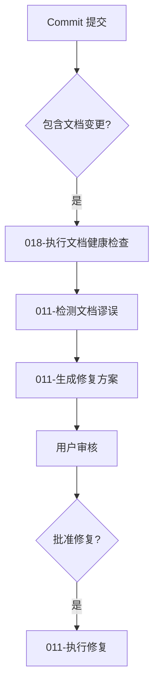

# 011 - 文档谬误修复工作流使用指南

**优化点**: 011-文档谬误修复工作流
**状态**: 🟢 已确认 (2026-04-13)

---

## 📖 概述

011 文档谬误修复工作流提供了一套标准化的文档修复流程，结合 Git 版本控制和 AI 辅助功能，帮助用户快速发现和修复文档中的错误。

### 核心功能
- **自动关联文档检测**: 基于 dependencies 字段快速找到相关文档
- **分级修复策略**: P0-P3 分级处理，平衡效率与安全性
- **Git 集成修复管理**: 完整的修复历史和回滚支持
- **批量修复模式**: 支持全局术语统一和批量修复

---

## 🚀 快速开始

### 前提条件
- 项目使用 Git 版本控制
- 文档包含正确的 YAML Frontmatter 摘要
- 已安装 Python 3.8+（推荐）或 Node.js 16+

### 安装和配置
```bash
# 安装依赖（Python 版本）
pip install -r requirements.txt

# 安装依赖（Node.js 版本）
npm install

# 配置系统
cp .aicc/config.sample.yaml .aicc/config.yaml
```

---

## 📝 基本使用流程

### 1. 发现并报告谬误

#### 1.1 简单模式（直接向 AI 报告）
```markdown
【发送给 AI】

我发现文档存在错误:

**文档**: dev_docs/api_layer.md
**位置**: "API 调用"章节，第 45 行
**错误内容**: 示例中使用了 `getUserInfo()`
**正确内容**: 应该使用 `fetchUserProfile()`
**代码依据**: src/api/user.ts:L23
**严重性**: P0 (API 函数名错误)

请帮我修正这个错误，并检查是否有其他文档也引用了错误的函数名。
```

#### 1.2 命令行模式（使用工具）
```bash
# 1. 检测关联文档
python tools/py/doc_dependency_tracer.py --doc "dev_docs/api_layer.md" --strategy all

# 2. 生成修复方案
python tools/py/batch_fix_manager.py --generate --pattern "getUserInfo()" --replacement "fetchUserProfile()"

# 3. 执行修复
python tools/py/batch_fix_manager.py --execute --plan "dev_docs/_analysis/doc_fix_plan_20260413.md"

# 4. 管理 Git 修复过程
python tools/py/manage_fix_with_git.py --start --branch-name "doc-fix-api-function"
python tools/py/manage_fix_with_git.py --commit --message "fix: 修复 API 函数名错误 getUserInfo() → fetchUserProfile()"
```

---

### 2. AI 分析与修复方案生成

#### 2.1 关联文档检测
AI 会自动分析影响范围：
```
## 📋 修复方案

### 🔍 影响分析
- 发现关联文档: 3 个
  - dev_docs/api_layer.md (直接)
  - dev_docs/state_management.md (间接)
  - dev_docs/user_profile.md (语义关联)

### 🛠️ 修复清单
- [ ] dev_docs/api_layer.md: 第 45 行 - 函数名修正
- [ ] dev_docs/state_management.md: 第 120 行 - 引用更新
- [ ] dev_docs/user_profile.md: 第 78 行 - 示例代码更新
```

#### 2.2 修复方案审核
```markdown
【AI 提供的修复方案】

---

## 📋 修复方案审核

### 修复目标
- 文档: dev_docs/api_layer.md, dev_docs/state_management.md, dev_docs/user_profile.md
- 修正内容: getUserInfo() → fetchUserProfile()

### 风险评估
- 高风险: 影响 3 个文档，需仔细审核
- 语义关联: user_profile.md 为语义关联，建议人工确认

### 修复预览
```diff
--- a/dev_docs/api_layer.md
+++ b/dev_docs/api_layer.md
@@ -42,7 +42,7 @@ API 调用示例:

 ```typescript
 // 获取用户信息
-const user = await getUserInfo();
+const user = await fetchUserProfile();
 console.log(user);
 ```
```

---

### 3. 执行修复

#### 3.1 手动执行
```bash
# 执行修复（Python 版本）
python tools/py/batch_fix_manager.py --execute --plan "dev_docs/_analysis/doc_fix_plan_20260413.md"

# 执行修复（Node.js 版本）
node tools/js/batch_fix_manager.js --execute --plan "dev_docs/_analysis/doc_fix_plan_20260413.md"
```

#### 3.2 自动执行（快速修复模式）
```bash
# 自动执行低风险修复（P2/P3）（Python 版本）
python tools/py/batch_fix_manager.py --execute --plan "dev_docs/_analysis/doc_fix_plan_20260413.md" --auto

# 自动执行低风险修复（P2/P3）（Node.js 版本）
node tools/js/batch_fix_manager.js --execute --plan "dev_docs/_analysis/doc_fix_plan_20260413.md" --auto
```

---

### 4. 修复历史和回滚

#### 4.1 查看修复历史
```bash
# 查看所有修复历史（Python 版本）
python tools/py/fix_history_manager.py --query

# 查看所有修复历史（Node.js 版本）
node tools/js/fix_history_manager.js --query

# 查看特定修复的详细信息（Python 版本）
python tools/py/fix_history_manager.py --query --commit "a1b2c3d"

# 查看特定修复的详细信息（Node.js 版本）
node tools/js/fix_history_manager.js --query --commit "a1b2c3d"
```

#### 4.2 回滚修复
```bash
# 回滚到修复前状态（Python 版本）
python tools/py/manage_fix_with_git.py --rollback --commit-hash "a1b2c3d"

# 回滚到修复前状态（Node.js 版本）
node tools/js/manage_fix_with_git.js --rollback --commit-hash "a1b2c3d"
```

---

## 🎯 高级功能

### 1. 批量修复模式

#### 1.1 全局术语统一
```bash
# 批量修复术语不一致（Python 版本）
python tools/py/batch_fix_manager.py --generate --pattern "用户 ID" --replacement "userId"
python tools/py/batch_fix_manager.py --execute --plan "dev_docs/_analysis/doc_fix_plan_20260413.md"

# 批量修复术语不一致（Node.js 版本）
node tools/js/batch_fix_manager.js --generate --pattern "用户 ID" --replacement "userId"
node tools/js/batch_fix_manager.js --execute --plan "dev_docs/_analysis/doc_fix_plan_20260413.md"
```

#### 1.2 修复方案预览
```bash
# 预览批量修复效果（Python 版本）
python tools/py/batch_fix_manager.py --generate --pattern "用户 ID" --replacement "userId"
python tools/py/batch_fix_manager.py --preview --plan "dev_docs/_analysis/doc_fix_plan_20260413.md"

# 预览批量修复效果（Node.js 版本）
node tools/js/batch_fix_manager.js --generate --pattern "用户 ID" --replacement "userId"
node tools/js/batch_fix_manager.js --preview --plan "dev_docs/_analysis/doc_fix_plan_20260413.md"
```

---

### 2. 关联检测策略配置

#### 2.1 调整关联检测敏感度
```yaml
# .aicc/config.yaml
association_detection:
  # 语义关联最小重叠度（默认: 1）
  keyword_overlap_threshold: 2
  # 是否启用语义关联（默认: false）
  enable_semantic_association: true
```

#### 2.2 配置关联文档权重
```yaml
# .aicc/config.yaml
document_weights:
  dev_docs/api_layer.md: 1.5
  dev_docs/state_management.md: 1.2
```

---

### 3. 修复流程自动化

#### 3.1 与 Commit-Guided 更新集成


#### 3.2 定期检查和修复
```bash
# 每日定时检查和修复（Python 版本）
0 9 * * * python tools/py/ai_doc_fix.py check --schedule daily --auto-fix P2

# 每日定时检查和修复（Node.js 版本）
0 9 * * * node tools/js/ai_doc_fix.js check --schedule daily --auto-fix P2
```

---

## 🛠️ 工具和命令

### 主要工具命令

#### 1. 文档依赖追踪器
```bash
# 检测关联文档（Python 版本）
python tools/py/doc_dependency_tracer.py --doc <文档路径> --strategy {dependencies|keywords|fulltext|all}

# 检测关联文档（Node.js 版本）
node tools/js/doc_dependency_tracer.js --doc <文档路径> --strategy {dependencies|keywords|fulltext|all}
```

#### 2. Git 修复管理器
```bash
# 检查 Git 状态（Python 版本）
python tools/py/manage_fix_with_git.py --check-status

# 创建修复分支（Python 版本）
python tools/py/manage_fix_with_git.py --start --branch-name "doc-fix-<描述>"

# 提交修复（Python 版本）
python tools/py/manage_fix_with_git.py --commit --message "fix: <修复描述>"

# 回滚修复（Python 版本）
python tools/py/manage_fix_with_git.py --rollback --commit-hash <提交哈希>
```

#### 3. 批量修复管理器
```bash
# 生成修复方案（Python 版本）
python tools/py/batch_fix_manager.py --generate --pattern <错误内容> --replacement <正确内容>

# 执行修复（Python 版本）
python tools/py/batch_fix_manager.py --execute --plan <修复方案路径> --auto

# 预览修复效果（Python 版本）
python tools/py/batch_fix_manager.py --preview --plan <修复方案路径>
```

#### 4. 修复历史管理器
```bash
# 记录修复历史（Python 版本）
python tools/py/fix_history_manager.py --record --commit <提交哈希> --target-docs <文档列表>

# 查询修复历史（Python 版本）
python tools/py/fix_history_manager.py --query --commit <提交哈希>

# 查询统计信息（Python 版本）
python tools/py/fix_history_manager.py --stats
```

#### 5. 语义关联检测器
```bash
# 检测语义关联文档（Python 版本）
python tools/py/semantic_related_detector.py --doc <文档路径> --min-overlap 2
```

### 高级选项

#### 配置文件
```yaml
# .aicc/config.yaml
association_detection:
  keyword_overlap_threshold: 2
  enable_semantic_association: true

batch_fix:
  default_batch_size: 10
  auto_approve: false

git_integration:
  auto_branch_creation: true
  branch_prefix: "doc-fix-"
```

---

## 📊 性能优化

### 1. 缓存机制
```bash
# 启用缓存（Python 版本）
python tools/py/ai_doc_fix.py --cache apply --plan <修复方案路径>

# 启用缓存（Node.js 版本）
node tools/js/ai_doc_fix.js --cache apply --plan <修复方案路径>
```

### 2. 增量检测
```bash
# 增量检测（只检查变更的文档）（Python 版本）
python tools/py/ai_doc_fix.py detect --doc <文档路径> --incremental

# 增量检测（只检查变更的文档）（Node.js 版本）
node tools/js/ai_doc_fix.js detect --doc <文档路径> --incremental
```

---

## 🚩 常见问题

### Q1: 关联检测不准确怎么办？
**A**: 检查文档是否包含正确的 dependencies 和 keywords 字段。可以使用 --strategy 参数指定检测策略。

### Q2: 修复过程中遇到 Git 状态问题？
**A**: 确保 Git 工作区干净，或使用 `git stash` 暂存更改。

### Q3: 如何处理误报的关联文档？
**A**: 在修复方案审核阶段，手动取消误报文档的选中状态。

### Q4: 修复过程中遇到错误？
**A**: 使用 `--debug` 选项查看详细日志，或提交 Issue 报告问题。

---

## 📈 示例场景

### 场景 1: 修复 API 函数名错误
```bash
# 1. 报告错误（Python 版本）
python tools/py/ai_doc_fix.py report --doc "dev_docs/api_layer.md" --location "API 调用章节" --error "getUserInfo()" --correct "fetchUserProfile()" --severity "P0"

# 1. 报告错误（Node.js 版本）
node tools/js/ai_doc_fix.js report --doc "dev_docs/api_layer.md" --location "API 调用章节" --error "getUserInfo()" --correct "fetchUserProfile()" --severity "P0"

# 2. 生成修复方案（Python 版本）
python tools/py/ai_doc_fix.py plan --doc "dev_docs/api_layer.md" --errors "[\"getUserInfo()\"]"

# 2. 生成修复方案（Node.js 版本）
node tools/js/ai_doc_fix.js plan --doc "dev_docs/api_layer.md" --errors "[\"getUserInfo()\"]"

# 3. 执行修复（Python 版本）
python tools/py/ai_doc_fix.py apply --plan "dev_docs/_analysis/doc_fix_plan_20260413.md"

# 3. 执行修复（Node.js 版本）
node tools/js/ai_doc_fix.js apply --plan "dev_docs/_analysis/doc_fix_plan_20260413.md"
```

### 场景 2: 批量修复术语不一致
```bash
# 1. 预览修复效果（Python 版本）
python tools/py/ai_doc_fix.py batch --pattern "用户 ID" --replacement "userId" --severity "P1" --preview

# 1. 预览修复效果（Node.js 版本）
node tools/js/ai_doc_fix.js batch --pattern "用户 ID" --replacement "userId" --severity "P1" --preview

# 2. 执行修复（Python 版本）
python tools/py/ai_doc_fix.py batch --pattern "用户 ID" --replacement "userId" --severity "P1"

# 2. 执行修复（Node.js 版本）
node tools/js/ai_doc_fix.js batch --pattern "用户 ID" --replacement "userId" --severity "P1"
```

---

## 📚 相关资源

### 开发文档
- [011-文档谬误修复工作流.md](./011-doc-error-fix-workflow.md)
- [011-实施方案.md](./implementation_plan.md)

### 相关优化点
- [006-自动审查报告](./../006-auto-review-report/006-auto-review-report.md)
- [009-文档自动修复](./../../pending/009-doc-auto-repair.md)
- [018-Commit-Guided 更新](./../018-commit-guided-documentation/018-commit-guided-documentation.md)

---

**文档版本**: v1.0
**最后更新**: 2026-04-13
**维护者**: AI 助手
