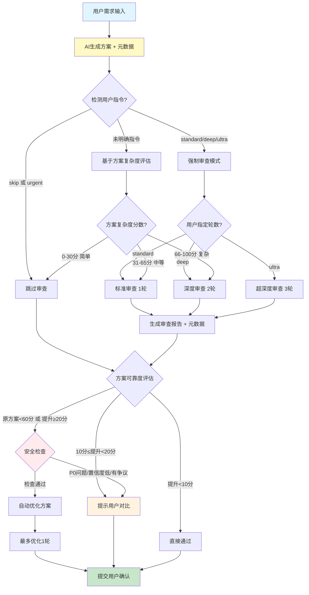

# 013 - AI 互审机制 (工作流编排器)

**优先级**: P0  
**状态**: ✅ 已完成  
**预估工作量**: 1 周  
**来源**: 《AI 编程的现状.md》方法 1 + 《AI_PROGRAMMING_ANALYSIS.md》  
**依赖**: 001 (AI 角色库) - 需要 `plan_reviewer` 角色  
**实施顺序**: 在 001 完成后实施  
**最后更新**: 2025-12-02

---

## 📋 问题描述

### 核心定位

> **重要**: 本优化点定位为**工作流编排器**，负责协调审查流程，而非实现具体审查角色。

**职责划分**:

- **本优化点 (013)**: 工作流编排 + 复杂度评估 + 分级审查机制 + 自动判断逻辑
- **001 (AI 角色库)**: 提供 `plan_reviewer` 角色的具体实现

**依赖关系**: 必须在 001 完成后实施

### 审核范围

013 不仅审核"首次建立文档体系的方案"，而是审核**所有方案类场景**：

| 场景                 | 方案位置                                | 是否需要 013 审核？   |
| -------------------- | --------------------------------------- | --------------------- |
| **初次建立文档体系** | `dev_docs/_analysis/generation_plan.md` | ✅ 是（如果项目复杂） |
| **新功能开发**       | `dev_docs/plans/features/xxx.md`        | ✅ 是（日常主要场景） |
| **Bug 修复**         | `dev_docs/plans/bugs/xxx.md`            | ✅ 是（根据复杂度）   |
| **架构重构**         | `dev_docs/plans/refactoring/xxx.md`     | ✅ 是（必须深度审查） |
| **文档更新**         | 简单更新                                | ❌ 否（通常跳过）     |

### 原文观点

> "还是得把一个独立的第三方带入到 1V1 的 AI 编程流程中去，时刻地去监管和反馈。这个第三方一般来说要么是一个资深的开发者，要么是另一个同样智能等级的生成式 AI。这种对抗式编程一般能消除单一模型的鬼打墙现象（尤其是自己写的 bug 自己找不出这种）。"

### 核心痛点

1. **单一 AI 的盲点**

   - AI 生成的代码可能有自己发现不了的问题
   - "鬼打墙"现象：重复犯同样的错误
   - 缺少外部视角的审查

2. **人工审查的局限**

   - 需要人类有足够经验和时间
   - 审查质量不稳定
   - 无法实时进行

3. **不是所有方案都需要深度审查**

   - 简单修改不需要 AI 审查，浪费 Token
   - 复杂变更必须深度审查，否则风险高
   - 缺少智能分级机制

4. **V2.3 的现状**
   - 有方案生成+人工审核机制
   - 缺少 AI 层面的互审
   - 缺少复杂度评估和分级审查
   - 缺少基于可靠度的自动决策
   - 评分: ⭐⭐⭐⭐ (4/5)

---

## 💡 解决方案

### 核心设计理念

**参考 Claude Code 的分级思考模式**:

- Claude Code: `think hard` / `think harder` / `ultra think`
- 本框架: `快速模式` / `标准审查` / `深度审查`

**用户指令优先原则** ⭐:

1. 用户明确要求审查 → 执行审查（忽略复杂度评估）
2. 用户明确要求跳过 → 跳过审查（忽略复杂度评估）
3. 用户未明确 → AI 自动评估复杂度 → 分级审查

**可靠度驱动决策** 🆕:

- AI 生成方案时包含**可靠度自评** (0-100 分)
- AI 审核时提供**提升度评估** (能提升多少分)
- 框架根据**可靠度差异**自动判断是否需要修改

### 工作流程图



### 核心流程详解

#### 1. 用户指令识别（优先级最高）

**用户指令语法** (参考 Claude Code):

```markdown
# 明确要求审查

"请审查这个方案"
"需要深度审查"
"再检查一遍"
"再确认一下"
"@review:standard" (标准审查 1 轮)
"@review:deep" (深度审查 2 轮)
"@review:ultra" (超深度审查 3 轮)

# 明确跳过审查

"跳过审查"
"不需要审查"
"@review:skip"

# 紧急情况

"@urgent" 或 "@hotfix" (跳过审查但记录"未审核"标记)

# 未明确 → 自动评估复杂度

正常描述需求，无特殊指令
```

#### 2. 复杂度自动评估（仅在用户未明确时）

**混合评估模式** (结合静态分析和 AI 判断):

```markdown
### 静态分析 (依赖 017 脚本库) - 权重 40%

- 使用 git diff 统计影响文件数
- 使用 AST 分析估算代码行数
- 检测核心文件修改 (如 auth/, database/, payment/)
- 检测破坏性变更 (API 签名变更等)

### AI 语义分析 - 权重 60%

- 评估变更的"语义复杂度"
- 识别业务逻辑复杂度
- 评估上下文相关性
- 识别潜在风险点

### 综合判定

输出: 复杂度分数 (0-100) + 分级建议 (简单/中等/复杂)
```

**复杂度分级标准**:

```markdown
**简单** (0-30 分, 跳过 AI 审查):

- 单文件修改 (≤50 行)
- 简单 bug 修复 (逻辑错误、拼写错误)
- 配置调整 (环境变量、参数调整)
- 文档更新

**中等** (31-65 分, 标准审查 1 轮):

- 多文件修改 (2-5 个文件)
- 新增小功能 (≤200 行)
- 局部重构 (单个模块内)
- API 调整 (非破坏性)

**复杂** (66-100 分, 深度审查 2 轮):

- 架构变更 (影响多个模块)
- 核心模块修改 (认证、支付、数据库)
- 跨模块功能 (≥5 个文件)
- 破坏性 API 变更
- 性能关键路径修改
```

#### 3. 方案生成阶段

**方案文件结构** (包含元数据):

```markdown
---
# === 方案元数据 ===
plan_metadata:
  # 基础信息
  plan_id: "PLAN-2025-1202-001" # 唯一标识
  plan_type: "feature" # feature/bugfix/refactor/doc
  round: 1 # 第几轮方案
  timestamp: "2025-12-02 16:10:00" # 生成时间
  author: "AI-Generator-GPT4" # 生成者标识
  status: "pending" # pending/approved/rejected/implementing/completed

  # 质量评估
  reliability: 75 # 可靠度自评 (0-100)
  risk_level: "medium" # low/medium/high/critical
  complexity_score: 65 # 复杂度分数 (0-100)

  # 影响范围
  affected_files_count: 5 # 影响文件数量
  estimated_loc_change: 200 # 预估代码行变更
  core_modules_touched: false # 是否触及核心模块
  breaking_change: false # 是否破坏性变更

  # 可追溯性
  parent_plan_id: null # 父方案ID (改进版本才有)
  iteration_history: [] # 迭代历史
---

# 方案标题

## 背景与目标

...

## 技术方案

...

## 实施步骤

...

## 风险评估

...
```

#### 4. AI 互审阶段（依赖 001 的 plan_reviewer 角色）

**快速模式** (跳过审查):

```markdown
直接生成方案 → 人类审核
```

**标准审查** (1 轮):

```markdown
**AI 审查者** (来自 001/runtime/plan_reviewer.md)
└── 输入: 生成的方案 + 审核标准
└── 审查清单 (根据方案类型选择标准):
├── 是否符合 AI 编码禁忌？
├── 是否引入不必要复杂性？
├── 是否有更优方案？
├── 是否考虑错误处理？
├── 是否考虑性能影响？
├── 是否考虑安全风险？
└── 是否更新相关文档？
└── 输出: 审核报告 (1 轮) + 元数据
```

**深度审查** (2 轮):

```markdown
**第 1 轮审查**
└── 基础审查清单 (同标准审查)
└── 输出: 第 1 轮审查报告

**第 2 轮审查** (更严格的标准)
└── 输入: 方案 + 第 1 轮报告
└── 深度审查清单:
├── 是否有架构层面的问题？
├── 是否考虑所有边界情况？
├── 是否有更优的替代方案？
├── 是否评估长期技术债？
├── 是否考虑可测试性？
└── 是否考虑可维护性？
└── 输出: 第 2 轮深度审查报告
```

**审核报告结构** (包含元数据):

```markdown
---
# === 审核报告元数据 ===
review_metadata:
  # 基础信息
  review_id: "REV-2025-1202-001" # 审核ID
  plan_id: "PLAN-2025-1202-001" # 对应的方案ID
  reviewer: "AI-Reviewer-Claude" # 审核者标识
  timestamp: "2025-12-02 16:15:00" # 审核时间
  round: 1 # 第几轮审核
  review_standard: "feature_review" # 使用的审核标准

  # 质量评估
  improvement_potential: 20 # 提升度 (0-100)
  current_reliability: 75 # 原方案可靠度
  estimated_new_reliability: 95 # 修改后预期可靠度
  confidence_level: 0.85 # 审核者对自己判断的置信度 ⭐

  # 问题统计
  issues_found: 5 # 发现问题总数
  p0_issues: 1 # P0严重问题数
  p1_issues: 2 # P1问题数
  p2_issues: 2 # P2问题数

  # 决策辅助
  has_controversial_suggestions: false # 是否有争议性建议
  auto_fix_safe: true # 是否安全自动修复
  requires_human_decision: false # 是否强制需要人工决策

  # 审核质量
  review_completeness: 0.95 # 审核完整度
  review_depth: "standard" # quick/standard/deep

  # 关联信息
  referenced_standards: ["feature_review_standard.md"]
  similar_cases: ["PLAN-2025-1120-003"] # 历史相似案例
---

# 审核报告

## 审核概览

...

## 发现的问题

### 🔴 P0 严重问题 (1 个)

...

### 🟡 P1 重要问题 (2 个)

...

### 🔵 P2 建议 (2 个)

...

## 改进建议

...
```

#### 5. 可靠度自动判断 🆕 核心创新

**判断逻辑** (考虑所有边界情况):

```python
def should_auto_fix(plan, review):
    """
    判断是否自动修改方案
    返回: (是否自动修改, 原因说明)
    """

    # === 强制人工介入的情况 (最高优先级) ===

    if review.p0_issues > 0:
        return False, "发现P0严重问题，需要人工确认"

    if plan.breaking_change and not plan.user_override:
        return False, "破坏性变更，需要人工评估影响"

    # === 安全检查 ===

    if review.confidence_level < 0.6:
        return False, "审核置信度过低，需要人工复核"

    if review.has_controversial_suggestions:
        return False, "存在争议性建议，需要人工判断"

    if review.estimated_new_reliability < plan.reliability:
        return False, "审核后可靠度反降，疑似误判"

    # === 优化: 方案已足够好，跳过修改 ===

    if plan.reliability >= 90 and review.improvement_potential < 10:
        return False, "方案已优秀，无需修改"

    # === 核心判断逻辑 ===

    if plan.reliability < 60:
        return True, "原方案可靠度不达标，自动优化"

    if review.improvement_potential >= 20:
        return True, "提升空间显著(≥20分)，自动优化"

    # === 默认: 提升有限，交给用户 ===

    if 10 <= review.improvement_potential < 20:
        return False, f"提升有限({review.improvement_potential}分)，建议用户对比阅读"

    return False, "提升度小于10分，直接通过"
```

**可靠度差异阈值定义**:

```yaml
可靠度差异判定规则:

  情况1: 提升度 ≥ 20分 (提升显著)
    → 自动触发方案优化
    → 理由: 审核者认为有重大改进空间

  情况2: 10 ≤ 提升度 < 20分 (提升中等)
    → 提示用户对比阅读
    → 建议: "审核者提出了一些改进建议(可提升XX分)，请评估是否采纳"

  情况3: 提升度 < 10分 (提升有限)
    → 直接通过，不打扰用户
    → 理由: 方案已足够可靠

  特殊情况: 原方案可靠度 < 60分
    → 无论提升度多少，都自动优化
    → 理由: 原方案质量不达标
```

**边界情况完善** ⭐:

```markdown
### 边界情况 1: 审核者置信度过低

条件: confidence_level < 0.6
处理: 即使提升度 ≥20，也转为"人工对比"
理由: 审核者自己都不确定，不应自动修改

### 边界情况 2: 发现 P0 问题

条件: p0_issues > 0
处理: 强制人工介入 (无论可靠度多少)
理由: P0 问题可能导致严重后果
示例: 硬编码密钥、SQL 注入风险

### 边界情况 3: 破坏性变更

条件: breaking_change = true
处理: 强制深度审查 + 人工确认
理由: 影响范围大，需要谨慎决策

### 边界情况 4: 原方案已经很好

条件: reliability ≥ 90 且 improvement_potential < 10
处理: 跳过修改，直接通过
优化: 节省 token，不打扰用户

### 边界情况 5: 审核后反而降低可靠度

条件: estimated_new_reliability < current_reliability
处理: 拒绝自动修改，警告用户
理由: 审核者可能理解错误

### 边界情况 6: 用户时间紧急

条件: 用户标注 @urgent 或 @hotfix
处理: 跳过审核，但记录"未审核"标记
理由: 紧急情况优先，事后补审
```

#### 6. 改进循环（可选，最多 1 轮）

**循环控制**:

```markdown
如果自动判断需要优化:
AI 生成者 → 阅读审核报告 → 改进方案 → 输出新方案

**严格限制**:

- 最多 1 轮改进
- 改进后直接交用户确认
- 不再进行第二次审核 (避免无限循环)

**智能终止条件** 🆕:

1. ✅ 完成 1 轮改进
2. ✅ 改进后方案质量下降 → 标记为"无法自动改进"，交由人类
3. ✅ 改进超时 (>2 分钟) → 保存当前进度，交由人类
```

#### 7. 用户决策

**用户看到的输出格式** 🆕:

```markdown
╔══════════════════════════════════════════╗
║ 📊 审核完成 ║
╚══════════════════════════════════════════╝

📄 方案: PLAN-2025-1202-001 (功能开发)
🕐 审核时间: 2025-12-02 16:15:05
🤖 审核者: AI-Reviewer (Claude-3.5)

─────────────────────────────────────────

📈 可靠度评估:
原方案: ⭐⭐⭐⭐⭐⭐⭐ 75/100
预期提升: +20 分 → 95/100 ⭐⭐⭐⭐⭐⭐⭐⭐⭐

🔍 发现问题:
🔴 P0 严重: 1 个 - 硬编码数据库密码
🟡 P1 重要: 2 个 - 缺少错误处理、性能风险
🔵 P2 建议: 2 个 - 注释不完善、命名优化

─────────────────────────────────────────

💡 建议行动:

✅ 【自动修改】提升空间显著(+20 分)，已自动优化方案
→ 新方案已生成，请对比查看改进内容
→ 如不满意，可回滚到原方案

⚠️ 注意: 发现 1 个 P0 严重问题，请务必确认修复!

─────────────────────────────────────────

📎 详细审核报告: dev_docs/plans/features/xxx_review.md
📎 原方案: dev_docs/plans/features/xxx_v1.md
📎 优化后方案: dev_docs/plans/features/xxx_v2.md
```

**用户可选操作**:

```markdown
1. ✅ 批准改进后的方案 → 执行编码
2. 🔄 回滚到原方案 → 手动调整
3. 📝 提供反馈 → AI 再次改进
4. ❌ 拒绝方案 → 重新规划
```

---

## 🎯 分场景审核标准库

### 标准存放位置

```
workflows/review_standards/
├── feature_review_standard.md      # 功能开发审核标准
├── bugfix_review_standard.md       # Bug修复审核标准
├── refactor_review_standard.md     # 架构重构审核标准
└── doc_review_standard.md          # 文档更新审核标准
```

### 功能开发标准 (feature_review_standard.md)

```markdown
# 功能开发审核标准

## 审核清单 (权重分配)

### 1. 架构一致性 (权重: 25%)

- [ ] 是否符合现有架构？
- [ ] 是否遵循项目设计模式？
- [ ] 是否破坏模块边界？

### 2. 技术债评估 (权重: 20%)

- [ ] 是否引入不必要复杂性？
- [ ] 是否有过度设计？
- [ ] 是否考虑未来可扩展性？

### 3. 质量保证 (权重: 15%)

- [ ] 是否有测试计划？
- [ ] 是否考虑错误处理？
- [ ] 是否有边界检查？

### 4. 性能影响 (权重: 10%)

- [ ] 是否评估性能影响？
- [ ] 是否优化关键路径？
- [ ] 是否考虑资源消耗？

### 5. 安全风险 (权重: 15%)

- [ ] 是否有安全漏洞？
- [ ] 是否正确处理敏感数据？
- [ ] 是否有权限控制？

### 6. 文档完整性 (权重: 10%)

- [ ] 是否更新相关文档？
- [ ] 是否有 API 文档？
- [ ] 是否有使用示例？

### 7. 可维护性 (权重: 5%)

- [ ] 代码是否清晰易懂？
- [ ] 是否有适当注释？
- [ ] 命名是否规范？

## 合格标准

- **合格线**: ≥ 70 分
- **优秀线**: ≥ 85 分
```

### Bug 修复标准 (bugfix_review_standard.md)

```markdown
# Bug 修复审核标准

## 审核清单 (权重分配)

### 1. 根因分析 (权重: 30%)

- [ ] 是否准确定位根因？
- [ ] 是否排除表象原因？
- [ ] 是否有根因分析文档？

### 2. 修复方式 (权重: 25%)

- [ ] 是否修复而非绕过？
- [ ] 是否解决类似问题？
- [ ] 是否有最小化修改？

### 3. 影响范围 (权重: 20%)

- [ ] 是否引入新问题？
- [ ] 是否影响其他模块？
- [ ] 是否有完整回归测试？

### 4. 知识沉淀 (权重: 15%)

- [ ] 是否记录到 knowledge/troubleshooting？
- [ ] 是否总结防范措施？
- [ ] 是否更新相关文档？

### 5. 验证方案 (权重: 10%)

- [ ] 是否有复现步骤？
- [ ] 是否有单元测试？
- [ ] 是否有验收标准？

## 合格标准

- **合格线**: ≥ 75 分 (Bug 修复要求更严格)
- **优秀线**: ≥ 90 分
```

### 架构重构标准 (refactor_review_standard.md)

```markdown
# 架构重构审核标准

## 审核清单 (权重分配)

### 1. 充分理由 (权重: 20%)

- [ ] 是否有充分的重构理由？
- [ ] 是否量化收益？
- [ ] 是否评估成本 vs 收益？

### 2. 影响评估 (权重: 20%)

- [ ] 是否评估影响范围？
- [ ] 是否有依赖分析？
- [ ] 是否有风险评估矩阵？

### 3. 回滚方案 (权重: 18%)

- [ ] 是否有完整回滚方案？
- [ ] 是否测试过回滚流程？
- [ ] 是否有数据回滚方案？

### 4. 分阶段实施 (权重: 15%)

- [ ] 是否分阶段实施？
- [ ] 是否有里程碑划分？
- [ ] 是否可增量部署？

### 5. 架构决策记录 (权重: 12%)

- [ ] 是否记录 ADR？
- [ ] 是否说明决策理由？
- [ ] 是否评估替代方案？

### 6. 质量保证 (权重: 15%)

- [ ] 是否提升性能？
- [ ] 是否降低复杂度？
- [ ] 是否提升安全性？

## 合格标准

- **合格线**: ≥ 80 分 (架构变更要求最严格)
- **优秀线**: ≥ 95 分
```

---

## 🔗 与其他优化点的集成

### 与 002 (危险指令拦截) 的交互

**优先级规则**: 002 > 013

```markdown
场景: 用户要求"删除所有日志文件"
流程:

1. 002 拦截 → 识别为危险指令
2. 002 强制要求生成方案 (不允许直接执行)
3. 013 审核方案 → 发现风险 → 降低可靠度
4. 双重保险: 002 拦截 + 013 审核

特殊情况:

- 即使用户明确要求 @review:skip
- 如果 002 识别为危险指令
- 仍会强制启用深度审查 (忽略用户指令)
```

### 与 012 (强制摘要) 的协同

**审核报告摘要生成**:

```markdown
场景: 审核报告超过 500 行
流程:

1. 013 生成审核报告
2. 012 检测到超长 → 强制生成摘要
3. 用户先看摘要 → 决定是否展开详情

摘要格式:
```

## 审核摘要 (自动生成)

- 原方案可靠度: 75 分
- 预期提升度: +20 分 → 95 分
- P0 问题: 1 个 (硬编码密钥)
- P1 问题: 2 个 (缺少错误处理、性能风险)
- P2 问题: 2 个 (注释不完善、命名优化)
- 建议: 建议自动修改后再执行
- 详细报告: 点击展开查看完整审核清单

```

```

### 与 016 (配置系统) 的集成

**用户可配置审核行为**:

```yaml
# config/user_config.md

review:
  # 可靠度阈值
  reliability_threshold: 70 # 低于此分数强制审核
  auto_fix_threshold: 20 # 提升度超过此值自动修改
  confidence_required: 0.7 # 审核者最低置信度要求

  # 场景配置
  always_review_types: ["refactor"] # 这些类型必须审查
  skip_review_types: ["doc"] # 这些类型跳过审查

  # 审核深度
  default_review_mode: "auto" # auto/standard/deep/skip

  # 核心模块保护
  core_modules: # 修改这些模块强制深度审查
    - "auth/*"
    - "payment/*"
    - "database/*"
```

---

## 🛠️ 技术实现

### 核心组件架构

```python
# mutual_review_coordinator.py

class MutualReviewCoordinator:
    """AI互审工作流编排器"""

    def __init__(self, agent_library, config, script_library):
        self.agent_library = agent_library  # 依赖001的AI角色库
        self.config = config                # 依赖016的配置系统
        self.script_library = script_library # 依赖017的脚本库
        self.plan_reviewer = agent_library.get_agent('plan_reviewer')

    def process_request(self, user_request, project_context):
        """处理用户请求，协调审查流程"""

        # 1. 识别用户指令
        review_mode = self.detect_user_command(user_request)

        if review_mode == 'skip':
            return self.quick_mode(user_request, project_context)
        elif review_mode in ['standard', 'deep', 'ultra']:
            return self.review_mode(user_request, project_context, review_mode)
        else:
            # 2. 自动评估复杂度
            complexity = self.assess_complexity(user_request, project_context)
            return self.auto_mode(user_request, project_context, complexity)

    def detect_user_command(self, user_request):
        """检测用户指令"""
        patterns = {
            'skip': ['跳过审查', '不需要审查', '@review:skip'],
            'standard': ['@review:standard', '标准审查'],
            'deep': ['@review:deep', '深度审查', '请审查'],
            'ultra': ['@review:ultra', '超深度审查'],
            'urgent': ['@urgent', '@hotfix']  # 紧急情况
        }

        for mode, keywords in patterns.items():
            if any(kw in user_request for kw in keywords):
                return mode
        return None

    def assess_complexity(self, user_request, project_context):
        """混合评估复杂度 (静态分析 + AI判断)"""

        # 静态分析 (权重40%, 依赖017脚本库)
        static_analysis = self.script_library.analyze_change_scope(
            user_request, project_context
        )
        static_score = self.calculate_static_score(static_analysis)

        # AI语义分析 (权重60%)
        ai_prompt = f"""
        评估以下需求的复杂度（0-100分）:

        需求: {user_request}
        项目上下文: {project_context}
        静态分析结果: {static_analysis}

        评估维度:
        - 业务逻辑复杂度
        - 语义复杂度
        - 潜在风险
        - 上下文相关性

        输出格式:
        语义复杂度分数: [0-100]
        理由: [具体原因]
        """
        ai_result = call_ai(ai_prompt)
        ai_score = ai_result['score']

        # 综合判定
        final_score = static_score * 0.4 + ai_score * 0.6
        complexity_level = self.score_to_level(final_score)

        return {
            'score': final_score,
            'level': complexity_level,
            'static_score': static_score,
            'ai_score': ai_score,
            'reason': ai_result['reason']
        }

    def calculate_static_score(self, static_analysis):
        """根据静态分析结果计算复杂度分数"""
        score = 0

        # 文件数量
        if static_analysis['file_count'] >= 10:
            score += 40
        elif static_analysis['file_count'] >= 5:
            score += 25
        elif static_analysis['file_count'] >= 2:
            score += 10

        # 代码行数
        if static_analysis['loc_change'] >= 500:
            score += 30
        elif static_analysis['loc_change'] >= 200:
            score += 15
        elif static_analysis['loc_change'] >= 50:
            score += 5

        # 核心模块
        if static_analysis['core_modules_touched']:
            score += 20

        # 破坏性变更
        if static_analysis['breaking_change']:
            score += 10

        return min(score, 100)  # 最高100分

    def score_to_level(self, score):
        """分数转换为复杂度等级"""
        if score >= 66:
            return '复杂'
        elif score >= 31:
            return '中等'
        else:
            return '简单'

    def quick_mode(self, user_request, project_context):
        """快速模式：跳过AI审查"""
        plan = self.generate_plan(user_request, project_context)
        return {
            'plan': plan,
            'review_reports': [],
            'mode': 'quick',
            'decision': 'direct_to_user'
        }

    def review_mode(self, user_request, project_context, mode):
        """审查模式：标准/深度/超深度"""
        rounds_map = {'standard': 1, 'deep': 2, 'ultra': 3}
        max_rounds = rounds_map[mode]

        # 生成方案
        plan = self.generate_plan(user_request, project_context, mode)
        review_reports = []

        # 多轮审查
        for round_num in range(1, max_rounds + 1):
            # 选择审核标准
            review_standard = self.select_review_standard(plan['metadata']['plan_type'])

            # 调用001的plan_reviewer角色
            review_report = self.plan_reviewer.review(
                plan=plan,
                standard=review_standard,
                previous_reports=review_reports,
                round_num=round_num
            )
            review_reports.append(review_report)

        # 可靠度自动判断
        decision = self.auto_decision(plan, review_reports[-1])

        return {
            'plan': plan,
            'review_reports': review_reports,
            'mode': mode,
            'decision': decision
        }

    def auto_decision(self, plan, review):
        """可靠度自动判断 (核心逻辑)"""

        # 强制人工介入的情况
        if review['metadata']['p0_issues'] > 0:
            return {
                'action': 'manual_review',
                'reason': '发现P0严重问题，需要人工确认'
            }

        if plan['metadata']['breaking_change']:
            return {
                'action': 'manual_review',
                'reason': '破坏性变更，需要人工评估影响'
            }

        # 安全检查
        if review['metadata']['confidence_level'] < 0.6:
            return {
                'action': 'manual_review',
                'reason': '审核置信度过低，需要人工复核'
            }

        if review['metadata']['has_controversial_suggestions']:
            return {
                'action': 'manual_review',
                'reason': '存在争议性建议，需要人工判断'
            }

        if review['metadata']['estimated_new_reliability'] < plan['metadata']['reliability']:
            return {
                'action': 'manual_review',
                'reason': '审核后可靠度反降，疑似误判'
            }

        # 方案已优秀，跳过修改
        if plan['metadata']['reliability'] >= 90 and review['metadata']['improvement_potential'] < 10:
            return {
                'action': 'direct_approve',
                'reason': '方案已优秀，无需修改'
            }

        # 核心判断逻辑
        if plan['metadata']['reliability'] < 60:
            return {
                'action': 'auto_fix',
                'reason': '原方案可靠度不达标，自动优化'
            }

        if review['metadata']['improvement_potential'] >= 20:
            return {
                'action': 'auto_fix',
                'reason': f"提升空间显著({review['metadata']['improvement_potential']}分)，自动优化"
            }

        # 提升有限，建议人工对比
        if 10 <= review['metadata']['improvement_potential'] < 20:
            return {
                'action': 'suggest_review',
                'reason': f"提升有限({review['metadata']['improvement_potential']}分)，建议用户对比阅读"
            }

        return {
            'action': 'direct_approve',
            'reason': '提升度小于10分，直接通过'
        }

    def generate_plan(self, user_request, project_context, review_mode='auto'):
        """生成方案 (包含完整元数据)"""

        # 生成方案主体
        plan_content = call_ai_generator(user_request, project_context)

        # 生成元数据
        metadata = {
            # 基础信息
            'plan_id': generate_plan_id(),
            'plan_type': detect_plan_type(user_request),
            'round': 1,
            'timestamp': datetime.now().isoformat(),
            'author': get_ai_model_name(),
            'status': 'pending',

            # 质量评估 (AI自评)
            'reliability': plan_content['reliability_self_assessment'],
            'risk_level': plan_content['risk_level'],
            'complexity_score': plan_content['complexity_score'],

            # 影响范围
            'affected_files_count': plan_content['affected_files_count'],
            'estimated_loc_change': plan_content['estimated_loc_change'],
            'core_modules_touched': plan_content['core_modules_touched'],
            'breaking_change': plan_content['breaking_change'],

            # 可追溯性
            'parent_plan_id': None,
            'iteration_history': []
        }

        return {
            'content': plan_content,
            'metadata': metadata
        }

    def select_review_standard(self, plan_type):
        """根据方案类型选择审核标准"""
        standards_map = {
            'feature': 'feature_review_standard.md',
            'bugfix': 'bugfix_review_standard.md',
            'refactor': 'refactor_review_standard.md',
            'doc': 'doc_review_standard.md'
        }
        return standards_map.get(plan_type, 'feature_review_standard.md')
```

### 与 001 的集成

```markdown
**依赖关系**:

1. 从 001/runtime/plan_reviewer.md 加载审查角色
2. 使用标准化的审查清单和输出格式
3. 复用角色库的质量保证机制

**优势**:

- ✅ 无需重复定义审查角色
- ✅ 审查标准统一
- ✅ 可复用于其他场景
```

---

## 📊 价值评估

### 解决的痛点

1. **消除单一 AI 盲点** - 双重检查机制，问题发现率提升 30-50%
2. **提前发现问题** - 方案阶段而非编码后发现，减少 40%返工
3. **提升方案质量** - 多角度审视，方案通过率从 75%提升到 90%
4. **智能分级审查** - 简单任务跳过，复杂任务深度审查，节省 30% Token
5. **自动决策机制** - 基于可靠度自动判断，减少 50%人工审查时间

### 预期效果

| 指标         | V2.3    | V3.0 预期 | 提升幅度         |
| ------------ | ------- | --------- | ---------------- |
| 问题发现率   | 60%     | 80-90%    | +30-50%          |
| 方案通过率   | 75%     | 90%       | +20%             |
| 返工次数     | 2.5 次  | 1.5 次    | -40%             |
| 人工审查时间 | 30 分钟 | 15 分钟   | -50%             |
| Token 使用   | 基线    | +30%      | (分级审查优化后) |

### ROI 分析

**成本**:

- Token 增加: 约 30% (但通过分级审查优化，实际增加约 20%)
- 开发工作量: 1 周

**收益**:

- 减少返工: 节省 40%开发时间
- 提升质量: Bug 率降低 20-30%
- 降低风险: 早期发现重大问题，避免生产事故
- 提升团队效率: 人工审查时间减少 50%

**净收益**: 投入 1 小时，节省 3-4 小时

---

## 🛠️ 实施计划

### 阶段 1: 设计与准备（2 天）

- [ ] 定义方案元数据结构
- [ ] 定义审核报告元数据结构
- [ ] 设计 4 类审核标准 (feature/bugfix/refactor/doc)
- [ ] 设计可靠度判断逻辑
- [ ] 设计用户输出格式

### 阶段 2: 代码实现（3 天）

- [ ] 实现 MutualReviewCoordinator 类
- [ ] 实现复杂度混合评估 (静态+AI)
- [ ] 实现可靠度自动判断逻辑
- [ ] 实现输出格式化
- [ ] 集成到现有工作流

### 阶段 3: 测试与优化（2 天）

- [ ] 单元测试 (各类边界情况)
- [ ] 端到端测试 (3 种场景: feature/bugfix/refactor)
- [ ] Token 成本优化
- [ ] 审查质量验证
- [ ] 用户体验优化

---

## ⚠️ 风险与异常处理

### 潜在风险

| 风险               | 可能性 | 影响 | 应对措施                     |
| ------------------ | ------ | ---- | ---------------------------- |
| AI 误判            | 中     | 中   | 人类最终裁决 + 置信度机制    |
| Token 成本超预算   | 中     | 低   | 缓存机制 + 分级审查          |
| 审查时间过长       | 低     | 中   | 异步处理 + 设置超时 (2 分钟) |
| 两 AI 观点冲突     | 低     | 低   | 记录分歧，由人类判断         |
| 审核质量下降       | 中     | 高   | 置信度检测 + 人工介入        |
| 过度审查(简单任务) | 低     | 低   | 复杂度评估 + 用户可跳过      |

### 异常情况处理

```markdown
### 异常 1: 审核超时

条件: 审核时间 > 2 分钟
处理:

- 终止审核，返回部分结果
- 标记为"incomplete_review"
- 建议用户手动审核或重试

### 异常 2: 审核崩溃

条件: AI 返回格式错误或异常
处理:

- 降级到"快速模式"(跳过审查)
- 记录错误日志
- 提示用户"审核失败，请手动检查"

### 异常 3: 方案和审核报告矛盾

条件: 审核说"无问题"但可靠度很低
处理:

- 检测逻辑冲突
- 标记为"review_inconsistent"
- 强制人工复核

### 异常 4: Token 耗尽

条件: 审核过程中达到 token 限制
处理:

- 保存当前进度
- 提示用户选择: 继续(付费) / 跳过深度审核 / 人工审核

### 异常 5: 改进循环无效

条件: 改进后可靠度未提升或下降
处理:

- 终止改进循环
- 回滚到原方案
- 标记为"无法自动改进"
- 交由人工处理
```

---

## 📚 参考资料

### 原文出处

- [《AI 编程的现状.md》](../../../reference/AI编程的现状.md) - 方法 1: 对抗式编程
- [《AI_PROGRAMMING_ANALYSIS.md》](../../../reference/AI_PROGRAMMING_ANALYSIS.md) - 3.1.1 节

### 相关技术

- 对抗式生成网络 (GAN) 的思想
- Code Review 最佳实践
- Pair Programming 模式
- Claude Code 的分级思考模式

### 类似工具

- GitHub Copilot + CodeRabbit
- Amazon CodeGuru Reviewer
- DeepCode AI

---

## 🔄 状态跟踪

**创建日期**: 2025-11-29  
**最后讨论**: 2025-12-02  
**讨论进度**: 100% (深度讨论完成)  
**决策状态**: 待用户最终确认

---

## 📝 讨论记录

### 2025-12-02 讨论要点

1. **明确审核范围** - 不仅是初次建立文档，而是所有方案场景
2. **引入可靠度机制** - 方案自评 + 审核提升度 + 自动判断
3. **元数据设计** - 方案元数据 4 类 + 审核报告元数据 10+项
4. **判断逻辑完善** - 7 种边界情况处理
5. **分场景审核标准** - 4 类标准 (feature/bugfix/refactor/doc)
6. **与其他优化点集成** - 002/012/016 的交互细节
7. **用户体验优化** - 直观的输出格式
8. **方案状态追踪** - 新增 status 字段

### 关键决策

- ✅ 采纳可靠度驱动决策机制
- ✅ 采纳混合复杂度评估 (静态 40% + AI60%)
- ✅ 采纳边界情况完善方案
- ✅ 采纳分场景审核标准库
- ✅ 采纳与其他优化点的交互设计
- ✅ 采纳直观的用户输出格式
- ⚪ 暂不考虑学习机制 (推迟到 V3.1)

---

**下一步**: 用户审核本文档，确认无误后移至 confirmed/ 并开始实施
