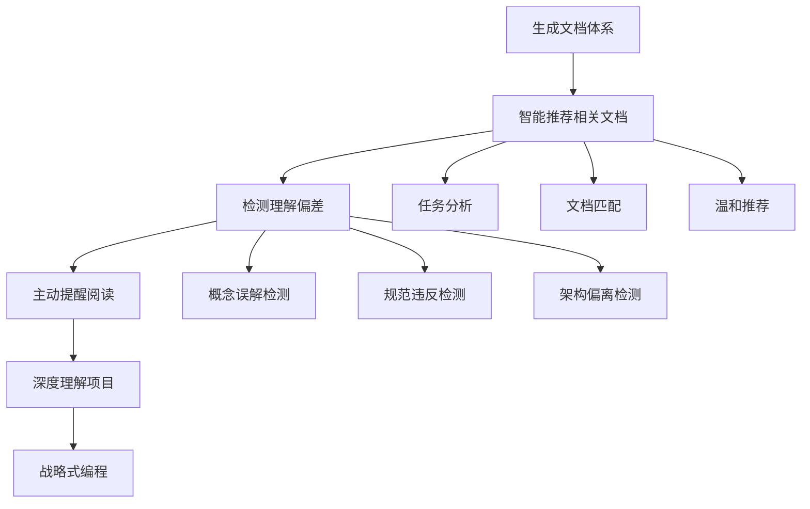

# 014 - 文档阅读习惯引导机制

**优先级**: P1
**状态**: 🟢 已确认
**预估工作量**: 2-3 天
**来源**: 用户洞察 + Vibe Coding 问题分析

---

## 📝 已完成工作 (2025-11-29)

### design_decisions.md 文档完善

- ✅ 更新版本信息（v2.2 → v2.3）
- ✅ 在"为什么选择 Markdown"章节中新增"更深层的设计理念：鼓励用户主动阅读文档"小节
- ✅ 阐述了 Vibe Coding 的"速度 > 理解"陷阱
- ✅ 说明了 Markdown 如何支撑"文档驱动开发"习惯
- ✅ 添加了与 V3.0 的契合说明
- ✅ 增加了"实施路径"章节，说明如何在框架中落实该理念
- ✅ 扩展了"相关文档"章节，添加 V3.0 相关链接
- ✅ 更新了文档末尾的版本说明和变更记录

**文档路径**: `reference/design_decisions.md`

---

## 📋 问题描述

### 核心痛点

1. **框架缺少明确的"鼓励用户阅读文档"理念**

   - 虽然生成了完善的文档体系
   - 但缺少引导用户主动阅读的机制
   - 用户仍然习惯"直接问 AI"而非"先读文档"

2. **Vibe Coding 的"速度 > 理解"陷阱**

   - AI 生成代码速度 >> 开发者理解速度
   - 复杂度累积速度 >> 认知更新速度
   - 容易引入"未知的未知"（Unknown Unknowns）

3. **文档价值未充分发挥**

   - 精心生成的文档体系
   - 但用户阅读率低
   - 文档成为"摆设"

### 当前框架现状

**已有但不足**：

- ✅ 生成了结构化的文档体系
- ✅ Markdown 格式易于阅读
- ✅ 有文档摘要机制（012 已完成）
- ⚠️ 缺少"智能文档推荐"机制
- ⚠️ 缺少"理解偏差检测"机制
- ❌ 没有系统化的阅读习惯引导

**问题案例**：

```
场景: 用户要新增一个功能
传统行为: 直接问 AI "帮我实现 XXX"
期望行为:
  1. AI 分析需求并推荐相关文档
  2. 用户阅读文档（5-10分钟）
  3. 理解现有架构和规范
  4. 然后与 AI 高质量协作
```

---

## 💡 解决方案

### 方案设计

#### 核心理念

**从"被动提供"到"主动引导" + "用户可选择"**

#### 功能开关设计

与 016 配置管理系统集成，提供功能开关。

**配置命名规范**（与现有配置保持一致）：

```yaml
# V3.0 功能开关
enableDocReadingGuide: true
# 详细配置
doc_reading_guide:
  recommendation: true    # 智能文档推荐
  recommendation_frequency: normal  # 推荐频率 (always|normal|rare|never)
  deviation_detect: true  # 理解偏差检测
```

**开关逻辑**：
- 当 `enableDocReadingGuide = false` 时，完全关闭所有相关功能
- 当 `doc_reading_guide.recommendation = false` 时，只关闭推荐，保留偏差检测
- 当 `doc_reading_guide.deviation_detect = false` 时，只关闭偏差检测，保留推荐

**入口文档生成逻辑**：
- 根据用户配置决定是否在 `AI_RULES.md` 中添加相关规则
- 根据用户配置决定是否在入口文档中说明该功能



#### 两个核心功能

**功能 1: 智能文档推荐**

AI 根据用户任务推荐相关文档：

- 基于 012 强制文档摘要机制（已完成）
- 每个文档都有标准化的 YAML Frontmatter 摘要
- AI 分析用户需求 → 匹配文档摘要 → 推荐相关文档
- 只推荐与当前任务直接相关的文档（最多 3 个）

**推荐示例**：
```
用户："帮我实现一个用户登录功能"

AI："在开始前，建议你先阅读以下文档：
  1. dev_docs/authentication.md（约 10 分钟）- 了解认证体系
  2. dev_docs/security.md（约 5 分钟）- 避免安全问题
  3. dev_docs/api_layer.md（约 5 分钟）- 参考 API 设计

阅读后我们可以更高效地协作。"
```

**功能 2: 理解偏差检测与主动提醒**

当 AI 检测到用户对项目的理解出现模糊或偏差时，主动提醒阅读相关文档：

**检测场景**：
- 用户提到的术语与文档定义不一致
- 用户的方案违反架构原则
- 用户要做的事情在"AI 编码禁忌"中明确禁止
- 用户问的问题文档中已有明确答案

**提醒示例**：
```
用户："我们直接把数据库密码写在配置文件里吧，方便"

AI："⚠️ 注意：这个做法可能与项目的规范不符。
在 dev_docs/security.md 的「密码管理」章节中提到，禁止在代码或配置文件中明文存储密码。
建议你先阅读这部分文档（约 3 分钟），我们再确认方案是否合适。"
```

---

### 实现方式

#### 1. 更新 AI 角色库

**新增角色 1: agents/runtime/document_recommender.md**

```markdown
# 文档推荐专家
## 职责
当用户要求开发功能、修复 Bug 或进行架构设计时，你需要：
1. 首先检查配置：
   - 如果 `enableDocReadingGuide = false`，直接处理用户需求，不推荐文档
   - 如果 `doc_reading_guide.recommendation = false`，直接处理用户需求，不推荐文档
   - 如果 `doc_reading_guide.recommendation_frequency = "never"`, 直接处理用户需求，不推荐文档
2. 根据频率控制决定是否推荐：
   - 如果 `doc_reading_guide.recommendation_frequency = "rare"`: 只在重大任务（架构设计、大型功能）时推荐
   - 如果 `doc_reading_guide.recommendation_frequency = "normal"`: 每会话最多推荐 3 次
3. 分析用户需求，识别关键词和任务类型
3. 读取文档体系的 YAML Frontmatter 摘要
4. 匹配与任务相关的文档
5. 提供温和的阅读建议（包含阅读时长和价值说明）

## 推荐原则
- 只推荐与当前任务直接相关的文档
- 最多推荐 3 个核心文档
- 每个推荐都要说明：
  - 文档路径
  - 预计阅读时间
  - 对当前任务的价值
- 使用"建议"而非"必须"的语气

## 触发场景
- 新增功能开发
- 修复复杂 Bug
- 架构设计或变更
- 技术选型
```

**新增角色 2: agents/runtime/understanding_guardian.md**

```markdown
# 理解偏差检测专家
## 职责
当用户提出可能存在理解偏差的问题或方案时，你需要：
1. 首先检查配置：
   - 如果 `enableDocReadingGuide = false`，直接处理用户需求，不检测偏差
   - 如果 `doc_reading_guide.deviation_detect = false`，直接处理用户需求，不检测偏差
2. 分析用户的问题或方案
3. 对比项目文档中的明确规范
4. 识别可能的偏差或误解
5. 提供包含文档引用的温和提醒

## 检测场景
- 用户提到的术语与文档定义不一致
- 用户的方案违反架构原则
- 用户要做的事情在"AI 编码禁忌"中明确禁止
- 用户问的问题文档中已有明确答案

## 提醒原则
- 使用温和的语气，不强制阅读
- 明确指出偏差所在的文档位置
- 说明为什么这可能是一个问题
- 提供准确的文档位置

## 话术示例
"⚠️ 注意：这个做法可能与项目的规范不符。
在 [文档路径] 的「[章节名]」章节中提到，[具体规范]。
建议你先阅读这部分文档（约 3 分钟），我们再确认方案是否合适。"
```

#### 2. 更新 AI_RULES 模板

在 `templates/AI_RULES_TEMPLATE.md` 中新增：

```markdown
## 📚 智能文档推荐规则

### 前置检查
首先检查用户配置：
- 如果 `enableDocReadingGuide = false`，跳过本章节
- 如果 `doc_reading_guide.recommendation = false`，跳过推荐规则

### 什么时候推荐文档？
1. 用户要求开发新功能
2. 用户要求架构设计或变更
3. 用户要求技术选型
4. 用户要求修复复杂 Bug

### 推荐格式
"在开始前，建议你先阅读以下文档：
  1. [文档路径]（预计阅读时间）- [价值说明]
  2. [文档路径]（预计阅读时间）- [价值说明]

阅读后我们可以更高效地协作。"

### 不推荐的情况
1. 用户问简单事实性问题
2. 用户问调试具体错误
3. 文档已明确过时
4. 用户已经声明已阅读相关文档

---

## ⚠️ 理解偏差检测规则

### 前置检查
首先检查用户配置：
- 如果 `enableDocReadingGuide = false`，跳过本章节
- 如果 `doc_reading_guide.deviation_detect = false`，跳过偏差检测规则

### 什么时候检测？
1. 用户提到的术语与文档定义不一致
2. 用户的方案违反架构原则
3. 用户要做的事情在"AI 编码禁忌"中明确禁止
4. 用户问的问题文档中已有明确答案

### 检测格式
"⚠️ 注意：这个做法可能与项目的规范不符。
在 [文档路径] 的「[章节名]」章节中提到，[具体规范]。
建议你先阅读这部分文档（约 3 分钟），我们再确认方案是否合适。"

### 检测原则
1. 基于已有的文档内容，不能臆断
2. 使用温和的语气，不强制阅读
3. 提供准确的文档位置
4. 说明偏差的原因和可能的后果
```

#### 3. 更新核心入口文档

**更新 README.md**：
在 README.md 中新增"如何使用文档"章节，说明智能推荐和偏差检测的功能。

**更新 AI_ENTRY_POINT.md**：
在 AI_ENTRY_POINT.md 中新增"智能文档推荐"和"理解偏差检测"的说明。

**更新主文档模板**：
在 `templates/AI_Coding_Context_TEMPLATE.md` 中新增"如何阅读本文档"章节，指导用户如何利用智能推荐功能。

---

## 📊 预期效果

### 解决的痛点

1. **提升文档利用率** - 从"摆设"到"日常工具"
2. **降低认知差距** - 对抗 Vibe Coding 的速度陷阱
3. **减少重复提问** - 相同问题只需要回答一次
4. **培养习惯** - 从"问 AI"到"读文档 + AI 协作"
5. **提升代码质量** - 基于理解而非盲目生成

### 触发场景

| 场景            | 触发行为                  |
|-----------------|---------------------------|
| 新增功能开发    | 推荐相关技术文档          |
| 修复复杂 Bug    | 推荐相关 troubleshooting |
| 架构设计变更    | 推荐架构和设计文档        |
| 违反规范        | 提醒阅读规范文档          |
| 概念误解        | 推荐概念解释文档          |

---

## ⚠️ 风险与边界

### 需要确认的边界

1. **范围边界**：只在框架层面提供 Prompt 模板，不做脚本分析
2. **精度边界**：通过 AI 语义理解实现，不依赖复杂算法
3. **强度边界**：温和提醒，不强制阅读
4. **频率边界**：同一个用户每 2 小时最多触发 1 次

### 潜在风险

| 风险                 | 可能性 | 影响 | 应对措施          |
|----------------------|--------|------|-------------------|
| 用户觉得繁琐拒绝阅读 | 中     | 高   | 温和引导，不强制  |
| 推荐不准确           | 低     | 中   | 基于文档摘要匹配  |
| 提醒过于频繁         | 低     | 中   | 限制触发频率      |
| 增加学习曲线         | 中     | 低   | 提供快速上手指南  |

---

## 🛠️ 实施计划

### 阶段 1: 更新 AI 角色库（0.5 天）

- [ ] 创建 `agents/runtime/document_recommender.md`
- [ ] 创建 `agents/runtime/understanding_guardian.md`

### 阶段 2: 更新配置模板（0.5 天）

- [ ] 在 `config/CONFIG_TEMPLATE.md` 的"V3.0 功能开关"部分新增 `enableDocReadingGuide`
- [ ] 在 `config/CONFIG_TEMPLATE.md` 中新增 `doc_reading_guide` 详细配置对象
- [ ] 在配置说明中添加完整的配置项文档说明

**具体配置添加内容**：

```yaml
# 在 "V3.0 功能开关" 部分新增
enableDocReadingGuide: true

# 在详细配置部分新增
# 文档阅读引导配置
doc_reading_guide:
  recommendation: true    # 智能文档推荐
  deviation_detect: true  # 理解偏差检测
```

**配置项文档说明（添加到 CONFIG_TEMPLATE.md 正文）**：

---

## 📖 文档阅读引导

**YAML 字段**: `enableDocReadingGuide` (全局开关) + `doc_reading_guide` (详细配置)
**当前值**: `true` (全局) + 见 frontmatter (详细)
**对应优化点**: 014-文档阅读习惯引导

**说明**: 控制 AI 是否主动推荐文档和检测理解偏差

### 全局开关 (`enableDocReadingGuide`)

**可选值**:
- `true` - 启用（推荐）
  - 适用: 新项目、团队协作
  - 效果: AI 会根据任务推荐文档，检测理解偏差
- `false` - 禁用
  - 适用: 快速原型、临时项目
  - 效果: AI 直接处理需求，不推荐或检测

### 详细配置 (`doc_reading_guide`)

#### `recommendation`

**类型**: `boolean`
**默认值**: `true`

**说明**: 是否启用智能文档推荐

- `true` - AI 会根据用户任务推荐相关文档
- `false` - 不推荐文档，但保留偏差检测

#### `recommendation_frequency`

**类型**: `string`
**默认值**: `normal`

**说明**: 推荐频率控制

**可选值**:
- `always` - 每次任务都推荐
- `normal` - 正常频率（默认），每会话最多 3 次
- `rare` - 稀有频率，只在重大任务时推荐
- `never` - 等同于 `recommendation: false`

#### `deviation_detect`

**类型**: `boolean`
**默认值**: `true`

**说明**: 是否启用理解偏差检测

- `true` - AI 会检测用户理解偏差并温和提醒
- `false` - 不检测偏差，但保留文档推荐

### 阶段 3: 更新 AI_RULES 模板（0.5 天）

- [ ] 更新 `templates/AI_RULES_TEMPLATE.md`
- [ ] 添加智能推荐和偏差检测规则
- [ ] 规则中加入配置检查逻辑

### 阶段 4: 更新核心入口文档（1 天）

- [ ] 更新 `README.md` - 新增"如何使用文档"章节
- [ ] 更新 `AI_ENTRY_POINT.md` - 新增功能说明（含开关说明）
- [ ] 更新 `templates/AI_Coding_Context_TEMPLATE.md` - 新增阅读指导

### 阶段 5: 测试与验证（1 天）

- [ ] 测试功能开启时的行为
- [ ] 测试功能关闭时的行为
- [ ] 测试部分开关开启的行为
- [ ] 优化提示词的语气和效果

---

## 🧠 深度思考

### 与其他优化点的集成

- **与 012-强制文档摘要集成**：摘要机制是智能推荐的基础
- **与 004-ADR 系统集成**：推荐按 ADR 依赖顺序阅读
- **与 005-复杂度仪表盘集成**：根据复杂度推荐学习路径
- **与 007-学习曲线追踪集成**：追踪阅读进度和学习曲线
- **与 008-AI 能力分级集成**：根据任务复杂度调整推荐策略

### 实施路径的优先级

1. **第一阶段**：核心功能实现（推荐 + 检测）
2. **第二阶段**：优化推荐算法和检测精度
3. **第三阶段**：与其他优化点深度集成
4. **第四阶段**：用户反馈收集和持续改进

---

## 📚 相关文档

- [design_decisions.md](../../../../core/design_decisions.md) - 已补充相关设计理念
- [012-mandatory-doc-summary.md](../012-mandatory-doc-summary/012-mandatory-doc-summary.md) - 文档摘要机制（配合使用）
- [003-design-thinking-guide.md](../003-design-thinking-guide/003-design-thinking-guide.md) - 设计思维引导（思路类似）

---

## 🔄 状态跟踪

**创建日期**: 2025-11-29
**最后讨论**: 2026-04-13
**讨论进度**: 100%
**决策状态**: 已确认

---

**下一步**: 实施计划已明确，移至 confirmed/ 目录并开始开发