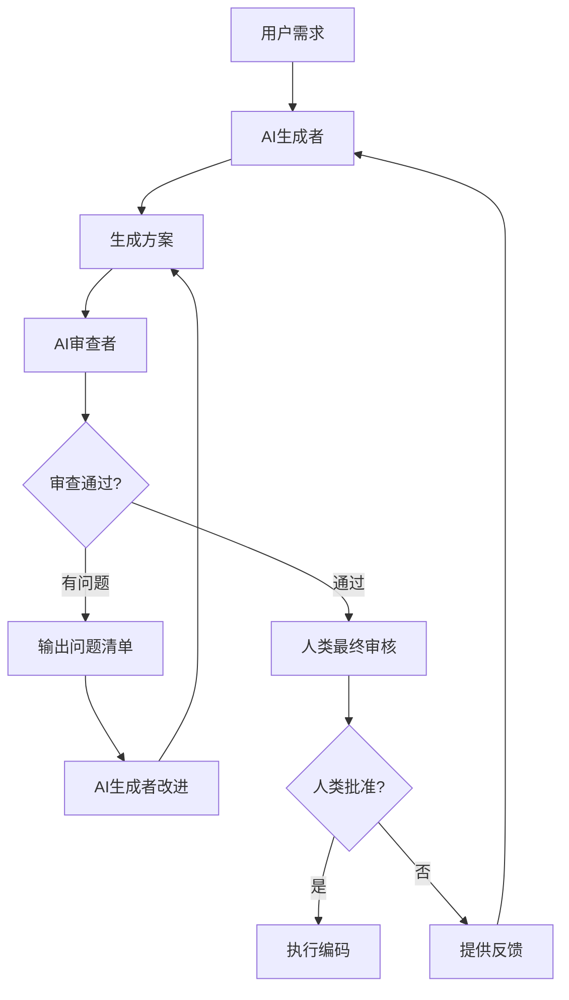

# 001 - AI 互审机制

**优先级**: P0  
**状态**: 🟡 待讨论  
**预估工作量**: 1 周  
**来源**: 《AI 编程的现状.md》方法 1 + 《AI_PROGRAMMING_ANALYSIS.md》

---

## 📋 问题描述

### 原文观点

> "还是得把一个独立的第三方带入到 1V1 的 AI 编程流程中去，时刻地去监管和反馈。这个第三方一般来说要么是一个资深的开发者，要么是另一个同样智能等级的生成式 AI。这种对抗式编程一般能消除单一模型的鬼打墙现象（尤其是自己写的 bug 自己找不出这种）。"

### 核心痛点

1. **单一 AI 的盲点**

   - AI 生成的代码可能有自己发现不了的问题
   - "鬼打墙"现象：重复犯同样的错误
   - 缺少外部视角的审查

2. **人工审查的局限**

   - 需要人类有足够经验和时间
   - 审查质量不稳定
   - 无法实时进行

3. **V2.3 的现状**
   - 有方案生成+人工审核机制
   - 缺少 AI 层面的互审
   - 评分: ⭐⭐⭐⭐ (4/5)

---

## 💡 解决方案

### 核心设计



### 工作流程

#### 1. 方案生成阶段

```markdown
**AI 生成者** (Generator)
└── 输入: 用户需求 + 项目文档
└── 输出: plans/xxx_feature.md
└── 包含: 技术方案 + 实施步骤 + 影响评估
```

#### 2. AI 互审阶段

```markdown
**AI 审查者** (Reviewer)
└── 输入: 生成的方案 + 框架规范
└── 审查清单:
├── 是否符合 AI 编码禁忌？
├── 是否引入不必要复杂性？
├── 是否有更优方案？
├── 是否考虑错误处理？
├── 是否考虑性能影响？
├── 是否考虑安全风险？
├── 是否更新相关文档？
├── 是否明确成功标准？
├── 是否评估技术债？
└── 是否有替代方案？
└── 输出: 审查报告
```

#### 3. 改进循环（可选）

```markdown
如果审查发现问题:
AI 生成者 → 阅读审查报告 → 改进方案 → 重新提交审查
（最多 2 轮，避免无限循环）
```

#### 4. 人类决策

```markdown
人类开发者:
└── 阅读: 生成的方案 + AI 审查报告
└── 决策: 批准 / 拒绝 / 提供反馈
```

### 技术实现

#### 角色定义

```python
# ai_agents.py

class AIGenerator:
    """AI生成者角色"""
    def __init__(self, model="gpt-4"):
        self.model = model
        self.role = "代码方案生成专家"

    def generate_plan(self, requirement, context):
        prompt = f"""
        作为代码方案生成专家，基于以下需求生成详细方案:

        需求: {requirement}
        项目上下文: {context}

        请按照GENERATION_PLAN_TEMPLATE.md格式生成方案
        """
        return call_ai(self.model, prompt)

class AIReviewer:
    """AI审查者角色"""
    def __init__(self, model="claude-3.5-sonnet"):
        self.model = model
        self.role = "代码方案审查专家"

    def review_plan(self, plan, checklist):
        prompt = f"""
        作为独立的代码审查专家，请严格审查以下方案:

        方案内容: {plan}

        审查清单:
        {checklist}

        请指出所有问题、风险和改进建议。
        如果方案完美，请说明优点。
        """
        return call_ai(self.model, prompt)
```

#### 审查清单模板

```markdown
## AI 审查清单

### 1. 规范遵守 (⚠️ 严重)

- [ ] 是否违反 AI 编码禁忌？
- [ ] 是否跳过必需的文档更新？
- [ ] 是否硬编码敏感信息？

### 2. 架构设计 (🔴 高)

- [ ] 是否引入不必要复杂性？
- [ ] 是否有更简单的方案？
- [ ] 是否考虑未来扩展性？

### 3. 风险评估 (🟡 中)

- [ ] 是否评估性能影响？
- [ ] 是否考虑安全风险？
- [ ] 是否识别潜在 bug？

### 4. 质量保证 (🔵 低)

- [ ] 是否包含错误处理？
- [ ] 是否有单元测试计划？
- [ ] 是否明确成功标准？

### 5. 文档完整性

- [ ] 是否列出需要更新的文档？
- [ ] 是否有使用示例？
- [ ] 是否有回滚方案？
```

---

## 📊 价值评估

### 解决的痛点

1. **消除单一 AI 盲点** - 双重检查机制
2. **提前发现问题** - 方案阶段而非编码后
3. **提升方案质量** - 多角度审视
4. **减少返工** - 早期纠错

### 预期效果

| 指标         | V2.3    | V3.0 预期 | 提升幅度 |
| ------------ | ------- | --------- | -------- |
| 问题发现率   | 60%     | 80-90%    | +30-50%  |
| 方案通过率   | 75%     | 90%       | +20%     |
| 返工次数     | 2.5 次  | 1.5 次    | -40%     |
| 人工审查时间 | 30 分钟 | 15 分钟   | -50%     |

### ROI 分析

**成本**:

- Token 增加: 约 30% (每次方案多一轮审查)
- 开发工作量: 1 周

**收益**:

- 减少返工: 节省 40%时间
- 提升质量: Bug 率降低 20-30%
- 降低风险: 早期发现重大问题

**净收益**: 投入 1 小时，节省 3-4 小时

---

## 🛠️ 实施计划

### 阶段 1: 设计与准备（2 天）

- [ ] 定义 AI 审查清单（10 项检查点）
- [ ] 设计 Prompt 模板
- [ ] 确定审查标准

### 阶段 2: 代码实现（3 天）

- [ ] 实现 AIGenerator 类
- [ ] 实现 AIReviewer 类
- [ ] 实现协调器（Coordinator）
- [ ] 集成到现有工作流

### 阶段 3: 测试与优化（2 天）

- [ ] 单元测试
- [ ] 端到端测试
- [ ] Token 成本优化
- [ ] 审查质量验证

---

## ⚠️ 风险与疑问

### 需要讨论的问题

1. **AI 审查者的可靠性**

   - ❓ 两个 AI 是否真能互相发现盲点？
   - ❓ 如果审查 AI 也有偏见怎么办？
   - ❓ 如何验证审查质量？

2. **模型选择**

   - ❓ 生成者和审查者是否应使用不同模型？
   - ❓ GPT-4 vs Claude-3.5，哪个更适合审查？
   - ❓ 成本 vs 质量如何平衡？

3. **审查深度**

   - ❓ 审查清单是否足够全面？
   - ❓ 是否需要分级审查（快速/标准/深度）？
   - ❓ 如何避免过度审查？

4. **循环控制**

   - ❓ 最多允许几轮改进？
   - ❓ 如何判断"无法通过审查"？
   - ❓ 人类何时介入？

5. **与 V2.3 集成**
   - ❓ 如何最小化对现有流程的影响？
   - ❓ 是否支持跳过 AI 审查？
   - ❓ 审查报告存放在哪里？

### 潜在风险

| 风险             | 可能性 | 影响 | 应对措施                |
| ---------------- | ------ | ---- | ----------------------- |
| AI 误判          | 中     | 中   | 人类最终裁决 + 反馈优化 |
| Token 成本超预算 | 中     | 低   | 缓存机制 + 分级审查     |
| 审查时间过长     | 低     | 中   | 异步处理 + 设置超时     |
| 两 AI 观点冲突   | 低     | 低   | 记录分歧，由人类判断    |

---

## 📚 参考资料

### 原文出处

- [《AI 编程的现状.md》](../../reference/AI编程的现状.md) - 方法 1
- [《AI_PROGRAMMING_ANALYSIS.md》](../../reference/AI_PROGRAMMING_ANALYSIS.md) - 3.1.1 节

### 相关技术

- 对抗式生成网络 (GAN) 的思想
- Code Review 最佳实践
- Pair Programming 模式

### 类似工具

- GitHub Copilot + CodeRabbit
- Amazon CodeGuru Reviewer
- DeepCode AI

---

## 🔄 状态跟踪

**创建日期**: 2025-11-29  
**最后讨论**: 待定  
**讨论进度**: 0%  
**决策状态**: 待讨论

---

**下一步**: 与用户讨论以上疑问，确定技术方案后移至 confirmed/
