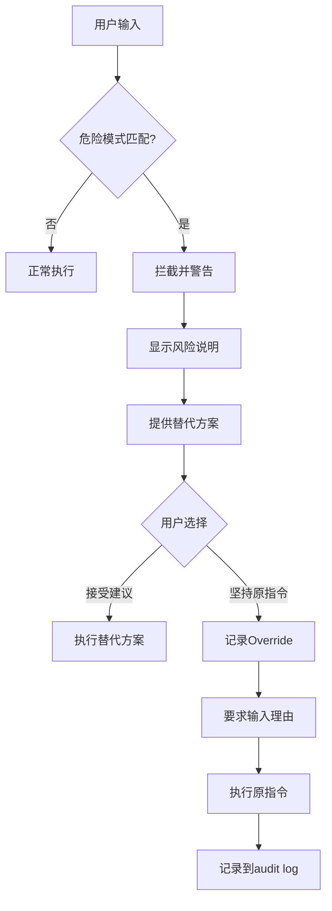

# 002 - 危险指令拦截系统

**优先级**: P0  
**状态**: 🟡 待讨论  
**预估工作量**: 3 天  
**来源**: 《AI 编程的现状.md》洞察 + 《AI_PROGRAMMING_ANALYSIS.md》

---

## 📋 问题描述

### 原文关键洞察

> "人类自身发出的危险指令才是整个开发过程中最容易让 AI 越界的元凶（比如不管三七二十一让 AI 去实现一个功能或者修复某个错误）。"

### 核心痛点

**典型危险指令**:

1. "不管三七二十一，实现这个功能"
2. "快速修复这个 bug，不用管其他"
3. "直接复制那段代码就行"
4. "不用写文档，先让功能跑起来"
5. "跳过方案，直接开始写代码"

**后果**:

- 绕过框架规范
- 积累技术债
- 引入复杂性
- 文档不同步

---

## 💡 解决方案

### 危险模式库

```python
DANGEROUS_PATTERNS = [
    {
        "pattern": r"不管.*实现",
        "risk": "high",
        "message": "检测到跳过设计指令。建议先创建方案文档(plans/)。",
        "suggestion": "让我先为你生成一个方案，讨论技术选型和实施步骤。"
    },
    {
        "pattern": r"快速修复.*不用管",
        "risk": "high",
        "message": "检测到临时修复指令。建议评估长期影响。",
        "suggestion": "这个修复可能影响其他模块，让我先做影响分析。"
    },
    {
        "pattern": r"直接复制.*就行",
        "risk": "medium",
        "message": "检测到代码复制指令。建议提取公共函数。",
        "suggestion": "考虑提取为可复用函数，避免代码重复。"
    },
    {
        "pattern": r"不用.*(文档|更新)",
        "risk": "high",
        "message": "检测到跳过文档指令。违反框架规范。",
        "suggestion": "文档同步是框架规范，我会在编码后自动更新相关文档。"
    },
    {
        "pattern": r"跳过.*直接",
        "risk": "high",
        "message": "检测到跳过流程指令。",
        "suggestion": "遵循框架流程能减少50%的返工，让我们按标准流程来。"
    }
]
```

### 工作流程



### 拦截响应模板

```markdown
⚠️ **危险指令检测**

我注意到您的指令可能绕过框架规范:
"{用户原始指令}"

**风险**: {风险等级} - {风险说明}

**建议替代方案**:
{具体建议}

**如果您坚持**:
请输入 override 理由，我会记录到 audit log 并执行。
但这可能导致:

- 技术债累积
- 文档不同步
- 未来难以维护

您的选择: [接受建议] / [坚持原指令+理由]
```

---

## 📊 价值评估

**解决的痛点**:

- 阻止最大风险源（人为失误）
- 强制遵守框架规范
- 引导战略式思维

**预期效果**:

- 危险指令拦截率: 80%+
- 技术债减少: 30-40%
- 文档同步率: 从 75% → 95%

---

## ⚠️ 风险与疑问

1. ❓ 如何避免"狼来了"效应（拦截过于频繁）?
2. ❓ Override 理由是否需要人工审核?
3. ❓ 模式库如何持续更新?
4. ❓ 是否支持用户自定义危险模式?

---

**创建日期**: 2025-11-29  
**讨论进度**: 0%
