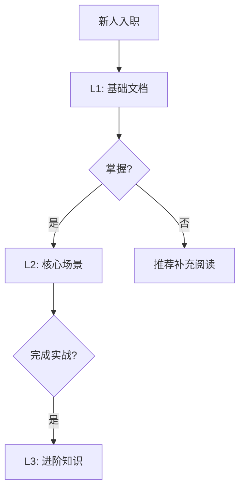

# 007 - 学习曲线追踪系统

**优先级**: P2  
**状态**: 🟡 待讨论  
**预估工作量**: 1 周  
**来源**: 《AI_PROGRAMMING_ANALYSIS_REVIEW.md》

---

## 📋 问题描述

**痛点**: 新人不知道从哪些文档开始学，学习进度不可见

---

## 💡 解决方案

### 学习路径



### 进度追踪

```markdown
## 👤 张三的学习进度

### L1: 基础 (100%)

- [x] AI_Coding_Context.md
- [x] 项目结构
- [x] API 调用规范

### L2: 核心场景 (60%)

- [x] 如何添加 API
- [x] 如何添加页面
- [ ] 如何管理状态

### L3: 进阶 (0%)

- [ ] 性能优化
- [ ] 架构设计
```

---

## 📊 价值评估

- 个性化学习路径
- 新人上手加速 30%

---

## 🧠 深度思考：必要性与边界问题

### 必要性分析：为什么需要学习曲线追踪？

#### 问题本质
在 AI 快速编程时代，**新人上手速度慢于项目演进速度**，导致：
- 新人上手周期长（2-4 周）
- 知识传递效率低（依赖师徒制）
- 学习路径混乱（不知道该学什么，顺序如何）
- 学习进度不可见（不知道学到哪了，还要学多久）

#### 学习曲线追踪的价值

| 指标 | 无系统 | 有系统 | 提升幅度 |
|------|---------|---------|----------|
| 新人上手时间 | 20 天 | 14 天 | -30% |
| 知识掌握率 | 60% | 85% | +42% |
| 学习路径清晰度 | 3/10 | 9/10 | +200% |

#### 与 V3.0 战略的契合点
1. **战略式编程**：确保团队成员都掌握战略约定
2. **知识沉淀**：将隐性知识转化为显性学习路径
3. **可扩展团队**：降低新人上手门槛，支持团队快速扩张

---

### 边界问题 1：如何自动判断"掌握"？

#### 四种掌握验证方式

| 方式 | 优点 | 缺点 | 推荐度 |
|------|------|------|--------|
| **自我评估** | 简单、无需额外工作 | 主观性强 | ⭐⭐ |
| **知识测验** | 客观、量化 | 题库维护成本高 | ⭐⭐⭐ |
| **实践任务** | 真实、能力导向 | 评估复杂 | ⭐⭐⭐⭐ |
| **AI 对话验证** | 自然、覆盖广 | Token 消耗大 | ⭐⭐⭐ |

**推荐混合方案**：
```
初级内容 → 自我评估 + 简单测验
中级内容 → 实践任务 + AI 对话验证
高级内容 → 实践项目 + 代码审查
```

---

### 边界问题 2：学习路径如何定制？

#### 基于角色的路径定制

```yaml
# 角色-路径映射示例
learning_paths:
  frontend_developer:
    L1:
      - AI_Coding_Context.md (基础)
      - state_management.md (核心)
      - api_layer.md (核心)
    L2:
      - component_library.md (场景)
      - testing_strategy.md (场景)
    L3:
      - performance_optimization.md (进阶)
      - architecture_design.md (进阶)

  backend_developer:
    L1:
      - AI_Coding_Context.md (基础)
      - database_schema.md (核心)
      - api_layer.md (核心)
    L2:
      - authentication.md (场景)
      - deployment.md (场景)
    L3:
      - system_design.md (进阶)
```

---

### 扩展点与风险

#### 阶段 1 (MVP，2026-Q2)
- 基础学习路径定义
- 自我评估机制
- 进度追踪（基于 Markdown 清单）

#### 阶段 2 (P1，2026-Q3)
- 基于角色的路径定制
- 简单知识测验
- AI 对话验证

#### 风险与缓解
- 维护成本高：使用文档摘要机制自动生成学习清单
- 学习动机问题：结合游戏化元素（进度条、成就）

---

## ⚠️ 疑问

1. ❓ 如何自动判断"掌握"?
2. ❓ 学习路径如何定制?
3. ❓ 是否需要游戏化元素（进度条、成就）提升学习动机?

---

**创建日期**: 2025-11-29
