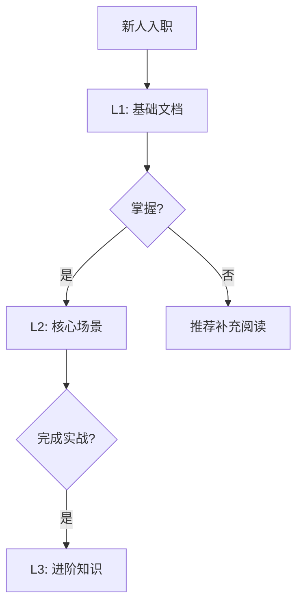

# 007 - 学习曲线追踪系统

**优先级**: P2  
**状态**: 🟡 待讨论  
**预估工作量**: 1 周  
**来源**: 《AI_PROGRAMMING_ANALYSIS_REVIEW.md》

---

## 📋 问题描述

**痛点**: 新人不知道从哪些文档开始学，学习进度不可见

---

## 💡 解决方案

### 学习路径



### 进度追踪

```markdown
## 👤 张三的学习进度

### L1: 基础 (100%)

- [x] AI_Coding_Context.md
- [x] 项目结构
- [x] API 调用规范

### L2: 核心场景 (60%)

- [x] 如何添加 API
- [x] 如何添加页面
- [ ] 如何管理状态

### L3: 进阶 (0%)

- [ ] 性能优化
- [ ] 架构设计
```

---

## 📊 价值评估

- 个性化学习路径
- 新人上手加速 30%

---

## ⚠️ 疑问

1. ❓ 如何自动判断"掌握"?
2. ❓ 学习路径如何定制?

---

**创建日期**: 2025-11-29
