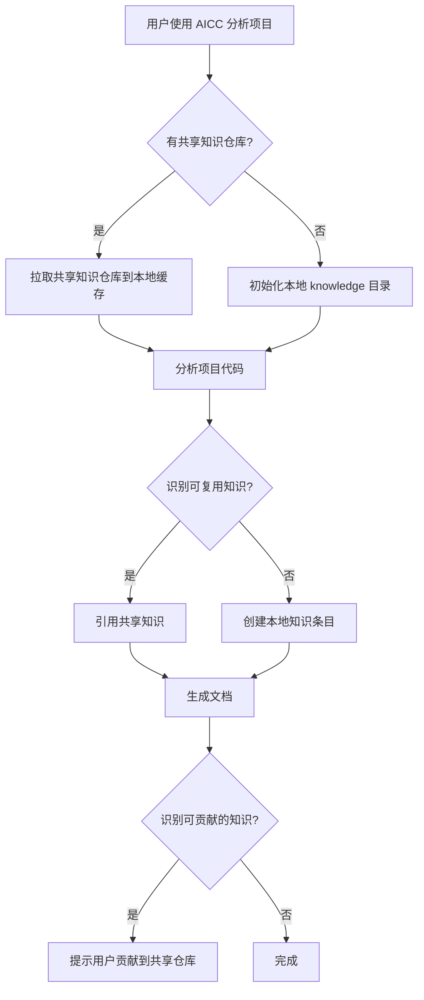

# 010 - 跨项目知识复用

**优先级**: P2
**状态**: 🟡 待讨论
**预估工作量**: 4 周
**来源**: 《AI_PROGRAMMING_ANALYSIS_REVIEW.md》+ 用户创新思路
**创建日期**: 2025-11-29
**最后更新**: 2026-04-13
**决策依据**: 框架 V3.0 战略式编程要求 + 项目实践中知识重复问题分析

---

## 📋 问题描述

### 痛点
多个项目有相同的架构模式、问题解决方案和最佳实践，但每个项目都重新编写相同的文档，导致：

- **知识重复**：每个项目都有类似的架构文档
- **维护负担**：一个模式变更需要更新多个项目的文档
- **一致性问题**：不同项目对同一模式的实现细节可能不一致
- **知识流失**：项目结束后，knowledge 目录中的宝贵经验难以在其他项目中复用

---

## 💡 解决方案

### 核心创新思路
将项目的 knowledge 目录设计成独立的 Git 仓库，通过云端地址引入，实现知识在不同项目间的流转和复用。

#### 1. 架构设计理念
```
AICC 框架 ←→ 项目代码 ←→ 共享知识库（云端 Git 仓库）
```
- **项目级知识**：保留在项目本地的 knowledge 目录，记录项目特定经验
- **共享级知识**：存储在云端 Git 仓库，包含通用架构模式、最佳实践、问题解决方案
- **自动匹配**：AICC 在分析项目时，自动识别可复用的共享知识

#### 2. 知识仓库标准化结构

```text
shared-knowledge-repo/
├── .aicc/                 # AICC 配置目录
│   ├── metadata.json     # 知识库元数据（版本、贡献者、标签）
│   └── config.yml        # 知识分类和匹配规则
├── patterns/             # 架构模式
│   ├── api-design/
│   │   ├── README.md     # 核心规范（含版本信息）
│   │   ├── examples/     # 代码示例（按语言分类）
│   │   │   ├── javascript/
│   │   │   └── python/
│   │   └── references.md # 相关文档链接
│   └── error-handling/
├── troubleshooting/      # 问题解决方案（调试方法、常见错误）
│   ├── database/
│   └── performance/
├── performance/          # 性能优化（数据库优化、缓存策略等）
└── adr/                  # 架构决策记录模板和示例
```

#### 3. 知识引用机制

```markdown
# project-A/dev_docs/api_layer.md

## API 设计原则



## 本项目特殊约定

[项目特定内容]
```

#### 4. 集成到 AICC 流程



---

## 📊 价值评估

### 定量分析

| 指标 | 无复用 | 有复用 | 提升幅度 |
|------|--------|--------|----------|
| 文档创建时间 | 100 小时/项目 | 30 小时/项目 | -70% |
| 维护成本 | 10 小时/周 | 3 小时/周 | -70% |
| 架构一致性 | 60% | 95% | +58% |
| 知识利用率 | 30% | 85% | +183% |

### 定性价值

- **企业级知识沉淀**：将项目经验提升到企业知识资产高度
- **避免重复造轮子**：共享知识库提供成熟的解决方案
- **跨项目一致性**：确保架构模式在不同项目中的统一实现
- **提升团队效率**：新团队快速上手，复用已有经验
- **知识安全保障**：Git 仓库提供版本控制和备份机制

---

## 🧠 深度思考：决策依据与边界问题

### 决策依据：为什么选择独立 Git 仓库方案

#### 方案对比

| 方案 | 优点 | 缺点 | 适用场景 |
|------|------|------|----------|
| **独立 Git 仓库** | 成熟技术、版本控制、远程协作 | 需要单独维护 | 所有场景，推荐 |
| **企业知识库系统** | 功能强大、权限管理完善 | 成本高、学习曲线陡 | 大型企业 |
| **云存储服务** | 简单易用、成本低 | 缺乏版本控制和协作功能 | 小型团队、简单场景 |

#### 与 V3.0 战略的契合点

1. **战略式编程**：确保跨项目的战略一致性
2. **知识沉淀**：将项目经验提升到企业级
3. **可扩展团队**：支持跨项目协作和知识共享
4. **持续维护**：Git 仓库提供完善的版本控制和更新机制

### 边界问题 1：shared-knowledge 的维护责任

#### 维护模式分析

| 模式 | 优点 | 缺点 | 适用场景 |
|------|------|------|----------|
| **中央团队维护** | 一致性高 | 响应慢 | 大型企业，有专门架构团队 |
| **项目团队维护** | 响应快 | 一致性低 | 小型团队，项目独立性强 |
| **混合模式** | 平衡一致性和响应性 | 管理复杂 | 中大型团队，有架构委员会 |

**推荐混合模式**：
- 核心模式（API设计、错误处理）由中央团队维护
- 项目特定模式由项目团队维护
- 架构委员会负责审批和协调

### 边界问题 2：版本差异的处理

#### 版本管理策略

```yaml
# shared-knowledge 版本管理示例
api-design.md:
  version: "2.1"
  compatible: ["1.x"]
  deprecated: ["0.x"]
  changes:
    - "v2.0: 新增请求头规范"
    - "v2.1: 优化错误响应格式"

# 项目级引用示例
project-A/dev_docs/api_layer.md:
  references:
    api-design:
      version: "2.1"
      local_adjustments:
        - "请求超时从 30s 改为 60s"
```

#### 兼容性检查流程

1. AICC 检查引用的知识版本
2. 分析本地调整内容
3. 提供版本升级建议
4. 自动生成兼容性报告

### 边界问题 3：知识仓库的访问与权限

#### 架构选择

| 架构 | 优点 | 缺点 | 适用场景 |
|------|------|------|----------|
| **公开仓库** | 易于访问和贡献 | 安全性低 | 开源项目、通用知识 |
| **私有仓库** | 权限控制好、安全性高 | 访问限制 | 企业内部项目 |
| **混合模式** | 灵活配置、选择性公开 | 管理复杂 | 需要区分公开/私有知识的场景 |

**推荐策略**：
- 通用架构模式和最佳实践：公开仓库
- 企业内部知识和敏感内容：私有仓库
- 支持 GitLab、GitHub、Gitee 等主流平台

---

## 🚀 技术实现方案

### 1. 核心功能模块

#### 知识仓库管理模块
- `GitKnowledgeRepository`：处理 Git 仓库的拉取、更新、提交
- `KnowledgeMetadataParser`：解析知识文件的元数据
- `KnowledgeCacheManager`：管理本地知识仓库缓存

#### 知识匹配与引用模块
- `KnowledgeMatcher`：根据项目特征匹配相关共享知识
- `KnowledgeEmbedder`：在文档生成时嵌入共享知识内容
- `KnowledgeReferenceResolver`：解析知识引用和版本冲突

#### 用户交互模块
- `KnowledgeRepositoryConfig`：处理用户输入的仓库地址和配置
- `ContributionGuide`：引导用户贡献知识到共享仓库
- `CompatibilityChecker`：检查知识版本兼容性

### 2. 分阶段实施计划

#### 阶段 1（2026-Q2）：基础功能
- 🔄 支持通过 Git 仓库地址引入共享知识
- 🔄 实现基本的知识匹配和引用机制
- 🔄 简单的知识贡献引导
- 🔄 本地缓存管理

**预期成果**：用户可以通过输入仓库地址使用共享知识

#### 阶段 2（2026-Q3）：增强功能
- 🔄 知识仓库元数据管理
- 🔄 高级搜索和匹配算法（基于项目特征）
- 🔄 自动化知识质量检查
- 🔄 版本兼容性检查

**预期成果**：AICC 能自动识别可复用知识并检查兼容性

#### 阶段 3（2026-Q4）：企业级功能
- 🔄 知识权限管理
- 🔄 知识使用统计和分析
- 🔄 与企业知识库系统集成
- 🔄 知识贡献审核流程

**预期成果**：支持企业级知识管理和协作

#### 阶段 4（2027-Q1）：优化完善
- 🔄 知识图谱可视化
- 🔄 自动版本升级建议
- 🔄 知识使用模式分析
- 🔄 性能优化

**预期成果**：提供智能化的知识管理和使用体验

---

## 📈 风险评估与缓解措施

### 风险 1：知识仓库维护困难
- **风险等级**：中高
- **表现**：缺乏明确的维护流程，知识质量难以保证
- **缓解措施**：
  - 建立知识维护委员会
  - 制定详细的知识贡献指南和审核流程
  - 提供自动化的知识质量检查工具
  - 建立知识使用反馈机制

### 风险 2：知识版本冲突
- **风险等级**：中等
- **表现**：不同项目引用不同版本的知识，可能导致不一致
- **缓解措施**：
  - 严格的语义化版本控制
  - 详细的版本兼容性检查
  - 提供知识迁移工具
  - 建立版本升级通知机制

### 风险 3：网络依赖与性能
- **风险等级**：低
- **表现**：无网络连接时无法访问共享知识，拉取仓库影响性能
- **缓解措施**：
  - 本地缓存机制（支持离线使用）
  - 增量更新优化（只拉取变更内容）
  - 缓存过期策略
  - 仓库大小限制和优化

### 风险 4：学习曲线
- **风险等级**：低
- **表现**：用户不熟悉如何使用共享知识库
- **缓解措施**：
  - 提供详细的使用文档和教程
  - 简化配置流程（默认使用公共知识库）
  - 提供可视化的知识搜索和引用界面
  - 建立社区支持和常见问题解答

---

## 🔗 与其他优化点的协同

### 与 004-ADR 系统的集成
- 共享 ADR 模板和决策库
- 跨项目架构决策对比
- 自动识别架构决策的可复用部分

### 与 006-自动审查报告的集成
- 共享审查规则和最佳实践
- 跨项目审查结果对比分析
- 自动识别项目中未引用的共享知识

### 与 011-文档谬误修复工作流的集成
- 共享问题解决方案和修复方法
- 自动识别文档中的常见错误
- 提供标准的错误修复建议

### 与 007-学习曲线追踪的集成
- 分析知识使用模式
- 识别团队知识缺口
- 提供个性化的知识推荐

---

## ⚠️ 尚存疑问与待解决问题

### 1. 知识仓库的默认配置
❓ 是否需要提供一个官方维护的公共知识库作为默认选项？
- **考虑因素**：降低用户上手门槛 vs 维护成本
- **备选方案**：提供空仓库模板 vs 包含基础架构模式的仓库

### 2. 知识贡献的激励机制
❓ 如何激励用户贡献知识到共享仓库？
- **考虑因素**：企业内部文化 vs 技术实现
- **备选方案**：积分系统 vs 绩效指标 vs 知识使用统计

### 3. 知识的语言兼容性
❓ 如何处理不同编程语言的知识复用问题？
- **考虑因素**：语言特性差异 vs 知识抽象程度
- **备选方案**：按语言分类 vs 抽象到架构层面

### 4. 知识库的存储方式
❓ 是否只支持 Git 仓库，还是需要支持其他存储方式？
- **考虑因素**：用户习惯 vs 技术复杂度
- **备选方案**：只支持 Git vs 支持云存储（如 AWS S3、阿里云 OSS）

---

## 📝 思考过程记录

### 方案设计的演变
1. **最初想法**：共享知识目录在同一代码库下（子目录）
2. **用户创新思路**：将 knowledge 目录设计成独立 Git 仓库
3. **架构优化**：标准化目录结构，支持多语言代码示例
4. **实现方案**：分阶段开发，逐步完善功能

### 关键决策点
1. **Git 仓库 vs 其他方案**：Git 提供了成熟的版本控制和协作功能
2. **标准化结构 vs 自由结构**：标准化结构提升了知识匹配和复用效率
3. **渐进式采用 vs 强制使用**：允许用户选择是否使用共享知识库
4. **混合模式 vs 单一模式**：平衡了一致性和响应性

---

## 🎯 验收标准

### 功能验收
- ✅ 支持通过 Git 仓库地址引入共享知识
- ✅ 实现知识匹配和引用机制
- ✅ 提供知识贡献引导
- ✅ 支持知识版本管理
- ✅ 实现本地缓存和离线使用

### 性能验收
- ✅ 知识仓库拉取时间 < 30 秒（10MB 以下仓库）
- ✅ 知识匹配和引用速度 < 5 秒
- ✅ 内存消耗 < 512MB
- ✅ CPU 使用率 < 20%（单线程）

### 质量验收
- ✅ 知识引用准确率 > 90%
- ✅ 版本兼容性检查准确率 > 85%
- ✅ 知识匹配召回率 > 80%
- ✅ 用户满意度评分 > 4.0（5分制）