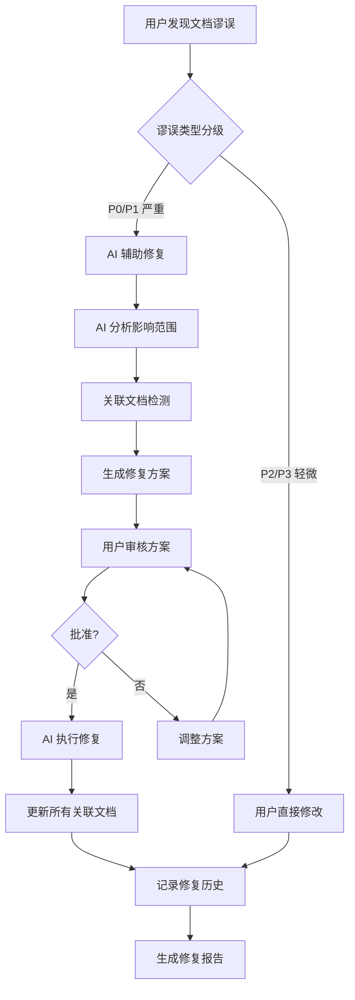

# 011 - 文档谬误修复工作流

**优先级**: P1  
**状态**: 🟡 待讨论  
**预估工作量**: 5-7 天  
**来源**: 用户洞察 + V2.3 增量更新机制扩展

---

## 📋 问题描述

### 核心痛点

1. **用户发现文档错误无标准流程**

   - V2.3 有增量更新机制，但主要针对代码变更
   - 缺少"用户发现谬误"的标准处理流程
   - 不清楚应该手动修改还是让 AI 修改

2. **文档间关联关系难以追踪**

   - 修改一个文档，可能影响其他文档
   - 手动查找容易遗漏关联引用
   - 缺少自动化的关联检测

3. **谬误修复缺少历史记录**
   - 无法追溯修复历史
   - 修复错误后无法回滚
   - 缺少修复质量验证

### V2.3 现状

- ✅ 已有: 增量更新流程 (`workflows/incremental_update_workflow.md`)
- ⚠️ 不足: 主要针对代码变更，未明确处理"文档谬误"场景
- ❌ 缺失: 关联文档自动检测、修复历史管理、批量修复工具

---

## 💡 解决方案

### 方案设计

#### 核心工作流



#### 谬误分类和处理策略

```markdown
谬误类型分级:

- P0 (严重): 代码示例错误、API 签名错误、配置错误
  → 处理: 必须 AI 辅助 + 关联检测 + 备份

- P1 (重要): 概念解释错误、流程描述错误、术语不一致
  → 处理: AI 辅助 + 关联检测

- P2 (一般): 格式问题、拼写错误、措辞不当
  → 处理: 用户可直接修改

- P3 (轻微): 标点符号、空格、排版
  → 处理: 用户直接修改
```

### 实现方式

#### 1. 用户报告谬误

```markdown
【发送给 AI】

我发现文档存在错误:

**文档**: dev_docs/api_layer.md
**位置**: "API 调用"章节，第 45 行
**错误内容**: 示例中使用了 `getUserInfo()`
**正确内容**: 应该使用 `fetchUserProfile()`
**代码依据**: src/api/user.ts:L23
**严重性**: P0 (API 函数名错误)

请帮我修正这个错误，并检查是否有其他文档也引用了错误的函数名。
```

#### 2. AI 处理流程

```markdown
步骤 1: 验证谬误

- 检查 src/api/user.ts 确认正确的函数名
- 确认用户指出的错误确实存在
- 确定谬误严重性

步骤 2: 分析影响范围

- 全文搜索 `getUserInfo()` 在所有文档中的引用
- 检查直接引用和间接引用
- 生成关联文档清单

步骤 3: 自动备份（P0/P1 谬误）

- 备份所有待修改文档
- 保存到 dev_docs/\_analysis/fix_backup/YYYYMMDD_HHmmss/

步骤 4: 生成修复方案

- 创建 dev_docs/\_analysis/doc_fix_plan_YYYYMMDD.md
- 列出所有需要修改的位置
- 提供修改前后对比

步骤 5: 用户审核

- 展示修复方案
- 等待用户确认

步骤 6: 执行修复

- 修改所有关联文档
- 保持格式一致性
- 更新摘要（如果摘要受影响）

步骤 7: 记录历史

- 记录到 dev_docs/\_analysis/fix_history/YYYYMMDD_xxx.md
- 包含: 修复前后对比、影响范围、回滚命令
```

#### 3. 关联文档检测机制

```markdown
AI 检查的关联关系:

1. **直接引用**:

   - 相同的代码示例
   - 相同的 API 函数名
   - 相同的配置项

2. **概念引用**:

   - 相关的术语
   - 相关的业务概念

3. **链接引用**:

   - Markdown 链接 [text](./other.md#section)
   - 文档间的交叉引用

4. **示例引用**:
   - 类似的使用场景
   - 派生的代码示例

检测方法:

- 全文正则搜索
- 语义相似度匹配（可选，高级功能）
```

#### 4. 批量修复模式

```markdown
场景: 发现某个术语在整个文档体系中使用不一致

示例:

- 不一致: "用户 ID" vs "userId" vs "user_id"
- 需要: 统一为 "userId"

批量修复流程:

1. 用户指定: 错误模式 → 正确模式
2. AI 全局搜索并生成修复清单
3. 用户审核清单
4. AI 批量执行修复
5. 记录修复历史
```

#### 5. 修复历史和回滚机制

```markdown
修复历史文件结构:
dev_docs/\_analysis/fix_history/20251129_api_function_name.md

内容包含:

- 修复日期和时间
- 谬误描述
- 严重性级别
- 影响的文档清单
- 修改前后对比
- 回滚命令

回滚支持:

# 一键回滚命令

AI: "请回滚修复历史: 20251129_api_function_name"
```

---

## 📊 价值评估

### 解决的痛点

1. **标准化修复流程** - 清晰的分级处理策略
2. **防止错误传播** - 自动检测关联文档
3. **提升修复效率** - AI 辅助批量修复
4. **可追溯可回滚** - 完整的修复历史
5. **质量保证** - 审核机制防止误修复

### 预期效果

| 指标           | 手动修复 | AI 辅助修复 | 提升幅度 |
| -------------- | -------- | ----------- | -------- |
| 发现关联文档   | 60%      | 95%         | +58%     |
| 修复准确性     | 85%      | 98%         | +15%     |
| 修复耗时       | 60 分钟  | 15 分钟     | -75%     |
| 遗漏修复的风险 | 30%      | 5%          | -83%     |

### ROI 分析

**成本**:

- 开发工作量: 5-7 天
- Token 增加: 每次修复约 2000-5000 tokens

**收益**:

- 减少遗漏: 避免错误信息传播
- 提升效率: 节省 75% 修复时间
- 质量保证: 减少二次修复

---

## ⚠️ 风险与疑问

### 需要讨论的问题

1. **❓ 谬误分级标准是否合理？**

   - P0-P3 分级是否足够？
   - 是否需要更细粒度的分级？

2. **❓ 关联检测的准确性**

   - 纯文本搜索是否足够？
   - 是否需要语义理解？
   - 如何处理误报（false positive）？

3. **❓ 批量修复的风险**

   - 如何防止批量修复引入新问题？
   - 是否需要分批执行（每次修复 N 个文档）？

4. **❓ 备份和回滚策略**

   - 备份保留多久？
   - 是否需要版本管理集成（git）？

5. **❓ 用户反馈循环**

   - 如果 AI 修复后仍有问题？
   - 如何标记"疑难修复"？

6. **❓ 与 V2.3 集成**
   - 如何与现有增量更新流程协同？
   - 是否复用 `incremental_update_workflow.md`？

### 潜在风险

| 风险               | 可能性 | 影响 | 应对措施                |
| ------------------ | ------ | ---- | ----------------------- |
| AI 误修复          | 中     | 高   | 强制人工审核 + 备份     |
| 关联检测误报       | 中     | 中   | 人工审核修复清单        |
| 批量修复引入新问题 | 低     | 高   | 分批执行 + 测试验证     |
| 备份空间占用过大   | 低     | 低   | 定期清理 + 压缩存储     |
| 术语不一致持续出现 | 中     | 中   | 建立术语表 + 生成时检查 |

---

## 🛠️ 实施计划

### 阶段 1: 核心流程（3 天）

- [ ] 定义谬误分级标准
- [ ] 设计修复方案模板
- [ ] 实现关联文档检测（正则搜索）
- [ ] 实现修复流程协调器

### 阶段 2: 历史管理（2 天）

- [ ] 实现自动备份机制
- [ ] 实现修复历史记录
- [ ] 实现回滚功能

### 阶段 3: 批量修复（2 天）

- [ ] 实现批量修复模式
- [ ] 实现修复清单生成
- [ ] 添加安全检查机制

---

## 📚 相关文档

- [incremental_update_workflow.md](../../workflows/incremental_update_workflow.md) - 现有增量更新流程
- [document_health_check.md](../../workflows/document_health_check.md) - 文档健康检查
- [update_triggers.md](../../core/update_triggers.md) - 更新触发机制

---

## 🔄 状态跟踪

**创建日期**: 2025-11-29  
**最后讨论**: 待定  
**讨论进度**: 0%  
**决策状态**: 待讨论

---

**下一步**: 与用户讨论以上疑问，确定技术方案后移至 confirmed/
