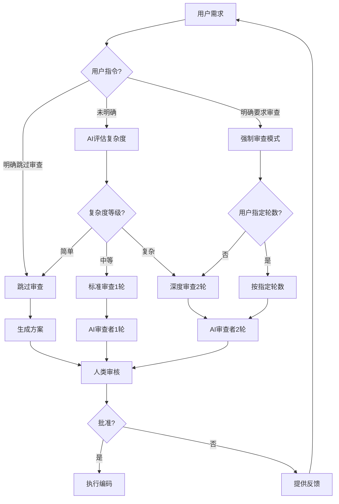

# 013 - AI 互审机制 (工作流编排器)

**优先级**: P0  
**状态**: 🟡 待讨论  
**预估工作量**: 1 周  
**来源**: 《AI 编程的现状.md》方法 1 + 《AI_PROGRAMMING_ANALYSIS.md》  
**依赖**: 001 (AI 角色库) - 需要 `plan_reviewer` 角色  
**实施顺序**: 在 001 完成后实施

---

## 📋 问题描述

### 核心定位调整

> **重要**: 本优化点定位为**工作流编排器**，负责协调审查流程，而非实现具体审查角色。

**职责划分**:

- **本优化点 (013)**: 工作流编排 + 复杂度评估 + 分级审查机制
- **001 (AI 角色库)**: 提供 `plan_reviewer` 角色的具体实现

**依赖关系**: 必须在 001 完成后实施

### 原文观点

> "还是得把一个独立的第三方带入到 1V1 的 AI 编程流程中去，时刻地去监管和反馈。这个第三方一般来说要么是一个资深的开发者，要么是另一个同样智能等级的生成式 AI。这种对抗式编程一般能消除单一模型的鬼打墙现象（尤其是自己写的 bug 自己找不出这种）。"

### 核心痛点

1. **单一 AI 的盲点**

   - AI 生成的代码可能有自己发现不了的问题
   - "鬼打墙"现象：重复犯同样的错误
   - 缺少外部视角的审查

2. **人工审查的局限**

   - 需要人类有足够经验和时间
   - 审查质量不稳定
   - 无法实时进行

3. **不是所有方案都需要深度审查**

   - 简单修改不需要 AI 审查，浪费 Token
   - 复杂变更必须深度审查，否则风险高
   - 缺少智能分级机制

4. **V2.3 的现状**
   - 有方案生成+人工审核机制
   - 缺少 AI 层面的互审
   - 缺少复杂度评估和分级审查
   - 评分: ⭐⭐⭐⭐ (4/5)

---

## 💡 解决方案

### 核心设计理念

**参考 Claude Code 的分级思考模式**:

- Claude Code: `think hard` / `think harder` / `ultra think`
- 本框架: `快速模式` / `标准审查` / `深度审查`

**用户指令优先原则** ⭐:

1. 用户明确要求审查 → 执行审查（忽略复杂度评估）
2. 用户明确要求跳过 → 跳过审查（忽略复杂度评估）
3. 用户未明确 → AI 自动评估复杂度 → 分级审查

### 工作流程图



### 工作流程

#### 1. 用户指令识别（优先级最高）

**用户指令语法** (参考 Claude Code):

```markdown
# 明确要求审查

"请审查这个方案"
"需要深度审查"
"再检查一遍"
"再确认一下"
"@review:standard" (标准审查 1 轮)
"@review:deep" (深度审查 2 轮)
"@review:ultra" (超深度审查 3 轮)

# 明确跳过审查

"跳过审查"
"不需要审查"
"@review:skip"

# 未明确 → 自动评估复杂度

正常描述需求，无特殊指令
```

**处理逻辑**:

1. ✅ **用户指令优先** - 检测到明确指令，直接执行
2. ✅ **自动评估** - 未检测到指令，AI 评估复杂度

#### 2. 复杂度自动评估（仅在用户未明确时）

**评估维度**:

```markdown
**简单** (跳过 AI 审查):

- 单文件修改 (≤50 行)
- 简单 bug 修复 (逻辑错误、拼写错误)
- 配置调整 (环境变量、参数调整)
- 文档更新

**中等** (标准审查 1 轮):

- 多文件修改 (2-5 个文件)
- 新增小功能 (≤200 行)
- 局部重构 (单个模块内)
- API 调整 (非破坏性)

**复杂** (深度审查 2 轮):

- 架构变更 (影响多个模块)
- 核心模块修改 (认证、支付、数据库)
- 跨模块功能 (≥5 个文件)
- 破坏性 API 变更
- 性能关键路径修改
```

**评估输出**:

```markdown
AI 评估结果:
复杂度: 中等
理由: 涉及 3 个文件修改，新增 API 端点，但不影响核心架构
建议: 标准审查 1 轮
```

#### 3. 方案生成阶段

```markdown
**AI 生成者** (Generator)
└── 输入: 用户需求 + 项目文档
└── 输出: plans/xxx_feature.md
└── 包含: 技术方案 + 实施步骤 + 影响评估 + 复杂度评估
```

#### 4. AI 互审阶段（依赖 001 的 plan_reviewer 角色）

**快速模式** (跳过审查):

```markdown
直接生成方案 → 人类审核
```

**标准审查** (1 轮):

```markdown
**AI 审查者** (来自 001/runtime/plan_reviewer.md)
└── 输入: 生成的方案 + 框架规范
└── 审查清单:
├── 是否符合 AI 编码禁忌？
├── 是否引入不必要复杂性？
├── 是否有更优方案？
├── 是否考虑错误处理？
├── 是否考虑性能影响？
├── 是否考虑安全风险？
├── 是否更新相关文档？
└── 输出: 标准审查报告 (1 轮)
```

**深度审查** (2 轮):

```markdown
**第 1 轮审查** (来自 001/runtime/plan_reviewer.md)
└── 基础审查清单 (同标准审查)
└── 输出: 第 1 轮审查报告

**第 2 轮审查** (更严格的标准)
└── 输入: 方案 + 第 1 轮报告
└── 深度审查清单:
├── 是否有架构层面的问题？
├── 是否考虑所有边界情况？
├── 是否有更优的替代方案？
├── 是否评估长期技术债？
├── 是否考虑可测试性？
├── 是否考虑可维护性？
└── 输出: 第 2 轮深度审查报告
```

**超深度审查** (3 轮，用户明确要求):

```markdown
第 1 轮 + 第 2 轮 + 第 3 轮（安全与性能专项审查）
```

#### 5. 改进循环（可选）

**循环控制**:

```markdown
如果审查发现问题:
AI 生成者 → 阅读审查报告 → 改进方案 → 重新提交审查

**限制**:

- 标准审查: 最多 1 次改进循环
- 深度审查: 最多 2 次改进循环
- 超深度审查: 最多 3 次改进循环

**终止条件**:

1. 审查通过
2. 达到最大循环次数
3. 人类主动介入
```

#### 6. 人类决策

```markdown
人类开发者:
└── 阅读: 生成的方案 + AI 审查报告
└── 决策: 批准 / 拒绝 / 提供反馈
```

### 技术实现

#### 核心组件

```python
# mutual_review_coordinator.py

class MutualReviewCoordinator:
    """AI互审工作流编排器"""

    def __init__(self, agent_library):
        self.agent_library = agent_library  # 依赖001的AI角色库
        self.plan_reviewer = agent_library.get_agent('plan_reviewer')

    def process_request(self, user_request, project_context):
        """处理用户请求，协调审查流程"""

        # 1. 识别用户指令
        review_mode = self.detect_user_command(user_request)

        if review_mode == 'skip':
            return self.quick_mode(user_request, project_context)
        elif review_mode in ['standard', 'deep', 'ultra']:
            return self.review_mode(user_request, project_context, review_mode)
        else:
            # 2. 自动评估复杂度
            complexity = self.assess_complexity(user_request, project_context)
            return self.auto_mode(user_request, project_context, complexity)

    def detect_user_command(self, user_request):
        """检测用户指令"""
        patterns = {
            'skip': ['跳过审查', '不需要审查', '@review:skip'],
            'standard': ['@review:standard', '标准审查'],
            'deep': ['@review:deep', '深度审查', '请审查'],
            'ultra': ['@review:ultra', '超深度审查']
        }

        for mode, keywords in patterns.items():
            if any(kw in user_request for kw in keywords):
                return mode
        return None

    def assess_complexity(self, user_request, project_context):
        """AI自动评估复杂度"""
        prompt = f"""
        评估以下需求的复杂度（简单/中等/复杂）:

        需求: {user_request}
        项目上下文: {project_context}

        评估维度:
        - 影响文件数量
        - 代码行数估算
        - 是否涉及核心模块
        - 是否有破坏性变更

        输出格式:
        复杂度: [简单/中等/复杂]
        理由: [具体原因]
        """
        return call_ai(prompt)

    def quick_mode(self, user_request, project_context):
        """快速模式：跳过AI审查"""
        plan = generate_plan(user_request, project_context)
        return {
            'plan': plan,
            'review_reports': [],
            'mode': 'quick'
        }

    def review_mode(self, user_request, project_context, mode):
        """审查模式：标准/深度/超深度"""
        rounds = {'standard': 1, 'deep': 2, 'ultra': 3}
        max_rounds = rounds[mode]

        plan = generate_plan(user_request, project_context)
        review_reports = []

        for round_num in range(1, max_rounds + 1):
            # 调用001的plan_reviewer角色
            review_report = self.plan_reviewer.review(
                plan=plan,
                previous_reports=review_reports,
                round_num=round_num
            )
            review_reports.append(review_report)

            # 检查是否需要改进
            if review_report.has_issues() and round_num < max_rounds:
                plan = self.improve_plan(plan, review_report)

        return {
            'plan': plan,
            'review_reports': review_reports,
            'mode': mode
        }

    def auto_mode(self, user_request, project_context, complexity):
        """自动模式：根据复杂度决定"""
        mode_mapping = {
            '简单': 'skip',
            '中等': 'standard',
            '复杂': 'deep'
        }
        mode = mode_mapping.get(complexity['level'], 'standard')

        if mode == 'skip':
            return self.quick_mode(user_request, project_context)
        else:
            return self.review_mode(user_request, project_context, mode)
```

#### 与 001 的集成

```markdown
**依赖关系**:

1. 从 001/runtime/plan_reviewer.md 加载审查角色
2. 使用标准化的审查清单和输出格式
3. 复用角色库的质量保证机制

**优势**:

- ✅ 无需重复定义审查角色
- ✅ 审查标准统一
- ✅ 可复用于其他场景
```

#### 审查清单模板

```markdown
## AI 审查清单

### 1. 规范遵守 (⚠️ 严重)

- [ ] 是否违反 AI 编码禁忌？
- [ ] 是否跳过必需的文档更新？
- [ ] 是否硬编码敏感信息？

### 2. 架构设计 (🔴 高)

- [ ] 是否引入不必要复杂性？
- [ ] 是否有更简单的方案？
- [ ] 是否考虑未来扩展性？

### 3. 风险评估 (🟡 中)

- [ ] 是否评估性能影响？
- [ ] 是否考虑安全风险？
- [ ] 是否识别潜在 bug？

### 4. 质量保证 (🔵 低)

- [ ] 是否包含错误处理？
- [ ] 是否有单元测试计划？
- [ ] 是否明确成功标准？

### 5. 文档完整性

- [ ] 是否列出需要更新的文档？
- [ ] 是否有使用示例？
- [ ] 是否有回滚方案？
```

---

## 📊 价值评估

### 解决的痛点

1. **消除单一 AI 盲点** - 双重检查机制
2. **提前发现问题** - 方案阶段而非编码后
3. **提升方案质量** - 多角度审视
4. **减少返工** - 早期纠错

### 预期效果

| 指标         | V2.3    | V3.0 预期 | 提升幅度 |
| ------------ | ------- | --------- | -------- |
| 问题发现率   | 60%     | 80-90%    | +30-50%  |
| 方案通过率   | 75%     | 90%       | +20%     |
| 返工次数     | 2.5 次  | 1.5 次    | -40%     |
| 人工审查时间 | 30 分钟 | 15 分钟   | -50%     |

### ROI 分析

**成本**:

- Token 增加: 约 30% (每次方案多一轮审查)
- 开发工作量: 1 周

**收益**:

- 减少返工: 节省 40%时间
- 提升质量: Bug 率降低 20-30%
- 降低风险: 早期发现重大问题

**净收益**: 投入 1 小时，节省 3-4 小时

---

## 🛠️ 实施计划

### 阶段 1: 设计与准备（2 天）

- [ ] 定义 AI 审查清单（10 项检查点）
- [ ] 设计 Prompt 模板
- [ ] 确定审查标准

### 阶段 2: 代码实现（3 天）

- [ ] 实现 AIGenerator 类
- [ ] 实现 AIReviewer 类
- [ ] 实现协调器（Coordinator）
- [ ] 集成到现有工作流

### 阶段 3: 测试与优化（2 天）

- [ ] 单元测试
- [ ] 端到端测试
- [ ] Token 成本优化
- [ ] 审查质量验证

---

## ⚠️ 风险与疑问

### 需要讨论的问题

1. **AI 审查者的可靠性**

   - ❓ 两个 AI 是否真能互相发现盲点？
   - ❓ 如果审查 AI 也有偏见怎么办？
   - ❓ 如何验证审查质量？

2. **模型选择**

   - ❓ 生成者和审查者是否应使用不同模型？
   - ❓ GPT-4 vs Claude-3.5，哪个更适合审查？
   - ❓ 成本 vs 质量如何平衡？

3. **审查深度**

   - ❓ 审查清单是否足够全面？
   - ❓ 是否需要分级审查（快速/标准/深度）？
   - ❓ 如何避免过度审查？

4. **循环控制**

   - ❓ 最多允许几轮改进？
   - ❓ 如何判断"无法通过审查"？
   - ❓ 人类何时介入？

5. **与 V2.3 集成**
   - ❓ 如何最小化对现有流程的影响？
   - ❓ 是否支持跳过 AI 审查？
   - ❓ 审查报告存放在哪里？

### 潜在风险

| 风险             | 可能性 | 影响 | 应对措施                |
| ---------------- | ------ | ---- | ----------------------- |
| AI 误判          | 中     | 中   | 人类最终裁决 + 反馈优化 |
| Token 成本超预算 | 中     | 低   | 缓存机制 + 分级审查     |
| 审查时间过长     | 低     | 中   | 异步处理 + 设置超时     |
| 两 AI 观点冲突   | 低     | 低   | 记录分歧，由人类判断    |

---

## 📚 参考资料

### 原文出处

- [《AI 编程的现状.md》](../../reference/AI编程的现状.md) - 方法 1
- [《AI_PROGRAMMING_ANALYSIS.md》](../../reference/AI_PROGRAMMING_ANALYSIS.md) - 3.1.1 节

### 相关技术

- 对抗式生成网络 (GAN) 的思想
- Code Review 最佳实践
- Pair Programming 模式

### 类似工具

- GitHub Copilot + CodeRabbit
- Amazon CodeGuru Reviewer
- DeepCode AI

---

## 🔄 状态跟踪

**创建日期**: 2025-11-29  
**最后讨论**: 待定  
**讨论进度**: 0%  
**决策状态**: 待讨论

---

**下一步**: 与用户讨论以上疑问，确定技术方案后移至 confirmed/
