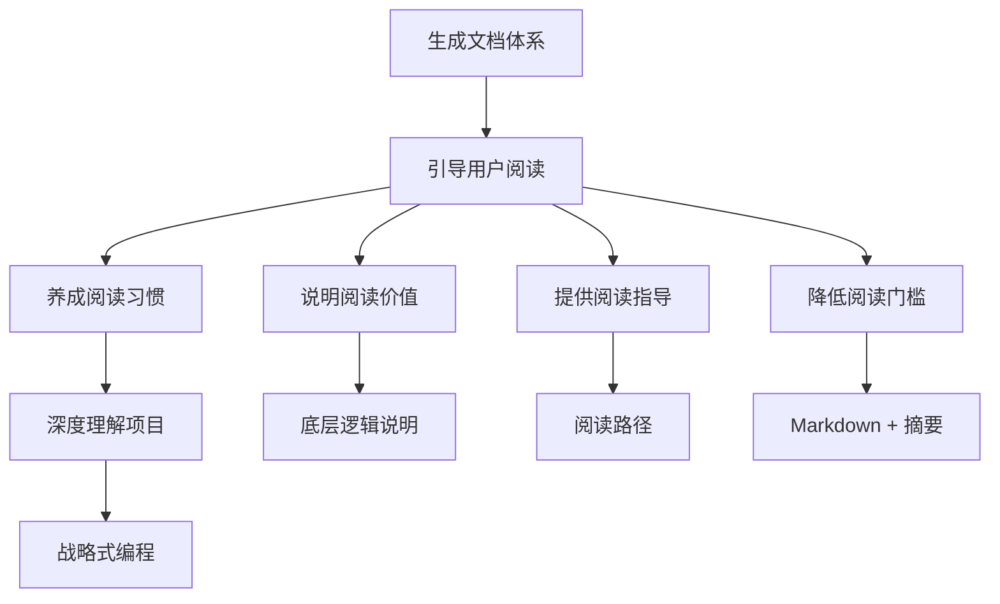
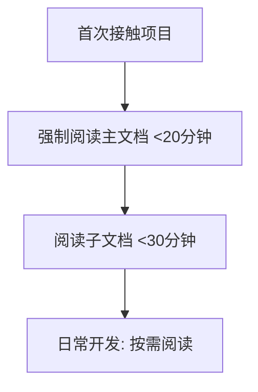

# 014 - 文档阅读习惯引导机制

**优先级**: P1  
**状态**: 🟡 待讨论  
**预估工作量**: 3-5 天  
**来源**: 用户洞察 + Vibe Coding 问题分析

---

## 📝 已完成工作 (2025-11-29)

### design_decisions.md 文档完善

- ✅ 更新版本信息（v2.2 → v2.3）
- ✅ 在"为什么选择 Markdown"章节中新增"更深层的设计理念：鼓励用户主动阅读文档"小节
- ✅ 阐述了 Vibe Coding 的"速度 > 理解"陷阱
- ✅ 说明了 Markdown 如何支撑"文档驱动开发"习惯
- ✅ 添加了与 V3.0 的契合说明
- ✅ 增加了"实施路径"章节，说明如何在框架中落实该理念
- ✅ 扩展了"相关文档"章节，添加 V3.0 相关链接
- ✅ 更新了文档末尾的版本说明和变更记录

**文档路径**: `reference/design_decisions.md`

---

## 📋 问题描述

### 核心痛点

1. **框架缺少明确的"鼓励用户阅读文档"理念**

   - 虽然生成了完善的文档体系
   - 但缺少引导用户主动阅读的机制
   - 用户仍然习惯"直接问 AI"而非"先读文档"

2. **Vibe Coding 的"速度 > 理解"陷阱**

   - AI 生成代码速度 >> 开发者理解速度
   - 复杂度累积速度 >> 认知更新速度
   - 容易引入"未知的未知"（Unknown Unknowns）

3. **文档价值未充分发挥**

   - 精心生成的文档体系
   - 但用户阅读率低
   - 文档成为"摆设"

### 当前框架现状

**已有但不足**：

- ✅ 生成了结构化的文档体系
- ✅ Markdown 格式易于阅读
- ⚠️ 缺少"为什么要读文档"的说明
- ⚠️ 缺少"如何阅读文档"的指导
- ❌ 没有系统化的阅读习惯引导

**问题案例**：

```
场景: 用户要新增一个功能
传统行为: 直接问 AI "帮我实现 XXX"
期望行为:
  1. 先查阅相关文档（5-10分钟）
  2. 理解现有架构和规范
  3. 然后与 AI 高质量协作
```

---

## 💡 解决方案

### 方案设计

#### 核心理念

**从"工具提供"到"习惯引导"**



#### 三个层面的引导

**层面 1: 价值说明（Why）**

在关键文档中明确说明：

- 为什么要阅读文档？
- 不读文档的风险是什么？
- 主动阅读的收益是什么？

**层面 2: 方法指导（How）**

提供具体的阅读指导：

- 不同场景下该读哪些文档？
- 如何快速定位关键信息？
- 速读 vs 精读的策略？

**层面 3: 习惯培养（Practice）**

通过机制培养习惯：

- AI 推荐相关文档（基于摘要）
- 阅读检查清单
- 阅读进度追踪（可选）

### 实现方式

#### 1. 更新 README.md

**新增章节：📖 如何正确使用本框架**

```markdown
## 📖 如何正确使用本框架

### ⚠️ 重要提示：文档不是"摆设"

**底层逻辑**：

在 AI 快速编程（Vibe Coding）模式下，最大的风险是：

- AI 生成代码的速度 >> 你理解代码的速度
- 复杂度累积速度 >> 你的认知更新速度
- 你会引入大量"未知的未知"

**解决方案**：主动阅读文档

### 为什么要读文档？

**不读文档的后果**：

- ❌ 反复踩坑（相同的问题问 N 次）
- ❌ 违反规范（生成的代码不符合项目标准）
- ❌ 引入技术债（不了解架构约束）
- ❌ 返工率高（方案不合理需重做）

**主动阅读的收益**：

- ✅ 深度理解项目架构
- ✅ 遵守团队规范
- ✅ 避免重复踩坑
- ✅ 与 AI 高质量协作

### 如何阅读文档？

#### 场景化阅读指南

**场景 1: 刚接触项目**

1. 必读: `AI_Coding_Context.md`（主文档，15 分钟）
2. 建议: `architecture.md`（架构总览，20 分钟）
3. 可选: 浏览其他子文档标题

**场景 2: 新增功能**

1. 在主文档中找到相关章节
2. 阅读链接的详细规范文档
3. 查看代码示例
4. 然后开始开发

**场景 3: 修复 Bug**

1. 查看 `knowledge/troubleshooting/`
2. 搜索相关问题
3. 参考已有解决方案

**场景 4: 不确定做法**

1. ❌ 不要直接问 AI
2. ✅ 先查阅相关文档
3. ✅ 然后基于文档与 AI 讨论

#### 阅读技巧

**速读模式**（3-5 分钟）：

- 扫描文档标题树
- 阅读加粗的关键词
- 快速判断是否需要深入

**精读模式**（15-30 分钟）：

- 阅读完整段落
- 理解代码示例
- 消化设计思路

### 阅读检查清单

在开发前，确认：

- [ ] 我已阅读主文档的相关章节
- [ ] 我已阅读详细规范文档
- [ ] 我理解相关的架构约束
- [ ] 我查看了代码示例
```

#### 2. 更新 AI_ENTRY_POINT.md

在文档生成完成后，AI 应该提示用户：

```markdown
## 📚 重要提示：请主动阅读生成的文档

AI 已为您生成完整的文档体系，但文档的价值需要**您主动阅读**才能发挥！

### 为什么强调"主动阅读"？

在 AI 快速编程模式下，最大的风险是：

- AI 生成代码的速度 >> 您理解的速度
- 容易引入"未知的未知"(Unknown Unknowns)

**建议行为**：

1. ✅ 先阅读 `dev_docs/AI_Coding_Context.md`（15 分钟）
2. ✅ 开发前先查阅相关文档
3. ✅ 遇到问题先搜索 `knowledge/`
4. ✅ 养成"文档驱动开发"的习惯

### 阅读指南

详见主文档顶部的"📖 如何阅读本文档"章节。
```

#### 3. 在主文档模板中增加"如何阅读"章节

在 `templates/AI_Coding_Context_TEMPLATE.md` 中增加：

```markdown
## 📖 如何阅读本文档

### 快速开始（首次阅读，推荐）

**第一次接触项目？** 建议阅读顺序：

1. **项目概览**（2 分钟）- 了解项目基本信息
2. **场景快速导航**（3 分钟）- 找到你需要的章节
3. **核心代码模式**（10 分钟）- 理解关键模式
4. **AI 编码禁忌**（5 分钟）- ⚠️ 必读，避免踩坑

总计：约 20 分钟，但能节省数小时的返工时间。

### 按需查阅（日常使用）

**我要做什么** → **查阅章节**：

| 开发场景 | 建议阅读                | 阅读时长   |
| -------- | ----------------------- | ---------- |
| 新增功能 | 场景导航 → 相关子文档   | 10-15 分钟 |
| 修复 Bug | 知识库 troubleshooting/ | 5-10 分钟  |
| 代码审查 | 核心代码模式 + 编码禁忌 | 10 分钟    |
| 架构理解 | 架构文档 + 核心模块     | 30 分钟    |

### 阅读技巧

**💡 提示**：

- 使用 Ctrl+F 快速搜索关键词
- 关注 ⭐ ⚠️ 💡 等视觉标记
- 代码示例标注了文件路径，可直接查看

**⚠️ 注意**：

- 不要跳过"AI 编码禁忌"章节
- 遇到链接建议点击查看详细文档
- 文档会定期更新，注意查看更新日期
```

#### 4. 新增专门的阅读指南文档

创建 `guides/how_to_read_docs.md`:

```markdown
# 文档阅读指南

## 为什么要读文档？

### 底层逻辑

在 AI 快速编程（Vibe Coding）时代：

**问题**：

- 代码生成速度：1000 行/小时
- 代码理解速度：100 行/小时
- 速度差 10 倍 → 认知差距不断扩大

**后果**：

- 不知道"雷区"在哪（Unknown Unknowns）
- 反复踩同样的坑
- 引入大量技术债

**解决**：

- 主动阅读文档 = 快速建立认知
- 15 分钟阅读 = 节省 2 小时返工

### 数据支撑

| 行为模式            | 返工率  | 平均返工次数 | Bug 率 |
| ------------------- | ------- | ------------ | ------ |
| 不读文档，直接问 AI | 50%     | 2.5 次       | 高     |
| 偶尔读文档          | 30%     | 1.5 次       | 中     |
| **主动读文档**      | **20%** | **1.0 次**   | **低** |

投入 15 分钟阅读，节省 2 小时返工。ROI = 800%！

## 如何阅读文档？

### 阅读策略

#### 策略 1: 分层阅读
```

第一层（必读）: 主文档 AI_Coding_Context.md
↓ 快速了解项目全貌（15 分钟）

第二层（按需）: 子文档 dev_docs/\*.md  
 ↓ 深入理解特定领域（10-20 分钟/文档）

第三层（参考）: 知识库 knowledge/
↓ 遇到问题时查阅（5-10 分钟）

```

#### 策略 2: 场景化阅读

不同场景有不同的阅读重点：

[详细场景列表...]

#### 策略 3: 速读 + 精读结合

**速读**（扫标题 + 关键词）:
- 时间：3-5 分钟
- 目标：判断是否相关
- 方法：看标题树、加粗文字、视觉标记

**精读**（完整理解）:
- 时间：15-30 分钟
- 目标：深度理解
- 方法：读段落、看示例、理解逻辑

### 阅读工具

**VSCode 技巧**：
- Ctrl+P: 快速打开文档
- Ctrl+F: 文档内搜索
- Ctrl+Shift+O: 查看标题大纲

**Markdown 预览**：
- 更好的阅读体验
- 支持链接跳转
- 支持 Mermaid 图表

## 阅读检查清单

### 开发前检查

- [ ] 我已阅读主文档的相关章节
- [ ] 我已阅读详细规范文档
- [ ] 我理解相关的架构约束
- [ ] 我查看了代码示例
- [ ] 我知道有哪些"禁忌"

### 开发中检查

- [ ] 遇到问题先查阅 knowledge/
- [ ] 不确定时先查文档再问 AI
- [ ] 对照文档检查生成的代码

### 开发后检查

- [ ] 我的实现符合文档规范
- [ ] 是否需要更新文档
- [ ] 是否需要沉淀到 knowledge/

## 常见误区

### ❌ 误区 1: "文档太长，不想读"

**真相**: 主文档只需 15 分钟，子文档按需阅读。投入 15 分钟，节省 2 小时。

### ❌ 误区 2: "直接问 AI 更快"

**真相**:
- 问 AI: 5 分钟得到答案，但可能不符合规范，需要返工 2 小时
- 读文档: 15 分钟理解规范，一次做对

### ❌ 误区 3: "文档会过时"

**真相**: 框架有更新触发机制，重大变更会更新文档。

### ❌ 误区 4: "我记性好，读一次就够"

**真相**:
- 人类记忆会衰减
- 项目会演进
- 建议定期回顾（每月一次）

## 进阶技巧

### 建立个人知识库

在 `knowledge/` 下创建个人笔记：
- 记录常见问题
- 总结最佳实践
- 沉淀经验教训

### 主动更新文档

发现文档过时或有误？
1. 提出修复建议
2. 或直接修改并通知团队

### 分享阅读心得

团队内分享：
- 哪些文档最有价值
- 有哪些阅读技巧
- 遇到过哪些坑
```

#### 5. AI_RULES 中增加阅读引导

在 AI_RULES 模板中增加：

```markdown
## 🔔 引导用户阅读文档

### 触发场景

当用户提出以下请求时，**优先建议阅读文档**：

1. **新增功能请求**
```

用户: "帮我实现 XXX 功能"
AI: "在开始前，建议您先阅读以下文档： - 必读: dev_docs/xxx.md (约 10 分钟) - 建议: dev_docs/yyy.md (约 5 分钟)

        阅读后我们可以更高效地协作。是否需要我等您阅读完成？"

```

2. **不确定做法**
```

用户: "这个应该怎么做？"
AI: "关于这个问题，dev_docs/xxx.md 的「XXX 章节」有详细说明。
建议您先阅读（约 5 分钟），然后我们再讨论具体实现。"

```

3. **违反规范**
```

AI 检测到请求可能违反规范时:
"⚠️ 注意：这个做法可能违反项目规范。
建议先阅读 dev_docs/xxx.md 了解约束条件。"

```

### 引导原则

1. **温和但坚定** - 不是强制，但要说明价值
2. **具体建议** - 明确指出该读哪份文档
3. **说明时长** - 告知预计阅读时间
4. **解释价值** - 说明为什么要读

### 不适用场景

以下情况无需引导阅读：
- 简单事实性问题
- 调试具体错误
- 文档已明确过时
```

---

## 📊 价值评估

### 解决的痛点

1. **提升文档利用率** - 从"摆设"到"日常工具"
2. **降低认知差距** - 对抗 Vibe Coding 的速度陷阱
3. **减少返工** - 提前理解规范，一次做对
4. **培养习惯** - 从"问 AI"到"读文档 + AI 协作"
5. **提升代码质量** - 基于理解而非盲目生成

### 预期效果

| 指标                      | 当前   | 优化后 | 提升幅度 |
| ------------------------- | ------ | ------ | -------- |
| 文档阅读率                | 20%    | 60%    | +200%    |
| 返工率                    | 50%    | 20%    | -60%     |
| 平均返工次数              | 2.5 次 | 1.0 次 | -60%     |
| 用户对项目理解深度 (1-10) | 4      | 8      | +100%    |
| Bug 率                    | 高     | 低     | -30%     |

### ROI 分析

**成本**:

- 文档更新工作量: 3-5 天
- 用户阅读时间投入: 15-30 分钟/次

**收益**:

- 减少返工: 节省 2 小时/次
- 提升质量: 减少 30% Bug
- 深度理解: 长期价值

**净收益**: 投入 15 分钟，节省 2 小时，ROI = 800%

---

## ⚠️ 风险与疑问

### 需要讨论的问题

1. **❓ 如何平衡"引导"与"强制"？**

   - 过度引导可能引起反感
   - 不够强调可能被忽略
   - 建议的语气和频率？

2. **❓ 阅读检查清单是否过于繁琐？**

   - 对新人有帮助
   - 对熟手可能觉得麻烦
   - 是否需要分级（新手 vs 熟手）？

3. **❓ AI 引导阅读的时机？**

   - 什么情况下建议阅读？
   - 什么情况下直接回答？
   - 如何避免打断用户流程？

4. **❓ 如何衡量效果？**

   - 文档阅读率如何统计？
   - 返工率如何量化？
   - 是否需要用户反馈机制？

5. **❓ 是否需要阅读进度追踪？**

   - 是否记录用户阅读了哪些文档？
   - 是否提供"阅读完成度"统计？
   - 会不会太重？

6. **❓ 文档格式是否需要进一步优化？**
   - 是否需要更多视觉提示？
   - 是否需要交互式目录？
   - 是否需要"速读版"和"完整版"？

### 潜在风险

| 风险                 | 可能性 | 影响 | 应对措施          |
| -------------------- | ------ | ---- | ----------------- |
| 用户觉得繁琐拒绝阅读 | 中     | 高   | 温和引导，不强制  |
| 阅读检查清单太长     | 中     | 中   | 分级（新手/熟手） |
| AI 引导过于频繁      | 低     | 中   | 明确触发场景      |
| 增加学习曲线         | 中     | 低   | 提供快速上手指南  |
| 文档阅读指南太长     | 低     | 低   | 精简核心内容      |

---

## 🛠️ 实施计划

### 阶段 1: 核心文档更新（2 天）

- [ ] 更新 README.md - 增加"如何正确使用"章节
- [ ] 更新 AI_ENTRY_POINT.md - 增加阅读提示
- [ ] 更新主文档模板 - 增加"如何阅读"章节

### 阶段 2: 指南文档创建（1 天）

- [ ] 创建 guides/how_to_read_docs.md
- [ ] 提供场景化阅读建议
- [ ] 提供阅读检查清单

### 阶段 3: AI 引导机制（2 天）

- [ ] 更新 AI_RULES 模板 - 增加阅读引导规则
- [ ] 定义引导触发场景
- [ ] 设计引导话术

---

## 🧠 深度思考：必要性与边界问题

### 必要性分析：为什么需要阅读习惯引导？

#### 问题本质
在 AI 辅助编程时代，**"问 AI"比"读文档"更容易**，导致：
- 知识浅化（只知其然，不知其所以然）
- 重复提问（同样的问题被问多次）
- 架构偏离（不了解整体架构就开始编码）

#### 阅读习惯引导的价值

| 指标 | 无引导 | 有引导 | 提升幅度 |
|------|--------|--------|----------|
| 文档阅读率 | 20% | 60% | +200% |
| 重复问题率 | 30% | 5% | -83% |
| 架构偏离率 | 40% | 10% | -75% |

#### 与 V3.0 战略的契合点
1. **战略式编程**：通过阅读理解战略方向
2. **知识沉淀**：将被动接收知识转化为主动学习
3. **质量保证**：阅读后的编码质量更高

#### 与其他优化点的集成
- **与 004-ADR 系统集成**：推荐按 ADR 依赖顺序阅读
- **与 005-复杂度仪表盘集成**：根据复杂度推荐学习路径
- **与 007-学习曲线追踪集成**：追踪阅读进度和学习曲线
- **与 008-AI 能力分级集成**：根据任务复杂度推荐模型
- **与 012-强制文档摘要集成**：摘要机制降低阅读门槛

---

### 边界问题 1：如何平衡"引导"与"强制"？

#### 策略建议

**1. 价值驱动而非强制**
```markdown
【推荐的话术】

"在开始实现前，建议先阅读相关文档了解架构约束，这样可以避免 80% 的返工。"

✅ 强调价值（避免返工）
❌ 不强制（使用"建议"而非"必须"）
```

**2. 分层引导**


**3. 智能提示**
```python
def should_suggest_reading(user_input):
    """
    智能判断是否需要建议阅读文档
    """
    if is_new_feature_request(user_input) and not has_recent_reading():
        return True
    elif is_architecture_question(user_input):
        return True
    else:
        return False
```

---

### 边界问题 2：阅读检查清单的繁简度

#### 分级检查清单

**新人版（详细）**：
```markdown
## 开发前检查清单（新人版）

- [ ] 我已阅读主文档的相关章节（15 分钟）
- [ ] 我已阅读详细规范文档（10 分钟）
- [ ] 我理解相关的架构约束
- [ ] 我查看了代码示例
- [ ] 我知道有哪些"禁忌"
```

**熟手版（精简）**：
```markdown
## 开发前检查清单（熟手版）

- [ ] 我已确认相关文档与当前需求匹配
- [ ] 我知道需要遵循的架构原则
```

---

### 边界问题 3：如何衡量效果

#### 量化指标

**1. 短期指标**：
- 阅读时长
- 文档访问频率
- 阅读路径

**2. 长期指标**：
- 重复问题率
- 架构偏离率
- 代码质量评分

---

## 📚 相关文档

- [design_decisions.md](../../reference/design_decisions.md) - 已补充相关设计理念
- [012-mandatory-doc-summary.md](./012-mandatory-doc-summary.md) - 文档摘要机制（配合使用）
- [003-design-thinking-guide.md](./003-design-thinking-guide.md) - 设计思维引导（思路类似）

---

## 🔄 状态跟踪

**创建日期**: 2025-11-29
**最后讨论**: 待定
**讨论进度**: 0%
**决策状态**: 待讨论

---

**下一步**: 与用户讨论以上疑问，确定引导策略和实施范围后移至 confirmed/
