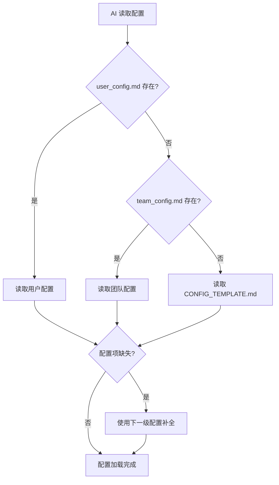

# 016 - 配置管理系统

**优先级**: P1  
**状态**: 🟡 待讨论  
**预估工作量**: 3 天  
**来源**: 用户洞察 + 前瞻性设计需求  
**依赖**: 无（基础设施）  
**被依赖**: 001、002、003、004、008、013 等多个优化点

---

## 📋 问题描述

### 核心痛点

**问题 1: 配置分散，缺少统一管理**

当前框架中，用户配置散落在多处：

- 语言偏好：每次生成时询问，不持久化
- 项目检测结果：记录在 `generation_plan.md`
- 框架元数据：零散记录在各个文档中

**问题 2: V3.0 功能开关无处存储**

V3.0 规划的 15 个优化点中，至少有 **5-7 个需要配置项**：

| 优化点           | 配置项示例              | 说明                                 |
| ---------------- | ----------------------- | ------------------------------------ |
| 001-AI 互审      | `enableMutualReview`    | 是否启用 AI 互审机制                 |
| 002-危险指令拦截 | `dangerousCommandGuard` | 拦截级别：strict/moderate/permissive |
| 003-设计思维引导 | `enforceDesignThinking` | 是否强制 5 Why 分析                  |
| 004-ADR 系统     | `enableADR`             | 是否启用架构决策记录                 |
| 008-AI 能力分级  | `aiCapabilityTier`      | AI 能力级别：basic/advanced/expert   |
| 013-AI 角色库    | `preferredRoles`        | 优先使用的 AI 角色列表               |

**问题 3: 用户体验不佳**

- **重复询问**：每次生成都要重新选择语言（尽管是一次性设置）
- **缺少记忆**：框架无法记住用户偏好
- **团队协作困难**：无法统一团队配置

**问题 4: 后续扩展困难**

如果等到 V3.0 中后期再引入配置系统：

- ❌ 需要重构多个工作流
- ❌ 需要迁移现有配置
- ❌ 可能破坏已有功能
- ❌ 测试成本高

### V2.3 现状

**配置处理方式**：

- 语言偏好：`core/language_rules.md` 规定每次询问
- 健康检查模式：每次选择（A/B/C）
- 其他配置：无

**临时存储方案**：

- 部分数据记录在 `dev_docs/_analysis/generation_plan.md`
- 无统一配置文件

---

## 💡 解决方案

### 方案设计

#### 1. 配置系统架构

```
config/
├── .gitignore              # 排除用户个人配置
├── README.md               # 配置系统说明文档
├── CONFIG_TEMPLATE.md      # 配置模板（框架默认值，提交到仓库）
├── user_config.md          # 用户个人配置（不提交）
└── team_config.md          # 团队统一配置（可选，提交）
```

#### 2. 配置优先级



**优先级规则**:

1. `user_config.md` (个人配置，最高优先级)
2. `team_config.md` (团队配置)
3. `CONFIG_TEMPLATE.md` (框架默认)
4. 硬编码默认值 (兜底)

#### 3. 配置文件格式

**🎯 核心设计原则**：

> **符合框架理念**：鼓励用户阅读文档
>
> 配置文件本身就是文档，用户修改配置时会理解每个选项的含义

**选择**: **Markdown + YAML Frontmatter**

**理由**:

1. ✅ **高度可读** - 人类和机器都友好
2. ✅ **自文档化** - 配置即文档，包含详细说明
3. ✅ **框架一致** - 所有框架文件都是 Markdown
4. ✅ **鼓励阅读** - 用户修改时会看到说明和最佳实践
5. ✅ **标准格式** - YAML 是广泛使用的配置格式
6. ✅ **可扩展** - 可以添加示例、最佳实践、常见问题

**格式示例**:

````markdown
---
# ===========================================
# AI Coding Context - 框架配置
# ===========================================

# 核心配置
documentLanguage: zh-CN
frameworkVersion: v3.0
lastUpdated: 2025-12-01

# V3.0 功能开关
enableMutualReview: false
dangerousCommandGuard: moderate
enforceDesignThinking: false
enableADR: false
aiCapabilityTier: auto
preferredRoles: []

# 用户偏好
verboseMode: false
defaultHealthCheckMode: standard
---

# 框架配置说明

> 📝 本文档记录您的个性化配置
>
> **配置方式**: 修改上方 YAML frontmatter 中的值
> **生效时机**: 下次运行框架时自动应用

---

## 🌍 文档语言

**YAML 字段**: `documentLanguage`  
**当前值**: `zh-CN`

**说明**: 控制生成文档的语言

**可选值**:

- `zh-CN` - 中文（简体，默认）
- `en-US` - 英文
- `ja-JP` - 日语

**示例**:

```yaml
documentLanguage: en-US # 切换到英文
```
````

---

## 🤖 AI 互审机制

**YAML 字段**: `enableMutualReview`  
**当前值**: `false`  
**对应优化点**: 001-AI 互审

**说明**: 启用后，AI 生成的方案会由另一个 AI 角色审查

**可选值**:

- `true` - 启用（推荐用于重要项目）
- `false` - 禁用（默认，快速项目）

**影响**:

- ✅ 启用: 方案质量更高，发现更多问题，但生成时间 +20%
- ❌ 禁用: 生成更快，但可能遗漏问题

---

## 🛡️ 危险指令拦截

**YAML 字段**: `dangerousCommandGuard`  
**当前值**: `moderate`  
**对应优化点**: 002-危险指令拦截

**说明**: 防止 AI 执行可能导致数据丢失的危险命令

**可选值**:

- `strict` - 严格模式
  - **适用**: 生产环境、重要项目
  - **拦截**: 文件删除、数据库删除、系统级操作
  - **行为**: 拦截并拒绝执行
- `moderate` - 适中模式（默认）
  - **适用**: 开发环境
  - **拦截**: 数据库删除、系统级操作
  - **警告**: 文件删除
- `permissive` - 宽松模式
  - **适用**: 个人学习项目
  - **行为**: 仅警告，不拦截

**使用场景**:

```yaml
# 生产环境
dangerousCommandGuard: strict

# 开发环境
dangerousCommandGuard: moderate

# 个人学习项目
dangerousCommandGuard: permissive
```

---

## 🧠 设计思维引导

**YAML 字段**: `enforceDesignThinking`  
**当前值**: `false`  
**对应优化点**: 003-设计思维引导

**说明**: 是否强制 AI 进行深度设计思考（5 Why、多方案对比、边界定义）

**可选值**:

- `true` - 强制启用
  - 适用: 重要功能开发、架构设计
  - 效果: AI 必须提供多个方案对比、深度分析
- `false` - 不强制（默认）
  - 适用: 快速原型、小功能
  - 效果: AI 可以快速给出方案

---

## 📚 架构决策记录 (ADR)

**YAML 字段**: `enableADR`  
**当前值**: `false`  
**对应优化点**: 004-ADR 系统

**说明**: 是否启用架构决策记录系统

**可选值**:

- `true` - 启用
  - 自动为重大架构决策创建 ADR 文档
  - 提升架构演进可追溯性
- `false` - 禁用（默认）

---

## 🎯 AI 能力分级

**YAML 字段**: `aiCapabilityTier`  
**当前值**: `auto`  
**对应优化点**: 008-AI 能力分级

**说明**: 指定当前使用的 AI 能力级别，框架会据此调整任务复杂度

**可选值**:

- `auto` - 自动检测（默认）
- `basic` - 基础级别（GPT-3.5、Claude Haiku）
- `intermediate` - 中级（GPT-4o-mini）
- `advanced` - 高级（GPT-4、Claude Sonnet）
- `expert` - 专家级（Claude Opus、o1）

---

## 🎭 AI 角色偏好

**YAML 字段**: `preferredRoles`  
**当前值**: `[]`  
**对应优化点**: 013-AI 角色库

**说明**: 优先使用的 AI 角色列表

**示例**:

```yaml
preferredRoles:
  - architecture_analyst
  - security_expert
  - performance_optimizer
```

**可用角色**: 参见 `agents/` 目录

---

## ⚙️ 其他偏好

### 详细模式

**YAML 字段**: `verboseMode`  
**当前值**: `false`

**说明**: 控制 AI 输出的详细程度

- `true` - 详细解释每个步骤
- `false` - 简洁输出（默认）

---

### 默认健康检查模式

**YAML 字段**: `defaultHealthCheckMode`  
**当前值**: `standard`

**说明**: 文档健康度检查的默认模式

**可选值**:

- `quick` - 快速扫描（1 分钟）
- `standard` - 标准检查（3-5 分钟，默认）
- `deep` - 深度分析（10-15 分钟）

---

## 💡 配置最佳实践

### 个人项目推荐配置

```yaml
documentLanguage: zh-CN
enableMutualReview: false # 快速开发
dangerousCommandGuard: moderate # 适度保护
enforceDesignThinking: false # 不强制
aiCapabilityTier: auto
```

### 团队项目推荐配置

```yaml
documentLanguage: zh-CN
enableMutualReview: true # 保证质量
dangerousCommandGuard: strict # 严格保护
enforceDesignThinking: true # 强制设计思考
enableADR: true # 记录架构决策
```

### 生产环境推荐配置

```yaml
enableMutualReview: true
dangerousCommandGuard: strict
enforceDesignThinking: true
enableADR: true
aiCapabilityTier: advanced # 使用高级 AI
```

---

_💡 提示: 修改 frontmatter 中的值后保存，下次运行框架时自动生效_

````

#### 4. .gitignore 配置

**config/.gitignore**:
```gitignore
# 用户个人配置，不提交到版本控制
user_config.md

# 备份文件
*.backup
*.bak
````

**用户项目 .gitignore 建议**（在 README 中提醒）:

```gitignore
# AI Coding Context 个人配置
ai_coding_context/config/user_config.md
```

#### 5. 团队协作支持

**场景**: 团队希望统一某些配置

**方案**: 创建 `team_config.md`（提交到版本控制）

**示例**:

```markdown
---
# 团队统一配置
documentLanguage: zh-CN
dangerousCommandGuard: strict
enableADR: true
---

# 团队配置说明

此配置由团队统一设定，所有成员共享。

个人可以通过 `user_config.md` 覆盖部分配置。
```

---

### 实现方式

#### 1. 配置读取流程

**位置**: `AI_ENTRY_POINT.md` 最开始

**伪代码**:

```
步骤 -1: 读取配置

1. 检测 config/user_config.md
   - 存在: 解析 YAML frontmatter → userConfig
   - 不存在: userConfig = {}

2. 检测 config/team_config.md
   - 存在: 解析 YAML frontmatter → teamConfig
   - 不存在: teamConfig = {}

3. 读取 config/CONFIG_TEMPLATE.md
   - 解析 YAML frontmatter → defaultConfig

4. 合并配置（优先级: user > team > default）
   finalConfig = merge(defaultConfig, teamConfig, userConfig)

5. 验证配置
   - 检查必需字段
   - 验证值的有效性
   - 如有问题，使用默认值并警告

6. 使用 finalConfig 进行后续流程
```

#### 2. 配置初始化流程

**首次生成时**:

```
1. 读取配置（如上）
2. 如果 user_config.md 不存在:
   - 询问用户关键配置（如语言）
   - 创建 user_config.md（从 CONFIG_TEMPLATE.md 复制）
   - 写入用户选择的值
3. 后续流程使用配置文件
```

#### 3. 配置更新机制

**用户主动修改**:

- 直接编辑 `config/user_config.md`
- 保存后下次运行自动生效

**框架自动更新**:

- 检测到新版本时，提示用户查看新增配置项
- 不自动覆盖用户配置

#### 4. 向后兼容

**V2.3 → V3.0 升级**:

```
1. 检测到旧项目（无 config/ 目录）
2. 读取 dev_docs/_analysis/generation_plan.md 中的语言配置
3. 创建 config/ 目录和 user_config.md
4. 迁移已有配置
5. 提示用户配置系统已启用
```

---

## 📊 价值评估

### 用户体验提升

1. **消除重复询问**

   - 现状: 每次生成都要选择语言
   - 改进: 只需设置一次

2. **配置透明化**

   - 现状: 不知道框架有哪些可配置项
   - 改进: 配置文件即文档，一目了然

3. **个性化**
   - 现状: 所有用户使用相同默认值
   - 改进: 可根据项目类型调整配置

### 开发效率提升

1. **统一管理**

   - 现状: 配置分散在多个文件
   - 改进: 集中在 config/ 目录

2. **易于扩展**

   - 现状: 新增配置需要修改多处
   - 改进: 只需在配置 schema 中添加

3. **团队协作**
   - 现状: 无法统一团队配置
   - 改进: team_config.md 统一管理

### 框架演进支持

1. **为 V3.0 铺路**

   - 多个优化点需要配置项
   - 提前建立配置系统避免后续重构

2. **可扩展性**
   - 新功能需要配置时，直接添加即可
   - 不需要修改核心工作流

---

## ⚠️ 风险与疑问

### 1. 兼容性风险

**❓ 问题**: 现有 V2.3 用户升级到 V3.0，配置系统如何平滑迁移？

**方案**:

- 自动检测旧项目，创建配置文件
- 迁移已有配置（如语言偏好）
- 提供升级指南

---

### 2. 复杂度风险

**❓ 问题**: 配置系统是否会增加框架复杂度，违反 KISS 原则？

**分析**:

- ✅ 合理复杂度：配置系统是必需的基础设施
- ✅ 降低长期复杂度：避免后续重构
- ✅ 用户透明：对用户是简化（不需要重复选择）

---

### 3. Markdown 解析风险

**❓ 问题**: Markdown + YAML Frontmatter 解析复杂度如何？

**分析**:

- ✅ YAML frontmatter 是标准格式，AI 可轻松解析
- ✅ 只需解析 frontmatter，不需要解析 Markdown 正文
- ⚠️ 需要验证 YAML 格式正确性

**降级方案**: 如果解析失败，使用默认配置并警告用户

---

### 4. 需要讨论的问题

1. **❓ 配置项的粒度**

   - 哪些配置应该暴露给用户？
   - 哪些配置应该保持内部？

2. **❓ 配置验证**

   - 如何验证配置值的有效性？
   - 无效配置如何处理（报错 vs 使用默认值）？

3. **❓ 配置迁移**

   - V3.0 → V3.1 如何处理配置 schema 变更？
   - 是否需要配置版本管理？

4. **❓ 团队配置 vs 个人配置的冲突**
   - 哪些配置允许个人覆盖？
   - 哪些配置必须团队统一？

---

## 🎯 实施计划

### Phase 1: 设计和规范（1 天）

**任务**:

1. 确认配置 schema（所有配置项及默认值）
2. 编写 `config/README.md`（配置系统说明）
3. 编写 `config/CONFIG_TEMPLATE.md`（配置模板）
4. 编写 `.gitignore` 规则

**产出**:

- 完整的配置文件模板
- 配置系统文档

---

### Phase 2: 工作流集成（1 天）

**任务**:

1. 修改 `AI_ENTRY_POINT.md`
   - 添加"步骤 -1: 读取配置"
2. 修改 `core/language_rules.md`
   - 优先读取配置，不存在时才询问
3. 修改 `workflows/detection_workflow.md`
   - 使用配置中的工具偏好
4. 修改 `workflows/document_health_check.md`
   - 使用配置中的默认检查模式

**产出**:

- 集成配置系统的工作流文档

---

### Phase 3: 向后兼容（0.5 天）

**任务**:

1. 编写升级指南
2. 实现配置迁移逻辑
3. 测试 V2.3 项目升级场景

**产出**:

- 升级指南文档
- 迁移方案

---

### Phase 4: V3.0 功能集成（0.5 天）

**任务**:

1. 为 001-013 等优化点添加配置项
2. 更新 CONFIG_TEMPLATE.md
3. 在各优化点文档中注明配置项名称

**产出**:

- 完整的 V3.0 配置 schema

---

### 总计工作量: 3 天

---

## 🔗 相关优化点

**依赖此优化点的**:

- 001-AI 互审机制
- 002-危险指令拦截
- 003-设计思维引导
- 004-ADR 系统
- 008-AI 能力分级
- 013-AI 角色库

**建议顺序**:

1. 先实施 016-配置管理系统（基础设施）
2. 再实施依赖它的功能优化点

---

**创建日期**: 2025-12-01  
**讨论进度**: 0%
