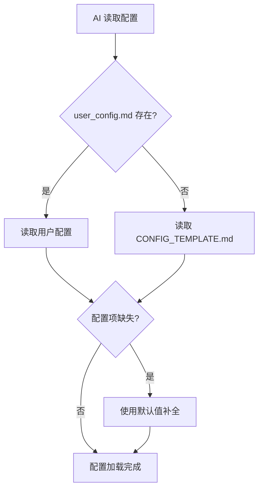

# 016 - 配置管理系统 (包含智能系统追踪器)

**优先级**: P1  
**状态**: 🟡 待讨论  
**预估工作量**: 4 天 (含 System Tracker)  
**来源**: 用户洞察 + 前瞻性设计需求  
**依赖**: 无（基础设施）  
**被依赖**: 013、002、003、004、008、001、017 等多个优化点

---

## 📋 1. 问题描述

### 1.1 核心痛点

**问题 1: 配置分散，缺少统一管理**
当前框架中，用户配置散落在多处（如 `generation_plan.md`、`core/language_rules.md`），且语言偏好等设置每次生成都需要重复询问，缺乏持久化记忆。

**问题 2: V3.0 功能开关无处存储**
V3.0 规划的多个优化点（如 AI 互审、危险指令拦截、ADR 系统）都需要开关配置。如果没有统一的配置系统，这些功能将难以管理。

**问题 3: 跨会话无法追踪高频操作**
框架目前无法记忆用户的习惯。例如，用户经常执行某种复杂的 `find` 命令或文件重命名操作，框架无法识别这种模式并推荐将其固化为工具。

### 1.2 V2.3 现状

- **配置**: 仅依靠文档中的硬编码规则或临时文件，无统一配置文件。
- **记忆**: 无跨会话记忆能力。

---

## 💡 2. 解决方案：配置管理系统

### 2.1 系统架构

专为**独立开发者**设计，摒弃复杂的团队配置和环境变量覆盖，保持简单纯粹。

```
config/
├── .gitignore              # 排除用户个人配置
├── README.md               # 配置系统说明文档
├── CONFIG_TEMPLATE.md      # 配置模板（框架默认值，提交到仓库）
└── user_config.md          # 用户个人配置（不提交，由用户本地管理）
```

### 2.2 配置优先级



**优先级规则**:

1. `user_config.md` (个人配置，最高优先级)
2. `CONFIG_TEMPLATE.md` (框架默认)
3. 硬编码默认值 (兜底)

### 2.3 配置文件格式

采用 **Markdown + YAML Frontmatter**，坚持“配置即文档”的理念。

**`user_config.md` 示例**:

```markdown
---
# ===========================================
# AI Coding Context - 用户配置
# ===========================================

# 核心配置
documentLanguage: zh-CN
frameworkVersion: v3.0

# V3.0 功能开关
enableMutualReview: false # 是否启用 AI 互审
dangerousCommandGuard: moderate # 危险指令拦截级别 (strict/moderate/permissive)
enforceDesignThinking: false # 是否强制设计思维
enableADR: true # 是否启用架构决策记录
aiCapabilityTier: auto # AI 能力分级

# 用户偏好
verboseMode: false
defaultHealthCheckMode: standard
---

# 配置说明文档

> 📝 **如何修改**: 请直接修改上方 YAML Frontmatter 中的值。
> 🔄 **生效时机**: 下次 AI 会话开始时自动生效。

## 详细说明

### 文档语言 (documentLanguage)

- `zh-CN`: 中文（默认）
- `en-US`: 英文

### 危险指令拦截 (dangerousCommandGuard)

- `strict`: 严格模式，拦截所有高危操作（推荐生产环境）
- `moderate`: 适中模式，拦截系统级操作，警告文件删除（推荐开发环境）
- `permissive`: 宽松模式，仅警告（推荐个人学习项目）
```

### 2.4 稳健性与自动修复 (Auto-Repair)

为了防止用户误修改导致配置损坏，引入自动修复机制：

1.  **校验 (Validation)**: 每次读取配置时，校验关键字段（如 `documentLanguage`）是否在合法值列表中。
2.  **不可变配置**: 某些系统级配置若被修改，视为无效。
3.  **自动修复**:
    - 若 YAML 格式错误：提示用户并降级使用默认配置。
    - 若关键字段缺失：自动使用默认值覆盖内存配置，并警告。
    - 若文件丢失：自动从 `CONFIG_TEMPLATE.md` 复制重建。

### 2.5 热重载机制 (Per-Session Reload)

由于本框架是基于文档的 AI 辅助工具，“运行”通常指一次 AI 会话。因此，**每次会话开始时都会重新读取配置**，用户修改后无需重启任何服务，即刻生效。

---

## 🔌 3. 扩展模块：智能系统追踪器 (System Tracker)

> 原 016.5 优化点，现作为配置系统的核心扩展模块。

### 3.1 核心概念

利用配置系统的存储能力，建立运行时状态文件 `config/.system/usage_stats.json`，用于记录高频操作，驱动工具沉淀。

### 3.2 状态存储设计

文件位置: `config/.system/usage_stats.json` (隐藏目录，避免干扰用户)

**数据结构 (简化版)**:
针对独立开发者场景，采用简化的**命令归一化**逻辑，而非复杂的指纹算法。

```json
{
  "last_updated": "2025-12-01T12:00:00Z",
  "command_stats": {
    "find_js_files": {
      "pattern": "find <PATH> -name '*.js'",
      "count": 12,
      "last_used": "2025-12-01"
    },
    "grep_error_logs": {
      "pattern": "grep 'Error' <FILE>",
      "count": 5,
      "last_used": "2025-11-30"
    }
  },
  "tool_recommendations": [
    {
      "trigger": "find_js_files > 10",
      "action": "suggest_use_tool",
      "tool_name": "project_scanner",
      "context": "您经常查找 JS 文件，建议使用 project_scanner 工具，它能自动忽略 node_modules"
    }
  ]
}
```

### 3.3 工作流程

1.  **记录 (Record)**: AI 执行任务时，识别复杂或重复操作，进行简单归一化（如将具体路径替换为 `<PATH>`），更新计数器。
2.  **分析 (Analyze)**: 每次会话开始时检查数据，对比预设阈值。
3.  **触发 (Trigger)**: 若满足阈值，提示用户：“检测到您经常执行 X 操作，建议创建专用工具”。

---

## 📅 4. 实施计划

### Phase 1: 基础配置系统 (1.5 天)

1.  **基础设施**: 创建 `config/` 目录结构及 `.gitignore`。
2.  **文档编写**: 编写 `CONFIG_TEMPLATE.md` 和 `config/README.md`。
3.  **核心逻辑**: 修改 `AI_ENTRY_POINT.md`，在最开头添加"步骤 -1: 读取配置"，实现配置读取、校验和自动修复逻辑。
4.  **入口更新**:
    - 更新 `README.md`: 在文件结构中添加 `config/`，并简要介绍配置方式。
    - 更新 `CONTRIBUTING.md`: 添加 `config/` 目录说明，以及"如何添加新配置项"的指南。
5.  **规范适配**: 更新 `core/language_rules.md` 适配新配置。

### Phase 2: System Tracker 集成 (1.5 天)

1.  创建 `config/.system/` 目录。
2.  实现简单的命令归一化与计数逻辑（在 AI 运行时或通过脚本辅助）。
3.  定义初始的推荐规则（如 `find` 命令频率 > 10 次推荐 `project_scanner`）。

### Phase 3: 迁移与测试 (1 天)

1.  编写 V2.3 -> V3.0 迁移指南。
2.  测试配置文件的自动创建与修复流程。
3.  验证 System Tracker 的计数准确性。

---

## 📊 价值评估

1.  **体验提升**: 消除重复询问，配置透明化，记忆用户偏好。
2.  **效率提升**: 统一管理配置，易于扩展新功能开关。
3.  **智能化**: System Tracker 让工具库能够随着用户的实际使用习惯自动生长，实现“越用越顺手”。
