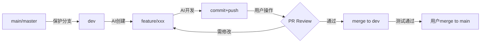

# AI 安全 Git 工作流设计方案

**提出日期**: 2025-12-03  
**提出背景**: AI 编程具有危险性,可能误删代码或引入 bug  
**核心目标**: 制定 AI 操作 Git 的安全红线和推荐工作流  
**关联优化点**: 002-dangerous-command-guard, 018-commit-guided-documentation

---

## 📋 问题定义

### 核心风险

AI 辅助编程的潜在危险:

1. **代码破坏**: AI 可能误删关键代码
2. **分支污染**: AI 直接在主分支操作,影响生产环境
3. **合并冲突**: AI 执行复杂 merge 操作导致代码丢失
4. **历史混乱**: AI 滥用 rebase/reset 破坏 Git 历史
5. **权限越界**: AI 执行用户未授权的危险操作

### 框架现状

**V2.3 及当前 V3.0**:

- ✅ 有"方案优先"机制,不直接执行代码
- ✅ 有"基于代码"原则,不能臆测
- ❌ 缺少明确的 Git 操作安全规范
- ❌ 缺少分支保护机制
- ❌ 缺少危险操作拦截

**用户的正确洞察**:

> "AI 绝对不能在 master 或 main 分支上做改动,只能在 dev 分支上改动"  
> "merge、rebase 等危险操作只能用户执行"  
> "推荐用户将寻常的 git 操作交由 AI 完成"

这完全符合 V3.0 的**主动防御体系**和**危险指令拦截**理念。

---

## 🎯 设计方案

### 方案定位

**作为 002-dangerous-command-guard 的核心组成部分**

原 002 优化点的范围:

- 识别并拦截人类的危险指令
- 防止冲动决策

**扩展后的 002**:

- 识别并拦截人类的危险指令
- **制定 AI 操作 Git 的安全红线** ⭐ 新增
- **推荐安全的 Git 工作流** ⭐ 新增
- **与变更检测、文档更新整合** ⭐ 新增

---

## 🛡️ Part 1: AI Git 安全红线

### 1.1 绝对禁止区 (RED ZONE) ⛔

**AI 绝对不能执行的操作**:

```yaml
prohibited_operations:
  # 分支保护
  - operation: "直接在保护分支上commit/push"
    branches: [main, master, production, release/*]
    reason: "可能污染生产环境"

  # 危险的历史重写
  - operation: "git reset --hard"
    reason: "可能永久丢失代码"

  - operation: "git rebase"
    reason: "可能导致历史混乱和冲突"

  - operation: "git push --force"
    reason: "可能覆盖他人代码"

  # 危险的合并操作
  - operation: "git merge"
    reason: "可能引入复杂冲突,需人工决策"

  # 危险的分支操作
  - operation: "git branch -D"
    reason: "强制删除可能丢失代码"

  - operation: "git checkout -b [branch] 从非dev分支"
    reason: "可能基于错误的基准创建分支"

  # 危险的标签操作
  - operation: "git tag -d"
    reason: "删除标签可能影响发布"

  - operation: "git tag -f"
    reason: "强制覆盖标签可能混淆版本"
```

**拦截机制**:

```markdown
当 AI 意图执行禁止操作时:

AI (内部检测): "用户要求我在 main 分支 commit..."
AI (自动拦截): ⛔ 检测到禁止操作

AI (响应用户):

> ⚠️ **安全拦截**: 我无法在 `main` 分支上直接提交代码。
>
> **原因**: 主分支应保持稳定,直接提交可能污染生产环境。
>
> **推荐做法**:
>
> 1. 我可以帮你创建一个 feature 分支: `feature/your-feature-name`
> 2. 在 feature 分支上完成开发和测试
> 3. 由你手动将 feature 分支合并到 dev 或 main
>
> 是否创建 feature 分支？
```

### 1.2 受限操作区 (YELLOW ZONE) ⚠️

**AI 可以执行,但需明确授权**:

```yaml
restricted_operations:
  # 基础分支操作
  - operation: "git checkout -b [feature-branch]"
    requires: "用户明确同意分支名称"
    auto_check: "自动检查是否从dev分支创建"

  - operation: "git add"
    requires: "用户确认要暂存的文件"
    auto_check: "排除*.log、node_modules等"

  - operation: "git commit"
    requires: "用户审核commit message"
    auto_check: "强制WHAT/WHY/HOW结构(如果启用018)"

  - operation: "git push origin [feature-branch]"
    requires: "用户确认推送分支"
    auto_check: "验证不是protected branch"

  # 安全的文件操作
  - operation: "git checkout -- [file]"
    requires: "用户确认放弃本地修改"
    warning: "此操作不可逆"

  - operation: "git clean -fd"
    requires: "用户明确同意清理未跟踪文件"
    warning: "将删除所有未跟踪文件"
```

**授权流程**:

````markdown
AI: 我准备执行以下 Git 操作:

```bash
git checkout -b feature/add-payment
git add src/payment/*
git commit -m "prompt(payment): 新增支付模块"
```
````

> 这将创建新分支 `feature/add-payment` 并提交支付模块相关文件。
>
> ✅ 安全检查通过:
>
> - 基于 dev 分支创建 ✓
> - 非保护分支 ✓
> - 文件范围合理 ✓
>
> 是否继续? (Y/n)

````

### 1.3 安全操作区 (GREEN ZONE) ✅

**AI可以自由执行的安全操作**:

```yaml
safe_operations:
  # 只读查询
  - git status
  - git log
  - git diff
  - git show
  - git branch (查看)
  - git remote -v

  # 安全的信息获取
  - git log --oneline
  - git log --grep="prompt:"
  - git diff --stat
  - git blame [file]

  # 安全的临时操作
  - git stash (保存)
  - git stash list
  - git stash show
````

---

## 🔄 Part 2: 推荐 Git 工作流

### 2.1 Feature Branch Workflow (推荐)

**标准流程**:



**详细步骤**:

#### Step 1: 初始化 (用户操作)

```bash
# 用户确保在dev分支
git checkout dev
git pull origin dev

# 告诉AI开始新功能
@AI: "帮我开发一个用户积分功能"
```

#### Step 2: AI 创建 Feature 分支

````markdown
AI:

> 收到,开始前我需要创建一个 feature 分支。
>
> **建议分支名**: `feature/user-points-system`
>
> 这将基于当前的 `dev` 分支创建。是否继续? (Y/n)

用户: Y

AI 执行:

```bash
git checkout -b feature/user-points-system
```
````

> ✅ 已创建并切换到 `feature/user-points-system` 分支
>
> 📝 基于分支: `dev` (commit: abc1234)

````

#### Step 3: AI开发 + 提交

```markdown
AI:
> 开发完成,准备提交代码。
>
> **变更文件**:
> - src/models/user.py (新增points字段)
> - src/api/points.py (新增积分API)
> - tests/test_points.py (单元测试)
>
> **Commit Message** (Commit-as-Prompt格式):
> ```
> prompt(feature): 新增用户积分系统
>
> WHAT: 实现积分累积和兑换功能
> WHY: 提升用户活跃度,对应需求PRD-2024-156
> HOW:
> - User模型新增points字段
> - API: GET/POST /api/points
> - 积分规则: 登录+1,购买+10%
> - 使用乐观锁避免并发问题
> ```
>
> 是否提交? (Y/n)

用户: Y

AI执行:
```bash
git add src/models/user.py src/api/points.py tests/test_points.py
git commit -m "prompt(feature): 新增用户积分系统" \
  -m "WHAT: 实现积分累积和兑换功能..."
git push origin feature/user-points-system
````

> ✅ 代码已提交并推送到远程分支
>
> 📊 **触发文档更新检测**:
>
> - 检测到 `prompt:` 提交
> - 变更类型: 新增核心功能 (P0)
> - 建议更新: `api_layer.md`, `database_schema.md`
>
> 是否现在更新文档? (Y/n)

````

#### Step 4: 用户合并 (关键!)

```bash
# 用户创建PR并审核
# 用户在GitHub/GitLab上操作:
# 1. Create Pull Request: feature/user-points-system → dev
# 2. Code Review
# 3. Merge (由用户手动点击)

# 或者用户本地合并:
git checkout dev
git pull origin dev
git merge feature/user-points-system  # 用户手动执行
git push origin dev

# 清理feature分支
git branch -d feature/user-points-system
git push origin --delete feature/user-points-system
````

**AI 禁止参与的环节**:

- ⛔ 合并到 dev 或 main
- ⛔ 解决合并冲突
- ⛔ 删除已合并的分支
- ⛔ 发布 tag

### 2.2 Hotfix Workflow (紧急修复)

**流程简化版**:

```bash
# 用户从main创建hotfix分支
git checkout main
git checkout -b hotfix/critical-bug-fix

# AI在hotfix分支开发
@AI: "修复支付回调超时bug"
AI: (在 hotfix/critical-bug-fix 分支操作)

# 用户合并到main和dev
git checkout main
git merge hotfix/critical-bug-fix
git push origin main

git checkout dev
git merge hotfix/critical-bug-fix
git push origin dev
```

**AI 的限制**:

- ✅ 可以在 hotfix/\*分支开发
- ⛔ 不能创建 hotfix 分支(需从 main 创建)
- ⛔ 不能合并 hotfix 分支

### 2.3 Release Workflow (发布流程)

**完全由用户操作**:

```bash
# 用户创建release分支
git checkout dev
git checkout -b release/v2.0.0

# 用户做版本号修改、changelog生成
# ...

# 用户合并到main并打tag
git checkout main
git merge release/v2.0.0
git tag -a v2.0.0 -m "Release version 2.0.0"
git push origin main --tags

# 回merge到dev
git checkout dev
git merge release/v2.0.0
git push origin dev
```

**AI 完全禁入**:

- ⛔ 不参与 release 流程
- ⛔ 不创建/删除 tag
- ⛔ 不推送 tag

---

## 🔧 Part 3: 技术实现

### 3.1 分支检测机制

```python
# tools/py/git_safety.py

def get_current_branch():
    """获取当前分支"""
    result = subprocess.run(['git', 'rev-parse', '--abbrev-ref', 'HEAD'],
                          capture_output=True, text=True)
    return result.stdout.strip()

def is_protected_branch(branch_name):
    """检查是否是保护分支"""
    protected_patterns = [
        'main',
        'master',
        'production',
        'release/*',
        'hotfix/*'  # hotfix只允许用户创建
    ]

    for pattern in protected_patterns:
        if pattern.endswith('/*'):
            prefix = pattern[:-2]
            if branch_name.startswith(prefix + '/'):
                return True
        elif branch_name == pattern:
            return True

    return False

def check_safe_to_commit():
    """检查当前分支是否安全可提交"""
    branch = get_current_branch()

    if is_protected_branch(branch):
        return {
            'safe': False,
            'reason': f"分支 '{branch}' 是保护分支,AI不能直接提交",
            'suggestion': "请切换到feature分支或创建新的feature分支"
        }

    # 检查是否是dev或feature分支
    if branch == 'dev' or branch.startswith('feature/'):
        return {
            'safe': True,
            'branch': branch
        }

    return {
        'safe': False,
        'reason': f"分支 '{branch}' 不在推荐的工作流中",
        'suggestion': "推荐使用 feature/* 分支进行开发"
    }
```

### 3.2 危险操作拦截

```python
# tools/py/dangerous_git_ops.py

DANGEROUS_PATTERNS = [
    r'git\s+reset\s+--hard',
    r'git\s+push\s+(-f|--force)',
    r'git\s+rebase',
    r'git\s+merge\s+(?!--abort)',  # 允许 git merge --abort
    r'git\s+branch\s+-D',
    r'git\s+clean\s+-[fF]',
    r'git\s+tag\s+-[df]',
]

def is_dangerous_operation(command):
    """检查是否是危险操作"""
    for pattern in DANGEROUS_PATTERNS:
        if re.search(pattern, command):
            return True
    return False

def intercept_dangerous_command(command):
    """拦截危险命令"""
    if is_dangerous_operation(command):
        return {
            'intercepted': True,
            'command': command,
            'message': """
⛔ **安全拦截**: 此操作被标记为危险操作,AI无法执行。

**命令**: `{command}`

**原因**: 此操作可能导致代码丢失或历史混乱。

**建议**:
- 由用户手动执行此操作
- 或者寻找更安全的替代方案

如果你确实需要此操作,请在终端手动执行。
            """.format(command=command)
        }

    return {'intercepted': False}
```

### 3.3 AI Rules 集成

**更新**: `templates/AI_RULES_TEMPLATE.md`

```markdown
## 🛡️ Git 操作安全规范

### 绝对禁止

你**绝对不能**执行以下 Git 操作:

1. **在保护分支操作**:
   - ⛔ 不能在 `main`, `master`, `production`, `release/*` 分支 commit/push
   - ⛔ 不能创建直接指向 main 的分支
2. **危险的历史重写**:
   - ⛔ `git reset --hard`
   - ⛔ `git rebase`
   - ⛔ `git push --force`
3. **合并操作**:
   - ⛔ `git merge` (除了 `git merge --abort`)
   - ⛔ 用户必须手动处理合并
4. **分支删除**:
   - ⛔ `git branch -D` (强制删除)
   - ⛔ 删除已推送的分支
5. **标签操作**:
   - ⛔ 创建/删除/修改标签

### 推荐工作流

**开发新功能**:

1. 确认用户当前在 `dev` 分支
2. 创建 `feature/功能名` 分支
3. 在 feature 分支开发和提交
4. 推送 feature 分支
5. **提醒用户**手动合并到 dev

**提交代码**:

1. 执行前检查当前分支 (`git branch`)
2. 如果在保护分支,拒绝操作并建议创建 feature 分支
3. 如果在 feature 分支,继续提交
4. 提交后自动触发文档更新检测

### 安全检查清单

每次执行 Git 操作前,自动检查:

- [ ] 当前分支不是保护分支
- [ ] 操作不在危险操作列表中
- [ ] 用户已明确授权
- [ ] 变更范围合理

如果任何一项失败,拒绝操作并说明原因。
```

---

## 🔗 Part 4: 与其他功能的集成

### 4.1 与 018-Commit-Guided Documentation 集成

**完美闭环**:

```
用户: "@AI 开发支付功能"
  ↓
AI: 创建 feature/payment 分支
  ↓
AI: 开发完成,准备提交
  ↓
AI: 使用 Commit-as-Prompt 格式提交 (WHAT/WHY/HOW)
  ↓
AI: 推送到 feature/payment
  ↓
AI: 自动解析commit → 检测到P0变更
  ↓
AI: "检测到需要更新: api_layer.md, database_schema.md"
  ↓
AI: 自动更新文档
  ↓
AI: "功能开发和文档更新完成,请在GitHub创建PR将feature/payment合并到dev"
  ↓
用户: 手动合并PR
```

### 4.2 与 002-Dangerous Command Guard 集成

**双重防护**:

```
用户: "@AI 直接在main分支提交代码"
  ↓
002-危险指令拦截: "检测到危险指令: 在main分支操作"
  ↓
Git Safety: "检测到保护分支: main"
  ↓
AI: ⛔ 拦截并建议安全做法
```

### 4.3 与 013-AI Mutual Review 集成

**审查维度扩展**:

Reviewer 不仅审查代码和设计,还审查:

- ✅ 分支选择是否合理
- ✅ Commit message 质量
- ✅ 是否触发了不必要的文档更新

### 4.4 与 003-Design Thinking Guide 集成

**完整流程**:

```
设计前 (003):
- 5 Why分析
- 多方案对比
- 生成 implementation_plan.md
  ↓
实施中 (Git Safety):
- AI创建 feature/xxx 分支
- 在安全分支开发
  ↓
提交时 (018):
- Commit-as-Prompt (WHAT/WHY/HOW)
- 自动触发文档更新
  ↓
合并时 (用户操作):
- 用户审核PR
- 用户手动合并
  ↓
归档 (ADR):
- 自动生成ADR (如果是架构决策)
```

---

## 📊 Part 5: 配置与自定义

### 5.1 配置文件

**新增**: `config/git_safety.yaml`

```yaml
# Git 安全配置

# 保护分支列表
protected_branches:
  - main
  - master
  - production
  - release/*

# 开发分支 (AI可以直接操作)
development_branches:
  - dev
  - develop
  - staging

# Feature分支前缀
feature_branch_prefix: "feature/"

# Hotfix分支前缀 (AI只读)
hotfix_branch_prefix: "hotfix/"

# 危险操作列表
dangerous_operations:
  - pattern: "git reset --hard"
    severity: critical
    message: "可能永久丢失代码"

  - pattern: "git push --force"
    severity: critical
    message: "可能覆盖他人代码"

  - pattern: "git merge"
    severity: high
    message: "合并操作需人工决策"
    allowed_exceptions:
      - "git merge --abort"

  - pattern: "git rebase"
    severity: high
    message: "重写历史可能导致混乱"

# 受限操作 (需用户确认)
restricted_operations:
  - pattern: "git commit"
    requires_confirmation: true
    auto_checks:
      - check_branch_safety
      - validate_commit_message # 如果启用018

  - pattern: "git push"
    requires_confirmation: true
    auto_checks:
      - check_target_branch
      - verify_not_protected

# 自动化功能
automation:
  # 提交后自动检测文档更新需求
  auto_detect_doc_updates: true

  # 推送后自动提示PR创建
  auto_suggest_pr_creation: true

  # 分支切换时自动提示
  auto_notify_branch_switch: true
```

### 5.2 用户自定义工作流

**支持团队自定义**:

```markdown
# 团队 A: GitFlow 工作流

protected_branches: [main, develop, release/*, hotfix/*]
feature_branch_prefix: "feature/"

# 团队 B: Trunk-Based Development

protected_branches: [main]
feature_branch_prefix: "task/"
development_branches: [main]

# 团队 C: GitHub Flow

protected_branches: [main]
feature_branch_prefix: "任意名称"
```

---

## 🎯 Part 6: 用户体验优化

### 6.1 友好的错误提示

**示例 1: 尝试在 main 分支提交**

````markdown
AI:

> ⛔ **安全拦截**
>
> 你当前在 `main` 分支,这是一个保护分支。
>
> **为什么被拦截?**
> 主分支应保持稳定,直接提交可能:
>
> - 污染生产环境
> - 跳过 Code Review 流程
> - 影响其他团队成员
>
> **推荐做法**:
> 1️⃣ 切换到 dev 分支:
>
> ```bash
> git checkout dev
> ```
>
> 2️⃣ 或者,我帮你创建一个 feature 分支:
> 建议名称: `feature/your-feature-name`
> 基于分支: `dev`
>
> 选择: [1️⃣ 切换到 dev] [2️⃣ 创建 feature 分支] [❌ 取消]
````

**示例 2: 尝试 merge 操作**

````markdown
AI:

> ⛔ **安全拦截**: 不支持 AI 执行合并操作
>
> **原因**:
> 合并操作可能产生复杂冲突,需要人工决策:
>
> - 选择保留哪段代码
> - 解决语义冲突
> - 验证合并后的功能正确性
>
> **请你手动操作**:
>
> ```bash
> # 1. 确保dev分支是最新的
> git checkout dev
> git pull origin dev
>
> # 2. 合并feature分支
> git merge feature/your-feature
>
> # 3. 如果有冲突,解决冲突后:
> git add .
> git commit
>
> # 4. 推送
> git push origin dev
> ```
>
> 如果遇到问题,我可以帮你:
>
> - 📋 查看冲突文件列表
> - 📖 解释冲突原因
> - 💡 提供解决冲突的建议
````

### 6.2 主动建议

**场景 1: 检测到用户在错误分支**

```markdown
AI (自动检测):

> 💡 **友好提示**
>
> 我注意到你当前在 `develop` 分支,但这个任务可能更适合在 feature 分支进行。
>
> **建议**:
> 创建 `feature/user-profile-update` 分支,这样:
>
> - ✅ 代码隔离,不影响 develop
> - ✅ 可以独立测试
> - ✅ 便于 Code Review
>
> 是否创建? (Y/n)
```

**场景 2: 功能完成后提示 PR**

````markdown
AI (推送成功后):

> ✅ 代码已推送到 `feature/payment`
>
> **下一步建议**:
>
> 1️⃣ **创建 Pull Request**:
>
> - From: `feature/payment`
> - To: `dev`
> - 标题: "新增支付模块"
> - 描述: (我已准备好 PR 描述,包含 commit 的 WHAT/WHY/HOW)
>
> 2️⃣ **本地测试**:
>
> ```bash
> # 运行测试
> npm test
> # 或
> pytest
> ```
>
> 3️⃣ **文档已同步更新**:
>
> - ✅ api_layer.md (新增支付 API 文档)
> - ✅ database_schema.md (Payment 表说明)
>
> 是否需要我生成 PR 描述? (Y/n)
````

---

## 📐 Part 7: 实施路线图

### Phase 1: 核心安全机制 (Week 1-2)

**目标**: 建立基础的安全拦截

- [ ] 开发 `tools/py/git_safety.py`
  - 分支检测
  - 保护分支判断
  - 危险操作识别
- [ ] 更新 `AI_RULES_TEMPLATE.md`
  - 添加 Git 安全规范
  - 明确禁止和允许的操作
- [ ] 基础测试
  - 单元测试
  - 安全拦截测试

### Phase 2: 工作流集成 (Week 3-4)

**目标**: 与框架现有功能集成

- [ ] 集成到 `002-dangerous-command-guard`
  - 扩展危险指令定义
  - 添加 Git 操作拦截
- [ ] 集成到 `018-commit-guided-documentation`
  - 提交后自动检测
  - 文档更新触发
- [ ] 创建 `workflows/git_safety_workflow.md`
  - Feature Branch 工作流
  - Hotfix 工作流
  - Release 工作流

### Phase 3: 配置与自定义 (Week 5)

**目标**: 支持团队自定义

- [ ] 创建 `config/git_safety.yaml`
- [ ] 支持自定义保护分支
- [ ] 支持自定义危险操作
- [ ] 迁移指南

### Phase 4: 用户体验优化 (Week 6)

**目标**: 友好的提示和建议

- [ ] 优化错误提示
- [ ] 主动建议机制
- [ ] PR 描述自动生成
- [ ] 文档和示例

---

## 📊 Part 8: 价值评估

### 8.1 风险降低

| 风险类型             | 当前 | 实施后 | 降低 |
| -------------------- | ---- | ------ | ---- |
| 主分支污染           | 高   | 极低   | -95% |
| 代码误删             | 中   | 低     | -70% |
| 合并冲突导致代码丢失 | 中   | 极低   | -90% |
| 历史混乱             | 中   | 低     | -80% |

### 8.2 开发效率

**传统 Git 操作**:

```
用户手动: 创建分支 (1min)
用户手动: 写代码和测试 (30min)
用户手动: git add, commit, push (2min)
用户手动: 创建PR (2min)
用户手动: 更新文档 (10min)
总计: 45min
```

**AI 辅助 + Git Safety**:

```
AI自动: 创建分支 (10s)
AI自动: 写代码和测试 (30min)
AI自动: commit (Commit-as-Prompt) + push (30s)
AI提示: PR创建建议 + 自动生成描述 (30s)
AI自动: 文档更新(基于commit) (2min)
用户: 审核PR并合并 (2min)
总计: 35min (节省22%)
```

### 8.3 团队协作

**改善**:

- ✅ 标准化的分支命名和工作流
- ✅ 降低新人学习 Git 的门槛
- ✅ 减少因 Git 误操作导致的问题
- ✅ 提升 Code Review 质量 (基于 feature 分支)

---

## 🎯 Part 9: 推荐行动

### 方案 A: 作为 002 的核心组成

**推荐** ⭐⭐⭐⭐⭐

**理由**:

- Git 安全是"危险指令拦截"的重要场景
- 逻辑一致,都是主动防御
- 避免优化点过度拆分

**操作**:

1. 更新 `002-dangerous-command-guard.md`
2. 添加"Git 操作安全规范"章节
3. 扩展实施计划

### 方案 B: 作为独立优化点

**可选**: `019-git-safety-workflow`

**适用场景**:

- 如果 002 已确认且范围固定
- 如果 Git 安全需要独立演进
- 如果需要单独的优先级管理

---

## 📝 Part 10: 总结

### 核心价值

1. **风险控制** ⭐⭐⭐⭐⭐

   - 主动防御 AI 误操作
   - 保护主分支和生产环境
   - 预防代码丢失

2. **标准化工作流** ⭐⭐⭐⭐

   - Feature Branch Flow
   - 清晰的职责分工(AI 开发,用户合并)
   - 降低团队协作成本

3. **与框架协同** ⭐⭐⭐⭐⭐

   - 与 018 Commit-Guided 完美闭环
   - 与 002 危险指令拦截协同
   - 与 003 设计思维引导配合

4. **用户体验** ⭐⭐⭐⭐
   - 友好的错误提示
   - 主动建议
   - 自动化 Git 操作

### 最终推荐

**强烈建议纳入 V3.0 规划**:

- **优先级**: P0 (必须实现)
- **归属**: 作为 002-dangerous-command-guard 的核心组成
- **工作量**: 约 1-2 周
- **价值**: 极高 (安全性提升 95%)

这个提案完美契合 V3.0 的"主动防御"理念,且与已完成的功能形成强大协同。

---

**文档版本**: v1.0  
**提案人**: 用户洞察  
**分析者**: AI  
**推荐评级**: ⭐⭐⭐⭐⭐ (极力推荐)
