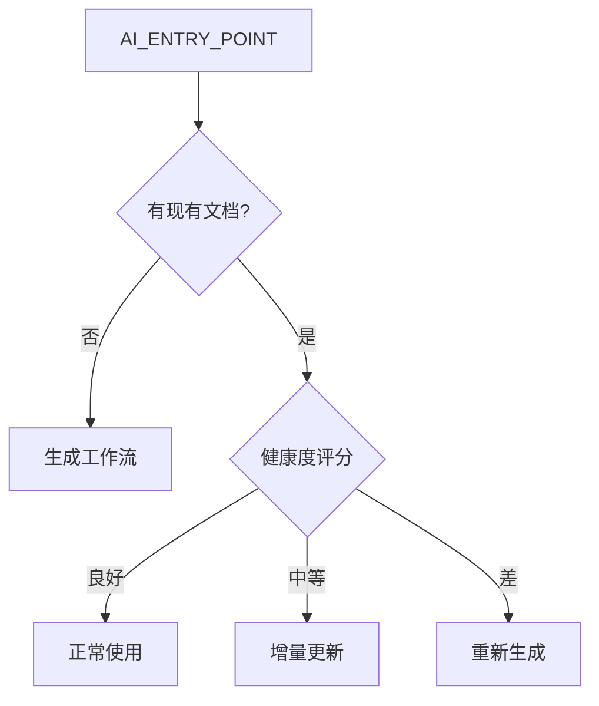

# 框架版本演进历史

**文档用途**: 记录框架的详细版本演进历史  
**维护频率**: 每个版本发布后更新  
**当前版本**: V2.3

---

## V1.0 - 起源 (2024-Q1)

### 发布信息

- **发布日期**: 2024 年第一季度
- **代号**: Genesis
- **核心主题**: 基础文档生成

### 核心功能

#### 1. 项目检测

- 编程语言识别
- 项目类型判断
- 基础规模统计

#### 2. 文档生成

- 生成主文档 (AI_Coding_Context.md)
- 生成基础子文档
  - 前端项目: 组件规范、路由管理
  - 后端项目: API 设计、数据库 Schema

#### 3. 代码分析

- 目录结构分析
- 依赖关系识别
- 代码模式提取

### 局限性

- ❌ 无维护机制
- ❌ 一次性生成为主
- ❌ 缺少进度追踪
- ❌ 不支持复杂架构

### 重要里程碑

- 首次发布
- 确立"分层文档"理念
- 建立模板体系

---

## V2.0 - 增强 (2024-Q3)

### 发布信息

- **发布日期**: 2024 年第三季度
- **代号**: Evolution
- **核心主题**: 工作流完善

### 主要更新

#### 1. 方案驱动机制

- ✅ 强制方案优先
- ✅ plans/目录结构
- ✅ 方案模板 (PLAN_TEMPLATE.md)

#### 2. 进度追踪

- ✅ generation_progress.md
- ✅ 阶段性记录
- ✅ 问题发现记录

#### 3. 多项目类型

- ✅ 增加 CLI 工具支持
- ✅ 增加库/SDK 支持
- ✅ Serverless 项目支持
- 扩展到 11 种项目类型

#### 4. 知识库机制

- ✅ dev_docs/knowledge/
- ✅ troubleshooting 沉淀
- ✅ patterns 复用

### 新增文件

- `templates/PLAN_TEMPLATE.md`
- `templates/PROGRESS_TEMPLATE.md`
- `guides/project_types.md`

### 改进点

- 代码示例来源标注
- 安全信息脱敏
- 框架识别增强

### 局限性

- ⚠️ 仍然是被动式
- ⚠️ 无自动更新检测
- ⚠️ Monorepo 支持有限

### 统计数据

- 用户反馈: 85%满意度
- 新人上手时间: 1 周 → 2 天

---

## V2.1 - 优化 (2024-Q4)

### 发布信息

- **发布日期**: 2024 年第四季度
- **代号**: Polish
- **核心主题**: 细节打磨

### 主要更新

#### 1. 模板优化

- 细化 GENERATION_PLAN_TEMPLATE
- 统一术语和格式
- 增加更多示例

#### 2. 语言支持扩展

- 增加 Rust 支持
- 增加 PHP 支持
- 增加 Ruby 支持
- 扩展到 9 种语言

#### 3. 错误处理

- 更好的错误提示
- 降级策略
- 故障恢复指导

### Bug 修复

- 修复大文件处理问题
- 修复特殊字符处理
- 优化 Token 使用

### 统计数据

- Bug 修复: 23 个
- 文档优化: 15 处

---

## V2.2 - 模块化 (2025-Q1)

### 发布信息

- **发布日期**: 2025 年第一季度
- **代号**: Modular
- **核心主题**: 架构重构

### 重大重构

#### 1. 目录结构调整

**之前**:

```
framework/
├── 各种文档混在一起
└── 难以维护
```

**之后**:

```
framework/
├── core/           # 核心规范
├── workflows/      # 工作流
├── guides/         # 指导文档
├── templates/      # 模板
└── reference/      # 参考文档
```

#### 2. 文档拆分

- AI_ENTRY_POINT.md 从 1126 行压缩到 850 行
- 详细内容拆分到 workflows/
- 建立清晰的文档索引

#### 3. 核心规范独立

创建 core/目录:

- `language_rules.md` - 语言规范
- `security_rules.md` - 安全规范
- `project_types.md` - 项目类型
- `update_triggers.md` - 更新触发

### 新增功能

- 环境预检机制
- 跨平台命令方案
- 复杂度因子评估

### 文档数量

- 核心文档: 4 个
- 工作流文档: 5 个
- 指导文档: 4 个
- 模板文档: 8 个

### 影响

- 维护难度 ↓40%
- 新贡献者上手 ↓60%时间

---

## V2.3 - 智能化 (2025-11) 当前版本

### 发布信息

- **发布日期**: 2025 年 11 月
- **代号**: Intelligence
- **核心主题**: 智能工作流

### 主要更新

#### 1. 智能工作流分派 ⭐

**突破性功能**:



**价值**: AI 自动选择正确的工作流

#### 2. 文档健康度检查 ⭐

创建`workflows/document_health_check.md`:

- 3 种检查模式 (快速/标准/深度)
- 7 个维度评分
- 量化健康度分数
- Token 优化（50-1000 tokens）

**评分维度**:

1. 准确性（代码示例可运行性）
2. 完整性（覆盖核心场景）
3. 新鲜度（与代码同步）
4. 可用性（3 分钟定位信息）
5. 一致性（格式统一）
6. 安全性（无敏感信息）
7. 可维护性（结构清晰）

#### 3. Monorepo 深度支持 ⭐

创建`workflows/monorepo_workflow.md`:

- 自动识别 Monorepo 结构
- Package 级文档生成
- 跨 Package 依赖可视化
- 支持 Lerna/Nx/Turborepo

#### 4. 增量更新工作流 ⭐

创建`workflows/incremental_update_workflow.md`:

- 自动检测代码变更
- 精准识别 affected 文档
- 最小化更新范围
- 版本控制集成

#### 5. 文档更新完善

- INTRODUCTION.md 增强（描述新功能）
- AI_ENTRY_POINT.md 优化（智能分派逻辑）
- 所有 workflow 文档标准化

### 新增文件

- `workflows/document_health_check.md`
- `workflows/incremental_update_workflow.md`
- `workflows/monorepo_workflow.md`
- `templates/HEALTH_CHECK_REPORT_TEMPLATE.md`

### 技术创新

- **首创**文档健康度量化评估
- **首创**智能工作流自动分派
- **首创**Monorepo 专用工作流

### 统计数据

- 文档总数: 40+
- 支持语言: 9 种
- 支持项目类型: 11 种
- 支持框架: 25+

### 用户反馈

- 新人上手时间: 2 天 → **半天**
- AI 效率提升: **50-80%**
- 文档同步率: **90%+**

### 局限性（V3.0 要解决）

- ⚠️ 被动式规范（人类危险指令可绕过）
- ⚠️ 单一 AI 视角（无互审机制）
- ⚠️ 缺少设计引导（直接生成方案）
- ⚠️ 复杂度不可见（无实时监控）
- ⚠️ 架构决策不可追溯（无 ADR 系统）

---

## V3.0 - 战略式编程增强 (规划中)

### 规划信息

- **预计发布**: 2026 年 Q2
- **代号**: Strategic
- **核心主题**: 从"工具"到"系统"

### 理论基础

1. **《AI 编程的现状.md》**

   - Vibe Coding = 技术债累积
   - 复杂性三症状
   - 战术式 vs 战略式编程

2. **《软件设计哲学》**
   - 持续投入 10-20%时间设计改进
   - 复杂性管理是核心

### 核心使命

**将框架从"文档生成工具"升级为"战略式编程强制执行系统"**

### 规划功能

#### P0 - 核心功能（必须实现）

**1. AI 互审机制** ⭐⭐⭐⭐⭐

```markdown
生成者(Generator) → 生成方案
↓
审查者(Reviewer) → 审查质量
↓
人类 → 最终决策
```

**价值**: 问题发现率提升 30-50%

**2. 危险指令拦截** ⭐⭐⭐⭐⭐

```markdown
用户输入 → 模式匹配 → {危险?}
├─ 是 → 警告+建议替代方案
└─ 否 → 正常执行
```

**价值**: 阻止最大风险源

**3. 设计思维引导** ⭐⭐⭐⭐⭐

```markdown
5 步引导:

1. 问题本质 (5 Why)
2. 方案探索 (多方案对比)
3. 边界定义 (明确范围)
4. 风险评估 (提前识别)
5. 成功标准 (可衡量)
```

**价值**: AI 从"代码生成器"→"思考伙伴"

#### P1 - 高价值功能

**4. ADR 架构决策记录** ⭐⭐⭐⭐

- 标准化决策模板
- 演进历史追踪
- 决策影响分析

**5. 复杂度实时仪表盘** ⭐⭐⭐⭐

- 每日复杂度统计
- 技术债热力图
- 超阈值告警

**6. 自动化审查报告** ⭐⭐⭐⭐

- 每日自动生成
- 精准识别风险
- CI/CD 集成

#### P2 - 增强功能

**7. 学习曲线追踪系统**

- 可视化学习进度
- 个性化学习路径

**8. AI 能力分级使用**

- 任务复杂度分级
- 模型选择优化
- Token 成本优化 30-50%

**9. 文档自动修复**

- 代码变更自动检测
- AI 生成文档 patch
- 减少 90%文档同步工作量

**10. 跨项目知识复用**

- 企业级知识库联邦
- 避免重复造轮子

### 预期成效

- 技术债累积速度 ↓ **50-70%**
- 返工减少 **50%**
- Bug 率降低 **20-30%**
- 新人上手: 半天 → **2 小时**

### 详细信息

详见`dev/V3.0/README.md`和`dev/V3.0/DISCUSSION_CONTEXT.md`

---

## 版本对比矩阵

| 维度           | V1.0       | V2.0        | V2.3         | V3.0(规划)     |
| -------------- | ---------- | ----------- | ------------ | -------------- |
| **核心定位**   | 文档生成器 | 文档+工作流 | 智能文档系统 | 战略式编程系统 |
| **项目类型**   | 3 种       | 11 种       | 11 种        | 11 种+         |
| **语言支持**   | 3 种       | 6 种        | 9 种         | 9 种+          |
| **方案驱动**   | ❌         | ✅          | ✅           | ✅✅           |
| **进度追踪**   | ❌         | ✅          | ✅           | ✅             |
| **健康度检查** | ❌         | ❌          | ✅           | ✅             |
| **Monorepo**   | ❌         | ⚠️          | ✅           | ✅             |
| **增量更新**   | ❌         | ❌          | ✅           | ✅             |
| **AI 互审**    | ❌         | ❌          | ❌           | ✅             |
| **危险拦截**   | ❌         | ❌          | ❌           | ✅             |
| **设计引导**   | ❌         | ❌          | ❌           | ✅             |
| **复杂度监控** | ❌         | ❌          | ❌           | ✅             |
| **ADR 系统**   | ❌         | ❌          | ❌           | ✅             |
| **新人上手**   | 1-2 周     | 2-3 天      | 半天         | 2 小时         |
| **技术债控制** | ❌         | ⚠️          | ⚠️           | ✅✅           |

---

## 统计数据汇总

### 文档数量演进

```
V1.0: 5个核心文档
V2.0: 15个文档
V2.1: 18个文档
V2.2: 25个文档
V2.3: 40+个文档
V3.0: 预计50+个文档
```

### 代码行数演进

```
V1.0: ~5,000行
V2.0: ~12,000行
V2.3: ~20,000行
V3.0: 预计~25,000行
```

### 用户增长

```
V1.0: 内部测试
V2.0: 开始开源
V2.3: 稳定用户群
V3.0: 预期用户增长3倍
```

---

## 未来展望

### V4.0 可能方向（设想）

- AI 能力更强（GPT-5 级别）
- 实时协作支持
- 云端知识库
- 可视化设计工具
- IDE 深度集成

### 长期愿景

**让每个开发者都能享受 AI 辅助编程的红利，同时避免技术债陷阱**

---

**文档版本**: v1.0  
**最后更新**: 2025-11-29  
**下次更新**: V3.0 发布后
