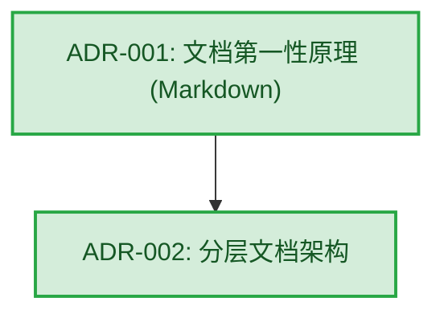
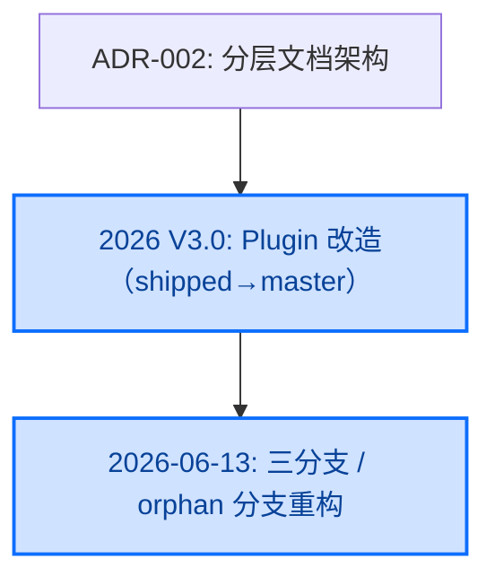

# 架构演进与决策图谱 (Architecture Evolution Graph)

本文档旨在通过有向图和时序说明，呈现项目中各核心架构决策 (ADR) 之间的依赖脉络与演进过程。

> **编号系统消歧（重要）**：项目中存在两套独立编号，勿混淆——
> - **`architecture/decisions/NNN-slug.md`** 是**架构决策记录 (ADR)**；当前仅 `001`（Markdown 第一性原理）与 `002`（分层文档架构）两份文件存在。
> - **V3.0 PROGRESS 工作项编号 NNN**（如 004 / 018 / 019）是**开发进度的工作项编号**，**不是** `decisions/` 下的 ADR 文件。`dev/README.md` 与 `FRAMEWORK_CONTEXT.md` 等处把"019"称作 ADR 系历史措辞误用——它是 PROGRESS 工作项，而非本目录下的 ADR。

## 1. 全局架构决策图谱 (Core ADRs)
以下图谱展示了 P0 级别核心决策或对其余决策产生广泛影响的根基节点。

> **注意**: 如果未来的 ADR 数量增多，将使用自动生成脚本 (`tools/generate_adr_graph.py`，规划中) 为各子领域 (Domain) 生成局部的详尽依赖图谱。

## 2. 领域架构决策图谱 (Domain ADRs)
*(预留扩充位，未来可依据 frontend / backend / devops 进行拆分展示)*

## 3. 2026 重大演进（非正式 ADR，但属架构级事件）

下列事件尚未沉淀为 `decisions/` 下的正式 ADR 文件，但已对框架的分发形态与仓库结构产生根本影响，记录于此以免演进图谱对最大事件失明：

- **Plugin 改造（已交付）**：将 AICC 从"clone 仓库 + 必读入口文档"升级为单个 Claude Code Plugin（多 skill + subagents + hooks + bin），已于 V3.0 完成并合入 master（提交 P1.5→P5「conversion complete」）。规划档案见 `dev/plan/plugin/`，迁移说明见 master 分支 `plugin/MIGRATION.md`。此事件实质改变了框架的主分发形态，但未编为正式 ADR。
- **三分支 / orphan 分支重构（2026-06-13）**：确立 master（用户面）/ dev（与 master 同步）/ internal（orphan 孤儿分支，承载 `dev/` 开发档案）三分支模型，将框架开发元数据隔离到 internal 分支。此后 `dev/V3.0/` 目录在 internal 上已移除。

> 待办：如需将上述两项正式化，应在 `decisions/` 下新建 `003-*` / `004-*` ADR 文件并回链本节。

## 4. 已归档决策池 (Archived)
关于已废弃或被替代的决策，请查阅 `dev/architecture/decisions/archived/` 目录（注：该 `archived/` 目录尚未创建，待首个归档 ADR 出现时建立）。
为了防止视觉与认知污染，历史遗物不呈现在上述的活跃主视图中。
