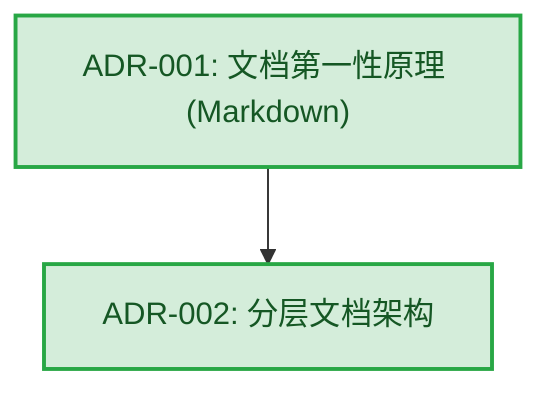

# 架构演进与决策图谱 (Architecture Evolution Graph)

本文档旨在通过有向图和时序说明，呈现项目中各核心架构决策 (ADR) 之间的依赖脉络与演进过程。

## 1. 全局架构决策图谱 (Core ADRs)
以下图谱展示了 P0 级别核心决策或对其余决策产生广泛影响的根基节点。

> **注意**: 如果未来的 ADR 数量增多，将使用自动生成脚本 (`tools/generate_adr_graph.py`，规划中) 为各子领域 (Domain) 生成局部的详尽依赖图谱。

## 2. 领域架构决策图谱 (Domain ADRs)
*(预留扩充位，未来可依据 frontend / backend / devops 进行拆分展示)*

## 3. 已归档决策池 (Archived)
关于已废弃或被替代的决策，请查阅 `dev_docs/architecture/decisions/archived/` 目录。
为了防止视觉与认知污染，历史遗物不呈现在上述的活跃主视图中。
