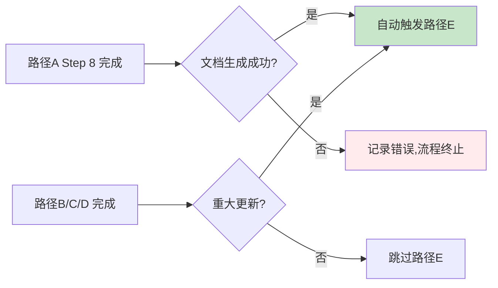
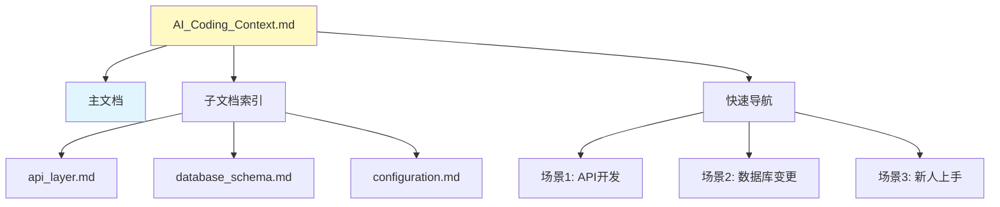
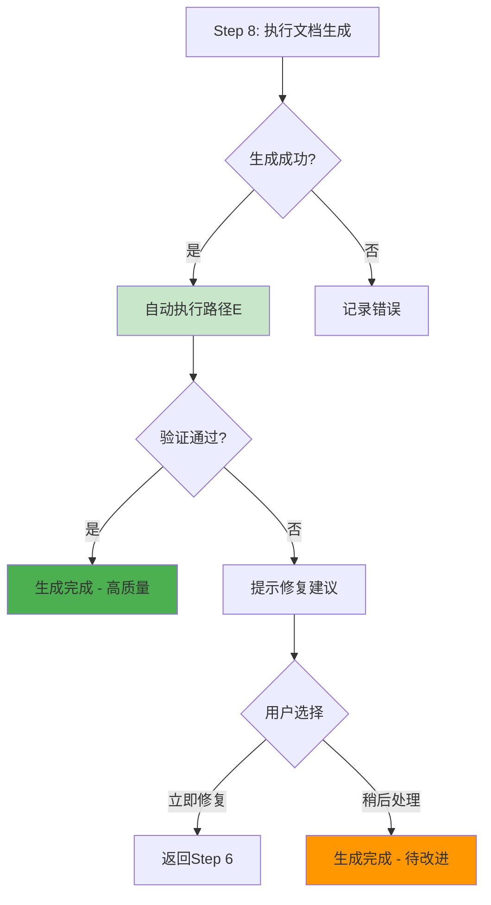
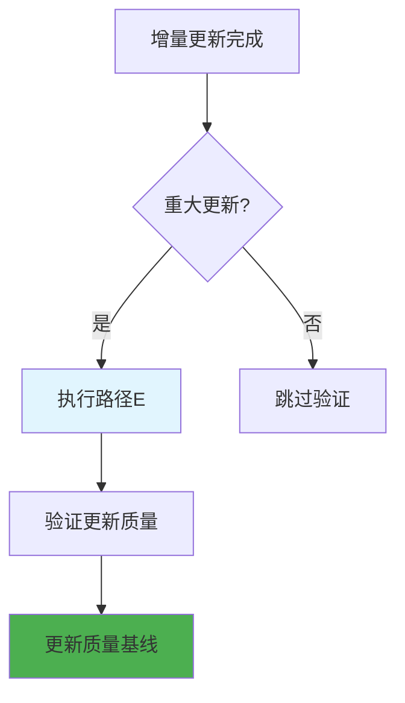

# 路径 E: 文档体系搭建后检测流程

> **触发条件**: 文档生成完成后（路径 A Step 8 结束）  
> **执行时机**: 自动生成流程的最后一步  
> **目的**: 验证新生成的文档体系是否完整、可用、可持续  
> **更新日期**: 2025-12-22

---

## 🎯 设计理念

**为什么需要搭建后检测？**

传统的文档生成流程在"生成完成"后就结束，但AI生成的文档体系需要验证三个关键问题：

1. **完整性验证** - 文档体系是否包含所有必需组件？
2. **可用性验证** - 生成的文档是否真正可用？
3. **可持续性验证** - 文档体系能否适应未来的变化？

**核心价值**:
- 🔍 **系统性验证** - 不是检查单个文档，而是验证整个文档生态系统
- ⚡ **即时反馈** - 在生成完成后立即发现问题，避免"带病上线"
- 📊 **质量基线** - 为后续的健康检查建立初始质量标准
- 🎯 **预防性维护** - 提前发现潜在问题，降低后续维护成本

---

## 🚀 执行时机与触发条件

### 触发条件


### 执行时机
- **自动生成**: 路径A（首次生成）完成后自动执行
- **手动触发**: 用户输入"验证文档体系"或"质量检查"
- **重大更新**: 路径B/C/D执行重大更新后
- **定期巡检**: 每月自动执行一次（可选）

---

## 📋 三层验证体系

### 🏗️ 第一层：结构完整性验证（Structure Validation）

**验证目标**: 文档体系的"骨骼"是否正确搭建

#### 1.1 核心组件检测
```bash
# 检测脚本示例（tools/py/post_validation.py）
def validate_core_components():
    required_files = [
        "dev_docs/AI_Coding_Context.md",           # 主文档
        "dev_docs/_analysis/generation_plan.md",   # 分析方案
        "dev_docs/_analysis/generation_progress.md", # 进度记录
        "AI_RULES.md",                             # AI规则
        "dev_docs/configuration.md",                 # 项目配置
    ]
    
    required_dirs = [
        "dev_docs/_analysis",                      # 分析文件
        "dev_docs/plans",                          # 方案文档
        "dev_docs/knowledge",                      # 知识库
    ]
    
    return check_existence(required_files + required_dirs)
```

#### 1.2 文档层级关系检测


#### 1.3 交叉引用完整性检测
```python
def validate_cross_references():
    """验证文档间的交叉引用是否正确"""
    issues = []
    
    # 检查主文档中的子文档链接
    main_doc = read_file("dev_docs/AI_Coding_Context.md")
    subdoc_links = extract_links(main_doc, pattern=r"\./(.*?\.md)")
    
    for link in subdoc_links:
        if not os.path.exists(f"dev_docs/{link}"):
            issues.append(f"主文档引用缺失: {link}")
    
    # 检查子文档间的相互引用
    subdocs = glob.glob("dev_docs/*.md")
    for doc in subdocs:
        content = read_file(doc)
        internal_links = extract_links(content, pattern=r"\[(.*?)\]\((.*?\.md)\)")
        
        for text, link in internal_links:
            if not os.path.exists(f"dev_docs/{link}") and ".md" in link:
                issues.append(f"{doc} 引用缺失: {link}")
    
    return issues
```

### 🔍 第二层：内容可用性验证（Content Usability）

**验证目标**: 文档体系的"血肉"是否丰满实用

#### 2.1 信息密度检测
```python
def validate_information_density():
    """检测文档的信息密度是否合适"""
    metrics = {}
    
    main_doc = read_file("dev_docs/AI_Coding_Context.md")
    
    # 计算关键指标
    metrics["total_lines"] = len(main_doc.split('\n'))
    metrics["code_blocks"] = len(re.findall(r'```', main_doc))
    metrics["internal_links"] = len(re.findall(r'\[.*?\]\(.*?\.md\)', main_doc))
    metrics["navigation_sections"] = len(re.findall(r'^##', main_doc, re.MULTILINE))
    
    # 评估标准
    evaluation = {
        "lines_range": "200-500" if 200 <= metrics["total_lines"] <= 500 else "⚠️ 异常",
        "code_ratio": "良好" if metrics["code_blocks"] >= 3 else "⚠️ 代码示例偏少",
        "link_density": "丰富" if metrics["internal_links"] >= 10 else "⚠️ 内部链接偏少",
        "navigability": "清晰" if metrics["navigation_sections"] >= 5 else "⚠️ 导航结构简单"
    }
    
    return metrics, evaluation
```

#### 2.2 场景覆盖度检测
```python
def validate_scenario_coverage():
    """验证是否覆盖典型使用场景"""
    required_scenarios = [
        "新功能开发流程",
        "Bug修复流程", 
        "代码审查流程",
        "部署发布流程",
        "新人上手引导",
        "技术栈变更指导",
        "性能优化指南",
        "安全规范说明"
    ]
    
    main_doc = read_file("dev_docs/AI_Coding_Context.md")
    
    coverage = {}
    for scenario in required_scenarios:
        # 检查是否在文档中提到
        mentioned = scenario in main_doc or scenario.replace("流程", "") in main_doc
        coverage[scenario] = "✅ 覆盖" if mentioned else "❌ 缺失"
    
    return coverage
```

#### 2.3 AI规则有效性检测
```python
def validate_ai_rules():
    """验证AI规则是否可执行且有效"""
    rules_file = "AI_RULES.md"
    
    if not os.path.exists(rules_file):
        return ["AI_RULES.md 文件不存在"]
    
    rules_content = read_file(rules_file)
    issues = []
    
    # 检查规则格式
    if "## 项目规范" not in rules_content:
        issues.append("缺少'项目规范'章节")
    
    if "## 编码规范" not in rules_content:
        issues.append("缺少'编码规范'章节")
        
    if "## 注意事项" not in rules_content:
        issues.append("缺少'注意事项'章节")
    
    # 检查规则可执行性
    rules = extract_rules(rules_content)
    if len(rules) < 5:
        issues.append("规则数量过少（<5条），可能不够具体")
    
    # 检查规则冲突
    conflicts = detect_rule_conflicts(rules)
    if conflicts:
        issues.extend([f"规则冲突: {conflict}" for conflict in conflicts])
    
    return issues
```

### 🔄 第三层：演进适应性验证（Evolution Adaptability）

**验证目标**: 文档体系的"基因"是否具备持续演进能力

#### 3.1 变更检测机制检测
```python
def validate_change_detection():
    """验证文档是否具备自动变更检测能力"""
    issues = []
    
    # 检查YAML frontmatter完整性
    main_doc = read_file("dev_docs/AI_Coding_Context.md")
    
    required_fields = [
        "title",
        "summary", 
        "verified_at",
        "related_files",
        "dependencies"
    ]
    
    yaml_content = extract_yaml_frontmatter(main_doc)
    for field in required_fields:
        if field not in yaml_content:
            issues.append(f"主文档缺少YAML字段: {field}")
    
    # 检查子文档的关联性声明
    subdocs = glob.glob("dev_docs/*.md")
    for doc in subdocs:
        if doc == "dev_docs/AI_Coding_Context.md":
            continue
            
        content = read_file(doc)
        doc_yaml = extract_yaml_frontmatter(content)
        
        if "related_files" not in doc_yaml:
            issues.append(f"{doc} 未声明关联文件")
        
        if "scope" not in doc_yaml:
            issues.append(f"{doc} 未声明影响范围")
    
    return issues
```

#### 3.2 增量更新可行性检测
```python
def validate_incremental_update_feasibility():
    """验证文档是否支持增量更新"""
    
    # 检查分析基础设施
    required_analysis_files = [
        "dev_docs/_analysis/generation_plan.md",
        "dev_docs/_analysis/generation_progress.md", 
        "dev_docs/_analysis/project_analysis_report.md"
    ]
    
    missing_files = []
    for file in required_analysis_files:
        if not os.path.exists(file):
            missing_files.append(file)
    
    # 检查plans目录结构
    plans_issues = []
    if os.path.exists("dev_docs/plans"):
        feature_plans = glob.glob("dev_docs/plans/features/*.md")
        bug_plans = glob.glob("dev_docs/plans/bugs/*.md")
        
        if not feature_plans:
            plans_issues.append("缺少功能方案模板")
        if not bug_plans:
            plans_issues.append("缺少Bug修复方案模板")
    
    return {
        "missing_analysis_files": missing_files,
        "plans_issues": plans_issues,
        "incremental_update_ready": len(missing_files) == 0 and len(plans_issues) == 0
    }
```

#### 3.3 知识沉淀机制检测
```python
def validate_knowledge_preservation():
    """验证是否具备知识沉淀机制"""
    
    issues = []
    
    # 检查knowledge目录结构
    knowledge_dirs = [
        "dev_docs/knowledge/troubleshooting",
        "dev_docs/knowledge/patterns", 
        "dev_docs/knowledge/performance"
    ]
    
    for dir_path in knowledge_dirs:
        if not os.path.exists(dir_path):
            issues.append(f"缺少知识库目录: {dir_path}")
    
    # 检查README模板
    if os.path.exists("dev_docs/knowledge"):
        if not os.path.exists("dev_docs/knowledge/README.md"):
            issues.append("知识库缺少索引文件 README.md")
    
    # 检查问题发现记录
    project_report = "dev_docs/_analysis/project_analysis_report.md"
    if os.path.exists(project_report):
        content = read_file(project_report)
        if "## 发现的问题" not in content:
            issues.append("项目分析报告缺少问题记录章节")
    
    return issues
```

---

## 📊 验证报告生成

### 验证结果汇总
```python
def generate_validation_report():
    """生成完整的验证报告"""
    
    report = {
        "validation_date": datetime.now().isoformat(),
        "framework_version": "v3.0",
        "structure_validation": validate_structure(),
        "content_validation": validate_content(), 
        "evolution_validation": validate_evolution(),
        "overall_score": calculate_overall_score(),
        "recommendations": generate_recommendations()
    }
    
    return format_report(report)
```

### 评分体系
```python
def calculate_overall_score():
    """计算总体评分（百分制）"""
    
    # 结构完整性 (40分)
    structure_score = (
        (core_components_score * 0.6) + 
        (hierarchy_score * 0.25) + 
        (cross_reference_score * 0.15)
    ) * 40
    
    # 内容可用性 (35分) 
    content_score = (
        (info_density_score * 0.4) +
        (scenario_coverage_score * 0.35) + 
        (ai_rules_score * 0.25)
    ) * 35
    
    # 演进适应性 (25分)
    evolution_score = (
        (change_detection_score * 0.4) +
        (incremental_update_score * 0.35) +
        (knowledge_preservation_score * 0.25)
    ) * 25
    
    return structure_score + content_score + evolution_score
```

### 验证报告模板
```markdown
# 文档体系搭建后验证报告

> 生成时间: {validation_date}
> 框架版本: {framework_version}
> 验证状态: {overall_status}

## 🎯 总体评估

### 综合评分: {overall_score}/100 {grade_icon}

| 评估维度 | 得分 | 权重 | 状态 |
|---------|------|------|------|
| 结构完整性 | {structure_score}/40 | 40% | {structure_status} |
| 内容可用性 | {content_score}/35 | 35% | {content_status} |
| 演进适应性 | {evolution_score}/25 | 25% | {evolution_status} |

## 🔍 详细验证结果

### 1. 结构完整性验证 (Structure Validation)

#### ✅ 核心组件检测
- 主文档: {main_doc_status}
- 分析方案: {analysis_plan_status}
- 进度记录: {progress_status}
- AI规则: {ai_rules_status}

#### 🏗️ 文档层级关系
- 主文档索引完整性: {index_completeness}
- 子文档间引用: {cross_reference_status}
- 导航结构清晰度: {navigation_clarity}

### 2. 内容可用性验证 (Content Usability)

#### 📊 信息密度分析
- 文档长度: {doc_length} 行
- 代码示例数量: {code_examples}
- 内部链接密度: {internal_links}
- 导航章节数: {navigation_sections}

#### 🎭 场景覆盖度
{scenario_coverage_details}

### 3. 演进适应性验证 (Evolution Adaptability)

#### 🔄 变更检测机制
- YAML frontmatter完整性: {yaml_completeness}
- 关联文件声明: {related_files_declaration}
- 影响范围定义: {scope_definition}

#### ⚡ 增量更新准备度
- 分析基础设施: {analysis_infrastructure}
- 方案模板完整性: {plan_templates}
- 知识沉淀机制: {knowledge_preservation}

## ⚠️ 发现的问题

### 🔴 严重问题 (必须修复)
{critical_issues}

### 🟡 警告问题 (建议修复)
{warning_issues}

### 🔵 优化建议 (可选)
{optimization_suggestions}

## 🎯 修复建议

### 立即行动 (0-1小时)
{immediate_actions}

### 短期改进 (1-7天)
{short_term_improvements}

### 长期优化 (7-30天)
{long_term_optimizations}

## 📈 质量基线建立

本次验证建立了以下质量基线：
- 结构完整性基线: {structure_baseline}
- 内容质量基线: {content_baseline}
- 演进能力基线: {evolution_baseline}

这些基线将用于后续的健康检查对比。

---

**验证结论**: {final_conclusion}
**下次验证建议**: {next_validation_suggestion}
```

---

## 🎯 与现有流程的集成

### 集成点 1: 路径A (首次生成)


### 集成点 2: 路径B/C/D (维护更新)


### 集成点 3: 健康检查对比
```python
def compare_with_baseline(current_validation, baseline_validation):
    """将当前验证结果与基线对比"""
    
    comparison = {
        "structure_regression": compare_structure(current_validation, baseline_validation),
        "content_improvement": compare_content(current_validation, baseline_validation), 
        "evolution_progress": compare_evolution(current_validation, baseline_validation),
        "quality_trend": calculate_quality_trend(current_validation, baseline_validation)
    }
    
    return comparison
```

---

## 🛠️ 工具支持

### 专用验证工具
```python
# tools/py/post_generation_validation.py

def main():
    """文档体系搭建后验证工具"""
    
    parser = argparse.ArgumentParser(description='验证文档体系完整性')
    parser.add_argument('--project-root', required=True, help='项目根目录')
    parser.add_argument('--verbose', action='store_true', help='详细输出')
    parser.add_argument('--generate-report', action='store_true', help='生成验证报告')
    
    args = parser.parse_args()
    
    validator = DocumentSystemValidator(args.project_root)
    
    # 执行三层验证
    structure_result = validator.validate_structure()
    content_result = validator.validate_content()
    evolution_result = validator.validate_evolution()
    
    # 生成报告
    if args.generate_report:
        report = validator.generate_report()
        save_report(report, "dev_docs/_analysis/post_validation_report.md")
        
    return validator.get_overall_score()

if __name__ == "__main__":
    exit_code = main()
    sys.exit(0 if exit_code >= 70 else 1)  # 70分以上视为通过
```

### 降级方案
```bash
# 当Python工具不可用时，使用基础shell脚本
#!/bin/bash

# 基础结构检查
echo "=== 文档体系结构检查 ==="
required_files=(
    "dev_docs/AI_Coding_Context.md"
    "dev_docs/_analysis/generation_plan.md"
    "AI_RULES.md"
)

for file in "${required_files[@]}"; do
    if [[ -f "$file" ]]; then
        echo "✅ $file"
    else
        echo "❌ $file - 缺失"
    fi
done

# 基础内容检查  
echo "=== 基础内容检查 ==="
if [[ -f "dev_docs/AI_Coding_Context.md" ]]; then
    line_count=$(wc -l < "dev_docs/AI_Coding_Context.md")
    echo "主文档行数: $line_count"
    
    if [[ $line_count -lt 100 ]]; then
        echo "⚠️ 主文档内容可能过少"
    fi
fi
```

---

## ✅ AI 自检清单

### 验证前检查
- [ ] 已确认文档生成完成
- [ ] 已排除框架文件干扰
- [ ] 已准备好验证工具

### 验证中检查  
- [ ] 已执行三层验证（结构/内容/演进）
- [ ] 已记录所有发现的问题
- [ ] 已计算准确的评分

### 验证后检查
- [ ] 已生成验证报告
- [ ] 已建立质量基线
- [ ] 已提供修复建议
- [ ] 已更新到进度记录

---

## 📌 导航与关联

**前置流程**:
- [路径A: 首次生成流程](./path_a_first_generation.md) - 触发路径E的执行

**相关文档**:
- [路径B: 文档健康度检查](./path_b_health_check.md) - 基于路径E建立的质量基线
- [AI互审工作流](./review-workflow.md) - 验证过程中的AI协作机制
- [故障降级策略](./shared/failure_handling.md) - 验证失败的应对策略

**工具支持**:
- [工具库使用指南](../tools/README.md) - 验证工具的使用方法
- [配置管理系统](../config/README.md) - 验证参数的配置管理

**返回入口**: [AI_ENTRY_POINT.md](../AI_ENTRY_POINT.md)