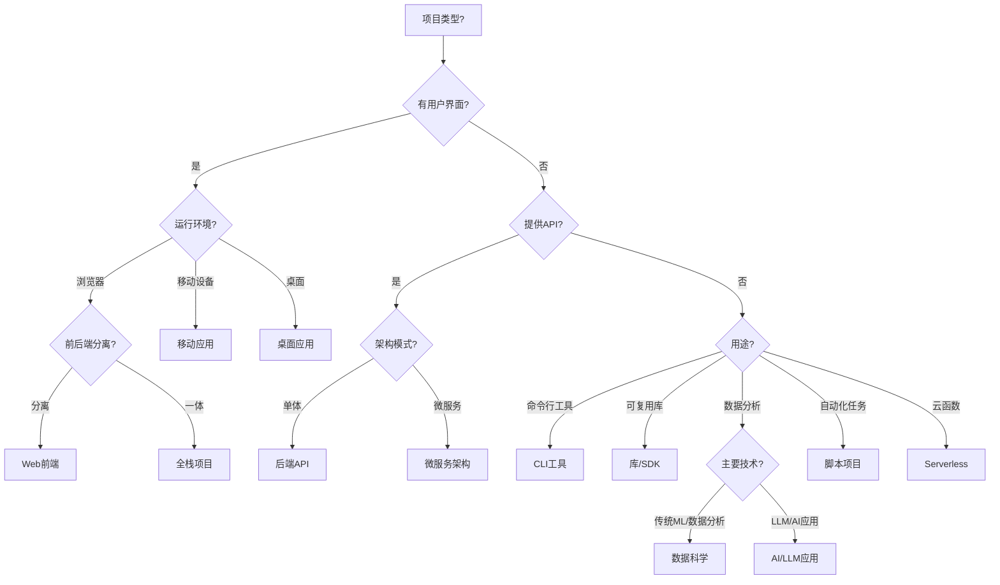
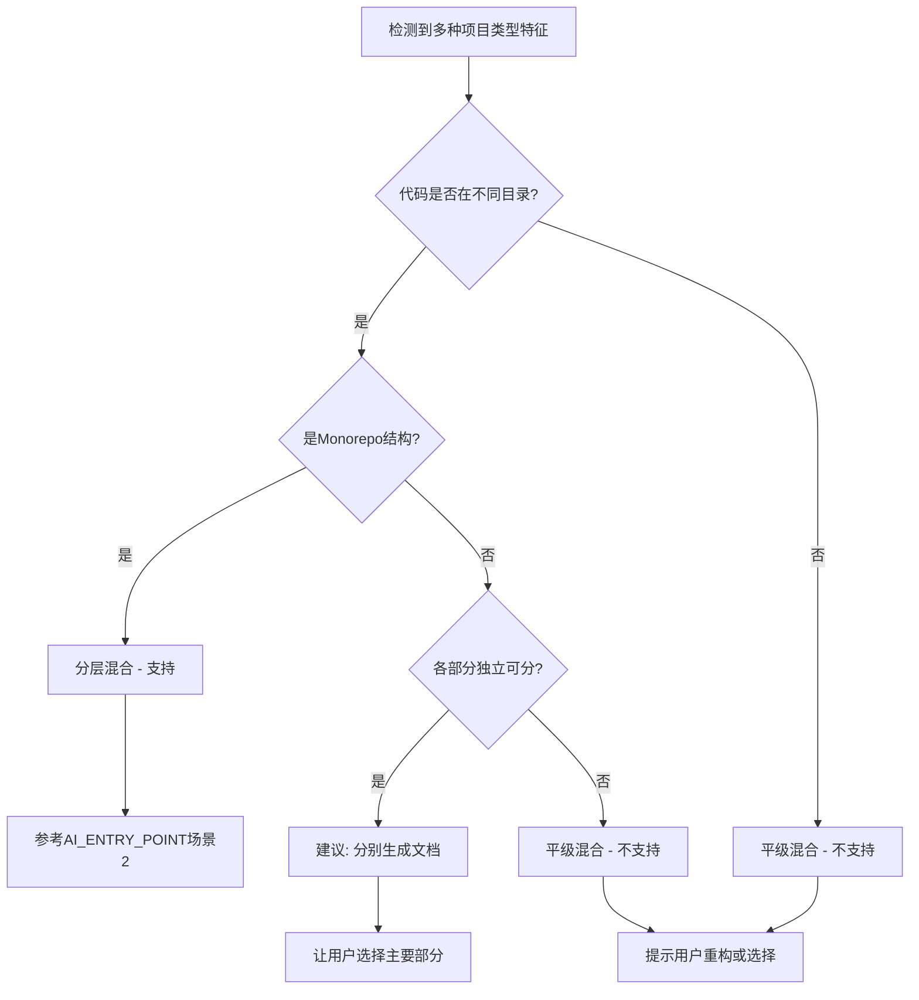

# 《项目类型适配指南》深度审查报告

> **审查日期**: 2026-01-21  
> **审查文档**: `core/project_types.md` (v2.2)  
> **审查目标**: 评估文档完善性、正确性，识别需要补充的内容

---

## 📊 总体评估

| 维度 | 评分 | 说明 |
|------|------|------|
| **结构完整性** | ⭐⭐⭐⭐⭐ | 覆盖 11 种项目类型，结构清晰 |
| **内容准确性** | ⭐⭐⭐⭐☆ | 大部分内容准确，有少量需更新 |
| **实用性** | ⭐⭐⭐⭐☆ | 提供了实用的文档清单和代码模式 |
| **完善程度** | ⭐⭐⭐⭐☆ | 基本完善，但有改进空间 |

**总体结论**: 这是一份高质量的指导文档，但仍有优化空间。

---

## ✅ 优点分析

### 1. 结构设计优秀

- **统一模板**: 每种项目类型都遵循相同的结构（适用框架 → 文档清单 → 关注点 → 代码模式）
- **优先级标注**: 使用 🔴🟡🟢 清晰标注文档优先级
- **决策树**: 提供了快速决策树帮助判断项目类型
- **混合项目处理**: v2.2 新增的混合项目规范很实用

### 2. 覆盖面广泛

- 11 种项目类型覆盖了绝大多数场景
- 25+ 主流框架支持
- 包含了新兴技术（Serverless、数据科学）

### 3. 实用性强

- 每种类型都有具体的文档清单
- 提供了代码模式示例
- 特殊关注点列举详细

---

## ⚠️ 发现的问题

### 问题 1: 缺少 YAML Frontmatter 摘要 ⭐⭐⭐

**严重程度**: 高

**问题描述**:
- 根据 V3.0 的"强制文档摘要机制"（功能 9），所有核心文档都应该有标准化的 YAML Frontmatter
- 当前文档只有简单的引用块，不符合 `reference/SUMMARY_FORMAT_SPEC.md` 规范

**建议修复**:
```yaml
---
title: 项目类型适配指南
summary: 指导如何为 11 种不同类型的项目（前端、后端、全栈、CLI、库/SDK、脚本、移动应用、桌面应用、Serverless、容器化、数据科学）生成合适的文档体系，包括推荐子文档清单、特殊关注点、AI 分析重点和代码模式示例。
keywords: project-types | documentation-guide | framework-support | document-templates
scope: 项目类型识别与文档生成策略
related_files: AI_ENTRY_POINT.md | templates/*.md | core/language_rules.md
dependencies: 无
verified_at: 2025-11-27
---
```

### 问题 2: 部分框架信息过时 ⭐⭐

**严重程度**: 中

**具体问题**:

1. **前端框架** (第 24 行)
   - 缺少 Qwik（虽然在全栈部分提到了）
   - 缺少 Astro（虽然在全栈部分提到了）
   - 建议: 明确区分"纯前端框架"和"全栈框架"

2. **后端框架** (第 68-76 行)
   - 缺少 Bun（新兴的 JavaScript 运行时）
   - 缺少 Deno（Node.js 的现代替代品）

3. **数据科学框架** (第 399-403 行)
   - 缺少 Hugging Face Transformers（NLP 领域重要框架）
   - 缺少 LangChain（LLM 应用开发框架）
   - 缺少 Streamlit/Gradio（快速构建 ML 应用界面）

### 问题 3: 代码示例不完整 ⭐⭐

**严重程度**: 中

**问题描述**:
- 只有前端和后端有代码模式示例
- 其他项目类型（CLI、库/SDK、数据科学等）缺少代码示例
- 不一致性会降低文档的实用性

**建议补充**:

**数据科学项目代码模式**:
```python
# 数据加载模式
import pandas as pd
df = pd.read_csv('data/input.csv')

# 特征工程模式
from sklearn.preprocessing import StandardScaler
scaler = StandardScaler()
X_scaled = scaler.fit_transform(X)

# 模型训练模式
from sklearn.ensemble import RandomForestClassifier
model = RandomForestClassifier(**params)
model.fit(X_train, y_train)

# 实验记录模式
import mlflow
with mlflow.start_run():
    mlflow.log_params(params)
    mlflow.log_metrics(metrics)
```

**脚本项目代码模式**:
```python
# 配置加载模式
import yaml
with open('config.yaml') as f:
    config = yaml.safe_load(f)

# 日志记录模式
import logging
logging.basicConfig(
    level=logging.INFO,
    format='%(asctime)s - %(levelname)s - %(message)s',
    handlers=[
        logging.FileHandler('logs/app.log'),
        logging.StreamHandler()
    ]
)

# 错误恢复模式
def retry_on_failure(func, max_retries=3):
    for i in range(max_retries):
        try:
            return func()
        except Exception as e:
            if i == max_retries - 1:
                raise
            logging.warning(f"Retry {i+1}/{max_retries}: {e}")
```

### 问题 4: 缺少微服务架构类型 ⭐⭐⭐

**严重程度**: 高

**问题描述**:
- 文档提到了 Monorepo，但没有专门的"微服务架构"项目类型
- 微服务是现代后端开发的主流架构，应该单独列出
- 微服务与单体后端 API 的文档需求差异很大

**建议新增**:

```markdown
## 🔗 微服务架构项目

### 适用场景
分布式系统 / 微服务架构 / 服务网格

### 推荐子文档清单

| 优先级 | 文档名称 | 用途 |
|-------|---------|------|
| 🔴 高 | `architecture_overview.md` | 服务拓扑图 |
| 🔴 高 | `service_communication.md` | 服务间通信（REST/gRPC/消息队列） |
| 🔴 高 | `service_discovery.md` | 服务发现与注册 |
| 🟡 中 | `api_gateway.md` | API 网关配置 |
| 🟡 中 | `distributed_tracing.md` | 分布式追踪 |
| 🟡 中 | `circuit_breaker.md` | 熔断与降级 |
| 🟢 低 | `service_mesh.md` | 服务网格（Istio/Linkerd） |

### 特殊关注点
- 服务边界划分原则
- API 版本管理策略
- 分布式事务处理（Saga/2PC）
- 配置中心（Consul/etcd/Nacos）
- 服务监控与告警
- 日志聚合（ELK/Loki）
- 服务依赖关系图
```

### 问题 5: 缺少 AI/LLM 应用项目类型 ⭐⭐⭐

**严重程度**: 高（考虑到当前 AI 发展趋势）

**问题描述**:
- 2024-2026 年 AI 应用爆发式增长
- LLM 应用开发有独特的文档需求（Prompt 管理、向量数据库、RAG 架构等）
- 这是一个快速增长的项目类型，应该纳入

**建议新增**:

```markdown
## 🤖 AI/LLM 应用项目

### 适用场景
LLM 应用 / RAG 系统 / AI Agent / Chatbot

**常用框架**:
- **LLM 框架**: LangChain / LlamaIndex / Semantic Kernel
- **向量数据库**: Pinecone / Weaviate / Qdrant / Chroma
- **模型服务**: OpenAI API / Anthropic / Ollama / vLLM
- **Agent 框架**: AutoGPT / BabyAGI / CrewAI

### 推荐子文档清单

| 优先级 | 文档名称 | 用途 |
|-------|---------|------|
| 🔴 高 | `prompt_management.md` | Prompt 模板与版本管理 |
| 🔴 高 | `rag_architecture.md` | RAG 架构说明 |
| 🔴 高 | `vector_database.md` | 向量数据库配置 |
| 🟡 中 | `model_configuration.md` | 模型选择与配置 |
| 🟡 中 | `evaluation_metrics.md` | 评估指标与测试 |
| 🟡 中 | `cost_optimization.md` | API 成本优化 |
| 🟢 低 | `fine_tuning.md` | 模型微调（如适用） |

### 特殊关注点
- Prompt 工程最佳实践
- 文档切分策略（Chunking）
- Embedding 模型选择
- 上下文窗口管理
- Token 使用优化
- 响应流式处理
- 幻觉检测与缓解
- 安全性（Prompt Injection 防护）
```

### 问题 6: 决策树不够完善 ⭐⭐

**严重程度**: 中

**问题描述**:
- 当前决策树（第 432-448 行）缺少全栈项目的判断路径
- 缺少微服务、AI 应用等新增类型
- 缺少"既有前端又有后端"的判断逻辑

**建议改进**:


### 问题 7: 缺少"不支持的项目类型"说明 ⭐

**严重程度**: 低

**问题描述**:
- 文档没有明确说明哪些项目类型不支持
- 例如：游戏开发、嵌入式系统、区块链项目等

**建议补充**:
```markdown
## ❌ 当前不支持的项目类型

以下项目类型暂不在框架支持范围内：

1. **游戏开发项目** (Unity/Unreal/Godot)
   - 原因: 资产管理和游戏逻辑的文档化需求特殊
   
2. **嵌入式系统** (Arduino/ESP32/STM32)
   - 原因: 硬件相关文档需求超出框架范围
   
3. **区块链/智能合约** (Solidity/Rust for Solana)
   - 原因: 需要专门的安全审计和经济模型文档

4. **硬件驱动开发**
   - 原因: 硬件接口文档需求特殊

如您的项目属于以上类型，建议：
- 选择最接近的项目类型作为基础
- 手动添加特定领域的文档
```

### 问题 8: 缺少版本兼容性说明 ⭐

**严重程度**: 低

**问题描述**:
- 只有"库/SDK"部分提到了版本兼容性表格
- 其他项目类型也应该考虑版本兼容性（如 Node.js 版本、Python 版本等）

### 问题 9: 混合项目处理规范的 Mermaid 图有语法问题 ⭐⭐

**严重程度**: 中

**问题描述**:
- 第 500-515 行的 Mermaid 图中，节点 ID 重复使用可能导致渲染问题
- 例如节点 D 被定义了两次

**建议修复**:


---

## 💡 改进建议

### 建议 1: 增加"项目规模"维度

**理由**: 不同规模的项目，文档需求不同

**建议添加**:
```markdown
## 📏 项目规模考量

### 小型项目 (< 10k LOC)
- 简化文档结构
- 只保留 🔴 高优先级文档
- 可以合并相关文档

### 中型项目 (10k - 100k LOC)
- 完整文档结构
- 包含 🔴 高 + 🟡 中 优先级文档

### 大型项目 (> 100k LOC)
- 完整文档 + 知识库
- 所有优先级文档
- 增加架构决策记录 (ADR)
```

### 建议 2: 增加"技术栈组合"示例

**理由**: 实际项目往往是多种技术的组合

**建议添加**:
```markdown
## 🔧 常见技术栈组合

### MERN Stack
- 项目类型: 全栈
- 技术: MongoDB + Express + React + Node.js
- 重点文档: api_layer.md, database_schema.md, state_management.md

### Django + Vue
- 项目类型: 后端 API + Web 前端（分离）
- 建议: 分别生成文档

### Next.js + Prisma + PostgreSQL
- 项目类型: 全栈
- 重点文档: data_fetching.md, database_schema.md, api_design.md
```

### 建议 3: 增加"文档生成时间估算"

**理由**: 帮助用户预期生成文档所需时间

**建议添加**:
```markdown
## ⏱️ 文档生成时间估算

| 项目类型 | 小型 | 中型 | 大型 |
|---------|------|------|------|
| Web前端 | 15-30分钟 | 30-60分钟 | 1-2小时 |
| 后端API | 20-40分钟 | 40-80分钟 | 1.5-3小时 |
| 全栈 | 30-60分钟 | 1-2小时 | 2-4小时 |
| 数据科学 | 15-30分钟 | 30-60分钟 | 1-2小时 |

*注: 时间包括代码分析、方案生成、审核和文档生成*
```

### 建议 4: 增加"常见错误"章节

**理由**: 帮助 AI 和用户避免常见错误

**建议添加**:
```markdown
## ⚠️ 常见错误与避免

### 错误 1: 项目类型判断错误
- **错误**: 将 Next.js 项目判断为"Web前端"
- **正确**: Next.js 是全栈框架
- **避免**: 检查是否有 API Routes 或 Server Components

### 错误 2: 过度生成文档
- **错误**: 为小型脚本项目生成 10+ 文档
- **正确**: 根据项目规模调整文档数量
- **避免**: 参考"项目规模考量"章节

### 错误 3: 忽略特殊架构
- **错误**: 将 Monorepo 当作单一项目
- **正确**: 识别 Monorepo 结构，采用分层策略
- **避免**: 检查 workspace 配置文件
```

---

## 📋 优先级修复清单

### P0 (必须修复)
- [ ] 添加 YAML Frontmatter 摘要（符合 V3.0 规范）
- [ ] 新增"微服务架构"项目类型
- [ ] 新增"AI/LLM 应用"项目类型
- [ ] 修复 Mermaid 图语法问题

### P1 (推荐修复)
- [ ] 补充所有项目类型的代码模式示例
- [ ] 更新决策树，包含新增类型
- [ ] 更新框架列表（Bun, Deno, Hugging Face 等）
- [ ] 增加"项目规模"维度

### P2 (可选优化)
- [ ] 增加"不支持的项目类型"说明
- [ ] 增加"技术栈组合"示例
- [ ] 增加"文档生成时间估算"
- [ ] 增加"常见错误"章节
- [ ] 增加版本兼容性说明

---

## 🎯 总结

这份文档整体质量很高，结构清晰，覆盖面广。主要改进方向：

1. **符合 V3.0 规范**: 添加标准化的 YAML Frontmatter
2. **与时俱进**: 增加微服务、AI/LLM 等现代项目类型
3. **提升一致性**: 为所有项目类型补充代码示例
4. **增强实用性**: 增加项目规模、技术栈组合等实用信息

**建议优先处理 P0 级别的问题，然后根据实际需求处理 P1 和 P2。**
