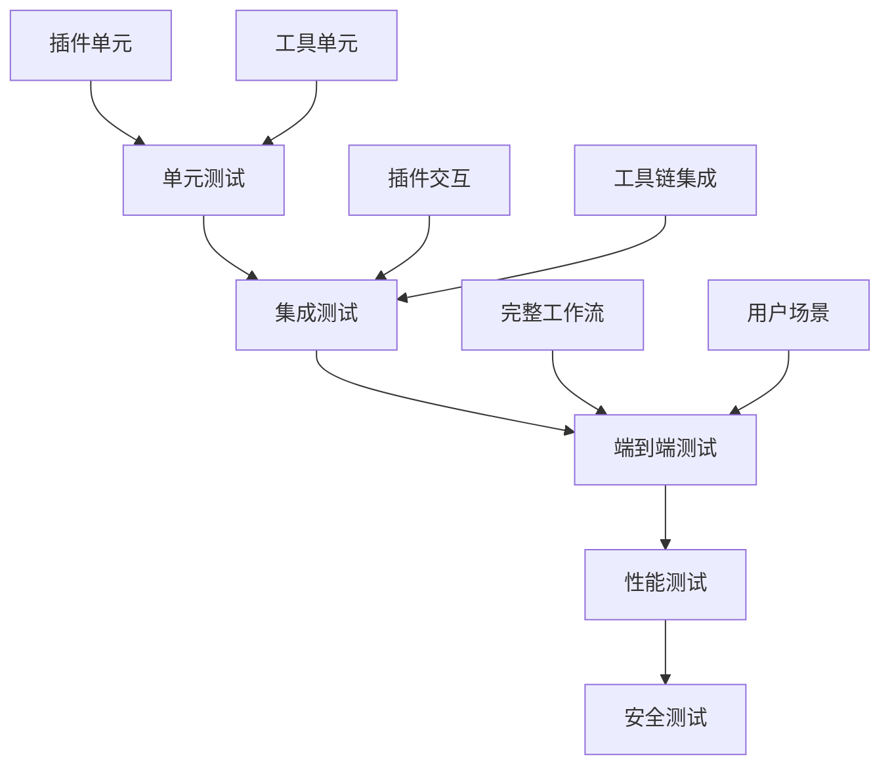

# 设计思维引导 - Step 2: How (如何实现)

**项目名称**: Claude Code 插件工具集  
**引导时间**: 2025-12-19  
**参与角色**: 产品经理, 架构分析师, 测试工程师

---

## 架构分析师观点

### 核心架构设计

基于项目结构分析，我提出以下技术架构：

#### 1. 文档体系架构

```
dev_docs/
├── AI_Coding_Context.md          # 主索引文档
├── plans/                        # 功能规划
│   ├── feature_*.md              # 功能开发计划
│   └── bug_*.md                  # Bug修复计划
├── knowledge/                    # 知识库
│   ├── best_practices.md         # 最佳实践
│   └── troubleshooting.md        # 故障排除
├── rules/                        # 开发规范
│   ├── coding_standards.md       # 编码规范
│   └── review_checklist.md       # 审查清单
├── api/                          # API文档
├── guides/                       # 使用指南
└── testing/                      # 测试文档
```

#### 2. 插件系统架构

**核心原则**: 每个插件都是独立的模块，有统一的结构：

```
plugin-name/
├── .claude-plugin/               # 插件配置
│   └── plugin.json              # 插件清单
├── agents/                       # 智能体
├── commands/                     # 命令
├── skills/                       # 技能
├── hooks/                        # 钩子
└── README.md                     # 文档
```

#### 3. 工具链集成方案

**统一工具入口**:
- 使用 `claude-code` 命令作为统一入口
- 通过插件机制扩展功能
- 支持插件间的依赖和协作

**文档生成自动化**:
- 基于代码分析自动生成API文档
- 基于注释生成使用指南
- 基于测试生成验证文档

### 技术实现路径

#### Phase 1: 核心框架 (Week 1-2)
1. 完善AI编码文档框架基础
2. 建立统一的插件开发模板
3. 创建核心开发工具

#### Phase 2: 文档体系 (Week 3-4)
1. 建立文档生成自动化流程
2. 创建各插件的标准化文档
3. 建立文档质量保证机制

#### Phase 3: 工具完善 (Week 5-6)
1. 完善开发工具链
2. 建立测试和质量保证体系
3. 优化用户体验

#### Phase 4: 生态建设 (Week 7-8)
1. 建立插件市场机制
2. 完善贡献指南
3. 建立社区运营机制

---

## 产品经理观点

### 用户体验设计

#### 1. 开发者体验 (DevEx) 优化

**一键式开发体验**:
```bash
# 新开发者可以快速上手
claude-code init --plugin my-awesome-plugin
claude-code dev --hot-reload
claude-code test --coverage
claude-code publish --auto-docs
```

**渐进式学习路径**:
1. **新手**: 使用模板和向导快速创建第一个插件
2. **进阶**: 深入了解各个组件的使用方法
3. **专家**: 自定义工具链和贡献框架

#### 2. 文档体系设计

**分层文档结构**:
- **概览层**: 5分钟了解整个框架
- **入门层**: 30分钟创建第一个插件  
- **深入层**: 完整的技术文档和API参考
- **专家层**: 高级技巧和贡献指南

**交互式文档**:
- 代码示例可以直接运行
- API文档与实际代码同步
- 问题诊断工具集成

---

## 测试工程师观点

### 质量保证体系

#### 1. 自动化测试策略

**多层测试架构**:


**测试自动化**:
- 每个PR自动运行完整测试套件
- 文档变更自动验证代码示例
- 性能基准自动对比

#### 2. 质量标准定义

**代码质量**:
- TypeScript严格模式
- ESLint + Prettier + Husky
- 测试覆盖率 ≥90%

**文档质量**:
- 所有API必须有示例
- 所有示例必须可执行
- 文档更新与代码同步

**用户体验**:
- 新手能在1小时内创建并运行第一个插件
- 开发者文档搜索时间 <30秒
- 错误诊断准确率 >95%

### 风险识别

#### 高风险项

1. **多语言兼容性**
   - Python和Node.js版本兼容问题
   - 依赖管理复杂性

2. **插件安全**
   - 插件代码执行安全
   - 权限控制机制

3. **文档同步**
   - 代码变更与文档同步
   - 自动化程度与准确性的平衡

#### 缓解策略

1. **兼容性测试矩阵**
2. **安全沙箱机制**
3. **文档自动生成 + 人工审核**
