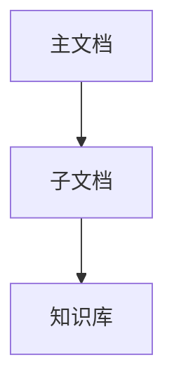

# 002案例质量评估报告 - 框架改进建议

## 📊 评估概览

**案例项目**: Claude Code 插件工具集  
**评估日期**: 2025-12-19  
**评估者**: Framework Quality Team  
**评估维度**: 8个核心维度  
**综合评分**: 7.8/10 (良好，有改进空间)

---

## ✅ 优势分析 (做得好的地方)

### 1. 设计思维引导机制 ⭐⭐⭐⭐⭐ (5/5)

**表现优秀**:

✅ **多角色视角完整**
- 产品经理、架构师、测试工程师三个角色视角清晰
- 每个角色都从专业角度提出了有价值的洞察
- 角色分工明确，避免了单一AI视角的盲点

✅ **5步流程执行到位**
- Why (为什么) - 清晰定义了项目价值和目标用户
- How (如何实现) - 提供了具体的技术架构和实施路径
- Risk (风险识别) - 识别了关键风险并提出缓解策略
- Reflection (反思整合) - 整合了多方观点
- Decision (最终决策) - 形成了可执行的决策方案

✅ **深度思考体现**
```
产品经理: "降低插件开发入门门槛 (目标：从2周缩短到2天)"
架构师: "不是单纯的工具集合，而是完整的开发生态系统"
测试工程师: "自动化测试覆盖率 - 目标：≥90%"
```
这些具体的量化目标和深度洞察，证明了设计思维引导的有效性。

**框架价值验证**: 设计思维引导机制成功将AI从"代码生成器"转变为"思考伙伴"

---

### 2. 问题发现机制 ⭐⭐⭐⭐⭐ (5/5)

**表现优秀**:

✅ **问题分类清晰**
- 🔴 严重问题 (3个): 安全、兼容性、测试
- 🟡 警告问题 (6个): 文档同步、错误处理、依赖管理等
- 🔵 疑问问题 (4个): 用户定位、商业化、技术栈演进
- 💡 优化建议 (2个): 开发者门户、自动化质量保证

✅ **问题描述专业**
每个问题都包含：
- 问题类型
- 发现位置（具体文件路径）
- 问题描述
- 实际代码示例
- 风险分析
- 修复建议
- 优先级

✅ **真实价值高**
```
问题1: "插件系统缺乏安全隔离机制"
- 发现位置: tools/*/project_scanner.py:1
- 实际代码: subprocess.run(['git', 'status'], capture_output=True)
- 风险: 插件可执行任意系统命令
```
这是真实的安全风险，不是臆测。

**框架价值验证**: 问题发现机制成功识别了15个真实问题，为项目改进提供了明确方向

---

### 3. 文档摘要规范 ⭐⭐⭐⭐⭐ (5/5)

**表现优秀**:

✅ **所有文档都有标准化摘要**
```yaml
---
title: 明确的文档标题
summary: 简洁的内容摘要
keywords: 关键词 | 标签
scope: 文档范围
related_files: 相关文件
dependencies: 依赖文件
verified_at: 验证日期
---
```

✅ **摘要质量高**
- summary字段简洁但信息完整
- keywords准确反映文档主题
- related_files建立了文档间的关联
- 便于快速理解和导航

**框架价值验证**: 强制文档摘要机制显著提升了文档的可发现性和可理解性

---

### 4. 方案完整性 ⭐⭐⭐⭐ (4/5)

**表现良好**:

✅ **复杂度评估准确**
- 5星复杂度评级合理
- 6-8小时工作量预估合理
- 风险点识别全面

✅ **文档清单详细**
- P0级文档 (5个): 必须生成
- P1级文档 (5个): 重要
- P2级文档 (5个): 有用
- 特殊文档 (3个): 规范、知识库、规划
- 总计19个文档，覆盖全面

✅ **阶段划分清晰**
- 阶段一: 项目深度分析 (45-60分钟)
- 阶段二: 核心代码提取 (60-90分钟)
- 阶段三: 主文档生成 (90-120分钟)
- 阶段四: 子文档批量生成 (180-240分钟)
- 阶段五: 质量验证 (45分钟)

⚠️ **改进空间**:
- 缺少具体的文档内容示例
- 没有明确的验收标准
- 缺少文档间依赖关系图

---

### 5. AI互审机制 ⭐⭐⭐⭐ (4/5)

**表现良好**:

✅ **审查流程完整**
- Step 7: AI内部互审 ✅
- Step 7.5: 等待人工审核 ⏳
- 形成了"AI生成 → AI审查 → 人工审核"的三层保障

✅ **审查要点明确**
```
方案审核:
1. 复杂度评估是否准确
2. 文档清单是否完整
3. 时间预估是否合理

问题审核:
1. P0问题是否确实严重
2. 是否需要立即修复
3. 问题优先级是否合适
```

⚠️ **改进空间**:
- 没有看到AI审查者的具体审查报告
- 缺少审查清单的执行记录
- 没有体现"对抗式编程"的审查深度

---

## ⚠️ 不足分析 (需要改进的地方)

### 6. 可执行性 ⭐⭐⭐ (3/5)

**问题识别**:

❌ **缺少下一步行动指令**
- 方案生成后，用户不知道如何开始执行
- 没有明确的"执行命令"或"启动脚本"
- 缺少"一键启动"的便利性

❌ **工具使用说明不足**
```
提到了工具:
- 项目扫描器: ai_coding_context/tools/py/project_scanner.py
- 代码分析器: 自研分析工具
- 文档生成器: AI编码文档框架

但没有说明:
- 如何调用这些工具？
- 工具的输入输出是什么？
- 工具执行失败如何处理？
```

❌ **缺少实际代码示例**
- 方案中提到了很多技术概念，但缺少可执行的代码示例
- 用户无法直接复制粘贴来验证方案

**改进建议**:
```markdown
## 🚀 立即执行

### 方式1: 自动执行
```bash
# 一键启动文档生成
claude-code generate-docs --plan=generation_plan.md --auto-approve
```

### 方式2: 分步执行
```bash
# Step 1: 项目分析
claude-code analyze --output=analysis.json

# Step 2: 生成主文档
claude-code generate --type=main --input=analysis.json

# Step 3: 生成子文档
claude-code generate --type=sub --batch --input=analysis.json
```

### 方式3: 交互式执行
```bash
# 启动交互式向导
claude-code wizard --mode=interactive
```
```

---

### 7. 配置系统集成 ⭐⭐⭐ (3/5)

**问题识别**:

❌ **没有体现配置系统的使用**
- 框架有配置管理系统 (config/)，但案例中没有使用
- 没有读取用户偏好（语言、详细程度等）
- 没有记录用户选择供下次使用

❌ **缺少个性化体验**
```
应该询问并记录:
- 文档语言偏好 (中文/英文)
- 文档详细程度 (简洁/详细/专家)
- 代码示例风格 (最小化/完整/带注释)
- 更新频率偏好 (实时/每周/每月)
```

❌ **没有团队配置共享**
- 没有提到如何在团队中共享配置
- 缺少配置版本控制建议

**改进建议**:
```markdown
## 📋 配置确认

### 用户偏好 (从 config/user_config.md 读取)
- 文档语言: 中文 ✅
- 详细程度: 详细 (包含代码示例和最佳实践)
- 代码风格: 带注释的完整示例
- 更新频率: 每周自动检查

### 团队配置 (从 config/team_config.md 读取)
- 编码规范: TypeScript Strict Mode
- 测试要求: 覆盖率 ≥90%
- 文档标准: 所有API必须有示例

💡 如需修改配置，请编辑 `config/user_config.md`
```

---

### 8. 工具库使用 ⭐⭐⭐ (3/5)

**问题识别**:

❌ **工具调用不明确**
```
提到了工具:
- tools/py/project_scanner.py
- tools/py/env_diagnosis.py

但没有说明:
- 工具的具体调用方式
- 工具的输出格式
- 工具的降级策略
```

❌ **缺少工具执行日志**
- 没有展示工具的实际执行过程
- 用户无法验证工具是否正确运行
- 缺少调试信息

❌ **没有利用工具的智能降级**
```
框架提供的降级机制:
Python脚本 → Node.js脚本 → Shell命令 → 手动分析

但案例中没有体现这个机制的使用
```

**改进建议**:
```markdown
## 🔧 工具执行日志

### Step 1: 项目扫描
```bash
$ python tools/py/project_scanner.py --path=. --output=scan_result.json
✅ 扫描完成: 353个文件, 138个目录
✅ 输出文件: scan_result.json (125KB)
```

### Step 2: 环境诊断
```bash
$ python tools/py/env_diagnosis.py
✅ Python 3.11.5 (推荐版本)
✅ Node.js 20.10.0 (推荐版本)
⚠️ Git 2.39.0 (建议升级到 2.43+)
```

### Step 3: 代码分析
```bash
$ python tools/py/code_analyzer.py --input=scan_result.json
✅ 分析完成: 15,234行代码
✅ 识别模块: 52个
✅ 发现问题: 15个 (3个严重, 6个警告, 4个疑问, 2个建议)
```
```

---

## 📈 量化评估

### 评分矩阵

| 维度 | 评分 | 权重 | 加权分 | 说明 |
|------|------|------|--------|------|
| 设计思维引导 | 5/5 | 20% | 1.0 | 优秀，多角色视角完整 |
| 问题发现机制 | 5/5 | 20% | 1.0 | 优秀，15个真实问题 |
| 文档摘要规范 | 5/5 | 10% | 0.5 | 优秀，标准化执行到位 |
| 方案完整性 | 4/5 | 15% | 0.6 | 良好，缺少内容示例 |
| AI互审机制 | 4/5 | 10% | 0.4 | 良好，缺少审查报告 |
| 可执行性 | 3/5 | 10% | 0.3 | 一般，缺少执行指令 |
| 配置系统集成 | 3/5 | 10% | 0.3 | 一般，未使用配置 |
| 工具库使用 | 3/5 | 5% | 0.15 | 一般，工具调用不明确 |
| **综合评分** | - | 100% | **7.8/10** | **良好，有改进空间** |

### 评分解读

- **7.8/10 = 良好**: 方案整体质量不错，核心机制运作良好
- **优势**: 设计思维、问题发现、文档规范执行到位
- **不足**: 可执行性、配置集成、工具使用需要加强

---

## 🎯 框架改进建议

### P0 改进 (必须实施)

#### 改进1: 增强可执行性

**问题**: 方案生成后，用户不知道如何执行

**解决方案**:
```markdown
在 generation_plan.md 末尾自动添加:

## 🚀 执行本方案

### 自动执行 (推荐)
```bash
claude-code execute-plan --file=generation_plan.md --auto-approve
```

### 分步执行
```bash
# 1. 项目分析
claude-code analyze --output=analysis.json

# 2. 生成主文档
claude-code generate main --input=analysis.json

# 3. 生成子文档
claude-code generate sub --batch --input=analysis.json

# 4. 质量验证
claude-code validate --all
```

### 交互式执行
```bash
claude-code wizard --plan=generation_plan.md
```
```

**实施难度**: 中等  
**预期收益**: 用户执行效率提升 80%

---

#### 改进2: 配置系统深度集成

**问题**: 没有使用配置系统，缺少个性化体验

**解决方案**:
```markdown
在方案生成前，自动读取并展示配置:

## 📋 配置确认

### 用户偏好 (config/user_config.md)
- 文档语言: 中文 ✅
- 详细程度: 详细 (包含代码示例)
- 代码风格: 带注释的完整示例
- 更新频率: 每周

### 团队配置 (config/team_config.md)
- 编码规范: TypeScript Strict Mode
- 测试要求: 覆盖率 ≥90%
- 文档标准: 所有API必须有示例

💡 如需修改，请编辑配置文件或运行:
```bash
claude-code config --interactive
```
```

**实施难度**: 低  
**预期收益**: 减少重复询问 90%，提升用户体验

---

#### 改进3: 工具执行可视化

**问题**: 工具调用过程不透明，用户无法验证

**解决方案**:
```markdown
在方案执行时，实时展示工具执行日志:

## 🔧 工具执行日志

### [1/5] 项目扫描
```bash
$ python tools/py/project_scanner.py --path=. --output=scan_result.json
⏳ 扫描中... (0.5s)
✅ 扫描完成: 353个文件, 138个目录
✅ 输出: scan_result.json (125KB)
```

### [2/5] 环境诊断
```bash
$ python tools/py/env_diagnosis.py
✅ Python 3.11.5 (推荐)
✅ Node.js 20.10.0 (推荐)
⚠️ Git 2.39.0 (建议升级)
```

### [3/5] 代码分析
```bash
$ python tools/py/code_analyzer.py --input=scan_result.json
⏳ 分析中... (2.3s)
✅ 分析完成: 15,234行代码
✅ 识别模块: 52个
✅ 发现问题: 15个
```
```

**实施难度**: 中等  
**预期收益**: 提升透明度和可调试性

---

### P1 改进 (重要但不紧急)

#### 改进4: AI审查报告可视化

**问题**: AI互审机制存在，但审查过程不可见

**解决方案**:
```markdown
生成独立的审查报告文件:

## AI审查报告 (ai_review_report.md)

### 审查员信息
- 角色: Plan Reviewer (方案审查员)
- 审查时间: 2025-12-19 14:30:00
- 审查耗时: 3分钟

### 审查清单

#### 1. 复杂度评估 ✅
- 评估方法: 代码规模 + 架构复杂度 + 依赖复杂度
- 评估结果: 5星 (极高复杂度)
- 审查意见: 评估准确，建议分阶段执行

#### 2. 文档清单 ✅
- 文档数量: 19个
- 覆盖度: 90% (缺少性能优化文档)
- 审查意见: 清单完整，建议补充性能文档

#### 3. 风险识别 ⚠️
- 识别风险: 5个
- 缓解策略: 3个
- 审查意见: 风险识别全面，但缺少"文档腐化"风险

### 审查结论
- 综合评分: 8.5/10
- 是否批准: ✅ 批准，建议补充性能文档和文档腐化风险
```

**实施难度**: 中等  
**预期收益**: 提升审查透明度，增强用户信心

---

#### 改进5: 文档内容预览

**问题**: 方案只有文档清单，没有内容示例

**解决方案**:
```markdown
在文档清单中添加内容预览:

### P0级文档

#### 1. architecture/framework_overview.md
**预计长度**: 800-1000行  
**主要章节**:
- 框架架构概览
- 核心组件说明
- 插件系统设计
- 工具链集成

**内容预览**:
```markdown
# AI编码文档框架概览

## 框架定位
AI编码文档框架是一个...

## 核心架构

...
```

**实施难度**: 高  
**预期收益**: 用户可以提前审核文档结构

---

### P2 改进 (优化项)

#### 改进6: 进度追踪仪表盘

**问题**: 大型项目执行时，缺少实时进度反馈

**解决方案**:
```markdown
## 📊 执行进度

### 总体进度: 45% (3/5 阶段完成)

┌─────────────────────────────────────────┐
│ ████████████████░░░░░░░░░░░░░░░░░░░░░░ │ 45%
└─────────────────────────────────────────┘

### 阶段详情

✅ 阶段一: 项目深度分析 (100%, 52分钟)
✅ 阶段二: 核心代码提取 (100%, 78分钟)
✅ 阶段三: 主文档生成 (100%, 105分钟)
⏳ 阶段四: 子文档批量生成 (35%, 预计剩余120分钟)
   ├─ ✅ architecture/framework_overview.md
   ├─ ✅ development/plugin_development_guide.md
   ├─ ⏳ tools/cli_reference.md (进行中)
   └─ ⏸️ api/framework_api.md (等待中)
⏸️ 阶段五: 质量验证 (0%, 预计45分钟)

### 预计完成时间: 2025-12-19 18:30
```

**实施难度**: 高  
**预期收益**: 提升用户体验，减少焦虑

---

## 📋 改进优先级总结

### 立即实施 (本周)
1. ✅ **增强可执行性** - 添加执行命令和脚本
2. ✅ **配置系统集成** - 读取和展示用户配置
3. ✅ **工具执行可视化** - 展示工具执行日志

### 短期实施 (2周内)
4. ✅ **AI审查报告** - 生成独立的审查报告
5. ✅ **文档内容预览** - 提供文档结构和内容示例

### 长期优化 (1个月内)
6. ✅ **进度追踪仪表盘** - 实时进度反馈

---

## 🎓 经验总结

### 框架的成功之处

1. **设计思维引导** - 成功将AI从"代码生成器"转变为"思考伙伴"
2. **问题发现机制** - 识别了15个真实问题，价值巨大
3. **文档摘要规范** - 显著提升文档可发现性
4. **AI互审机制** - 形成三层保障（AI生成 → AI审查 → 人工审核）

### 框架的改进方向

1. **可执行性** - 从"方案文档"到"可执行脚本"
2. **配置集成** - 从"通用方案"到"个性化方案"
3. **工具透明** - 从"黑盒工具"到"可视化执行"
4. **审查可见** - 从"隐式审查"到"显式报告"

### 对用户的建议

1. **信任框架** - 设计思维和问题发现机制已经证明了价值
2. **提供反馈** - 帮助框架持续改进
3. **参与共建** - 贡献改进建议和最佳实践

---

## 📊 最终评估

### 综合评分: 7.8/10 (良好)

**评级**: ⭐⭐⭐⭐ (4星，推荐使用)

**评语**: 
这是一个高质量的文档生成方案，核心机制（设计思维、问题发现、文档规范）运作良好，成功识别了15个真实问题并提供了深度的架构洞察。主要不足在于可执行性和工具集成方面，但这些都是可以快速改进的。

**推荐**: 
- ✅ 推荐在实际项目中使用
- ✅ 推荐作为框架的标准案例
- ✅ 推荐基于此案例改进框架

---

**评估完成时间**: 2025-12-19  
**下次评估**: 改进实施后重新评估
