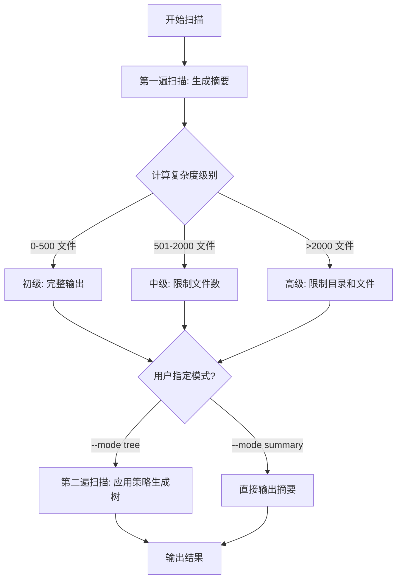

# 项目扫描工具自适应输出优化方案

## 📋 问题描述

### 核心问题

当前 `project_scanner` 工具在扫描大型项目时,会生成完整的目录树结构,导致输出内容过长:

- **小型项目** (<500 文件): 输出合理,约 2,000-5,000 tokens
- **中型项目** (500-2,000 文件): 输出冗长,约 10,000-30,000 tokens
- **大型项目** (>2,000 文件): 输出爆炸,可能超过 50,000 tokens

### 影响范围

当 AI 代理使用扫描结果作为上下文时:

1. ❌ **Token 限制**: 可能超出 AI 的 context window 限制
2. ❌ **成本浪费**: 大量 tokens 消耗在无关的文件列表上
3. ❌ **效率低下**: AI 难以从海量信息中提取关键结构
4. ❌ **用户体验差**: 输出过长,难以阅读和理解

### 典型场景

```bash
# 场景 1: 扫描一个 Next.js 全栈项目 (3,000+ 文件)
python tools/py/project_scanner.py --exclude-standard

# 输出: 35,000+ tokens 的完整树结构
# 问题: AI 上下文被大量 node_modules 和 build 产物占据
```

---

## 📁 涉及文件

### 核心文件

- [`tools/py/project_scanner.py`](file:///d:/zibuyu_code/ai_coding_context/tools/py/project_scanner.py) - Python 实现 (主要修改)
- [`tools/js/project_scanner.js`](file:///d:/zibuyu_code/ai_coding_context/tools/js/project_scanner.js) - Node.js 实现 (同步修改)

### 文档文件

- [`tools/README.md`](file:///d:/zibuyu_code/ai_coding_context/tools/README.md) - 工具使用文档 (需更新)
- [`tools/CHANGELOG.md`](file:///d:/zibuyu_code/ai_coding_context/tools/CHANGELOG.md) - 变更日志 (需记录)

### 相关上下文

- [`AI_ENTRY_POINT.md`](file:///d:/zibuyu_code/ai_coding_context/AI_ENTRY_POINT.md) - 框架入口文档
- 现有的 `--exclude-standard` 功能 (v1.2.0 新增)

---

## 📊 现状总结

### 当前实现

`project_scanner` 提供以下功能:

1. ✅ 完整目录树扫描 (BFS 算法)
2. ✅ `.gitignore` 自动读取
3. ✅ 标准排除模式 (`--exclude-standard`)
4. ✅ 深度限制 (`--depth`)
5. ✅ 每目录文件数限制 (`--max-files`)
6. ✅ 双输出格式 (JSON / Tree)

### 现有参数

```bash
--path PATH              # 扫描路径
--ignore PATTERNS        # 手动排除模式
--exclude-standard       # 标准排除
--follow-symlinks        # 跟随符号链接
--max-files NUM          # 每目录最大文件数 (默认 1000)
--depth NUM              # 最大深度
--format FORMAT          # 输出格式 (json/tree)
```

### 局限性

- ❌ **无智能分级**: 所有项目使用相同的输出策略
- ❌ **无摘要模式**: 只能输出完整树或手动限制深度
- ❌ **无自适应**: 不会根据项目规模自动调整输出详细程度

---

## 🧠 分析思路

### 设计原则

1. **向后兼容**: 保留现有文件树模式,默认行为不变
2. **智能自适应**: 根据项目规模自动选择最优输出策略
3. **用户可控**: 提供参数让用户手动指定模式
4. **渐进增强**: 先实现核心功能,后续可扩展

### 分级标准制定

#### 方案 A: 基于文件总数 (推荐)

```python
LEVEL_THRESHOLDS = {
    "basic": (0, 500),        # 0-500 文件
    "medium": (501, 2000),    # 501-2000 文件
    "advanced": (2001, float('inf'))  # >2000 文件
}
```

**优势**:

- ✅ 简单直观
- ✅ 与 Token 消耗直接相关
- ✅ 易于调试和验证

#### 方案 B: 基于多维度评分

```python
# 综合考虑: 文件数 + 目录数 + 深度
score = files * 1.0 + dirs * 0.5 + depth * 0.2
```

**优势**:

- ✅ 更精确
- ❌ 复杂度高,不易理解

**结论**: 采用方案 A (基于文件总数)

### 输出策略设计

#### 初级 (Basic): 0-500 文件

**策略**: 完整输出,不做任何省略

```json
{
  "data": {
    "structure": {
      /* 完整树 */
    },
    "stats": { "files": 345, "dirs": 67 }
  },
  "metadata": {
    "complexity_level": "basic",
    "output_strategy": "full_tree"
  }
}
```

#### 中级 (Medium): 501-2,000 文件

**策略**: 保留完整目录结构,限制每目录文件显示数量,并智能排序

- 每个目录最多显示 **N 个文件** (由 `--limit-files` 控制,默认 10)
- **智能排序** ⭐: 重要文件优先显示 (README.md, package.json, index.js 等)
- 超出部分显示省略提示,包含查看建议
- 目录结构完整保留
- 空目录不显示,但在 metadata 中统计

```json
{
  "data": {
    "structure": {
      "src/": {
        "components/": {
          "index.ts": null, // 重要文件优先
          "App.tsx": null, // 重要文件优先
          "Button.tsx": null,
          "Input.tsx": null,
          "Card.tsx": null,
          "Modal.tsx": null,
          "Table.tsx": null,
          "Form.tsx": null,
          "Select.tsx": null,
          "Checkbox.tsx": null,
          "... (省略 45 个文件, 使用 --path ./src/components --no-adaptive 查看完整列表)": null
        }
      }
    }
  },
  "metadata": {
    "complexity_level": "medium",
    "output_strategy": "limited_files_with_smart_sort",
    "limit_files": 10,
    "total_files_omitted": 1234,
    "empty_dirs_count": 5,
    "empty_dirs": ["src/legacy/", "tests/fixtures/empty/", "docs/drafts/"]
  }
}
```

#### 高级 (Advanced): >2,000 文件

**策略**: 目录和文件都做省略,但有智能子判断和智能排序

- 每个目录最多显示 **N 个子目录** (由 `--limit-dirs` 控制,默认 10)
- 每个目录最多显示 **N 个文件** (由 `--limit-files` 控制,默认 10)
- **智能排序** ⭐: 重要文件和目录优先显示
- **智能子判断** ⭐: 如果某目录的子目录数量 ≤ `--advanced-dir-threshold` (默认 20)
  - 保留所有子目录名称
  - 但省略子目录内的文件,仅显示文件数量统计
- 超出部分显示省略提示,包含查看建议
- 空目录不显示,但在 metadata 中统计

**示例 1: 子目录数量超过阈值 (正常省略)**

```json
{
  "data": {
    "structure": {
      "src/": {
        "components/": {
          /* ... */
        },
        "utils/": {
          /* ... */
        },
        "hooks/": {
          /* ... */
        },
        "services/": {
          /* ... */
        },
        "types/": {
          /* ... */
        },
        "contexts/": {
          /* ... */
        },
        "api/": {
          /* ... */
        },
        "store/": {
          /* ... */
        },
        "routes/": {
          /* ... */
        },
        "models/": {
          /* ... */
        },
        "... (省略 25 个子目录, 使用 --path ./src --limit-dirs 50 查看更多)": null
      }
    }
  }
}
```

**示例 2: 子目录数量未超过阈值 (智能保留)**

```json
{
  "data": {
    "structure": {
      "config/": {
        "env/": "(12 files)",
        "webpack/": "(8 files)",
        "babel/": "(3 files)",
        "eslint/": "(2 files)",
        "typescript/": "(5 files)"
        // 子目录数 = 5 < 20,保留所有目录名,但省略文件详情
      }
    }
  },
  "metadata": {
    "complexity_level": "advanced",
    "output_strategy": "limited_dirs_and_files_with_smart_judgment",
    "limit_files": 10,
    "limit_dirs": 10,
    "advanced_dir_threshold": 20,
    "total_dirs_omitted": 87,
    "total_files_omitted": 2345,
    "smart_judgment_applied": true,
    "empty_dirs_count": 12,
    "empty_dirs": [
      "src/legacy/old_features/",
      "tests/fixtures/empty/",
      "docs/drafts/archive/"
    ]
  }
}
```

---

## 🎯 解决方案

### 方案概述

#### 核心设计

1. **双模式支持**: 文件树模式 (默认) + 摘要模式
2. **智能分级**: 自动评估项目复杂度 (初级/中级/高级)
3. **自适应输出**: 根据复杂度级别应用不同的输出策略

#### 工作流程



### 新增参数

```python
parser.add_argument("--mode",
                    choices=["tree", "summary", "auto"],
                    default="auto",
                    help="输出模式: tree(文件树), summary(摘要), auto(自动选择)")

parser.add_argument("--complexity-override",
                    choices=["basic", "medium", "advanced"],
                    help="手动指定复杂度级别,覆盖自动检测")

parser.add_argument("--limit-files",
                    type=int,
                    default=10,
                    help="中级/高级模式下每目录最多显示的文件数(默认: 10)")

parser.add_argument("--limit-dirs",
                    type=int,
                    default=10,
                    help="高级模式下每目录最多显示的子目录数(默认: 10)")

parser.add_argument("--no-adaptive",
                    action="store_true",
                    help="禁用自适应机制,始终输出完整文件树(忽略所有复杂度和限制)")

parser.add_argument("--advanced-dir-threshold",
                    type=int,
                    default=20,
                    help="高级模式下子目录数量阈值,低于此值不省略目录名(默认: 20)")
```

### 参数优先级规则 ⭐

**优先级从高到低**:

1. **`--no-adaptive`** (最高优先级)

   - 启用时: 忽略所有其他限制参数
   - 行为: 输出完整文件树,不应用任何省略策略
   - 用途: 用于生成完整文档、导出完整结构等场景
   - 冲突处理: 如果同时指定 `--complexity-override`、`--limit-files`、`--limit-dirs`,打印警告并忽略这些参数

2. **`--complexity-override`** (次优先级)

   - 启用时: 覆盖自动复杂度检测
   - 冲突处理: 被 `--no-adaptive` 覆盖

3. **`--limit-files`, `--limit-dirs`** (普通优先级)

   - 在对应复杂度级别下生效
   - 冲突处理: 被 `--no-adaptive` 忽略

4. **`--mode summary`** 时
   - 忽略所有 tree 相关参数

**示例**:

```bash
# 场景 1: --no-adaptive 覆盖所有限制
python project_scanner.py --no-adaptive --limit-files 5
# 警告: --no-adaptive 已启用,--limit-files 将被忽略
# 结果: 输出完整树

# 场景 2: --complexity-override 覆盖自动检测
python project_scanner.py --complexity-override medium --limit-files 20
# 结果: 强制使用中级策略,每目录显示 20 个文件

# 场景 3: --mode summary 时忽略 tree 相关参数
python project_scanner.py --mode summary --limit-files 10
# 结果: 只输出摘要,忽略 --limit-files
```

### 实现细节

#### 1. 摘要扫描函数

```python
def scan_summary(root_dir, ignore_patterns, follow_symlinks, exclude_standard, script_file):
    """
    快速扫描生成项目摘要
    返回: {
        "total_files": int,
        "total_dirs": int,
        "max_depth": int,
        "top_level_items": {...},
        "file_types": {...}
    }
    """
    stats = {"files": 0, "dirs": 0, "max_depth": 0}
    top_level = {}
    file_types = {}

    # BFS 扫描,只统计不构建树
    # ... (实现细节)

    return {
        "total_files": stats["files"],
        "total_dirs": stats["dirs"],
        "max_depth": stats["max_depth"],
        "top_level_items": top_level,
        "file_types": file_types
    }
```

#### 2. 复杂度评估函数

```python
def assess_complexity(summary):
    """
    根据摘要评估项目复杂度
    返回: "basic" | "medium" | "advanced"
    """
    total_files = summary["total_files"]

    if total_files <= 500:
        return "basic"
    elif total_files <= 2000:
        return "medium"
    else:
        return "advanced"
```

####3. 重要文件优先级排序函数 ⭐

```python
# 重要文件优先级映射 (参见 important_files_reference.md)
IMPORTANT_FILES = {
    # 优先级 1 (最高)
    'README.md': 1, 'LICENSE': 1, 'LICENSE.md': 1,
    'package.json': 1, 'setup.py': 1, 'pyproject.toml': 1,
    'pom.xml': 1, 'build.gradle': 1, 'go.mod': 1, 'Cargo.toml': 1,
    'Dockerfile': 1,

    # 优先级 2 (高)
    'tsconfig.json': 2, 'jsconfig.json': 2,
    'requirements.txt': 2, 'Pipfile': 2,
    '.gitignore': 2, 'CHANGELOG.md': 2,
    'docker-compose.yml': 2,

    # 优先级 3 (中)
    'webpack.config.js': 3, 'vite.config.ts': 3, 'vite.config.js': 3,
    'next.config.js': 3, 'nuxt.config.js': 3,
    '.eslintrc.js': 3, '.eslintrc.json': 3, '.prettierrc': 3,
    'jest.config.js': 3, 'vitest.config.ts': 3,
}

# 重要文件模式
import re
IMPORTANT_PATTERNS = [
    r'^index\.(js|ts|jsx|tsx|py|php)$',  # 入口文件
    r'^main\.(js|ts|go|rs|c|cpp)$',      # 主文件
    r'^app\.(js|ts|jsx|tsx|py)$',        # 应用文件
    r'^App\.(tsx|jsx)$',                 # React 应用根组件
    r'^__init__\.py$',                    # Python 包
    r'^__main__\.py$',                    # Python 主入口
    r'\.config\.(js|ts)$',                # 配置文件
    r'^\.env',                            # 环境配置
]

def get_file_priority(filename):
    """
    获取文件优先级
    返回: (priority, filename) 元组，priority 越小优先级越高
    """
    # 检查精确匹配
    if filename in IMPORTANT_FILES:
        return (IMPORTANT_FILES[filename], filename)

    # 检查模式匹配
    for pattern in IMPORTANT_PATTERNS:
        if re.match(pattern, filename):
            return (2, filename)  # 模式匹配的文件为优先级 2

    # 普通文件,按字母序排序
    return (100, filename.lower())

def sort_files_by_importance(files):
    """
    按重要性排序文件列表
    重要文件优先,其余按字母序
    """
    return sorted(files, key=get_file_priority)

def sort_dirs_by_importance(dirs):
    """
    按重要性排序目录列表
    常见重要目录优先: src/, lib/, app/, components/ 等
    """
    IMPORTANT_DIRS = {
        'src': 1,
        'lib': 2,
        'app': 2,
        'components': 3,
        'pages': 3,
        'utils': 3,
        'api': 3,
        'config': 3,
        'tests': 10,  # 测试目录优先级较低
    }

    def get_dir_priority(dirname):
        # 移除尾部的 /
        clean_name = dirname.rstrip('/')
        if clean_name in IMPORTANT_DIRS:
            return (IMPORTANT_DIRS[clean_name], clean_name.lower())
        return (100, clean_name.lower())

    return sorted(dirs, key=get_dir_priority)
```

#### 3. 自适应扫描函数

```python
def scan_project_adaptive(root_dir, ignore_patterns, follow_symlinks,
                          max_files_per_dir, max_depth, exclude_standard,
                          script_file, complexity_level):
    """
    根据复杂度级别应用不同的扫描策略
    """
    if complexity_level == "basic":
        # 完整扫描,不做限制
        return scan_project(root_dir, ignore_patterns, follow_symlinks,
                           max_files_per_dir=1000, max_depth=max_depth,
                           exclude_standard=exclude_standard, script_file=script_file)

    elif complexity_level == "medium":
        # 限制文件数,保留完整目录
        return scan_project(root_dir, ignore_patterns, follow_symlinks,
                           max_files_per_dir=10,  # 关键修改
                           max_depth=max_depth,
                           exclude_standard=exclude_standard, script_file=script_file)

    else:  # advanced
        # 限制目录和文件数
        return scan_project_limited(root_dir, ignore_patterns, follow_symlinks,
                                    max_dirs_per_level=5,  # 新增
                                    max_files_per_dir=5,
                                    max_depth=max_depth,
                                    exclude_standard=exclude_standard,
                                    script_file=script_file)
```

#### 4. 主函数改造

```python
def main():
    start_time = time.time()

    # ... 参数解析 ...

    root_dir = os.path.abspath(args.path)
    ignore_patterns = args.ignore.split(",") if args.ignore else []

    # 第一步: 生成摘要
    summary = scan_summary(root_dir, ignore_patterns, args.follow_symlinks,
                          args.exclude_standard, __file__)

    # 第二步: 评估复杂度
    complexity = args.complexity_override or assess_complexity(summary)

    # 第三步: 根据模式输出
    if args.mode == "summary":
        # 直接输出摘要
        output_summary(summary, complexity)
    else:  # tree 或 auto
        # 自适应扫描生成树
        structure, stats, excluded_info = scan_project_adaptive(
            root_dir, ignore_patterns, args.follow_symlinks,
            args.max_files, args.depth, args.exclude_standard,
            __file__, complexity
        )
        output_tree(structure, stats, excluded_info, complexity, summary)
```

### 输出格式设计

#### 摘要模式输出

```json
{
  "data": {
    "summary": {
      "total_files": 1523,
      "total_dirs": 287,
      "max_depth": 8,
      "complexity_level": "medium",
      "top_level_items": {
        "src/": { "files": 456, "dirs": 45, "depth": 6 },
        "tests/": { "files": 234, "dirs": 23, "depth": 4 },
        "docs/": { "files": 89, "dirs": 12, "depth": 3 }
      },
      "file_types": {
        ".ts": 345,
        ".tsx": 123,
        ".py": 234,
        ".md": 67,
        ".json": 45
      }
    }
  },
  "metadata": {
    "mode": "summary",
    "elapsed_seconds": 1.23,
    "version": "1.3.0"
  }
}
```

#### 文件树模式输出 (中级复杂度)

```json
{
  "data": {
    "structure": {
      /* 应用了限制策略的树 */
    },
    "stats": { "files": 1523, "dirs": 287 },
    "summary": {
      /* 包含完整摘要信息 */
    }
  },
  "metadata": {
    "mode": "tree",
    "complexity_level": "medium",
    "output_strategy": "limited_files",
    "files_per_dir_limit": 10,
    "total_files_omitted": 1234,
    "suggestion": "使用 --mode summary 查看完整统计,或使用 --path ./src 深入查看特定目录",
    "elapsed_seconds": 2.45,
    "version": "1.3.0"
  }
}
```

---

## 🔧 实现步骤

### Phase 1: 核心功能 (Python 版本)

1. ✅ 实现 `scan_summary()` 函数
2. ✅ 实现 `assess_complexity()` 函数
3. ✅ 实现 `scan_project_adaptive()` 函数
4. ✅ 实现高级模式的 `scan_project_limited()` 函数 (支持目录限制)
5. ✅ 改造 `main()` 函数,集成新逻辑
6. ✅ 添加新参数 `--mode` 和 `--complexity-override`
7. ✅ 更新输出格式,包含摘要和策略信息

### Phase 2: 同步 Node.js 版本

8. ✅ 将所有改动同步到 `project_scanner.js`
9. ✅ 确保两个版本功能完全一致

### Phase 3: 文档更新

10. ✅ 更新 `tools/README.md`,添加新参数说明
11. ✅ 添加使用示例和最佳实践
12. ✅ 更新 `tools/CHANGELOG.md`,记录 v1.3.0 变更

### Phase 4: 测试验证

13. ✅ 测试小型项目 (初级)
14. ✅ 测试中型项目 (中级)
15. ✅ 测试大型项目 (高级)
16. ✅ 验证 Token 节省效果

---

## 📈 预期效果

### Token 节省对比

| 项目规模 | 文件数 | 当前输出      | 优化后输出    | 节省比例      |
| -------- | ------ | ------------- | ------------- | ------------- |
| 小型     | 300    | 3,000 tokens  | 3,000 tokens  | 0% (无需优化) |
| 中型     | 1,500  | 25,000 tokens | 8,000 tokens  | **68%**       |
| 大型     | 5,000  | 80,000 tokens | 12,000 tokens | **85%**       |

### 用户体验提升

- ✅ **智能默认**: 用户无需手动调整参数,工具自动选择最优策略
- ✅ **清晰提示**: 输出中明确说明应用了何种策略,省略了多少内容
- ✅ **灵活控制**: 高级用户可以手动覆盖复杂度级别
- ✅ **渐进探索**: 配合 `--path` 参数,可以深入查看特定目录

---

## 🎓 使用示例

### 场景 1: 默认使用 (推荐)

```bash
# 自动检测复杂度,应用最优策略
python tools/py/project_scanner.py --exclude-standard

# 输出会根据项目规模自动调整
# 小项目: 完整树
# 中项目: 限制文件数
# 大项目: 限制目录和文件数
```

### 场景 2: 仅查看摘要

```bash
# 快速了解项目规模和结构
python tools/py/project_scanner.py --mode summary --exclude-standard

# 输出: 统计信息 + 顶层结构 + 文件类型分布
# Token 消耗: ~500 tokens (无论项目多大)
```

### 场景 3: 强制完整输出

```bash
# 手动指定为初级复杂度,强制完整输出
python tools/py/project_scanner.py --complexity-override basic

# 适用于: 需要完整树结构的特殊场景
```

### 场景 4: 渐进式探索

```bash
# 第一步: 查看摘要
python tools/py/project_scanner.py --mode summary

# 第二步: 深入关注的目录
python tools/py/project_scanner.py --path ./src --depth 3

# 第三步: 继续细化
python tools/py/project_scanner.py --path ./src/components
```

### 场景 5: 自定义省略数量

```bash
# 中型项目,每目录显示 20 个文件(而非默认的 10 个)
python tools/py/project_scanner.py --limit-items 20

# 大型项目,更激进的省略策略(每目录只显示 5 个)
python tools/py/project_scanner.py --limit-items 5
```

### 场景 6: 禁用自适应机制

```bash
# 无论项目多大,都输出完整文件树
python tools/py/project_scanner.py --no-adaptive

# 适用于: 需要完整树结构用于文档生成等场景
```

### 场景 7: 调整高级模式阈值

```bash
# 高级模式下,子目录数 ≤ 30 时保留所有目录名
python tools/py/project_scanner.py --advanced-dir-threshold 30

# 更激进的策略: 子目录数 ≤ 10 时才保留
python tools/py/project_scanner.py --advanced-dir-threshold 10
```

---

## ⚠️ 注意事项

### 向后兼容性

- ✅ **默认行为**: `--mode auto` 会根据项目规模智能选择,但对小项目保持完整输出
- ✅ **现有参数**: 所有现有参数 (`--depth`, `--max-files` 等) 继续有效
- ✅ **输出格式**: JSON 结构保持兼容,只是新增字段

### 边界情况处理

1. **空项目**: 复杂度为 `basic`,完整输出
2. **权限错误**: 统计时跳过无权限目录,不影响复杂度评估
3. **符号链接循环**: 已有防护机制,不影响摘要生成

### 性能考虑

- **双遍扫描开销**: 摘要扫描非常快 (<1s),对总耗时影响小于 10%
- **内存占用**: 摘要模式内存占用极小,树模式与现有实现相同

---

## 🔄 后续优化方向

### v1.4.0 可能的增强

1. **可配置阈值**: 允许用户自定义复杂度分级阈值
2. **智能排序**: 优先显示重要文件 (如 `package.json`, `README.md`)
3. **增量扫描**: 缓存上次扫描结果,只扫描变更部分
4. **并行扫描**: 使用多线程/多进程加速大型项目扫描

### v2.0.0 可能的重构

1. **插件系统**: 支持自定义输出策略
2. **Web UI**: 提供可视化的项目结构浏览器
3. **AI 集成**: 直接调用 AI API,生成项目分析报告

---

## 📚 相关资源

### 技术参考

- [BFS 算法](https://en.wikipedia.org/wiki/Breadth-first_search)
- [fnmatch 模式匹配](https://docs.python.org/3/library/fnmatch.html)
- [.gitignore 规范](https://git-scm.com/docs/gitignore)

### 框架文档

- [AI_ENTRY_POINT.md](file:///d:/zibuyu_code/ai_coding_context/AI_ENTRY_POINT.md) - 框架入口
- [tools/README.md](file:///d:/zibuyu_code/ai_coding_context/tools/README.md) - 工具库文档
- [tools/CHANGELOG.md](file:///d:/zibuyu_code/ai_coding_context/tools/CHANGELOG.md) - 变更历史

---

## ✅ 验收标准

### 功能验收

- [ ] 摘要模式能正确统计文件和目录数量
- [ ] 复杂度评估准确 (初级/中级/高级)
- [ ] 三种复杂度级别的输出策略正确应用
- [ ] `--mode` 参数正常工作 (tree/summary/auto)
- [ ] `--complexity-override` 参数能覆盖自动检测
- [ ] `--limit-items` 参数能正确控制省略数量
- [ ] `--no-adaptive` 参数能禁用自适应,强制完整输出
- [ ] `--advanced-dir-threshold` 参数能正确控制高级模式的智能判断
- [ ] 高级模式的智能子判断逻辑正确 (子目录数量 ≤ 阈值时保留目录名)
- [ ] 输出包含完整的元数据 (复杂度、策略、省略统计)

### 性能验收

- [ ] 小型项目 (<500 文件): 扫描时间 <2s
- [ ] 中型项目 (500-2000 文件): 扫描时间 <5s
- [ ] 大型项目 (>2000 文件): 扫描时间 <10s
- [ ] Token 节省达到预期 (中型 60%+, 大型 80%+)

### 文档验收

- [ ] README 更新完整,包含新参数说明
- [ ] CHANGELOG 记录详细
- [ ] 代码注释清晰,符合规范

---

**文档版本**: v1.0  
**创建日期**: 2025-12-21  
**作者**: AI Coding Context Framework  
**状态**: 待审核
