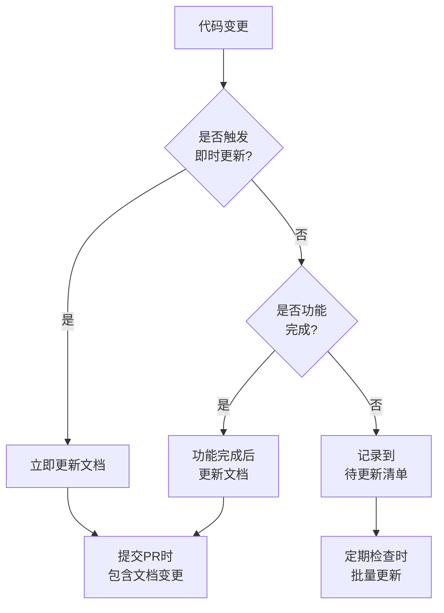

# 文档维护策略指南

> **用途**: 指导如何维护和更新 AI 文档体系  
> **适用对象**: 开发团队和维护人员  
> **版本**: v1.0  
> **最后更新**: 2025-11-29

---

## 📋 概述

本文档提供完整的文档维护策略，确保 AI 文档体系始终与代码保持同步，持续为团队提供准确的开发指导。

---

## 🔄 更新触发条件

### 1. 即时更新触发条件

以下代码变更**必须立即更新**相关文档：

| 代码变更类型           | 需要更新的文档                   | 更新内容                         |
| :--------------------- | :------------------------------- | :------------------------------- |
| **API 接口变更**       | `api_layer.md` / `api_design.md` | 接口签名、参数、返回值、示例代码 |
| **数据库 Schema 变更** | `database_schema.md`             | 表结构、字段定义、关系图         |
| **核心配置变更**       | 主文档 + 相关子文档              | 配置说明、示例、流程图           |
| **关键架构调整**       | `architecture_overview.md`       | 架构图、模块关系、数据流         |
| **核心工具函数修改**   | 主文档核心代码模式章节           | 函数签名、使用示例               |

### 2. 功能完成后更新

以下情况在**功能开发完成后**更新文档：

| 场景             | 需要更新的文档        | 更新时机       |
| :--------------- | :-------------------- | :------------- |
| **新增业务模块** | 主文档 + 新建子文档   | PR 合并后      |
| **重构现有模块** | 相关子文档            | 重构完成后     |
| **新增通用组件** | `component_guide.md`  | 组件稳定后     |
| **新增路由**     | `routing_guide.md`    | 路由配置完成后 |
| **状态管理优化** | `state_management.md` | 新方案实施后   |

### 3. 定期检查更新

**建议周期**：

- **每周**: 检查`plans/`目录中已完成的方案，确保文档已同步更新
- **每月**: 审查主文档的"常见任务速查"章节，补充新的常见任务
- **每季度**: 全面审查文档质量，清理过时内容，优化结构

### 4. 季度审计清单

**每季度进行一次全面审计**：

- [ ] 所有代码示例可运行且版本正确
- [ ] 所有文件路径链接有效
- [ ] 技术栈版本信息准确
- [ ] 架构图反映当前状态
- [ ] 没有遗漏的重要功能模块
- [ ] "AI 编码禁忌"章节反映最新实践
- [ ] 子文档之间没有矛盾
- [ ] Mermaid 图表可正确渲染

---

## 📝 更新流程

### 标准更新流程



### 更新步骤

1. **识别影响范围**

   - 确定代码变更影响哪些文档
   - 检查主文档和相关子文档

2. **更新文档内容**

   - 更新代码示例（必须从真实代码提取）
   - 更新配置说明
   - 更新流程图/架构图（如需要）
   - 更新文档间的交叉引用

3. **验证更新**

   - 检查代码示例可运行
   - 验证所有链接有效
   - 确认 Mermaid 图表渲染正确
   - 检查格式一致性

4. **提交变更**
   - 代码 PR 中同时包含文档更新
   - Commit 信息注明文档更新内容
   - 请求代码审查时一并审查文档

---

## 🎯 维护周期建议

### 高频维护项 (每周)

- ✅ 检查`plans/`目录中已完成方案的文档同步状态
- ✅ 更新`knowledge/`目录（沉淀本周遇到的问题和解决方案）
- ✅ 检查主文档的技术栈版本信息

### 中频维护项 (每月)

- ✅ 审查并补充"常见任务速查"章节
- ✅ 检查代码示例的准确性
- ✅ 更新"AI 编码禁忌"（如有新发现）
- ✅ 检查子文档完整性

### 低频维护项 (每季度)

- ✅ 全面质量审计（使用质量检查清单）
- ✅ 架构图全面更新
- ✅ 清理过时内容
- ✅ 优化文档结构
- ✅ 补充遗漏的重要模块

---

## 📂 版本控制策略

### Git 版本控制

**文档与代码同仓管理**：

```bash
# 文档变更与代码变更一起提交
git add src/ dev_docs/
git commit -m "feat: 添加用户权限功能 + 更新相关文档"
```

**文档专用分支**（大规模文档重构时）：

```bash
# 创建文档更新分支
git checkout -b docs/update-auth-module

# 完成后合并到主分支
git checkout main
git merge docs/update-auth-module
```

### 版本标记

在重大文档更新时打 Tag：

```bash
# 初始文档体系
git tag -a docs-v1.0 -m "Initial documentation system"

# 重大更新
git tag -a docs-v1.1 -m "Added authentication module documentation"
```

### 变更日志

在主文档中维护变更记录：

```markdown
## 📜 文档更新记录

### v1.1 (2025-11-28)

- 新增：用户权限模块文档
- 更新：API 层文档（新增权限相关接口）
- 优化：架构图（增加权限服务模块）

### v1.0 (2025-11-01)

- 初始版本：完整文档体系
```

---

## 🔍 质量保证

### 文档质量检查

**每次更新后检查**：

- [ ] 代码示例来自真实代码
- [ ] 文件路径准确且有效
- [ ] 版本信息正确
- [ ] Markdown 格式规范
- [ ] 链接可点击跳转
- [ ] 图表正确渲染

### 一致性检查

- [ ] 术语使用统一
- [ ] 代码风格一致
- [ ] 章节结构对齐
- [ ] 交叉引用准确

### 可用性验证

**新 AI 测试**：

- 让没有接触过项目的 AI 读取文档
- 验证是否能在 5 分钟内定位关键信息
- 收集反馈并优化

---

## 👥 团队协作

### 文档所有权

**明确责任人**：

| 文档类型                         | 责任人       | 更新频率   |
| :------------------------------- | :----------- | :--------- |
| `AI_Coding_Context.md`           | 技术负责人   | 每月       |
| `api_layer.md` / `api_design.md` | 后端团队     | 即时       |
| `component_guide.md`             | 前端团队     | 功能完成后 |
| `database_schema.md`             | 数据库负责人 | 即时       |
| `knowledge/`                     | 全员         | 随时       |

### 协作规范

1. **代码 PR 包含文档**

   - PR 必须同时更新相关文档
   - Code Review 时一并审查文档质量

2. **文档审核机制**

   - 技术负责人定期审查文档质量
   - 新成员入职时验证文档可用性

3. **知识沉淀文化**
   - 遇到问题 → 解决问题 → 沉淀到`knowledge/`
   - 每周团队会议分享本周知识沉淀

---

## 🚨 常见问题

### Q1: 代码变更频繁，文档跟不上怎么办？

**解决方案**：

1. 严格执行"代码 PR 包含文档更新"规范
2. 使用`plans/`目录记录待更新项
3. 定期（每周）批量处理积压的文档更新

### Q2: 如何避免文档与代码不一致？

**解决方案**：

1. 文档中的代码示例必须从真实代码提取
2. 标注代码示例的文件路径和行号
3. 季度审计时运行文档中的代码示例验证

### Q3: 文档太多，不知道从哪里更新？

**解决方案**：

1. 参考本文档的"更新触发条件"表格
2. 从主文档开始，找到相关子文档链接
3. 使用全局搜索定位需要更新的章节

### Q4: 怎样判断文档质量是否达标？

**解决方案**：

1. 使用模板中的"质量检查清单"
2. 让新团队成员测试文档可用性
3. 让 AI 读取文档并完成实际开发任务

---

## 📌 最佳实践

### ✅ 推荐做法

1. **文档即代码** - 将文档更新作为开发流程的一部分
2. **示例真实** - 所有代码示例从真实项目代码提取
3. **及时更新** - 不要积压文档更新任务
4. **定期审查** - 遵循维护周期建议
5. **全员参与** - 文档维护是全员责任

### ❌ 避免做法

1. ❌ 临时代码作为示例
2. ❌ 编造或想象的配置
3. ❌ 长时间不更新文档
4. ❌ 仅在文档中用占位符
5. ❌ 文档责任仅落在一人身上

---

## 🔗 相关资源

- [更新触发机制](../core/update_triggers.md) - 详细的更新触发条件
- [质量检查清单](../templates/GENERATION_PLAN_TEMPLATE.md#质量检查清单) - 模板中的质量标准
- [Plans 目录使用](../templates/plans_README_TEMPLATE.md) - 方案文档管理
- [Knowledge 目录使用](../templates/knowledge_README_TEMPLATE.md) - 知识沉淀指南

---

**记住**: 优秀的文档不是一次性完成的,而是持续维护的结果! 📚
