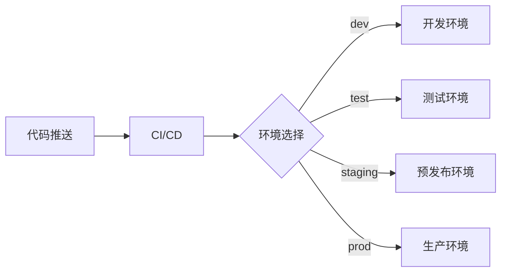

# 部署文档模板

> **用途**: 记录项目的部署流程、环境配置和运维操作  
> **适用场景**: 所有需要部署的项目

---

# [项目名称] - 部署文档

## 📋 部署概览

### 部署环境

| 环境           | 用途     | URL                   | 部署频率 |
| -------------- | -------- | --------------------- | -------- |
| **开发环境**   | 开发测试 | [dev.example.com]     | 每次提交 |
| **测试环境**   | QA测试   | [test.example.com]    | 每日构建 |
| **预发布环境** | 生产验证 | [staging.example.com] | 发布前   |
| **生产环境**   | 线上服务 | [www.example.com]     | 定期发布 |

### 部署架构



---

## 🔧 环境要求

### 系统依赖

**操作系统**: [Ubuntu 22.04 / Windows Server / macOS]

**运行时环境**:

- [Node.js]: 18.x+
- [Python]: 3.9+
- [Java]: JDK 17+
- [Go]: 1.21+
- [其他]

**数据库**:

- [PostgreSQL]: 15+
- [MySQL]: 8.0+
- [MongoDB]: 6.0+
- [Redis]: 7.0+

**其他服务**:

- [Nginx]: 1.24+
- [Docker]: 24.0+
- [Kubernetes]: 1.28+ "如使用"

---

## 🚀 快速部署

### 前提条件

```bash
# 检查环境
[node --version / python --version / java --version]
[docker --version]
[kubectl version]  # 如使用K8s
```

### 一键部署脚本

```bash
# 克隆代码
git clone [repository-url]
cd [project-name]

# 配置环境变量
cp .env.example .env
# 编辑 .env 文件

# 安装依赖
[npm install / pip install -r requirements.txt / go mod download]

# 构建
[npm run build / docker build -t app:latest .]

# 启动
[npm start / docker-compose up -d / kubectl apply -f k8s/]
```

---

## 📦 详细部署流程

### 1. 传统部署（非容器）

#### 步骤1: 环境准备

```bash
# 创建部署目录
mkdir -p /opt/[project-name]
cd /opt/[project-name]

# 安装依赖（以Node.js为例）
curl -fsSL https://deb.nodesource.com/setup_18.x | sudo -E bash -
sudo apt-get install -y nodejs

# 安装进程管理器
npm install -g pm2
```

#### 步骤2: 代码部署

```bash
# 拉取代码
git clone [repository-url] .
git checkout [branch/tag]

# 安装项目依赖
npm ci --production

# 构建
npm run build
```

#### 步骤3: 配置环境变量

```bash
# 创建环境变量文件
cat > .env << EOF
NODE_ENV=production
DATABASE_URL=[database-connection-string]
REDIS_URL=[redis-connection-string]
API_KEY=[api-key]
EOF
```

#### 步骤4: 启动服务

```bash
# 使用PM2启动
pm2 start npm --name "[app-name]" -- start
pm2 save
pm2 startup
```

---

### 2. Docker部署

#### Dockerfile

```dockerfile
# Dockerfile
FROM node:18-alpine AS builder

WORKDIR /app
COPY package*.json ./
RUN npm ci --production=false

COPY . .
RUN npm run build

FROM node:18-alpine

WORKDIR /app
COPY --from=builder /app/dist ./dist
COPY --from=builder /app/node_modules ./node_modules
COPY package*.json ./

EXPOSE 3000
CMD ["npm", "start"]
```

#### docker-compose.yml

```yaml
version: "3.8"

services:
  app:
    build: .
    ports:
      - "3000:3000"
    environment:
      - NODE_ENV=production
      - DATABASE_URL=${DATABASE_URL}
    depends_on:
      - db
      - redis
    restart: unless-stopped

  db:
    image: postgres:15-alpine
    environment:
      - POSTGRES_PASSWORD=${DB_PASSWORD}
    volumes:
      - postgres_data:/var/lib/postgresql/data

  redis:
    image: redis:7-alpine
    volumes:
      - redis_data:/data

volumes:
  postgres_data:
  redis_data:
```

#### 部署命令

```bash
# 构建镜像
docker-compose build

# 启动服务
docker-compose up -d

# 查看日志
docker-compose logs -f app

# 停止服务
docker-compose down
```

---

### 3. Kubernetes部署

#### deployment.yaml

```yaml
apiVersion: apps/v1
kind: Deployment
metadata:
  name: app
spec:
  replicas: 3
  selector:
    matchLabels:
      app: myapp
  template:
    metadata:
      labels:
        app: myapp
    spec:
      containers:
        - name: app
          image: myapp:latest
          ports:
            - containerPort: 3000
          env:
            - name: NODE_ENV
              value: "production"
            - name: DATABASE_URL
              valueFrom:
                secretKeyRef:
                  name: app-secrets
                  key: database-url
          resources:
            requests:
              memory: "256Mi"
              cpu: "250m"
            limits:
              memory: "512Mi"
              cpu: "500m"
```

#### service.yaml

```yaml
apiVersion: v1
kind: Service
metadata:
  name: app-service
spec:
  selector:
    app: myapp
  ports:
    - port: 80
      targetPort: 3000
  type: LoadBalancer
```

#### 部署命令

```bash
# 创建Secrets
kubectl create secret generic app-secrets \
  --from-literal=database-url=[DATABASE_URL]

# 部署应用
kubectl apply -f k8s/

# 查看状态
kubectl get pods
kubectl get services

# 查看日志
kubectl logs -f deployment/app

# 滚动更新
kubectl set image deployment/app app=myapp:v2

# 回滚
kubectl rollout undo deployment/app
```

---

## 🔐 环境变量配置

### 必需环境变量

| 变量名         | 说明       | 示例值          | 是否敏感 |
| -------------- | ---------- | --------------- | -------- |
| `NODE_ENV`     | 运行环境   | production      | 否       |
| `PORT`         | 服务端口   | 3000            | 否       |
| `DATABASE_URL` | 数据库连接 | postgres://...  | ✅ 是    |
| `REDIS_URL`    | Redis连接  | redis://...     | ✅ 是    |
| `API_KEY`      | API密钥    | sk\_...         | ✅ 是    |
| `JWT_SECRET`   | JWT密钥    | [random-string] | ✅ 是    |

### 可选环境变量

| 变量名            | 说明         | 默认值 |
| ----------------- | ------------ | ------ |
| `LOG_LEVEL`       | 日志级别     | info   |
| `CACHE_TTL`       | 缓存过期时间 | 3600   |
| `MAX_CONNECTIONS` | 最大连接数   | 100    |

---

## 🌐 Nginx配置

```nginx
# /etc/nginx/sites-available/app
upstream app_backend {
    server 127.0.0.1:3000;
    # 负载均衡
    # server 127.0.0.1:3001;
    # server 127.0.0.1:3002;
}

server {
    listen 80;
    server_name example.com www.example.com;

    # HTTPS重定向
    return 301 https://$host$request_uri;
}

server {
    listen 443 ssl http2;
    server_name example.com www.example.com;

    # SSL证书
    ssl_certificate /etc/letsencrypt/live/example.com/fullchain.pem;
    ssl_certificate_key /etc/letsencrypt/live/example.com/privkey.pem;

    # 静态文件
    location /static {
        alias /opt/app/public;
        expires 1y;
        add_header Cache-Control "public, immutable";
    }

    # API代理
    location /api {
        proxy_pass http://app_backend;
        proxy_http_version 1.1;
        proxy_set_header Upgrade $http_upgrade;
        proxy_set_header Connection 'upgrade';
        proxy_set_header Host $host;
        proxy_set_header X-Real-IP $remote_addr;
        proxy_set_header X-Forwarded-For $proxy_add_x_forwarded_for;
        proxy_cache_bypass $http_upgrade;
    }

    # SPA fallback
    location / {
        try_files $uri $uri/ /index.html;
    }
}
```

---

## 📊 监控与日志

### 日志位置

- **应用日志**: `/var/log/[app-name]/app.log`
- **访问日志**: `/var/log/nginx/access.log`
- **错误日志**: `/var/log/nginx/error.log`
- **系统日志**: `journalctl -u [service-name]`

### 监控工具

- **应用性能**: [New Relic / DataDog / Application Insights]
- **基础设施**: [Prometheus + Grafana]
- **日志聚合**: [ELK Stack / Loki]
- **告警**: [PagerDuty / Opsgenie]

### 健康检查

```bash
# HTTP健康检查
curl https://example.com/health

# 预期响应
{"status": "ok", "version": "1.0.0"}
```

---

## 🔄 CI/CD配置

### GitHub Actions

```yaml
# .github/workflows/deploy.yml
name: Deploy

on:
  push:
    branches: [main]

jobs:
  deploy:
    runs-on: ubuntu-latest
    steps:
      - uses: actions/checkout@v2

      - name: Build Docker image
        run: docker build -t myapp:${{ github.sha }} .

      - name: Push to registry
        run: |
          echo "${{ secrets.DOCKER_PASSWORD }}" | docker login -u "${{ secrets.DOCKER_USERNAME }}" --password-stdin
          docker push myapp:${{ github.sha }}

      - name: Deploy to production
        run: |
          kubectl set image deployment/app app=myapp:${{ github.sha }}
```

---

## 🔥 故障排查

### 常见问题

**问题1**: 服务无法启动

```bash
# 检查日志
pm2 logs app
# 或
docker logs [container-id]

# 检查端口占用
netstat -tlnp | grep :3000

# 检查环境变量
printenv | grep [VAR_NAME]
```

**问题2**: 数据库连接失败

```bash
# 测试连接
psql [DATABASE_URL]

# 检查防火墙
telnet [db-host] 5432
```

**问题3**: 内存溢出

```bash
# 查看内存使用
pm2 monit
# 或
docker stats

# 增加Node.js堆内存
NODE_OPTIONS="--max-old-space-size=4096" npm start
```

---

## 🔒 安全检查清单

部署前确认:

- [ ] 所有敏感信息使用环境变量
- [ ] HTTPS已启用
- [ ] 防火墙规则正确配置
- [ ] 数据库访问限制
- [ ] 日志不包含敏感信息
- [ ] 依赖项安全扫描通过
- [ ] API速率限制已启用

---

## 📅 发布流程

### 版本发布步骤

1. **代码冻结** - 停止新功能合并
2. **测试验证** - 在staging环境全面测试
3. **创建发布分支** - `git checkout -b release/v1.0.0`
4. **更新版本号** - 修改package.json等
5. **打Tag** - `git tag v1.0.0`
6. **部署到生产** - 执行部署流程
7. **验证** - 检查生产环境
8. **通知** - 通知团队发布完成

### 回滚流程

```bash
# Docker
docker-compose down
docker-compose up -d --force-recreate

# Kubernetes
kubectl rollout undo deployment/app

# PM2
pm2 delete app
git checkout [previous-tag]
npm ci
npm run build
pm2 start npm --name "app" -- start
```

---

## 📝 维护操作

### 定期任务

- **每日**: 检查日志、监控告警
- **每周**: 更新依赖、备份数据库
- **每月**: 安全补丁、性能优化

### 数据库备份

```bash
# PostgreSQL备份
pg_dump [DATABASE_URL] > backup_$(date +%Y%m%d).sql

# 恢复
psql [DATABASE_URL] < backup_20231127.sql
```

---

## 📅 文档元信息

- **创建日期**: YYYY-MM-DD
- **最后更新**: YYYY-MM-DD
- **维护者**: [DevOps团队]
- **紧急联系**: [联系方式]
