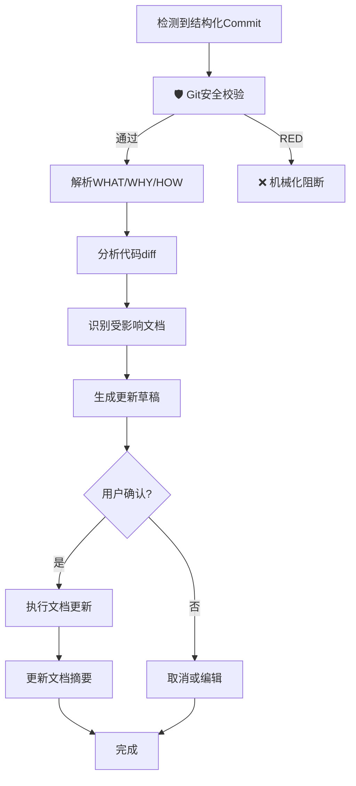

# Commit-Guided 文档更新工作流

> **版本**: v1.0  
> **创建日期**: 2025-12-11  
> **用途**: 基于结构化 Commit 信息自动化文档更新流程

---

## 📋 概述

Commit-Guided 文档更新是一种基于 Git 提交信息的智能文档同步机制。通过解析结构化的 commit message (WHAT/WHY/HOW),AI 能够自动识别需要更新的文档并生成更新草稿。

**核心价值**:

- ✅ **减少重复解释**: 用户无需再向 AI 解释"改了什么、为什么改"
- ✅ **提升准确性**: 基于明确的 commit 信息,而非事后回忆
- ✅ **节省时间**: 从传统的 27 分钟降低到 5 分钟
- ✅ **知识沉淀**: commit → 文档 → ADR 形成闭环

---

## 🎯 适用场景

### ✅ 推荐使用

- 功能开发完成,准备提交代码
- 已有明确的变更意图和实现策略
- 希望文档与代码同步更新
- 团队协作需要清晰的变更记录

### ⚠️ 不适用场景

- 临时性的调试代码
- WIP (Work In Progress) 提交
- 纯文档修改(拼写错误等)
- 自动化工具生成的提交(如格式化)

---

## 🔄 工作流程

### 触发条件

Commit-Guided 文档更新在以下情况下触发:

1. **主动触发**: 检测到 `prompt:` / `ai:` / `doc:` 前缀的 commit
2. **被动触发**: 用户明确请求"基于最近的 commit 更新文档"
3. **合并后触发**: 检测到 merge commit,扫描 source branch 的结构化提交

### 7 步自动化流程



#### Step 0: 🛡️ Git 安全校验 (Mandatory)

**必须在任何流程开始前执行,确保 AI 不在非法区域内操作。**

**校验命令**:

```bash
# 校验当前分支安全性
node tools/js/git_safety.js --mode check-branch
```

**阻断规则**:
- **RED ZONE (P0 阻断)**: 如果返回 `safe: false` 且涉及保护分支或危险命令,AI 必须立即停止任务。
- **YELLOW ZONE (需授权)**: 如果返回需要授权的操作,AI 必须暂停并等待用户输入 `Y` 确认。

---

#### Step 1: 检测结构化 Commit

**工具**: `tools/py/commit_parser.py`

**操作**:

```bash
# 获取最近的commit
python tools/py/commit_parser.py --max-count 1

# 获取最近7天的commit
python tools/py/commit_parser.py --since "7 days ago"

# 获取指定分支的commit
python tools/py/commit_parser.py --branch feature/user-points --max-count 5
```

**输出示例**:

```json
{
  "commit_id": "abc123",
  "type": "prompt:feature",
  "what": "新增用户积分系统",
  "why": "提升用户活跃度,对应需求PRD-2024-156",
  "how": "User模型新增points字段,API端点/api/points,使用乐观锁避免并发问题",
  "author": "张三",
  "date": "2025-12-11T10:00:00Z"
}
```

#### Step 2: 解析 WHAT/WHY/HOW

**目的**: 提取结构化信息

**解析规则**:

- **WHAT**: 识别变更的核心对象和动作
- **WHY**: 提取业务动机、需求编号、技术原因
- **HOW**: 提取实现策略、影响范围、风险点

**示例**:

```yaml
what: "新增用户积分系统"
  → 核心对象: 用户积分
  → 动作: 新增
  → 类型: 功能开发

why: "提升用户活跃度,对应需求PRD-2024-156"
  → 业务价值: 提升用户活跃度
  → 需求编号: PRD-2024-156
  → 优先级: P0 (有明确需求编号)

how: "User模型新增points字段,API端点/api/points,使用乐观锁避免并发问题"
  → 数据层: User模型新增points字段
  → API层: /api/points
  → 技术决策: 使用乐观锁
  → 风险点: 并发问题
```

#### Step 3: 分析代码 diff

**工具**: `tools/py/git_diff_analyzer.py`

**操作**:

```bash
# 分析指定commit的diff
python tools/py/git_diff_analyzer.py --commit abc123

# 分析最近7天的diff
python tools/py/git_diff_analyzer.py --since "7 days ago"
```

**输出示例**:

```json
{
  "changed_files": [
    {
      "path": "src/models/user.py",
      "change_type": "modified",
      "lines_added": 15,
      "lines_deleted": 2
    },
    {
      "path": "src/api/points.py",
      "change_type": "added",
      "lines_added": 120,
      "lines_deleted": 0
    }
  ],
  "summary": {
    "total_files": 2,
    "total_additions": 135,
    "total_deletions": 2
  }
}
```

#### Step 4: 识别受影响文档

**工具**: `tools/py/summary_related_checker.py`

**策略**:

1. **基于 related_files**: 检查文档摘要中的 `related_files` 字段
2. **基于 HOW 分析**: 解析 HOW 中提到的模块/文件
3. **基于优先级映射**: 根据 `core/update_triggers.md` 的规则

**操作**:

```bash
# 管道模式(推荐)
python tools/py/git_diff_analyzer.py --commit abc123 | \
python tools/py/summary_related_checker.py --from-stdin

# 手动模式
python tools/py/summary_related_checker.py --changed-files "src/models/user.py,src/api/points.py"
```

**输出示例**:

```json
{
  "affected_documents": [
    {
      "file": "dev_docs/api_layer.md",
      "priority": "P0",
      "reason": "related_files包含src/api/points.py",
      "suggested_section": "API端点列表"
    },
    {
      "file": "dev_docs/database_schema.md",
      "priority": "P0",
      "reason": "related_files包含src/models/user.py",
      "suggested_section": "User表定义"
    },
    {
      "file": "dev_docs/AI_Coding_Context.md",
      "priority": "P1",
      "reason": "新增功能模块",
      "suggested_section": "核心模块"
    }
  ]
}
```

#### Step 5: 生成更新草稿

**AI 角色**: `commit_analyst` (来自 001-AI 角色库)

**输入**:

- WHAT/WHY/HOW 信息
- 代码 diff
- 受影响文档列表

**输出**: 结构化的更新草稿

**草稿格式**:

````markdown
# 文档更新草稿

**基于 Commit**: abc123 (2025-12-11)  
**变更类型**: 新增功能  
**优先级**: P0

---

## 需要更新的文档

### 1. dev_docs/api_layer.md

**章节**: "API 端点列表"  
**更新类型**: 新增内容

**建议内容**:

#### 积分相关 API (新增 2025-12-11)

##### 获取用户积分

```http
GET /api/points/:userId
```

**响应**:

```json
{
  "user_id": "123",
  "points": 1000,
  "updated_at": "2025-12-11T10:00:00Z"
}
```

---

### 2. dev_docs/database_schema.md

**章节**: "User 表定义"  
**更新类型**: 修改现有内容

**建议内容**:

在 User 表中新增字段:

| 字段   | 类型    | 说明     | 新增      |
| ------ | ------- | -------- | --------- |
| points | Integer | 用户积分 | ✅ v2.5.0 |

**迁移说明**:

- 迁移文件: `migrations/0015_add_user_points.py`
- 默认值: 0

---

### 3. dev_docs/AI_Coding_Context.md

**章节**: "核心模块"  
**更新类型**: 新增内容

**建议内容**:

#### 用户积分系统 (v2.5.0)

**功能**: 记录和管理用户积分

**实现**:

- 模型: `src/models/user.py` (points 字段)
- API: `src/api/points.py`
- 并发控制: 乐观锁

**业务价值**: 提升用户活跃度 (PRD-2024-156)
````

#### Step 6: 用户确认

**AI 提示**:

```markdown
📝 基于 commit abc123,检测到以下文档需要更新:

✅ 自动分析结果:

- dev_docs/api_layer.md (P0 - 新增积分 API)
- dev_docs/database_schema.md (P0 - User 表新增字段)
- dev_docs/AI_Coding_Context.md (P1 - 新增模块说明)

📋 已生成更新草稿 (见上方)

是否执行更新? (Y/n/e)

- Y: 执行更新
- n: 取消
- e: 编辑草稿后再执行
```

**用户选项**:

- **Y (Yes)**: AI 直接执行更新
- **n (No)**: 取消本次更新
- **e (Edit)**: 用户编辑草稿后,AI 再执行

#### Step 7: 执行文档更新

**操作**:

1. 逐个打开需要更新的文档
2. 定位到指定章节
3. 插入或修改内容
4. 保持格式一致
5. 更新文档摘要的 `verified_at` 字段
6. 更新 `related_files` (如有新增引用)

**验证**:

```bash
# 验证摘要格式
python tools/py/summary_validator.py --file dev_docs/api_layer.md

# 验证文档健康度
python tools/py/doc_health_checker.py --file dev_docs/api_layer.md
```

---

## 🔀 降级策略

### 场景 1: 非结构化 Commit

**问题**: commit 没有 `prompt:` 前缀,或缺少 WHAT/WHY/HOW

**降级方案**:

1. 基于 `core/update_triggers.md` 的传统检测
2. 分析 diff + commit message 关键词
3. 提示用户补充变更意图

**AI 提示**:

```markdown
⚠️ 检测到代码变更,但 commit 信息不完整

变更文件:

- src/models/user.py (modified)
- src/api/points.py (added)

请补充以下信息以生成准确的文档更新:

1. 这次变更的核心目的是什么? (WHAT)
2. 为什么要做这个变更? (WHY)
3. 具体是如何实现的? (HOW)
```

### 场景 2: 混合 Commit

**问题**: 同一 PR 包含多个 commit,部分结构化、部分传统

**降级方案**:

1. 聚合所有 commit 信息
2. 优先使用结构化信息
3. 传统 commit 作为补充

**工具**:

```bash
# 聚合多个commit
python tools/py/commit_aggregator.py --branch feature/user-points --base main
```

**输出示例**:

```json
{
  "aggregated_commits": [
    {
      "type": "structured",
      "what": "新增用户积分系统",
      "why": "提升用户活跃度",
      "how": "User模型新增points字段"
    },
    {
      "type": "traditional",
      "message": "fix: 修复积分计算bug",
      "inferred_what": "修复积分计算逻辑",
      "confidence": 0.7
    }
  ],
  "summary": "新增用户积分系统,并修复了积分计算bug"
}
```

### 场景 3: Merge Commit

**问题**: 用户手动合并后,需要同步 feature branch 的文档更新

**降级方案**:

1. 检测 merge commit
2. 扫描 source branch 的所有 `prompt:` 提交
3. 聚合生成"合并后文档更新清单"

**工具**:

```bash
# 分析merge commit
python tools/py/commit_parser.py --merge-summary \
  --source feature/user-points \
  --target main
```

---

## ⚠️ 错误处理

### 错误 1: 无法解析 Commit

**原因**: commit message 格式不符合预期

**处理**:

1. 记录警告日志
2. 降级到传统检测
3. 提示用户使用 CLI 工具

**AI 提示**:

```markdown
⚠️ 无法解析 commit abc123

建议使用 CLI 工具生成规范的 commit:

python tools/py/commit_template_cli.py
```

### 错误 2: 找不到受影响文档

**原因**: 文档摘要缺失或 `related_files` 不准确

**处理**:

1. 基于 HOW 字段手动推断
2. 提示用户确认
3. 建议更新文档摘要

**AI 提示**:

```markdown
⚠️ 自动检测未找到受影响文档

根据 commit 信息推断可能需要更新:

- dev_docs/api_layer.md (因为新增了 API)
- dev_docs/database_schema.md (因为修改了模型)

是否正确? (Y/n/自定义)
```

### 错误 3: Token 消耗过大

**原因**: commit 数量过多或 WHAT/WHY/HOW 过长

**处理**:

1. 启用聚合模式 (`commit_aggregator.py`)
2. 限制时间窗口(默认 7 天)
3. 过滤纯文档 commit

**配置**:

```yaml
commit_guided_documentation:
  token_optimization:
    time_window_days: 7
    max_commits_per_batch: 50
    enable_aggregation: true
    skip_doc_only_commits: true
```

---

## 📊 完整示例

### 示例 1: 新增功能模块

**Commit**:

```bash
git commit -m "prompt(feature): 新增用户积分系统" \
  -m "WHAT: 实现积分累积和兑换功能
WHY: 提升用户活跃度,对应需求PRD-2024-156
HOW: User模型新增points字段,API端点/api/points,使用乐观锁避免并发问题"
```

**AI 工作流**:

```markdown
1. 检测到 prompt:feature commit
2. 解析 WHAT/WHY/HOW ✅
3. 分析 diff: src/models/user.py, src/api/points.py ✅
4. 识别受影响文档:
   - dev_docs/api_layer.md (P0)
   - dev_docs/database_schema.md (P0)
   - dev_docs/AI_Coding_Context.md (P1)
5. 生成更新草稿 ✅
6. 提示用户确认
   → 用户选择 Y
7. 执行更新 ✅
   - 更新 api_layer.md (新增积分 API 章节)
   - 更新 database_schema.md (User 表新增 points 字段)
   - 更新 AI_Coding_Context.md (新增积分系统模块)
   - 更新所有文档的 verified_at 字段
```

### 示例 2: API 变更

**Commit**:

```bash
git commit -m "prompt(refactor): 用户API升级到v2" \
  -m "WHAT: 重构用户API,支持字段选择和性能优化
WHY: v1 API性能不足,无法满足大规模用户查询需求
HOW: 新增/api/v2/users端点,支持?fields参数,添加Redis缓存,v1标记为废弃"
```

**AI 工作流**:

```markdown
1. 检测到 prompt:refactor commit
2. 解析 WHAT/WHY/HOW ✅
3. 分析 diff: src/api/users_v2.py ✅
4. 识别受影响文档:
   - dev_docs/api_layer.md (P0)
   - dev_docs/AI_Coding_Context.md (P1)
   - dev_docs/migration_guide.md (P1 - 需要添加迁移指南)
5. 生成更新草稿 ✅
6. 用户确认 → Y
7. 执行更新 ✅
   - 更新 api_layer.md (新增 v2 API,标记 v1 为废弃)
   - 更新 AI_Coding_Context.md (更新 API 版本说明)
   - 更新 migration_guide.md (新增 v1→v2 迁移指南)
```

---

## 🔗 与其他功能的协同

### 与 003-设计思维引导 的闭环

**Step 5 输出增强**:

003 的 Step 5 现在会输出"Commit 指导",提供建议的 commit 策略:

```markdown
## 下一步行动

### Commit 指导

**建议 Commit 策略**: 分 3 个 commit 提交

Commit 1 - 数据模型:

prompt(feature): User 模型新增积分字段

WHAT: 在 User 模型添加 points 字段,支持积分记录
WHY: 对应需求 PRD-2024-156 第 1 阶段,建立积分数据基础
HOW: 新增 points 字段(Integer, default=0),生成 migration,单元测试覆盖
```

**价值**: 设计 → 实施 → 提交 → 文档更新 无缝衔接

### 与 012-强制文档摘要 的协同

**自动填充摘要**:

```yaml
---
summary: "新增用户积分系统" # 来自WHAT
keywords: [积分, API, 乐观锁] # 来自HOW
related_files: src/models/user.py | src/api/points.py # 来自diff+HOW
verified_at: 2025-12-11 # 来自commit date
---
```

### 与 013-AI 互审机制 的协同

**Reviewer 审查维度扩展**:

- ✅ WHY 是否充分? (不能是"需求要求")
- ✅ HOW 是否考虑了风险?
- ✅ Commit 质量评分是否达标?
- ✅ 文档更新是否完整?

### 与 004-ADR 系统 的协同

**架构决策自动记录**:

识别架构决策类 commit (WHY 提到"架构") → 自动生成 ADR 草稿

```markdown
检测到架构决策类 commit:

WHY: "采用微服务架构,拆分单体应用"

是否生成 ADR 草稿? (Y/n)
```

---

## 📏 质量标准

### Commit 质量评分

使用 `tools/py/commit_quality_scorer.py` 评分:

```bash
python tools/py/commit_quality_scorer.py --commit abc123
```

**评分维度** (满分 100):

- WHAT 清晰度 (30 分)
- WHY 深度 (30 分)
- HOW 完整性 (20 分)
- 粒度合理性 (10 分)
- 可测试性 (10 分)

**应用**:

- 分数 <60: AI 主动建议改进
- 分数 60-80: 给出优化建议但不阻塞
- 分数 >80: 优质 commit,加入最佳实践示例库

### 文档更新质量

**检查清单**:

- [ ] 所有新增内容有代码依据
- [ ] API 示例完整可用
- [ ] 数据库 schema 准确
- [ ] 与现有文档风格一致
- [ ] 文档摘要已更新 (verified_at, related_files)

---

## 🚫 注意事项

### 禁止事项

1. **❌ 不要臆测变更内容**

   - 必须基于实际 commit 信息
   - 不确定的标注为"需确认"

2. **❌ 不要破坏现有结构**

   - 保持文档原有章节结构
   - 保持格式风格一致

3. **❌ 不要遗漏相互引用**
   - 更新 A 文档时,检查是否有 B 文档引用 A
   - 确保引用同步更新

### 必须事项

1. **✅ 必须有 commit 依据**

   - 所有更新都引用具体 commit
   - 提供 commit ID 和日期

2. **✅ 必须保持一致性**

   - 术语使用一致
   - 格式风格一致
   - 章节结构一致

3. **✅ 必须更新摘要**
   - 更新 `verified_at` 字段
   - 更新 `related_files` (如有新增引用)

---

## 🔗 相关文档

- [workflows/git_safety_workflow.md](./git_safety_workflow.md) - Git 安全工作流
- [core/update_triggers.md](../core/update_triggers.md) - 文档更新触发条件
- [workflows/incremental_update_workflow.md](./incremental_update_workflow.md) - 增量更新流程
- [agents/runtime/commit_analyst.md](../agents/runtime/commit_analyst.md) - Commit 分析师角色

---

## 💡 快速参考

### CLI 工具速查

```bash
# 生成规范commit
python tools/py/commit_template_cli.py

# 解析commit
python tools/py/commit_parser.py --max-count 5

# 分析diff
python tools/py/git_diff_analyzer.py --since "7 days ago"

# 检测受影响文档
python tools/py/summary_related_checker.py --changed-files "src/api/user.ts"

# Commit质量评分
python tools/py/commit_quality_scorer.py --commit abc123

# 聚合多个commit
python tools/py/commit_aggregator.py --branch feature/xxx --base main
```

### 决策流程

```
有结构化commit → 自动流程 (7步)
无结构化commit → 降级策略 → 提示用户补充
混合commit → 聚合模式 → 优先使用结构化信息
merge commit → 扫描source branch → 生成合并清单
```

---

**版本**: v1.0  
**最后更新**: 2025-12-11  
**路径**: `workflows/commit_guided_update.md`
