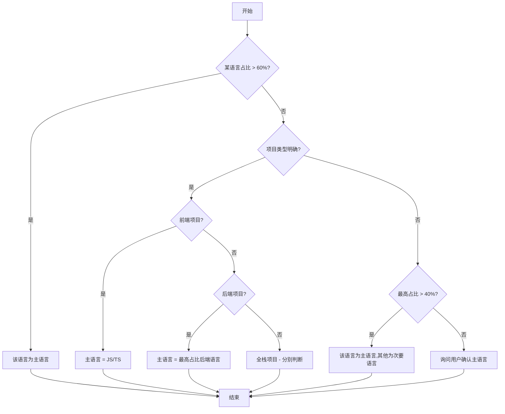
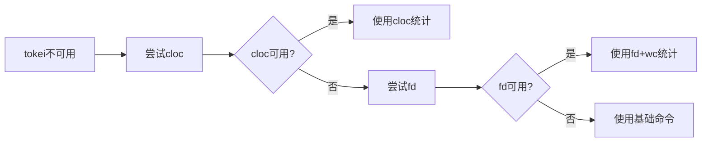

# 项目检测流程 (步骤 0-1)

> **上级文档**: [AI_ENTRY_POINT.md](../AI_ENTRY_POINT.md)  
> **版本**: v2.3  
> **最后更新**: 2025-11-28

---

## 📋 流程概述

本文档详细说明 AI 如何检测项目的基本信息(语言、规模、类型)。

---

## 步骤 0: 环境预检

### 0.1 检测统计工具

**目的**: 检测可用的代码统计工具,确保跨平台兼容性

**检测命令** (跨平台):

```bash
# Linux/Mac
which cloc && echo "✅ cloc可用" || echo "❌ cloc未安装"
which tokei && echo "✅ tokei可用" || echo "❌ tokei未安装"
which fd && echo "✅ fd可用" || echo "❌ fd未安装"

# Windows PowerShell
where.exe cloc
where.exe tokei
where.exe fd
```

### 0.2 工具选择策略

**优先级排序**:

1. **tokei** (推荐) ⭐⭐⭐

   - 最快,自动排除.gitignore,跨平台支持

2. **cloc** (通用) ⭐⭐

   - 功能全面,准确,但需手动配置排除规则

3. **fd** (快速查找) ⭐⭐

   - 比 find 更快,自动排除.gitignore

4. **基础命令** (降级方案) ⭐
   - Windows: PowerShell `Get-ChildItem`
   - Linux/Mac: `find` + `wc`

### 0.3 自动选择逻辑

AI 自动选择流程:

1. 优先使用 tokei(如果可用)
2. 其次使用 cloc(如果可用)
3. 再次使用 fd + wc(如果可用)
4. 最后降级到基础命令

---

## 步骤 0.5: 框架边界确定 ⭐

> **执行时机**: 环境预检完成后，项目检测之前  
> **重要性**: P0 - 必须执行  
> **目的**: 确定框架位置，避免将框架文件纳入项目分析

### 为什么需要？

**AI Coding Context (AICC)** 是一个辅助工具框架，**不是用户的业务代码**。  
如果在项目检测时包含框架文件，会导致：

- ❌ 项目统计数据不准确（文件数、代码行数虚高）
- ❌ 生成的文档中包含框架自身的文件
- ❌ 文档内容污染，混淆工具与目标

### 框架识别方法

**识别标志**: 包含 `AI_ENTRY_POINT.md` 的目录即为框架根目录

**常见位置**:

- `ai_coding_context/`（最常见）
- `.ai/`（点开头目录）
- `docs/ai_context/`（文档子目录）
- 用户自定义的其他位置

**检测命令**:

```bash
# Windows PowerShell
Test-Path ai_coding_context/AI_ENTRY_POINT.md

# Linux/Mac
test -f ai_coding_context/AI_ENTRY_POINT.md && echo "框架位于: ai_coding_context/" || echo "未检测到标准位置"
```

### 执行步骤

#### 1. 搜索框架位置

**方法 1**: 检查常见位置

```bash
# 依次检查
test -f ai_coding_context/AI_ENTRY_POINT.md
test -f .ai/AI_ENTRY_POINT.md
test -f docs/ai_context/AI_ENTRY_POINT.md
```

**方法 2**: 遍历根目录查找

```bash
# Linux/Mac
find . -maxdepth 2 -name "AI_ENTRY_POINT.md" 2>/dev/null

# Windows PowerShell
Get-ChildItem -Recurse -Depth 2 -Filter "AI_ENTRY_POINT.md" -ErrorAction SilentlyContinue
```

#### 2. 确认框架位置

**输出示例**:

```markdown
✅ 框架边界确认

**框架位置**: `ai_coding_context/`  
**识别方式**: 检测到 AI_ENTRY_POINT.md  
**排除策略**: 在所有扫描命令中使用 `--exclude-standard` 或手动排除
```

#### 3. 记录到分析方案

在后续生成的 `generation_plan.md` 中记录：

```markdown
## 框架边界确认

- 框架位置: `ai_coding_context/`
- 排除目录: `ai_coding_context/`, `node_modules/`, `.git/`
- 确认方式: 自动检测到 AI_ENTRY_POINT.md
```

### 特殊场景处理

#### 场景 1: 未检测到框架

**可能原因**:

- 框架在项目根目录之外（共享框架）
- 框架被重命名为非标准名称

**处理方式**:

```markdown
⚠️ 未检测到框架位置

**检查结果**:

- 未在常见位置找到 AI_ENTRY_POINT.md
- 可能原因: 框架在项目外部或被重命名

**处理**:

- 继续执行项目检测
- 在扫描时使用 `--exclude-standard` 自动检测并排除
```

#### 场景 2: 检测到多个框架位置

**可能原因**:

- 用户复制了框架
- 存在多个版本的框架

**处理方式**:

```markdown
⚠️ 检测到多个框架位置

**发现的位置**:

- ai_coding_context/AI_ENTRY_POINT.md
- .ai/AI_ENTRY_POINT.md

**处理**:

- 排除所有检测到的框架目录
- 在方案中记录此情况
- 建议用户清理冗余框架
```

### 验证清单

在继续执行项目检测之前，确认：

- [ ] 已尝试检测框架位置
- [ ] 已记录框架位置（如果检测到）
- [ ] 已准备好在扫描命令中排除框架目录
- [ ] 如有疑问，已标记为待确认事项

**完成此步骤后，方可继续步骤 1（项目检测）**

---

## 步骤 1: 项目检测

### 1.1 准备排除规则

**⚠️ 关键**: 统计前必须排除依赖目录!

**通用排除目录**:

- Node.js: `node_modules/`, `dist/`, `build/`, `.next/`, `.nuxt/`
- Python: `.venv/`, `venv/`, `__pycache__/`, `*.pyc`
- Java: `target/`, `build/`, `.gradle/`
- Go: `vendor/`
- Rust: `target/`
- 通用: `.git/`, `.idea/`, `.vscode/`

### 1.2 检测编程语言

**跨平台命令示例**:

```bash
# 使用fd (推荐)
fd -e py | wc -l    # Python
fd -e js -e ts | wc -l  # JavaScript/TypeScript

# Windows PowerShell
(Get-ChildItem -Recurse -Filter "*.py" -Exclude node_modules,venv | Measure-Object).Count
```

### 1.3 统计项目规模

**方案 1: 使用 tokei** (推荐):

```bash
tokei
# 自动排除.gitignore,跨平台支持
```

**方案 2: 使用 cloc**:

```bash
cloc . --exclude-dir=node_modules,dist,vendor,.venv,venv
```

### 1.4 检测项目类型特征

**检测配置文件**:

- `package.json` → Node.js 项目
- `requirements.txt` / `pyproject.toml` → Python 项目
- `pom.xml` / `build.gradle` → Java 项目
- `go.mod` → Go 项目

**跨平台命令**:

```bash
# Linux/Mac
ls package.json 2>/dev/null && echo "Node.js项目"

# Windows
Test-Path package.json
```

### 1.5 多语言项目主语言判断

**适用场景**: 项目包含多种编程语言时

#### 判断标准（按优先级）

**1. 代码行数占比** (权重: 60%)

- **主语言**: 代码行数 > 60% 总代码量
- **次要语言**: 10% < 代码行数 < 60%
- **辅助语言**: 代码行数 < 10%

**2. 项目类型特征** (权重: 30%)

- **前端项目**: 优先 JavaScript/TypeScript
- **后端项目**: 优先 Python/Java/Go
- **全栈项目**: 分别判断前后端主语言
- **CLI 工具**: 根据 entry point 文件

**3. 框架依赖** (权重: 10%)

- 检测到主流框架配置文件，优先其语言
- 示例: `package.json` → JavaScript/TypeScript
- 示例: `requirements.txt` → Python

#### 判断流程

**步骤 1: 统计各语言代码行数**

```bash
# 使用 tokei (推荐)
tokei --output json | jq '.languages'

# 输出示例:
{
  "Python": {"code": 8500},
  "JavaScript": {"code": 2800},
  "Shell": {"code": 850},
  "YAML": {"code": 350}
}
```

**步骤 2: 计算占比**

```python
总代码量 = 所有语言代码行数之和
各语言占比 = 该语言代码行数 / 总代码量 * 100%

# 示例计算:
总代码量 = 8500 + 2800 + 850 + 350 = 12500
Python占比 = 8500 / 12500 * 100% = 68%
JavaScript占比 = 2800 / 12500 * 100% = 22.4%
```

**步骤 3: 应用判断规则**



#### 判断逻辑（伪代码）

```python
def determine_main_language(language_stats, project_type):
    """
    判断多语言项目的主语言

    Args:
        language_stats: {"Python": 8500, "JavaScript": 2800, ...}
        project_type: "frontend" | "backend" | "fullstack" | "unknown"

    Returns:
        {"main": "Python", "secondary": ["JavaScript"], "auxiliary": ["Shell", "YAML"]}
    """
    total_lines = sum(language_stats.values())
    percentages = {lang: (lines / total_lines * 100) for lang, lines in language_stats.items()}

    # 规则1: 代码占比 > 60%
    for lang, pct in percentages.items():
        if pct > 60:
            return {"main": lang, "reason": f"代码占比{pct:.1f}% > 60%"}

    # 规则2: 基于项目类型
    if project_type == "frontend":
        if "JavaScript" in language_stats or "TypeScript" in language_stats:
            main = "JavaScript" if "JavaScript" in language_stats else "TypeScript"
            return {"main": main, "reason": "前端项目默认"}

    elif project_type == "backend":
        backend_langs = ["Python", "Java", "Go", "Rust", "PHP", "Ruby"]
        for lang in backend_langs:
            if lang in percentages and percentages[lang] > 30:
                return {"main": lang, "reason": f"后端项目 + 占比{percentages[lang]:.1f}%"}

    # 规则3: 最高占比 > 40%
    max_lang = max(percentages, key=percentages.get)
    if percentages[max_lang] > 40:
        return {"main": max_lang, "reason": f"最高占比{percentages[max_lang]:.1f}% > 40%"}

    # 无法明确判断 - 询问用户
    return {"main": None, "reason": "需要用户确认", "candidates": list(percentages.keys())}
```

#### 输出示例

**场景 1: 明确主语言（占比 > 60%）**

```markdown
📊 语言分布检测结果:

| 语言       | 代码行数 | 占比  | 分类      |
| ---------- | -------- | ----- | --------- |
| Python     | 8,500    | 68.0% | 主语言 ⭐ |
| JavaScript | 2,800    | 22.4% | 次要语言  |
| Shell      | 850      | 6.8%  | 辅助语言  |
| YAML       | 350      | 2.8%  | 配置      |

**判断结果**: 主语言 = **Python** (代码占比 68% > 60%)
**建议策略**: 使用 Python 项目文档模板
```

**场景 2: 基于项目类型判断（全栈项目）**

```markdown
📊 语言分布检测结果:

| 语言       | 代码行数 | 占比  | 分类       |
| ---------- | -------- | ----- | ---------- |
| JavaScript | 5,200    | 52.0% | 前端主语言 |
| Python     | 4,300    | 43.0% | 后端主语言 |
| CSS        | 500      | 5.0%  | 辅助语言   |

**判断结果**:

- 前端主语言 = **JavaScript** (占比 52%)
- 后端主语言 = **Python** (占比 43%)
- 项目类型 = **全栈项目**

**建议策略**:

1. 生成全栈项目综合文档
2. 前端部分使用 JavaScript 规范
3. 后端部分使用 Python 规范
```

**场景 3: 需要用户确认（无明显主语言）**

```markdown
📊 语言分布检测结果:

| 语言       | 代码行数 | 占比  |
| ---------- | -------- | ----- |
| Python     | 3,500    | 38.9% |
| Go         | 3,200    | 35.6% |
| JavaScript | 2,300    | 25.5% |

**检测说明**:

- 无语言占比超过 60%
- 最高占比 Python 仅 38.9% < 40%阈值
- 无法自动判断主语言

**请确认主要语言**:
A. Python (占比 38.9%)
B. Go (占比 35.6%)
C. 混合项目（分别处理）

请回复 A / B / C
```

#### AI 行为规范

**必须做**:

- [ ] 统计时排除依赖目录
- [ ] 计算准确的占比
- [ ] 应用判断规则
- [ ] 明确标注判断依据

**禁止做**:

- [ ] 臆测主语言（占比接近时）
- [ ] 忽略用户确认（边缘情况）
- [ ] 使用文件数量判断（不准确）

```markdown
- 主要语言: [Python/Java/JavaScript/...]
- 项目类型: [前端/后端/全栈/...]
- 项目规模: [小型/中型/大型/超大型]
- 统计范围:
  - 总文件数: [X 个] (不包括依赖)
  - 总代码行: [X 行] (不包括依赖)
  - 排除目录: [列出实际排除的目录]
```

---

## 🔧 常见问题处理

### 问题 1: 统计工具不可用

**错误场景**:

```bash
$ tokei
bash: tokei: command not found
```

**处理方案**: 自动降级



**AI 行为**:

```markdown
1. 检测 tokei: ❌ 不可用
2. 降级到 cloc: ✅ 可用
3. 使用 cloc 执行统计
4. 记录降级: "⚠️ tokei 不可用，已使用 cloc"
5. 继续执行，不暂停
```

**输出示例**:

```markdown
📊 项目统计

**工具**: cloc (tokei 不可用，已自动降级)
**代码行数**: 12,500 行
**文件数**: 150 个

💡 建议: 安装 tokei 以获得更快的统计速度
命令: cargo install tokei
```

---

### 问题 2: 权限不足无法访问目录

**错误场景**:

```bash
$ ls src/secret/
Permission denied
```

**处理方案**: 跳过并记录

**AI 行为**:

```markdown
1. 尝试访问: src/secret/
2. 遇到权限错误
3. 记录到疑问事项: "⚠️ 无法访问 src/secret/（权限不足）"
4. 跳过该目录
5. 继续统计其他目录
```

**输出示例**:

```markdown
📊 检测结果

**统计范围**:

- ✅ src/ (除 secret/ 外)
- ✅ tests/
- ❌ src/secret/ (权限不足，已跳过)

⚠️ 请注意:

- src/secret/ 目录因权限不足未包含在统计中
- 建议: 检查该目录权限或提供访问权限
```

---

### 问题 3: 项目无明显语言特征

**场景**: 项目主要是配置文件，代码很少

```bash
$ ls
docker-compose.yml  nginx.conf  config.yaml  README.md
```

**处理方案**: 询问用户

**AI 行为**:

```markdown
❓ 项目类型不明确

**检测结果**:

- 代码文件: 3 个
- 配置文件: 12 个
- 文档文件: 5 个

**检测到的语言**:

- YAML: 45% (配置)
- Shell: 30% (脚本)
- Python: 25% (3 个文件)

**问题**:
代码文件很少，无法确定主要项目类型

**请确认**:

1. 这是一个配置管理项目？
2. 这是一个 Shell 脚本项目？
3. 这是一个 Python 项目（代码未完成）？

请回复项目实际类型。
```

---

### 问题 4: 检测到多个配置文件（冲突）

**场景**: 同时存在 package.json 和 requirements.txt

```bash
$ ls
package.json  requirements.txt  go.mod
```

**处理方案**: 识别为混合项目或全栈项目

**AI 行为**:

```markdown
📊 检测到混合项目特征

**配置文件**:

- ✅ package.json (Node.js)
- ✅ requirements.txt (Python)
- ✅ go.mod (Go)

**进一步检查**:

1. 检查代码分布

   - Node.js: 5,200 行 (52%)
   - Python: 4,300 行 (43%)
   - Go: 500 行 (5%)

2. 检查目录结构
   - frontend/ → Node.js
   - backend/ → Python
   - tools/ → Go

**判断结果**: 全栈项目

- 前端: Node.js (52%)
- 后端: Python (43%)
- 工具: Go (5%)

**建议策略**: 生成全栈项目综合文档
```

---

### 问题 5: Git 仓库太大导致统计超时

**场景**: 超过 100 万行代码

**处理方案**: 使用采样或限制统计范围

**AI 行为**:

```markdown
⚠️ 检测到大型代码库

**初步检测**:

- 文件数: 50,000+
- 预估行数: > 100 万行

**降级策略**:

1. 只统计主要代码目录
2. 排除测试目录
3. 使用采样方式

**统计结果**（采样）:

- 核心代码: ~800,000 行
- 测试代码: ~200,000 行（未详细统计）

💡 建议:

- 考虑按模块分别生成文档
- 或使用 Monorepo 独立文档策略
```

---

### 问题 6: 依赖目录未被正确排除

**场景**: 统计包含了 node_modules

```bash
检测结果: 500,000行代码
（实际项目代码只有5,000行）
```

**处理方案**: 检测异常，重新统计

**AI 自检**:

```markdown
⚠️ 检测到异常统计数据

**初步结果**: 500,000 行
**文件分布**:

- node_modules/: 495,000 行
- src/: 5,000 行

**问题**: 依赖目录未排除

**自动修正**:

1. 确认.gitignore 规则
2. 重新统计（排除 node_modules）

**修正后结果**: 5,000 行
```

---

### 问题 7: 检测到的框架不在预设列表

**场景**: 使用小众框架

```bash
检测到: Rocket (Rust Web框架)
状态: 不在预设框架列表中
```

**处理方案**: 记录并继续

**AI 行为**:

```markdown
📊 检测结果

**编程语言**: Rust
**项目类型**: 后端 API
**框架**: Rocket (检测到但不在预设列表)

**处理**:

- ✅ 按"后端 API"类型处理
- ✅ 在方案中记录实际框架: Rocket
- ✅ 使用通用后端模板

**说明**:
虽然 Rocket 不在预设框架列表，但已识别为 Web 框架，
将按照标准后端 API 项目处理。

💡 建议:
可以向框架维护者提交 PR，添加 Rocket 框架支持
参考: CONTRIBUTING.md
```

---

## 🎯 错误处理原则

### AI 应该做的 ✅

1. **优先尝试替代方案** - 工具不可用时自动降级
2. **记录所有问题** - 记录到疑问事项或警告
3. **仅在必要时询问用户** - 确实无法继续才暂停
4. **在结束时汇总问题** - 不频繁打断用户
5. **提供解决建议** - 告诉用户如何改进

### AI 不应该做的 ❌

1. **静默忽略错误** - 必须记录
2. **频繁打断用户** - 能自动处理的不询问
3. **臆测数据** - 不确定的标注为疑问
4. **放弃执行** - 有替代方案时继续

---

## 🔗 相关文档

- [AI_ENTRY_POINT.md](../AI_ENTRY_POINT.md) - 主流程
- [策略决策流程](./decision_workflow.md) - 下一步
- [项目类型规范](../core/project_types.md) - 类型识别详情

---

**版本**: v2.3  
**路径**: `workflows/detection_workflow.md`
