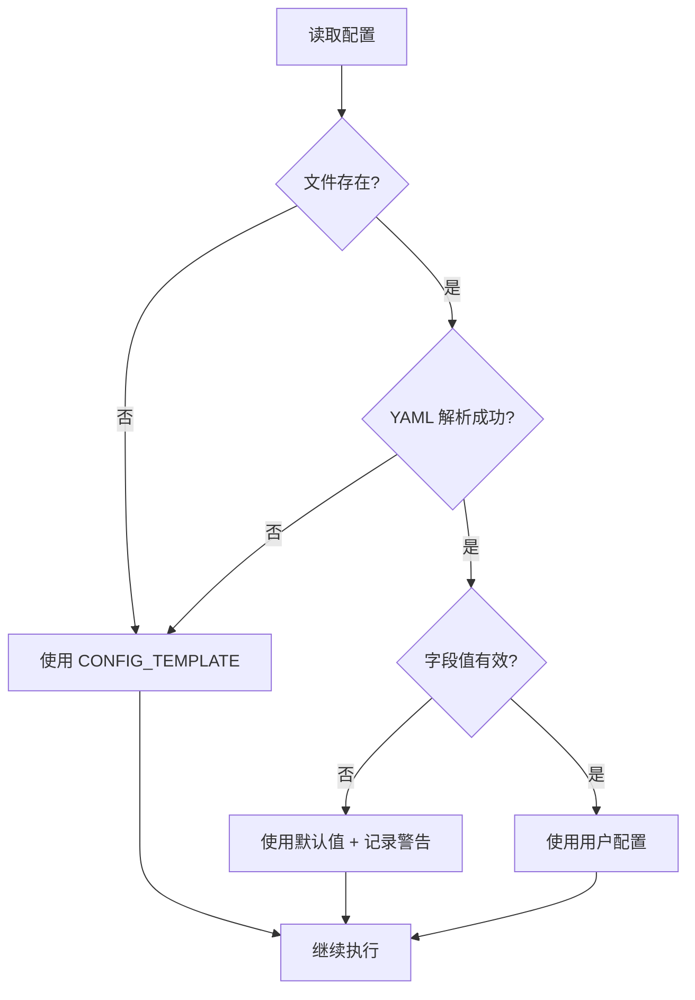
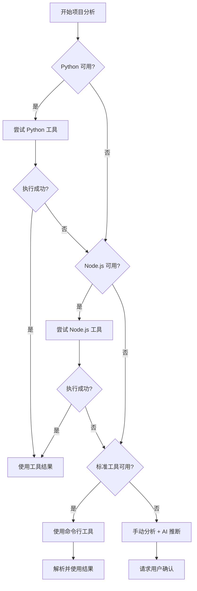

# 详细生成流程指南

> **用途**: 指导如何一步步生成 AI 辅助开发文档体系  
> **适用对象**: AI 和人类开发者  
> **版本**: v2.0 (V3.0 优化版)  
> **最后更新**: 2025-12-16

---

## 🎯 V3.0 核心增强：AI 互审与质量保证

### 三层验证机制

本框架采用三层验证机制,确保文档质量:

1. **第一层: AI 生成者** - 生成方案并自我检查
2. **第二层: AI 审查者** - 使用审查清单检查 + 评估置信度
3. **第三层: 人工审核** - 当置信度 < 80% 或发现 P0 问题时触发

### 审查置信度评估标准

AI 审查者在完成审查后,必须给出置信度评分:

| 置信度范围 | 评级         | 说明                       | 后续动作         |
| ---------- | ------------ | -------------------------- | ---------------- |
| 90-100%    | 非常确信     | 无重大问题,可直接提交      | 提交人工审核     |
| 80-89%     | 整体良好     | 有少量可优化点             | 提交人工审核     |
| 70-79%     | 可用但有问题 | 需关注的问题较多           | **必须人工审核** |
| < 70%      | 存在重大问题 | 发现严重问题或大量不确定性 | **必须人工审核** |

### AI 互审工作流集成点

在文档生成流程中,AI 互审机制在以下节点触发:

- **步骤 4 之后**: 生成分析方案后,执行 AI 互审
- **步骤 6 期间**: 生成子文档时,可选择性执行互审

**详细互审流程**: 参见 `workflows/review-workflow.md`

---

## 🔒 工作流强制性检查机制 (V3.0)

### 强制性级别定义

本框架对工作流中的每个步骤定义了强制性级别:

| 级别         | 标识            | 说明               | 跳过条件         |
| ------------ | --------------- | ------------------ | ---------------- |
| **绝对强制** | `[MUST]`        | 任何情况必须执行   | 不可跳过         |
| **条件强制** | `[MUST IF ...]` | 满足条件时必须执行 | 不满足条件可跳过 |
| **强烈推荐** | `[SHOULD]`      | 推荐执行但可调整   | 记录原因即可     |

### 跳过记录模板

当跳过某个 `[SHOULD]` 步骤时,必须在方案文档中记录:

```markdown
### [步骤名称] - 已跳过 ⚠️

**跳过原因**: [不适用/已完成/其他]
**详细说明**: 项目复杂度 2 星,不触发设计思维
**风险评估**: 低风险,项目简单
**缓解措施**: 人工快速审核
```

### 强制性标识使用示例

在后续的工作流步骤中,你会看到类似标识:

- `[MUST]` 步骤 1.1: 识别项目类型
- `[MUST IF 复杂度 ≥ 3 星]` 步骤 4.5: AI 互审
- `[SHOULD]` 步骤 3.4: 补充优化

---

## 🧠 设计思维引导 (V3.0) `[MUST IF 复杂度 ≥ 4 星]`

### 目的与价值

在生成方案前，引导 AI 进行深度设计思考，避免直接跳入代码实现。

**价值**:

- 避免过度工程化
- 充分探索替代方案
- 提前识别风险
- 降低返工率 50%

### 触发条件

| 复杂度级别          | 自动触发 | 说明                         |
| ------------------- | -------- | ---------------------------- |
| ⭐⭐⭐⭐ Complex    | 自动触发 | 大型项目建议执行             |
| ⭐⭐⭐⭐⭐ Critical | 强制执行 | 超大/关键项目必须执行        |
| ⭐⭐⭐ Medium       | 可选     | 可通过 `@think` 指令手动触发 |
| ⭐⭐ Simple         | 跳过     | 项目简单，不需要             |
| ⭐ Trivial          | 跳过     | 项目太简单                   |

**用户指令**:

- `@think` 或 `@think:standard` - 启动标准引导流程（5 步）
- `@think:quick` - 快速对齐（仅确认目标、方案、验收）
- `@think:skip` - 跳过引导，直接生成方案

### 5 步引导流程

#### Step 1: 问题本质（The "Why"）`[MUST IF 触发]`

**执行者角色**: 产品经理思维

**目标**: 通过 5 Why 分析挖掘业务价值

**关键问题**:

1. 为什么需要这个文档体系？
2. 解决什么核心问题？
3. 不做会有什么影响？
4. 业务价值是什么？
5. 如何衡量成功？

**输出**: 明确的业务目标和成功标准

---

#### Step 2: 方案探索（The "How"）`[MUST IF 触发]`

**执行者角色**: 架构分析师思维

**目标**: 提出 2-3 种可行方案并对比

**必须包含**:

| 方案   | 优点 | 缺点 | 适用场景 | 工作量 |
| ------ | ---- | ---- | -------- | ------ |
| 方案 A | ...  | ...  | ...      | ...    |
| 方案 B | ...  | ...  | ...      | ...    |
| 方案 C | ...  | ...  | ...      | ...    |

**对比维度**:

- 文档完整性
- 维护成本
- 学习曲线
- 适配性

**输出**: 推荐方案 + 理由

---

#### Step 3: 风险与测试（The "Risk"）`[MUST IF 触发]`

**执行者角色**: 架构分析师 + QA 思维

**目标**: 识别风险并制定应对策略

**风险类别**:

1. **技术风险**

   - 大文件处理
   - 复杂依赖关系
   - Token 限制

2. **数据风险**

   - 代码脱敏不完整
   - 统计数据不准确
   - 文件路径错误

3. **维护风险**
   - 文档与代码不同步
   - 更新触发不及时
   - 健康度下降

**输出**: 风险清单 + 缓解措施

---

#### Step 4: 反思与整合（Synthesis & Reflection）`[MUST IF 触发]`

**执行者角色**: 引导者思维

**目标**: 全局反思，识别冲突和知识空白

**检查项**:

- [ ] 方案之间是否有冲突？
- [ ] 是否有未考虑的边界情况？
- [ ] 是否需要更多信息？
- [ ] 风险应对是否充分？

**决策点**:

- 若发现知识空白 → 回溯到 Step 2 深化
- 若方案冲突 → 请用户裁决
- 若一切清晰 → 进入 Step 5

---

#### Step 5: 最终决策（Final Decision）`[MUST IF 触发]`

**执行者角色**: 决策者思维

**目标**: 输出结构化决策方案

**输出格式**:

```markdown
## 设计思维引导 - 最终决策

### 业务价值

[Step 1 的输出]

### 选定方案

**方案**: [选定的方案]
**理由**: [为什么选这个方案]

### 技术选型

- 模板级别: [Trivial/Simple/Medium/Complex/Critical]
- 子文档数量: [X 个]
- 预计工作量: [X 小时]

### 风险与应对

[Step 3 的风险清单]

### 验收标准

- [ ] [标准 1]
- [ ] [标准 2]
- [ ] [标准 3]

### 下一步行动

1. [行动 1]
2. [行动 2]
```

### 输出无缝衔接

设计思维引导的 Step 5 输出应直接作为**生成分析方案**（阶段 2）的高质量输入。

**流程示意**:

```
设计思维引导 → Step 5 输出决策方案
  ↓
生成分析方案 ← 基于决策方案生成 generation_plan.md
  ↓
AI 互审
  ↓
人工审核
```

---

## 🎭 AI 角色库使用规范 (V3.0)

### 角色定义

本框架定义了 4 个核心角色，每个角色有明确的职责：

| 角色           | 文件位置                               | 职责           | 使用阶段           |
| -------------- | -------------------------------------- | -------------- | ------------------ |
| **文档生成者** | `agents/runtime/document_generator.md` | 生成文档和方案 | 方案生成、文档生成 |
| **方案审查者** | `agents/runtime/plan_reviewer.md`      | 审查方案质量   | AI 互审            |
| **设计引导者** | `agents/runtime/design_facilitator.md` | 引导设计思维   | 设计思维引导       |
| **质量检查者** | `agents/runtime/quality_checker.md`    | 质量验证       | 最终验证           |

### 角色切换机制

**阶段性切换流程**:


**切换规则**:

1. **生成阶段**: 使用文档生成者角色
2. **审查阶段**: 切换到方案审查者角色
3. **优化阶段**: 切换回文档生成者角色
4. **验证阶段**: 使用质量检查者角色
5. **最多 2 轮审查**，之后必须人工介入

### 角色使用示例

**使用文档生成者角色**:

```markdown
> 使用角色: agents/runtime/document_generator.md
>
> 请按照文档生成者角色的要求，生成项目分析方案...
```

**切换到审查者角色**:

```markdown
> 切换到角色: agents/runtime/plan_reviewer.md
>
> 请以审查者的视角，审查刚才生成的方案...
```

### 为什么需要角色切换？

**价值**:

- 避免单一 AI 视角的盲点
- 提高问题发现率 30-50%
- 确保方案质量稳定性

**对比**:

- ❌ 单一角色: AI 生成 → 人工审核（盲点多）
- ✅ 角色切换: AI 生成 → AI 审查 → 人工审核（质量高）

---

## 🔍 阶段 1: 项目分析（1-2 小时）

### 步骤 1.1: 识别项目类型 `[MUST]`

**AI 指令模板**:

```
请分析当前项目并回答：
1. 项目类型：前端/后端/全栈？
2. 主要技术栈：框架、库、工具
3. 项目规模：文件数量、代码行数（估算）
4. 特殊架构：多租户、微服务、Monorepo等
```

**预期输出**:

```markdown
项目类型: Vue 3 前端项目
技术栈: Vue 3.4 + Vite 5 + Pinia + Element Plus
项目规模: ~420 个文件, ~45,000 行代码
特殊架构: 多品牌/多租户架构
```

---

### 步骤 1.2: 扫描目录结构

**AI 指令模板**:

```
请列出项目的核心目录结构（深度2级），
格式如下：
src/
├── api/          - 用途说明
├── views/        - 用途说明
├── components/   - 用途说明
└── ...
```

**预期输出**: 清晰的目录树 + 用途说明

---

### 步骤 1.3: 识别核心模块

**AI 指令模板**:

```
请识别项目的核心业务模块，格式：
| 模块名 | 目录位置 | 主要功能 |
```

**预期输出**:

| 模块名   | 目录位置             | 主要功能            |
| -------- | -------------------- | ------------------- |
| 用户管理 | `src/views/user/`    | 用户 CRUD、角色管理 |
| 项目管理 | `src/views/project/` | 项目创建、扫描配置  |

---

### 步骤 1.4: 提取核心代码模式

**AI 指令模板**:

```
请提取项目中的核心代码模式，包括：
1. API调用示例（找一个典型的API调用）
2. 组件开发模板（找一个典型组件）
3. 状态管理用法（如使用Pinia/Redux）
4. 路由定义示例
5. 常用工具函数
```

**预期输出**: 每种模式的实际代码示例

---

### 步骤 1.5: 识别架构特点

**AI 指令模板**:

```
请识别项目的架构特点，包括：
1. 状态管理方案
2. 路由管理方式
3. API层设计模式
4. 错误处理机制
5. 特殊配置系统（如多租户、主题等）
```

**输出**: 架构特点清单

---

### 步骤 1.6: 复杂度评估

**AI 指令模板**:

```
请基于以上分析,对项目复杂度进行评级:

1. 代码规模评估
   - 文件数量: [X个]
   - 代码行数: [X行]
   - 影响: 高/中/低

2. 架构复杂度评估
   - 识别的架构特点: [列出]
   - 模块数量: [X个]
   - 影响: 高/中/低

3. 依赖复杂度评估
   - 核心依赖数: [X个]
   - 特殊依赖: [列出]
   - 影响: 高/中/低

**综合复杂度**: ⭐⭐⭐⭐⭐ (1-5星)
**预计文档生成耗时**: [X-Y小时]
**主要风险点**: [列出]
```

**输出**: 复杂度评估报告

---

### 步骤 1.7: 制定交互策略

**AI 指令模板**:

```
基于项目复杂度,制定交互策略:

1. 阶段性确认点
   - 何时请求用户审查方案
   - 何时请求用户审查文档质量

2. 大文件处理策略
   - 是否存在超过800行的文件
   - 如何分段读取

3. 不确定信息处理
   - 列出当前无法确定的架构/业务问题
   - 标记需要用户确认的部分

4. 复杂模块处理
   - 是否需要绘制依赖关系图
   - 哪些模块需要用户提供业务背景
```

**输出**: 交互策略清单

---

## 📝 阶段 2: 文档生成（2-3 小时）

### 步骤 2.1: 生成主文档 `AI_Coding_Context.md` `[MUST]`

**AI 指令模板**:

```
基础之前的分析，请生成主文档 ai_coding_context.md（根目录），
包含以下章节（参考 ai_documentation_framework/README.md 规范）：

1. 文档定位说明
2. 项目概览
3. 关键目录速查
4. 场景快速导航
5. 文档索引（子文档列表）
6. 核心代码模式
7. 开发流程规范
8. 命名规范
9. 业务模块映射
10. AI编码禁忌
11. 常见任务速查

每个章节都提供具体内容，不要用占位符。
```

**质量检查**:

- [ ] 项目规模数据准确
- [ ] 技术栈完整
- [ ] 核心代码模式可复制使用
- [ ] 场景导航覆盖常见需求
- [ ] 长度适中（300-500 行）

---

### 步骤 2.2: 确定子文档清单(含优先级和示例需求)

#### 2.2.1 子文档清单规划

**AI 指令模板**:

```
请规划子文档清单,每个文档必须包含:
1. 文档名称
2. 优先级 (⭐⭐⭐ / ⭐⭐ / ⭐)
3. 具体内容描述(非仅标题)
4. 必须包含的示例数量与类型
5. 内容来源(具体文件/目录)
6. 预计行数

格式示例:
| 文档 | 优先级 | 内容描述 | 示例需求 | 内容来源 | 预计行数 |
```

**示例需求量化表**:

| 文档                  | 必须包含的示例数量与类型                                      |
| :-------------------- | :------------------------------------------------------------ |
| `api_layer.md`        | 至少 5 个常用 API 调用示例 + 错误处理示例 + 请求/响应数据结构 |
| `state_management.md` | 至少 3 个 store 使用示例(状态管理、异步操作、跨组件通信)      |
| `component_guide.md`  | 至少 5 个组件示例 + Props/Emits 定义 + 完整组件模板           |
| `routing_guide.md`    | 至少 3 个路由配置示例 + 路由守卫示例 + 动态路由示例           |

**上下文感知要求**:

在方案中必须引用具体的文件名和路径,证明已阅读代码,例如:

- ✅ 正确: "基于 `src/config/index.js` 详细分析"
- ❌ 错误: "分析配置文件"

#### 2.2.2 根据项目类型选择必需文档

**前端项目**:

- `architecture_overview.md` (必需)
- `api_layer.md` (必需)
- `state_management.md` (必需)
- `routing_guide.md` (推荐)
- `component_guide.md` (推荐)
- 其他可选...

3. `state_management.md` 或 `database_schema.md`

**第二批**（中优先级）:
根据项目特点选择 3-5 个

**第三批**（低优先级）:
可选的辅助文档

---

### 步骤 2.3: 创建 plans/ 目录

**AI 指令模板**:

```
请创建 dev_docs/plans/ 目录结构，包括：

1. plans/README.md（参考规范中的模板）
2. plans/features/ 子目录
3. plans/bugfixes/ 子目录

README.md 包含：
- 使用规范
- 方案文档模板
- 状态管理说明
```

---

### 步骤 2.4: 创建 knowledge/ 目录

**AI 指令模板**:

```
请创建 dev_docs/knowledge/ 目录结构，包括：

1. knowledge/README.md（参考规范中的模板）
2. knowledge/troubleshooting/ 子目录
3. knowledge/patterns/ 子目录
4. knowledge/performance/ 子目录

README.md 包含：
- 使用规范
- 知识文档模板
- 沉淀触发条件
- 分类索引
```

---

### 步骤 2.5: 创建 review/ 目录 ⭐ (V3.0) `[MUST]`

**目的**: 为项目建立系统化文档审核体系，生成项目专属的审核规程和原则文档，确保文档体系可以周期性被审核和维护。

**AI 指令模板**:

```
请创建 dev_docs/review/ 目录结构，包括：

1. dev_docs/review/sys_review_plan.md
   基于 templates/review/review_plan_TEMPLATE.md 生成，需根据项目实际情况微调：
   - 将所有 {PROJECT_NAME} 替换为实际项目名
   - 在 §2.1 的"目标文档分层"表中，填入项目实际的各层级文档（L1/L2/L3）
   - 在 §4.2 的"事件触发"表中，根据项目实际技术栈补充项目专属触发条件
     （例如：修改 docker-compose.yaml → 触发部署文档重审；修改 routers/ → 触发 API 文档重审）
   - 将 Prompt 模板中的 {PROJECT_NAME} 替换为实际项目名
   - 将 {GENERATION_DATE} 替换为今日日期

2. dev_docs/review/sys_review_principles.md
   基于 templates/review/review_principles_TEMPLATE.md 生成，需根据项目实际情况微调：
   - 将所有 {PROJECT_NAME} 替换为实际项目名
   - 在 §3.1 中将 {L1_DOCS}/{L2_DOCS}/{L3_DOCS} 替换为实际文档的具体占位说明
   - 将 {SRC_DIR} 替换为项目实际的源码目录（如 src/、Services/、app/ 等）
   - 将 {PASS_THRESHOLD} 替换为建议的验收通过率（通常为 "N-1/N" 格式，如 12/13）
   - 将 {GENERATION_DATE} 替换为今日日期

3. dev_docs/review/REVIEW_LOG.md
   初始化为空白总索引，Frontmatter 的 verified_at 设为今日日期

4. dev_docs/review/rounds/.gitkeep
   占位文件，确保 rounds/ 目录被 git 追踪
```

**微调原则**：
- 文档列表（L1/L2/L3）必须基于项目实际生成的子文档，不得使用占位符
- 事件触发表中的"修改的文件/目录"必须对应项目实际存在的路径
- Prompt 模板中项目名必须真实填写，使 AI 在执行审核时能准确理解上下文

**质量检查**:
- [ ] `sys_review_plan.md` 中不存在未替换的 `{变量}` 占位符
- [ ] `sys_review_principles.md` 中不存在未替换的 `{变量}` 占位符
- [ ] 文档分层表中 L1/L2/L3 文档与实际生成的子文档一一对应
- [ ] 事件触发表中引用的文件路径在项目中实际存在
- [ ] `REVIEW_LOG.md` 已初始化且格式正确

---

### 步骤 2.6: 为所有文档添加摘要 ⭐ (V3.0) `[MUST]`

**目的**: 为生成的所有文档添加标准化 YAML Frontmatter 摘要，支持快速判断相关性和自动更新检测

**AI 指令模板**:

```
请为刚生成的所有文档（主文档和子文档）添加 YAML Frontmatter 摘要。

参考格式规范: reference/SUMMARY_FORMAT_SPEC.md
参考示例: reference/examples/summary_examples/

每个文档开头添加以下格式的摘要：

---
title: [文档标题]
summary: [100-200字概述，说明核心内容]
keywords: [关键词1] | [关键词2] | [关键词3] ...
scope: [文档范围，如 "前端API层 (src/api/)"]
related_files: [文件路径1] | [文件路径2] | ...
dependencies: [依赖文档1] | [依赖文档2] | ...
verified_at: [YYYY-MM-DD]
---

**重要提示**：
1. related_files 必须列出文档中所有提及的源代码文件（不包含其他文档）
2. dependencies 列出相关的其他文档
3. 所有字段使用 `|` 分隔，必须单行格式
4. verified_at 使用当前日期（YYYY-MM-DD格式）
```

**related_files 提取规则**:

对于不同类型的文档：

1. **架构文档**: 包含架构示意图中的关键文件（入口文件、核心配置）

   - ✅ 包含: `src/main.ts | src/App.vue | src/router/index.ts`
   - ❌ 不包含: 所有页面组件和通用组件

2. **API 文档**: 包含核心文件 + 2-3 个示例文件

   - ✅ 包含: `src/api/http.ts | src/api/types.ts | src/api/user.ts`
   - ❌ 不包含: 所有 20+个业务 API 文件

3. **工作流文档**: 通常为 `无`

   - ✅ 例外: 如详细说明某个脚本，则包含该脚本文件

4. **工具文档**: 必须包含工具文件
   - ✅ 包含: `tools/py/analyzer.py | tools/js/analyzer.js`

**示例输出**（API 文档）:

```markdown
---
title: API 层设计规范
summary: 定义前端 API 调用的统一接口规范，包括请求封装、错误处理、拦截器配置和 TypeScript 类型定义
keywords: API | HTTP | Axios | 错误处理 | 拦截器 | TypeScript
scope: 前端 API 层 (src/api/)
related_files: src/api/http.ts | src/api/types.ts | src/api/interceptors.ts | src/api/user.ts
dependencies: dev_docs/state_management.md | dev_docs/authentication.md
verified_at: 2025-12-03
---

# API 层设计规范

（原有文档内容...)
```

**质量检查**:

生成摘要后，使用摘要验证工具检查：

```bash
# Python
python tools/py/summary_validator.py --file dev_docs/api_layer.md

# Node.js
node tools/js/summary_validator.js --file dev_docs/api_layer.md
```

验证内容：

- [ ] YAML 格式正确
- [ ] 所有 7 个字段都存在
- [ ] related_files 中的文件确实存在
- [ ] 字段使用 `|` 分隔且为单行格式
- [ ] keywords 包含 3-8 个关键词
- [ ] summary 长度适中（100-200 字）

**为什么重要**:

1. **节省 Token**: AI 读取摘要即可判断是否需要完整阅读，节省 60-70% Token
2. **自动检测更新**: 通过 related_files 字段，代码变更时自动检测需要更新的文档
3. **快速定位**: 通过 keywords 和 scope 快速查找相关文档
4. **追踪时效性**: verified_at 字段监控文档健康度

---

## ✅ 阶段 3: 验证优化（1 小时）

### 步骤 3.1: 文档完整性检查

**检查清单**:

主文档 (`AI_Coding_Context.md`):

- [ ] 所有必需章节都已包含
- [ ] 项目数据准确（文件数、代码量）
- [ ] 核心代码示例可复制使用
- [ ] 子文档链接都有效
- [ ] 场景导航覆盖 80%常见需求

子文档:

- [ ] 至少包含 3 个高优先级子文档
- [ ] 每个子文档内容完整
- [ ] 代码示例基于实际代码
- [ ] 文档之间无矛盾

目录结构:

- [ ] `plans/` 目录创建完成
- [ ] `knowledge/` 目录创建完成
- [ ] `review/` 目录创建完成（含 sys_review_plan.md、sys_review_principles.md、REVIEW_LOG.md、rounds/.gitkeep）
- [ ] README 文件齐全

---


### 步骤 3.2: AI 自测

**AI 指令模板**:

```
请模拟以下开发场景，测试能否从文档快速找到答案：

场景1: 我要新增一个业务模块，需要哪些步骤？
场景2: 我要调用一个API，标准代码怎么写？
场景3: 我要创建一个新组件，模板是什么？
场景4: 项目使用了什么状态管理方案？如何使用？
场景5: 有哪些编码禁忌需要注意？

对于每个场景，指出：
- 在哪个文档的哪个章节可以找到答案
- 需要多少步骤（点击/滚动）
```

**预期结果**: 每个场景都能在 3 步内找到答案

---

### 步骤 3.3: 人工审核优化

**人工检查重点**:

1. **准确性**

   - 项目数据是否准确
   - 代码示例是否正确
   - 技术栈描述是否完整

2. **完整性**

   - 是否遗漏重要模块
   - 是否遗漏关键代码模式
   - 是否遗漏重要注意事项

3. **可用性**

   - 代码示例能否直接使用
   - 文档链接是否有效
   - 章节组织是否合理

4. **项目特色**
   - 是否体现项目独特架构
   - 是否包含项目特定规范
   - 是否标注重要注意事项

---

### 步骤 3.4: 补充优化 `[SHOULD]`

**常见补充项**:

1. **代码示例完善**

   - 补充错误处理
   - 补充类型定义
   - 补充注释说明

2. **章节调整**

   - 合并重复内容
   - 拆分过长章节
   - 调整章节顺序

3. **特殊说明**
   - 标注项目特有配置
   - 标注版本兼容性
   - 标注已知问题

---

## 🎯 不同项目类型的生成策略

### Vue/React 前端项目

**重点关注**:

1. 组件开发规范
2. 状态管理使用
3. 路由配置
4. API 调用模式
5. UI 组件库使用

**特殊章节**:

- Element Plus/Ant Design 使用规范
- CSS 方案（Tailwind/UnoCSS）
- 表单验证

**子文档优先级**:

1. `api_layer.md`
2. `state_management.md`
3. `routing_guide.md`
4. `component_guide.md`

---

### Node.js/FastAPI 后端项目

**重点关注**:

1. API 设计规范
2. 数据库模型
3. 认证授权
4. 中间件使用
5. 错误处理

**特殊章节**:

- ORM 使用（Prisma/TypeORM/SQLAlchemy）
- 数据验证（Zod/Pydantic）
- 日志系统

**子文档优先级**:

1. `api_design.md`
2. `database_schema.md`
3. `authentication.md`
4. `middleware_guide.md`

---

### 全栈项目

**重点关注**:

1. 前后端通信规范
2. 数据流设计
3. 认证体系
4. 部署流程

**特殊章节**:

- Monorepo 管理（Turborepo/Nx）
- GraphQL Schema（如使用）
- WebSocket 通信

**子文档优先级**:

1. `architecture_overview.md`（需包含前后端）
2. `api_layer.md`（前端）
3. `api_design.md`（后端）
4. `database_schema.md`

---

## 📊 质量验证标准

### 主文档质量分数卡

| 评分项     | 权重 | 评分标准                         |
| ---------- | ---- | -------------------------------- |
| **完整性** | 30%  | 10 个必需章节都包含 = 满分       |
| **准确性** | 30%  | 数据/代码示例正确率 > 95% = 满分 |
| **实用性** | 25%  | 80%场景能快速定位 = 满分         |
| **可读性** | 15%  | 结构清晰、示例完整 = 满分        |

**合格线**: 总分 ≥ 80 分

---

### 子文档质量检查

每个子文档需满足：

- [ ] 标题清晰
- [ ] 包含 TOC（如超过 200 行）
- [ ] 代码示例完整可运行
- [ ] 至少 3 个实际示例
- [ ] 包含最佳实践章节
- [ ] 包含常见问题 FAQ

---

## 🔧 常见问题解决

### Q1: 项目代码量太大，分析耗时长？

**解决方案**:

1. 优先分析核心目录（src/、lib/等）
2. 忽略第三方代码（node_modules/、vendor/）
3. 采用抽样分析（每个模块抽取代表性文件）
4. 使用代码统计工具加速（cloc、tokei）

---

### Q2: 项目缺少明确规范，如何提取？

**解决方案**:

1. 从实际代码中推断规范
2. 找出多数代码遵循的模式
3. 标注"推荐做法"而非"强制规范"
4. 在文档中说明"基于现有代码提取"

---

### Q3: 子文档太多，如何取舍？

**解决方案**:

1. 优先生成 3 个高优先级文档
2. 其他文档可先创建标题和 TOC
3. 在主文档的"文档索引"中标注完成度
4. 迭代补充，而非一次性完成

---

### Q4: 代码示例如何选择？

**选择标准**:

1. **典型性** - 代表通用模式
2. **完整性** - 可直接复制使用
3. **简洁性** - 去除无关细节
4. **正确性** - 经过验证

**避免**:

- 过于复杂的示例
- 包含业务逻辑的示例
- 过时的代码模式

---

## 🎯 快速开始（命令模板）

### 完整生成流程（复制粘贴）

```
# 阶段1: 项目分析
请分析当前项目：
1. 项目类型和技术栈
2. 核心目录结构（2级）
3. 业务模块清单
4. 核心代码模式（API/组件/状态管理）
5. 架构特点

# 阶段2: 生成主文档
基于分析结果，生成 dev_docs/AI_Coding_Context.md
参考 ai_documentation_framework/README.md 规范
包含所有必需章节，长度300-500行

# 阶段3: 生成子文档（分批）
## 第一批（高优先级）
生成 dev_docs/architecture_overview.md
生成 dev_docs/api_layer.md
生成 dev_docs/state_management.md

## 第二批（根据需要选择）
...

# 阶段4: 创建目录结构
创建 dev_docs/plans/ 目录（含README和子目录）
创建 dev_docs/knowledge/ 目录（含README和子目录）
创建 dev_docs/review/ 目录（含 sys_review_plan.md、sys_review_principles.md、REVIEW_LOG.md、rounds/.gitkeep）

# 阶段5: 质量检查
进行AI自测（5个场景）
生成质量检查报告
```

---

## 📚 参考资源

- [文档体系规范](./README.md)
- [结构规范](./STRUCTURE_SPEC.md)
- [文档模板](./templates/)

---

## 🎉 生成完成后

1. **提交代码**

   ```bash
   git add dev_docs/
   git commit -m "docs: 添加AI编程上下文文档"
   ```

2. **团队分享**

   - 在团队会议上介绍文档结构
   - 说明如何使用和维护

3. **持续维护**
   - 代码变更时同步更新文档
   - 定期审查文档质量
   - 积极沉淀知识到 knowledge/

---

## 💎 V3 最佳实践参考 (Best Practices from V3)

本章节收录了从生产级项目实践中总结的优秀模式,建议在生成文档时参考:

### 1. 大文件处理模式

**场景**: 遇到超过 800 行的文件

**最佳实践**:

1. 先使用 `view_file_outline` 了解结构
2. 根据 outline 结果决定需要详细读取的部分
3. 分段读取时优先读取关键函数和配置部分
4. 不要试图一次性读取整个文件

### 2. 模块依赖关系可视化

**场景**: 识别到复杂的模块间依赖关系

**最佳实践**:

1. 先绘制模块依赖关系图(使用 mermaid)
2. 在图中标注数据流方向
3. 识别核心模块和边缘模块
4. 提供中间产出物供用户审查

**示例图表**:


### 3. 配置系统流程图

**场景**: 项目包含复杂配置系统(如多品牌/多租户)

**最佳实践**:

1. 使用 mermaid 绘制配置覆盖流程图
2. 明确标注每个配置层级
3. 提供完整的配置示例
4. 说明新增配置的 step-by-step 流程

### 4. 代码示例来源标注

**场景**: 在文档中提供代码示例

**最佳实践**:

```markdown
### API 调用示例

**文件位置**: `src/api/user.ts:15-28`

\`\`\`typescript
// 实际代码粘贴在此
\`\`\`

**说明**: 此示例展示了标准的 API 调用模式...
```

### 5. 产出物明确列表

**场景**: 每个阶段执行完毕

**最佳实践**:

- 阶段一产出物: `project_analysis_data.json`
- 阶段二产出物: `AI_Coding_Context.md`
- 阶段三产出物: 核心子文档(3 个)
- 阶段四产出物: `plans/` 和 `knowledge/` 目录结构

### 6. 执行日志记录

**场景**: 长时间执行任务

**最佳实践**:
在 `dev_docs/_analysis/generation_progress.md` 中记录:

- 每个阶段的开始和完成时间
- 发现的关键架构特点
- 遇到的问题和解决方法
- 下一步计划

### 7. 质量检查维度

**场景**: 完成文档生成后

**最佳实践 - 四个维度验证**:

1. **准确性**: 所有代码示例可运行/路径可追溯
2. **完整性**: 主文档包含所有子文档链接,核心模块有完整流程图
3. **可用性**: 新 AI 能在 5 分钟内定位信息
4. **一致性**: 文档格式统一,链接有效

### 8. 价值量化评估

**场景**: 项目完成后

**最佳实践**:
在总结中量化文档价值:

- 知识传承效率提升: XX%
- 开发效率预期提升: XX%
- 新 AI Agent 上手时间: X-Y 天
- 文档覆盖率: XX%

---

## 🎨 模板智能选择机制 (V3.0)

### 模板分级标准

框架提供 5 个分级模板,根据项目复杂度自动选择:

| 复杂度等级          | 判断标准   | 文件数   | 代码行数 | 模块数 | 依赖数 |
| ------------------- | ---------- | -------- | -------- | ------ | ------ |
| ⭐ Trivial          | 单文件脚本 | < 10     | < 500    | 1      | < 5    |
| ⭐⭐ Simple         | 小型项目   | 10-100   | 500-5k   | 2-3    | 5-15   |
| ⭐⭐⭐ Medium       | 中型项目   | 100-500  | 5k-50k   | 4-10   | 15-40  |
| ⭐⭐⭐⭐ Complex    | 大型项目   | 500-2000 | 50k-200k | 10-30  | 40-100 |
| ⭐⭐⭐⭐⭐ Critical | 超大/关键  | > 2000   | > 200k   | > 30   | > 100  |

### 各模板包含的章节对比

| 章节         | Trivial | Simple | Medium | Complex | Critical |
| ------------ | ------- | ------ | ------ | ------- | -------- |
| 项目基础分析 | ✅      | ✅     | ✅     | ✅      | ✅       |
| 代码模式提取 | ❌      | ✅     | ✅     | ✅      | ✅       |
| 子文档规划   | ❌      | 简化   | ✅     | ✅      | ✅       |
| AI 互审      | ❌      | ❌     | ✅     | ✅      | ✅       |
| 设计思维引导 | ❌      | ❌     | ❌     | ✅      | ✅       |
| 维护规划     | 简化    | ✅     | ✅     | ✅      | ✅       |
| 批次规划     | ❌      | ❌     | ❌     | ✅      | ✅       |
| 填写指南     | ✅      | ✅     | ✅     | ✅      | ✅       |

### 智能选择算法

```python
def select_template(project_stats):
    """
    根据项目统计数据选择合适的模板

    Args:
        project_stats: 包含 file_count, code_lines, module_count, dependency_count

    Returns:
        模板名称: trivial/simple/medium/complex/critical
    """
    score = 0
    score += min(project_stats.file_count / 100, 5)
    score += min(project_stats.code_lines / 20000, 5)
    score += min(project_stats.module_count / 5, 5)
    score += min(project_stats.dependency_count / 20, 5)

    if score < 4: return "trivial"
    elif score < 8: return "simple"
    elif score < 12: return "medium"
    elif score < 16: return "complex"
    else: return "critical"
```

### 模板使用流程

1. **自动评估**: 在步骤 1.6 完成复杂度评估后,自动计算模板选择分数
2. **模板推荐**: 向用户展示推荐的模板级别和理由
3. **人工确认**: 用户可以接受推荐或手动选择其他模板
4. **加载模板**: 使用对应的模板文件 `templates/generation_plan_{level}.md`

**模板文件位置**:

- `templates/generation_plan_trivial.md`
- `templates/generation_plan_simple.md`
- `templates/generation_plan_medium.md`
- `templates/generation_plan_complex.md`
- `templates/generation_plan_critical.md`

---

## 🔄 持续维护规划 (V3.0)

### 维护触发条件定义

| 优先级 | 触发条件                                   | 示例                 | 响应时间 |
| ------ | ------------------------------------------ | -------------------- | -------- |
| **P0** | 核心架构变更、主框架大版本升级、错误率>30% | REST→tRPC, Next14→15 | 立即     |
| **P1** | 新增核心模块、代码变更>30%、错误率 15-30%  | 新增支付模块         | 2 周内   |
| **P2** | 新增辅助功能、代码变更 10-30%、距上次>3 月 | 工具函数优化         | 1 月内   |

### 健康度检查流程

**检查频率**: 每季度

**检查内容**:

1. 代码示例有效性 - 所有代码示例是否仍可运行
2. 文件路径准确性 - 引用的文件路径是否仍然存在
3. 依赖版本 - 依赖库版本是否已更新
4. 架构图准确性 - 架构图是否反映当前状态

**检查工具**: 使用 `tools/py/doc_health_checker.py` 或 `tools/js/doc_health_checker.js`

### 维护工作流

详细的维护工作流请参见: `workflows/maintenance_workflow.md`

**维护流程概览**:

1. 触发检测 - 自动或手动触发
2. 影响评估 - 评估需要更新的文档范围
3. 生成更新方案 - 创建更新计划
4. 执行更新 - 按方案更新文档
5. 验证测试 - 确保更新正确
6. 记录归档 - 记录更新历史

---

## ⚙️ 配置管理系统 + 降级策略 (V3.0)

### 配置读取失败降级策略

本框架提供完善的配置降级机制，确保即使配置出错也能正常运行：

| 场景               | 问题                  | 降级策略                | 使用值               |
| ------------------ | --------------------- | ----------------------- | -------------------- |
| **配置文件不存在** | `user_config.md` 缺失 | 使用模板默认配置        | `CONFIG_TEMPLATE.md` |
| **YAML 格式错误**  | Frontmatter 解析失败  | 使用模板默认配置 + 警告 | `CONFIG_TEMPLATE.md` |
| **字段值无效**     | 值不在允许范围内      | 使用该字段的默认值      | 见下表               |
| **必需字段缺失**   | 缺少必需配置项        | 补充默认值              | 见下表               |

### 默认配置值

| 配置项                  | 默认值  | 说明             | 有效值                    |
| ----------------------- | ------- | ---------------- | ------------------------- |
| `documentLanguage`      | `zh-CN` | 文档语言         | `zh-CN`, `en-US`, `ja-JP` |
| `enableMutualReview`    | `true`  | 启用 AI 互审     | `true`, `false`           |
| `detailLevel`           | `high`  | 文档详细程度     | `low`, `medium`, `high`   |
| `enforceDesignThinking` | `auto`  | 设计思维引导     | `auto`, `always`, `never` |
| `enableADR`             | `false` | 启用架构决策记录 | `true`, `false`           |
| `verboseMode`           | `false` | 详细输出模式     | `true`, `false`           |

### 降级处理流程



### 配置验证规则

**documentLanguage 验证**:

```python
valid_languages = ['zh-CN', 'en-US', 'ja-JP']
if config.documentLanguage not in valid_languages:
    警告("语言配置无效，使用默认值 zh-CN")
    config.documentLanguage = 'zh-CN'
```

**detailLevel 验证**:

```python
valid_levels = ['low', 'medium', 'high']
if config.detailLevel not in valid_levels:
    警告("详细程度配置无效，使用默认值 high")
    config.detailLevel = 'high'
```

### 错误信息示例

**配置文件缺失**:

```
⚠️ 警告: 未找到用户配置文件
位置: config/user_config.md
降级: 使用 CONFIG_TEMPLATE.md 默认配置
建议: 运行配置引导或手动创建配置文件
```

**YAML 解析失败**:

```
⚠️ 警告: 配置文件 YAML 解析失败
文件: config/user_config.md
错误: Invalid YAML syntax at line 5
降级: 使用 CONFIG_TEMPLATE.md 默认配置
建议: 检查 YAML 格式，参考模板文件
```

**字段值无效**:

```
⚠️ 警告: 配置项 'documentLanguage' 值 'fr-FR' 无效
有效值: zh-CN, en-US, ja-JP
降级: 使用默认值 'zh-CN'
建议: 修改配置文件中的语言设置
```

---

## 🛠️ 工具使用 + 降级决策 (V3.0)

### 工具降级决策表

框架提供多层次的工具降级机制，确保分析工作始终可以进行：

| 场景                   | 问题                    | 降级策略              | 质量影响 | 示例                       |
| ---------------------- | ----------------------- | --------------------- | -------- | -------------------------- |
| **框架工具完全不可用** | Python/Node.js 环境缺失 | 降级到基础命令        | 低       | 使用 `find`, `wc` 等       |
| **框架工具部分失败**   | 工具执行成功率 < 80%    | 混合使用（工具+命令） | 中       | 成功的用工具，失败的用命令 |
| **基础命令不可用**     | 操作系统不支持命令      | 手动分析 + AI 推断    | 高       | 要求用户提供数据           |
| **所有工具都不可用**   | 极端受限环境            | 纯 AI 推断 + 人工确认 | 很高     | 基于文件列表推断           |

### 工具优先级

**第 1 优先级: 框架工具**（推荐）

```bash
# Python 版本 - 自适应输出（推荐）
python tools/py/project_scanner.py . --exclude-standard

# Node.js 版本 - 自适应输出
node tools/js/project_scanner.js . --exclude-standard

# 摘要模式（大型项目推荐，更快更省Token）
python tools/py/project_scanner.py --mode summary --exclude-standard
```

**优点**: 结构化输出、统一格式、功能完整  
**缺点**: 需要运行环境

---

**第 2 优先级: 标准化命令行工具**

```bash
# 文件统计
find . -type f | wc -l
fd -t f | wc -l

# 代码统计
cloc --json .
tokei --output json
```

**优点**: 广泛支持、性能好  
**缺点**: 输出格式需要解析

---

**第 3 优先级: 基础系统命令**

```bash
# Unix/Linux/Mac
find . -name "*.js" | wc -l
tree -L 2

# Windows PowerShell
Get-ChildItem -Recurse -File | Measure-Object | Select-Object Count
```

**优点**: 几乎总是可用  
**缺点**: 功能有限、跨平台差异大

---

**第 4 优先级: 手动分析**

- AI 请求用户提供项目统计
- 基于文件列表进行推断
- 采样分析代表性文件

**优点**: 总是可行  
**缺点**: 精度低、依赖人工

### 降级决策流程



### 工具失败处理

**工具执行失败时的标准处理**:

```markdown
⚠️ 工具执行失败

**失败工具**: Python project_scanner.py
**错误信息**: ModuleNotFoundError: No module named 'gitignore_parser'
**降级策略**: 尝试使用 Node.js 版本工具

**降级执行**: node tools/js/project_scanner.js
**降级结果**: 成功 ✅

**质量影响**: 无影响，两个工具功能相同
```

**所有工具都失败时**:

```markdown
⚠️ 自动化工具不可用

**已尝试**:

- Python 工具: 环境不可用
- Node.js 工具: 环境不可用
- 命令行工具: 部分命令不支持

**降级到手动分析**:

请提供以下信息以继续生成文档:

1. 项目文件总数（大约）
2. 代码行数（可以不精确）
3. 主要使用的编程语言
4. 核心依赖库列表

我将基于您提供的信息进行分析。
```

### 质量保证

**无论使用哪种工具，都必须**:

1. **数据验证**: 检查结果的合理性
2. **记录来源**: 标注数据来自哪个工具
3. **提供命令**: 允许用户验证
4. **降级说明**: 如果降级，说明原因和影响

**示例**:

```markdown
## 项目规模统计

**统计工具**: 降级使用 - 基础命令（框架工具不可用）
**统计命令**: `find . -type f -name "*.ts" | wc -l`
**统计时间**: 2025-12-18

总文件数: 约 420 个
TypeScript 文件: 380 个
配置文件: 40 个

⚠️ 注意: 使用基础命令统计，精度可能略低
建议: 安装 Python 环境后使用框架工具获得更精确结果
```

---

**开始生成你的项目文档吧！** 🚀
