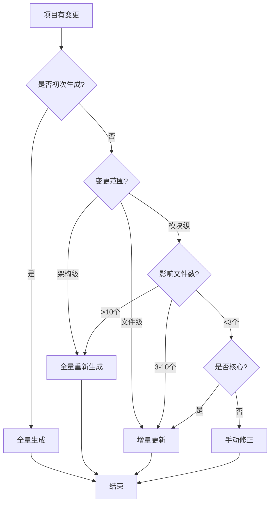

# 增量更新流程

> **版本**: v3.0
> **创建日期**: 2025-11-28
> **最后更新**: 2026-04-13
> **用途**: 指导如何对已生成的文档体系进行增量更新

---

## 📋 概述

增量更新是指在已有文档体系的基础上，针对项目变更更新部分文档，而不是完全重新生成。

**适用场景**:

- 项目代码有局部变更
- 新增单个模块或功能
- 技术栈小幅升级
- 修正文档中的错误

**不适用场景**:

- 架构重构
- 技术栈重大变更（如 Vue 2 → Vue 3）
- 初次生成文档

---

## 🔀 增量更新 vs 全量重新生成

### 选择决策表

| 变更类型      | 影响范围    | 推荐方式     | 理由         |
| ------------- | ----------- | ------------ | ------------ |
| 新增单个模块  | 1-3 个文件  | 增量更新     | 快速、精准   |
| 修改 API 设计 | 5-10 个文件 | 增量更新     | 可控、高效   |
| 技术债务修复  | 分散        | 增量更新     | 避免重复工作 |
| 框架升级      | 全局        | 全量重新生成 | 确保一致性   |
| 架构重构      | 全局        | 全量重新生成 | 避免遗漏     |
| 文档错误修正  | 局部        | 手动修正     | 最快         |

### 决策流程图



---

## ✅ 增量更新检测清单

在决定增量更新前，检查以下事项：

### 文档状态检查

- [ ] `dev_docs/` 目录已存在
- [ ] `dev_docs/AI_Coding_Context.md` 已生成
- [ ] `dev_docs/_analysis/generation_plan.md` 可找到
- [ ] 上次生成时间 < 6 个月（避免文档过时）

### 变更范围评估

- [ ] 明确知道哪些模块/文件发生了变化
- [ ] 变更不涉及架构级别
- [ ] 变更不涉及技术栈切换
- [ ] 影响的文档数量 < 10 个

### 增量更新可行性

- [ ] 有原始的 generation_plan 可参考
- [ ] AI 能理解现有文档结构
- [ ] 有足够信息描述变更内容

如果以上检查有 **≥3 项未通过**，建议全量重新生成。

---

## 📝 增量更新详细步骤

### 步骤 1: 分析变更内容

**目的**: 明确需要更新什么

**操作**:

```markdown
1. 列出变更清单

   - 新增的文件/模块
   - 修改的文件/功能
   - 删除的文件/模块

2. 确定影响范围

   - 哪些子文档需要更新？
   - 主文档是否需要更新？
   - 是否需要更新示例代码？

3. 评估更新优先级
   - P0: 必须更新（核心功能变更）
   - P1: 建议更新（重要功能变更）
   - P2: 可选更新（次要变更）
```

**示例**: 新增支付模块

```markdown
变更清单:

- 新增: src/modules/payment/
  - models.py (支付模型)
  - services.py (支付服务)
  - api.py (支付 API)

影响范围:

- dev_docs/AI_Coding_Context.md (主文档 - 需要添加支付模块说明)
- dev_docs/api_design.md (API 文档 - 需要添加支付 API)
- dev_docs/database_schema.md (数据库 - 需要添加支付表)

优先级:

- P0: API 文档、数据库文档
- P1: 主文档
- P2: 测试文档
```

---

### 步骤 1.5: 自动检测受影响文档 ⭐ (V3.0)

**目的**: 使用文档摘要机制自动识别哪些文档需要更新

**前提**: 文档已包含 YAML Frontmatter 摘要（`related_files` 字段）

**操作步骤**:

1. **获取代码变更列表**

使用 Git 差异分析工具：

```bash
# 获取最近7天的代码变更
python tools/py/git_diff_analyzer.py --since "7 days ago"
```

输出示例：

```json
{
  "changed_files": [
    "src/api/user.ts",
    "src/api/post.ts",
    "src/store/userStore.ts"
  ],
  "change_types": {
    "src/api/user.ts": "modified",
    "src/api/post.ts": "added",
    "src/store/userStore.ts": "modified"
  }
}
```

2. **检测受影响的文档**

使用摘要关联检查工具：

```bash
# 方式1: 管道模式（推荐）
python tools/py/git_diff_analyzer.py --since "7 days ago" | \
python tools/py/summary_related_checker.py --from-stdin

# 方式2: 手动指定变更文件
python tools/py/summary_related_checker.py --changed-files "src/api/user.ts,src/api/post.ts"
```

输出示例：

```json
{
  "affected_documents": [
    {
      "file": "dev_docs/api_layer.md",
      "related_changes": ["src/api/user.ts"],
      "priority": "P0",
      "reason": "related_files 包含 src/api/user.ts"
    },
    {
      "file": "dev_docs/state_management.md",
      "related_changes": ["src/store/userStore.ts"],
      "priority": "P1",
      "reason": "related_files 包含 src/store/userStore.ts"
    }
  ],
  "update_suggestions": [
    {
      "document": "dev_docs/api_layer.md",
      "action": "更新用户API章节，检查`src/api/user.ts`的变更内容"
    },
    {
      "document": "dev_docs/state_management.md",
      "action": "更新用户状态管理示例"
    }
  ]
}
```

3. **验证检测结果**

```markdown
- [ ] 检查是否有遗漏的文档（工具无法检测到的）
- [ ] 确认优先级判断是否合理
- [ ] 检查是否有误报（不需要更新的文档）
```

**优势**:

- ✅ **自动化**: 无需人工逐个分析文档
- ✅ **准确**: 基于明确的文件路径关联
- ✅ **节省时间**: 从 30 分钟分析降低到 1 分钟

**注意事项**:

- 如果文档没有摘要，工具无法检测到关联
- 如果文档的 `related_files` 不准确，可能漏检或误报
- 建议结合人工判断进行最终确认

---

### 步骤 2: 准备更新方案

**目的**: 让 AI 理解需要如何更新

**操作**:

创建 `dev_docs/_analysis/incremental_update_plan.md`:

````markdown
# 增量更新方案

## 变更概述

[简要描述本次变更]

## 需要更新的文档

### 1. dev_docs/AI_Coding_Context.md

**更新位置**: "核心模块"章节
**更新内容**: 添加支付模块说明
**依据**: src/modules/payment/

### 2. dev_docs/api_design.md

**更新位置**: "API 端点列表"章节
**更新内容**: 添加支付相关 API
**依据**: src/modules/payment/api.py

### 3. dev_docs/database_schema.md

**更新位置**: "数据表"章节
**更新内容**: 添加 Payment 和 PaymentLog 表
**依据**: src/modules/payment/models.py

## 验证命令

```bash
# 验证支付模块代码存在
ls -la src/modules/payment/

# 验证数据库迁移
python manage.py showmigrations payment
```
````

## 更新检查清单

- [ ] 所有新增内容有代码依据
- [ ] API 示例完整可用
- [ ] 数据库 schema 准确
- [ ] 与现有文档风格一致

````

---

### 步骤 3: 执行增量更新

**方式 A: 让AI执行（推荐）** ⭐⭐⭐

**发送给AI**:

```markdown
请根据 dev_docs/_analysis/incremental_update_plan.md 执行增量更新

具体要求:
1. 只更新方案中列出的文档和章节
2. 保持与现有文档的风格一致
3. 所有新增内容必须有实际代码依据
4. 更新后在文档顶部添加更新记录

请开始执行。
````

**AI 会**:

- 读取更新方案
- 逐个更新指定文档的指定章节
- 保持文档格式一致
- 添加更新记录

**方式 B: 手动更新** ⭐⭐

**操作步骤**:

1. 打开需要更新的文档
2. 定位到需要更新的章节
3. 根据代码变更，手动添加/修改内容
4. 保持格式一致
5. 添加更新记录

**示例** - 更新 `api_design.md`:

````markdown
# 在"API 端点列表"章节添加:

### 支付相关 API (新增 2025-11-28)

#### 创建支付订单

```http
POST /api/v1/payments
Content-Type: application/json

{
  "amount": 10000,  // 100.00元（分为单位）
  "method": "alipay",
  "description": "订单支付"
}
```
````

**响应**:

```json
{
  "payment_id": "pay_123456789",
  "status": "pending",
  "created_at": "2025-11-28T10:00:00Z"
}
```

````

---

### 步骤 4: 验证更新有效性

**检查项**:

1. **内容准确性**
   ```markdown
   - [ ] 新增内容与实际代码一致
   - [ ] API示例可正常调用
   - [ ] 数据库schema准确
   - [ ] 配置说明正确
````

2. **格式一致性**

   ```markdown
   - [ ] 标题层级正确
   - [ ] 代码块有语言标注
   - [ ] 表格格式规范
   - [ ] 与现有章节风格一致
   ```

3. **完整性**

   ```markdown
   - [ ] 所有计划更新的文档都已更新
   - [ ] 相互引用的地方都已同步
   - [ ] 示例代码完整可用
   ```

4. **更新记录**
   ```markdown
   - [ ] 文档顶部有更新记录
   - [ ] 记录包含更新日期和内容
   - [ ] 更新原因清楚
   ```

**验证示例**:

```markdown
# 检查主文档是否已更新

grep -n "支付模块" dev_docs/AI_Coding_Context.md

# 检查 API 文档

grep -n "POST /api/v1/payments" dev_docs/api_design.md

# 检查数据库文档

grep -n "Payment" dev_docs/database_schema.md
```

---

### 步骤 4.5: 更新文档摘要 ⭐ (V3.0)

**目的**: 更新文档摘要中的 `verified_at` 字段和 `related_files` 字段（如有必要）

**操作步骤**:

1. **更新 verified_at 字段**

所有被更新的文档，都必须更新 `verified_at` 为当前日期：

```yaml
---
title: API 层设计规范
summary: ...
keywords: ...
scope: ...
related_files: ...
dependencies: ...
verified_at: 2025-12-03 # ← 更新为当前日期
---
```

2. **更新 related_files 字段（如有必要）**

如果文档新增了对代码文件的引用，需要更新 `related_files`：

**示例** - 在 `api_layer.md` 中新增了支付 API 示例：

```yaml
# 修改前
related_files: src/api/http.ts | src/api/types.ts | src/api/user.ts

# 修改后（新增了 src/api/payment.ts）
related_files: src/api/http.ts | src/api/types.ts | src/api/user.ts | src/api/payment.ts
```

3. **验证摘要格式**

使用摘要验证工具检查：

```bash
# 验证所有被更新的文档
python tools/py/summary_validator.py --file dev_docs/api_layer.md
python tools/py/summary_validator.py --file dev_docs/database_schema.md
```

确认：

- [ ] YAML 格式正确
- [ ] verified_at 已更新为当前日期
- [ ] related_files 包含所有提及的代码文件
- [ ] 字段格式为单行 `|` 分隔

**为什么重要**:

- **时效性追踪**: `verified_at` 字段用于监控文档健康度（超过 90 天触发告警）
- **准确的关联**: 更新 `related_files` 确保下次代码变更时能准确检测到需要更新的文档

**快速检查**:

```bash
# 检查所有文档的 verified_at 是否过期
python tools/py/summary_validator.py --batch-mode --dir dev_docs/ | \
grep "过期"
```

### 步骤 4.6: 知识库维护与同步 ⭐ (V3.0) `[MUST IF 已配置知识库]`

**目的**: 确保共享知识库是最新的，并同步到受影响的文档中。

**操作步骤**:

1. **更新共享知识库**
   ```bash
   python tools/py/knowledge_cli.py update-shared
   ```

2. **重新解析文档引用**
   对所有更新过的文档运行匹配器，以应用知识库中的最新内容：
   ```bash
   python tools/py/knowledge_matcher.py --file [file_path] --inplace
   ```

---

### 步骤 5: 更新进度跟踪

**更新 `dev_docs/_analysis/generation_progress.md`**:

```markdown
## 📝 最近更新

### 2025-11-28 - 增量更新（支付模块）

**变更内容**:

- 新增支付模块相关内容

**更新的文档**:

- ✅ AI_Coding_Context.md - 添加支付模块说明
- ✅ api_design.md - 添加支付 API
- ✅ database_schema.md - 添加支付表

**验证状态**: ✅ 已验证

**更新人**: [你的名字]
```

---

## 🎯 常见增量更新场景

### 场景 1: 新增功能模块

**示例**: 新增用户积分系统

**步骤**:

1. 分析新增代码（models, services, api）
2. 确定影响文档（主文档、API 文档、数据库文档）
3. 准备更新方案
4. 执行更新
5. 验证有效性

**更新文档**:

- `AI_Coding_Context.md` - 添加积分系统模块
- `api_design.md` - 添加积分相关 API
- `database_schema.md` - 添加 PointLog 表
- `business_logic.md` - 添加积分规则说明

---

### 场景 2: API 变更

**示例**: 用户 API 从 v1 升级到 v2

**步骤**:

1. 对比 v1 和 v2 的差异
2. 更新 API 文档
3. 更新 API 调用示例
4. 标注 v1 为废弃

**更新文档**:

- `api_design.md` - 更新用户 API 章节
- `AI_Coding_Context.md` - 更新 API 版本说明
- `migration_guide.md` - 添加 v1 到 v2 迁移指南

**示例更新**:

````markdown
### 获取用户信息

#### v1 API [已废弃 2025-11-28]

```http
GET /api/v1/users/:id
```
````

**⚠️ 此版本将在 2026-01-01 后停止支持，请迁移到 v2**

#### v2 API [推荐]

```http
GET /api/v2/users/:id
```

**改进**:

- 返回更详细的用户信息
- 支持字段选择 (`?fields=id,name,email`)
- 性能优化

````

---

### 场景 3: 数据库Schema变更

**示例**: User表添加新字段 `avatar_url`

**步骤**:
1. 检查迁移文件
2. 更新数据库文档
3. 更新相关API文档（如果API也返回该字段）
4. 更新使用示例

**更新文档**:
- `database_schema.md` - 更新User表定义
- `api_design.md` - 更新用户API响应示例（如有）

**示例更新**:

```markdown
# database_schema.md

### User表 (更新 2025-11-28)

| 字段 | 类型 | 说明 | 新增 |
|------|------|------|------|
| id | UUID | 用户ID | |
| name | String | 用户名 | |
| email | String | 邮箱 | |
| avatar_url | String | 头像URL | ✅ v2.3 | ⭐

**迁移说明**:
- 迁移文件: `migrations/0008_add_avatar_url.py`
- 默认值: `null`（允许为空）
````

---

### 场景 4: 技术债务修复

**示例**: 重构错误处理机制

**步骤**:

1. 描述新的错误处理方式
2. 更新错误处理文档
3. 更新代码示例
4. 添加迁移建议

**更新文档**:

- `error_handling.md` - 完全重写或大幅更新
- `AI_Coding_Context.md` - 更新错误处理章节
- `best_practices.md` - 更新最佳实践

---

### 场景 5: 文档谬误修复

**示例**: 修复文档中的 API 函数名错误

**步骤**:

1. 验证谬误的真实性
2. 分析影响范围（关联文档检测）
3. 生成修复方案
4. 执行批量修复
5. 验证修复结果

**工具链**:

```bash
# 1. 验证谬误
python tools/py/file_reader.py --file "dev_docs/api_layer.md" --limit 20

# 2. 检测关联文档
python tools/py/doc_dependency_tracer.py --doc "dev_docs/api_layer.md" --strategy all

# 3. 生成修复方案
python tools/py/batch_fix_manager.py --generate --pattern "getUserInfo" --replacement "fetchUserProfile"

# 4. 执行修复
python tools/py/batch_fix_manager.py --execute --plan "dev_docs/_analysis/doc_fix_plan_20260413.md" --auto

# 5. 验证修复
python tools/py/file_reader.py --file "dev_docs/api_layer.md" --offset 42 --limit 10
```

**更新文档**:

- 所有受影响的关联文档都会被自动修复

---

### 场景 6: 依赖包升级

**示例**: FastAPI 0.95 → 0.104

**步骤**:

1. 检查破坏性变更
2. 更新安装文档
3. 更新受影响的代码示例
4. 添加升级注意事项

**更新文档**:

- `installation.md` - 更新依赖版本
- `AI_Coding_Context.md` - 更新框架版本
- `api_design.md` - 更新 API 装饰器用法（如有变化）

---

## 🚫 增量更新注意事项

### 禁止事项

1. **❌ 不要臆测变更内容**

   - 必须基于实际代码
   - 不确定的标注为"需确认"

2. **❌ 不要破坏现有结构**

   - 保持文档原有章节结构
   - 保持格式风格一致

3. **❌ 不要遗漏相互引用**

   - 更新 A 文档时，检查是否有 B 文档引用 A
   - 确保引用同步更新

4. **❌ 不要忘记更新记录**
   - 每次更新都要记录
   - 说明更新原因和内容

### 必须事项

1. **✅ 必须有代码依据**

   - 所有新增内容都引用实际文件
   - 提供文件路径和行号

2. **✅ 必须保持一致性**

   - 术语使用一致
   - 格式风格一致
   - 章节结构一致

3. **✅ 必须验证准确性**

   - API 示例实际可用
   - 代码示例可运行
   - 配置说明正确

4. **✅ 必须更新索引**
   - 更新主文档的模块列表
   - 更新相关章节的内部链接

---

## 📊 增量更新 vs 全量生成对比

| 维度           | 增量更新         | 全量重新生成   |
| -------------- | ---------------- | -------------- |
| **耗时**       | 30 分钟 - 2 小时 | 2-8 小时       |
| **准确性**     | 高（针对性强）   | 高（全面检测） |
| **风险**       | 低（局部影响）   | 中（可能遗漏） |
| **适用场景**   | 局部变更         | 架构级变更     |
| **成本**       | 低               | 高             |
| **一致性保证** | 手动保证         | 自动保证       |

**建议**: 大部分情况下优先使用增量更新，每 3-6 个月进行一次全量重新生成以确保一致性。

---

## 🔗 相关文档

- [AI_ENTRY_POINT.md](../AI_ENTRY_POINT.md) - 了解完整生成流程
- [core/update_triggers.md](../core/update_triggers.md) - 何时需要更新文档
- [guides/ai_rules_maintenance.md](./ai_rules_maintenance.md) - AI Rules 维护指南
- [workflows/generation_workflow.md](../workflows/generation_workflow.md) - 完整生成流程

---

## 💡 快速参考

### 增量更新决策

```
变更 < 3个文件 → 手动修正
变更 3-10个文件 → 增量更新
变更 > 10个文件 → 全量重新生成
架构级变更 → 全量重新生成
```

### 增量更新命令模板

```markdown
请对以下文档进行增量更新：

**文档**: dev_docs/[文档名].md
**章节**: "[章节名]"
**变更**: [描述变更内容]
**代码依据**: [文件路径]

要求:

1. 只更新指定章节
2. 保持现有格式
3. 所有内容基于实际代码
4. 添加更新记录
```

---

**版本**: v2.3  
**最后更新**: 2025-11-28  
**路径**: `workflows/incremental_update_workflow.md`
