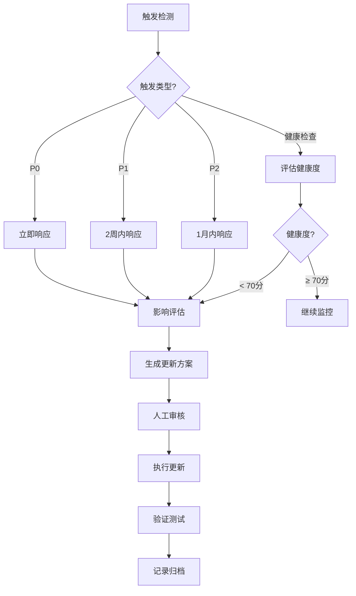

# 文档维护工作流

> **用途**: 指导如何持续维护 AI 辅助开发文档体系  
> **适用对象**: AI 和人类开发者  
> **版本**: v1.0 (V3.0)  
> **最后更新**: 2025-12-16

---

## 📋 维护概述

### 为什么需要维护？

文档与代码不同步是最常见的问题:

- **代码演进**: 架构变更、技术栈升级、新功能添加
- **文档腐化**: 过时的代码示例、错误的文件路径、失效的架构图
- **知识流失**: 新的最佳实践未记录、已解决的问题未沉淀

### 维护原则

1. **主动触发** - 不等文档完全过时才更新
2. **分级响应** - 根据变更重要性确定更新优先级
3. **增量更新** - 只更新变更部分,不重新生成全部
4. **质量保证** - 更新后进行健康度检查

---

## 🎯 维护触发条件

### P0 优先级（立即响应）

**触发条件**:

- 核心架构变更（如 REST → tRPC、Monolith → Microservices）
- 主框架大版本升级（如 Next.js 14 → 15、Vue 2 → 3）
- 文档错误率 > 30%（代码示例失效、路径错误等）
- 核心 API 重大变更

**响应时间**: 立即（1-2 天内）

**更新范围**:

- 主文档 `AI_Coding_Context.md`
- 受影响的所有子文档
- 架构图和流程图
- AI_RULES.md

**示例**:

```markdown
触发事件: Next.js 14 → 15 升级
影响范围:

- 路由系统完全重构（App Router）
- 数据获取方式变更
- 中间件 API 变更

必须更新:

- dev_docs/architecture_overview.md
- dev_docs/routing_guide.md
- dev_docs/api_layer.md
- AI_Coding_Context.md（核心代码模式章节）
```

---

### P1 优先级（2 周内响应）

**触发条件**:

- 新增核心业务模块
- 代码变更 > 30%
- 文档错误率 15-30%
- 新增重要依赖库

**响应时间**: 2 周内

**更新范围**:

- 新增对应的子文档
- 更新主文档的模块索引
- 更新相关架构图

**示例**:

```markdown
触发事件: 新增支付模块
影响范围:

- 新增 payment/ 目录
- 新增支付相关 API
- 新增支付状态管理

需要创建:

- dev_docs/payment_module.md（新建）

需要更新:

- dev_docs/architecture_overview.md（增加支付模块）
- dev_docs/state_management.md（增加支付状态）
- AI_Coding_Context.md（更新模块列表）
```

---

### P2 优先级（1 月内响应）

**触发条件**:

- 新增辅助功能
- 代码变更 10-30%
- 距上次更新 > 3 个月
- 性能优化、代码重构

**响应时间**: 1 个月内

**更新范围**:

- 受影响的子文档
- 可选更新主文档

**示例**:

```markdown
触发事件: 工具函数库重构
影响范围:

- utils/ 目录结构调整
- 部分工具函数签名变更

需要更新:

- dev_docs/utils_guide.md（如存在）
- AI_Coding_Context.md（核心代码模式，可选）
```

---

## 🏥 健康度检查

### 检查频率

| 检查类型     | 频率   | 触发方式 |
| ------------ | ------ | -------- |
| **快速检查** | 每月   | 自动     |
| **标准检查** | 每季度 | 自动     |
| **深度检查** | 每半年 | 手动     |

### 检查维度

#### 1. 代码示例有效性

**检查内容**:

- [ ] 所有代码示例是否仍可运行
- [ ] 代码示例是否使用最新 API
- [ ] 代码示例是否符合当前最佳实践

**检查方法**:

```bash
# 使用健康检查工具
python tools/py/doc_health_checker.py --check-code-samples

# 或 Node.js 版本
node tools/js/doc_health_checker.js --check-code-samples
```

**评分标准**:

- 90-100%: 健康
- 70-89%: 需要关注
- < 70%: 需要立即更新

---

#### 2. 文件路径准确性

**检查内容**:

- [ ] 引用的文件路径是否仍然存在
- [ ] 文件是否移动到新位置
- [ ] 目录结构是否发生变化

**检查方法**:

```bash
# 验证所有文件路径
python tools/py/doc_health_checker.py --check-file-paths
```

**自动修复**:

- 如果文件移动,自动更新路径
- 如果文件删除,标记为需要人工审查

---

#### 3. 依赖版本

**检查内容**:

- [ ] package.json 中的依赖版本是否已更新
- [ ] 文档中提到的版本号是否过时
- [ ] 是否有重大版本升级

**检查方法**:

```bash
# 检查依赖版本差异
python tools/py/doc_health_checker.py --check-dependencies
```

---

#### 4. 架构图准确性

**检查内容**:

- [ ] Mermaid 图表是否反映当前架构
- [ ] 模块依赖关系是否正确
- [ ] 数据流是否准确

**检查方法**: 人工审查（暂无自动化工具）

---

### 健康度评分

**综合评分公式**:

```
健康度 = (代码示例有效性 × 0.4) +
         (文件路径准确性 × 0.3) +
         (依赖版本 × 0.2) +
         (架构图准确性 × 0.1)
```

**评级**:

- 90-100 分: ✅ 优秀 - 无需更新
- 70-89 分: ⚠️ 良好 - 建议更新
- 50-69 分: ⚠️ 一般 - 需要更新
- < 50 分: ❌ 较差 - 立即更新

---

## 🔄 维护流程

### 流程概览



---

### 步骤 1: 触发检测

**自动触发**:

- Git Hook: 检测大规模代码变更
- 定时任务: 每月/每季度健康检查
- CI/CD: 主分支合并后检查

**手动触发**:

- 开发者发现文档过时
- 用户反馈文档错误
- 重大架构变更前

---

### 步骤 2: 影响评估

**评估内容**:

1. **变更范围**: 哪些代码发生了变化
2. **文档影响**: 哪些文档需要更新
3. **优先级**: P0/P1/P2
4. **工作量**: 预计更新耗时

**输出**: 影响评估报告

```markdown
## 影响评估报告

**变更事件**: Next.js 14 → 15 升级
**触发时间**: 2025-12-16
**优先级**: P0

### 变更范围

- 路由系统: App Router 完全重构
- 数据获取: getServerSideProps → Server Components
- 中间件: API 变更

### 受影响文档

1. dev_docs/architecture_overview.md - 架构图需要重绘
2. dev_docs/routing_guide.md - 完全重写
3. dev_docs/api_layer.md - 数据获取章节重写
4. AI_Coding_Context.md - 核心代码模式更新

### 工作量评估

- 预计耗时: 6-8 小时
- 建议分批: 2 批
- 响应时间: 立即（2 天内完成）
```

---

### 步骤 3: 生成更新方案

**使用模板**: `templates/UPDATE_PLAN_TEMPLATE.md`

**方案内容**:

1. 更新目标
2. 更新范围
3. 更新策略（全量 vs 增量）
4. 更新步骤
5. 验证标准

**示例**:

```markdown
## 更新方案

### 更新目标

将文档体系从 Next.js 14 迁移到 Next.js 15

### 更新策略

- routing_guide.md: 全量重写
- architecture_overview.md: 增量更新（仅架构图）
- api_layer.md: 增量更新（数据获取章节）

### 更新步骤

1. 重写 routing_guide.md（使用 App Router）
2. 更新 architecture_overview.md 架构图
3. 更新 api_layer.md 数据获取章节
4. 更新 AI_Coding_Context.md 核心代码模式
5. 验证所有代码示例

### 验证标准

- [ ] 所有代码示例可运行
- [ ] 架构图反映新架构
- [ ] 文档间无矛盾
```

---

### 步骤 4: 执行更新

**执行原则**:

1. **先高优先级** - P0 文档优先更新
2. **先核心后边缘** - 主文档 → 子文档 → 可选文档
3. **增量为主** - 尽量避免全量重写
4. **保留历史** - 使用 Git 版本控制

**执行方式**:

- 小规模更新: AI 直接执行
- 大规模更新: 分批执行,每批人工审核

---

### 步骤 5: 验证测试

**验证清单**:

- [ ] 代码示例已测试
- [ ] 文件路径已验证
- [ ] 架构图已审查
- [ ] 文档间链接有效
- [ ] YAML Frontmatter 已更新（verified_at 字段）

**测试方法**:

```bash
# 运行健康检查
python tools/py/doc_health_checker.py --full-check

# 验证摘要格式
python tools/py/summary_validator.py --dir dev_docs/
```

---

### 步骤 6: 记录归档

**记录内容**:

1. 更新日期
2. 更新原因
3. 更新范围
4. 遇到的问题
5. 解决方案

**记录位置**: `dev_docs/_analysis/update_history.md`

**示例**:

```markdown
## 2025-12-16 - Next.js 15 升级

**触发原因**: 主框架大版本升级（P0）
**更新范围**:

- routing_guide.md（全量重写）
- architecture_overview.md（架构图更新）
- api_layer.md（数据获取章节）
- AI_Coding_Context.md（核心代码模式）

**遇到的问题**:

- App Router 与旧路由系统差异巨大
- Server Components 概念需要详细说明

**解决方案**:

- 创建迁移对比表
- 增加 Server Components 专门章节

**耗时**: 7 小时
**验证结果**: 健康度 95 分
```

---

## 🛠️ 维护工具

### 健康检查工具

**Python 版本**:

```bash
# 快速检查
python tools/py/doc_health_checker.py --mode quick

# 标准检查
python tools/py/doc_health_checker.py --mode standard

# 深度检查
python tools/py/doc_health_checker.py --mode deep
```

**Node.js 版本**:

```bash
# 快速检查
node tools/js/doc_health_checker.js --mode quick
```

---

### 摘要验证工具

```bash
# 验证单个文件
python tools/py/summary_validator.py --file dev_docs/api_layer.md

# 验证整个目录
python tools/py/summary_validator.py --dir dev_docs/
```

---

### 变更检测工具

```bash
# 检测代码变更
python tools/py/change_detector.py --since "2025-11-01"

# 输出受影响的文档列表
python tools/py/change_detector.py --since "2025-11-01" --output-docs
```

---

## 📊 维护最佳实践

### 1. 定期检查

**推荐频率**:

- 小型项目: 每季度
- 中型项目: 每月
- 大型项目: 每 2 周

### 2. 主动更新

**不要等到**:

- 文档完全过时
- 用户大量反馈
- 新人完全看不懂

**应该在**:

- 重大变更后立即更新
- 定期健康检查发现问题
- 新功能开发完成后

### 3. 增量优先

**优先使用增量更新**:

- 更新速度快
- 风险低
- 易于审查

**全量重写仅用于**:

- 架构完全重构
- 技术栈完全更换
- 文档质量极差

### 4. 版本控制

**使用 Git 管理**:

- 每次更新创建 commit
- 重大更新创建 tag
- 使用分支进行大规模更新

### 5. 知识沉淀

**将维护经验沉淀到 knowledge/**:

- 常见问题 → `knowledge/troubleshooting/`
- 最佳实践 → `knowledge/patterns/`
- 迁移经验 → `knowledge/migrations/`

---

## 🎯 维护检查清单

### 月度检查清单

- [ ] 运行快速健康检查
- [ ] 检查是否有 P1/P2 触发条件
- [ ] 审查 update_history.md
- [ ] 检查 knowledge/ 是否有新内容需要添加

### 季度检查清单

- [ ] 运行标准健康检查
- [ ] 审查所有子文档的 verified_at 字段
- [ ] 检查依赖版本是否需要更新
- [ ] 审查架构图是否准确
- [ ] 更新主文档的统计数据（文件数、代码量）

### 半年检查清单

- [ ] 运行深度健康检查
- [ ] 全面审查文档质量
- [ ] 评估是否需要重构文档结构
- [ ] 收集团队反馈
- [ ] 规划下半年优化方向

---

## 📚 相关文档

- [增量更新工作流](./incremental_update_workflow.md)
- [文档健康度检查](./document_health_check.md)
- [更新触发机制](../core/update_triggers.md)
- [生成工作流](./generation_workflow.md)

---

**保持文档与代码同步，让 AI 辅助开发更高效！** 🚀
