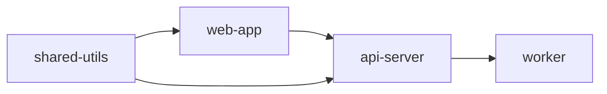

# Monorepo 项目处理流程

> **上级文档**: [AI_ENTRY_POINT.md](../AI_ENTRY_POINT.md)  
> **版本**: v2.3  
> **创建日期**: 2025-11-28  
> **用途**: Monorepo 项目的详细处理流程

---

## 📋 概述

本文档详细说明如何处理 Monorepo（单仓多包）架构的项目文档生成。

**适用场景**: 项目采用 Monorepo 架构，包含多个子项目

**检测特征**:

- 存在 workspace 配置文件（`pnpm-workspace.yaml` / `lerna.json`）
- `package.json`中有`workspaces`字段
- 多个`packages/` 或 `apps/`目录

---

## 🎯 两种处理策略

### 策略 1: 全局文档（推荐）⭐⭐⭐

**适用场景**: 所有子项目使用相同或相似技术栈

**生成结构**:

```
dev_docs/
├── AI_Coding_Context.md  # 总览文档
│   ├── Monorepo整体架构
│   ├── 各子项目职责
│   └── 子项目间依赖关系
├── packages/
│   ├── package-a/
│   │   └── README.md  # 子项目简介
│   └── package-b/
│       └── README.md
└── knowledge/  # 共享知识库
```

**输出示例**:

```markdown
✅ 检测到 Monorepo 结构（pnpm workspace）
📦 子项目清单:

- packages/web-app (Vue 3 前端)
- packages/mobile-app (React Native)
- packages/shared-utils (共享工具)

策略选择: 全局文档策略
理由: 所有子项目共享相同的开发规范
```

---

### 策略 2: 独立文档

**适用场景**: 子项目技术栈差异大

**生成结构**:

```
packages/
├── web-app/
│   └── dev_docs/  # 独立文档体系
│       ├── AI_Coding_Context.md
│       └── ...
├── api-server/
│   └── dev_docs/  # 独立文档体系
│       ├── AI_Coding_Context.md
│       └── ...
└── worker/
    └── dev_docs/  # 独立文档体系
        ├── AI_Coding_Context.md
        └── ...
```

**输出示例**:

```markdown
✅ 检测到 Monorepo 结构
📦 子项目技术栈差异:

- web-app: Vue 3 + TypeScript
- api-server: Node.js + Express
- worker: Python + Celery

策略选择: 独立文档策略
理由: 技术栈差异大，分开生成更合适
```

---

## 📝 策略 2 详细执行步骤

当用户选择策略 2（独立文档）时，按以下步骤执行：

### 步骤 1: 检测子项目清单

**跨平台检测命令**:

```bash
# Linux/Mac
find packages -maxdepth 1 -type d -not -name packages

# Windows PowerShell
Get-ChildItem packages -Directory | Select-Object Name
```

**检测每个子项目的技术栈**:

```bash
# 检查配置文件
ls packages/*/package.json      # Node.js项目
ls packages/*/requirements.txt  # Python项目
ls packages/*/go.mod           # Go项目
ls packages/*/Cargo.toml       # Rust项目
```

**输出子项目信息**:

```markdown
✅ 检测到以下子项目:

1. packages/web-app (Vue 3 + TypeScript)

   - 代码量: 8,500 行
   - 配置: package.json, vite.config.ts

2. packages/api-server (Node.js + Express)

   - 代码量: 12,000 行
   - 配置: package.json, tsconfig.json

3. packages/worker (Python + Celery)
   - 代码量: 5,000 行
   - 配置: requirements.txt, setup.py
```

---

### 步骤 2: 用户确认范围

**询问用户**:

```markdown
请选择需要生成文档的子项目:
[ ] 全部
[ ] 仅 web-app
[ ] 仅 api-server
[ ] 仅 worker
[ ] 自定义组合: [请指定，例如: web-app,api-server]
```

**用户响应示例**:

- "全部" → 为所有 3 个子项目生成
- "仅 web-app" → 只为 web-app 生成
- "web-app,api-server" → 为这 2 个子项目生成

---

### 步骤 3: 逐个子项目生成

对每个选中的子项目，执行以下操作：

#### a) 切换到子项目目录

```bash
cd packages/web-app
```

#### b) 执行完整生成流程

**对该子项目独立执行**:

1. **项目检测**: 仅针对该子项目的代码
2. **策略决策**: 独立评估该子项目的规模
3. **生成方案**: `dev_docs/_analysis/generation_plan.md`
4. **生成文档**: `dev_docs/AI_Coding_Context.md` 等

**注意事项**:

- ✅ 统计代码时只统计该子项目目录
- ✅ 文档规模按子项目实际规模决定
- ✅ 不包含其他子项目的代码

#### c) 保持独立进度记录

每个子项目都有自己的进度文件:

```
packages/web-app/dev_docs/_analysis/generation_progress.md
packages/api-server/dev_docs/_analysis/generation_progress.md
packages/worker/dev_docs/_analysis/generation_progress.md
```

---

### 步骤 4: 生成根目录 README

在根目录创建索引文档: `dev_docs/README.md`

**模板内容**:

````markdown
# Monorepo 文档索引

> **项目架构**: Monorepo（单仓多包）  
> **子项目数**: [N]个  
> **文档生成日期**: [日期]

---

## 📦 项目结构

本项目采用 Monorepo 架构，包含以下子项目:

### 🌐 packages/web-app

- **技术栈**: Vue 3 + TypeScript
- **用途**: 前端应用
- **代码规模**: 8,500 行
- **文档**: [查看文档](../packages/web-app/dev_docs/AI_Coding_Context.md)

### 🔧 packages/api-server

- **技术栈**: Node.js + Express
- **用途**: 后端 API 服务
- **代码规模**: 12,000 行
- **文档**: [查看文档](../packages/api-server/dev_docs/AI_Coding_Context.md)

### ⚙️ packages/worker

- **技术栈**: Python + Celery
- **用途**: 异步任务处理
- **代码规模**: 5,000 行
- **文档**: [查看文档](../packages/worker/dev_docs/AI_Coding_Context.md)

---

## 🏗️ 整体架构

[此处 AI 应该根据子项目分析添加整体架构说明]

**关键点**:

- Monorepo 管理工具: [pnpm workspace / Lerna / Nx / Turborepo]
- 各子项目独立部署或联合部署
- 共享依赖和工具配置

---

## 🔗 子项目依赖关系


````

**说明**: [描述依赖关系]

---

## 🚀 快速开始

### 查看子项目文档

- [web-app 开发指南](../packages/web-app/dev_docs/AI_Coding_Context.md)
- [api-server 开发指南](../packages/api-server/dev_docs/AI_Coding_Context.md)
- [worker 开发指南](../packages/worker/dev_docs/AI_Coding_Context.md)

### 统一命令

如果项目使用 Turborepo 或 Nx 等工具:

```bash
# 运行所有子项目
pnpm run dev

# 构建所有子项目
pnpm run build

# 运行特定子项目
pnpm --filter web-app dev
```

---

## 📚 共享知识库

如有跨子项目的共享知识，参见各子项目的`knowledge/`目录。

---

**最后更新**: [日期]  
**文档维护**: 各子项目独立维护各自的 dev_docs/

````

---

### 步骤5: 完成汇总

**生成完成后输出**:

```markdown
✅ Monorepo 独立文档生成完成!

📊 生成统计:
- 总子项目数: 3个
- 已生成文档: 3个
- 根目录README: ✅

📁 文档位置:
- packages/web-app/dev_docs/
  └── AI_Coding_Context.md (主文档)
- packages/api-server/dev_docs/
  └── AI_Coding_Context.md (主文档)
- packages/worker/dev_docs/
  └── AI_Coding_Context.md (主文档)
- dev_docs/README.md (索引文档)

💡 使用提示:
1. 每个子项目都有独立完整的文档体系
2. 根目录的README.md提供了整体索引
3. 建议在IDE中为每个子项目配置独立的AI Rules
4. 各子项目可以独立维护和更新文档

📋 下一步:
- 查看根目录README.md了解整体架构
- 根据需要查看各子项目的详细文档
- 考虑为Monorepo创建共享的知识库
````

---

## 🔍 用户选择交互

当检测到 Monorepo 时，AI 应该询问用户选择策略:

```markdown
检测到 Monorepo 项目结构，包含以下子项目：

1. packages/web (Vue 3)
2. packages/api (Node.js)
3. packages/shared (TypeScript 工具库)

请选择文档生成策略：

A. 生成全局文档（推荐，适合技术栈统一）

- 一个主文档包含所有子项目
- 共享知识库
- 适合: 所有子项目使用相同技术栈

B. 为每个子项目生成独立文档

- 每个子项目有完整的 dev_docs/
- 独立的 AI_Coding_Context.md
- 根目录生成索引 README
- 适合: 技术栈差异大

C. 仅为特定子项目生成（部分生成）

- 手动选择需要生成的子项目
- 可多选，例如: C-web,api (生成 web 和 api)
- 根目录生成包含选中项目的 README
- 适合: 只关注部分子项目

请回复 A / B / C-[项目名,项目名] (例如: C-web,api)
```

---

## ⚠️ 注意事项

### 必须做的 ✅

1. **独立统计每个子项目**

   - 不要混合统计多个子项目
   - 每个子项目的文档规模应该基于其实际代码量

2. **保持进度记录独立**

   - 每个子项目有自己的 generation_progress.md
   - 可以并行生成多个子项目

3. **生成根目录索引**

   - 策略 2 必须创建 dev_docs/README.md
   - 提供清晰的子项目导航

4. **检测子项目依赖关系**
   - 分析 package.json 的 dependencies
   - 在 README 中用 Mermaid 图展示

### 禁止做的 ❌

1. **❌ 不要为 Monorepo 生成一个超大的主文档**

   - 策略 2 应该是多个独立文档，不是一个包含所有子项目的巨型文档

2. **❌ 不要混淆子项目的代码统计**

   - 每个子项目的代码量应该独立准确

3. **❌ 不要忽略根目录 README**
   - 策略 2 场景必须提供索引文档

---

## 🔗 相关文档

- [AI_ENTRY_POINT.md](../AI_ENTRY_POINT.md#场景-2-monorepo-项目) - Monorepo 场景概览
- [decision_workflow.md](./decision_workflow.md#复杂度检测) - Monorepo 复杂度检测
- [detection_workflow.md](./detection_workflow.md) - 项目检测流程

---

**版本**: v2.3  
**路径**: `workflows/monorepo_workflow.md`
