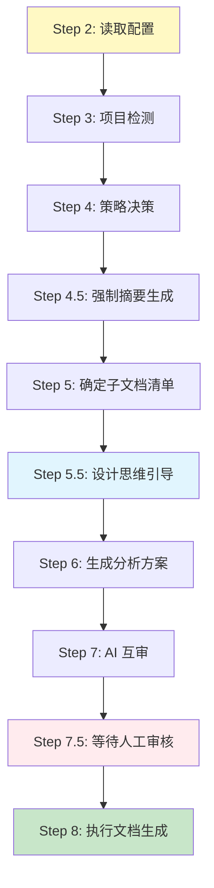

# 路径 A: 首次生成流程

> **触发条件**: `dev_docs/` 目录不存在  
> **执行时机**: Step 1 路由决策后  
> **前置步骤**: Step 0 (环境预检) 已完成  
> **更新日期**: 2025-12-19

---

## 📋 流程概览



---

## Step 2: 读取配置（简化版）

> 🎯 **执行时机**: 确认进入首次生成流程后  
> 📁 **配置位置**: `config/` 目录

### 执行逻辑

1. 尝试读取 `config/user_config.md`
2. 如果存在且格式正确 → 使用用户配置
3. 如果不存在或格式错误 → 使用默认配置（`config/CONFIG_TEMPLATE.md`）
4. 继续执行，不打断用户

### 首次使用提示（非阻塞）

```markdown
ℹ️ 提示：未检测到个人配置文件

当前使用默认配置：

- 文档语言: 中文 (zh-CN)
- AI 互审: 启用
- 详细模式: 关闭
- 其他配置: 使用默认值

如需自定义配置，请参考：config/CONFIG_TEMPLATE.md
或回复 "配置向导" 进入交互式配置
```

### 配置向导（可选，用户主动触发）

```markdown
用户回复 "配置向导" 后，AI 执行：

📋 配置向导

1. **文档语言** (documentLanguage)
   A. 中文 (zh-CN) [默认]
   B. 英文 (en-US)
   C. 日语 (ja-JP)
   请选择: A / B / C

2. **AI 互审** (enableMutualReview)
   是否启用方案互审？
   A. 启用 [默认] - 提高方案质量，但增加耗时
   B. 禁用 - 快速生成，适合简单项目
   请选择: A / B

3. **详细模式** (verboseMode)
   是否输出详细日志？
   A. 启用 - 查看详细执行过程
   B. 禁用 [默认] - 仅输出关键信息
   请选择: A / B

4. 其他配置项使用默认值，可稍后在 config/user_config.md 中修改

配置完成后，将创建 config/user_config.md 文件。
```

### 配置影响表

| 配置项                   | 影响模块     | 说明                     |
| ------------------------ | ------------ | ------------------------ |
| `documentLanguage`       | 文档生成     | 所有生成文档的语言       |
| `enableMutualReview`     | AI 互审流程  | 是否启用方案互审         |
| `dangerousCommandGuard`  | 命令执行保护 | 危险命令拦截级别         |
| `enforceDesignThinking`  | 方案生成     | 是否强制深度设计思考     |
| `enableADR`              | ADR 生成     | 是否记录架构决策         |
| `aiCapabilityTier`       | 任务复杂度   | 根据 AI 能力调整任务粒度 |
| `preferredRoles`         | 角色选择     | 优先使用的 AI 角色       |
| `verboseMode`            | 输出详细度   | 控制日志和说明的详细程度 |
| `defaultHealthCheckMode` | 文档健康检查 | 默认的健康检查深度       |

### 配置降级策略

**YAML 格式错误**:

```
警告: config/user_config.md YAML frontmatter 解析失败
原因: [错误详情]
降级: 使用 config/CONFIG_TEMPLATE.md 默认配置
建议: 请检查 user_config.md 文件的 YAML 格式
```

**字段值无效**:

```
警告: 配置项 'documentLanguage' 值 'xxx' 无效
降级: 使用默认值 'zh-CN'
建议: 请参考 config/CONFIG_TEMPLATE.md 查看有效值
```

### 配置系统文档

完整配置说明请参阅:

- [config/README.md](../config/README.md) - 配置系统使用指南
- [config/CONFIG_TEMPLATE.md](../config/CONFIG_TEMPLATE.md) - 所有配置项详细说明

---

## Step 3: 项目检测（自动）

> 🎯 **目的**: 获取项目的结构化数据  
> 🛠️ **工具**: `project_scanner.py` / `project_scanner.js`

### ⚠️ 框架边界检查（必需步骤）

> **在执行项目扫描前，必须先确定框架位置并在扫描命令中排除！**

#### 1. 确定框架位置

```bash
# Windows PowerShell
Test-Path ai_coding_context/AI_ENTRY_POINT.md

# Linux/Mac
test -f ai_coding_context/AI_ENTRY_POINT.md && echo "框架位于: ai_coding_context/" || echo "未检测到标准位置"
```

**识别标志**：包含 `AI_ENTRY_POINT.md` 的目录即为框架根目录

**常见位置**：

- `ai_coding_context/`（最常见）
- `.ai/`（点开头目录）
- `docs/ai_context/`（文档子目录）
- 用户自定义的其他位置

#### 2. 在扫描命令中添加排除参数

**推荐方式（使用 --exclude-standard）**：

```bash
# Python 版本（推荐）- 自适应输出
python tools/py/project_scanner.py . --exclude-standard

# Node.js 版本 - 自适应输出
node tools/js/project_scanner.js . --exclude-standard
```

`--exclude-standard` 会自动排除：

- 框架目录（自动检测）
- node_modules/、venv/ 等依赖
- .git/、.svn/ 等版本控制
- .vscode/、.idea/ 等 IDE 配置

**手动指定方式**：

```bash
# 如果 --exclude-standard 不可用，手动指定
python tools/py/project_scanner.py . --ignore "ai_coding_context,node_modules,.git" --max-files 2000
```

#### 3. 验证扫描结果

**检查输出中是否包含框架文件**：

❌ **错误示例**（包含框架文件）：

```
项目文档列表：
- README.md
- ai_coding_context/core/language_rules.md  ← 这是框架文件！
- src/README.md
```

✅ **正确示例**（已排除框架）：

```
项目文档列表：
- README.md
- src/README.md

已排除目录：
- ai_coding_context/（框架）
- node_modules/（依赖）
```

**如果扫描结果包含框架文件，立即停止并重新扫描！**

---

### 使用项目扫描器

**执行命令**:

```bash
# Python 版本 (推荐) - 自适应输出
python tools/py/project_scanner.py . --exclude-standard

# Node.js 版本 - 自适应输出
node tools/js/project_scanner.js . --exclude-standard

# 摘要模式（大型项目推荐）
python tools/py/project_scanner.py --mode summary --exclude-standard
```

### 检测内容

1. **项目结构**: 完整的目录树 (JSON/Tree)
2. **项目规模**: 精确的文件数和目录数
3. **忽略规则**: 自动遵守 `.gitignore`

### 检测结果示例

```json
{
  "structure": {
    "src": {
      "api": ["user.ts", "auth.ts", "product.ts"],
      "components": ["UserProfile.vue", "ProductCard.vue"],
      "store": ["index.ts", "user.ts"],
      "router": ["index.ts"]
    },
    "tests": {
      "unit": ["user.spec.ts", "auth.spec.ts"]
    }
  },
  "stats": {
    "files": 150,
    "dirs": 25,
    "languages": {
      "TypeScript": 120,
      "Vue": 20,
      "JSON": 10
    }
  }
}
```

### ⚠️ 重要提示

**工具会自动排除 `.gitignore` 中的文件，无需手动过滤！**

### 降级方案

**工具不可用时**:

```bash
# 使用基础命令统计
# Windows PowerShell
(Get-ChildItem -Recurse -File).Count

# Linux/Mac
find . -type f | wc -l
```

---

## Step 4: 策略决策（自动）

> 🎯 **目的**: 根据项目规模自动选择生成策略  
> 📊 **依据**: 扫描器返回的 `stats.files`

### 策略选择表

| 检测到的规模 (文件数) | 自动选择策略      | 执行方式                   |
| --------------------- | ----------------- | -------------------------- |
| < 50 文件             | 🟢 小型项目策略   | 一次性完成（2-4 小时）     |
| 50-200 文件           | 🟡 中型项目策略   | 分 2-3 批（8-12 小时）     |
| 200-500 文件          | 🔴 大型项目策略   | 分 5-8 批（1-2 天）        |
| > 500 文件            | 🟣 超大型项目策略 | 分 10+批，按模块（1-2 周） |

### 复杂度因子调整

**目的**: 基于项目复杂度特征，智能调整策略级别

**复杂度因素**:

| 因素       | 影响  | 识别特征                    |
| ---------- | ----- | --------------------------- |
| Monorepo   | +1 级 | workspace 配置、多包目录    |
| 微服务架构 | +1 级 | Docker Compose、多服务      |
| 混合语言   | +0.5  | ≥3 种编程语言               |
| 多租户架构 | +0.5  | tenant 相关代码、多品牌配置 |

**计算公式**:

```
最终策略级别 = 基础级别 + 复杂度因子之和

级别对应:
- 小型 (0 级)
- 中型 (1 级)
- 大型 (2 级)
- 超大型 (3 级)
```

**示例**:

```markdown
中型项目 (1 级) + Monorepo (+1) + 混合语言 (+0.5)
= 2.5 级 → 大型项目策略
```

**详细检测方法**: 参见 [决策流程](./decision_workflow.md#复杂度检测)

---

## Step 4.5: 强制摘要生成 ⭐

> 🎯 **目的**: 实现文档的快速检索和代码关联，大幅降低 Token 消耗

### 强制要求

所有生成的文档（Artifacts），**必须**在开头包含标准的 YAML Frontmatter 摘要。

### YAML 格式规范

```yaml
---
summary:
  purpose: "一句话说明文档用途 (≤100字)"
  scenarios: ["场景1", "场景2"]
  core_points: ["要点1", "要点2", "要点3"]
  dependencies: "doc1.md | doc2.md"
  related_files: "src/main.ts | src/utils/helper.ts"
  criteria: "何时必读此文档"
  verified_at: "YYYY-MM-DD"
---
```

### 关键字段

- **`related_files`**: **必须**列出文档中提到的所有代码文件路径（用于自动更新检测）
- **`verified_at`**: 生成时的日期

### 验证

使用 `tools/py/summary_validator.py` 检查摘要完整性。

**详细规范**: 参见 [core/SUMMARY_FORMAT_SPEC.md](../core/SUMMARY_FORMAT_SPEC.md)

---

## Step 5: 确定子文档清单（自动）

> 🎯 **目的**: 根据项目类型，自动确定需要生成的子文档  
> 📚 **必读**: `core/project_types.md`（索引文档）

### 执行流程

1. **读取索引文档**
   ```
   读取 core/project_types.md（索引文档，约200行）
   ```

2. **使用决策树识别项目类型**
   - 根据项目特征（package.json、技术栈等）
   - 使用决策树快速定位项目类型

3. **按需加载对应配置** ⭐ 关键步骤
   ```
   # 示例：识别为 Web 前端项目
   读取 core/project_types/web_frontend.md（约80行）
   ```
   
   **关键**: 只读取对应的1个配置文件，不读取其他12个

4. **根据配置生成子文档清单**
   - 从配置文件中提取"推荐子文档清单"
   - 根据项目规模调整（小型/中型/大型）

### 根据项目类型确定清单

**示例 - 如果检测到 Vue 3 前端项目**:

```markdown
必需子文档（P0）:

- architecture_overview.md
- api_layer.md
- state_management.md

推荐子文档（P1）:

- routing_guide.md
- component_guide.md
- testing_guide.md

可选子文档（P2）:

- styling_guide.md
- form_validation.md
```

### 项目类型识别

**常见项目类型**:

| 项目类型     | 识别特征                          | 核心子文档                                    |
| ------------ | --------------------------------- | --------------------------------------------- |
| Vue 3 前端   | `package.json` 中有 `vue@3.x`     | architecture, api, state, routing, component  |
| React 前端   | `package.json` 中有 `react`       | architecture, api, state, routing, component  |
| Node.js 后端 | `package.json` + Express/Koa      | architecture, api, database, auth, deployment |
| Python 后端  | `requirements.txt` + Flask/Django | architecture, api, database, auth, deployment |
| 全栈项目     | 前端 + 后端                       | 前端文档 + 后端文档                           |
| Monorepo     | workspace 配置                    | 参见特殊场景处理                              |

**详细说明**: 参见 [core/project_types.md](../core/project_types.md) 和 [core/project_types/README.md](../core/project_types/README.md)

---

## Step 5.5: 设计思维引导 ⭐

> 🎯 **目的**: 在生成方案前，引导 AI 进行深度设计思考  
> 📚 **详细说明**: 参见 [workflows/path_d_specific_tasks.md](./path_d_specific_tasks.md#think-系列)

### 触发机制

**A. 用户显式指令**:

- `@think` / `@think:standard`: 启动标准引导流程 (完整 5 步)
- `@think:deep`: 启动深度辩论模式 (多轮专家对话)
- `@think:quick`: 快速对齐 (仅确认目标、方案、验收)
- `@think:skip`: 跳过引导，直接进入步骤 6

**B. 自动触发**:

- **复杂度 ≥ 60 分** → 主动提议引导
- **复杂度 < 60 分** → 默认跳过
- **Trivial 任务** → 强制跳过

**C. 配置集成**:

```yaml
design_thinking:
  auto_trigger_threshold: 60
  default_mode: "standard"
```

### 5 步引导流程

**Step 1 - 问题本质 (The "Why")**:

- 执行者: ProductManager
- 目标: 通过 5 Why 分析挖掘业务价值

**Step 2 - 方案探索 (The "How")**:

- 执行者: ArchitectureAnalyst
- 目标: 提出 2-3 种可行方案并对比

**Step 3 - 风险与测试 (The "Risk")**:

- 执行者: ArchitectureAnalyst & TestEngineer
- 目标: 识别风险并制定测试策略

**Step 4 - 反思与整合 (Synthesis & Reflection)**:

- 执行者: Facilitator
- 目标: 全局反思，识别冲突和知识空白

**Step 5 - 最终决策 (Final Decision)**:

- 执行者: Facilitator
- 目标: 输出结构化决策方案

**详细流程**: 参见 [workflows/path_d_specific_tasks.md](./path_d_specific_tasks.md#think-系列)

---

## Step 6: 生成分析方案（AI 执行）

> 🎯 **目的**: 生成详细的分析方案和问题报告  
> 📝 **使用模板**: `GENERATION_PLAN_TEMPLATE.md`, `PROJECT_ANALYSIS_REPORT_TEMPLATE.md`

### 生成位置

- `dev_docs/_analysis/generation_plan.md`
- `dev_docs/_analysis/project_analysis_report.md`

### 方案必须包含

```markdown
## 项目检测结果

- 语言: [自动检测]
- 类型: [自动检测]
- 规模: [自动检测]
- 选择策略: [自动决策]

## 数据验证

- **使用 `tools/content_searcher` 进行精准验证**
- 所有数据提供验证命令
- 所有代码示例提供文件路径+行号
- 所有架构特点提供代码依据

## 子文档清单

[基于 project_types.md 自动决定]

## 发现的问题

🔴 严重问题: [列表]
🟡 警告问题: [列表]
🔵 疑问事项: [列表]
💡 优化建议: [列表]
```

### 使用模板

**模板 1**: `templates/GENERATION_PLAN_TEMPLATE.md`

- 分析方案的标准结构
- 包含所有必需章节

**模板 2**: `templates/PROJECT_ANALYSIS_REPORT_TEMPLATE.md`

- 问题报告的标准结构
- 问题分类和优先级

---

## Step 7: AI 互审

> 🎯 **目的**: 在提交给用户审核之前，执行 AI 互审  
> 📚 **必读**: `workflows/review-workflow.md`

### 执行逻辑

1. **检测指令**: 检查用户是否使用了 `@review:skip` 等指令
2. **评估复杂度**: 如果未指定指令，自动评估方案复杂度
3. **执行审查**: 根据复杂度执行 0-3 轮审查
4. **自动优化**: 如果发现可提升空间，自动优化方案

### 审查轮数

| 复杂度评分 | 审查轮数 | 说明               |
| ---------- | -------- | ------------------ |
| < 30 分    | 0 轮     | 简单项目，无需审查 |
| 30-60 分   | 1 轮     | 基础审查           |
| 60-80 分   | 2 轮     | 深度审查           |
| > 80 分    | 3 轮     | 全局审查           |

### 输出

- 附带审查报告的方案
- 明确的改进建议

**详细流程**: 参见 [workflows/review-workflow.md](./review-workflow.md)

---

## Step 7.5: 等待人工审核

> ⏸️ **暂停执行，等待用户确认**

### 生成方案后，必须输出

```markdown
✅ 已完成项目分析和方案生成！

📊 项目信息：

- 语言: [X]
- 类型: [X]
- 规模: [X] (X 个文件, X 行代码)
- 策略: [X]

📋 生成的文档：

1. dev_docs/\_analysis/generation_plan.md
2. dev_docs/\_analysis/project_analysis_report.md

⚠️ 发现的问题：

- 🔴 严重问题: X 个
- 🟡 警告问题: X 个
- 🔵 疑问事项: X 个

🔍 请审核以下内容：

1. 方案文档中的数据是否准确
2. 问题报告中的问题是否合理
3. 疑问事项需要你确认

审核通过后，请告诉我"方案审核通过"，我将开始生成文档体系。
```

**⏸️ 暂停执行，等待用户确认**

---

## Step 8: 执行文档生成（用户确认后）

> ⚠️ **强制要求**: 所有项目规模都必须使用进度记录机制

### 8.1 初始化进度记录（所有项目必须执行）

**固定路径**: `dev_docs/_analysis/generation_progress.md`  
**使用模板**: `templates/PROGRESS_TEMPLATE.md`

**初始化步骤**:

1. 复制模板到目标路径
2. 填写项目基本信息（规模、策略、子文档清单）
3. 初始化进度状态（0/N 完成）
4. 记录开始时间

**详细说明**: 参见 [workflows/progress_tracking.md](./progress_tracking.md)

### 8.2 根据项目规模执行生成

#### 小型项目（< 50 文件）

**执行方式**: 一次性生成所有文档

**进度记录要求**:

1. ✅ 创建进度文件（初始状态：0/N）
2. ✅ 开始生成所有文档
3. ✅ 每完成一个文档，更新进度（X/N）
4. ✅ 全部完成后，更新为完成状态（N/N）
5. ✅ 记录完成时间和总耗时

**示例进度更新**:

```markdown
## 生成进度

- [x] 主文档 AI_Coding_Context.md (1/5)
- [x] architecture_overview.md (2/5)
- [x] api_layer.md (3/5)
- [x] testing_guide.md (4/5)
- [x] deployment_guide.md (5/5)

**状态**: ✅ 已完成
**开始时间**: 2025-12-19 10:00
**完成时间**: 2025-12-19 12:30
**总耗时**: 2.5 小时
```

---

#### 中型项目（50-200 文件）

**执行方式**: 分 2-3 批生成，每批完成后更新进度

**进度记录要求**:

1. ✅ 创建进度文件，标注分批计划
2. ✅ 每批开始前，标记当前批次
3. ✅ 每完成一个文档，更新进度
4. ✅ 每批完成后，询问用户是否继续
5. ✅ 全部完成后，更新为完成状态

**示例进度更新**:

```markdown
## 生成进度

### 第 1 批（核心文档）

- [x] 主文档 AI_Coding_Context.md (1/10)
- [x] architecture_overview.md (2/10)
- [x] api_layer.md (3/10)
      **批次状态**: ✅ 已完成 (2025-12-19 12:00)

### 第 2 批（功能文档）

- [x] state_management.md (4/10)
- [x] routing_guide.md (5/10)
- [x] component_guide.md (6/10)
      **批次状态**: ✅ 已完成 (2025-12-19 14:30)

### 第 3 批（辅助文档）

- [x] testing_guide.md (7/10)
- [x] deployment_guide.md (8/10)
- [x] performance_optimization.md (9/10)
- [x] troubleshooting.md (10/10)
      **批次状态**: ✅ 已完成 (2025-12-19 16:00)

**总体状态**: ✅ 已完成
**总耗时**: 6 小时
```

---

#### 大型项目（200-500 文件）

**执行方式**: 分 5-8 批，详细进度跟踪

**进度记录要求**:

1. ✅ 创建进度文件，详细列出所有批次和文档
2. ✅ 每批开始前，标记当前批次和预计耗时
3. ✅ 每完成一个文档，立即更新进度
4. ✅ 每批完成后，记录实际耗时和发现的问题
5. ✅ 支持断点续传（会话中断后可从上次位置继续）

---

#### 超大型项目（> 500 文件）

**执行方式**: 按模块分批，10+ 批次，详细进度跟踪

**进度记录要求**:

1. ✅ 创建进度文件，按模块组织批次
2. ✅ 每个模块独立跟踪进度
3. ✅ 支持跨会话断点续传
4. ✅ 记录每个模块的问题和疑问
5. ✅ 定期生成进度报告（每完成 20% 输出一次）

---

### 8.3 生成顺序

**用户确认后，按以下顺序执行生成**:

0. **创建进度记录文件** `dev_docs/_analysis/generation_progress.md` ⭐ 必须首先执行
1. 主文档 `dev_docs/AI_Coding_Context.md`
2. 高优先级子文档（3 个）
3. 中优先级子文档（按批次）
4. 可选子文档（按需求）
5. `plans/` 和 `knowledge/` 目录结构
6. **AI Rules 文件** `dev_docs/rules/combined/AI_RULES.md`

### 8.4 生成 AI Rules 文件

**位置**: `dev_docs/rules/combined/AI_RULES.md`（详见 [`core/framework_spec.md` "标准产物路径"章节](../core/framework_spec.md#-标准产物路径ssot)）

**目的**: 为后续 AI 交互提供项目特定的规则和上下文

**使用模板**: `templates/AI_RULES_TEMPLATE.md`

**内容包含**:

- 项目概述
- 技术栈说明
- 开发规范
- 常见任务指引
- 文档索引

**生成时机**: 所有文档生成完成后

---

## 📊 进度记录机制（必需）

> ⚠️ **无论项目规模大小，都必须使用进度记录！**

### 为什么需要？

| 价值                | 说明                                  |
| ------------------- | ------------------------------------- |
| 会话中断恢复 ⭐⭐⭐ | AI 会话可能随时中断，记录进度避免重复 |
| 便于用户审核 ⭐⭐⭐ | 随时了解当前进度，预估剩余工作量      |
| 质量保证 ⭐⭐       | 强制按顺序完成，避免遗漏              |
| 协作友好 ⭐         | 多人协作或交接工作时快速了解进度      |

### 如何记录？

**固定路径**: `dev_docs/_analysis/generation_progress.md`  
**使用模板**: `templates/PROGRESS_TEMPLATE.md`

**详细说明**: 参见 [workflows/progress_tracking.md](./progress_tracking.md)

---

## 🔧 特殊场景处理

### 场景 1: 多语言项目

**详细说明**: 参见 [workflows/shared/special_scenarios.md](./shared/special_scenarios.md#场景-1-多语言项目)

**快速概览**:

- 识别主要语言和次要语言
- 分别说明各语言的用途
- 为每种语言生成对应的子文档

---

### 场景 2: Monorepo 项目

**详细说明**: 参见 [workflows/shared/special_scenarios.md](./shared/special_scenarios.md#场景-2-monorepo-项目)

**快速概览**:

- **策略 1**: 全局文档（推荐，技术栈统一）
- **策略 2**: 独立文档（技术栈差异大）
- **策略 3**: 部分生成（只关注部分子项目）

**完整流程**: 参见 [workflows/monorepo_workflow.md](./monorepo_workflow.md)

---

### 场景 3: 未识别框架

**详细说明**: 参见 [workflows/shared/special_scenarios.md](./shared/special_scenarios.md#场景-3-未识别框架)

**快速概览**:

- 列出发现的文件类型
- 询问用户项目类型
- 不要臆测，记录到疑问事项

---

### 场景 5: 遗留代码项目

**详细说明**: 参见 [workflows/shared/special_scenarios.md](./shared/special_scenarios.md#场景-5-遗留代码项目)

**快速概览**:

- 在问题报告中标注技术栈过时
- 建议技术升级路径
- 继续生成文档，但标注风险

---

## 🛠️ 故障处理

**详细说明**: 参见 [workflows/shared/failure_handling.md](./shared/failure_handling.md)

### 故障分类

| 类型   | 处理方式     | 示例                        |
| ------ | ------------ | --------------------------- |
| 非致命 | 降级继续     | 统计工具不可用 → 用基础命令 |
| 可降级 | 使用替代方案 | tokei→cloc→fd→find          |
| 致命   | 暂停询问用户 | 无法访问项目目录            |

### 处理原则

1. ✅ **永远不要臆测** - 不确定的内容记录到疑问事项
2. ✅ **提供验证命令** - 让用户可以自行验证
3. ✅ **优雅降级** - 工具不可用时提供替代方案
4. ❌ **不要跳过问题报告** - 必须记录发现的问题
5. ❌ **不要未经审核就生成** - 必须等待用户确认

---

## ✅ AI 自检项

**详细说明**: 参见 [workflows/shared/ai_checklist.md](./shared/ai_checklist.md)

### 生成方案时

- [ ] 所有统计数据都有验证命令
- [ ] 所有代码示例都有文件路径和行号
- [ ] 所有架构特点都有代码依据
- [ ] 不确定的地方都记录到疑问事项
- [ ] 发现的问题都分类记录
- [ ] 没有使用占位符
- [ ] 没有臆测架构特点

### 生成文档时

- [ ] 严格按照审核通过的方案执行
- [ ] 所有数据来自方案中标注的实际代码
- [ ] 文档结构符合模板要求
- [ ] 代码示例完整可用
- [ ] 如偏离方案，先说明原因
- [ ] **摘要检查**: 所有文档包含符合 YAML 规范的摘要
- [ ] **关联检查**: `related_files` 字段准确无误
- [ ] **进度记录**: 已创建并持续更新 generation_progress.md ⭐
- [ ] **进度同步**: 每完成一个文档立即更新进度状态 ⭐

---

## 🎯 成功标志

### 方案阶段成功

- ✅ 准确检测项目信息
- ✅ 合理选择生成策略
- ✅ 生成可验证的方案
- ✅ 发现并记录问题
- ✅ 获得用户审核通过

### 文档生成成功

- ✅ 按方案准确执行
- ✅ 文档结构完整
- ✅ 代码示例真实
- ✅ 数据准确可验证
- ✅ 用户确认满意

---

## 📌 导航

[← 返回主文档](../AI_ENTRY_POINT.md) | [查看其他路径](../AI_ENTRY_POINT.md#路由索引)
