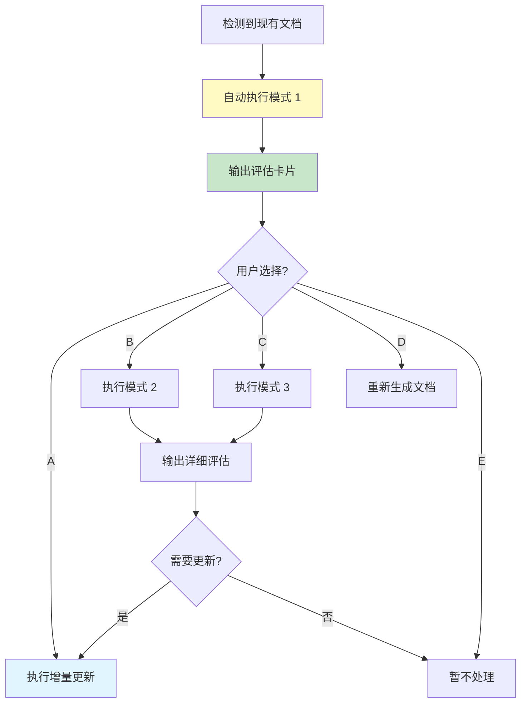

# 路径 B: 文档健康度检查

> **触发条件**: `dev_docs/` 存在且主文档存在  
> **执行时机**: Step 1 路由决策后  
> **前置步骤**: Step 0 (环境预检) 已完成  
> **更新日期**: 2025-12-19

---

## 🎯 设计理念

**目的**: 评估现有文档的健康状态，决定是否需要更新。

**核心价值**:
- 🔍 **快速评估** - 1 分钟内了解文档状态
- 📊 **量化评分** - 百分制评分，直观了解健康度
- 🎯 **精准建议** - 基于评估结果给出明确的行动建议
- ⚡ **灵活选择** - 3 种检查模式，适应不同场景

---

## 📋 检查模式概览

| 模式 | 时长 | Token 消耗 | 检查深度 | 适用场景 |
|------|------|-----------|---------|---------|
| [模式 1: 快速扫描 ⚡](#模式-1-快速扫描) | 1 分钟 | ~50 tokens | 基础 | 快速评估 |
| [模式 2: 标准检查 ⭐](#模式-2-标准检查) | 3-5 分钟 | ~250 tokens | 中等 | 常规评估（推荐） |
| [模式 3: 深度分析 🔍](#模式-3-深度分析) | 10-15 分钟 | ~900 tokens | 深入 | 长期未更新或重大变更后 |

> **注意**: Token 消耗仅作为量级参考，实际消耗取决于项目规模。

---

## 🚀 执行流程

> **P1 增强说明**: 当用户选择模式 2（标准检查）或模式 3（深度分析）时，除 `doc_health_checker` 外，建议追加执行 `semantic_review_checker`，用于发现量化声明失真、测试资产漏覆盖和事实源冲突。

### 默认行为

**AI 应该**:
1. 自动执行模式 1（快速扫描）
2. 输出评估卡片
3. 给出选项让用户选择（A/B/C/D/E）

**不应该**:
- ❌ 询问用户"是否执行健康检查"（直接执行）
- ❌ 询问用户"选择哪种模式"（默认模式 1）
- ❌ 等待用户确认后才开始（主动执行）

### 执行流程图



---

## 模式 1: 快速扫描 ⚡

### 检查内容

| 检查项 | 检查方法 | 权重 |
|--------|---------|------|
| 文档完整性 | 检查必需文档是否存在 | 30% |
| 文档新鲜度 | 检查 verified_at 距今天数 | 30% |
| 代码变更 | 检测代码文件修改时间 | 25% |
| 结构完整性 | 检查目录结构是否完整 | 15% |

### 执行步骤

#### 1.1 检查文档完整性

**检查方法**:
```bash
# 检查必需文档是否存在
# Windows PowerShell
Test-Path dev_docs/AI_Coding_Context.md
Test-Path dev_docs/_analysis/generation_plan.md
Test-Path dev_docs/_analysis/generation_progress.md

# Linux/Mac
test -f dev_docs/AI_Coding_Context.md && echo "存在" || echo "缺失"
```

**评分规则**:
- 主文档存在: +10 分
- 分析方案存在: +10 分
- 进度记录存在: +5 分
- 每个子文档存在: +5 分（最多 5 个）

**示例**:
```markdown
### 文档完整性检查

✅ 主文档: dev_docs/AI_Coding_Context.md
✅ 分析方案: dev_docs/_analysis/generation_plan.md
✅ 进度记录: dev_docs/_analysis/generation_progress.md

📁 子文档 (8/10):
- ✅ architecture_overview.md
- ✅ api_layer.md
- ✅ state_management.md
- ✅ routing_guide.md
- ✅ component_guide.md
- ✅ testing_guide.md
- ✅ deployment_guide.md
- ✅ performance_optimization.md
- ❌ troubleshooting.md (缺失)
- ❌ security_guide.md (缺失)

**得分**: 28/30 分
```

#### 1.2 检查文档新鲜度

**检查方法**:
```bash
# 读取主文档的 verified_at 字段
# 从 YAML frontmatter 中提取
grep "verified_at" dev_docs/AI_Coding_Context.md
```

**评分规则**:
- ≤ 7 天: 30 分（优秀）
- 8-30 天: 25 分（良好）
- 31-90 天: 15 分（一般）
- 91-180 天: 5 分（较差）
- > 180 天: 0 分（极差）

**示例**:
```markdown
### 文档新鲜度检查

📅 最后验证时间: 2025-11-15
📆 距今天数: 34 天

**评估**: 🟡 一般（31-90 天）

**得分**: 15/30 分
```

#### 1.3 检测代码变更

**检查方法**:
```bash
# 方法 1: 使用 Git（推荐）
git diff --name-only HEAD $(git log -1 --format=%H -- dev_docs/AI_Coding_Context.md)

# 方法 2: 比较文件修改时间
# 查找比文档更新时间晚的代码文件
find src/ -type f -newer dev_docs/AI_Coding_Context.md
```

**评分规则**:
- 无变更: 25 分
- 1-5 个文件: 20 分
- 6-20 个文件: 10 分
- 21-50 个文件: 5 分
- > 50 个文件: 0 分

**示例**:
```markdown
### 代码变更检测

🔍 检测方法: Git diff

**变更文件**: 15 个
- src/api/user.ts
- src/api/auth.ts
- src/components/UserProfile.vue
- ... (共 15 个)

**评估**: 🟡 中等变更（6-20 个文件）

**得分**: 10/25 分
```

#### 1.4 检查结构完整性

**检查方法**:
```bash
# 检查必需目录是否存在
test -d dev_docs/_analysis
test -d dev_docs/plans
test -d dev_docs/knowledge
```

**评分规则**:
- _analysis/ 存在: +5 分
- plans/ 存在: +5 分
- knowledge/ 存在: +5 分

**示例**:
```markdown
### 结构完整性检查

✅ dev_docs/_analysis/ (分析文件)
✅ dev_docs/plans/ (方案文档)
❌ dev_docs/knowledge/ (知识库) - 缺失

**得分**: 10/15 分
```

### 输出评估卡片

```markdown
✅ 文档健康度检查完成（模式 1: 快速扫描）

┌─────────────────────────────────────────┐
│  📊 健康度评分: 63/100 🟡 一般          │
├─────────────────────────────────────────┤
│  📁 文档完整性: 28/30 ✅                │
│  📅 文档新鲜度: 15/30 🟡                │
│  🔍 代码变更:   10/25 🟡                │
│  📂 结构完整性: 10/15 ✅                │
└─────────────────────────────────────────┘

**评估结论**: 文档基本完整，但部分内容可能过时

**主要问题**:
- 🟡 距上次更新已 34 天
- 🟡 检测到 15 个文件变更
- ❌ 缺少 2 个子文档
- ❌ 缺少 knowledge/ 目录

💡 **建议操作**:

A. **执行增量更新**（推荐）
   - 更新变更的 15 个文件相关文档
   - 补充缺失的 2 个子文档
   - 预计耗时: 30-60 分钟

B. **执行标准检查**
   - 深入评估文档质量
   - 检查内容准确性
   - 预计耗时: 3-5 分钟

C. **执行深度分析**
   - 全面评估文档状态
   - 检查所有细节
   - 预计耗时: 10-15 分钟

D. **重新生成文档**
   - 完全重建文档体系
   - 适合变更较大的情况
   - 预计耗时: 2-8 小时

E. **暂不处理**
   - 文档仍然可用
   - 稍后再更新

请选择: A / B / C / D / E
```

---

## 模式 2: 标准检查 ⭐

### 检查内容

**在模式 1 的基础上，增加**:

| 检查项 | 检查方法 | 权重 |
|--------|---------|------|
| 内容准确性 | 抽查代码示例是否匹配 | 20% |
| 链接有效性 | 检查内部链接是否有效 | 10% |
| 摘要完整性 | 检查 YAML frontmatter | 10% |

### 执行步骤

#### 2.1 检查内容准确性

**检查方法**: 抽查 3-5 个代码示例，验证是否与实际代码匹配

**示例**:
```markdown
### 内容准确性检查

**抽查样本**: 3 个代码示例

#### 示例 1: API 层 - getUser 函数
**文档位置**: dev_docs/api_layer.md:45-50
**代码位置**: src/api/user.ts:10-14

**对比结果**: ⚠️ 不匹配
- 文档中: `function getUser(id: string)`
- 实际代码: `function getUser(id: string, includeProfile: boolean)`
- 问题: 缺少 includeProfile 参数

#### 示例 2: 状态管理 - store 配置
**文档位置**: dev_docs/state_management.md:30-35
**代码位置**: src/store/index.ts:5-10

**对比结果**: ✅ 匹配

#### 示例 3: 路由配置
**文档位置**: dev_docs/routing_guide.md:20-25
**代码位置**: src/router/index.ts:15-20

**对比结果**: ✅ 匹配

**得分**: 13/20 分（2/3 匹配）
```

#### 2.2 检查链接有效性

**检查方法**: 检查文档中的内部链接是否有效

**示例**:
```markdown
### 链接有效性检查

**检查范围**: 所有内部链接

**结果**:
- ✅ 有效链接: 25 个
- ❌ 失效链接: 2 个

**失效链接详情**:
1. dev_docs/api_layer.md:100
   - 链接: [数据库设计](./database_design.md)
   - 问题: 目标文件不存在

2. dev_docs/component_guide.md:50
   - 链接: [样式指南](./styling_guide.md)
   - 问题: 目标文件不存在

**得分**: 8/10 分
```

#### 2.3 检查摘要完整性

**检查方法**: 检查所有文档的 YAML frontmatter 是否完整

**示例**:
```markdown
### 摘要完整性检查

**检查范围**: 所有文档的 YAML frontmatter

**结果**:
- ✅ 完整: 7 个文档
- ⚠️ 不完整: 2 个文档

**不完整文档详情**:
1. dev_docs/testing_guide.md
   - 缺少字段: related_files
   - 影响: 无法自动检测关联变更

2. dev_docs/deployment_guide.md
   - 缺少字段: verified_at
   - 影响: 无法判断文档新鲜度

**得分**: 7/10 分
```

### 输出详细评估

```markdown
✅ 文档健康度检查完成（模式 2: 标准检查）

┌─────────────────────────────────────────┐
│  📊 健康度评分: 76/100 🟢 良好          │
├─────────────────────────────────────────┤
│  📁 文档完整性: 28/30 ✅                │
│  📅 文档新鲜度: 15/30 🟡                │
│  🔍 代码变更:   10/25 🟡                │
│  📂 结构完整性: 10/15 ✅                │
│  ✏️ 内容准确性: 13/20 🟡                │
│  🔗 链接有效性: 8/10 ✅                 │
│  📋 摘要完整性: 7/10 ✅                 │
└─────────────────────────────────────────┘

**评估结论**: 文档整体良好，但存在部分过时内容

**详细问题**:

### 🔴 严重问题 (需立即处理)
无

### 🟡 警告问题 (建议处理)
1. API 层文档中的 getUser 函数示例不匹配
   - 位置: dev_docs/api_layer.md:45-50
   - 问题: 缺少 includeProfile 参数
   - 建议: 更新代码示例

2. 2 个内部链接失效
   - database_design.md 不存在
   - styling_guide.md 不存在
   - 建议: 创建缺失文档或删除链接

3. 2 个文档的 YAML frontmatter 不完整
   - testing_guide.md 缺少 related_files
   - deployment_guide.md 缺少 verified_at
   - 建议: 补充缺失字段

### 🔵 疑问事项 (需确认)
1. 距上次更新已 34 天，是否需要更新？
2. 检测到 15 个文件变更，是否影响文档？

💡 **建议操作**:

A. **执行增量更新**（推荐）
   - 更新 API 层文档中的代码示例
   - 补充缺失的 YAML 字段
   - 处理失效链接
   - 预计耗时: 30-60 分钟

B. **执行深度分析**
   - 全面检查所有文档
   - 发现更多潜在问题
   - 预计耗时: 10-15 分钟

C. **重新生成文档**
   - 完全重建文档体系
   - 确保所有内容最新
   - 预计耗时: 2-8 小时

D. **暂不处理**
   - 问题不严重，可以稍后处理

请选择: A / B / C / D
```

---

## 模式 3: 深度分析 🔍

### 检查内容

**在模式 2 的基础上，增加**:

| 检查项 | 检查方法 | 权重 |
|--------|---------|------|
| 架构一致性 | 检查架构图与代码是否一致 | 15% |
| 测试覆盖度 | 检查测试文档是否完整 | 10% |
| 知识库完整性 | 检查知识库是否有价值 | 5% |

### 执行步骤

#### 3.1 检查架构一致性

**检查方法**: 对比架构图与实际代码结构

**示例**:
```markdown
### 架构一致性检查

**检查内容**: 架构图 vs 实际代码结构

#### 架构图中的模块
1. API 层 (src/api/)
2. 状态管理 (src/store/)
3. 路由 (src/router/)
4. 组件 (src/components/)
5. 工具库 (src/utils/)

#### 实际代码结构
1. ✅ src/api/ - 存在
2. ✅ src/store/ - 存在
3. ✅ src/router/ - 存在
4. ✅ src/components/ - 存在
5. ✅ src/utils/ - 存在
6. ⚠️ src/services/ - 架构图中未提及

**问题**: 实际代码中存在 services/ 目录，但架构图中未体现

**得分**: 12/15 分
```

#### 3.2 检查测试覆盖度

**检查方法**: 检查测试文档是否覆盖所有模块

**示例**:
```markdown
### 测试覆盖度检查

**检查内容**: 测试文档 vs 实际模块

#### 测试文档中的模块
1. API 层测试
2. 组件测试
3. 工具库测试

#### 实际模块
1. ✅ API 层 - 有测试文档
2. ✅ 组件 - 有测试文档
3. ✅ 工具库 - 有测试文档
4. ❌ 状态管理 - 无测试文档
5. ❌ 路由 - 无测试文档

**问题**: 状态管理和路由模块缺少测试文档

**得分**: 6/10 分
```

#### 3.3 检查知识库完整性

**检查方法**: 检查 knowledge/ 目录是否有价值内容

**示例**:
```markdown
### 知识库完整性检查

**检查内容**: dev_docs/knowledge/ 目录

**结果**: ❌ 目录不存在

**建议**: 创建知识库目录，包含：
- 编码规范
- 常见问题
- 最佳实践
- 技术决策记录 (ADR)

**得分**: 0/5 分
```

### 输出深度分析报告

```markdown
✅ 文档健康度检查完成（模式 3: 深度分析）

┌─────────────────────────────────────────┐
│  📊 健康度评分: 71/100 🟢 良好          │
├─────────────────────────────────────────┤
│  📁 文档完整性:   28/30 ✅              │
│  📅 文档新鲜度:   15/30 🟡              │
│  🔍 代码变更:     10/25 🟡              │
│  📂 结构完整性:   10/15 ✅              │
│  ✏️ 内容准确性:   13/20 🟡              │
│  🔗 链接有效性:   8/10 ✅               │
│  📋 摘要完整性:   7/10 ✅               │
│  🏗️ 架构一致性:   12/15 🟡              │
│  🧪 测试覆盖度:   6/10 🟡               │
│  📚 知识库完整性: 0/5 ❌                │
└─────────────────────────────────────────┘

**评估结论**: 文档整体良好，但存在架构不一致和知识库缺失问题

**详细分析报告**: 参见 dev_docs/_analysis/health_check_report.md

💡 **建议操作**:

A. **执行增量更新**（推荐）
   - 更新架构图（添加 services/ 模块）
   - 补充测试文档（状态管理、路由）
   - 创建知识库目录
   - 修复其他问题
   - 预计耗时: 1-2 小时

B. **重新生成文档**
   - 完全重建文档体系
   - 确保所有内容最新且完整
   - 预计耗时: 2-8 小时

C. **暂不处理**
   - 问题不严重，可以稍后处理

请选择: A / B / C
```

---

## 📊 健康度评分标准

### 评分等级

| 分数范围 | 等级 | 图标 | 说明 | 建议操作 |
|---------|------|------|------|---------|
| 90-100 | 优秀 | ✅ | 文档完整且最新 | 保持现状 |
| 70-89 | 良好 | 🟢 | 文档基本准确，有小问题 | 增量更新 |
| 50-69 | 一般 | 🟡 | 文档部分过时，需要更新 | 增量更新或重新生成 |
| 30-49 | 较差 | 🟠 | 文档严重过时，建议重新生成 | 重新生成 |
| 0-29 | 极差 | 🔴 | 文档不可用，必须重新生成 | 重新生成 |

### 评分权重（模式 3）

| 检查项 | 权重 | 说明 |
|--------|------|------|
| 文档完整性 | 30% | 必需文档是否存在 |
| 文档新鲜度 | 30% | 距上次更新的时间 |
| 代码变更 | 25% | 代码变更的数量 |
| 结构完整性 | 15% | 目录结构是否完整 |
| 内容准确性 | 20% | 代码示例是否匹配 |
| 链接有效性 | 10% | 内部链接是否有效 |
| 摘要完整性 | 10% | YAML frontmatter 是否完整 |
| 架构一致性 | 15% | 架构图与代码是否一致 |
| 测试覆盖度 | 10% | 测试文档是否完整 |
| 知识库完整性 | 5% | 知识库是否有价值 |

**总分**: 170 分，归一化到 100 分

---

## 🔄 后续行动

### 行动 A: 执行增量更新

**跳转到**: [路径 C: 增量更新流程](./path_c_incremental_update.md)

**执行内容**:
- 更新变更的文件相关文档
- 补充缺失的文档
- 修复发现的问题

### 行动 B/C: 执行更深入的检查

**执行内容**:
- 模式 1 → 模式 2
- 模式 2 → 模式 3

### 行动 D: 重新生成文档

**跳转到**: [路径 A: 首次生成流程](./path_a_first_generation.md)

**执行内容**:
- 从 Step 2 开始
- 完全重建文档体系

### 行动 E: 暂不处理

**执行内容**:
- 记录健康度评分
- 提醒用户稍后更新

---

## 🛠️ 降级策略

### Git 不可用

**方案 1: 文件时间对比（双向）**

```bash
# 查找比文档更新时间晚的代码文件
find src/ -type f -newer dev_docs/AI_Coding_Context.md

# 查找比代码更新时间晚的文档文件
find dev_docs/ -type f -newer src/
```

**方案 2: 用户提供**

```markdown
⚠️ Git 不可用，无法自动检测代码变更

请告诉我：
1. 自上次文档更新以来，您修改了哪些文件？
2. 主要修改了什么内容？

或者，您可以提供 Git diff 输出。
```

**方案 3: 仅基于时间**

```markdown
⚠️ 无法检测代码变更，仅基于时间评估

**文档更新时间**: 2025-11-15 (34 天前)

**建议**: 如果这段时间内有代码变更，建议执行增量更新
```

---

## 🛠️ 故障处理

**详细说明**: 参见 [workflows/shared/failure_handling.md](./shared/failure_handling.md)

**常见故障**:
- Git 不可用 → 使用文件时间对比
- 工具不可用 → 手动检查
- 文档格式错误 → 标记为疑问事项

---

## ✅ AI 自检项

**详细说明**: 参见 [workflows/shared/ai_checklist.md](./shared/ai_checklist.md)

**健康检查特定检查项**:

- [ ] 已执行模式 1（快速扫描）
- [ ] 评估卡片已输出
- [ ] 评分准确（基于实际检测结果）
- [ ] 建议操作明确
- [ ] 用户选项清晰（A/B/C/D/E）

---

## 📌 导航

[← 返回主文档](../AI_ENTRY_POINT.md) | [查看其他路径](../AI_ENTRY_POINT.md#路由索引-routing-index)
