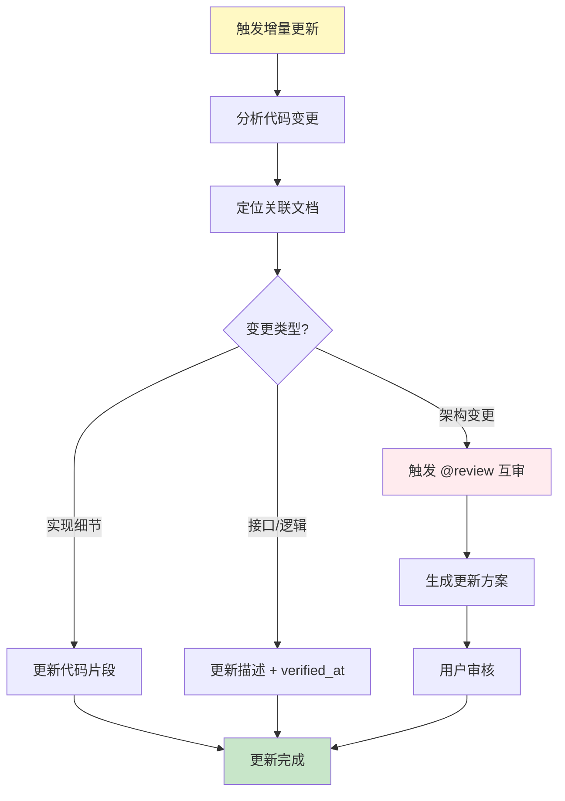
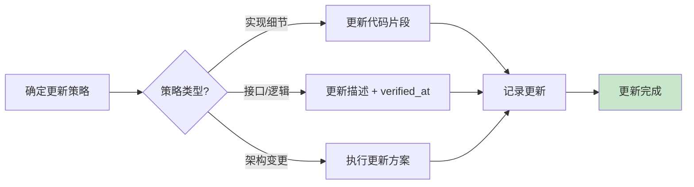

# 路径 C: 增量更新流程 (Commit-Guided)

> **触发条件**: 检测到 `@commit` 或 Git 上下文  
> **执行时机**: Step 1 路由决策后  
> **前置步骤**: Step 0 (环境预检) 已完成  
> **更新日期**: 2025-12-19

---

## 🎯 设计理念

**目的**: 确保设计文档与代码实现永远同步。

**核心机制**: Commit-Guided（提交引导）
- 每次 Git Commit 前（Pre-commit）
- 每次完成功能开发后
- 用户主动触发（`@commit`）

**关键特性**:
- 🎯 **精准定位** - 基于代码变更自动定位相关文档
- 🔍 **智能更新** - 根据变更类型选择更新策略
- ⚡ **快速执行** - 只更新变更相关的部分
- 📊 **可追溯** - 记录每次更新的原因和范围

---

## 📋 工作流概览



---

## 🚀 执行流程

### Step 1: 分析代码变更

**目的**: 获取自上次文档更新以来的所有代码变更。

#### 1.1 使用 Git Diff 分析工具

**工具**: `tools/py/git_diff_analyzer.py`

**执行命令**:
```bash
# Python 版本（推荐）
python tools/py/git_diff_analyzer.py

# 输出格式: JSON
{
  "changed_files": [
    {
      "path": "src/api/user.ts",
      "change_type": "modified",
      "lines_added": 15,
      "lines_deleted": 3,
      "change_summary": "添加用户权限检查"
    },
    {
      "path": "src/components/UserProfile.vue",
      "change_type": "modified",
      "lines_added": 8,
      "lines_deleted": 2,
      "change_summary": "更新用户信息显示"
    }
  ],
  "total_files": 2,
  "total_additions": 23,
  "total_deletions": 5
}
```

#### 1.2 降级方案（Git 不可用）

**方案 1: 使用文件时间戳对比**

```bash
# 查找最近修改的文件（最近 7 天）
# Windows PowerShell
Get-ChildItem -Recurse -File | Where-Object {$_.LastWriteTime -gt (Get-Date).AddDays(-7)} | Select-Object FullName, LastWriteTime

# Linux/Mac
find . -type f -mtime -7 -ls
```

**方案 2: 询问用户**

```markdown
⚠️ Git 不可用，无法自动检测代码变更

请告诉我：
1. 您修改了哪些文件？
2. 主要修改了什么内容？

或者，您可以提供 Git diff 输出：
```bash
git diff HEAD~1 HEAD
```
```

---

### Step 2: 定位关联文档

**目的**: 找到与变更文件相关的文档。

#### 2.1 使用摘要关联检查工具

**工具**: `tools/py/summary_related_checker.py`

**执行命令**:
```bash
# Python 版本（推荐）
python tools/py/summary_related_checker.py --changed-files "src/api/user.ts,src/components/UserProfile.vue"

# 输出格式: JSON
{
  "related_docs": [
    {
      "doc_path": "dev_docs/api_layer.md",
      "related_files": ["src/api/user.ts", "src/api/auth.ts"],
      "match_count": 1,
      "verified_at": "2025-11-15"
    },
    {
      "doc_path": "dev_docs/component_guide.md",
      "related_files": ["src/components/UserProfile.vue", "src/components/UserCard.vue"],
      "match_count": 1,
      "verified_at": "2025-11-15"
    }
  ],
  "total_docs": 2
}
```

#### 2.2 工作原理

**基于 YAML Frontmatter 的 `related_files` 字段**:

```yaml
---
summary:
  purpose: "API 层设计说明"
  related_files: "src/api/user.ts | src/api/auth.ts | src/api/product.ts"
  verified_at: "2025-11-15"
---
```

**匹配逻辑**:
1. 读取所有文档的 YAML frontmatter
2. 提取 `related_files` 字段
3. 与变更文件列表进行匹配
4. 返回匹配的文档列表

#### 2.3 降级方案（工具不可用）

**方案 1: 手动搜索**

```bash
# 在文档中搜索文件路径
# Windows PowerShell
Select-String -Path "dev_docs\*.md" -Pattern "src/api/user.ts"

# Linux/Mac
grep -r "src/api/user.ts" dev_docs/
```

**方案 2: 基于目录结构推断**

```markdown
变更文件: src/api/user.ts
推断相关文档: dev_docs/api_layer.md

变更文件: src/components/UserProfile.vue
推断相关文档: dev_docs/component_guide.md
```

---

### Step 3: 智能更新

**目的**: 根据变更类型，选择合适的更新策略。

#### 3.1 变更类型分类

| 变更类型 | 识别特征 | 更新策略 | 示例 |
|---------|---------|---------|------|
| **实现细节变更** | 函数内部逻辑、变量名 | 仅更新代码片段 | 优化算法、重命名变量 |
| **接口/逻辑变更** | 函数签名、API 端点 | 更新描述 + verified_at | 修改参数、新增字段 |
| **架构变更** | 新增模块、重构结构 | 触发 @review 互审 | 引入新框架、拆分模块 |

#### 3.2 实现细节变更

**特征**:
- 函数内部逻辑优化
- 变量名重命名
- 代码格式调整
- 注释更新

**更新策略**: 仅更新文档中的代码片段

**示例**:

**变更前**:
```typescript
// src/api/user.ts
function getUser(id: string) {
  return fetch(`/api/users/${id}`);
}
```

**变更后**:
```typescript
// src/api/user.ts
async function getUser(id: string): Promise<User> {
  const response = await fetch(`/api/users/${id}`);
  return response.json();
}
```

**文档更新**:
```markdown
## 用户 API

### 获取用户信息

```typescript
// src/api/user.ts:10-14
async function getUser(id: string): Promise<User> {
  const response = await fetch(`/api/users/${id}`);
  return response.json();
}
```

**说明**: 获取指定 ID 的用户信息

---

**更新记录**:
- 更新时间: 2025-12-19
- 更新原因: 代码实现优化（添加类型注解和异步处理）
- 变更类型: 实现细节变更
```

#### 3.3 接口/逻辑变更

**特征**:
- 函数签名修改
- API 端点变更
- 新增/删除参数
- 返回值类型变更

**更新策略**: 更新描述 + 刷新 `verified_at`

**示例**:

**变更前**:
```typescript
// src/api/user.ts
function getUser(id: string): Promise<User>
```

**变更后**:
```typescript
// src/api/user.ts
function getUser(id: string, includeProfile: boolean = false): Promise<User>
```

**文档更新**:
```markdown
## 用户 API

### 获取用户信息

```typescript
// src/api/user.ts:10-14
function getUser(
  id: string, 
  includeProfile: boolean = false
): Promise<User>
```

**参数**:
- `id`: 用户 ID
- `includeProfile`: 是否包含详细资料（新增，默认 false）

**返回值**: 用户对象

---

**更新记录**:
- 更新时间: 2025-12-19
- 更新原因: 新增 includeProfile 参数
- 变更类型: 接口变更
- verified_at: 2025-12-19 ⭐ 已刷新
```

**YAML Frontmatter 更新**:
```yaml
---
summary:
  purpose: "API 层设计说明"
  related_files: "src/api/user.ts | src/api/auth.ts"
  verified_at: "2025-12-19"  # ⭐ 更新日期
---
```

#### 3.4 架构变更

**特征**:
- 新增模块或服务
- 重构目录结构
- 引入新框架或库
- 修改核心架构

**更新策略**: 触发 @review 互审流程

**示例**:

**变更检测**:
```markdown
🔴 检测到架构变更

**变更内容**:
- 新增模块: src/services/notification/
- 新增文件: 15 个
- 影响范围: 核心架构

**建议**: 触发 AI 互审流程，重新评估文档结构
```

**执行流程**:
```
检测到架构变更 → 触发 @review → 生成更新方案 → 用户审核 → 执行更新
```

**更新方案示例**:
```markdown
## 架构变更更新方案

### 变更概述

**变更类型**: 新增通知服务模块

**影响范围**:
- 新增文档: notification_service.md
- 更新文档: architecture_overview.md, api_layer.md
- 影响子文档: 2 个

### 更新计划

#### 1. 新增文档

**文档**: dev_docs/notification_service.md

**内容**:
- 通知服务架构
- API 接口说明
- 使用示例

#### 2. 更新现有文档

**文档 1**: dev_docs/architecture_overview.md

**更新内容**:
- 在架构图中添加通知服务模块
- 说明通知服务与其他模块的关系

**文档 2**: dev_docs/api_layer.md

**更新内容**:
- 添加通知相关 API 端点
- 更新 API 列表

### 审核要点

- [ ] 新增文档结构是否合理
- [ ] 架构图是否准确
- [ ] API 说明是否完整

请审核后回复 "方案审核通过"
```

---

### Step 4: 执行更新

**目的**: 根据更新策略，实际修改文档。

#### 4.1 更新流程



#### 4.2 更新记录

**在每个更新的文档末尾，添加更新记录**:

```markdown
---

## 📝 更新记录

### 2025-12-19

**更新原因**: 代码变更（Commit: abc123）

**变更文件**:
- src/api/user.ts

**更新内容**:
- 更新 getUser 函数代码片段
- 新增 includeProfile 参数说明

**变更类型**: 接口变更

**验证状态**: ✅ 已验证（verified_at: 2025-12-19）

---

### 2025-11-15

**更新原因**: 初始生成

**生成方式**: 首次生成流程

**验证状态**: ✅ 已验证（verified_at: 2025-11-15）
```

---

## 🎯 触发机制

### 触发方式 1: 用户主动触发

**指令**: `@commit`

**执行时机**: 用户完成代码修改后

**示例**:
```
用户: @commit

AI: 
✅ 检测到增量更新请求

正在分析代码变更...
[执行 Step 1-4]
```

### 触发方式 2: Git Commit 时自动触发

**触发条件**: 检测到用户输入包含 `git commit` 关键词

**执行时机**: 用户准备提交代码时

**示例**:
```
用户: 我准备 git commit 了

AI:
✅ 检测到 Git Commit 上下文

建议先执行文档增量更新，确保文档与代码同步。

是否立即执行？(Y/n)
```

### 触发方式 3: Pre-commit Hook（未来支持）

**触发条件**: Git Pre-commit Hook

**执行时机**: 执行 `git commit` 命令时自动触发

**实现方式**:
```bash
# .git/hooks/pre-commit
#!/bin/bash

# 调用 AI 执行增量更新
ai-assistant @commit

# 如果更新失败，阻止提交
if [ $? -ne 0 ]; then
  echo "文档更新失败，请先更新文档"
  exit 1
fi
```

---

## 📊 更新统计

**在更新完成后，输出统计信息**:

```markdown
✅ 增量更新完成！

📊 更新统计:
- 变更文件: 2 个
- 关联文档: 2 个
- 更新类型: 接口变更 (1), 实现细节 (1)
- 更新时间: 2025-12-19 14:30
- 耗时: 2 分钟

📝 更新详情:

### dev_docs/api_layer.md
- 更新原因: src/api/user.ts 接口变更
- 更新内容: 新增 includeProfile 参数说明
- verified_at: 2025-12-19 ✅

### dev_docs/component_guide.md
- 更新原因: src/components/UserProfile.vue 实现优化
- 更新内容: 更新代码片段
- verified_at: 2025-11-15 (未刷新)

💡 建议:
- 所有文档已更新
- 可以安全提交代码
```

---

## 🛠️ 故障处理

**详细说明**: 参见 [workflows/shared/failure_handling.md](./shared/failure_handling.md)

### 常见故障

#### 故障 1: Git 不可用

**降级方案**: 使用文件时间戳对比或询问用户

#### 故障 2: 工具不可用

**降级方案**: 手动搜索或基于目录结构推断

#### 故障 3: 无法确定变更类型

**处理方式**: 标记为疑问事项，询问用户

```markdown
🔵 疑问：无法确定变更类型

**变更文件**: src/api/user.ts
**变更内容**: 修改了 getUser 函数

**可能的类型**:
A. 实现细节变更（仅更新代码片段）
B. 接口变更（更新描述 + verified_at）
C. 架构变更（触发互审）

请选择: A / B / C
```

---

## ✅ AI 自检项

**详细说明**: 参见 [workflows/shared/ai_checklist.md](./shared/ai_checklist.md)

**增量更新特定检查项**:

- [ ] 所有变更文件都已分析
- [ ] 所有关联文档都已定位
- [ ] 变更类型判断准确
- [ ] 更新策略选择合理
- [ ] verified_at 字段已更新（接口/逻辑变更）
- [ ] 更新记录已添加
- [ ] 用户已确认更新结果

---

## 📌 导航

[← 返回主文档](../AI_ENTRY_POINT.md) | [查看其他路径](../AI_ENTRY_POINT.md#路由索引)
